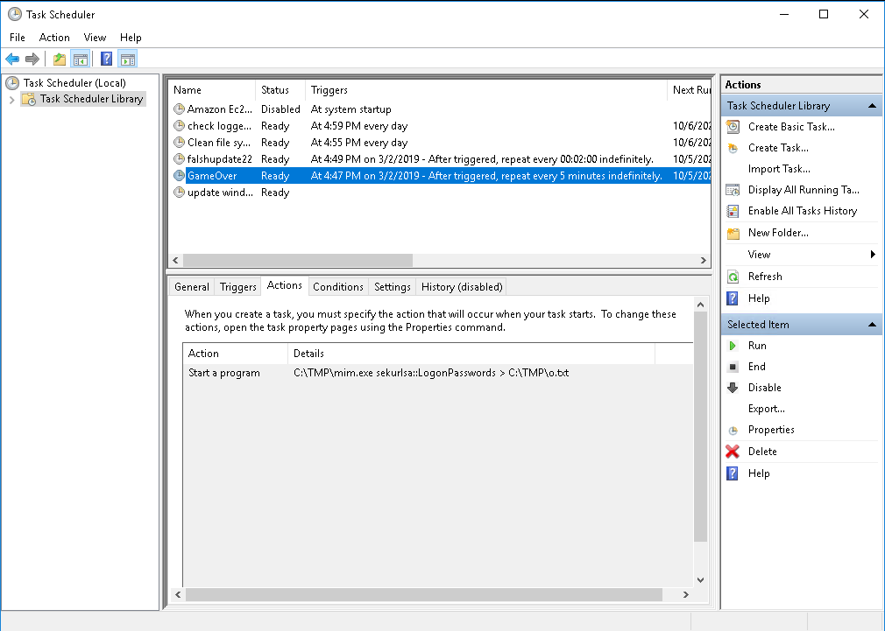
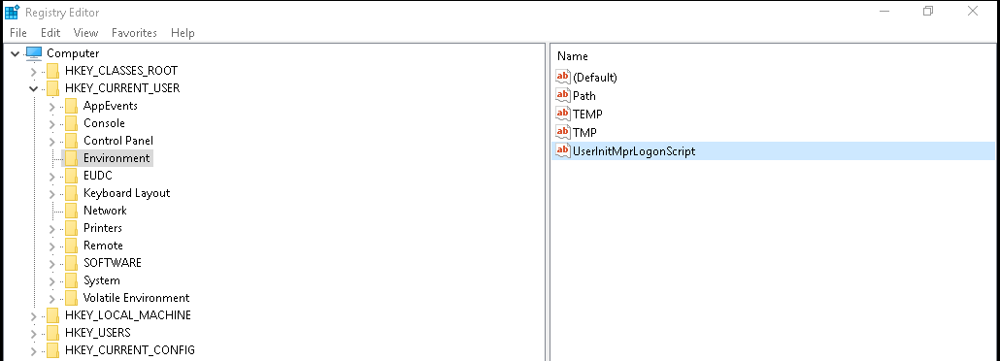
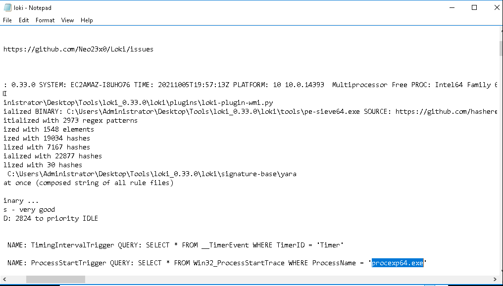
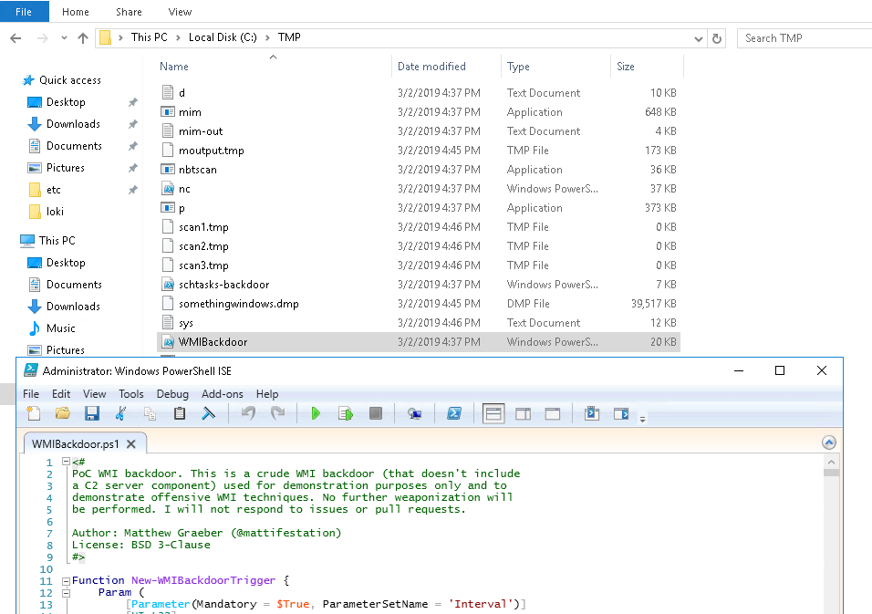
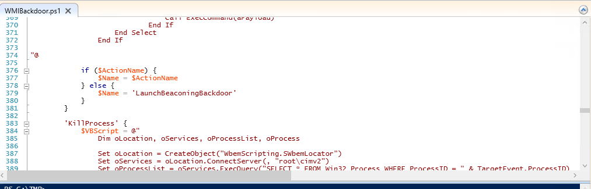
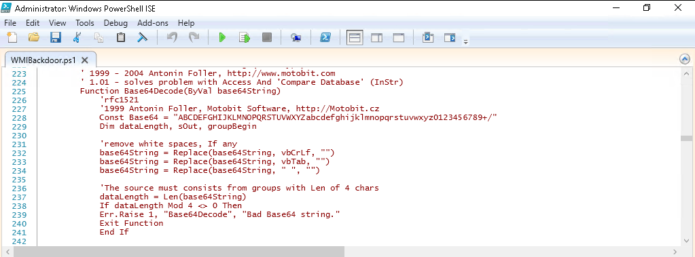
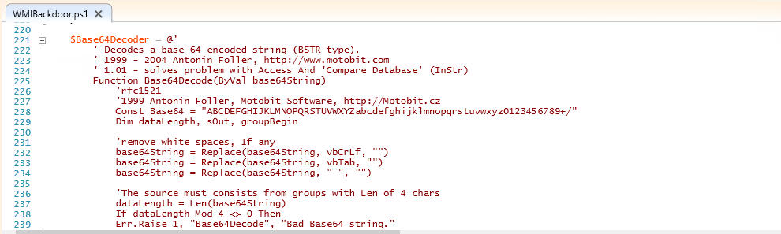
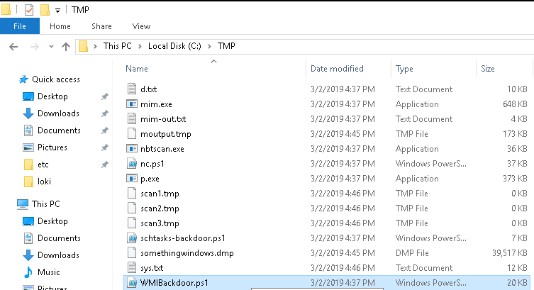

# Investigating Windows 2.0 #

## Task 1 Investigating Windows 2.0 ##

```bash
tim@kali:~/Bureau/tryhackme/write-up$ sudo sh -c "echo '10.10.115.227 windows2.thm' > /etc/hosts"
[sudo] Mot de passe de tim : 
```

**What registry key contains the same command that is executed within a scheduled task?**




On fait une recherche avec sekurlsa, on trouve la clef regedit : \HKCU\Environment\UserInitMprLogonScript   

**What analysis tool will immediately close if/when you attempt to launch it?**

Le fichier procexp64.exe, quand on le lance, il est immédiatement fermé.   

**What is the full WQL Query associated with this script?**



On lance loki et trouve la requête suivante : SELECT * FROM Win32_ProcessStartTrace WHERE ProcessName = 'procexp64.exe'  

**What is the script language?**



On ouvre le fichier WMIBackdoor.ps1.  

Le fichier est en : vbscript   

**What is the name of the other script?**



Dans le fichier on trouve le nom de l'autre script est : LaunchBeaconingBackdoor    

**What is the name of the software company visible within the script?**



Le nom de la compagnie est : Motobit Software    

**What 2 websites are associated with this software company? (answer, answer)**  

  

Les deux sites sont : http://www.motobit.com,http://Motobit.cz

**Search online for the name of the script from Q5 and one of the websites from the previous answer. What attack script comes up in your search?**

Quand on fait une recherche on trouve le nom : WMIBackdoor.ps1  

**What is the location of this file within the local machine**

  

On qui est dans C:\TMP


**Which 2 processes open and close very quickly every few minutes? (answer, answer)**

On voit de temps en temps des deux fenêtres qui apparaissent et qui se fermes.   

Les deux programme sont : mim.exe,powershell.exe   

**What is the parent process for these 2 processes?**

Dans le task manager on voit que le parent des 2 processus est : svchost.exe   

**What is the first operation for the first of the 2 processes?**

La première opération des 2 proccessus est : Process Start    

**Inspect the properties for the 1st occurrence of this process. In the Event tab what are the 4 pieces of information displayed? (answer, answer, answer, answer)**

Dans event propreties, les informations sont : Parent PID, Command line, Current directory, Environment    

**Inspect the disk operations, what is the name of the unusual process?**

Le processus inhabituel est : No Process    

**Run Loki. Inspect the output. What is the name of the module after Init?**

Le nom du module après Init est : WMIScan   

**Regarding the 2nd warning, what is the name of the eventFilter?**

Le nom de eventFilter au deuxième warning est : ProcessStartTrigger    

**For the 4th warning, what is the class name?**

Pour 4 ème alerte, le nom de la classe est : __FilterToConsumerBinding

**What binary alert has the following 4d5a90000300000004000000ffff0000b8000000 as FIRST_BYTES?**

Toujours dans la sortie de loki, l'alerte qui les premiers octets indiqués est : nbtscan.exe   

**According to the results, what is the description listed for reason 1?**

Dans la section DESC, la description est : Known Bad / Dual use classics  

**Which binary alert is marked as APT Cloaked?**

Le binaire marqué APT Cloaked est : p.exe    

**What are the matches?**

Dans la section MATCHES on trouve : psexesvc.exe, Sysinternals PsExec  

**Which binary alert is associated with somethingwindows.dmp found in C:\TMP?**

D'arpès la sortie de loki, le binaire est : schtasks-backdoor.ps1   

**Which binary is encrypted that is similar to a trojan?**

Loki a trouvé Derusbi trojan dans le fichier : xCmd.exe   

**There is a binary that can masquerade itself as a legitimate core Windows process/image. What is the full path of this binary?**

Il faut se rappeler de svhost.  
Le chemin du fichier est : C:\Users\Public\svchost.exe   

**What is the full path location for the legitimate version?**

Le chemin du binaire svchost.exe légitime est : C:\Windows\System32

**What is the description listed for reason 1?**

Dans la section DESC : Stuff running where it normally shouldn't  

**There is a file in the same folder location that is labeled as a hacktool. What is the name of the file?**

Il y a un fichier étrange : en-US.js  

**What is the name of the Yara Rule MATCH?**

Il y un avertissement avec loki sur : CACTUSTORCH 

**Which binary didn't show in the Loki results?**

Le fichier que ne voit pas dans les résultat de loki est : mim.exe  

**Complete the yar rule file located within the Tools folder on the Desktop. What are 3 strings to complete the rule in order to detect the binary Loki didn't hit on? (answer, answer, answer)**

Avec les expréssions régulière on trouve :   

strings64.exe \tmp\mim.exe | findstr "??.?x?"      
strings64.exe \tmp\mim.exe | findstr "...exe"    
strings64.exe \tmp\mim.exe | findstr "mk.exe      

On trouve : mk.ps1, mk.exe, v2.0.50727        

