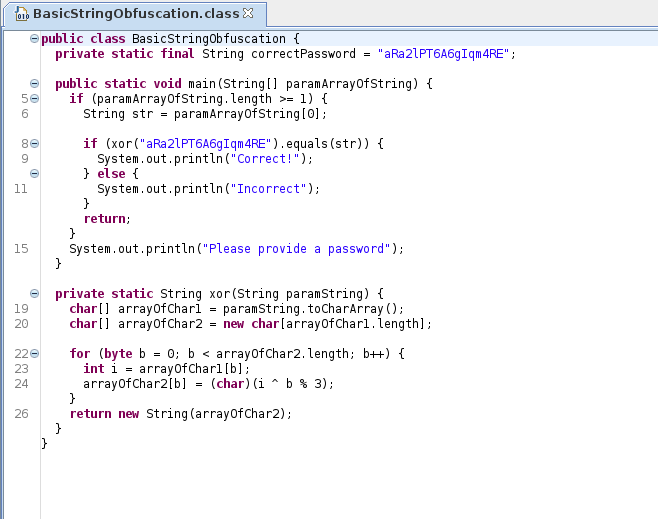

# JVM Reverse Engineering #

## Task 1 Introduction ##

**Which value is now at the top of the stack?**

LDC 0  # stock 0 sur la pile 0
LDC 3  # stock 3 sur la pile 3
SWAP   # échange les valeurs 3
POP    # récupère la valeur  3
INEG   # la rende négative  -3

La réponse est : -3   

**Which opcode is used to get the XOR of two longs? (answer in lowercase)**  

Dans la documentation de oracle on trouve la réponse qui est  : lxor   

**What does the -v flag on javap stand for? (answer in lowercase)**

```bash
tim@kali:~/Bureau/tryhackme/write-up$ javap -help
Picked up _JAVA_OPTIONS: -Dawt.useSystemAAFontSettings=on -Dswing.aatext=true
Usage: javap <options> <classes>
where possible options include:
  -? -h --help -help               Print this help message
  -version                         Version information
  -v  -verbose                     Print additional information
  -l                               Print line number and local variable tables
  -public                          Show only public classes and members
  -protected                       Show protected/public classes and members
  -package                         Show package/protected/public classes
                                   and members (default)
  -p  -private                     Show all classes and members
  -c                               Disassemble the code
  -s                               Print internal type signatures
  -sysinfo                         Show system info (path, size, date, MD5 hash)
                                   of class being processed
  -constants                       Show final constants
  --module <module>, -m <module>   Specify module containing classes to be disassembled
  --module-path <path>             Specify where to find application modules
  --system <jdk>                   Specify where to find system modules
  --class-path <path>              Specify where to find user class files
  -classpath <path>                Specify where to find user class files
  -cp <path>                       Specify where to find user class files
  -bootclasspath <path>            Override location of bootstrap class files

GNU-style options may use = instead of whitespace to separate the name of an option
from its value.

Each class to be shown may be specified by a filename, a URL, or by its fully
qualified class name. Examples:
   path/to/MyClass.class
   jar:file:///path/to/MyJar.jar!/mypkg/MyClass.class
   java.lang.Object
```

Dans l'aide on voit que -v veut dire verbose.   

Réponse : verbose     

**Task 2 Simple Hello World**

```bash
tim@kali:~/Bureau/tryhackme/write-up$ javap -v -p Main.class 
Picked up _JAVA_OPTIONS: -Dawt.useSystemAAFontSettings=on -Dswing.aatext=true
Classfile /home/tim/Bureau/tryhackme/write-up/Main.class
  Last modified 30 août 2021; size 438 bytes
  MD5 checksum ac137f1b1f296b8ad0d9b1710faa7c42
  Compiled from "SecretSourceFile.java"
class Main
  minor version: 0
  major version: 52
  flags: (0x0020) ACC_SUPER
  this_class: #5                          // Main
  super_class: #6                         // java/lang/Object
  interfaces: 0, fields: 0, methods: 2, attributes: 1
Constant pool:
   #1 = Methodref          #6.#15         // java/lang/Object."<init>":()V
   #2 = Fieldref           #16.#17        // java/lang/System.out:Ljava/io/PrintStream;
   #3 = String             #18            // Hello World
   #4 = Methodref          #19.#20        // java/io/PrintStream.println:(Ljava/lang/String;)V
   #5 = Class              #21            // Main
   #6 = Class              #22            // java/lang/Object
   #7 = Utf8               <init>
   #8 = Utf8               ()V
   #9 = Utf8               Code
  #10 = Utf8               LineNumberTable
  #11 = Utf8               main
  #12 = Utf8               ([Ljava/lang/String;)V
  #13 = Utf8               SourceFile
  #14 = Utf8               SecretSourceFile.java
  #15 = NameAndType        #7:#8          // "<init>":()V
  #16 = Class              #23            // java/lang/System
  #17 = NameAndType        #24:#25        // out:Ljava/io/PrintStream;
  #18 = Utf8               Hello World
  #19 = Class              #26            // java/io/PrintStream
  #20 = NameAndType        #27:#28        // println:(Ljava/lang/String;)V
  #21 = Utf8               Main
  #22 = Utf8               java/lang/Object
  #23 = Utf8               java/lang/System
  #24 = Utf8               out
  #25 = Utf8               Ljava/io/PrintStream;
  #26 = Utf8               java/io/PrintStream
  #27 = Utf8               println
  #28 = Utf8               (Ljava/lang/String;)V
{
  Main();
    descriptor: ()V
    flags: (0x0000)
    Code:
      stack=1, locals=1, args_size=1
         0: aload_0
         1: invokespecial #1                  // Method java/lang/Object."<init>":()V
         4: return
      LineNumberTable:
        line 3: 0

  public static void main(java.lang.String[]);
    descriptor: ([Ljava/lang/String;)V
    flags: (0x0009) ACC_PUBLIC, ACC_STATIC
    Code:
      stack=2, locals=2, args_size=1
         0: iconst_0
         1: istore_1
         2: getstatic     #2                  // Field java/lang/System.out:Ljava/io/PrintStream;
         5: ldc           #3                  // String Hello World
         7: invokevirtual #4                  // Method java/io/PrintStream.println:(Ljava/lang/String;)V
        10: iinc          1, 2
        13: return
      LineNumberTable:
        line 5: 0
        line 6: 2
        line 7: 10
        line 8: 13
}
SourceFile: "SecretSourceFile.java"
```

**Find the name of the file that this class was compiled from (AKA Source File)**

D'après le résultat de la décompilation le nom du fichier est : SecretSourceFile.java    

**What is the super class of the Main class? (Using internal name format, i.e. /)**  

D'après le résultat de la décompilation la super class de main est : java/lang/Object  

**What is the value of the local variable in slot 1 when the method returns? (In decimal format)**   

iinc récupère la valuer deuxième valeur qui est locals=2.   
La réponse est : 2    

**Task 3 Cracking a password protected application**

```bash
tim@kali:~/Bureau/tryhackme/write-up$ javap -v -p PasswordProtectedApplication.class 
Picked up _JAVA_OPTIONS: -Dawt.useSystemAAFontSettings=on -Dswing.aatext=true
Classfile /home/tim/Bureau/tryhackme/write-up/PasswordProtectedApplication.class
  Last modified 30 août 2021; size 735 bytes
  MD5 checksum 5ad7ff92fa2461a0ae59cfcd6c85d8d7
  Compiled from "PasswordProtectedApplication.java"
public class PasswordProtectedApplication
  minor version: 0
  major version: 52
  flags: (0x0021) ACC_PUBLIC, ACC_SUPER
  this_class: #9                          // PasswordProtectedApplication
  super_class: #10                        // java/lang/Object
  interfaces: 0, fields: 0, methods: 2, attributes: 1
Constant pool:
   #1 = Methodref          #10.#21        // java/lang/Object."<init>":()V
   #2 = String             #22            // yxvF2ho95ANJVCX
   #3 = Methodref          #23.#24        // java/lang/String.equals:(Ljava/lang/Object;)Z
   #4 = Fieldref           #25.#26        // java/lang/System.out:Ljava/io/PrintStream;
   #5 = String             #27            // You guessed the correct password
   #6 = Methodref          #28.#29        // java/io/PrintStream.println:(Ljava/lang/String;)V
   #7 = String             #30            // You guessed the wrong password
   #8 = String             #31            // Please supply a password
   #9 = Class              #32            // PasswordProtectedApplication
  #10 = Class              #33            // java/lang/Object
  #11 = Utf8               <init>
  #12 = Utf8               ()V
  #13 = Utf8               Code
  #14 = Utf8               LineNumberTable
  #15 = Utf8               main
  #16 = Utf8               ([Ljava/lang/String;)V
  #17 = Utf8               StackMapTable
  #18 = Class              #34            // java/lang/String
  #19 = Utf8               SourceFile
  #20 = Utf8               PasswordProtectedApplication.java
  #21 = NameAndType        #11:#12        // "<init>":()V
  #22 = Utf8               yxvF2ho95ANJVCX
  #23 = Class              #34            // java/lang/String
  #24 = NameAndType        #35:#36        // equals:(Ljava/lang/Object;)Z
  #25 = Class              #37            // java/lang/System
  #26 = NameAndType        #38:#39        // out:Ljava/io/PrintStream;
  #27 = Utf8               You guessed the correct password
  #28 = Class              #40            // java/io/PrintStream
  #29 = NameAndType        #41:#42        // println:(Ljava/lang/String;)V
  #30 = Utf8               You guessed the wrong password
  #31 = Utf8               Please supply a password
  #32 = Utf8               PasswordProtectedApplication
  #33 = Utf8               java/lang/Object
  #34 = Utf8               java/lang/String
  #35 = Utf8               equals
  #36 = Utf8               (Ljava/lang/Object;)Z
  #37 = Utf8               java/lang/System
  #38 = Utf8               out
  #39 = Utf8               Ljava/io/PrintStream;
  #40 = Utf8               java/io/PrintStream
  #41 = Utf8               println
  #42 = Utf8               (Ljava/lang/String;)V
{
  public PasswordProtectedApplication();
    descriptor: ()V
    flags: (0x0001) ACC_PUBLIC
    Code:
      stack=1, locals=1, args_size=1
         0: aload_0
         1: invokespecial #1                  // Method java/lang/Object."<init>":()V
         4: return
      LineNumberTable:
        line 1: 0

  public static void main(java.lang.String[]);
    descriptor: ([Ljava/lang/String;)V
    flags: (0x0009) ACC_PUBLIC, ACC_STATIC
    Code:
      stack=2, locals=2, args_size=1
         0: aload_0
         1: arraylength
         2: iconst_1
         3: if_icmplt     37
         6: aload_0
         7: iconst_0
         8: aaload
         9: astore_1
        10: aload_1
        11: ldc           #2                  // String yxvF2ho95ANJVCX
        13: invokevirtual #3                  // Method java/lang/String.equals:(Ljava/lang/Object;)Z
        16: ifeq          28
        19: getstatic     #4                  // Field java/lang/System.out:Ljava/io/PrintStream;
        22: ldc           #5                  // String You guessed the correct password
        24: invokevirtual #6                  // Method java/io/PrintStream.println:(Ljava/lang/String;)V
        27: return
        28: getstatic     #4                  // Field java/lang/System.out:Ljava/io/PrintStream;
        31: ldc           #7                  // String You guessed the wrong password
        33: invokevirtual #6                  // Method java/io/PrintStream.println:(Ljava/lang/String;)V
        36: return
        37: getstatic     #4                  // Field java/lang/System.out:Ljava/io/PrintStream;
        40: ldc           #8                  // String Please supply a password
        42: invokevirtual #6                  // Method java/io/PrintStream.println:(Ljava/lang/String;)V
        45: return
      LineNumberTable:
        line 3: 0
        line 4: 6
        line 6: 10
        line 7: 19
        line 8: 27
        line 10: 28
        line 11: 36
        line 14: 37
        line 15: 45
      StackMapTable: number_of_entries = 2
        frame_type = 252 /* append */
          offset_delta = 28
          locals = [ class java/lang/String ]
        frame_type = 250 /* chop */
          offset_delta = 8
}
SourceFile: "PasswordProtectedApplication.java"
```

Une fois décompilé on repère une chaîne qui est : yxvF2ho95ANJVCX   

```bash
tim@kali:~/Bureau/tryhackme/write-up$ java -cp . PasswordProtectedApplication yxvF2ho95ANJVCX
Picked up _JAVA_OPTIONS: -Dawt.useSystemAAFontSettings=on -Dswing.aatext=true
You guessed the correct password
```

On vérifie le mot de passe.  
Le mot de passe est bon.    

La réponse est : yxvF2ho95ANJVCX    

**Task 4 Basic String Obfuscation**



Avec jd-gui on décompile la class.  

On voit que chaque caractères de la chaîne aRa2lPT6A6gIqm4RE est en encodés par un ou exclusif.   
La chaîne passe dans une boucle est encodé par un xor sur l'index modulo 3.   

```python
tim@kali:~/Bureau/tryhackme/write-up$ cat decode.py
code  = "aRa2lPT6A6gIqm4RE"
j = 0

for i in code:
    print (chr(ord(i)^j % 3),end='')
    j+=1
```

On fait un petit programme qui refait le calcul à l'envers sur la chaîne.   

```bash
tim@kali:~/Bureau/tryhackme/write-up$ python3 decode.py 
aSc2mRT7C6fKql6RD

tim@kali:~/Bureau/tryhackme/write-up$ java -cp . BasicStringObfuscation aSc2mRT7C6fKql6RD
Picked up _JAVA_OPTIONS: -Dawt.useSystemAAFontSettings=on -Dswing.aatext=true
Correct!
```

On retrouve le code.  

La réponse est : aSc2mRT7C6fKql6RD     

**Task 6 Advanced String Obfuscation**

On a ici un fichier fortement obscurcie.  

```bash
tim@kali:~/Bureau/tryhackme/write-up$ git clone https://github.com/Storyyeller/Krakatau
Clonage dans 'Krakatau'...
remote: Enumerating objects: 4407, done.
remote: Counting objects: 100% (13/13), done.
remote: Compressing objects: 100% (10/10), done.
remote: Total 4407 (delta 3), reused 5 (delta 3), pack-reused 4394
Réception d'objets: 100% (4407/4407), 2.17 Mio | 4.44 Mio/s, fait.
Résolution des deltas: 100% (3076/3076), fait.

tim@kali:~/Bureau/tryhackme/write-up$ cp BasicStringObfuscation-obf.jar ./Krakatau/
```

On télécharge un logiciel qui va désassembler notre fichier


On remarque 3 endroits où on affiche des réponses.   
```text
La premier system.out.println(1.a(2,2)); affiche quand c'est le bon code.  
Le deuxième system.out.println(1.a(3, 38)); affiche quand c'est le mauvais code.   
Le troisième system.out.println(1.a(4, 87)); affiche un message si on met rien comme code.   

Dans le code on voit une comparaison.  
if (c(1.a(1, 95)).equals(str)) 
str est une chaîne qui est en 1.a(0, 100)

La chaîne en 1.a(0, 100) est testée avec 1.a(1, 95) qui doit êtres la saisie modifiée.   

```

```bash
tim@kali:~/Bureau/tryhackme/write-up/Krakatau$ python3 disassemble.py -roundtrip BasicStringObfuscation-obf.jar 
Krakatau  Copyright (C) 2012-20  Robert Grosse
This program is provided as open source under the GNU General Public License.
See LICENSE.TXT for more details.

processing target b'0.class', 3/3 remaining
Class written to /home/tim/Bureau/tryhackme/write-up/Krakatau/0.j
0.004261016845703125  seconds elapsed
processing target b'1.class', 2/3 remaining
Class written to /home/tim/Bureau/tryhackme/write-up/Krakatau/1.j
0.009026527404785156  seconds elapsed
processing target b'c.class', 1/3 remaining
Class written to /home/tim/Bureau/tryhackme/write-up/Krakatau/c.j
0.012171030044555664  seconds elapsed
```

On décompile de façon brute les données.  


On obtient 3 fichiers.  
On va modifier la class 0.  

```bash
        .stack same 
L69:    getstatic [42] 
L72:    iconst_3 
L73:    bipush 38 
L75:    invokestatic [15] 
L78:    invokevirtual [48] 
```

On repère l'endroit où le code afficher l'erreur.  

```bash
        .stack same 
L69:    getstatic [42] 
L72:    iconst_1
L73:    bipush 100
L75:    invokestatic [15] 
L78:    invokevirtual [48] 
```

On dit que quand on mettra une mauvaise réponse, le programme affichera la réponse.  

```bash
tim@kali:~/Bureau/tryhackme/write-up/Krakatau$ mkdir asm
tim@kali:~/Bureau/tryhackme/write-up/Krakatau$ cp *.j ./asm/
tim@kali:~/Bureau/tryhackme/write-up/Krakatau$ python3 assemble.py -out resultat.jar  -r ./asm/
Krakatau  Copyright (C) 2012-20  Robert Grosse
This program is provided as open source under the GNU General Public License.
See LICENSE.TXT for more details.

Processing file ./asm/c.j, 3/3 remaining
/home/tim/Bureau/tryhackme/write-up/Krakatau/assemble.py:16: DeprecationWarning: 'U' mode is deprecated
  with open(filename, 'rU') as f:
Class written to zipfile
Processing file ./asm/1.j, 2/3 remaining
Class written to zipfile
Processing file ./asm/0.j, 1/3 remaining
Class written to zipfile
Total time 0.014933347702026367
```

On recompile de fichier.  

```bash
tim@kali:~/Bureau/tryhackme/write-up/Krakatau$ java -cp resultat.jar 0 toto
Picked up _JAVA_OPTIONS: -Dawt.useSystemAAFontSettings=on -Dswing.aatext=true
YadNa7V6m04g1c7P73uiEo6492E
```

Si on exécute le directement resultat.jar ca ne fonctionne pas.    
On exécute le fichier la class 0 dans le fichier résultat.jar avec le mauvais mot de passe et on a la réponse.   

La réponse est : YadNa7V6m04g1c7P73uiEo6492E    

**Task 7 Extreme Obf**

```bash
tim@kali:~/Bureau/tryhackme/write-up$ binwalk BasicStringObfuscation-obf.jar 

DECIMAL       HEXADECIMAL     DESCRIPTION
--------------------------------------------------------------------------------
79            0x4F            Zip archive data, at least v2.0 to extract, name: META-INF/MANIFEST.MF
163           0xA3            Zip archive data, at least v2.0 to extract, name: 0.class
219           0xDB            Zip archive data, at least v2.0 to extract, name: 0.class
274           0x112           Zip archive data, at least v2.0 to extract, name: 0.class
2560          0xA00           Zip archive data, at least v2.0 to extract, name: 1.class
2616          0xA38           Zip archive data, at least v2.0 to extract, name: 1.class
2671          0xA6F           Zip archive data, at least v2.0 to extract, name: 1.class
4409          0x1139          Zip archive data, at least v2.0 to extract, name: c.class
5232          0x1470          End of Zip archive, footer length: 32022, comment: "PPPPPPPPPPPPPPPPPPPPPPPPPPPPPPPPPPPPPPPPPPPPPPPPPPPPPPPPPPPPPPPPPPPPPPPPPPPPPPPPPPPPPPPPPPPPPPPPPPPPPPPPPPPPPPPPPPPPPPPPPPPPPPPPPPPPPPPPPPPPPPPPPPPPPPPPPPPPPPPPPPPPPPPPPPPPPPPPPPPPPPPPPPPPPPPPPPPPPPPPPPPPPPPPPPPPPPPPPPPPPPPPPPPPPPPPPPPPPPPPPPPPPPPPPPPPPPPPPPPPPPPPPPPPPPPPPPPPPPPPPPPPPPPPPPPPPPPPPPPPPPPPPPPPPPPPPPPPPPPPPPPPPPPPPPPPPPPPPPPPPPPPPPPPPPPPPPPPPPPPPPPPPPPPPPPPPPPPPPPPPPPPPPPPPPPPPPPPPPPPPPPPPPPPPPPPPPPPPPPPPPPPPPPPPPPPPPPPPPPPPPPPPPPPPPPPPPPPPPPPPPPPPPPPPPPPPPPPPPPPPPPPPPPPPPPPPPPPPPPPPPPPPPPPPPPPPPPPPPPPPPPPPPPPPPPPPPPPPPPPPPPPPPPPPPPPPPPPPPPPPPPPPPPPPPPPPPPPPPPPPPPPPPPPPPPPPPPPPPPPPPPPPPPPPPPPPPPPPPPPPPPPPPPPPPPPPPPPPPPPPPPPPPPPPPPPPPPPPPPPPPPPPPPPPPPPPPPPPPPPPPPPPPPPPPPPPPPPPPPPPPPPPPPPPPPPPPPPPPPPPPPPPPPPPPPPPPPPPPPPPPPPPPPPPPPPPPPPPPPPPPPPPPPPPPPPPPPPPPPPPPPPPPPPPPPPPPPPPPPPPPPPPPPPPPPPPPPPPPPPPPPPPPPPPPPPPPPPPPPPPPPPPPPPPPPPPPPPPPPPPPPPPPPPPPPPPPPPPPPPPPPPPPPPPPPPPPPPPPPPPPPPPPPPPPPPPPPPPPPPPPPPPPPPPPPPPPPPPPPPPPPPPPPPPPPPPPPPPPPPPPPPPPPPPPPPPPPPPPPPPPPPPPPPPPPPPPPPPPPPPPPPPPPPPPPPPPPPPPPPPPPPPPPPPPPPPPPPPPPPPPPPPPPPPPPPPPPPPPPPPPPPPPPPPPPPPPPPPPPPPPPPPPPPPPPPPPPPPPPPPPPPPPPPPPPPPPPPPPPPPPPPPPPPPPPPPPPPPPPPPPPPPPPPPPPPPPPPPPPPPPPPPPPPPPPPPPPPPPPPPPPPPPPPPPPPPPPPPPPPPPPPPPPPPPPPPPPPPPPPPPPPPPPPPPPPPPPPPPPPPPPPPPPPPPPPPPPPPPPPPPPPPPPPPPPPPPPPPPPPPPPPPPPPPPPPPPPPPPPPPPPPPPPPPPPPPPPPPPPPPPPPPPPPPPPPPPPPPPPPPPPPPP
```

Avec binwalk on voit qu'il a des class et un morceau de fichier corrompu.  

```
tim@kali:~/Bureau/tryhackme/write-up$ binwalk BasicStringObfuscation-obf.jar -e

tim@kali:~/Bureau/tryhackme$ cd write-up/
tim@kali:~/Bureau/tryhackme/write-up$ cd _BasicStringObfuscation-obf.jar.extracted/
tim@kali:~/Bureau/tryhackme/write-up/_BasicStringObfuscation-obf.jar.extracted$ ls
0.class  1.class  4F.zip  c.class  META-INF
tim@kali:~/Bureau/tryhackme/write-up/_BasicStringObfuscation-obf.jar.extracted$ 

```

On extrait les fichiers.

```bash
tim@kali:~/Bureau/tryhackme/write-up/_BasicStringObfuscation-obf.jar.extracted$ rm *.zip
tim@kali:~/Bureau/tryhackme/write-up/_BasicStringObfuscation-obf.jar.extracted$ zip BasicStringObfuscation-obf.jar -r *
  adding: 0.class (deflated 48%)
  adding: 1.class (deflated 44%)
  adding: c.class (deflated 24%)
  adding: META-INF/ (stored 0%)
  adding: META-INF/MANIFEST.MF (deflated 5%)
```

On refait le fichier.   

```bash
tim@kali:~/Bureau/tryhackme/write-up/_BasicStringObfuscation-obf.jar.extracted$ cp BasicStringObfuscation-obf.jar ../Krakatau/

tim@kali:~/Bureau/tryhackme/write-up/Krakatau$ python3 disassemble.py -roundtrip BasicStringObfuscation-obf.jar 
Krakatau  Copyright (C) 2012-20  Robert Grosse
This program is provided as open source under the GNU General Public License.
See LICENSE.TXT for more details.

processing target b'0.class', 3/3 remaining
Class written to /home/tim/Bureau/tryhackme/write-up/Krakatau/0.j
0.03809809684753418  seconds elapsed
processing target b'1.class', 2/3 remaining
Class written to /home/tim/Bureau/tryhackme/write-up/Krakatau/1.j
0.0600590705871582  seconds elapsed
processing target b'c.class', 1/3 remaining
Class written to /home/tim/Bureau/tryhackme/write-up/Krakatau/c.j
0.06642842292785645  seconds elapsed
```

Quand on décompile c'est encore plus compliqué.  
On peut faire comme le code précédent.   

On sait que i_const suivit de bipush permet d'afficher les chaînes listons les.   

```bash
L324:   iconst_3 
L325:   bipush 95 

L353:   iconst_4 
L354:   bipush 42 

L30:    iconst_5 
L31:    bipush 98 

L84:    iconst_0 
L85:    bipush 54 

L162:   iconst_1 
L163:   bipush 77  

L291:   iconst_2 
L292:   bipush 19
```

Il faut les tester une par une et si on a de la chance c'est bon.   

On devine que c'est comme l'autre fichier que la chaîne la plus basse c'est le message pour dire que on a rien mis comme code.  

```bash
L353:   iconst_4 
L354:   bipush 42 

L353:   iconst_1 
L354:   bipush 77
```

Après quelque essaie on trouve que c'est la valeur 1 77 qui fonctionne.   

```bash
tim@kali:~/Bureau/tryhackme/write-up/Krakatau$ mkdir asm
tim@kali:~/Bureau/tryhackme/write-up/Krakatau$ cp *.j ./asm/

tim@kali:~/Bureau/tryhackme/write-up/Krakatau$ python3 assemble.py -out resultat.jar  -r ./asm/
Krakatau  Copyright (C) 2012-20  Robert Grosse
This program is provided as open source under the GNU General Public License.
See LICENSE.TXT for more details.

Processing file ./asm/c.j, 3/3 remaining
/home/tim/Bureau/tryhackme/write-up/Krakatau/assemble.py:16: DeprecationWarning: 'U' mode is deprecated
  with open(filename, 'rU') as f:
Class written to zipfile
Processing file ./asm/1.j, 2/3 remaining
Class written to zipfile
Processing file ./asm/0.j, 1/3 remaining
Class written to zipfile
Total time 0.03573942184448242

tim@kali:~/Bureau/tryhackme/write-up/Krakatau$ java -cp resultat.jar 0 
Picked up _JAVA_OPTIONS: -Dawt.useSystemAAFontSettings=on -Dswing.aatext=true
WpUtETnF1JGrDkSsTd5G1w2dN0h
```

On récompile avec les fichiers modifiés et on exécute le nouveau fichier.   
Il affiche la bonne réponse.  

La réponse est : WpUtETnF1JGrDkSsTd5G1w2dN0h   