# Masterminds # 
## Task 2 [Infection 1] ##

**Provide the victim's IP address.**  

  

On voit que les packets vienne de l'ip : 192.168.75.249  

**The victim attempted to make HTTP connections to two suspicious domains with the status '404 Not Found'. Provide the hosts/domains requested.**   

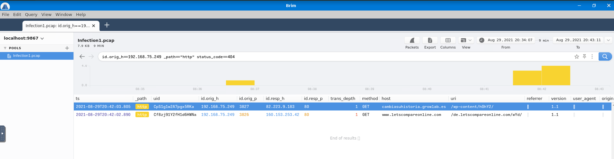 

En filtrant par ip, http et code d'erreur on trouve les adresses.   

Les deux adresses sont : cambiasushistoria.growlabes et www.letscompareonline.com  

**The victim made a successful HTTP connection to one of the domains and received the response_body_len of 1,309 (uncompressed content size of the data transferred from the server). Provide the domain and the destination IP address.**

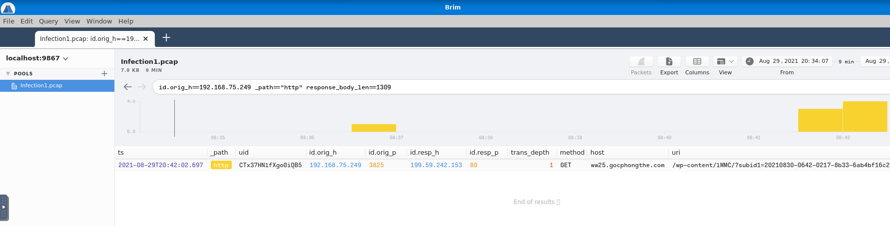 

On filtre par ip, http et par taille.   

Le domaine est : ww25.gocphongthe.com  
La desitnation est : 199.59.242.153   

**How many unique DNS requests were made to cab[.]myfkn[.]com domain (including the capitalized domain)?**

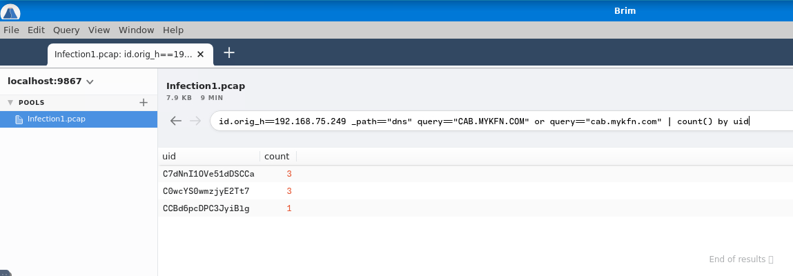   

On filtre les DNS minuscule et majuscule cat.myfkn.com et on les comptes.   

Il y a eu 7 requêtes DNS cat.myfkn.com   

**Provide the URI of the domain bhaktivrind[.]com that the victim reached out over HTTP.**

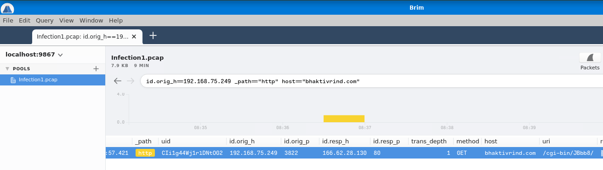   

On filtre avec le nom.  
L'URI du domaine est : /cgi-bin/JBbb8/    

**Provide the IP address of the malicious server and the executable that the victim downloaded from the server.**

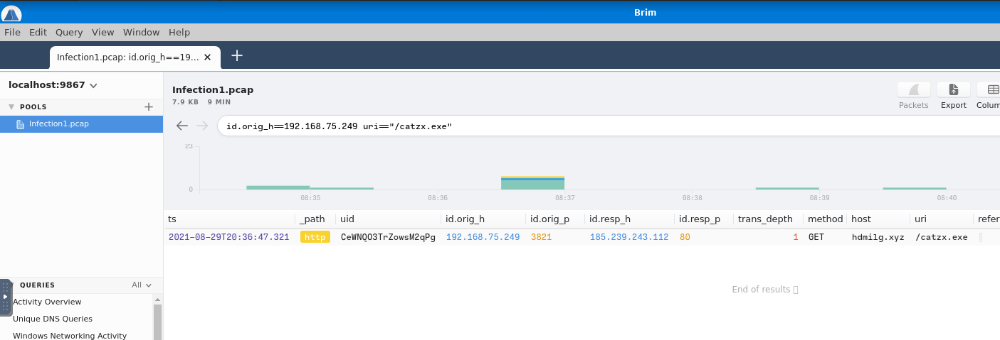  

On regarde des les uri et on trouve un exécutable.   

L'ip qui fournit l'exécutable malicieux est : 185.239.243.112
Le nom de l'exécutable est : catzx.exe

**Based on the information gathered from the second question, provide the name of the malware using VirusTotal.**   

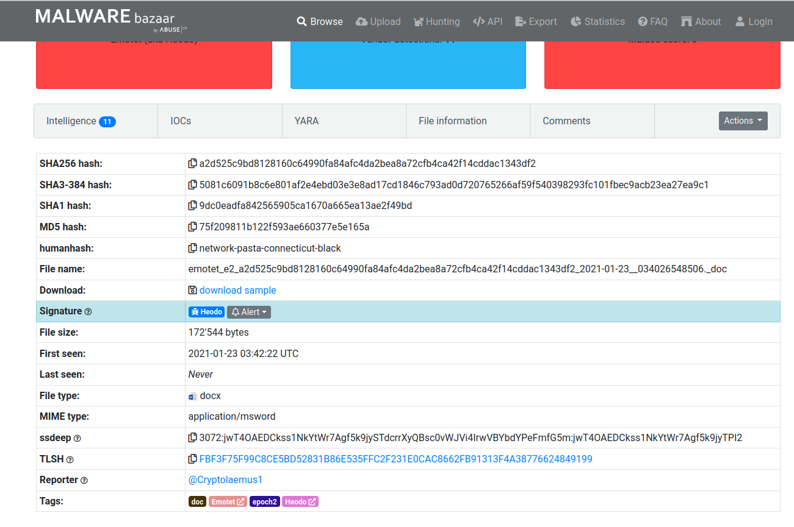

En cherchant sur internet on trouve le nom du malware qui est : emonet   

## Task 3 [Infection 2] ##  

**Provide the IP address of the victim machine.**  

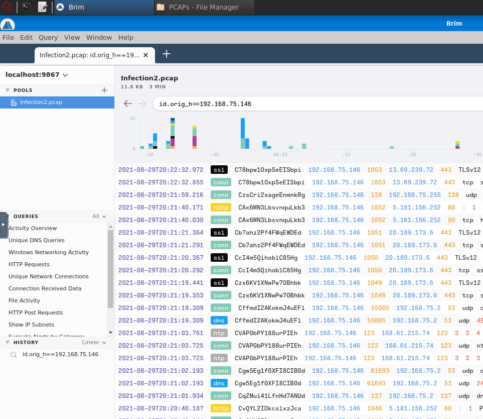   

L'ip de la victime est : 192.168.75.146    

**Provide the IP address the victim made the POST connections to.**

   

On met un filtre sur les requêtes POST et on a l'adresse : 5.181.156.252   

**How many POST connections were made to the IP address in the previous question?**

   

On compte 3 requêtes POST.   

**Provide the domain where the binary was downloaded from.**

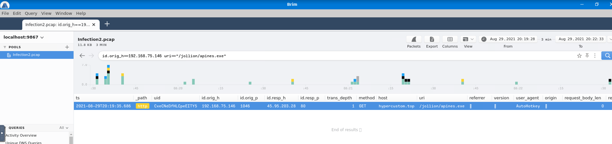   

On voit que alpine.exe a été fournit par : hypercustom.top    

**Provide the name of the binary including the full URI.**   

   

On a déjà trouvé le binaire a la question précédente.   

Le nom complet est : /jollion/apines.exe    

**Provide the IP address of the domain that hosts the binary.**

L'ip du domaine qui héberge le binaire est : 45.95.203.28    

**There were 2 Suricata "A Network Trojan was detected" alerts. What were the source and destination IP addresses?**  

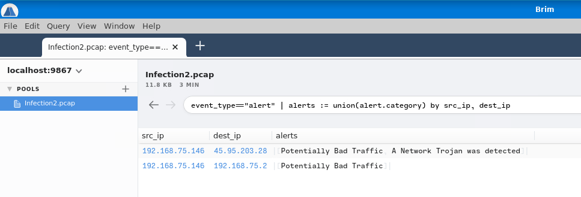 

En cliquant Surica alert Source and Destination, on a les alertes.    
La source est : 192.168.75.146    
La destination est : 45.95.203.28    

**Taking a look at .top domain in HTTP requests, provide the name of the stealer (Trojan that gathers information from a system) involved in this packet capture using URLhaus Database.**

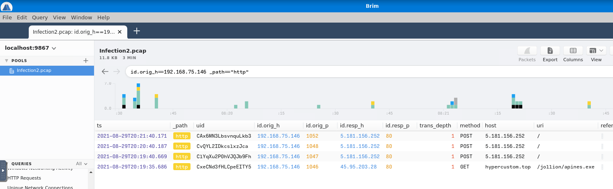   

On trouve le domaine qui est : hypercustom.top  

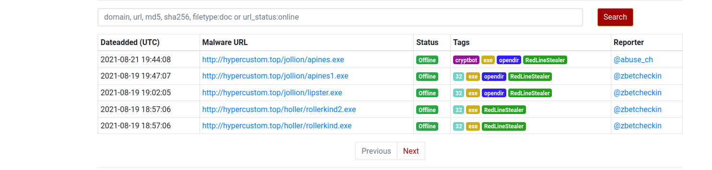   

Le nom du trojan qui vole les données est : RedLine Stealer 

## Task 4 [Infection 3] ##  

**Provide the IP address of the victim machine.**  

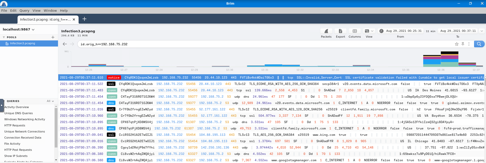  

L'adresse de la victime est : 192.168.75.232  

**Provide three C2 domains from which the binaries were downloaded (starting from the earliest to the latest in the timestamp)**  

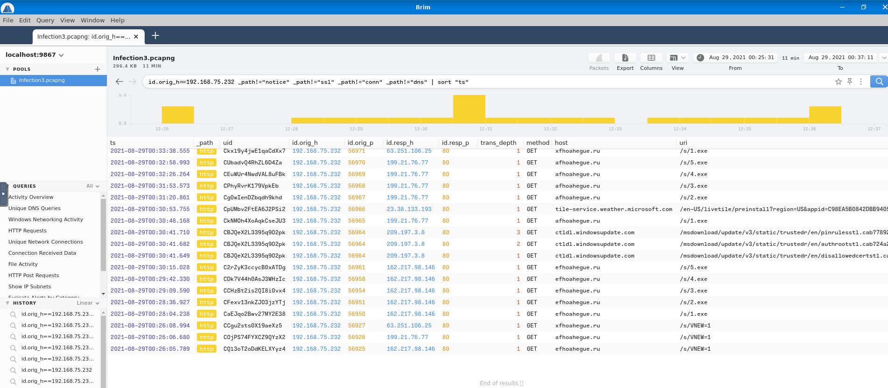  

On regardant les dernières requêtes de domaines les trois dernier sont :   
efhoahegue.ru    
afhoahegue.ru   
xfhoahegue.ru   

**Provide the IP addresses for all three domains in the previous question.**  

  

Les ip des trois domaines ci-dessus sont : 
162.217.98.146
199.21.76.77
63.251.106.25

**How many unique DNS queries were made to the domain associated from the first IP address from the previous answer?**  

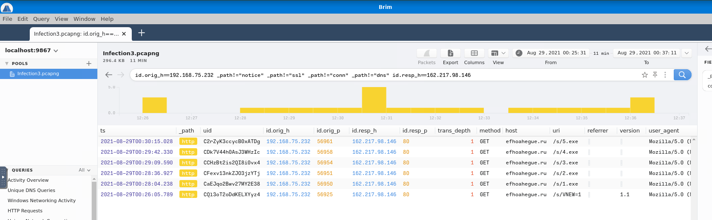  

Je n'ai pas trouvé de solution, je trouve 6 requêtes http et rien dans le DNS.  
J'ai trouvé la réponse en essayant toutes les combinaisons. 
La réponse est : 2 

**How many binaries were downloaded from the above domain in total?**

  

Le nombre de fichier binaire qui on été téléchargé est de : 5  

**Provided the user-agent listed to download the binaries.**

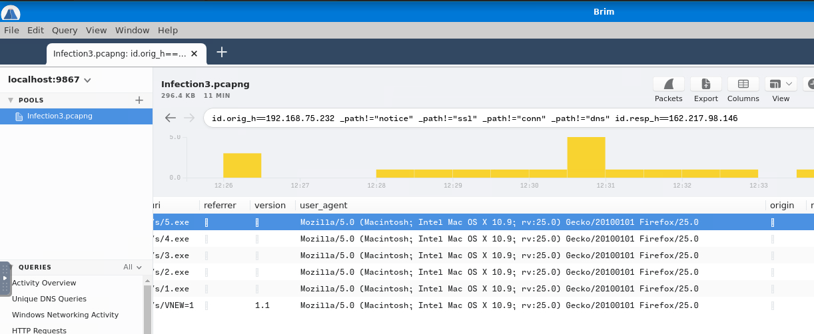  

L'user agent fournit pour télécharger le binaire est : Mozilla/5.0 (Macintosh; Intel Mac OS X 10.9; rv:25.0) Gecko/20100101 Firefox/25.0   

**Provide the amount of DNS connections made in total for this packet capture.**   

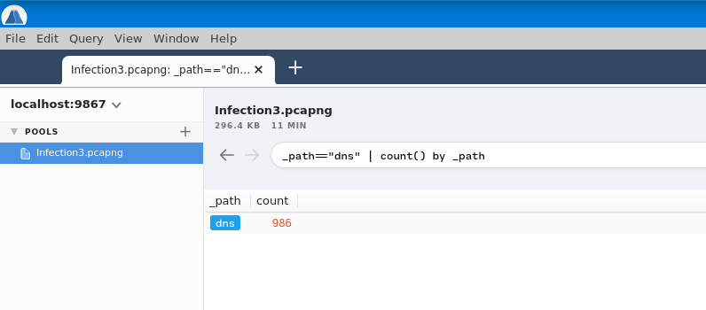  

Le nombre de connexion total de paquet DNS est : 986 

**With some OSINT skills, provide the name of the worm using the first domain you have managed to collect from Question 2. (Please use quotation marks for Google searches, don't use .ru in your search, and DO NOT interact with the domain directly).**

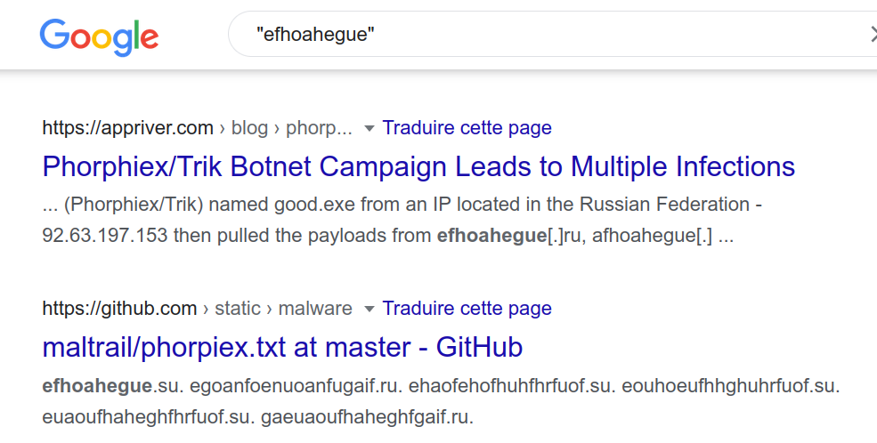  

Eb faisant une recherche sur internet on trouve le ver s'appelle : Phorphiex   
