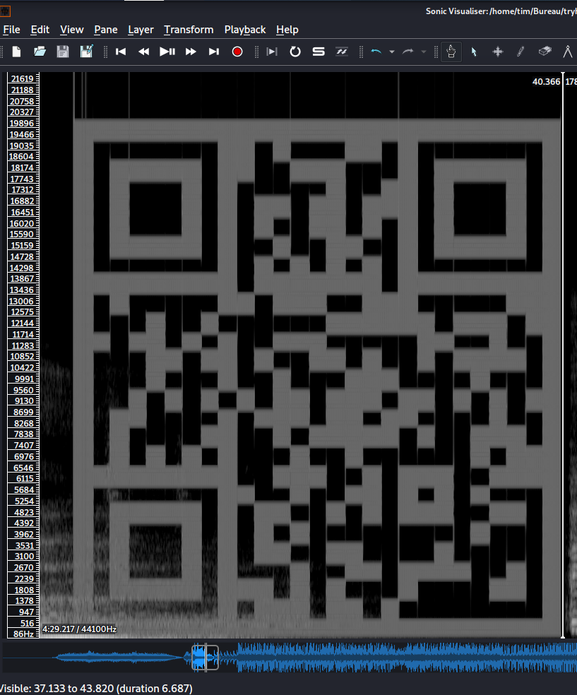
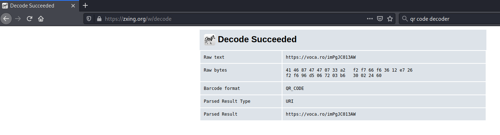
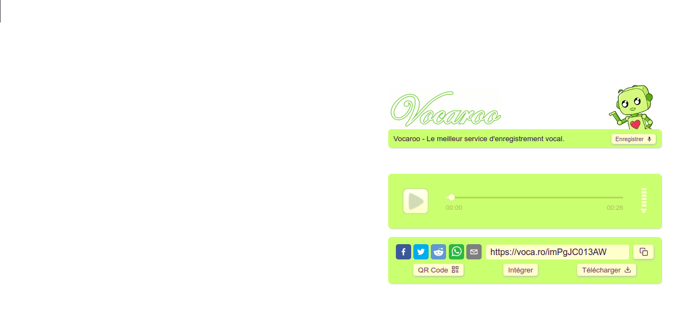
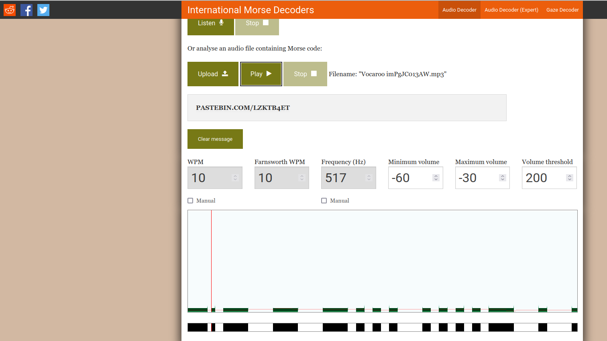
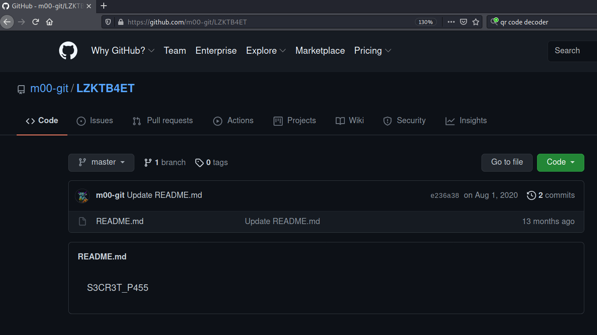

# Musical Stego #

## Answer the questions below ##

**Who remixed the song?**

```bash
tim@kali:~/Bureau/tryhackme/write-up$ exiftool "Language Arts DEF CON 27 The Official Soundtrack .wav" 
ExifTool Version Number         : 12.16
File Name                       : Language Arts DEF CON 27 The Official Soundtrack .wav
Directory                       : .
File Size                       : 45 MiB
File Modification Date/Time     : 2021:08:26 07:50:10+02:00
File Access Date/Time           : 2021:08:26 07:52:36+02:00
File Inode Change Date/Time     : 2021:08:26 07:52:36+02:00
File Permissions                : rwxrwx---
File Type                       : WAV
File Type Extension             : wav
MIME Type                       : audio/x-wav
Encoding                        : Microsoft PCM
Num Channels                    : 2
Sample Rate                     : 44100
Avg Bytes Per Sec               : 176400
Bits Per Sample                 : 16
Title                           : Luckiness (Kilmanjaro Remix)
Product                         : DEF CON 27: The Official Soundtrack
Artist                          : Language Arts
Comment                         : Visit http://defconcommunications.bandcamp.com
Date Created                    : 2019
Duration                        : 0:04:29
```

Avec l'outil exiftool on voit que c'est Kilmanjaro qui a remixé la musique.   

Réponse : Kilmanjaro    

**What link is hiding in the music?**  



On transforme, le son en faisant Layer-\>Add Spectrogram-\>Luckness All Channels.    

Et voit un QR code.   



Avec on téléphone on un site comme [zxing](https://zxing.org/), on décode le QR code.

Le lien est : https://voca.ro/imPgJC013AW     

**What does the found audio convert to? [CHECK HINT, LINK IS DEAD]**



On tombe sur un site qui héberge une séquence de sons qui représente du code morde.   



Avec un site comme [morsecode.world](https://morsecode.world/international/decoder/audio-decoder-adaptive.html), on décode le code morse.  

On trouve un lien passbin.   

La réponse est : https://pastebin.com/LZKTB4ET

On pour continuer l'exercise, il faut prendre le lien dans l'astuce qui est : https://github.com/m00-git/LZKTB4ET

**What was the found password?**



Sur le lien obtenu on trouve le mot de passe qui est : S3CR3T_P455   

**What is the final flag?**

```bash
tim@kali:~/Bureau/tryhackme/write-up$ steghide extract -sf "Language Arts DEF CON 27 The Official Soundtrack .wav" 
Entrez la passphrase: 
�criture des donn�es extraites dans "secret".
tim@kali:~/Bureau/tryhackme/write-up$ cat secret 
THM{f0und_m3!}
```

On extrait les données avec le mot passe trouvé précédemment.    

La réponse est : THM{f0und_m3!}     