# Disk Analysis & Autopsy #

## Task 1 Windows 10 Disk Image ##

**What is the MD5 hash of the E01 image?** 

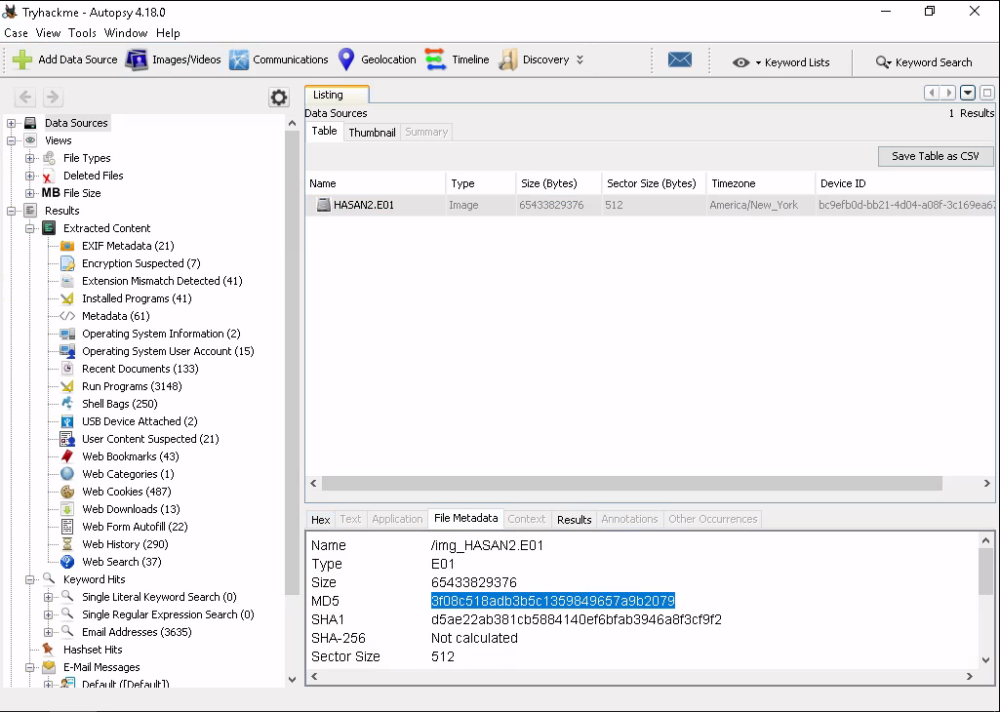   

Dans File Meta data on trouve le hash qui est : 3f08c518adb3b5c1359849657a9b2079  

**What is the computer account name?**  

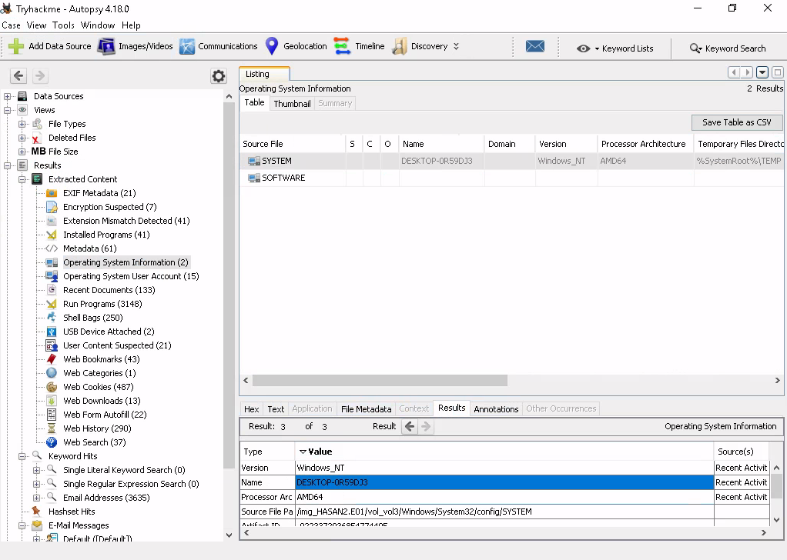   

Dans Operating System information on trouve le nom de l'ordinateur qui est : DESKTOP-0R59DJ3	   

**List all the user accounts. (alphabetical order)**  

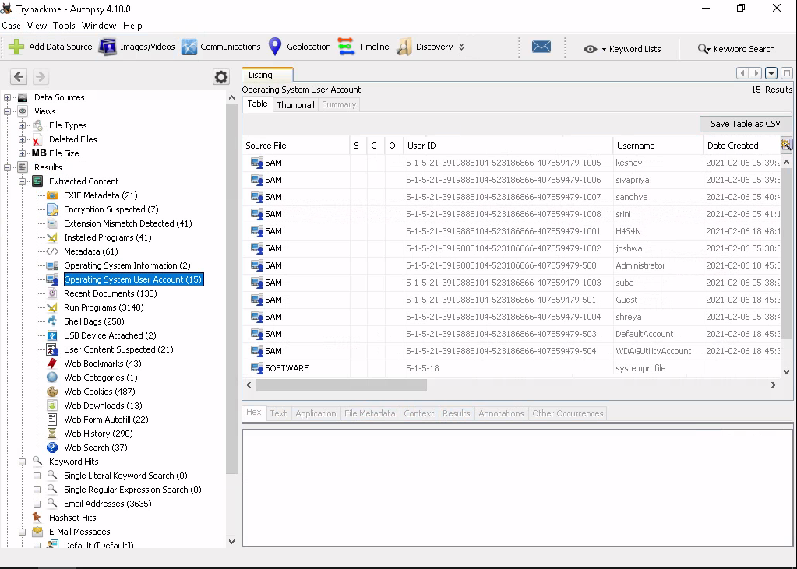   

Les utilisateurs sont dans Operating system user account.  
Les noms sont : H4S4N,joshwa,keskav,sandhya,shreya,sivapriya,srini,suba  

**Who was the last user to log into the computer?**

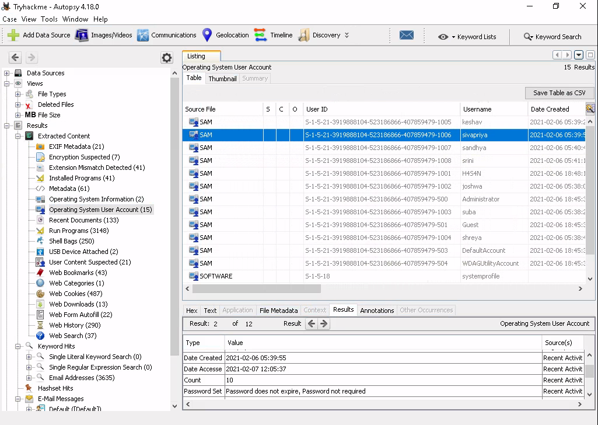

Le dernier utilisateur connecté est : sivapriya   

**What was the IP address of the computer?**

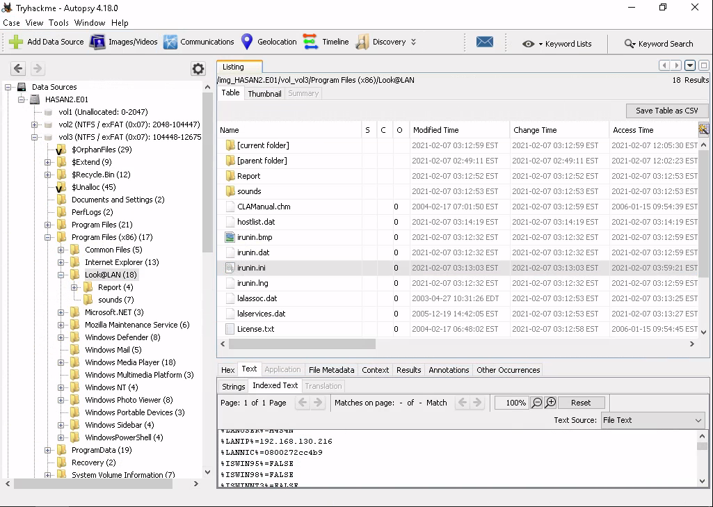

Dans vol3->program files x86->Look@Lan->irunin.ini on trouve l'adresse ip de la machine.  

L'adresse ip de la machine est : 192.168.130.216  

**What was the MAC address of the computer? (XX-XX-XX-XX-XX-XX)**  

Même fichier que la question précédente.  
L'adresse mac est : 08-00-27-2C-C4-B9   

**Name the network cards on this computer.** 

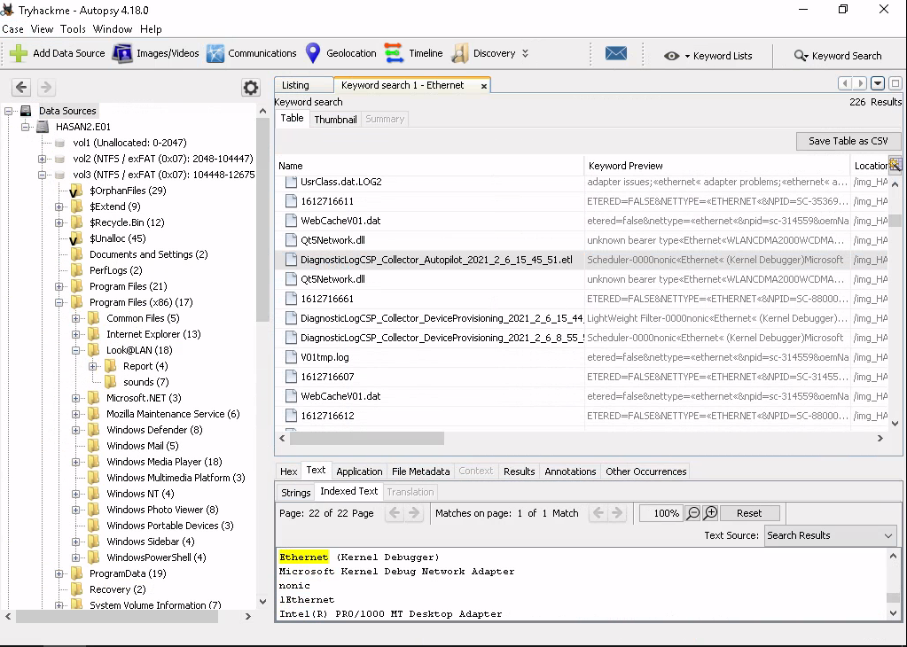

En faisant une recherche avec Ethernet on trouve le nom de la carte réseau.  
Le nom de la carte réseau est : Intel(R) PRO/1000 MT Desktop Adapter   

**What is the name of the network monitoring tool?**

Le nom du logiciel de surveillance est : Look@LAN  

**A user bookmarked a Google Maps location. What are the coordinates of the location?**     

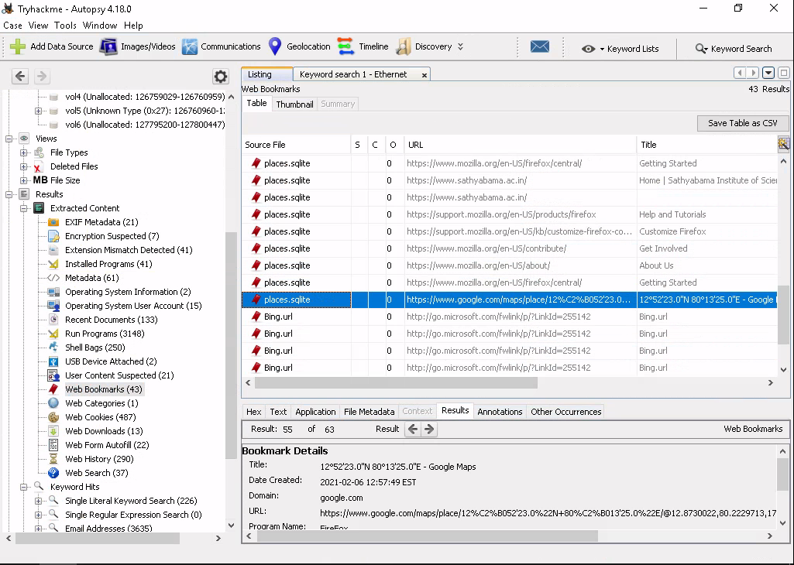

Dans les marques page on trouve la location de Google Maps.  
Les coordonnés sont : 12°52'23.0"N 80°13'25.0"E   

**A user has his full name printed on his desktop wallpaper. What is the user's full name?**  

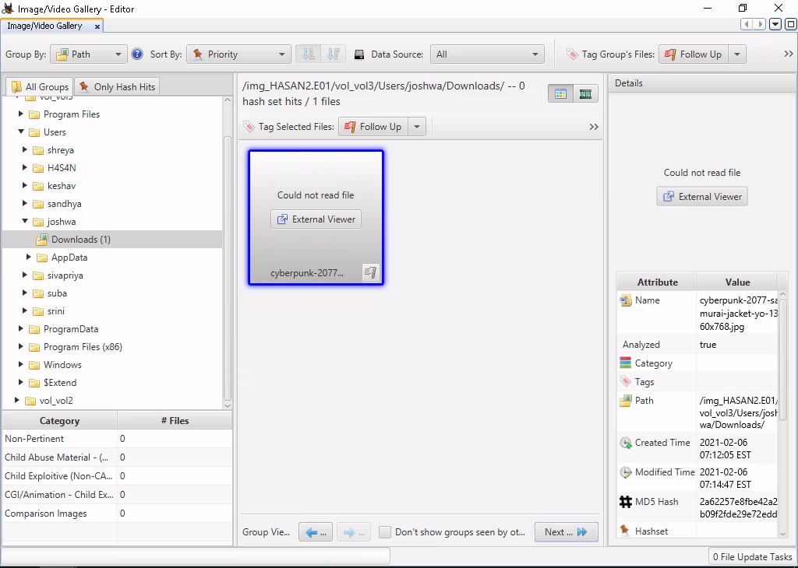 

Normalement on peut lire l'image chez moi ça ne fonctionne pas.  

Le nom complet de l'utilisateur est : Anto Joshwa 

**A user had a file on her desktop. It had a flag but she changed the flag using PowerShell. What was the first flag?**  

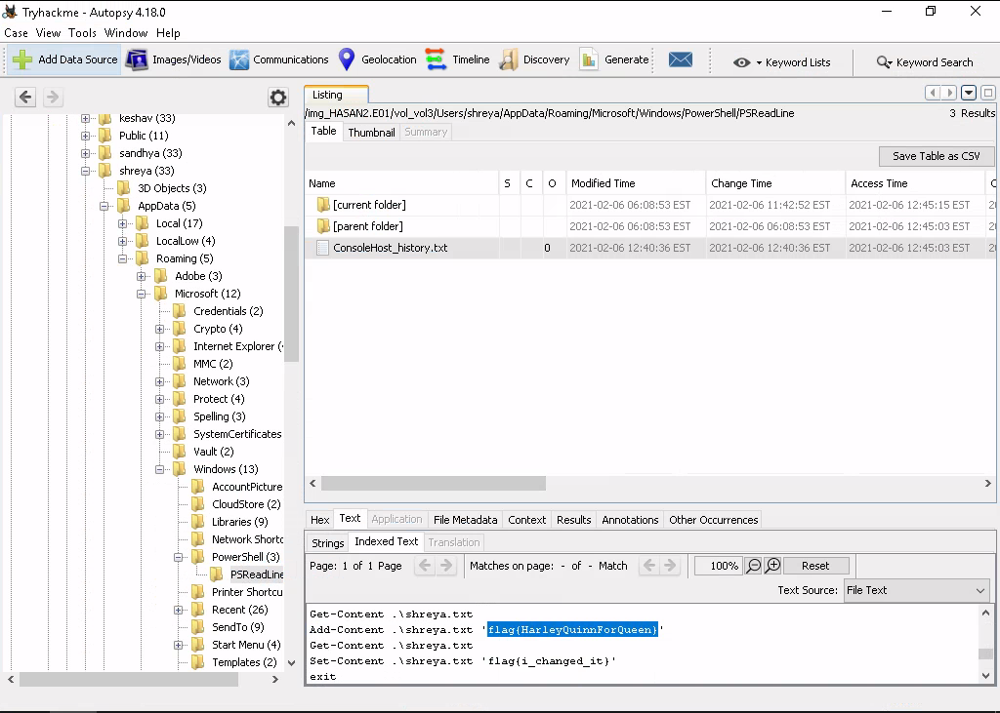 

Dans users->shreya->AppData->Roaming->Microsoft->Windows->PowerShell->PSReadline->ConsolHost_history.txt on trouve le flag.   
Le flag est : flag{HarleyQuinnForQueen} 

**The same user found an exploit to escalate privileges on the computer. What was the message to the device owner?**

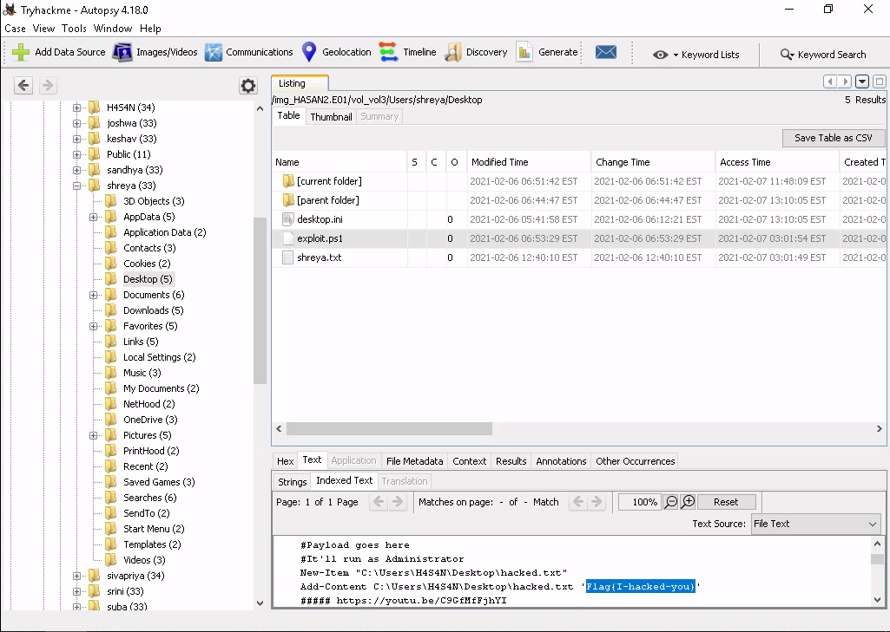 

Dans le bureau de shreya dans exploit.ps1 on trouve l'autre flag.  
Le flag est : flag{I-hacked-you}   

**2 hack tools focused on passwords were found in the system. What are the names of these tools? (alphabetical order)**

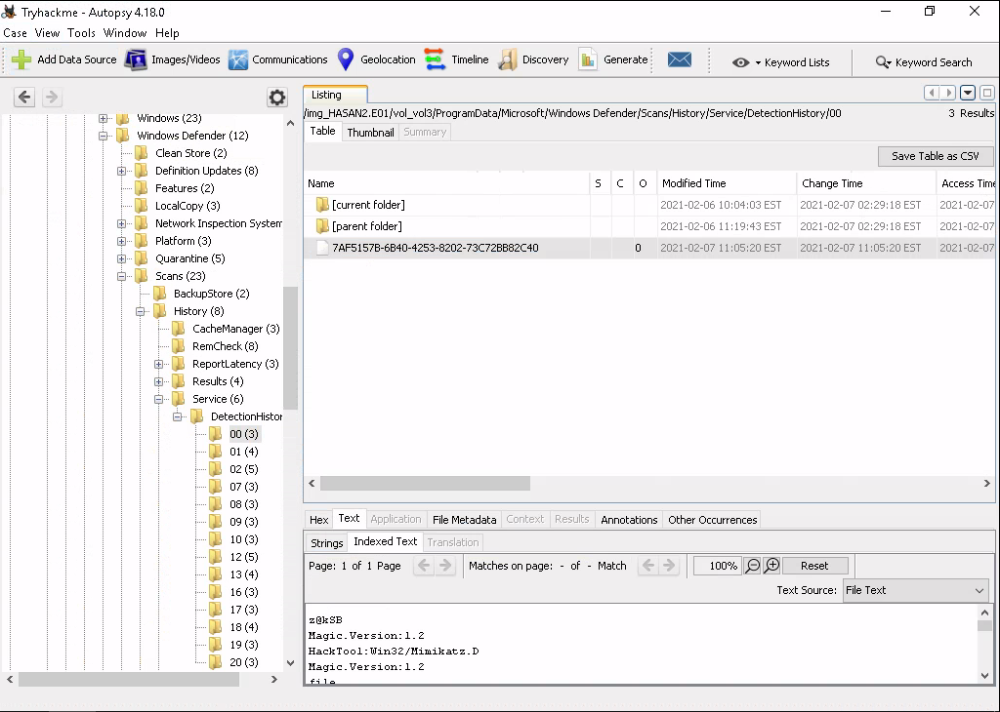

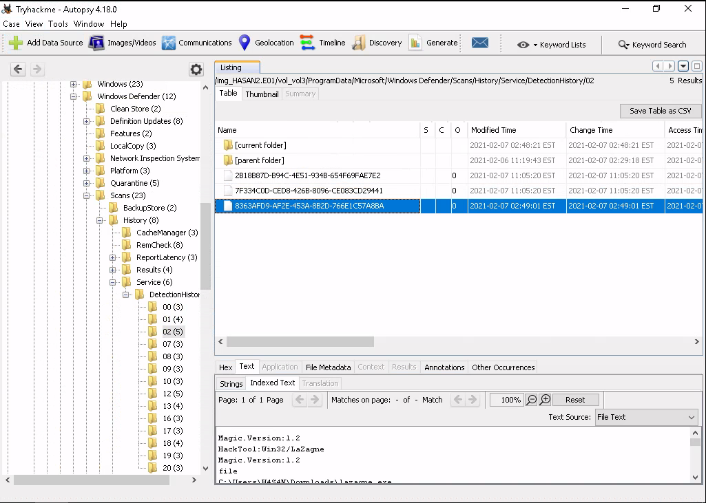 

Windows defender a détecté deux outils de hacking qui se concentre sur les mots de passes.  
Les outils sont : Lazagne, Mimikatz   

**There is a YARA file on the computer. Inspect the file. What is the name of the author?**   

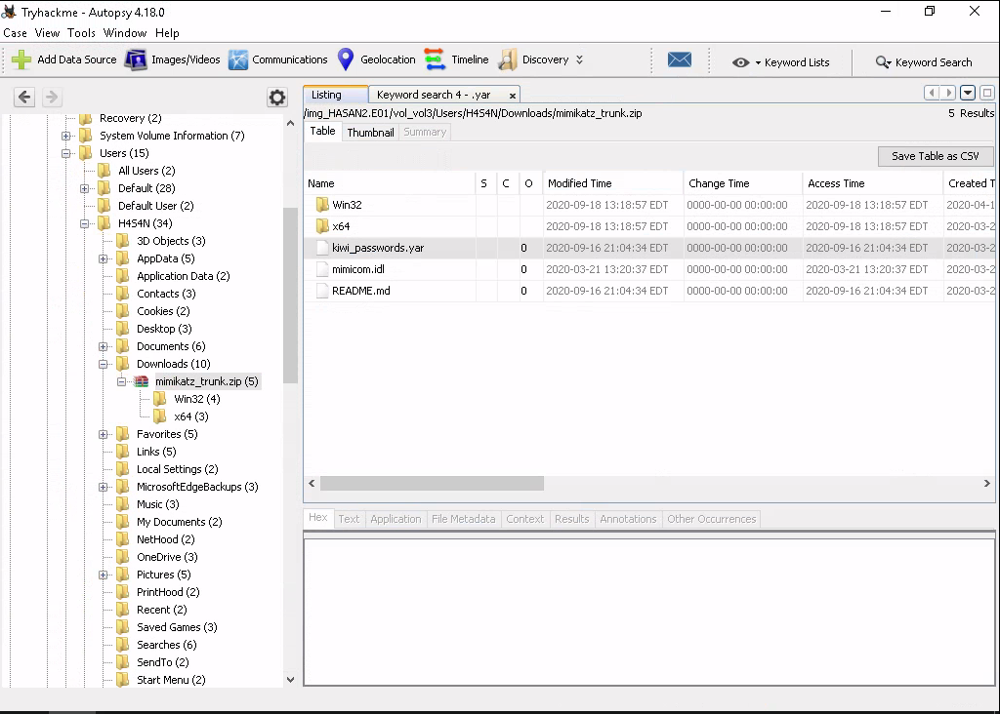 

On chercher .yar on trouve qu'il y a un fichier kiwi_passwords.yar, on le cherche.  
On trouve les informations dans le fichier.   
Le nom du fichier est : Benjamin DELPY (gentilkiwi)  

**One of the users wanted to exploit a domain controller with an MS-NRPC based exploit. What is the filename of the archive that you found? (include the spaces in your answer)**

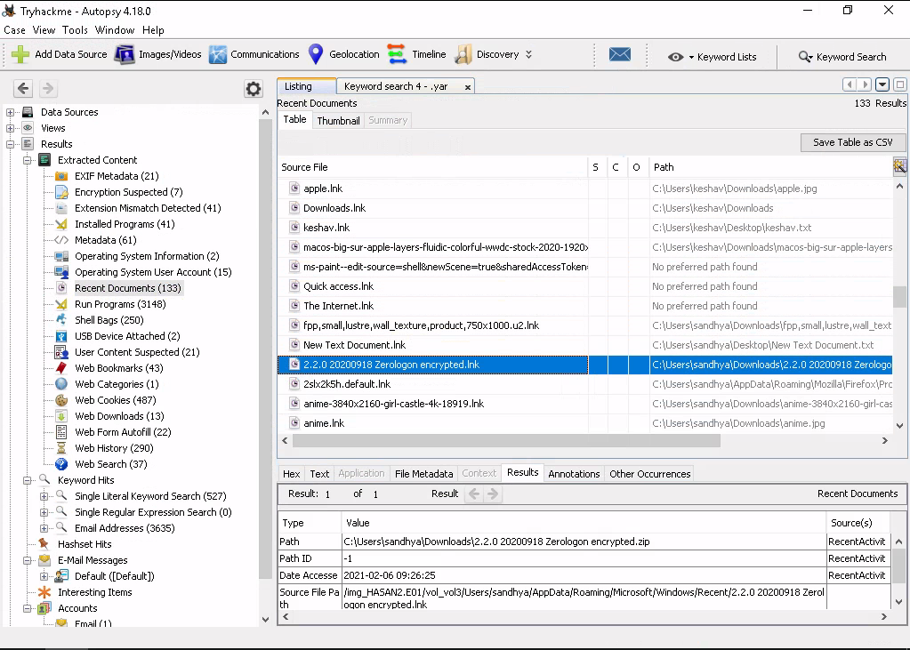 

Dans les documents récents nous trouvons l'exploit.  
L'archive est : 2.2.0 20200918 Zerologon encrypted.zip    