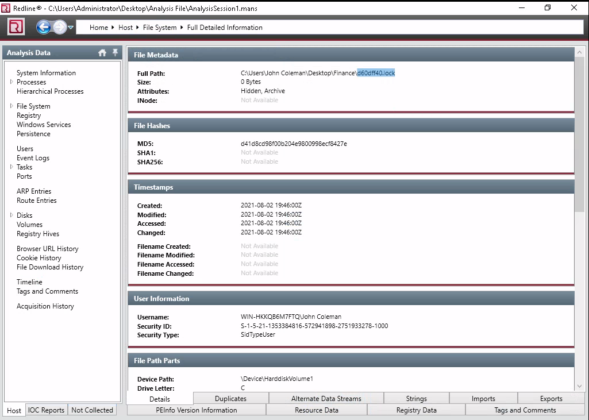

# REvil Corp #

## Task 1 Investigating the Compromised Endpoint ##  

**What is the compromised employee's full name?**

   

Dans les résultats de Redline dans user on trouve que l'employé compromis est : John Coleman   

**What is the operating system of the compromised host?**  

   

Le système d'exploitation de la machine compromis est : Windows 7 Home Premium 7601 Service Pack 1   

**What is the name of the malicious executable that the user opened?**   

   

Le nom de l'exécutable malveillant est : WinRAR2021.exe    

**What is the full URL that the user visited to download the malicious binary? (include the binary as well)**

   

Le lien que l'utilisateur a utilisé est : http://192.168.75.129:4748/Documents/WinRAR2021.exe    

**What is the MD5 hash of the binary?**   

   

Le hash du binaire est : 890a58f200dfff23165df9e1b088e58f   

**What is the size of the binary in kilobytes?**

  

Le taille binaire en kilooctets est : 164   

**What is the extension to which the user's files got renamed?**   

  

On trouve sur le bureau de l'utilisateur un fichier qui a une extension bizarre : .t49s39la    

**What is the number of files that got renamed and changed to that extension?**  

  

Dans Timeline on met l'extension et on coche la case Modified et Changed.  
On a 48 fichiers qui ont été renommé.    

**What is the full path to the wallpaper that got changed by an attacker, including the image name?**

  

On filtrant les fichier avec l'extension bmp on trouve le chemin du fond d'écran.
Le chemin du fond d'écran est : C:\Users\John Coleman\AppData\Local\Temp\hk8.bmp   

**The attacker left a note for the user on the Desktop; provide the name of the note with the extension.**

  

L'attaquant à laissé une note dans le fichier : 48s39la-readme.txt   

**The attacker created a folder "Links for United States" under C:\Users\John Coleman\Favorites\ and left a file there. Provide the name of the file.**  

    

Le nom du fichier laissé dans le répertoire Links for United States est : GobiernoUSA.gov.url.t48s39la   

**There is a hidden file that was created on the user's Desktop that has 0 bytes. Provide the name of the hidden file.**  

   

Le fichier caché qui a été créé est : d60dff40.lock    

**The user downloaded a decryptor hoping to decrypt all the files, but he failed. Provide the MD5 hash of the decryptor file.**

   

Le hash en md5 du déchiffreur est : f617af8c0d276682fdf528bb3e72560b   

**In the ransomware note, the attacker provided a URL that is accessible through the normal browser in order to decrypt one of the encrypted files for free. The user attempted to visit it. Provide the full URL path.**

 

Le lien fournit pour déchiffrer un fichier gratuitement est : http://decryptor.top/644E7C8EFA02FBB7   

**What are some three names associated with the malware which infected this host? (enter the names in alphabetical order)**

Sur le site virustotal on trouve les différents du malware.   
Les noms sont : Revil,Sodin,Sodinokibi  