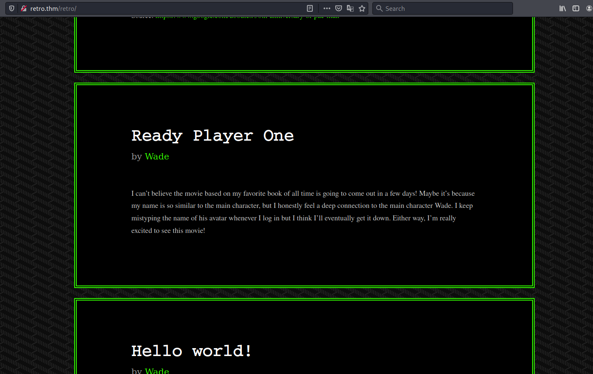
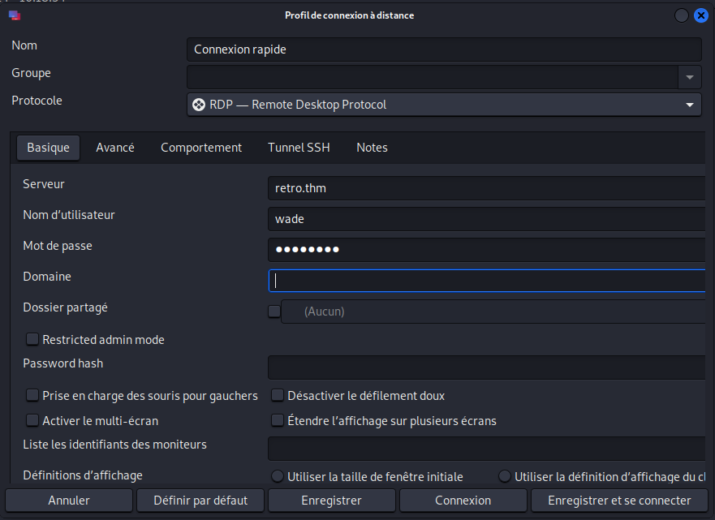
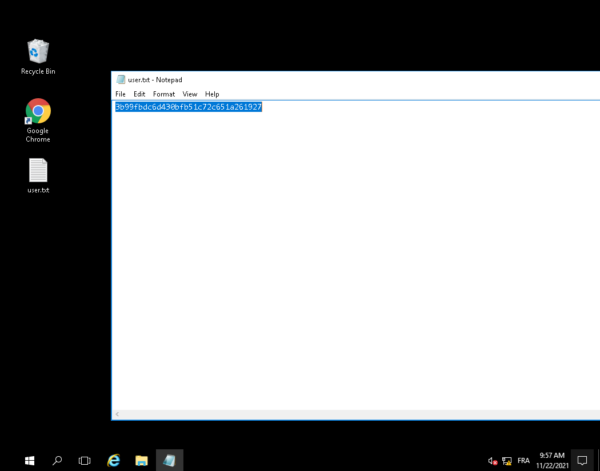
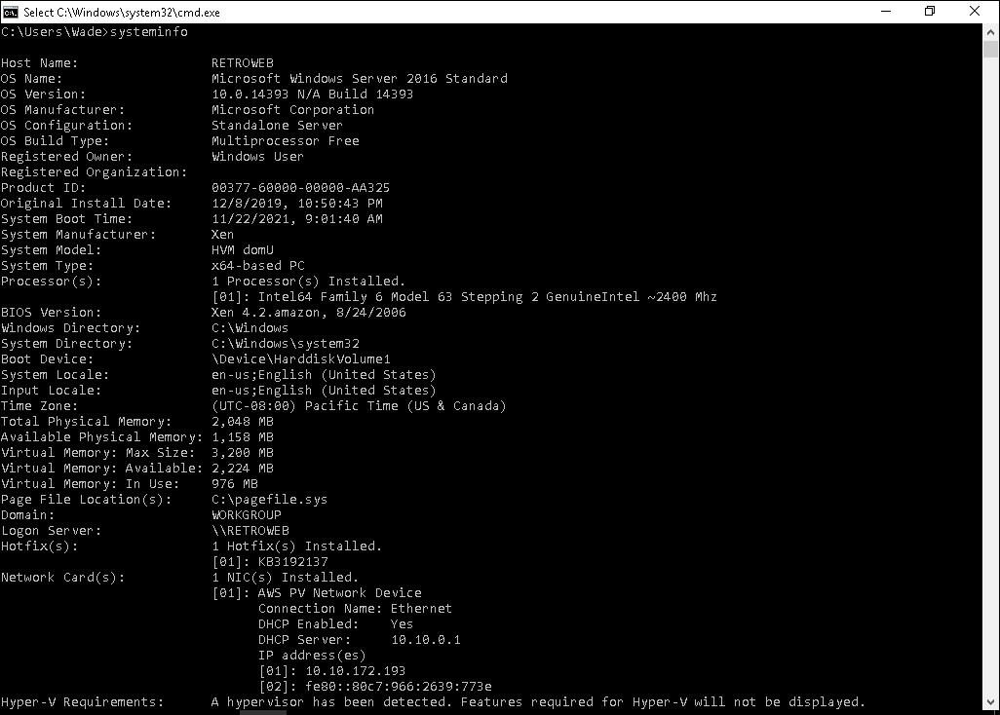
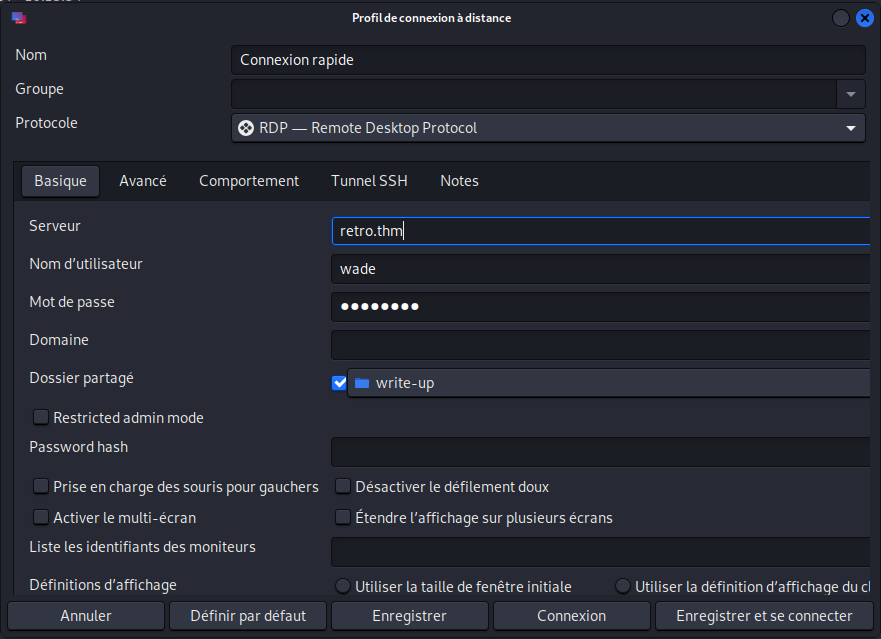
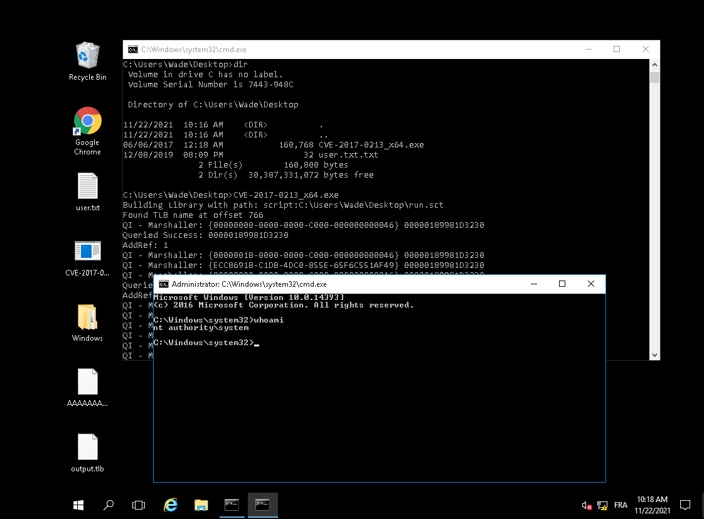
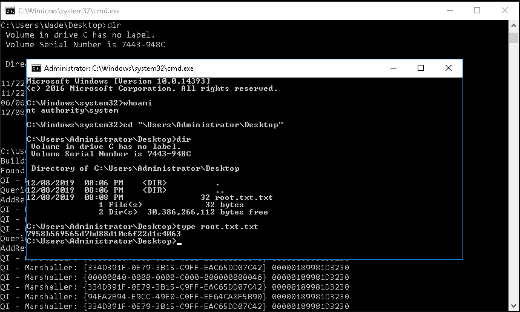

# Retro #  

## Task 1 Pwn ##   

```bash
sudo sh -c "echo '10.10.172.193 retro.thm ' >> /etc/hosts"
tim@kali:~$ nmap_all_no_ping retro.thm
sudo nmap -A retro.thm -p- -Pn
Starting Nmap 7.92 ( https://nmap.org ) at 2021-11-22 18:18 CET
Nmap scan report for retro.thm (10.10.172.193)
Host is up (0.036s latency).
Not shown: 65533 filtered tcp ports (no-response)
PORT     STATE SERVICE       VERSION
80/tcp   open  http          Microsoft IIS httpd 10.0
| http-methods: 
|_  Potentially risky methods: TRACE
|_http-title: IIS Windows Server
|_http-server-header: Microsoft-IIS/10.0
3389/tcp open  ms-wbt-server Microsoft Terminal Services
|_ssl-date: 2021-11-22T17:20:56+00:00; 0s from scanner time.
| ssl-cert: Subject: commonName=RetroWeb
| Not valid before: 2021-11-21T17:02:30
|_Not valid after:  2022-05-23T17:02:30
| rdp-ntlm-info: 
|   Target_Name: RETROWEB
|   NetBIOS_Domain_Name: RETROWEB
|   NetBIOS_Computer_Name: RETROWEB
|   DNS_Domain_Name: RetroWeb
|   DNS_Computer_Name: RetroWeb
|   Product_Version: 10.0.14393
|_  System_Time: 2021-11-22T17:20:55+00:00
Warning: OSScan results may be unreliable because we could not find at least 1 open and 1 closed port
Device type: general purpose
Running (JUST GUESSING): Microsoft Windows 2012|2016 (90%), FreeBSD 6.X (85%)
OS CPE: cpe:/o:microsoft:windows_server_2012:r2 cpe:/o:microsoft:windows_server_2016 cpe:/o:freebsd:freebsd:6.2
Aggressive OS guesses: Microsoft Windows Server 2012 R2 (90%), Microsoft Windows Server 2016 (89%), FreeBSD 6.2-RELEASE (85%)
No exact OS matches for host (test conditions non-ideal).
Network Distance: 2 hops
Service Info: OS: Windows; CPE: cpe:/o:microsoft:windows

TRACEROUTE (using port 3389/tcp)
HOP RTT      ADDRESS
1   35.16 ms 10.9.0.1
2   35.37 ms retro.thm (10.10.172.193)

OS and Service detection performed. Please report any incorrect results at https://nmap.org/submit/ .
Nmap done: 1 IP address (1 host up) scanned in 157.63 seconds
```

nmap nous montre plusieurs services qui sont :  
Le service HTTP sur le port 80.   
Le service ms-wbt-server sur le port 3389.    

**A web server is running on the target. What is the hidden directory which the website lives on?**  

```bash
tim@kali:~/Bureau/tryhackme/write-up$ gobuster_medium retro.thm
gobuster dir -u http://retro.thm -w /usr/share/dirbuster/wordlists/directory-list-2.3-medium.txt -t 100 -q
/retro                (Status: 301) [Size: 146] [--> http://retro.thm/retro/]
/Retro                (Status: 301) [Size: 146] [--> http://retro.thm/Retro/]
```

Avec gobuster on voit que le répertoire caché est /retro   

**user.txt**  

   

Dans la page retro on trouve un commentaire qui dit que le mot de passe est le nom de l'avatar de wade dans le film ready player one.   

Le nom de l'avatar est : Parzival   

   

On se connecte sur le contrôle à distance de windows avec les identifiants : wade:parzival   

 

Sur le bureau on trouve un fichier user.txt.
On l'ouvre avec notepad et on trouve le flag qui est : 3b99fbdc6d430bfb51c72c651a261927   

**root.txt**  

 

On regarde les informations du système d'exploitation, on est sur la version : OS Version:                10.0.14393 N/A Build 14393  


```bash
tim@kali:~/Bureau/tryhackme/write-up$ wget https://github.com/SecWiki/windows-kernel-exploits/raw/master/CVE-2017-0213/CVE-2017-0213_x64.zip -nv 
2021-11-22 19:07:22 URL:https://raw.githubusercontent.com/SecWiki/windows-kernel-exploits/master/CVE-2017-0213/CVE-2017-0213_x64.zip [83287/83287] -> "CVE-2017-0213_x64.zip" [1]
```

On trouve l'exploit CVE-2017-0213_x64 qui permet d'avoir un accès root.  
On le télécharge.  

```bash
tim@kali:~/Bureau/tryhackme/write-up$ unzip CVE-2017-0213_x64.zip 
Archive:  CVE-2017-0213_x64.zip
  inflating: CVE-2017-0213_x64.exe   

```

   

On décompresse la fichier zip.   
On partage le dossier.   

   

On copie l'exploit sur bureau.  
On exécute l'exploit et on a un shell avec les droit administrateur.   

   

Dans le bureau de l'administrateur on trouve le fichier root.txt.txt  
On le lit et on a le flag qui est : 7958b569565d7bd88d10c6f22d1c4063   